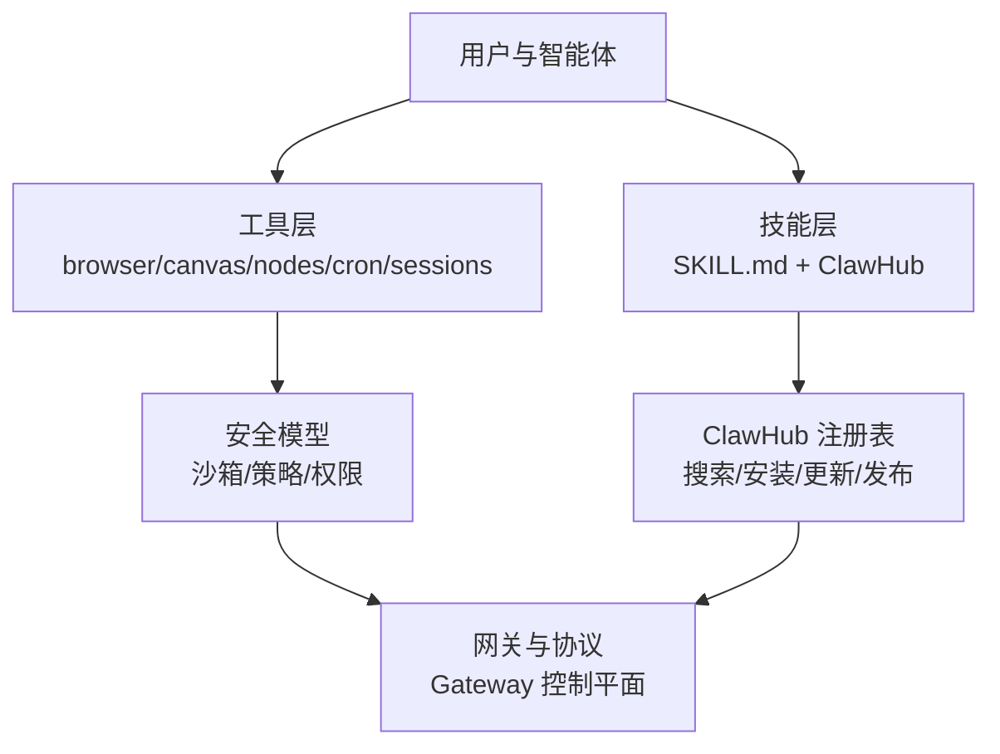
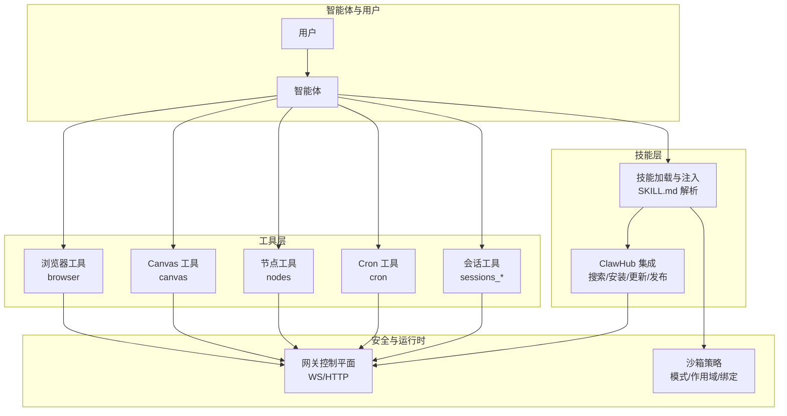
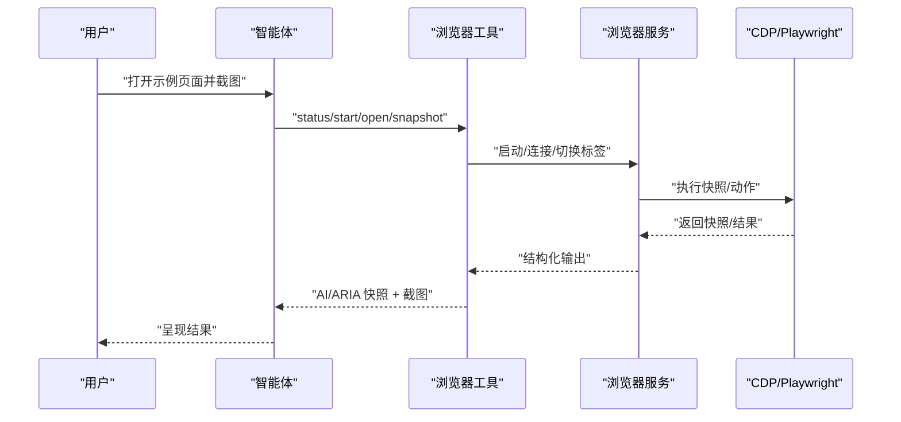
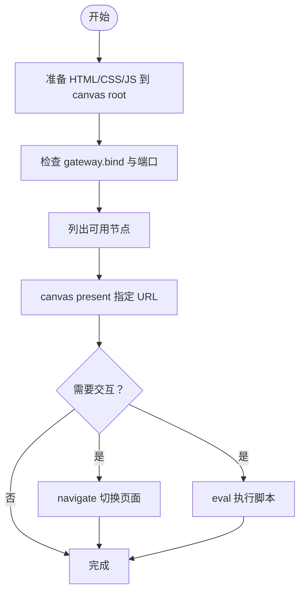
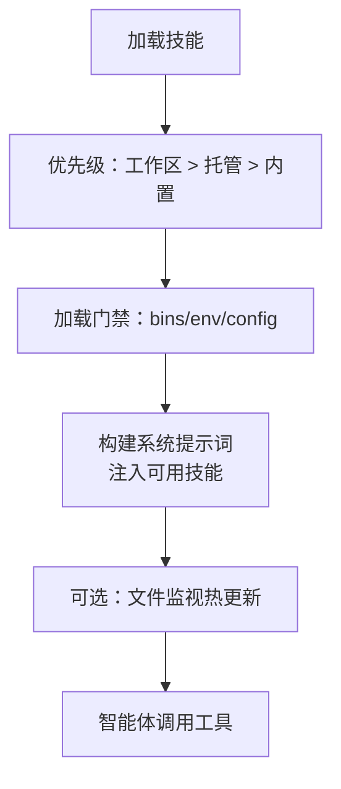
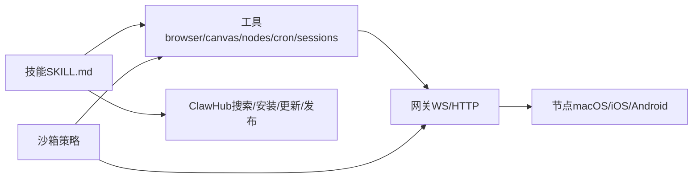

# 工具和技能系统

<cite>
**本文引用的文件**
- [README.md](file://README.md)
- [docs/tools/index.md](file://docs/tools/index.md)
- [docs/tools/skills.md](file://docs/tools/skills.md)
- [docs/tools/browser.md](file://docs/tools/browser.md)
- [docs/gateway/sandboxing.md](file://docs/gateway/sandboxing.md)
- [docs/tools/skills-config.md](file://docs/tools/skills-config.md)
- [docs/tools/clawhub.md](file://docs/tools/clawhub.md)
- [docs/tools/creating-skills.md](file://docs/tools/creating-skills.md)
- [skills/canvas/SKILL.md](file://skills/canvas/SKILL.md)
- [skills/clawhub/SKILL.md](file://skills/clawhub/SKILL.md)
- [extensions/lobster/SKILL.md](file://extensions/lobster/SKILL.md)
</cite>

## 目录
1. [简介](#简介)
2. [项目结构](#项目结构)
3. [核心组件](#核心组件)
4. [架构总览](#架构总览)
5. [详细组件分析](#详细组件分析)
6. [依赖关系分析](#依赖关系分析)
7. [性能考量](#性能考量)
8. [故障排查指南](#故障排查指南)
9. [结论](#结论)
10. [附录](#附录)

## 简介
本文件系统性梳理 OpenClaw 的“工具与技能系统”，覆盖以下主题：
- 内置工具：浏览器控制、Canvas 操作、节点（Nodes）管理、Cron 作业、会话工具（Sessions）等
- 技能平台：技能注册表（ClawHub）、技能安装与管理、自定义技能开发与最佳实践
- 安全模型：沙箱机制、执行限制、权限与隔离策略
- 使用示例与工作流：面向使用者与开发者的关键步骤与参考路径

OpenClaw 将“工具”作为一等公民暴露给智能体，替代旧版 openclaw-* 技能；同时通过“技能”体系提供可组合、可治理的能力扩展。

章节来源
- file://README.md#L1-L560

## 项目结构
围绕工具与技能系统，仓库中与之直接相关的内容主要分布在如下位置：
- 文档目录 docs/tools 与 docs/gateway：工具与安全策略的权威说明
- skills 与 extensions：内置技能与插件技能的实现范式
- 根 README：总体能力概览与导航

章节来源
- file://README.md#L126-L176
- file://docs/tools/index.md#L1-L574
- file://docs/tools/skills.md#L1-L303

## 核心组件
- 工具层（Tools）
  - 浏览器控制：多配置文件、本地/远程 CDP、Playwright 驱动、快照与动作
  - Canvas：可视化展示、A2UI 推送、截图、节点桥接
  - 节点（Nodes）：设备发现、通知、摄像头/屏幕录制、位置、系统命令
  - Cron：任务调度与唤醒事件
  - 会话工具：跨会话查询、发送消息、派生子代理
- 技能平台（Skills）
  - 三类来源：内置、托管（~/.openclaw/skills）、工作区（workspace/skills）
  - 加载与过滤：基于元数据的二进制/环境/配置门禁
  - ClawHub：公共注册表，支持搜索、安装、更新、发布
- 安全模型（Sandboxing）
  - 模式：off/non-main/all
  - 作用域：session/agent/shared
  - 工作区访问：none/ro/rw
  - 绑定挂载、网络策略、setupCommand、容器镜像

章节来源
- file://docs/tools/index.md#L11-L574
- file://docs/tools/skills.md#L11-L303
- file://docs/gateway/sandboxing.md#L1-L260

## 架构总览
下图展示了工具与技能在系统中的交互关系与边界：

图表来源
- [docs/tools/index.md](file://docs/tools/index.md#L11-L574)
- [docs/tools/skills.md](file://docs/tools/skills.md#L11-L303)
- [docs/gateway/sandboxing.md](file://docs/gateway/sandboxing.md#L1-L260)

章节来源
- file://docs/tools/index.md#L11-L574
- file://docs/tools/skills.md#L11-L303
- file://docs/gateway/sandboxing.md#L1-L260

## 详细组件分析

### 浏览器控制（Browser）
- 功能要点
  - 多配置文件：openclaw（隔离）、chrome（扩展中继）、remote CDP
  - 本地/远程控制：Loopback 服务 + CDP；Node 主机代理；远程 CDP/WebSocket
  - Playwright 驱动：快照、元素截图、PDF、动作（点击/输入/拖拽/选择）
  - 安全策略：SSRF 策略、私有网络访问、令牌与凭据
- 常见用法
  - 启动/状态/标签页/打开/聚焦/关闭
  - 快照（AI/ARIA）、截图、PDF、上传/对话框/等待
  - Cookie/Storage/地理/媒体/时区/语言/设备设置
- 安全与隐私
  - evaluate/等待函数执行任意 JS，建议按需启用
  - 远程 CDP 强大，应加密与短时效令牌
  - openclaw 配置文件可能包含登录态，注意保密

图表来源
- [docs/tools/browser.md](file://docs/tools/browser.md#L36-L674)

章节来源
- file://docs/tools/browser.md#L10-L674

### Canvas（可视化展示）
- 功能要点
  - Canvas Host（HTTP 服务器）+ Node Bridge（TCP）+ 节点应用（Mac/iOS/Android）
  - URL 结构与 Tailscale 集成：根据 gateway.bind 决定绑定地址与访问 URL
  - 支持 present/hide/navigate/eval/snapshot 等动作
  - Live Reload：文件变更自动刷新
- 典型流程
  - 准备 HTML/CSS/JS 文件到 canvas root
  - 获取节点列表与可用 Canvas 节点
  - 通过 canvas 工具 present 指定 URL
  - 可选 navigate/snapshot/hide

图表来源
- [skills/canvas/SKILL.md](file://skills/canvas/SKILL.md#L1-L199)

章节来源
- file://skills/canvas/SKILL.md#L1-L199

### 节点（Nodes）管理
- 功能要点
  - 发现与描述：status/describe
  - 配对：pending/approve/reject
  - 设备能力：通知、系统命令、摄像头/剪辑、屏幕录制、位置、通知列表/操作
- 使用建议
  - 在执行敏感操作前先 status/describe 确认权限
  - macOS 上的 system.run 需要前台与权限

章节来源
- file://docs/tools/index.md#L348-L383

### Cron 作业与唤醒
- 功能要点
  - 状态查询、任务增删改查、立即运行、查看历史
  - 与网关心跳/系统事件联动
- 使用建议
  - 使用 run 查看最近执行情况
  - wake 可触发系统事件并可选立即心跳

章节来源
- file://docs/tools/index.md#L434-L448

### 会话工具（Sessions）
- 功能要点
  - sessions_list：按类型/时间/消息数筛选
  - sessions_history：拉取会话历史（可限制消息数）
  - sessions_send：向目标会话发送消息（支持回环与公告）
  - sessions_spawn：派生子代理/ACP 运行，支持附件、超时、线程绑定
- 安全与可见性
  - 默认仅当前会话树可见；共享代理场景可限制为 self
  - 沙箱模式下对会话工具可见性有约束

章节来源
- file://docs/tools/index.md#L470-L508

### 技能平台（Skills）
- 来源与优先级
  - 工作区技能（最高）→ 托管技能（~/.openclaw/skills）→ 内置技能（最低）
  - 插件可自带 skills 目录，参与优先级规则
- 加载与过滤（Gate）
  - metadata.openclaw.requires：PATH 中二进制、环境变量或配置项
  - os/primaryEnv/install 等字段用于 UI 与安装提示
  - 沙箱内二进制需在容器中存在，可通过 setupCommand 或自定义镜像解决
- 配置与注入
  - skills.entries.<key>：启用/禁用、env/apiKey、自定义配置
  - per-agent 覆盖：agents.list[].tools.profile 等
- ClawHub 集成
  - 搜索/安装/更新/发布/同步
  - 默认安装到工作区 skills 目录，下个会话生效

图表来源
- [docs/tools/skills.md](file://docs/tools/skills.md#L13-L303)
- [docs/tools/skills-config.md](file://docs/tools/skills-config.md#L1-L78)

章节来源
- file://docs/tools/skills.md#L11-L303
- file://docs/tools/skills-config.md#L1-L78

### ClawHub（技能注册表）
- 功能
  - 公共注册表：浏览、搜索、版本化、下载、星标/评论、举报/审核
  - CLI：登录、搜索、安装、更新、发布、同步
- 工作流
  - 搜索 → 安装 → 新建会话生效
  - 更新：基于内容哈希匹配，支持强制覆盖
  - 同步：扫描本地技能并发布新版本

章节来源
- file://docs/tools/clawhub.md#L1-L258

### 自定义技能开发指南
- 步骤
  - 创建目录与 SKILL.md（YAML frontmatter + 指南）
  - 可选：定义工具或指导智能体使用现有工具
  - 刷新/重启使新技能生效
- 最佳实践
  - 简洁明确地描述意图，避免过度 AI 化指令
  - 安全优先：若涉及 bash，避免任意命令注入
  - 本地测试：使用 openclaw agent --message 验证

章节来源
- file://docs/tools/creating-skills.md#L1-L59

### 插件技能示例：Lobster
- 场景
  - 多步骤工作流、审批检查点、可恢复执行
- 行为
  - run 返回结构化结果；需要审批时返回 resumeToken
  - 支持管道式组合（如 gog.gmail.search | email.triage）

章节来源
- file://extensions/lobster/SKILL.md#L1-L98

## 依赖关系分析
- 工具与网关
  - browser/canvas/nodes/cron/sessions 等工具通过网关 WS/HTTP 与节点通信
  - 远程 CDP/Node 代理降低对本地浏览器的依赖
- 技能与工具
  - 技能通过 SKILL.md 教导智能体如何调用工具
  - ClawHub 提供技能分发与版本化
- 安全与工具
  - 沙箱模式影响工具执行位置（host/sandbox/node），并限制文件系统与网络
  - elevated/exec 为显式逃逸通道，受工具策略与 per-agent 配置约束

图表来源
- [docs/tools/index.md](file://docs/tools/index.md#L11-L574)
- [docs/tools/skills.md](file://docs/tools/skills.md#L11-L303)
- [docs/gateway/sandboxing.md](file://docs/gateway/sandboxing.md#L1-L260)

章节来源
- file://docs/tools/index.md#L11-L574
- file://docs/tools/skills.md#L11-L303
- file://docs/gateway/sandboxing.md#L1-L260

## 性能考量
- 技能列表注入成本
  - 采用紧凑 XML 列表注入系统提示词，字符开销可估算
  - 建议在不需要时减少技能数量，或使用更细粒度的工具策略
- 浏览器快照与动作
  - Playwright 需要时才启用，避免不必要的资源消耗
  - 角色快照（interactive/compact/depth）可按需选择以平衡密度与体积
- 沙箱与网络
  - 默认无网络容器可降低外部依赖带来的不确定性
  - setupCommand 一次性安装依赖，避免每次运行重复安装

章节来源
- file://docs/tools/skills.md#L269-L286
- file://docs/tools/browser.md#L522-L532
- file://docs/gateway/sandboxing.md#L148-L198

## 故障排查指南
- 浏览器
  - “浏览器已禁用”：检查配置并重启网关
  - Linux 特有问题：参考浏览器故障排查文档
  - WSL2 + Windows Chrome：参考跨主机 CDP 故障排查
  - 快照/动作失败：重做快照、高亮定位、查看错误/请求日志、录制 trace
- Canvas
  - 白屏/内容不加载：核对 gateway.bind 与实际 URL；确保使用完整主机名而非 localhost
  - 节点未连接：确认节点在线并具备 Canvas 能力
  - Live Reload 不生效：检查 liveReload 开关、文件是否在根目录、日志是否有 watcher 错误
- 技能
  - 未出现于提示词：检查 metadata.openclaw.requires 是否满足（PATH/环境/配置）
  - 沙箱内不可用：确认二进制在容器中存在，或通过 setupCommand 安装
- 沙箱
  - 网络不可达：默认容器无网络；按需配置 docker.network 或允许特定出站
  - 绑定挂载风险：避免危险宿主路径；敏感数据只读

章节来源
- file://docs/tools/browser.md#L647-L674
- file://skills/canvas/SKILL.md#L151-L199
- file://docs/tools/skills.md#L106-L187
- file://docs/gateway/sandboxing.md#L148-L232

## 结论
OpenClaw 的工具与技能系统以“工具即一等公民”的理念，结合“技能即能力”的组织方式，提供了：
- 可靠且可审计的工具调用面（浏览器、Canvas、节点、Cron、会话）
- 可发现、可安装、可更新、可发布的技能生态（ClawHub）
- 清晰的安全边界与可调优的沙箱策略
- 明确的开发与运维最佳实践

对于使用者，建议从工具策略与技能优先级入手，逐步引入所需能力；对于开发者，建议遵循 SKILL.md 规范与 Gate 门禁，配合沙箱与最小权限原则进行安全设计。

## 附录
- 快速参考
  - 浏览器：status/start/open/snapshot/act/screenshot/pdf
  - Canvas：present/hide/navigate/eval/snapshot
  - Nodes：status/describe/notify/run/camera/screen
  - Cron：status/list/add/update/remove/run/runs/wake
  - Sessions：list/history/send/spawn/status
- 安全建议
  - 优先使用沙箱；对 elevated/exec 严格管控
  - 远程 CDP 与令牌妥善保管；尽量使用短时效与加密通道
  - 对第三方技能保持审慎，阅读 SKILL.md 并评估权限范围