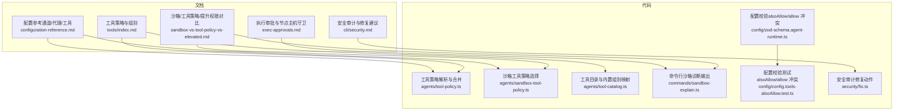
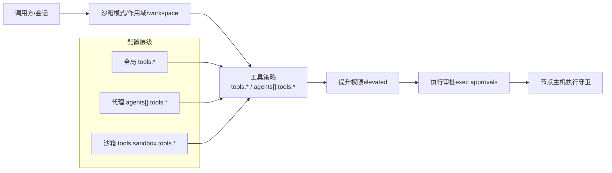
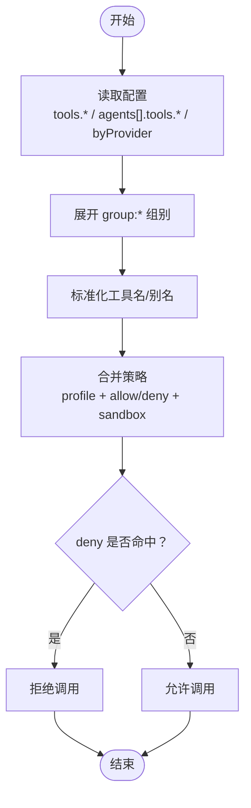
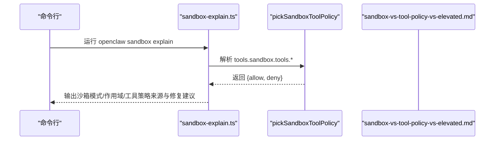
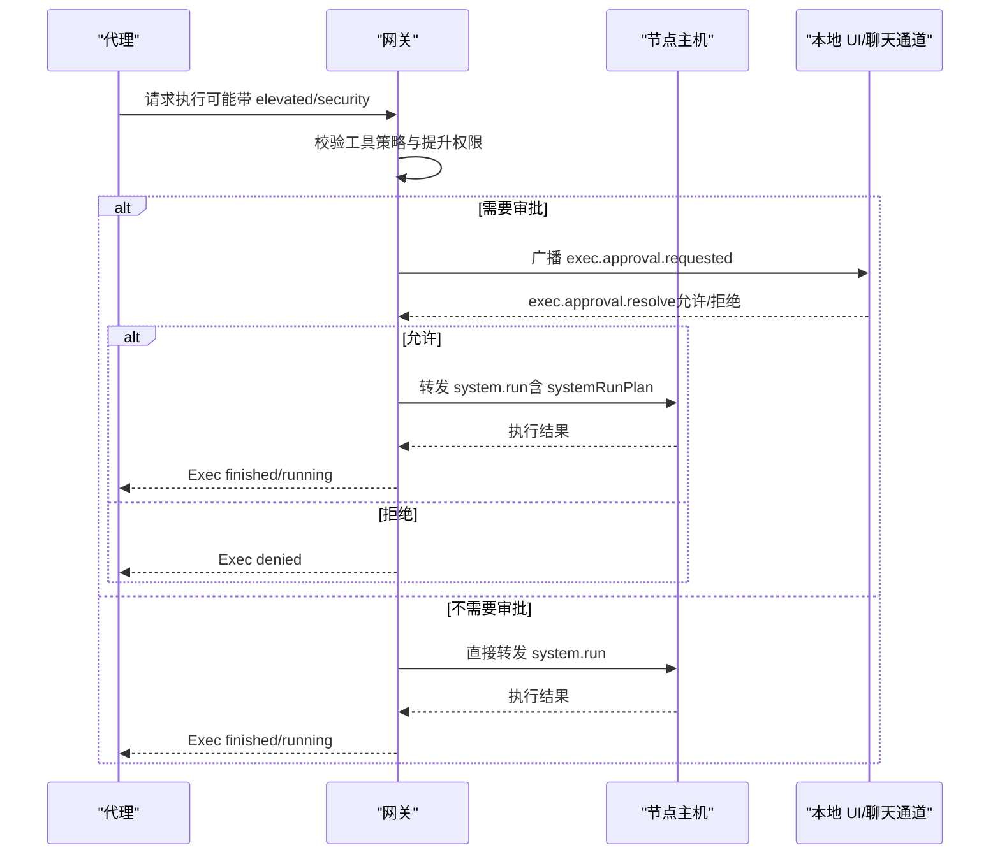
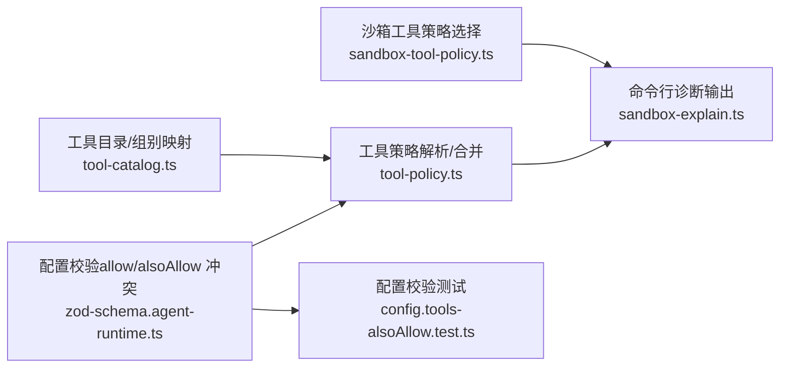

# 工具策略和权限

<cite>
**本文引用的文件**
- [sandbox-vs-tool-policy-vs-elevated.md](file://docs/gateway/sandbox-vs-tool-policy-vs-elevated.md)
- [exec-approvals.md](file://docs/tools/exec-approvals.md)
- [tools/index.md](file://docs/tools/index.md)
- [configuration-reference.md](file://docs/gateway/configuration-reference.md)
- [sandbox-explain.ts](file://src/commands/sandbox-explain.ts)
- [sandbox-tool-policy.ts](file://src/agents/sandbox-tool-policy.ts)
- [tool-policy.ts](file://src/agents/tool-policy.ts)
- [tool-catalog.ts](file://src/agents/tool-catalog.ts)
- [config.tools-alsoAllow.test.ts](file://src/config/config.tools-alsoAllow.test.ts)
- [zod-schema.agent-runtime.ts](file://src/config/zod-schema.agent-runtime.ts)
- [security.md](file://docs/cli/security.md)
- [fix.ts](file://src/security/fix.ts)
</cite>

## 目录
1. [简介](#简介)
2. [项目结构](#项目结构)
3. [核心组件](#核心组件)
4. [架构总览](#架构总览)
5. [详细组件分析](#详细组件分析)
6. [依赖关系分析](#依赖关系分析)
7. [性能考量](#性能考量)
8. [故障排查指南](#故障排查指南)
9. [结论](#结论)
10. [附录](#附录)

## 简介
本文件系统性阐述 OpenClaw 的工具策略与权限体系，覆盖以下主题：
- 工具允许列表与拒绝列表的配置层级：全局、代理级别、提供程序特定
- 工具组别（group:*）的使用与内置组别说明
- 权限分层控制机制：最小权限原则、沙箱限制、提升权限模式与执行审批流程
- 配置示例与安全最佳实践

## 项目结构
围绕工具策略与权限的关键文档与代码分布如下：
- 文档侧：工具策略、沙箱与提升权限的关系、执行审批、配置参考
- 代码侧：工具策略解析与合并、沙箱工具策略选择、命令行诊断输出

图表来源
- [tools/index.md](file://docs/tools/index.md#L1-L574)
- [sandbox-vs-tool-policy-vs-elevated.md](file://docs/gateway/sandbox-vs-tool-policy-vs-elevated.md#L1-L129)
- [exec-approvals.md](file://docs/tools/exec-approvals.md#L1-L379)
- [configuration-reference.md](file://docs/gateway/configuration-reference.md#L1-L800)
- [tool-policy.ts](file://src/agents/tool-policy.ts#L1-L206)
- [sandbox-tool-policy.ts](file://src/agents/sandbox-tool-policy.ts#L1-L37)
- [tool-catalog.ts](file://src/agents/tool-catalog.ts#L1-L327)
- [sandbox-explain.ts](file://src/commands/sandbox-explain.ts#L218-L267)
- [zod-schema.agent-runtime.ts](file://src/config/zod-schema.agent-runtime.ts#L252-L260)
- [config.tools-alsoAllow.test.ts](file://src/config/config.tools-alsoAllow.test.ts#L1-L52)
- [security.md](file://docs/cli/security.md#L1-L72)
- [fix.ts](file://src/security/fix.ts#L319-L385)

章节来源
- [tools/index.md](file://docs/tools/index.md#L1-L574)
- [sandbox-vs-tool-policy-vs-elevated.md](file://docs/gateway/sandbox-vs-tool-policy-vs-elevated.md#L1-L129)
- [exec-approvals.md](file://docs/tools/exec-approvals.md#L1-L379)
- [configuration-reference.md](file://docs/gateway/configuration-reference.md#L1-L800)
- [tool-policy.ts](file://src/agents/tool-policy.ts#L1-L206)
- [sandbox-tool-policy.ts](file://src/agents/sandbox-tool-policy.ts#L1-L37)
- [tool-catalog.ts](file://src/agents/tool-catalog.ts#L1-L327)
- [sandbox-explain.ts](file://src/commands/sandbox-explain.ts#L218-L267)
- [zod-schema.agent-runtime.ts](file://src/config/zod-schema.agent-runtime.ts#L252-L260)
- [config.tools-alsoAllow.test.ts](file://src/config/config.tools-alsoAllow.test.ts#L1-L52)
- [security.md](file://docs/cli/security.md#L1-L72)
- [fix.ts](file://src/security/fix.ts#L319-L385)

## 核心组件
- 工具策略解析与合并
  - 支持工具名标准化、组别展开、插件组别扩展、也允许叠加、以及对仅核心工具的白名单剥离保护
- 沙箱工具策略
  - 在沙箱运行时，从全局/代理/沙箱配置中选择并合并 allow/deny
- 执行审批与提升权限
  - 提升权限（elevated）用于在沙箱内绕过工具策略但受执行审批约束；执行审批提供节点主机守卫
- 组别与内置工具目录
  - 定义 group:* 到具体工具的映射，包含 runtime、fs、sessions、memory、web、ui、automation、messaging、nodes、openclaw 等

章节来源
- [tool-policy.ts](file://src/agents/tool-policy.ts#L1-L206)
- [sandbox-tool-policy.ts](file://src/agents/sandbox-tool-policy.ts#L1-L37)
- [tool-catalog.ts](file://src/agents/tool-catalog.ts#L1-L327)
- [exec-approvals.md](file://docs/tools/exec-approvals.md#L1-L379)
- [sandbox-vs-tool-policy-vs-elevated.md](file://docs/gateway/sandbox-vs-tool-policy-vs-elevated.md#L1-L129)

## 架构总览
OpenClaw 的工具权限由三层协同决定：沙箱运行环境、工具策略（允许/拒绝）、提升权限与执行审批。

图表来源
- [sandbox-vs-tool-policy-vs-elevated.md](file://docs/gateway/sandbox-vs-tool-policy-vs-elevated.md#L10-L114)
- [exec-approvals.md](file://docs/tools/exec-approvals.md#L10-L41)
- [tools/index.md](file://docs/tools/index.md#L15-L164)

## 详细组件分析

### 工具策略与组别（group:*）
- 允许列表与拒绝列表
  - 全局：tools.allow / tools.deny
  - 代理级：agents[].tools.allow / agents[].tools.deny
  - 提供程序特定：tools.byProvider[provider].allow/deny 或 tools.byProvider[provider/model].allow/deny
  - 沙箱内：tools.sandbox.tools.allow/deny
- 组别（group:*）
  - 支持在 allow/deny 中直接使用 group:*，自动展开为多个具体工具
  - 常用内置组别：runtime、fs、sessions、memory、web、ui、automation、messaging、nodes、openclaw
- 配置优先级与规则
  - deny 总是优先于 allow
  - 若 allow 非空，则默认阻断其他工具
  - 工具策略是硬性拦截，/exec 无法绕过被拒绝的工具
  - provider 键支持 provider 与 provider/model 两种形式

图表来源
- [tools/index.md](file://docs/tools/index.md#L32-L164)
- [tool-policy.ts](file://src/agents/tool-policy.ts#L70-L87)
- [tool-catalog.ts](file://src/agents/tool-catalog.ts#L261-L278)

章节来源
- [tools/index.md](file://docs/tools/index.md#L32-L164)
- [tool-catalog.ts](file://src/agents/tool-catalog.ts#L261-L278)
- [tool-policy.ts](file://src/agents/tool-policy.ts#L70-L87)

### 沙箱工具策略（仅沙箱生效）
- 仅当 agents.defaults.sandbox.mode 不为 off 时生效
- 通过 tools.sandbox.tools.allow/deny 与 agents[].tools.sandbox.tools.* 控制
- pickSandboxToolPolicy 将 allow/alsoAllow 合并为 allow，并保留 deny
- 命令行 sandbox explain 可输出当前生效的沙箱工具策略来源与建议修复项

图表来源
- [sandbox-explain.ts](file://src/commands/sandbox-explain.ts#L218-L267)
- [sandbox-tool-policy.ts](file://src/agents/sandbox-tool-policy.ts#L21-L37)
- [sandbox-vs-tool-policy-vs-elevated.md](file://docs/gateway/sandbox-vs-tool-policy-vs-elevated.md#L34-L129)

章节来源
- [sandbox-tool-policy.ts](file://src/agents/sandbox-tool-policy.ts#L1-L37)
- [sandbox-explain.ts](file://src/commands/sandbox-explain.ts#L218-L267)
- [sandbox-vs-tool-policy-vs-elevated.md](file://docs/gateway/sandbox-vs-tool-policy-vs-elevated.md#L34-L129)

### 提升权限（elevated）与执行审批
- 提升权限不授予额外工具，仅影响 exec 的执行位置与是否跳过审批
  - 沙箱内：/elevated on 或 exec elevated:true → host 执行（仍受审批）
  - /elevated full → 跳过 exec 审批（严格模式下仍受策略约束）
  - 已直连运行时，elevated 为无操作（仍受门禁）
- 执行审批（exec approvals）
  - 本地节点主机上的安全互锁：策略 + 白名单 + 用户确认三者一致才放行
  - 支持 per-agent 白名单、安全级别（deny/allowlist/full）、提示策略（off/on-miss/always）、回退策略
  - 支持“自动允许技能 CLI”与 stdin-only 安全二进制（safeBins）两类快速路径
  - 支持将审批提示转发到聊天通道并用 /approve 回复

图表来源
- [exec-approvals.md](file://docs/tools/exec-approvals.md#L10-L41)
- [exec-approvals.md](file://docs/tools/exec-approvals.md#L252-L280)
- [exec-approvals.md](file://docs/tools/exec-approvals.md#L338-L352)

章节来源
- [exec-approvals.md](file://docs/tools/exec-approvals.md#L10-L41)
- [exec-approvals.md](file://docs/tools/exec-approvals.md#L83-L136)
- [exec-approvals.md](file://docs/tools/exec-approvals.md#L252-L379)

### 最小权限原则与安全边界
- 最小权限原则
  - 默认最小化工具集，按需通过 tools.profile 与 allow/deny 精细授权
  - 使用 group:* 快速组合常用能力，避免遗漏关键工具
- 沙箱限制
  - 通过 agents.defaults.sandbox.mode 控制运行环境（off/non-main/all）
  - 绑定挂载（docker.binds）与 workspaceAccess 独立控制，注意默认读写风险
- 提升权限与审批
  - elevated 不改变工具可用性，仅影响执行位置与审批要求
  - 对高危场景建议保持 full 审批或 deny 级别，谨慎启用 elevated

章节来源
- [sandbox-vs-tool-policy-vs-elevated.md](file://docs/gateway/sandbox-vs-tool-policy-vs-elevated.md#L10-L114)
- [tools/index.md](file://docs/tools/index.md#L32-L80)

### 配置示例与最佳实践
- 全局配置
  - 使用 tools.profile 设置基础允许集，再用 tools.allow/deny 微调
  - 使用 tools.byProvider 针对特定提供程序收紧工具集
- 代理级别配置
  - agents.list[].tools.profile/allow/deny 覆盖全局默认
  - agents.list[].tools.sandbox.tools.* 限定沙箱内的工具集合
- 提供程序特定配置
  - tools.byProvider[provider] 或 tools.byProvider[provider/model] 仅能收窄，不能扩大
- 组别使用
  - 使用 group:openclaw 获取所有内置 OpenClaw 工具集合
  - 常见组合：group:fs + group:runtime + group:sessions + group:memory
- 安全最佳实践
  - deny 优先：先 deny 不必要的工具，再 allow 明确需要的
  - 沙箱默认开启：对 group/channel 场景使用 non-main 或 all
  - 提升权限谨慎：除非必要，避免 elevated/full
  - 执行审批：在 allowlist 模式下严格管理白名单，必要时启用 safeBins
  - 审计与修复：定期运行 openclaw security audit 并应用安全修复

章节来源
- [tools/index.md](file://docs/tools/index.md#L32-L164)
- [sandbox-vs-tool-policy-vs-elevated.md](file://docs/gateway/sandbox-vs-tool-policy-vs-elevated.md#L52-L129)
- [exec-approvals.md](file://docs/tools/exec-approvals.md#L83-L136)
- [security.md](file://docs/cli/security.md#L17-L72)

## 依赖关系分析
- 工具策略解析依赖工具目录中的组别映射与内置工具清单
- 沙箱工具策略选择依赖全局/代理/沙箱配置的合并
- 命令行诊断输出依赖上述策略与提升权限状态的聚合
- 配置校验确保 allow 与 alsoAllow 在同一作用域不同时设置

图表来源
- [tool-catalog.ts](file://src/agents/tool-catalog.ts#L261-L278)
- [tool-policy.ts](file://src/agents/tool-policy.ts#L1-L206)
- [sandbox-tool-policy.ts](file://src/agents/sandbox-tool-policy.ts#L1-L37)
- [sandbox-explain.ts](file://src/commands/sandbox-explain.ts#L218-L267)
- [zod-schema.agent-runtime.ts](file://src/config/zod-schema.agent-runtime.ts#L252-L260)
- [config.tools-alsoAllow.test.ts](file://src/config/config.tools-alsoAllow.test.ts#L1-L52)

章节来源
- [tool-catalog.ts](file://src/agents/tool-catalog.ts#L261-L278)
- [tool-policy.ts](file://src/agents/tool-policy.ts#L1-L206)
- [sandbox-tool-policy.ts](file://src/agents/sandbox-tool-policy.ts#L1-L37)
- [sandbox-explain.ts](file://src/commands/sandbox-explain.ts#L218-L267)
- [zod-schema.agent-runtime.ts](file://src/config/zod-schema.agent-runtime.ts#L252-L260)
- [config.tools-alsoAllow.test.ts](file://src/config/config.tools-alsoAllow.test.ts#L1-L52)

## 性能考量
- 工具策略解析与组别展开为纯内存计算，开销极低
- 沙箱策略选择仅在沙箱模式下生效，避免不必要的容器切换成本
- 执行审批涉及本地 IPC 与节点主机交互，应合理设置提示策略以减少用户等待

## 故障排查指南
- 常见问题与修复
  - “工具 X 被沙箱工具策略阻止”：关闭沙箱或在 tools.sandbox.tools.allow/deny 中调整
  - “误以为 main 会直连却被沙箱”：切换到 main 会话键或调整 agents.defaults.sandbox.mode
  - “/exec 未生效”：/exec 仅调整会话默认值，不授予工具访问；需结合工具策略与提升权限
- 诊断工具
  - 使用 openclaw sandbox explain 查看生效的沙箱模式、作用域、工具策略来源与修复建议
  - 使用 openclaw security audit 进行安全审计与可选修复
- 审计修复范围
  - 权限收紧：state/config 与敏感文件权限
  - 配置加固：日志脱敏、共享邮箱策略、浏览器网络模式等

章节来源
- [sandbox-vs-tool-policy-vs-elevated.md](file://docs/gateway/sandbox-vs-tool-policy-vs-elevated.md#L115-L129)
- [sandbox-explain.ts](file://src/commands/sandbox-explain.ts#L218-L267)
- [security.md](file://docs/cli/security.md#L17-L72)
- [fix.ts](file://src/security/fix.ts#L319-L385)

## 结论
OpenClaw 的工具策略与权限体系通过“沙箱运行环境 + 工具策略 + 提升权限 + 执行审批”的分层设计，在保证安全的同时兼顾灵活性。推荐以最小权限原则为基础，结合组别快速组合能力，配合沙箱与审批机制形成纵深防御。

## 附录
- 关键配置键参考
  - 全局工具策略：tools.profile、tools.allow、tools.deny、tools.byProvider
  - 代理工具策略：agents[].tools.profile、agents[].tools.allow、agents[].tools.deny、agents[].tools.byProvider
  - 沙箱工具策略：tools.sandbox.tools.allow、tools.sandbox.tools.deny、agents[].tools.sandbox.tools.*
  - 提升权限：tools.elevated.enabled、tools.elevated.allowFrom
  - 执行审批：tools.exec.*、agents[].tools.exec.*、exec-approvals.json
- 常用组别
  - group:runtime、group:fs、group:sessions、group:memory、group:web、group:ui、group:automation、group:messaging、group:nodes、group:openclaw

章节来源
- [tools/index.md](file://docs/tools/index.md#L32-L164)
- [sandbox-vs-tool-policy-vs-elevated.md](file://docs/gateway/sandbox-vs-tool-policy-vs-elevated.md#L70-L114)
- [exec-approvals.md](file://docs/tools/exec-approvals.md#L83-L136)
- [configuration-reference.md](file://docs/gateway/configuration-reference.md#L1-L800)