# 内置技能

<cite>
**本文引用的文件**
- [pdf 技能 SKILL.md](file://skills/pdf/SKILL.md)
- [docx 技能 SKILL.md](file://skills/docx/SKILL.md)
- [xlsx 技能 SKILL.md](file://skills/xlsx/SKILL.md)
- [tmux 技能 SKILL.md](file://skills/tmux/SKILL.md)
- [github 技能 SKILL.md](file://skills/github/SKILL.md)
- [spotify-player 技能 SKILL.md](file://skills/spotify-player/SKILL.md)
- [apple-notes 技能 SKILL.md](file://skills/apple-notes/SKILL.md)
- [coding-agent 技能 SKILL.md](file://skills/coding-agent/SKILL.md)
- [openai-whisper 技能 SKILL.md](file://skills/openai-whisper/SKILL.md)
- [nano-pdf 技能 SKILL.md](file://skills/nano-pdf/SKILL.md)
- [peekaboo 技能 SKILL.md](file://skills/peekaboo/SKILL.md)
- [summarize 技能 SKILL.md](file://skills/summarize/SKILL.md)
- [video-frames 技能 SKILL.md](file://skills/video-frames/SKILL.md)
- [sag 技能 SKILL.md](file://skills/sag/SKILL.md)
- [gemini 技能 SKILL.md](file://skills/gemini/SKILL.md)
- [gh-issues 技能 SKILL.md](file://skills/gh-issues/SKILL.md)
</cite>

## 目录
1. [简介](#简介)
2. [项目结构](#项目结构)
3. [核心组件](#核心组件)
4. [架构总览](#架构总览)
5. [详细组件分析](#详细组件分析)
6. [依赖分析](#依赖分析)
7. [性能考虑](#性能考虑)
8. [故障排查指南](#故障排查指南)
9. [结论](#结论)
10. [附录](#附录)

## 简介
本文件系统化梳理 OpenClaw 的内置技能集合，按功能域分为：文件处理（PDF、DOCX、XLSX 等）、系统集成（tmux、终端命令等）、开发工具（GitHub、编码辅助等）、媒体处理（Spotify、音频转录等）、生产力工具（笔记、提醒事项等）。对每个重要技能提供使用场景、配置要点与最佳实践，并解释技能间的协作关系与组合模式，帮助用户高效构建自动化工作流。

## 项目结构
OpenClaw 将每个技能封装为独立目录下的 SKILL.md 文档，集中描述触发条件、能力边界、运行依赖、常用命令与注意事项。技能分布如下：
- 文件处理类：pdf、docx、xlsx、nano-pdf
- 系统集成类：tmux
- 开发工具类：github、coding-agent、gh-issues、gemini
- 媒体处理类：spotify-player、openai-whisper、summarize、video-frames、sag
- 生产力工具类：apple-notes、peekaboo

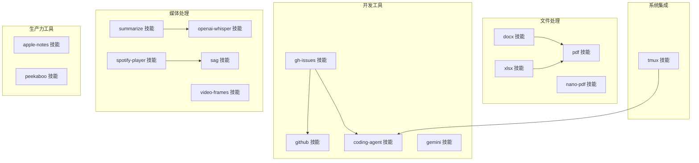

图表来源
- [pdf 技能 SKILL.md](file://skills/pdf/SKILL.md#L1-L315)
- [docx 技能 SKILL.md](file://skills/docx/SKILL.md#L1-L489)
- [xlsx 技能 SKILL.md](file://skills/xlsx/SKILL.md#L1-L299)
- [nano-pdf 技能 SKILL.md](file://skills/nano-pdf/SKILL.md#L1-L39)
- [tmux 技能 SKILL.md](file://skills/tmux/SKILL.md#L1-L154)
- [github 技能 SKILL.md](file://skills/github/SKILL.md#L1-L164)
- [coding-agent 技能 SKILL.md](file://skills/coding-agent/SKILL.md#L1-L296)
- [gh-issues 技能 SKILL.md](file://skills/gh-issues/SKILL.md#L1-L866)
- [gemini 技能 SKILL.md](file://skills/gemini/SKILL.md#L1-L44)
- [spotify-player 技能 SKILL.md](file://skills/spotify-player/SKILL.md#L1-L65)
- [openai-whisper 技能 SKILL.md](file://skills/openai-whisper/SKILL.md#L1-L39)
- [summarize 技能 SKILL.md](file://skills/summarize/SKILL.md#L1-L88)
- [video-frames 技能 SKILL.md](file://skills/video-frames/SKILL.md#L1-L47)
- [sag 技能 SKILL.md](file://skills/sag/SKILL.md#L1-L88)
- [apple-notes 技能 SKILL.md](file://skills/apple-notes/SKILL.md#L1-L78)
- [peekaboo 技能 SKILL.md](file://skills/peekaboo/SKILL.md#L1-L191)

章节来源
- [pdf 技能 SKILL.md](file://skills/pdf/SKILL.md#L1-L315)
- [docx 技能 SKILL.md](file://skills/docx/SKILL.md#L1-L489)
- [xlsx 技能 SKILL.md](file://skills/xlsx/SKILL.md#L1-L299)
- [tmux 技能 SKILL.md](file://skills/tmux/SKILL.md#L1-L154)
- [github 技能 SKILL.md](file://skills/github/SKILL.md#L1-L164)
- [coding-agent 技能 SKILL.md](file://skills/coding-agent/SKILL.md#L1-L296)
- [gh-issues 技能 SKILL.md](file://skills/gh-issues/SKILL.md#L1-L866)
- [gemini 技能 SKILL.md](file://skills/gemini/SKILL.md#L1-L44)
- [spotify-player 技能 SKILL.md](file://skills/spotify-player/SKILL.md#L1-L65)
- [openai-whisper 技能 SKILL.md](file://skills/openai-whisper/SKILL.md#L1-L39)
- [summarize 技能 SKILL.md](file://skills/summarize/SKILL.md#L1-L88)
- [video-frames 技能 SKILL.md](file://skills/video-frames/SKILL.md#L1-L47)
- [sag 技能 SKILL.md](file://skills/sag/SKILL.md#L1-L88)
- [apple-notes 技能 SKILL.md](file://skills/apple-notes/SKILL.md#L1-L78)
- [peekaboo 技能 SKILL.md](file://skills/peekaboo/SKILL.md#L1-L191)

## 核心组件
- 文件处理：支持 PDF/DOCX/XLSX 的读取、编辑、合并、拆分、OCR、表格提取、公式计算与格式化；提供命令行与脚本化流程。
- 系统集成：通过 tmux 控制交互式会话、发送输入、抓取输出，适合监控与批量任务。
- 开发工具：GitHub CLI 操作、子代理自动修复与评审、Gemini CLI 快速问答与生成。
- 媒体处理：Spotify 终端播放、Whisper 本地语音转文本、视频抽帧、TTS（ElevenLabs）与摘要工具。
- 生产力工具：macOS 笔记管理、Peekaboo UI 自动化。

章节来源
- [pdf 技能 SKILL.md](file://skills/pdf/SKILL.md#L1-L315)
- [docx 技能 SKILL.md](file://skills/docx/SKILL.md#L1-L489)
- [xlsx 技能 SKILL.md](file://skills/xlsx/SKILL.md#L1-L299)
- [tmux 技能 SKILL.md](file://skills/tmux/SKILL.md#L1-L154)
- [github 技能 SKILL.md](file://skills/github/SKILL.md#L1-L164)
- [coding-agent 技能 SKILL.md](file://skills/coding-agent/SKILL.md#L1-L296)
- [gh-issues 技能 SKILL.md](file://skills/gh-issues/SKILL.md#L1-L866)
- [gemini 技能 SKILL.md](file://skills/gemini/SKILL.md#L1-L44)
- [spotify-player 技能 SKILL.md](file://skills/spotify-player/SKILL.md#L1-L65)
- [openai-whisper 技能 SKILL.md](file://skills/openai-whisper/SKILL.md#L1-L39)
- [summarize 技能 SKILL.md](file://skills/summarize/SKILL.md#L1-L88)
- [video-frames 技能 SKILL.md](file://skills/video-frames/SKILL.md#L1-L47)
- [sag 技能 SKILL.md](file://skills/sag/SKILL.md#L1-L88)
- [apple-notes 技能 SKILL.md](file://skills/apple-notes/SKILL.md#L1-L78)
- [peekaboo 技能 SKILL.md](file://skills/peekaboo/SKILL.md#L1-L191)

## 架构总览
OpenClaw 的技能以“工具链 + 脚本 + 外部 CLI”的方式组织，强调可复用与可扩展。典型调用路径：
- 用户意图触发 → 技能解析 → 依赖检查 → 执行命令/脚本 → 输出结果或事件通知
- 复杂任务通过子代理（coding-agent）与外部服务（GitHub API、ElevenLabs、Whisper）协同完成

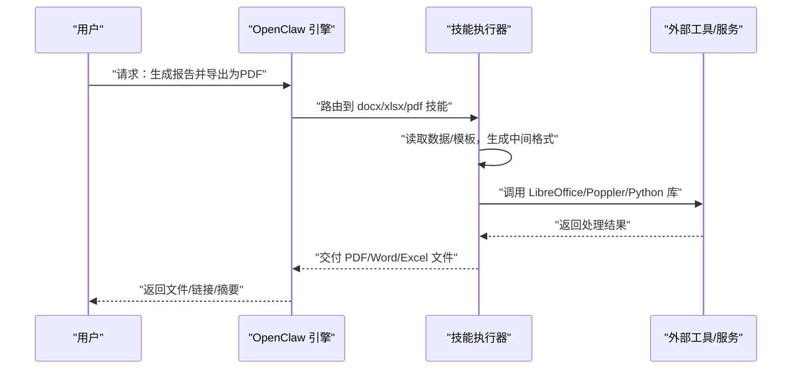

图表来源
- [docx 技能 SKILL.md](file://skills/docx/SKILL.md#L1-L489)
- [xlsx 技能 SKILL.md](file://skills/xlsx/SKILL.md#L1-L299)
- [pdf 技能 SKILL.md](file://skills/pdf/SKILL.md#L1-L315)

## 详细组件分析

### 文件处理技能

#### PDF 处理（pdf）
- 功能概览：文本/表格提取、合并/拆分、旋转、水印、创建、表单填写、加密/解密、扫描版 OCR、元数据读取。
- 常用工具：pypdf、pdfplumber、reportlab、pdftotext/qpdf/pdftk。
- 最佳实践：
  - 合并/拆分优先使用 pypdf；命令行合并使用 qpdf。
  - 表格提取结合 pdfplumber 与 pandas，先提取再清洗。
  - 创建 PDF 使用 reportlab，注意字体与上标下标渲染规则。
  - 扫描版 PDF 先图像化再 OCR，建议使用 pytesseract + pdf2image。
- 使用示例（路径参考）：
  - 文本提取与布局保留：[示例路径](file://skills/pdf/SKILL.md#L81-L89)
  - 表格提取与导出 Excel：[示例路径](file://skills/pdf/SKILL.md#L102-L119)
  - 命令行合并/拆分/旋转/解密：[示例路径](file://skills/pdf/SKILL.md#L219-L229)
  - 添加水印：[示例路径](file://skills/pdf/SKILL.md#L252-L269)
  - 提取图片：[示例路径](file://skills/pdf/SKILL.md#L271-L277)
  - 加密保护：[示例路径](file://skills/pdf/SKILL.md#L279-L294)

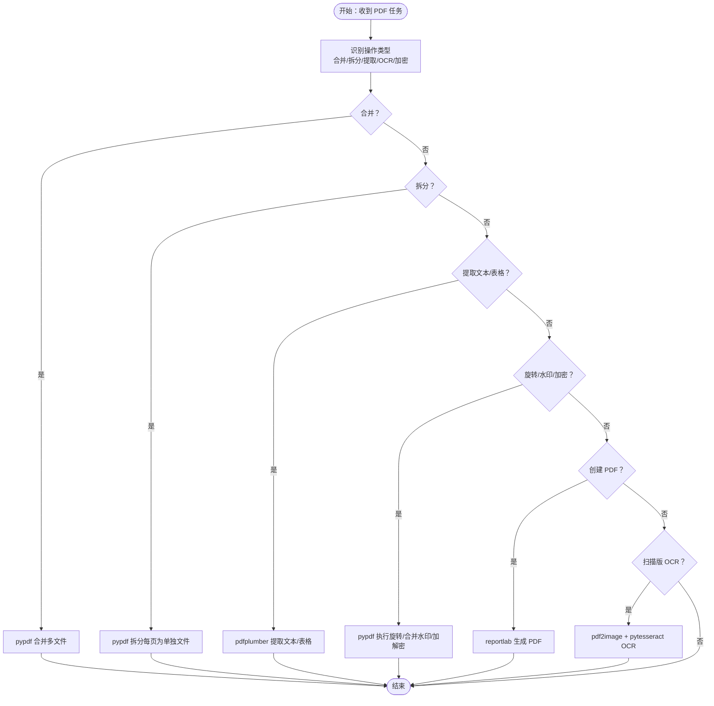

图表来源
- [pdf 技能 SKILL.md](file://skills/pdf/SKILL.md#L1-L315)

章节来源
- [pdf 技能 SKILL.md](file://skills/pdf/SKILL.md#L1-L315)

#### DOCX 处理（docx）
- 功能概览：读取/分析、创建新文档、编辑现有文档（XML 解包/修改/打包）、跟踪修订、注释、转换为图片。
- 运行依赖：LibreOffice（soffice）、Poppler（pdftoppm）、pandoc。
- 关键规则：
  - 页面尺寸需显式设置（docx-js 默认 A4），US Letter 需 DXA 单位。
  - 列表使用编号配置，避免直接使用 Unicode 符号。
  - 表格必须同时设置列宽数组与单元格宽度，且使用 DXA。
  - 图片插入需指定类型与替代文本。
  - TOC 仅使用 HeadingLevel，不使用自定义样式。
- 使用示例（路径参考）：
  - 新文档创建与验证：[示例路径](file://skills/docx/SKILL.md#L67-L82)
  - 页面尺寸与方向：[示例路径](file://skills/docx/SKILL.md#L84-L118)
  - 列表与编号：[示例路径](file://skills/docx/SKILL.md#L146-L178)
  - 表格宽度与边框：[示例路径](file://skills/docx/SKILL.md#L180-L226)
  - 图片插入：[示例路径](file://skills/docx/SKILL.md#L227-L239)
  - 页眉页脚与目录：[示例路径](file://skills/docx/SKILL.md#L251-L275)
  - 编辑现有文档（解包/编辑/打包）：[示例路径](file://skills/docx/SKILL.md#L296-L339)

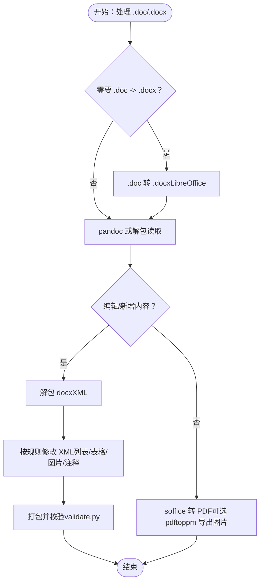

图表来源
- [docx 技能 SKILL.md](file://skills/docx/SKILL.md#L1-L489)

章节来源
- [docx 技能 SKILL.md](file://skills/docx/SKILL.md#L1-L489)

#### XLSX 处理（xlsx）
- 功能概览：读取/分析、新建/编辑、公式计算、颜色与格式规范、财务建模标准。
- 运行依赖：LibreOffice（recalc）、git（红线条对比更佳）。
- 关键规范：
  - 全部使用公式而非硬编码值，确保动态更新。
  - 颜色编码：输入/假设（蓝）、公式（黑）、内部链接（绿）、外部链接（红）、关注项（黄）。
  - 数字格式：年份文本、货币单位标注、百分比默认一位小数、负数括号显示。
  - 公式错误预防：引用正确性、范围一致性、无循环引用、边缘测试。
- 使用示例（路径参考）：
  - pandas 数据分析：[示例路径](file://skills/xlsx/SKILL.md#L84-L101)
  - openpyxl 新建/编辑：[示例路径](file://skills/xlsx/SKILL.md#L158-L211)
  - 公式计算与错误检查：[示例路径](file://skills/xlsx/SKILL.md#L213-L269)
  - 财务建模颜色与格式：[示例路径](file://skills/xlsx/SKILL.md#L22-L42)

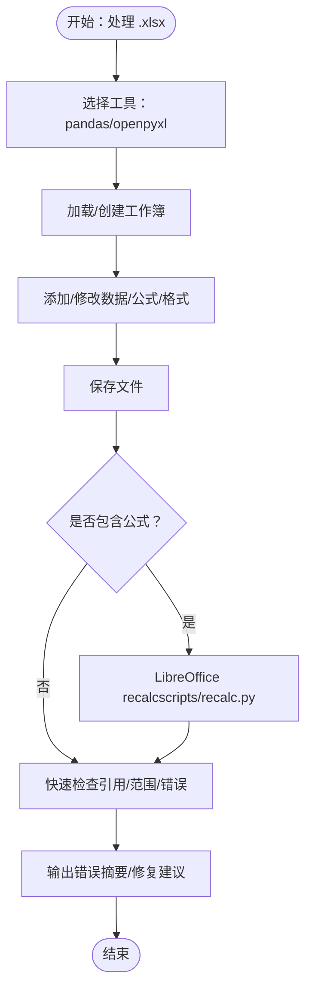

图表来源
- [xlsx 技能 SKILL.md](file://skills/xlsx/SKILL.md#L1-L299)

章节来源
- [xlsx 技能 SKILL.md](file://skills/xlsx/SKILL.md#L1-L299)

#### 纳米 PDF（nano-pdf）
- 功能概览：基于自然语言指令编辑 PDF 指定页面。
- 注意事项：页码 0/1 基底差异，需多次尝试确认。
- 使用示例（路径参考）：
  - 基础编辑：[示例路径](file://skills/nano-pdf/SKILL.md#L29-L33)

章节来源
- [nano-pdf 技能 SKILL.md](file://skills/nano-pdf/SKILL.md#L1-L39)

### 系统集成技能

#### tmux 会话控制（tmux）
- 功能概览：远程控制 tmux 会话，发送按键、抓取面板输出、窗口/窗格导航。
- 使用场景：监控 Claude/Codex 会话、向交互式应用发送输入、抓取长时间运行进程输出。
- 最佳实践：分离“发送文本”和“回车”以避免粘贴/多行边界问题；使用 `-S -` 抓取完整滚动历史。
- 使用示例（路径参考）：
  - 列出会话与抓取输出：[示例路径](file://skills/tmux/SKILL.md#L41-L59)
  - 发送按键与特殊键：[示例路径](file://skills/tmux/SKILL.md#L61-L76)
  - 会话管理（创建/重命名/杀死）：[示例路径](file://skills/tmux/SKILL.md#L91-L102)
  - Claude Code 会话模式（检查/批准/状态）：[示例路径](file://skills/tmux/SKILL.md#L114-L146)

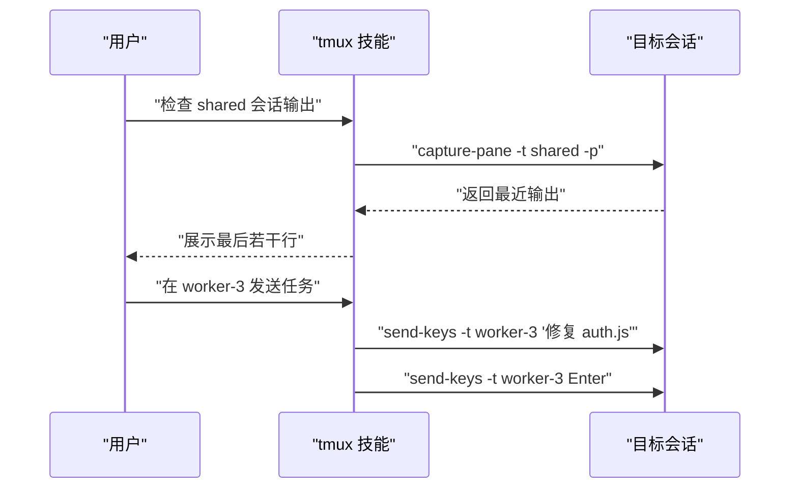

图表来源
- [tmux 技能 SKILL.md](file://skills/tmux/SKILL.md#L1-L154)

章节来源
- [tmux 技能 SKILL.md](file://skills/tmux/SKILL.md#L1-L154)

### 开发工具技能

#### GitHub 操作（github）
- 功能概览：PR/Issue 状态查询、CI 运行日志查看、创建/评论、合并；支持 JSON 结构化输出与 jq 过滤。
- 使用场景：仓库数据查询、PR 审查状态核对、CI 失败步骤定位。
- 最佳实践：始终指定 `--repo owner/repo`；使用 `--json` + `--jq` 获取机器可读输出。
- 使用示例（路径参考）：
  - PR 列表/状态/详情/合并：[示例路径](file://skills/github/SKILL.md#L68-L85)
  - Issue 列表/创建/关闭：[示例路径](file://skills/github/SKILL.md#L87-L98)
  - CI 运行列表/失败步骤/重试：[示例路径](file://skills/github/SKILL.md#L100-L114)
  - API 查询与模板：[示例路径](file://skills/github/SKILL.md#L116-L157)

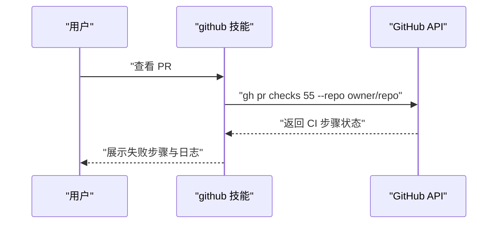

图表来源
- [github 技能 SKILL.md](file://skills/github/SKILL.md#L1-L164)

章节来源
- [github 技能 SKILL.md](file://skills/github/SKILL.md#L1-L164)

#### 编码代理（coding-agent）
- 功能概览：委托给 Codex/Claude Code/Pi/OpenCode 等代理执行迭代式编码任务；支持后台运行、日志轮询、输入提交。
- 使用要点：
  - Codex/Pi/OpenCode：PTY 模式（`pty:true`）。
  - Claude Code：使用 `--print --permission-mode bypassPermissions`（无需 PTY）。
  - 工作目录聚焦（`workdir`）避免无关文件干扰。
- 使用示例（路径参考）：
  - 一次性任务与临时仓库：[示例路径](file://skills/coding-agent/SKILL.md#L63-L76)
  - 后台模式 + 进程控制：[示例路径](file://skills/coding-agent/SKILL.md#L79-L102)
  - Codex/Claude/Pi/OpenCode 模式差异：[示例路径](file://skills/coding-agent/SKILL.md#L14-L35)
  - 并行修复与 git worktree：[示例路径](file://skills/coding-agent/SKILL.md#L204-L228)

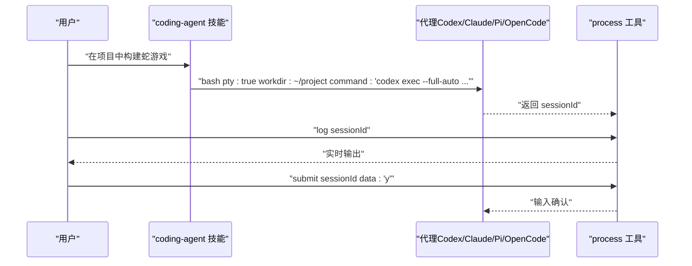

图表来源
- [coding-agent 技能 SKILL.md](file://skills/coding-agent/SKILL.md#L1-L296)

章节来源
- [coding-agent 技能 SKILL.md](file://skills/coding-agent/SKILL.md#L1-L296)

#### 自动修复 GitHub Issues（gh-issues）
- 功能概览：拉取 Issues → 预检 → 子代理自动修复 → 监控评审评论 → 处理反馈 → 通知汇总。
- 关键流程：参数解析 → Issues 拉取 → 预检（分支/PR/Claims） → 并行子代理 → 结果收集 → 评审处理。
- 使用示例（路径参考）：
  - 参数与过滤：[示例路径](file://skills/gh-issues/SKILL.md#L21-L61)
  - Issues 拉取与认证：[示例路径](file://skills/gh-issues/SKILL.md#L70-L122)
  - 预检与 Claims/PR/分支检查：[示例路径](file://skills/gh-issues/SKILL.md#L161-L280)
  - 子代理任务模板与提示词：[示例路径](file://skills/gh-issues/SKILL.md#L329-L493)
  - 评审评论处理与回复：[示例路径](file://skills/gh-issues/SKILL.md#L557-L800)

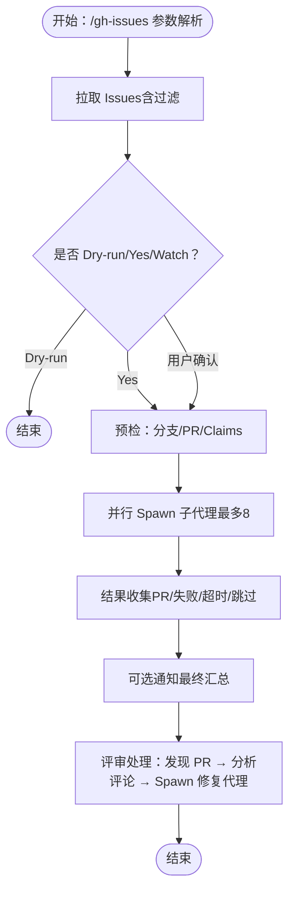

图表来源
- [gh-issues 技能 SKILL.md](file://skills/gh-issues/SKILL.md#L1-L866)

章节来源
- [gh-issues 技能 SKILL.md](file://skills/gh-issues/SKILL.md#L1-L866)

#### Gemini CLI（gemini）
- 功能概览：一次性问答、摘要与生成；避免交互模式；支持扩展与模型切换。
- 使用示例（路径参考）：
  - 基础问答与 JSON 输出：[示例路径](file://skills/gemini/SKILL.md#L29-L34)
  - 扩展管理：[示例路径](file://skills/gemini/SKILL.md#L35-L39)

章节来源
- [gemini 技能 SKILL.md](file://skills/gemini/SKILL.md#L1-L44)

### 媒体处理技能

#### Spotify 播放（spotify-player）
- 功能概览：终端播放/搜索/设备管理；推荐使用 spogo，回退到 spotify_player。
- 使用示例（路径参考）：
  - 搜索/播放/设备/状态：[示例路径](file://skills/spotify-player/SKILL.md#L46-L51)
  - 配置与连接：[示例路径](file://skills/spotify-player/SKILL.md#L60-L64)

章节来源
- [spotify-player 技能 SKILL.md](file://skills/spotify-player/SKILL.md#L1-L65)

#### 语音转文本（openai-whisper）
- 功能概览：本地 Whisper CLI 转写，无需 API Key。
- 使用示例（路径参考）：
  - 转写与翻译：[示例路径](file://skills/openai-whisper/SKILL.md#L29-L32)

章节来源
- [openai-whisper 技能 SKILL.md](file://skills/openai-whisper/SKILL.md#L1-L39)

#### 视频抽帧（video-frames）
- 功能概览：从视频抽取单帧或缩略图，支持时间戳。
- 使用示例（路径参考）：
  - 首帧与指定时间抽帧：[示例路径](file://skills/video-frames/SKILL.md#L29-L41)

章节来源
- [video-frames 技能 SKILL.md](file://skills/video-frames/SKILL.md#L1-L47)

#### TTS（ElevenLabs）- sag
- 功能概览：ElevenLabs 本地 TTS，支持语音选择、SSML/标签、不同模型特性。
- 使用示例（路径参考）：
  - 基础合成与语音列表：[示例路径](file://skills/sag/SKILL.md#L35-L41)
  - 语音标签与默认语音：[示例路径](file://skills/sag/SKILL.md#L56-L88)

章节来源
- [sag 技能 SKILL.md](file://skills/sag/SKILL.md#L1-L88)

#### 摘要与转录（summarize）
- 功能概览：URL/本地文件/YouTube 快速摘要；支持最佳努力转录；可配置模型与服务。
- 使用示例（路径参考）：
  - 基础摘要与 YouTube：[示例路径](file://skills/summarize/SKILL.md#L38-L54)
  - 模型与密钥配置：[示例路径](file://skills/summarize/SKILL.md#L56-L74)

章节来源
- [summarize 技能 SKILL.md](file://skills/summarize/SKILL.md#L1-L88)

### 生产力工具技能

#### Apple Notes（apple-notes）
- 功能概览：macOS 下通过 memo CLI 管理 Notes（创建/查看/编辑/删除/搜索/移动/导出）。
- 使用示例（路径参考）：
  - 查看/搜索/创建/编辑/删除/移动/导出：[示例路径](file://skills/apple-notes/SKILL.md#L36-L66)

章节来源
- [apple-notes 技能 SKILL.md](file://skills/apple-notes/SKILL.md#L1-L78)

#### macOS UI 自动化（peekaboo）
- 功能概览：屏幕捕获/分析、元素定位、输入驱动、应用/窗口/菜单/Dock 管理。
- 使用示例（路径参考）：
  - 权限检查与基础流程：[示例路径](file://skills/peekaboo/SKILL.md#L84-L92)
  - 登录流程自动化示例：[示例路径](file://skills/peekaboo/SKILL.md#L118-L126)
  - 截图与分析：[示例路径](file://skills/peekaboo/SKILL.md#L136-L142)
  - 应用/窗口管理：[示例路径](file://skills/peekaboo/SKILL.md#L151-L158)
  - 菜单/菜单栏/Dock：[示例路径](file://skills/peekaboo/SKILL.md#L160-L168)
  - 鼠标/手势/键盘：[示例路径](file://skills/peekaboo/SKILL.md#L170-L185)

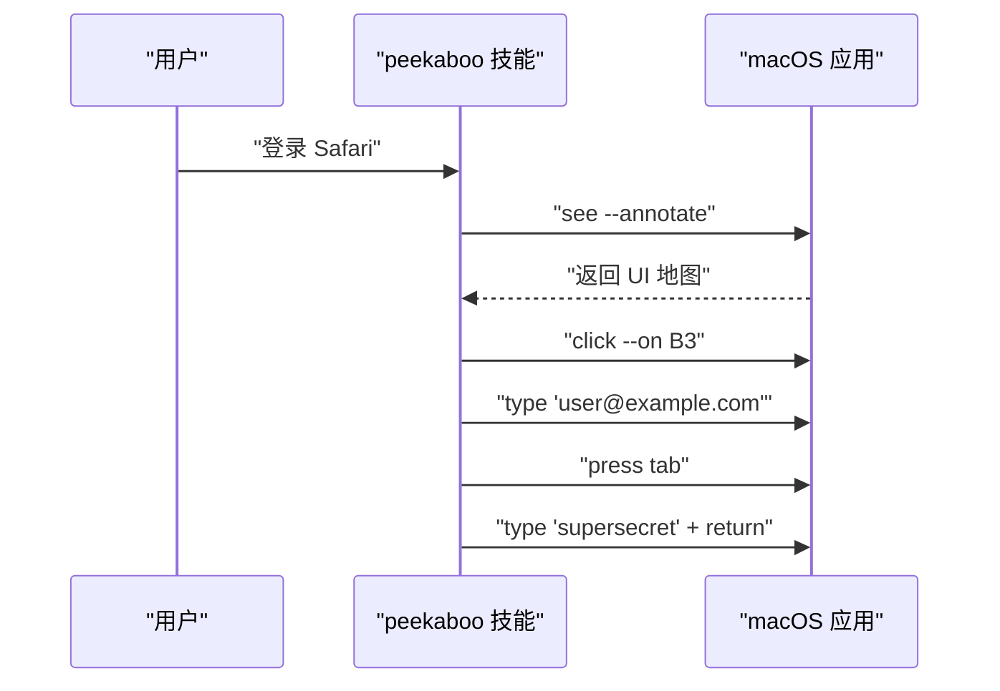

图表来源
- [peekaboo 技能 SKILL.md](file://skills/peekaboo/SKILL.md#L1-L191)

章节来源
- [peekaboo 技能 SKILL.md](file://skills/peekaboo/SKILL.md#L1-L191)

## 依赖分析
- 工具链依赖：各技能通过外部二进制（如 tmux、gh、whisper、ffmpeg、peekaboo、sag、spogo 等）与库（pypdf、pdfplumber、reportlab、pandas、openpyxl、LibreOffice、Poppler）协同工作。
- 环境要求：部分技能限定平台（如 macOS-only 的 memo/peekaboo），或需要特定权限（如 Screen Recording/Accessibility）。
- 互操作性：tmux 可用于驱动 coding-agent 的交互式会话；gh-issues 通过 GitHub API 与 coding-agent 协同；summarize 与 whisper 结合用于多媒体内容理解；sag/spogo 与 Apple 生态深度集成。

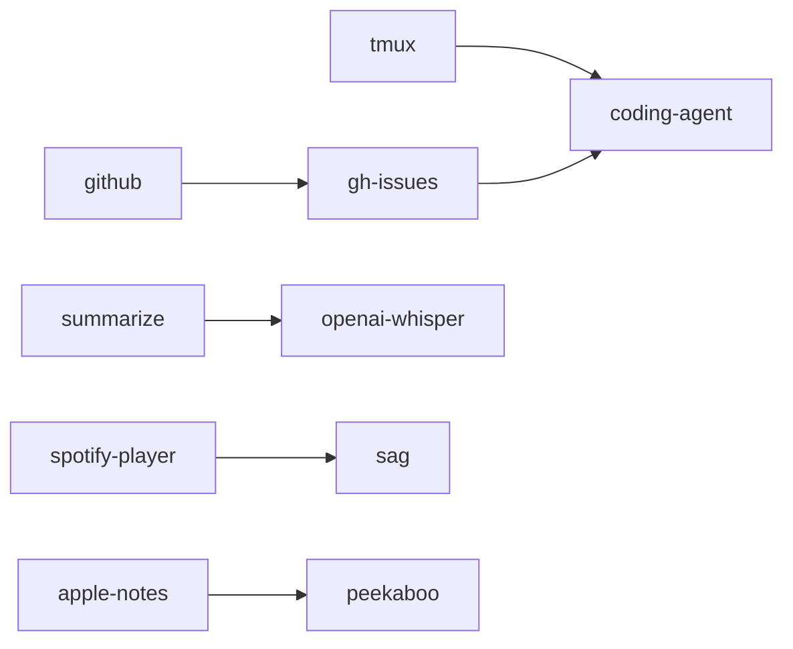

图表来源
- [tmux 技能 SKILL.md](file://skills/tmux/SKILL.md#L1-L154)
- [coding-agent 技能 SKILL.md](file://skills/coding-agent/SKILL.md#L1-L296)
- [github 技能 SKILL.md](file://skills/github/SKILL.md#L1-L164)
- [gh-issues 技能 SKILL.md](file://skills/gh-issues/SKILL.md#L1-L866)
- [summarize 技能 SKILL.md](file://skills/summarize/SKILL.md#L1-L88)
- [openai-whisper 技能 SKILL.md](file://skills/openai-whisper/SKILL.md#L1-L39)
- [spotify-player 技能 SKILL.md](file://skills/spotify-player/SKILL.md#L1-L65)
- [sag 技能 SKILL.md](file://skills/sag/SKILL.md#L1-L88)
- [apple-notes 技能 SKILL.md](file://skills/apple-notes/SKILL.md#L1-L78)
- [peekaboo 技能 SKILL.md](file://skills/peekaboo/SKILL.md#L1-L191)

章节来源
- [tmux 技能 SKILL.md](file://skills/tmux/SKILL.md#L1-L154)
- [coding-agent 技能 SKILL.md](file://skills/coding-agent/SKILL.md#L1-L296)
- [github 技能 SKILL.md](file://skills/github/SKILL.md#L1-L164)
- [gh-issues 技能 SKILL.md](file://skills/gh-issues/SKILL.md#L1-L866)
- [summarize 技能 SKILL.md](file://skills/summarize/SKILL.md#L1-L88)
- [openai-whisper 技能 SKILL.md](file://skills/openai-whisper/SKILL.md#L1-L39)
- [spotify-player 技能 SKILL.md](file://skills/spotify-player/SKILL.md#L1-L65)
- [sag 技能 SKILL.md](file://skills/sag/SKILL.md#L1-L88)
- [apple-notes 技能 SKILL.md](file://skills/apple-notes/SKILL.md#L1-L78)
- [peekaboo 技能 SKILL.md](file://skills/peekaboo/SKILL.md#L1-L191)

## 性能考虑
- 选择合适工具：pandas 适合数据分析与导出；openpyxl 更适合复杂格式与公式；pypdf/pdfplumber/reportlab 适合 PDF 场景。
- 公式与计算：xlsx 中尽量使用公式而非硬编码，配合 recalc 脚本统一计算，减少重复工作量。
- 交互式任务：使用 tmux + coding-agent 的组合，避免阻塞与资源浪费；合理设置超时与日志轮询。
- 多媒体处理：Whisper 模型大小影响速度与精度；summarize 在受限站点可启用 Firecrawl；YouTube 转录可借助 Apify。
- UI 自动化：Peekaboo 的截图与分析可缓存快照，减少重复捕获成本。

## 故障排查指南
- 依赖缺失：根据技能元数据中的 requires/install 字段安装对应二进制或包管理器配方。
- 认证失败：GitHub/Gemini 等需先进行一次交互式登录，后续通过环境变量或配置注入令牌。
- 权限不足：macOS 上 memo/peekaboo 需授予 Automation 访问与 Screen Recording/Accessibility 权限。
- 公式错误：xlsx 使用 recalc 脚本扫描错误类型与位置，逐项修复后再重新计算。
- 会话卡顿：tmux 技能中分离“发送文本”和“回车”，必要时使用 `-S -` 抓取完整历史以便诊断。
- 评审评论未处理：gh-issues 的评审阶段会自动分析评论并 Spawn 修复代理，若未触发，检查评论来源与机器人用户名过滤逻辑。

章节来源
- [github 技能 SKILL.md](file://skills/github/SKILL.md#L56-L64)
- [gemini 技能 SKILL.md](file://skills/gemini/SKILL.md#L40-L44)
- [peekaboo 技能 SKILL.md](file://skills/peekaboo/SKILL.md#L187-L191)
- [xlsx 技能 SKILL.md](file://skills/xlsx/SKILL.md#L213-L269)
- [tmux 技能 SKILL.md](file://skills/tmux/SKILL.md#L104-L113)
- [gh-issues 技能 SKILL.md](file://skills/gh-issues/SKILL.md#L557-L800)

## 结论
OpenClaw 的内置技能围绕“工具链 + 脚本 + 外部服务”的架构，覆盖文件处理、系统集成、开发工具、媒体处理与生产力工具五大领域。通过明确的触发条件、严格的依赖声明与最佳实践，用户可以灵活组合这些技能，构建从数据处理到代码修复再到媒体理解与 UI 自动化的完整工作流。建议在实际使用中优先选择合适的工具与流程，配合日志与错误检查机制，确保稳定与可维护性。

## 附录
- 快速索引（示例路径）
  - PDF 合并/拆分/OCR/加密：[示例路径](file://skills/pdf/SKILL.md#L32-L294)
  - DOCX 新建/编辑/表格/图片/目录：[示例路径](file://skills/docx/SKILL.md#L67-L275)
  - XLSX 公式/颜色/格式/财务建模：[示例路径](file://skills/xlsx/SKILL.md#L22-L269)
  - tmux 发送输入/抓取输出/会话管理：[示例路径](file://skills/tmux/SKILL.md#L48-L102)
  - GitHub PR/Issue/CI 操作与 JSON 输出：[示例路径](file://skills/github/SKILL.md#L68-L137)
  - 编码代理 PTY/工作目录/后台模式：[示例路径](file://skills/coding-agent/SKILL.md#L37-L102)
  - gh-issues 参数/预检/子代理/评审处理：[示例路径](file://skills/gh-issues/SKILL.md#L21-L800)
  - Gemini 一次性问答与扩展：[示例路径](file://skills/gemini/SKILL.md#L29-L39)
  - Spotify 播放/设备/状态：[示例路径](file://skills/spotify-player/SKILL.md#L46-L51)
  - Whisper 转写/翻译：[示例路径](file://skills/openai-whisper/SKILL.md#L29-L32)
  - 视频抽帧（ffmpeg）：[示例路径](file://skills/video-frames/SKILL.md#L29-L41)
  - TTS（sag）语音/标签/模型：[示例路径](file://skills/sag/SKILL.md#L35-L88)
  - 摘要（summarize）模型/服务：[示例路径](file://skills/summarize/SKILL.md#L56-L88)
  - Apple Notes 管理：[示例路径](file://skills/apple-notes/SKILL.md#L36-L66)
  - Peekaboo 截图/点击/拖拽/窗口管理：[示例路径](file://skills/peekaboo/SKILL.md#L118-L185)