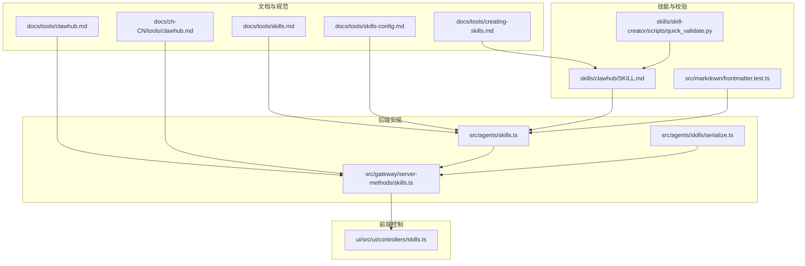
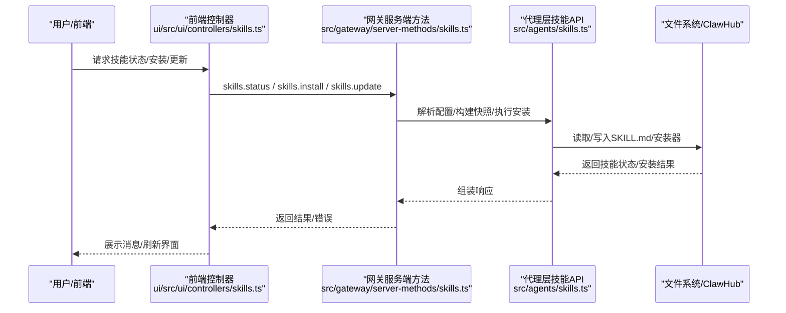
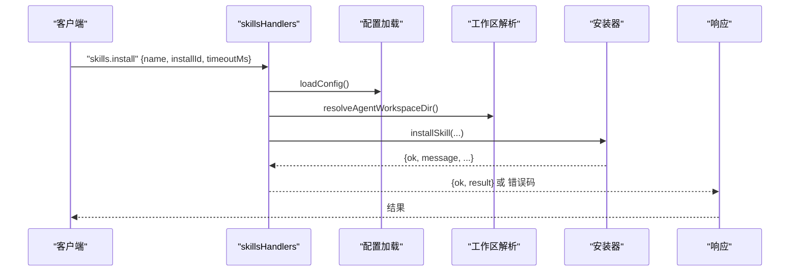
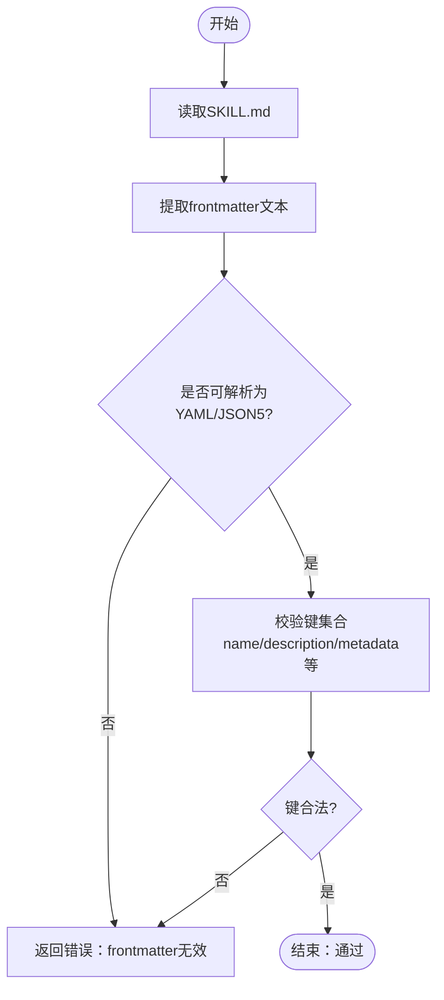
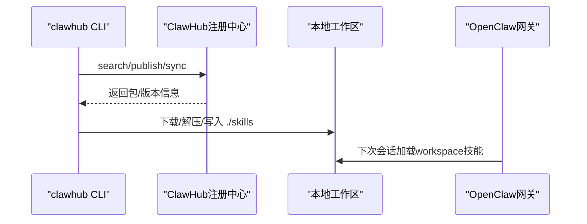
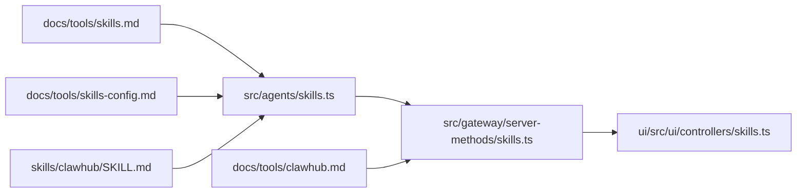

# 技能平台

<cite>
**本文引用的文件**
- [README.md](file://README.md)
- [skills.md](file://docs/tools/skills.md)
- [creating-skills.md](file://docs/tools/creating-skills.md)
- [skills-config.md](file://docs/tools/skills-config.md)
- [clawhub.md](file://docs/tools/clawhub.md)
- [clawhub.md（中文）](file://docs/zh-CN/tools/clawhub.md)
- [skills.ts](file://src/gateway/server-methods/skills.ts)
- [skills.ts（代理层）](file://src/agents/skills.ts)
- [skills.ts（前端控制器）](file://ui/src/ui/controllers/skills.ts)
- [serialize.ts](file://src/agents/skills/serialize.ts)
- [frontmatter.test.ts](file://src/markdown/frontmatter.test.ts)
- [quick_validate.py](file://skills/skill-creator/scripts/quick_validate.py)
- [SKILL.md（示例：clawhub）](file://skills/clawhub/SKILL.md)
</cite>

## 目录
1. [简介](#简介)
2. [项目结构](#项目结构)
3. [核心组件](#核心组件)
4. [架构总览](#架构总览)
5. [详细组件分析](#详细组件分析)
6. [依赖关系分析](#依赖关系分析)
7. [性能考量](#性能考量)
8. [故障排查指南](#故障排查指南)
9. [结论](#结论)
10. [附录](#附录)

## 简介
本文件面向OpenClaw的“技能平台”，系统性阐述技能系统的架构、工作原理与使用方法，覆盖以下主题：
- 技能注册表与ClawHub集成
- 技能安装与管理流程
- 技能清单（SKILL.md）编写规范
- 内置技能的功能分类与示例
- 技能开发最佳实践（错误处理、性能优化、安全考虑）
- 技能与工具系统的集成方式与调用机制

OpenClaw采用AgentSkills兼容的技能体系，通过三类来源加载技能：内置（bundled）、托管（managed/local）与工作区（workspace），并支持插件自带技能与ClawHub远程安装。

## 项目结构
围绕技能平台的关键目录与文件：
- 文档与规范
  - 技能总览与配置参考：docs/tools/skills.md、docs/tools/skills-config.md
  - 创建自定义技能：docs/tools/creating-skills.md
  - ClawHub指南：docs/tools/clawhub.md、docs/zh-CN/tools/clawhub.md
- 后端实现
  - 技能服务端方法：src/gateway/server-methods/skills.ts
  - 代理侧技能导出与类型：src/agents/skills.ts
  - 并发序列化工具：src/agents/skills/serialize.ts
- 前端控制与UI
  - 技能控制器：ui/src/ui/controllers/skills.ts
- 技能清单校验与测试
  - Frontmatter解析测试：src/markdown/frontmatter.test.ts
  - 技能快速校验脚本：skills/skill-creator/scripts/quick_validate.py
  - 示例技能：skills/clawhub/SKILL.md

图表来源
- [skills.md](file://docs/tools/skills.md#L1-L303)
- [skills-config.md](file://docs/tools/skills-config.md#L1-L78)
- [clawhub.md](file://docs/tools/clawhub.md#L46-L88)
- [skills.ts](file://src/gateway/server-methods/skills.ts#L1-L205)
- [skills.ts（代理层）](file://src/agents/skills.ts#L1-L47)
- [serialize.ts](file://src/agents/skills/serialize.ts#L1-L14)
- [skills.ts（前端控制器）](file://ui/src/ui/controllers/skills.ts#L39-L157)
- [SKILL.md（示例：clawhub）](file://skills/clawhub/SKILL.md#L1-L78)
- [frontmatter.test.ts](file://src/markdown/frontmatter.test.ts#L1-L105)
- [quick_validate.py](file://skills/skill-creator/scripts/quick_validate.py#L1-L107)

章节来源
- [README.md](file://README.md#L264-L269)
- [skills.md](file://docs/tools/skills.md#L1-L303)
- [skills-config.md](file://docs/tools/skills-config.md#L1-L78)
- [clawhub.md](file://docs/tools/clawhub.md#L46-L88)

## 核心组件
- 技能注册表与加载优先级
  - 三类来源：内置（bundled）< 托管（managed/local）< 工作区（workspace）
  - 支持通过配置追加额外扫描目录（extraDirs）
- 技能元数据与门控（gating）
  - metadata.openclaw字段用于声明依赖（二进制、环境变量、配置路径）、平台过滤、安装器信息等
  - 加载时按条件筛选，支持always、os、requires.bins/anyBins、requires.env、requires.config、primaryEnv、install等
- 技能安装与更新
  - 通过Gateway方法skills.install与skills.update完成安装与配置更新
  - 支持超时控制与错误码返回
- 技能清单（SKILL.md）规范
  - YAML frontmatter必需字段：name、description
  - metadata为单行JSON对象
  - 支持可选字段：homepage、user-invocable、disable-model-invocation、command-dispatch、command-tool、command-arg-mode
- ClawHub集成
  - 提供搜索、安装、更新、发布、同步等CLI能力
  - 默认安装到工作区skills目录，OpenClaw在下次会话加载

章节来源
- [skills.md](file://docs/tools/skills.md#L11-L187)
- [skills-config.md](file://docs/tools/skills-config.md#L13-L78)
- [clawhub.md](file://docs/tools/clawhub.md#L46-L88)
- [SKILL.md（示例：clawhub）](file://skills/clawhub/SKILL.md#L1-L78)

## 架构总览
技能平台由“文档规范—前端控制—后端服务—代理层—文件系统/ClawHub”构成的闭环：

图表来源
- [skills.ts（前端控制器）](file://ui/src/ui/controllers/skills.ts#L39-L157)
- [skills.ts](file://src/gateway/server-methods/skills.ts#L57-L204)
- [skills.ts（代理层）](file://src/agents/skills.ts#L1-L47)

## 详细组件分析

### 组件A：技能服务端方法（Gateway）
职责与流程：
- skills.status：根据agentId解析工作区，构建技能状态报告（含可用/不可用原因、远程节点可达性等）
- skills.bins：汇总各agent工作区中技能声明的二进制依赖
- skills.install：基于installId选择安装器，执行安装并返回结果
- skills.update：更新技能entries中的enabled、apiKey、env，并持久化配置

图表来源
- [skills.ts](file://src/gateway/server-methods/skills.ts#L114-L145)

章节来源
- [skills.ts](file://src/gateway/server-methods/skills.ts#L57-L204)

### 组件B：技能清单（SKILL.md）解析与校验
- Frontmatter解析
  - 支持YAML块标量、内联JSON、多行metadata（JSON5风格）
  - 保留冒号等特殊字符在description中的原意
- 快速校验脚本
  - 检查SKILL.md存在性、frontmatter格式、允许键集合
  - 在无PyYAML时使用简化解析器
- 测试用例
  - 验证metadata为单行JSON对象、数组/对象序列化、块标量处理等

图表来源
- [frontmatter.test.ts](file://src/markdown/frontmatter.test.ts#L19-L98)
- [quick_validate.py](file://skills/skill-creator/scripts/quick_validate.py#L67-L107)

章节来源
- [frontmatter.test.ts](file://src/markdown/frontmatter.test.ts#L1-L105)
- [quick_validate.py](file://skills/skill-creator/scripts/quick_validate.py#L1-L107)

### 组件C：技能安装与ClawHub集成
- 安装入口
  - 通过skills.install触发，支持超时控制
- ClawHub CLI
  - 支持search、install、update、list、publish、sync等
  - 默认安装到工作区skills目录，遵循优先级规则
- 安装器类型
  - brew、node（npm/pnpm/yarn/bun）、go、download等
  - 支持平台过滤与目标目录定制

图表来源
- [clawhub.md](file://docs/tools/clawhub.md#L46-L88)
- [clawhub.md（中文）](file://docs/zh-CN/tools/clawhub.md#L1-L201)
- [SKILL.md（示例：clawhub）](file://skills/clawhub/SKILL.md#L1-L78)

章节来源
- [clawhub.md](file://docs/tools/clawhub.md#L46-L88)
- [clawhub.md（中文）](file://docs/zh-CN/tools/clawhub.md#L1-L201)
- [SKILL.md（示例：clawhub）](file://skills/clawhub/SKILL.md#L1-L78)

### 组件D：技能配置与并发控制
- 配置项
  - skills.allowBundled：对内置技能的白名单
  - skills.load.extraDirs/watch/watchDebounceMs：扩展扫描目录与热重载
  - skills.install.preferBrew/nodeManager：安装偏好
  - skills.entries.<skillKey>：启用/禁用、注入env/apiKey、自定义配置
- 并发控制
  - serializeByKey：同一key串行化任务队列，避免竞态与重复安装

章节来源
- [skills-config.md](file://docs/tools/skills-config.md#L13-L78)
- [serialize.ts](file://src/agents/skills/serialize.ts#L1-L14)

## 依赖关系分析
- 文档与实现映射
  - skills.md与skills-config.md定义了技能加载、门控、安装器与配置策略
  - skills.ts（代理层）导出类型与快照构建函数，供网关调用
  - skills.ts（网关服务端）封装请求校验、工作区解析与安装执行
  - 前端控制器通过WebSocket调用skills.*方法，展示状态与安装结果
- 外部依赖
  - ClawHub注册中心（通过clawhub CLI）
  - 安装器（brew/node/go/download）

图表来源
- [skills.md](file://docs/tools/skills.md#L1-L303)
- [skills-config.md](file://docs/tools/skills-config.md#L1-L78)
- [skills.ts（代理层）](file://src/agents/skills.ts#L1-L47)
- [skills.ts](file://src/gateway/server-methods/skills.ts#L1-L205)
- [skills.ts（前端控制器）](file://ui/src/ui/controllers/skills.ts#L39-L157)
- [clawhub.md](file://docs/tools/clawhub.md#L46-L88)
- [SKILL.md（示例：clawhub）](file://skills/clawhub/SKILL.md#L1-L78)

章节来源
- [skills.md](file://docs/tools/skills.md#L1-L303)
- [skills-config.md](file://docs/tools/skills-config.md#L1-L78)
- [skills.ts](file://src/gateway/server-methods/skills.ts#L1-L205)
- [skills.ts（代理层）](file://src/agents/skills.ts#L1-L47)
- [skills.ts（前端控制器）](file://ui/src/ui/controllers/skills.ts#L39-L157)
- [clawhub.md](file://docs/tools/clawhub.md#L46-L88)
- [SKILL.md（示例：clawhub）](file://skills/clawhub/SKILL.md#L1-L78)

## 性能考量
- 技能快照与热重载
  - 会话启动时缓存可执行技能列表，后续回合复用，减少prompt拼接开销
  - 支持watch与去抖（watchDebounceMs），降低频繁变更带来的IO压力
- Prompt注入成本估算
  - 基础开销与每技能XML字段长度相关，注意XML转义导致的字符膨胀
  - 建议控制技能数量与描述长度，避免prompt过度膨胀
- 远程节点与二进制探测
  - macOS节点具备system.run权限时可作为macOS-only技能执行载体，但需考虑网络与节点离线风险

章节来源
- [skills.md](file://docs/tools/skills.md#L242-L286)

## 故障排查指南
- 常见问题定位
  - 安装失败：检查installId是否正确、二进制依赖是否存在、Node管理器偏好设置
  - 技能不可用：核对metadata.openclaw.requires.bins/env/config是否满足；确认sandbox容器内二进制可用
  - 前端无响应：确认WebSocket连接、skills.status是否返回错误
- 建议排查步骤
  - 使用skills.status查看具体原因
  - 开启watch并观察变更；必要时重启网关
  - 对第三方技能，先在隔离环境中验证再启用

章节来源
- [skills.ts](file://src/gateway/server-methods/skills.ts#L57-L204)
- [skills.ts（前端控制器）](file://ui/src/ui/controllers/skills.ts#L39-L157)
- [skills.md](file://docs/tools/skills.md#L69-L77)

## 结论
OpenClaw的技能平台以AgentSkills兼容规范为核心，结合ClawHub实现了从发现、安装、更新到发布的完整生命周期管理。通过严格的门控机制、可配置的安装器与热重载策略，平台在安全性与易用性之间取得平衡。建议在开发自定义技能时严格遵循SKILL.md规范，合理设置metadata与安装器，并关注prompt成本与安全边界。

## 附录

### 技能清单（SKILL.md）编写规范
- 必填字段
  - name：技能名称
  - description：技能简述
- 可选字段
  - homepage：展示链接
  - user-invocable：是否暴露为用户命令
  - disable-model-invocation：是否排除在模型提示之外
  - command-dispatch：tool（直接派发到工具）
  - command-tool：当command-dispatch为tool时的目标工具名
  - command-arg-mode：raw（原始参数字符串传递）
- 元数据（metadata.openclaw）
  - always、emoji、homepage、os、requires（bins/anyBins/env/config）、primaryEnv、install等

章节来源
- [skills.md](file://docs/tools/skills.md#L78-L187)
- [frontmatter.test.ts](file://src/markdown/frontmatter.test.ts#L19-L98)

### 内置技能功能分类（示例）
- 文件操作：pdf、docx、xlsx、pptx、video-frames、tmux等
- 消息处理：copaw-message-sender、feishu-message-sender、discord、slack、telegram、whatsapp等
- 系统集成：system.run、nodes（macOS节点能力）、voice-call、talk-voice等
- 媒体处理：openai-image-gen、openai-whisper、sherpa-onnx-tts、spotify-player、sonoscli等
- 搜索与知识：gemini、blogwatcher、gh-issues、gog、ordercli、trello、xurl等
- 开发与运维：coding-agent、nano-banana-pro、nano-pdf、openhue、oracle、session-logs、healthcheck等

章节来源
- [README.md](file://README.md#L264-L269)

### 技能开发最佳实践
- 错误处理
  - 明确安装器失败与运行期异常的区分，返回可读错误信息
  - 对敏感输入进行归一化与清理（如normalizeSecretInput）
- 性能优化
  - 控制技能数量与描述长度，避免prompt过度膨胀
  - 利用watch与去抖，减少频繁重载
- 安全考虑
  - 第三方技能视为不受信代码，优先沙箱执行
  - 避免在提示词中泄露密钥与敏感上下文
  - 严格限制工具调用范围，防止任意命令注入

章节来源
- [skills.ts](file://src/gateway/server-methods/skills.ts#L16-L23)
- [skills.md](file://docs/tools/skills.md#L69-L77)
- [skills-config.md](file://docs/tools/skills-config.md#L67-L78)

### 技能与工具系统的集成方式
- 技能通过SKILL.md向LLM提供指令与工具定义
- 用户命令（slash）可直接派发到工具（command-dispatch: tool）
- 运行期通过applySkillEnvOverrides注入环境变量，构建系统提示
- 远程节点在具备system.run权限时可作为macOS-only技能执行载体

章节来源
- [skills.md](file://docs/tools/skills.md#L95-L105)
- [skills.ts（代理层）](file://src/agents/skills.ts#L14-L16)