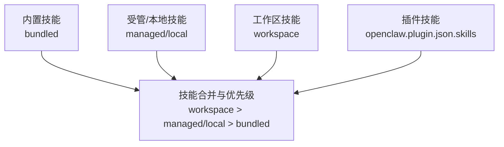
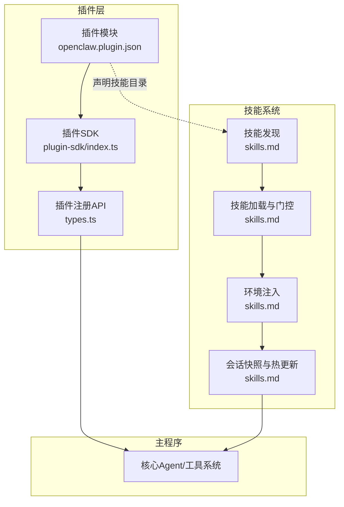
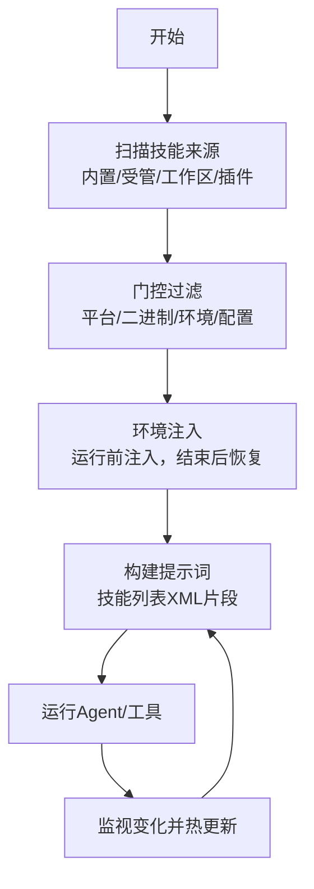
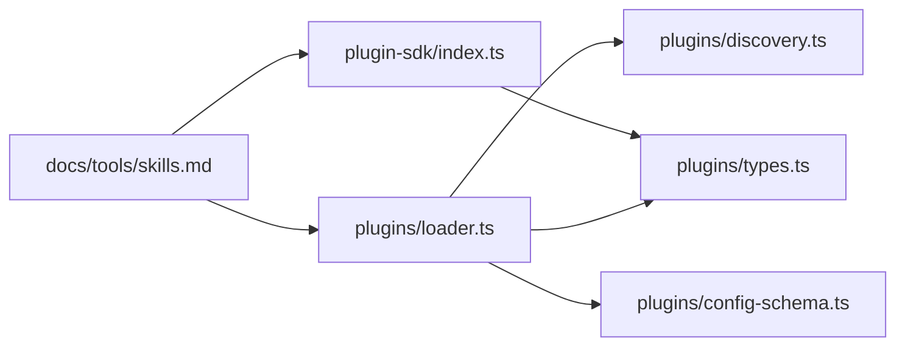

# 插件技能

<cite>
**本文引用的文件**
- [src/plugin-sdk/index.ts](file://src/plugin-sdk/index.ts)
- [src/plugins/types.ts](file://src/plugins/types.ts)
- [src/plugins/runtime/types.ts](file://src/plugins/runtime/types.ts)
- [src/plugins/discovery.ts](file://src/plugins/discovery.ts)
- [src/plugins/loader.ts](file://src/plugins/loader.ts)
- [src/plugins/config-schema.ts](file://src/plugins/config-schema.ts)
- [docs/tools/skills.md](file://docs/tools/skills.md)
- [extensions/diffs/openclaw.plugin.json](file://extensions/diffs/openclaw.plugin.json)
- [extensions/diffs/skills/diffs/SKILL.md](file://extensions/diffs/skills/diffs/SKILL.md)
- [extensions/lobster/openclaw.plugin.json](file://extensions/lobster/openclaw.plugin.json)
- [extensions/lobster/SKILL.md](file://extensions/lobster/SKILL.md)
</cite>

## 目录
1. [简介](#简介)
2. [项目结构](#项目结构)
3. [核心组件](#核心组件)
4. [架构总览](#架构总览)
5. [详细组件分析](#详细组件分析)
6. [依赖分析](#依赖分析)
7. [性能考量](#性能考量)
8. [故障排查指南](#故障排查指南)
9. [结论](#结论)
10. [附录](#附录)

## 简介
本文件面向OpenClaw插件技能体系，系统阐述插件如何集成“技能（Skills）”能力：从插件清单中的技能目录配置、技能发现与加载机制，到门控规则、依赖管理与环境注入；进一步说明插件技能与主程序内置技能的优先级与冲突处理；并提供插件技能的开发、打包、分发与版本管理实践，以及安全与沙箱限制、权限控制要点。文末给出成功案例与集成模式，帮助开发者快速落地高质量插件技能。

## 项目结构
OpenClaw将“技能”分为三类来源，按优先级覆盖：
- 内置技能（bundled）：随安装包或应用自带
- 受管/本地技能（managed/local）：位于用户主目录下的受管路径
- 工作区技能（workspace）：位于工作区的skills目录

此外，插件可通过清单声明自身携带的技能目录，参与统一的技能加载与优先级规则。

图示来源
- [docs/tools/skills.md](file://docs/tools/skills.md#L13-L27)

章节来源
- [docs/tools/skills.md](file://docs/tools/skills.md#L13-L27)

## 核心组件
- 插件SDK导出：提供插件开发所需的类型、工具与运行时能力入口，便于在插件中注册工具、命令、HTTP路由、服务等。
- 插件类型定义：定义插件生命周期钩子、命令、HTTP路由、服务、通道适配器、提供方认证等接口规范。
- 插件运行时类型：定义子代理运行、等待、会话消息查询与删除等能力。
- 插件发现与加载：负责扫描候选插件、校验路径安全、解析清单、验证配置、按策略启用并注册插件。
- 技能系统：负责技能发现、门控过滤、环境注入、会话快照与热更新、远程节点支持等。

章节来源
- [src/plugin-sdk/index.ts](file://src/plugin-sdk/index.ts#L1-L812)
- [src/plugins/types.ts](file://src/plugins/types.ts#L1-L893)
- [src/plugins/runtime/types.ts](file://src/plugins/runtime/types.ts#L1-L64)
- [src/plugins/discovery.ts](file://src/plugins/discovery.ts#L1-L712)
- [src/plugins/loader.ts](file://src/plugins/loader.ts#L1-L829)
- [docs/tools/skills.md](file://docs/tools/skills.md#L1-L303)

## 架构总览
下图展示了插件技能在OpenClaw中的整体交互：插件通过清单声明技能目录，技能由技能系统统一发现与加载；插件在注册阶段可向系统注入工具与命令；最终这些技能与主程序技能共同参与系统提示词构建与执行。

图示来源
- [src/plugin-sdk/index.ts](file://src/plugin-sdk/index.ts#L1-L812)
- [src/plugins/types.ts](file://src/plugins/types.ts#L248-L306)
- [docs/tools/skills.md](file://docs/tools/skills.md#L1-L303)

## 详细组件分析

### 插件清单中的技能目录配置
- 插件清单字段：插件可通过清单中的技能目录数组声明自身包含的技能根目录，路径相对插件根目录。
- 加载时机：当插件被启用并完成加载后，其声明的技能目录将参与技能发现与加载流程。
- 优先级：插件技能遵循统一的技能优先级规则，工作区 > 受管/本地 > 内置，且插件技能参与同一优先级内的冲突解决。

章节来源
- [extensions/diffs/openclaw.plugin.json](file://extensions/diffs/openclaw.plugin.json#L1-L183)
- [docs/tools/skills.md](file://docs/tools/skills.md#L41-L48)

### 技能发现机制与加载流程
- 技能发现来源与顺序：内置技能、受管/本地技能、工作区技能、插件技能（按清单声明），并支持额外自定义目录。
- 门控规则：技能在加载前进行门控过滤，依据元数据中的平台、二进制、环境变量、配置项等条件决定是否纳入。
- 环境注入：在每次Agent运行开始时，按配置对进程环境进行注入，运行结束后恢复原环境。
- 会话快照与热更新：会话启动时快照可用技能列表，后续同会话内复用；支持监视器触发热更新。

图示来源
- [docs/tools/skills.md](file://docs/tools/skills.md#L106-L187)
- [docs/tools/skills.md](file://docs/tools/skills.md#L230-L247)

章节来源
- [docs/tools/skills.md](file://docs/tools/skills.md#L13-L27)
- [docs/tools/skills.md](file://docs/tools/skills.md#L106-L187)
- [docs/tools/skills.md](file://docs/tools/skills.md#L230-L247)

### 插件技能的门控规则、依赖管理与环境注入
- 门控字段：支持always、os、requires.bins/anyBins、requires.env、requires.config、primaryEnv、install等。
- 依赖管理：二进制依赖在宿主与沙箱中分别检查；若在沙箱中使用，需确保容器内已安装。
- 环境注入：仅在Agent运行期间注入，避免污染全局环境；支持从配置或密钥引用注入。

章节来源
- [docs/tools/skills.md](file://docs/tools/skills.md#L106-L187)
- [docs/tools/skills.md](file://docs/tools/skills.md#L230-L239)

### 插件技能与主程序技能的优先级关系与冲突解决
- 优先级：工作区技能 > 受管/本地技能 > 内置技能；插件技能参与同一层级的冲突解决。
- 冲突处理：同名技能以更高优先级来源为准；未命中优先级时保留默认行为。

章节来源
- [docs/tools/skills.md](file://docs/tools/skills.md#L21-L23)

### 插件技能开发指南（打包、分发与版本管理）
- 清单与技能目录：在插件清单中声明skills数组，指向插件根目录下的技能目录。
- 技能格式：每个技能目录包含SKILL.md，采用单行frontmatter与metadata.openclaw字段。
- 分发与版本：通过ClawHub进行安装、更新与同步；支持多平台安装器与下载归档。
- 版本管理：插件版本与技能版本独立管理，建议保持一致的发布节奏与变更日志。

章节来源
- [extensions/diffs/openclaw.plugin.json](file://extensions/diffs/openclaw.plugin.json#L1-L183)
- [extensions/diffs/skills/diffs/SKILL.md](file://extensions/diffs/skills/diffs/SKILL.md#L1-L23)
- [docs/tools/skills.md](file://docs/tools/skills.md#L50-L68)
- [docs/tools/skills.md](file://docs/tools/skills.md#L148-L185)

### 安全考虑、沙箱限制与权限控制
- 第三方技能视为不受信任代码，应先审阅再启用。
- 沙箱运行：对高风险工具与输入采用沙箱；二进制依赖需在沙箱内可用。
- 路径安全：插件与技能发现严格校验路径合法性与权限，防止越界与异常权限。
- 密钥与环境：避免将敏感信息写入提示词与日志；谨慎使用env与apiKey注入。

章节来源
- [docs/tools/skills.md](file://docs/tools/skills.md#L69-L77)
- [docs/tools/skills.md](file://docs/tools/skills.md#L138-L147)
- [src/plugins/discovery.ts](file://src/plugins/discovery.ts#L117-L251)

### 成功案例与集成模式
- Diffs插件：通过清单声明技能目录，提供diff查看与渲染能力，强调mode选择与文件输出。
- Lobster插件：提供多步骤工作流与审批检查点，适合需要确定性与可恢复性的自动化场景。

章节来源
- [extensions/diffs/openclaw.plugin.json](file://extensions/diffs/openclaw.plugin.json#L1-L183)
- [extensions/diffs/skills/diffs/SKILL.md](file://extensions/diffs/skills/diffs/SKILL.md#L1-L23)
- [extensions/lobster/openclaw.plugin.json](file://extensions/lobster/openclaw.plugin.json#L1-L11)
- [extensions/lobster/SKILL.md](file://extensions/lobster/SKILL.md#L1-L98)

## 依赖分析
- 插件SDK与类型：插件通过SDK导出统一API，类型定义贯穿注册、钩子、命令、HTTP路由、服务、通道适配器等。
- 插件发现与加载：依赖清单解析、路径安全校验、配置验证与启用策略，最终生成插件注册表。
- 技能系统：与插件系统协同，实现技能发现、门控、环境注入与会话快照。

图示来源
- [src/plugin-sdk/index.ts](file://src/plugin-sdk/index.ts#L1-L812)
- [src/plugins/types.ts](file://src/plugins/types.ts#L1-L893)
- [src/plugins/loader.ts](file://src/plugins/loader.ts#L1-L829)
- [src/plugins/discovery.ts](file://src/plugins/discovery.ts#L1-L712)
- [src/plugins/config-schema.ts](file://src/plugins/config-schema.ts#L1-L34)
- [docs/tools/skills.md](file://docs/tools/skills.md#L1-L303)

章节来源
- [src/plugin-sdk/index.ts](file://src/plugin-sdk/index.ts#L1-L812)
- [src/plugins/types.ts](file://src/plugins/types.ts#L1-L893)
- [src/plugins/loader.ts](file://src/plugins/loader.ts#L1-L829)
- [src/plugins/discovery.ts](file://src/plugins/discovery.ts#L1-L712)
- [src/plugins/config-schema.ts](file://src/plugins/config-schema.ts#L1-L34)
- [docs/tools/skills.md](file://docs/tools/skills.md#L1-L303)

## 性能考量
- 技能列表提示词开销：技能列表会被注入到系统提示词中，存在字符/令牌成本；建议控制技能数量与描述长度。
- 会话快照：会话启动时快照技能列表，减少重复计算；支持监视器热更新，避免频繁重载。
- 远程节点：在特定条件下可将macOS节点上的技能纳入，但需注意节点离线后的可见性与可用性。

章节来源
- [docs/tools/skills.md](file://docs/tools/skills.md#L269-L286)
- [docs/tools/skills.md](file://docs/tools/skills.md#L242-L253)

## 故障排查指南
- 插件加载失败：检查插件导出是否包含register/activate函数、清单是否正确、路径是否越界或权限异常。
- 技能加载失败：确认技能元数据与门控条件满足、二进制与环境依赖就绪、受管/本地覆盖是否生效。
- 环境注入问题：确认注入键值未被进程已有环境覆盖，且仅在运行期生效。
- 权限与安全告警：关注路径越界、世界可写、可疑属主等警告，必要时调整权限或隔离路径。

章节来源
- [src/plugins/loader.ts](file://src/plugins/loader.ts#L763-L767)
- [src/plugins/discovery.ts](file://src/plugins/discovery.ts#L117-L251)
- [docs/tools/skills.md](file://docs/tools/skills.md#L230-L239)

## 结论
OpenClaw的插件技能体系以统一的发现、门控、注入与优先级机制为核心，既保证了灵活性与扩展性，又兼顾了安全性与性能。通过在插件清单中声明技能目录，开发者可以无缝地将自定义技能融入主程序生态；配合严格的门控与环境注入策略，能够在不同运行环境下稳定地交付功能。建议在开发过程中遵循清单与技能格式规范、重视安全与沙箱限制，并利用ClawHub进行版本化分发与维护。

## 附录
- 插件注册API概览（节选）
  - 注册工具、命令、HTTP路由、服务、通道适配器、提供方认证等
- 技能清单字段参考
  - skills数组、metadata.openclaw.requires与primaryEnv、install等

章节来源
- [src/plugins/types.ts](file://src/plugins/types.ts#L248-L306)
- [extensions/diffs/openclaw.plugin.json](file://extensions/diffs/openclaw.plugin.json#L1-L183)
- [docs/tools/skills.md](file://docs/tools/skills.md#L106-L187)