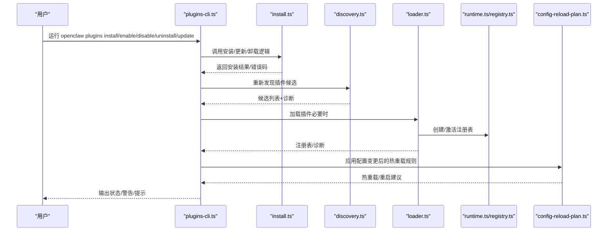
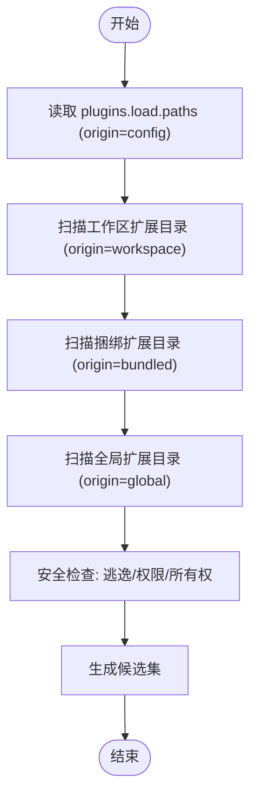
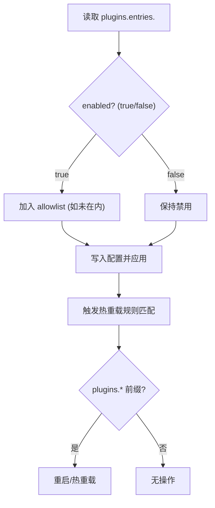
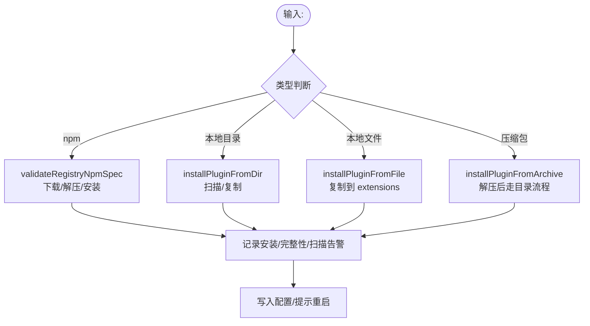
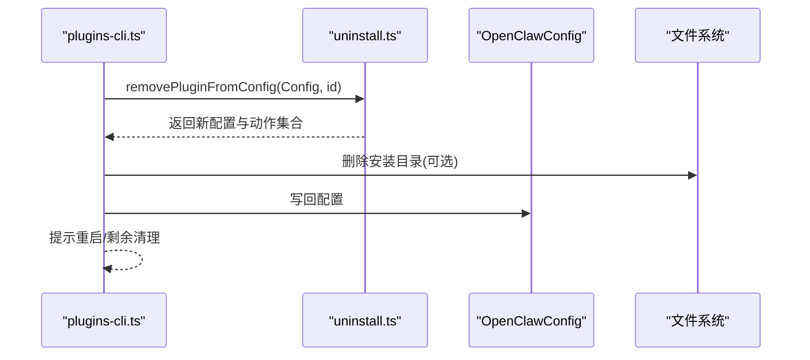
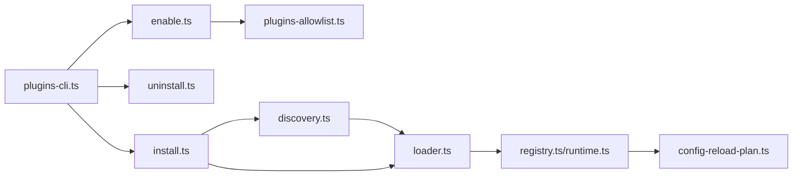

# 插件安装和管理

<cite>
**本文引用的文件**
- [src/plugins/discovery.ts](file://src/plugins/discovery.ts)
- [src/plugins/config-state.ts](file://src/plugins/config-state.ts)
- [src/plugins/loader.ts](file://src/plugins/loader.ts)
- [src/plugins/install.ts](file://src/plugins/install.ts)
- [src/cli/plugins-cli.ts](file://src/cli/plugins-cli.ts)
- [src/plugins/uninstall.ts](file://src/plugins/uninstall.ts)
- [src/plugins/enable.ts](file://src/plugins/enable.ts)
- [src/config/plugins-allowlist.ts](file://src/config/plugins-allowlist.ts)
- [src/gateway/config-reload-plan.ts](file://src/gateway/config-reload-plan.ts)
- [docs/cli/plugins.md](file://docs/cli/plugins.md)
- [docs/plugins/manifest.md](file://docs/plugins/manifest.md)
</cite>

## 目录
1. [简介](#简介)
2. [项目结构](#项目结构)
3. [核心组件](#核心组件)
4. [架构总览](#架构总览)
5. [详细组件分析](#详细组件分析)
6. [依赖关系分析](#依赖关系分析)
7. [性能考量](#性能考量)
8. [故障排除指南](#故障排除指南)
9. [结论](#结论)
10. [附录](#附录)

## 简介
本文件面向 OpenClaw 的插件安装与管理系统，围绕“插件发现机制与优先级”、“安装流程（npm 包、本地目录/文件、压缩包、链接安装）”、“配置管理（启用/禁用、配置校验、热重载）”、“更新与卸载（版本与依赖处理）”、“信任机制与安全策略（allow/deny 列表、路径安全检查、权限控制）”以及“故障排除与常见问题”，提供系统化、可操作的技术文档。

## 项目结构
OpenClaw 将插件系统按职责拆分为多个模块：
- 发现与加载：负责扫描插件候选、解析清单、建立运行时注册表并加载插件。
- 安装与更新：负责从多种来源安装插件、记录安装信息、处理依赖与完整性校验。
- 配置与状态：负责规范化配置、决定启用状态、内存槽位选择等。
- CLI 管理：提供 list/info/enable/disable/install/uninstall/update/doctor 等命令。
- 安全与信任：路径安全检查、允许/拒绝列表、完整性漂移提示、代码扫描告警。
- 热重载：基于配置前缀的热重载/重启规则，支持通道插件贡献规则。

```mermaid
graph TB
subgraph "发现与加载"
D["discovery.ts<br/>扫描候选/安全检查"]
C["config-state.ts<br/>规范化配置/启用决策"]
L["loader.ts<br/>加载插件/注册表/边界读取"]
end
subgraph "安装与更新"
I["install.ts<br/>多源安装/依赖/完整性/扫描"]
U["uninstall.ts<br/>清理配置/路径/槽位"]
E["enable.ts<br/>启用/加入允许列表"]
A["plugins-allowlist.ts<br/>ensurePluginAllowlisted"]
end
subgraph "CLI"
CLI["plugins-cli.ts<br/>命令入口/写配置/日志"]
DOC["docs/cli/plugins.md<br/>用户手册"]
end
subgraph "安全与信任"
S["安全扫描/完整性/路径检查"]
end
subgraph "热重载"
R["config-reload-plan.ts<br/>reload 规则"]
end
D --> L
C --> L
I --> CLI
U --> CLI
E --> CLI
A --> E
S --> I
S --> D
L --> R
CLI --> R
```

图表来源
- [src/plugins/discovery.ts](file://src/plugins/discovery.ts#L618-L712)
- [src/plugins/config-state.ts](file://src/plugins/config-state.ts#L90-L104)
- [src/plugins/loader.ts](file://src/plugins/loader.ts#L447-L800)
- [src/plugins/install.ts](file://src/plugins/install.ts#L1-L573)
- [src/plugins/uninstall.ts](file://src/plugins/uninstall.ts#L65-L104)
- [src/plugins/enable.ts](file://src/plugins/enable.ts#L12-L24)
- [src/config/plugins-allowlist.ts](file://src/config/plugins-allowlist.ts#L3-L15)
- [src/gateway/config-reload-plan.ts](file://src/gateway/config-reload-plan.ts#L77-L140)
- [docs/cli/plugins.md](file://docs/cli/plugins.md#L1-L103)

章节来源
- [src/plugins/discovery.ts](file://src/plugins/discovery.ts#L618-L712)
- [src/plugins/config-state.ts](file://src/plugins/config-state.ts#L90-L104)
- [src/plugins/loader.ts](file://src/plugins/loader.ts#L447-L800)
- [src/plugins/install.ts](file://src/plugins/install.ts#L1-L573)
- [src/plugins/uninstall.ts](file://src/plugins/uninstall.ts#L65-L104)
- [src/plugins/enable.ts](file://src/plugins/enable.ts#L12-L24)
- [src/config/plugins-allowlist.ts](file://src/config/plugins-allowlist.ts#L3-L15)
- [src/gateway/config-reload-plan.ts](file://src/gateway/config-reload-plan.ts#L77-L140)
- [docs/cli/plugins.md](file://docs/cli/plugins.md#L1-L103)

## 核心组件
- 插件发现与安全检查：扫描工作区、捆绑、全局扩展目录，识别候选并进行路径逃逸、权限、所有权检查。
- 插件配置状态：规范化 plugins.* 配置，计算启用状态、内存槽位决策、测试默认值。
- 插件加载器：建立注册表、Jiti 动态加载、边界文件读取、插件导出解析、配置模式校验、错误诊断。
- 安装器：支持 npm 包、本地目录/文件、压缩包；记录安装、依赖安装、完整性校验、安全扫描。
- 卸载器：从配置 entries/installs/allowlist/load.paths/slots 清理，并处理内存槽位回退。
- 启用/禁用：设置 entries 中 enabled 字段，自动加入 allowlist。
- 热重载：基于前缀匹配的热重载/无操作/重启规则，通道插件可贡献规则。

章节来源
- [src/plugins/discovery.ts](file://src/plugins/discovery.ts#L1-L200)
- [src/plugins/config-state.ts](file://src/plugins/config-state.ts#L1-L287)
- [src/plugins/loader.ts](file://src/plugins/loader.ts#L1-L200)
- [src/plugins/install.ts](file://src/plugins/install.ts#L1-L200)
- [src/plugins/uninstall.ts](file://src/plugins/uninstall.ts#L65-L104)
- [src/plugins/enable.ts](file://src/plugins/enable.ts#L12-L24)
- [src/gateway/config-reload-plan.ts](file://src/gateway/config-reload-plan.ts#L77-L140)

## 架构总览
下图展示从 CLI 到安装、发现、加载与热重载的整体流程。



图表来源
- [src/cli/plugins-cli.ts](file://src/cli/plugins-cli.ts#L199-L200)
- [src/plugins/install.ts](file://src/plugins/install.ts#L1-L200)
- [src/plugins/discovery.ts](file://src/plugins/discovery.ts#L618-L712)
- [src/plugins/loader.ts](file://src/plugins/loader.ts#L447-L800)
- [src/gateway/config-reload-plan.ts](file://src/gateway/config-reload-plan.ts#L77-L140)

## 详细组件分析

### 插件发现机制与优先级
- 扫描顺序（优先级从高到低）：
  1) 显式配置路径（plugins.load.paths）：origin=config，可覆盖后续来源。
  2) 工作区扩展目录（workspace/.openclaw/extensions）：origin=workspace。
  3) 捆绑扩展目录（内置打包插件）：origin=bundled，默认仅部分内置插件启用。
  4) 全局扩展目录（配置目录下的 extensions）：origin=global。
- 安全检查：
  - 源文件不得逃逸插件根目录。
  - 不允许世界可写的路径。
  - 非捆绑来源需满足所有者 UID 合法性（类 Unix 平台）。
- 缓存：发现结果可缓存，受环境变量控制 TTL。



图表来源
- [src/plugins/discovery.ts](file://src/plugins/discovery.ts#L618-L712)
- [src/plugins/discovery.ts](file://src/plugins/discovery.ts#L117-L251)

章节来源
- [src/plugins/discovery.ts](file://src/plugins/discovery.ts#L618-L712)
- [src/plugins/discovery.ts](file://src/plugins/discovery.ts#L117-L251)

### 插件配置管理（启用/禁用、配置校验、热重载）
- 启用/禁用：
  - 启用：设置 entries.<id>.enabled=true，并自动加入 allowlist。
  - 禁用：设置 entries.<id>.enabled=false。
- 配置校验：
  - 严格 JSON Schema 校验，不执行插件代码即可验证。
  - manifest 必须包含 id 与 configSchema，否则视为错误。
- 热重载：
  - 基于前缀匹配的规则：plugins 前缀触发重启，通道插件可贡献 hot/noop 前缀。
  - 通道插件可通过 reload 字段声明热重载/无操作前缀。



图表来源
- [src/plugins/enable.ts](file://src/plugins/enable.ts#L12-L24)
- [src/config/plugins-allowlist.ts](file://src/config/plugins-allowlist.ts#L3-L15)
- [docs/plugins/manifest.md](file://docs/plugins/manifest.md#L47-L76)
- [src/gateway/config-reload-plan.ts](file://src/gateway/config-reload-plan.ts#L77-L140)

章节来源
- [src/plugins/enable.ts](file://src/plugins/enable.ts#L12-L24)
- [src/config/plugins-allowlist.ts](file://src/config/plugins-allowlist.ts#L3-L15)
- [docs/plugins/manifest.md](file://docs/plugins/manifest.md#L47-L76)
- [src/gateway/config-reload-plan.ts](file://src/gateway/config-reload-plan.ts#L77-L140)

### 插件安装流程（npm/本地/压缩包/链接）
- 支持来源：
  - npm 包规范：registry-only，支持精确版本或 dist-tag；禁止裸版本与 semver 范围。
  - 本地路径：目录/文件/压缩包（.zip/.tgz/.tar.gz/.tar），自动识别类型。
  - 链接安装：--link 将路径加入 plugins.load.paths，避免复制。
- 安装步骤要点：
  - 解析 openclaw.plugin.json 与 openclaw.extensions。
  - 安全扫描（可疑/危险模式告警但不阻断）。
  - 依赖安装使用 --ignore-scripts。
  - 记录安装信息（plugins.installs），支持 --pin 保存解析后的精确 spec。
  - 对于 npm 安装，支持完整性哈希漂移提示与交互确认。
- 错误码与提示：
  - 缺少 openclaw.extensions、空数组、npm 包不存在、插件 id 不匹配等。



图表来源
- [src/plugins/install.ts](file://src/plugins/install.ts#L487-L539)
- [src/plugins/install.ts](file://src/plugins/install.ts#L413-L431)
- [src/plugins/install.ts](file://src/plugins/install.ts#L433-L485)
- [src/plugins/install.ts](file://src/plugins/install.ts#L379-L411)
- [docs/cli/plugins.md](file://docs/cli/plugins.md#L39-L71)

章节来源
- [src/plugins/install.ts](file://src/plugins/install.ts#L487-L539)
- [src/plugins/install.ts](file://src/plugins/install.ts#L413-L431)
- [src/plugins/install.ts](file://src/plugins/install.ts#L433-L485)
- [src/plugins/install.ts](file://src/plugins/install.ts#L379-L411)
- [docs/cli/plugins.md](file://docs/cli/plugins.md#L39-L71)

### 插件更新与卸载
- 更新：
  - 仅对已记录在 plugins.installs 的 npm 安装生效。
  - 若存在存储的完整性哈希且实际哈希变化，会提示并要求确认；CI 可用 --yes 跳过。
- 卸载：
  - 清理 entries/installs/allowlist/load.paths/slots。
  - 默认删除磁盘上的安装目录；--keep-files 保留文件。
  - 对活动内存插件，内存槽位回退至 memory-core。



图表来源
- [src/plugins/uninstall.ts](file://src/plugins/uninstall.ts#L65-L104)
- [src/cli/plugins-cli.ts](file://src/cli/plugins-cli.ts#L691-L717)

章节来源
- [src/plugins/uninstall.ts](file://src/plugins/uninstall.ts#L65-L104)
- [src/cli/plugins-cli.ts](file://src/cli/plugins-cli.ts#L691-L717)
- [docs/cli/plugins.md](file://docs/cli/plugins.md#L72-L103)

### 插件信任机制与安全策略
- allow/deny 列表：
  - plugins.allow：白名单，未在其中的插件在未显式允许时不可加载。
  - plugins.deny：黑名单，明确阻止加载。
- 路径安全检查：
  - 源文件必须位于插件根目录内，禁止硬链接（捆绑除外）。
  - 禁止世界可写路径；类 Unix 平台检查所有者 UID。
- 代码安全扫描：
  - 安装阶段对插件源进行扫描，出现危险/可疑模式时发出告警。
- 完整性与版本：
  - npm 安装支持完整性哈希比较，漂移时提示并需要确认。
  - --pin 保存解析后的精确版本，便于审计与复现。

章节来源
- [src/plugins/discovery.ts](file://src/plugins/discovery.ts#L117-L251)
- [src/plugins/install.ts](file://src/plugins/install.ts#L284-L306)
- [src/plugins/install.ts](file://src/plugins/install.ts#L500-L539)
- [src/plugins/config-state.ts](file://src/plugins/config-state.ts#L189-L220)

## 依赖关系分析
- 组件耦合：
  - discovery.ts 与 loader.ts 通过候选集与清单建立注册表。
  - install.ts 与 uninstall.ts 与 CLI 存在双向调用关系（CLI 调用安装/卸载，安装/卸载后 CLI 写配置）。
  - enable.ts 与 plugins-allowlist.ts 协作实现“启用即加入 allowlist”的策略。
  - config-reload-plan.ts 与 loader.ts/registry.ts 协同实现热重载。
- 外部依赖：
  - npm registry 与包解析（仅 registry-only 规范）。
  - 文件系统与边界读取（防止逃逸与硬链接）。



图表来源
- [src/cli/plugins-cli.ts](file://src/cli/plugins-cli.ts#L1-L200)
- [src/plugins/install.ts](file://src/plugins/install.ts#L1-L200)
- [src/plugins/uninstall.ts](file://src/plugins/uninstall.ts#L65-L104)
- [src/plugins/enable.ts](file://src/plugins/enable.ts#L12-L24)
- [src/config/plugins-allowlist.ts](file://src/config/plugins-allowlist.ts#L3-L15)
- [src/plugins/discovery.ts](file://src/plugins/discovery.ts#L618-L712)
- [src/plugins/loader.ts](file://src/plugins/loader.ts#L447-L800)
- [src/gateway/config-reload-plan.ts](file://src/gateway/config-reload-plan.ts#L77-L140)

章节来源
- [src/cli/plugins-cli.ts](file://src/cli/plugins-cli.ts#L1-L200)
- [src/plugins/install.ts](file://src/plugins/install.ts#L1-L200)
- [src/plugins/uninstall.ts](file://src/plugins/uninstall.ts#L65-L104)
- [src/plugins/enable.ts](file://src/plugins/enable.ts#L12-L24)
- [src/config/plugins-allowlist.ts](file://src/config/plugins-allowlist.ts#L3-L15)
- [src/plugins/discovery.ts](file://src/plugins/discovery.ts#L618-L712)
- [src/plugins/loader.ts](file://src/plugins/loader.ts#L447-L800)
- [src/gateway/config-reload-plan.ts](file://src/gateway/config-reload-plan.ts#L77-L140)

## 性能考量
- 发现缓存：通过环境变量控制 TTL，减少启动时重复扫描。
- 懒加载：Jiti 动态加载仅在插件启用且通过校验后才执行，避免无谓的依赖加载。
- 注册表缓存：loader.ts 内部对注册表进行缓存，命中时直接激活。
- 测试默认：测试环境下默认禁用插件并关闭内存槽位，加速测试套件。

章节来源
- [src/plugins/discovery.ts](file://src/plugins/discovery.ts#L45-L66)
- [src/plugins/loader.ts](file://src/plugins/loader.ts#L458-L465)
- [src/plugins/config-state.ts](file://src/plugins/config-state.ts#L137-L173)

## 故障排除指南
- 安装失败（缺少 openclaw.extensions 或空数组）：
  - 检查 package.json 中 openclaw.extensions 是否存在且非空。
- npm 包不存在或解析失败：
  - 确认包名与版本正确；仅支持 registry-only 规范。
- 插件 id 不匹配：
  - 插件清单 id 与 npm 包名不一致时，以清单 id 为准。
- 安装完整性漂移：
  - 出现哈希变化时需确认；CI 可使用 --yes 自动确认。
- 插件未加载：
  - 检查 plugins.allow/allowlist、plugins.deny、plugins.entries.<id>.enabled。
  - 确认 manifest 与 configSchema 正确。
- 热重载无效：
  - 确认配置变更前缀是否被识别；通道插件可能贡献了 hot/noop 前缀。
- 权限/路径问题：
  - 检查路径是否世界可写、是否逃逸插件根目录、所有者是否异常。

章节来源
- [src/plugins/install.ts](file://src/plugins/install.ts#L100-L129)
- [src/plugins/install.ts](file://src/plugins/install.ts#L131-L137)
- [src/plugins/install.ts](file://src/plugins/install.ts#L254-L260)
- [src/plugins/install.ts](file://src/plugins/install.ts#L531-L538)
- [src/plugins/config-state.ts](file://src/plugins/config-state.ts#L189-L220)
- [docs/plugins/manifest.md](file://docs/plugins/manifest.md#L47-L76)
- [src/gateway/config-reload-plan.ts](file://src/gateway/config-reload-plan.ts#L77-L140)
- [src/plugins/discovery.ts](file://src/plugins/discovery.ts#L117-L251)

## 结论
OpenClaw 的插件系统通过严格的清单与配置校验、多源安装与安全扫描、可信路径与权限检查、以及基于前缀的热重载策略，实现了安全、可控、可观测的插件生命周期管理。遵循本文档的安装、配置与安全实践，可有效降低风险并提升运维效率。

## 附录
- 用户参考：CLI 命令与行为说明见官方文档。
- 清单规范：每个插件必须提供 openclaw.plugin.json 与 JSON Schema。

章节来源
- [docs/cli/plugins.md](file://docs/cli/plugins.md#L1-L103)
- [docs/plugins/manifest.md](file://docs/plugins/manifest.md#L1-L76)