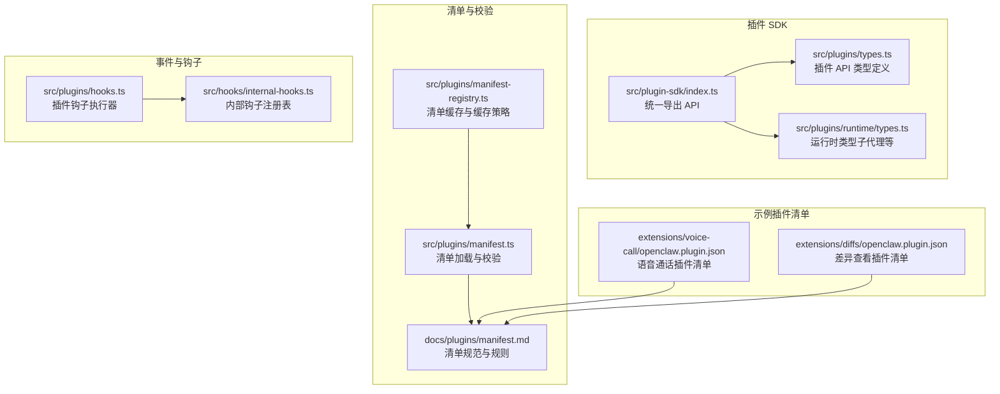
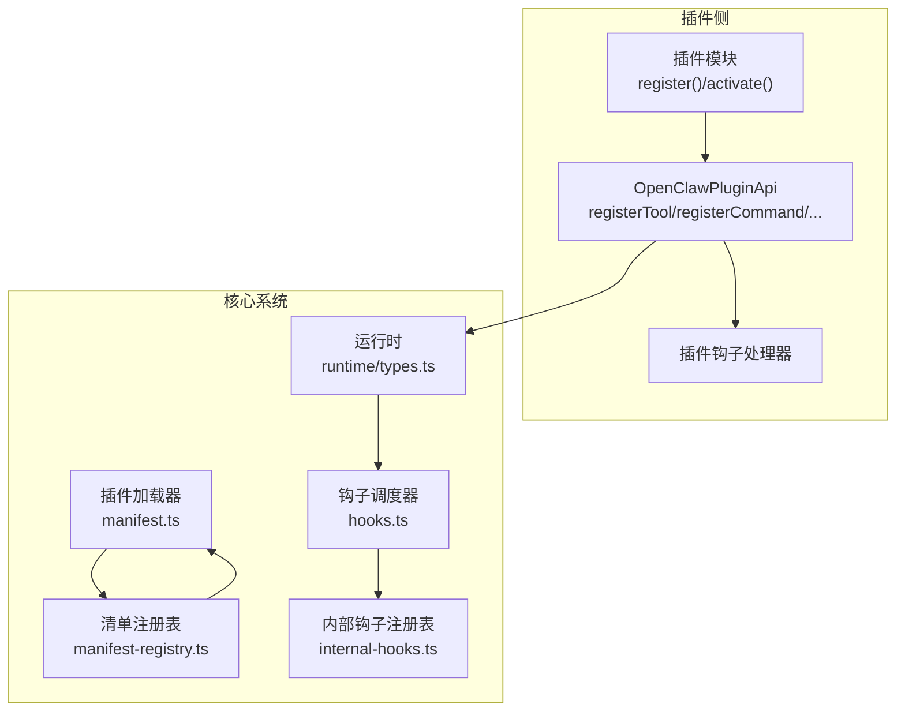
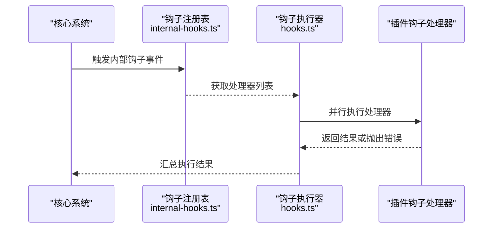
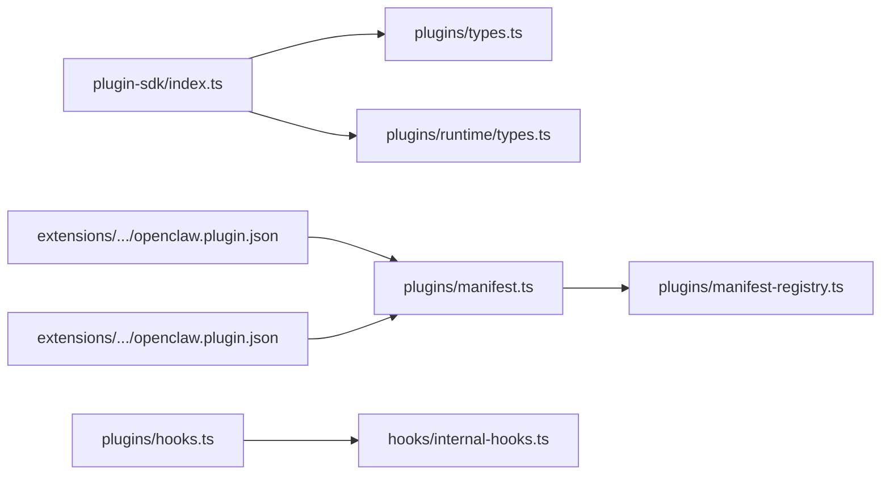

# 插件开发指南

<cite>
**本文引用的文件**
- [index.ts](file://src/plugin-sdk/index.ts)
- [types.ts](file://src/plugins/types.ts)
- [manifest.md](file://docs/plugins/manifest.md)
- [agent-tools.md](file://docs/plugins/agent-tools.md)
- [rpc.md](file://docs/reference/rpc.md)
- [manifest.ts](file://src/plugins/manifest.ts)
- [manifest-registry.ts](file://src/plugins/manifest-registry.ts)
- [hooks.ts](file://src/plugins/hooks.ts)
- [internal-hooks.ts](file://src/hooks/internal-hooks.ts)
- [runtime/types.ts](file://src/plugins/runtime/types.ts)
- [channel-tools.ts](file://src/agents/channel-tools.ts)
- [openclaw.plugin.json（voice-call）](file://extensions/voice-call/openclaw.plugin.json)
- [openclaw.plugin.json（diffs）](file://extensions/diffs/openclaw.plugin.json)
</cite>

## 目录
1. [简介](#简介)
2. [项目结构](#项目结构)
3. [核心组件](#核心组件)
4. [架构总览](#架构总览)
5. [详细组件分析](#详细组件分析)
6. [依赖关系分析](#依赖关系分析)
7. [性能考量](#性能考量)
8. [故障排查指南](#故障排查指南)
9. [结论](#结论)
10. [附录](#附录)

## 简介
本指南面向希望在 OpenClaw 中开发插件的开发者，系统讲解插件 SDK 的架构与 API、插件清单规范与校验规则、插件生命周期与注册机制、事件钩子体系、以及与核心系统的集成方式（RPC 方法、HTTP 路由、工具注册、钩子系统）。同时提供从项目初始化、编码、测试到调试的完整流程，并给出可直接参考的示例与最佳实践。

## 项目结构
OpenClaw 将插件能力抽象为“插件 SDK”，并通过统一的入口导出 API，便于在不同上下文中使用。插件清单（openclaw.plugin.json）用于声明插件元数据与配置 Schema，核心系统在加载插件模块前先进行清单与 Schema 校验，确保配置安全与一致性。

图表来源
- [index.ts](file://src/plugin-sdk/index.ts#L1-L812)
- [types.ts](file://src/plugins/types.ts#L1-L893)
- [runtime/types.ts](file://src/plugins/runtime/types.ts#L1-L64)
- [manifest.md](file://docs/plugins/manifest.md#L1-L76)
- [manifest.ts](file://src/plugins/manifest.ts#L45-L88)
- [manifest-registry.ts](file://src/plugins/manifest-registry.ts#L47-L77)
- [hooks.ts](file://src/plugins/hooks.ts#L184-L224)
- [internal-hooks.ts](file://src/hooks/internal-hooks.ts#L174-L193)
- [openclaw.plugin.json（voice-call）](file://extensions/voice-call/openclaw.plugin.json#L1-L601)
- [openclaw.plugin.json（diffs）](file://extensions/diffs/openclaw.plugin.json#L1-L183)

章节来源
- [index.ts](file://src/plugin-sdk/index.ts#L1-L812)
- [types.ts](file://src/plugins/types.ts#L1-L893)
- [manifest.md](file://docs/plugins/manifest.md#L1-L76)
- [manifest.ts](file://src/plugins/manifest.ts#L45-L88)
- [manifest-registry.ts](file://src/plugins/manifest-registry.ts#L47-L77)
- [hooks.ts](file://src/plugins/hooks.ts#L184-L224)
- [internal-hooks.ts](file://src/hooks/internal-hooks.ts#L174-L193)
- [runtime/types.ts](file://src/plugins/runtime/types.ts#L1-L64)
- [openclaw.plugin.json（voice-call）](file://extensions/voice-call/openclaw.plugin.json#L1-L601)
- [openclaw.plugin.json（diffs）](file://extensions/diffs/openclaw.plugin.json#L1-L183)

## 核心组件
- 插件 SDK 统一入口：集中导出插件 API、运行时、HTTP/Webhook、RPC、工具、配置 Schema、日志与诊断等能力。
- 插件类型与 API：定义插件生命周期钩子、工具注册、命令注册、HTTP 路由注册、网关方法注册、服务注册、提供方注册等。
- 清单与校验：要求每个插件必须提供 openclaw.plugin.json，包含 id、configSchema 等字段；核心系统在加载前进行严格校验。
- 钩子系统：支持多种 Agent 生命周期钩子与消息/工具/会话/子代理等钩子，插件可订阅并影响运行时行为。
- 运行时：提供子代理运行、等待、会话消息查询、删除会话等能力，支撑复杂交互场景。

章节来源
- [index.ts](file://src/plugin-sdk/index.ts#L1-L812)
- [types.ts](file://src/plugins/types.ts#L248-L306)
- [manifest.md](file://docs/plugins/manifest.md#L9-L76)
- [manifest.ts](file://src/plugins/manifest.ts#L45-L88)
- [hooks.ts](file://src/plugins/hooks.ts#L184-L224)
- [runtime/types.ts](file://src/plugins/runtime/types.ts#L51-L63)

## 架构总览
下图展示插件 SDK 与核心系统的交互：插件通过 SDK 注册工具、命令、HTTP 路由、网关方法、服务与提供方；核心系统在启动阶段加载并校验插件清单；运行时触发钩子事件，插件可拦截与修改行为。

图表来源
- [types.ts](file://src/plugins/types.ts#L248-L306)
- [manifest.ts](file://src/plugins/manifest.ts#L45-L88)
- [manifest-registry.ts](file://src/plugins/manifest-registry.ts#L47-L77)
- [runtime/types.ts](file://src/plugins/runtime/types.ts#L51-L63)
- [hooks.ts](file://src/plugins/hooks.ts#L184-L224)
- [internal-hooks.ts](file://src/hooks/internal-hooks.ts#L174-L193)

## 详细组件分析

### 插件清单规范与校验
- 必填字段：id、configSchema。
- 可选字段：kind、channels、providers、skills、name、description、uiHints、version。
- 校验规则：未知 channels.* 键错误；plugins.entries.<id>/plugins.allow/plugins.deny/plugins.slots.* 必须引用“可发现”的插件 id；缺失或损坏的清单/Schema 导致 Doctor 报错；禁用但存在配置时记录警告。
- 注意事项：清单对所有插件（含本地文件系统加载）均强制要求；运行时仍单独加载插件模块，清单仅用于发现与校验。

章节来源
- [manifest.md](file://docs/plugins/manifest.md#L9-L76)
- [manifest.ts](file://src/plugins/manifest.ts#L45-L88)
- [manifest-registry.ts](file://src/plugins/manifest-registry.ts#L47-L77)

### 插件 API 与生命周期
- OpenClawPluginApi 提供：
  - 工具注册：registerTool（支持工厂函数与可选工具）
  - 命令注册：registerCommand（绕过 LLM 的简单命令）
  - HTTP 路由注册：registerHttpRoute（支持认证与匹配策略）
  - 网关方法注册：registerGatewayMethod（RPC 适配）
  - 服务注册：registerService（生命周期 start/stop）
  - 提供方注册：registerProvider（OAuth/API Key 等）
  - 钩子注册：registerHook（内部钩子）、on（生命周期钩子）
  - 通道注册：registerChannel（通道插件）
  - 上下文路径解析：resolvePath
- 生命周期钩子：before_model_resolve、before_prompt_build、before_agent_start、llm_input、llm_output、agent_end、before_compaction、after_compaction、before_reset、message_*、tool_*、session_*、subagent_*、gateway_* 等。

章节来源
- [types.ts](file://src/plugins/types.ts#L248-L306)
- [types.ts](file://src/plugins/types.ts#L321-L395)
- [types.ts](file://src/plugins/types.ts#L396-L893)

### 钩子系统与事件处理
- 插件可通过 registerHook 订阅内部钩子（例如 message_sending），或通过 on 订阅生命周期钩子（例如 before_agent_start）。
- 钩子执行器并行调用所有处理器，异常可被捕获或抛出，影响系统稳定性。
- 内部钩子注册表为全局单例，避免多分块打包导致处理器不可见的问题。

图表来源
- [internal-hooks.ts](file://src/hooks/internal-hooks.ts#L174-L193)
- [hooks.ts](file://src/plugins/hooks.ts#L184-L224)

章节来源
- [hooks.ts](file://src/plugins/hooks.ts#L184-L224)
- [internal-hooks.ts](file://src/hooks/internal-hooks.ts#L174-L193)

### 插件类型与开发要点
- Agent 工具插件：通过 registerTool 注册 JSON Schema 函数，支持必选与可选工具；可选工具需在 agents.tools.allow 中显式启用。
- 通道插件：通过 registerChannel 注册通道适配器，配合通道工具聚合器列出可用动作与工具。
- 提供程序插件：通过 registerProvider 注册认证方式（OAuth、API Key 等），并可返回默认模型与配置补丁。
- 网关方法与 RPC：通过 registerGatewayMethod 注册 RPC 方法；参考 RPC 适配模式（HTTP 守护进程或 stdio 子进程）。

章节来源
- [agent-tools.md](file://docs/plugins/agent-tools.md#L9-L100)
- [channel-tools.ts](file://src/agents/channel-tools.ts#L31-L65)
- [types.ts](file://src/plugins/types.ts#L122-L132)
- [rpc.md](file://docs/reference/rpc.md#L9-L44)

### HTTP 路由与 Webhook
- 插件可通过 registerHttpRoute 注册路由，支持认证（gateway/plugin）与匹配策略（exact/prefix）。
- Webhook 目标注册与鉴权：提供注册、解析与鉴权工具，支持请求体限制、速率限制与异常追踪。
- 路径规范化：提供 normalizePluginHttpPath 与 webhook 路径工具，确保路由唯一性与安全性。

章节来源
- [index.ts](file://src/plugin-sdk/index.ts#L125-L175)
- [index.ts](file://src/plugin-sdk/index.ts#L125-L149)

### 运行时与子代理
- 运行时类型定义了子代理运行、等待、会话消息查询与删除等能力，支持幂等键与超时控制。
- 插件可在运行时中派生子代理任务，参与复杂对话与任务编排。

章节来源
- [runtime/types.ts](file://src/plugins/runtime/types.ts#L51-L63)

### 示例：语音通话插件清单
- 包含 uiHints 与 configSchema，覆盖提供商参数、外呼/内呼策略、流媒体、TTS/STT、隧道暴露、公网 URL、安全策略等。
- 该清单展示了如何通过 uiHints 提升配置体验，通过 configSchema 实现强校验。

章节来源
- [openclaw.plugin.json（voice-call）](file://extensions/voice-call/openclaw.plugin.json#L1-L601)

### 示例：差异查看插件清单
- 包含技能目录、默认渲染参数与安全开关，体现插件如何声明资源与配置项。
- 适合学习如何组织插件资源与 UI 提示。

章节来源
- [openclaw.plugin.json（diffs）](file://extensions/diffs/openclaw.plugin.json#L1-L183)

## 依赖关系分析
- 插件 SDK 对运行时、HTTP/Webhook、RPC、工具、配置 Schema、日志与诊断等模块进行统一导出，形成稳定的 API 表面。
- 清单加载与校验独立于插件模块加载，确保在执行前完成配置安全检查。
- 钩子系统通过内部注册表与执行器解耦插件与核心逻辑，支持扩展与可观测性。

图表来源
- [index.ts](file://src/plugin-sdk/index.ts#L1-L812)
- [types.ts](file://src/plugins/types.ts#L1-L893)
- [runtime/types.ts](file://src/plugins/runtime/types.ts#L1-L64)
- [manifest.ts](file://src/plugins/manifest.ts#L45-L88)
- [manifest-registry.ts](file://src/plugins/manifest-registry.ts#L47-L77)
- [hooks.ts](file://src/plugins/hooks.ts#L184-L224)
- [internal-hooks.ts](file://src/hooks/internal-hooks.ts#L174-L193)
- [openclaw.plugin.json（voice-call）](file://extensions/voice-call/openclaw.plugin.json#L1-L601)
- [openclaw.plugin.json（diffs）](file://extensions/diffs/openclaw.plugin.json#L1-L183)

章节来源
- [index.ts](file://src/plugin-sdk/index.ts#L1-L812)
- [types.ts](file://src/plugins/types.ts#L1-L893)
- [runtime/types.ts](file://src/plugins/runtime/types.ts#L1-L64)
- [manifest.ts](file://src/plugins/manifest.ts#L45-L88)
- [manifest-registry.ts](file://src/plugins/manifest-registry.ts#L47-L77)
- [hooks.ts](file://src/plugins/hooks.ts#L184-L224)
- [internal-hooks.ts](file://src/hooks/internal-hooks.ts#L174-L193)
- [openclaw.plugin.json（voice-call）](file://extensions/voice-call/openclaw.plugin.json#L1-L601)
- [openclaw.plugin.json（diffs）](file://extensions/diffs/openclaw.plugin.json#L1-L183)

## 性能考量
- 钩子执行器并行处理多个处理器，提升吞吐；建议插件处理器保持无阻塞与幂等。
- 清单缓存策略通过环境变量控制缓存窗口与是否启用，减少启动阶段的重复读取。
- HTTP/Webhook 请求体大小与速率限制、异常计数器等内存保护机制，防止滥用与资源耗尽。

章节来源
- [hooks.ts](file://src/plugins/hooks.ts#L203-L224)
- [manifest-registry.ts](file://src/plugins/manifest-registry.ts#L56-L77)
- [index.ts](file://src/plugin-sdk/index.ts#L428-L440)

## 故障排查指南
- 清单与 Schema 校验失败：检查 openclaw.plugin.json 是否位于插件根目录、id 与 configSchema 是否存在、Schema 是否符合 JSON Schema 规范。
- Doctor 报错：根据提示定位插件错误；若插件已禁用但仍保留配置，将出现警告。
- 钩子异常：钩子处理器抛错可被捕获或传播，检查日志与错误堆栈；必要时在插件中增加 try/catch 与降级逻辑。
- RPC 适配问题：遵循 HTTP 守护进程或 stdio 子进程模式，确保健康探测、事件流与方法调用正确实现。

章节来源
- [manifest.md](file://docs/plugins/manifest.md#L53-L76)
- [manifest.ts](file://src/plugins/manifest.ts#L45-L88)
- [hooks.ts](file://src/plugins/hooks.ts#L184-L197)
- [rpc.md](file://docs/reference/rpc.md#L9-L44)

## 结论
OpenClaw 插件体系以“清单优先、类型安全、钩子驱动、运行时可控”为核心设计原则。通过标准化的 SDK 接口与严格的清单校验，开发者可以快速构建高质量的插件，覆盖 Agent 工具、通道适配、提供方集成、RPC 与 HTTP/Webhook 等多种场景。建议在开发过程中充分利用配置 Schema 与 UI Hints 提升用户体验，并通过钩子系统实现对 Agent 行为的细粒度控制。

## 附录
- 开发流程建议
  - 初始化：创建 openclaw.plugin.json，编写最小化 configSchema 与 uiHints。
  - 编码：在插件入口中实现 register/activate，按需注册工具、命令、HTTP 路由、网关方法、服务与提供方。
  - 测试：利用内置工具与钩子进行单元与集成测试；关注清单校验与 Doctor 报告。
  - 调试：结合日志、诊断事件与钩子结果，定位问题根因。
- 最佳实践
  - 使用可选工具降低副作用风险，通过 allowlist 控制启用范围。
  - 为敏感配置标记 uiHints.sensitive，避免明文泄露。
  - 在 RPC 适配中实现健康探测与重试，确保外部进程稳定性。
  - 合理设置 HTTP/Webhook 限流与请求体大小，保障系统安全与稳定。