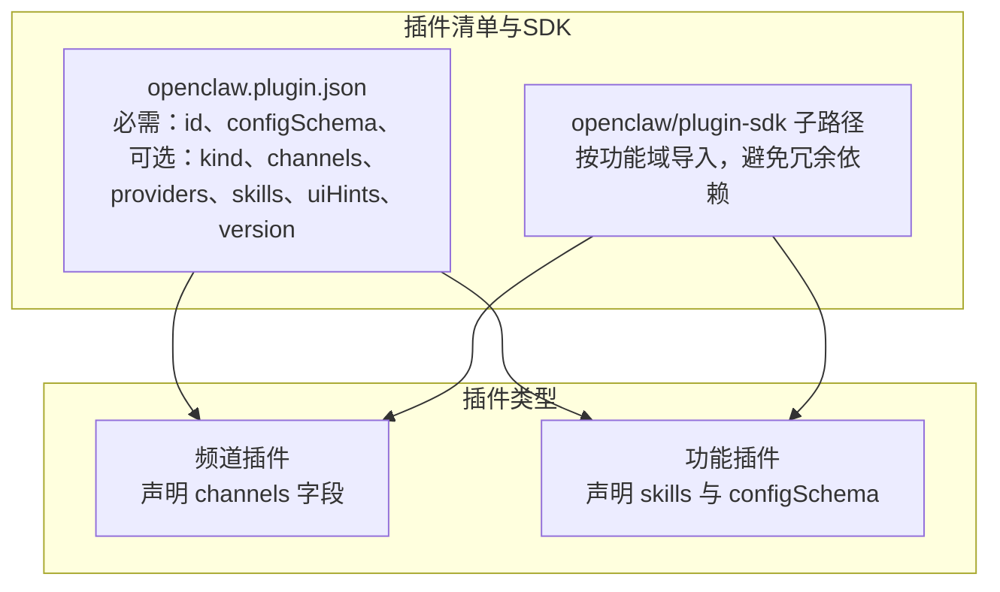
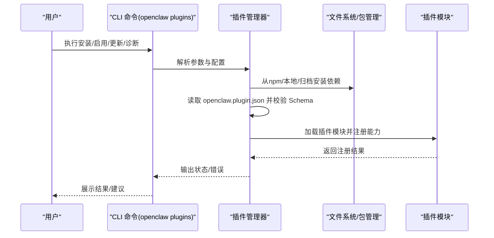
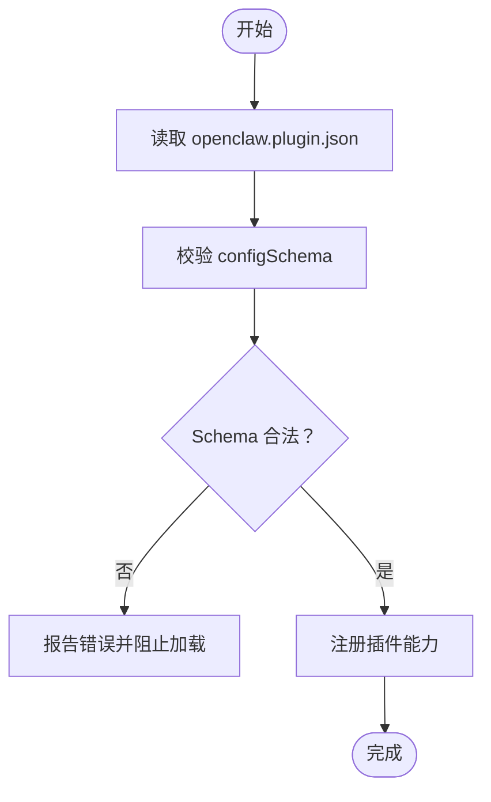
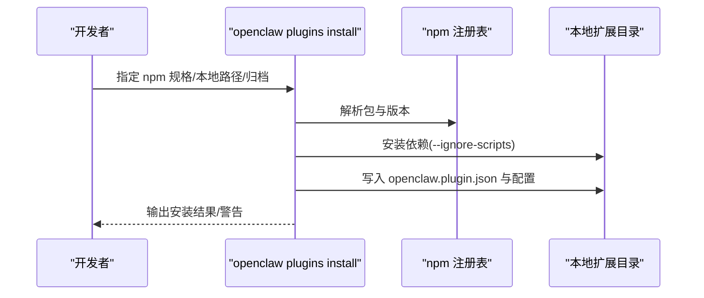
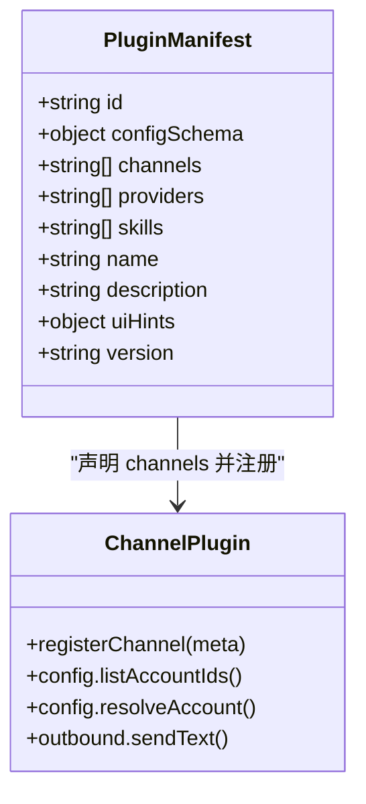
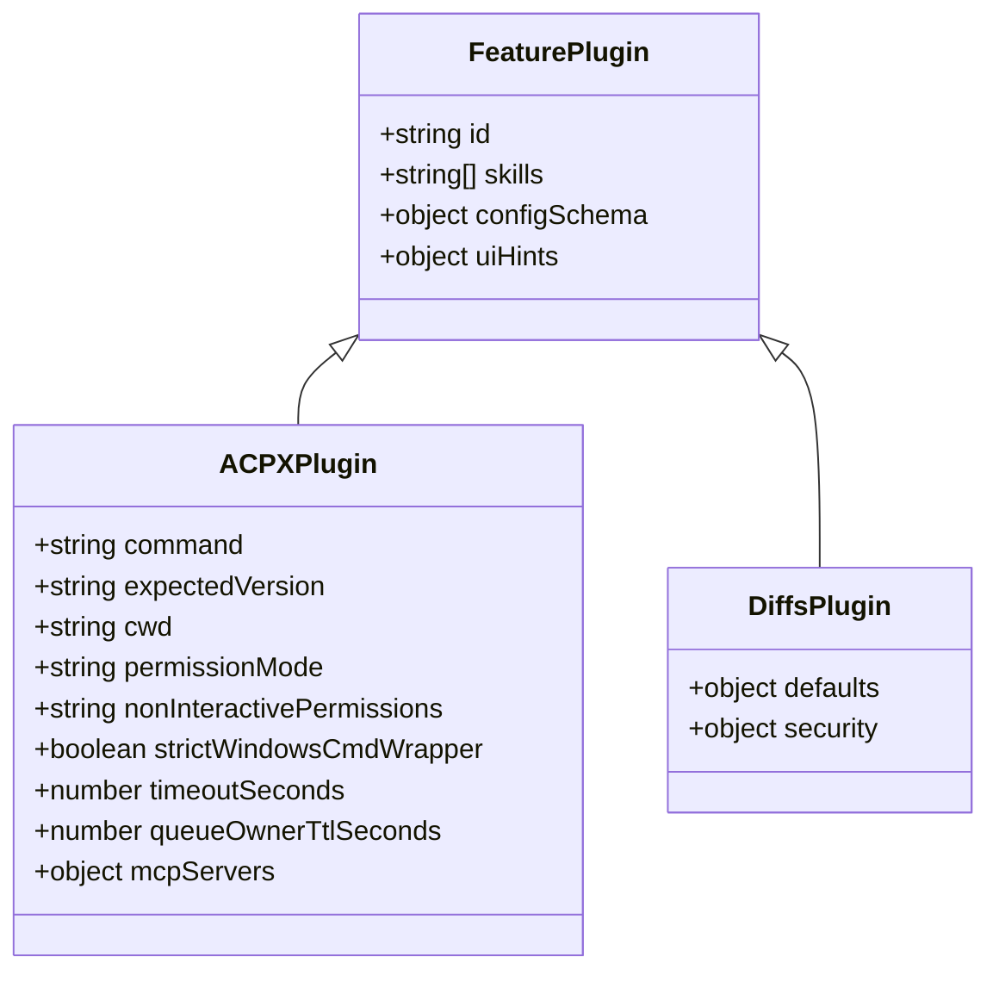
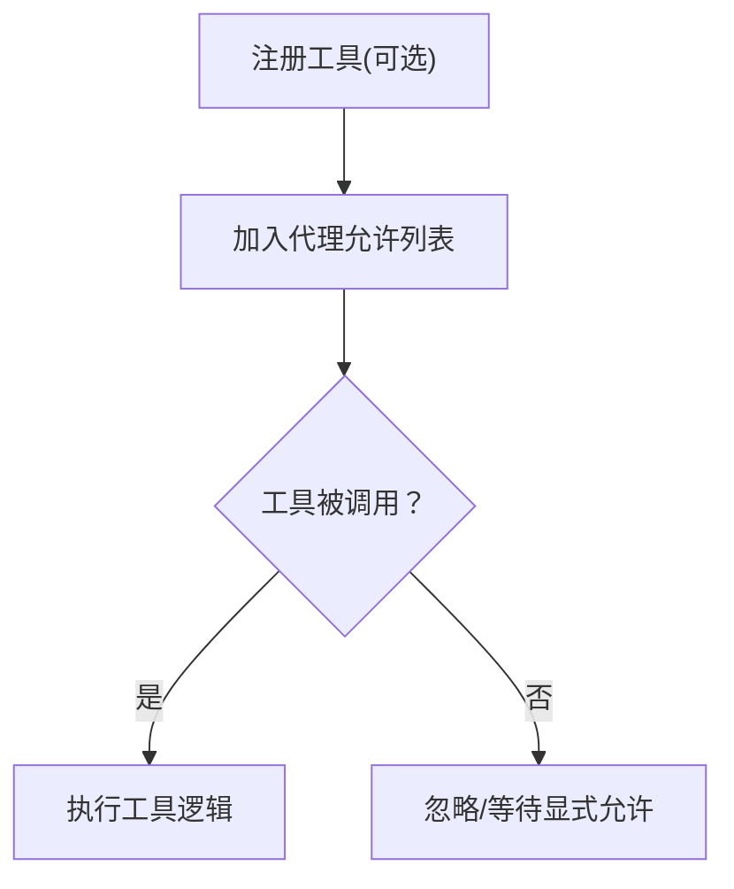
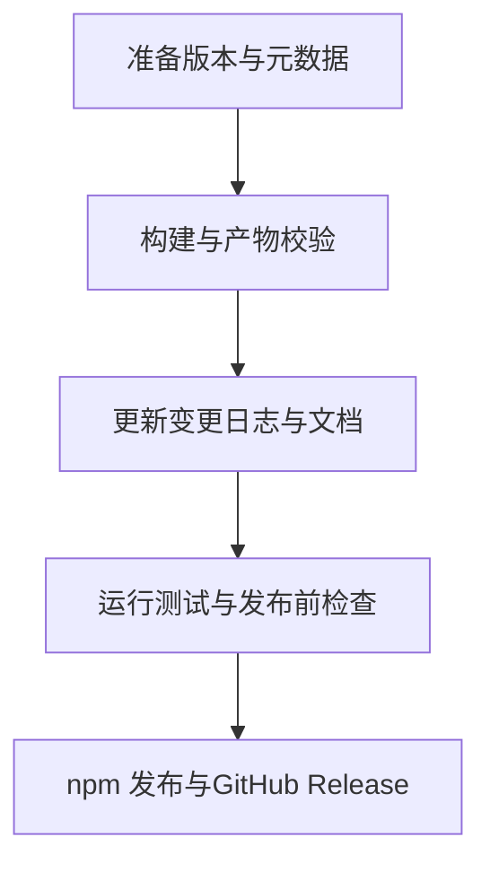
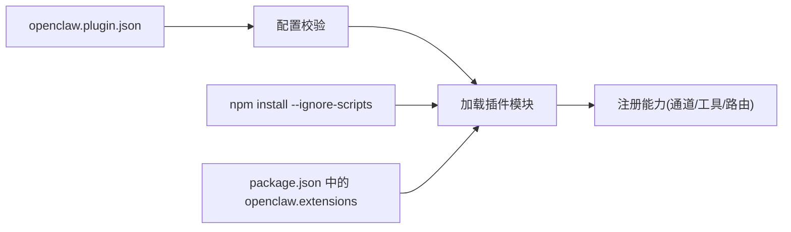

# 第三方插件

<cite>
**本文引用的文件**
- [docs/plugins/manifest.md](file://docs/plugins/manifest.md)
- [docs/plugins/community.md](file://docs/plugins/community.md)
- [docs/cli/plugins.md](file://docs/cli/plugins.md)
- [docs/tools/plugin.md](file://docs/tools/plugin.md)
- [docs/plugins/agent-tools.md](file://docs/plugins/agent-tools.md)
- [docs/reference/RELEASING.md](file://docs/reference/RELEASING.md)
- [SECURITY.md](file://SECURITY.md)
- [CONTRIBUTING.md](file://CONTRIBUTING.md)
- [extensions/discord/openclaw.plugin.json](file://extensions/discord/openclaw.plugin.json)
- [extensions/telegram/openclaw.plugin.json](file://extensions/telegram/openclaw.plugin.json)
- [extensions/slack/openclaw.plugin.json](file://extensions/slack/openclaw.plugin.json)
- [extensions/acpx/openclaw.plugin.json](file://extensions/acpx/openclaw.plugin.json)
- [extensions/diffs/openclaw.plugin.json](file://extensions/diffs/openclaw.plugin.json)
- [extensions/acpx/package.json](file://extensions/acpx/package.json)
- [extensions/diffs/package.json](file://extensions/diffs/package.json)
</cite>

## 目录
1. [简介](#简介)
2. [项目结构](#项目结构)
3. [核心组件](#核心组件)
4. [架构总览](#架构总览)
5. [详细组件分析](#详细组件分析)
6. [依赖关系分析](#依赖关系分析)
7. [性能考量](#性能考量)
8. [故障排查指南](#故障排查指南)
9. [结论](#结论)
10. [附录](#附录)

## 简介
本文件面向OpenClaw第三方插件开发者与使用者，系统化阐述插件生态的开发标准、清单规范、版本与发布流程、安装与配置方法、审核与质量保障机制、市场与发现机制、贡献与协作流程、治理与社区参与方式，以及开发者资源与支持信息。内容基于仓库内官方文档与示例插件清单进行归纳总结，并辅以可视化图示帮助理解。

## 项目结构
OpenClaw通过“插件（扩展）”机制在运行时加载功能模块，覆盖通道接入、工具函数、上下文引擎、HTTP路由等能力。插件以TypeScript模块形式存在，必须提供位于根目录的清单文件，用于声明元数据、注册频道/提供商/技能、并内置JSON Schema以实现配置严格校验。

- 插件清单与SDK
  - 清单文件：每个插件根目录需包含openclaw.plugin.json，用于声明id、类型、注册项、配置Schema与UI提示等。
  - SDK子路径：插件可按功能域选择openclaw/plugin-sdk的子路径导入，避免引入不必要的依赖。
- 官方与社区插件
  - 官方插件：随发行版分发，通常默认禁用，可通过命令行启用。
  - 社区插件：由社区维护并通过npm发布，遵循统一清单与Schema规范，经社区审核后可在文档中列出。
- 示例插件
  - 频道类插件：如discord、telegram、slack等，通过清单声明channels字段以注册消息通道。
  - 功能类插件：如acpx、diffs等，通过清单声明skills与configSchema，提供工具或界面能力。

**图表来源**
- [docs/tools/plugin.md](file://docs/tools/plugin.md#L146-L186)
- [extensions/discord/openclaw.plugin.json](file://extensions/discord/openclaw.plugin.json#L1-L10)
- [extensions/telegram/openclaw.plugin.json](file://extensions/telegram/openclaw.plugin.json#L1-L10)
- [extensions/slack/openclaw.plugin.json](file://extensions/slack/openclaw.plugin.json#L1-L10)
- [extensions/acpx/openclaw.plugin.json](file://extensions/acpx/openclaw.plugin.json#L1-L106)
- [extensions/diffs/openclaw.plugin.json](file://extensions/diffs/openclaw.plugin.json#L1-L183)

**章节来源**
- [docs/tools/plugin.md](file://docs/tools/plugin.md#L146-L186)
- [docs/plugins/manifest.md](file://docs/plugins/manifest.md#L11-L76)
- [extensions/discord/openclaw.plugin.json](file://extensions/discord/openclaw.plugin.json#L1-L10)
- [extensions/telegram/openclaw.plugin.json](file://extensions/telegram/openclaw.plugin.json#L1-L10)
- [extensions/slack/openclaw.plugin.json](file://extensions/slack/openclaw.plugin.json#L1-L10)
- [extensions/acpx/openclaw.plugin.json](file://extensions/acpx/openclaw.plugin.json#L1-L106)
- [extensions/diffs/openclaw.plugin.json](file://extensions/diffs/openclaw.plugin.json#L1-L183)

## 核心组件
- 插件清单（openclaw.plugin.json）
  - 必填字段：id、configSchema（即使为空也必须提供）。
  - 可选字段：kind、channels、providers、skills、name、description、uiHints、version。
  - 清单用于严格配置校验，缺失或非法清单会导致插件无法加载。
- 插件安装与管理（CLI）
  - 支持从npm安装、本地路径安装、压缩包安装；支持链接模式（开发调试）、固定版本（pin）。
  - 支持更新、卸载、启用/禁用、诊断（doctor）等操作。
- 插件类型与能力
  - 频道插件：注册消息通道，配置存放在channels.<id>下。
  - 工具插件：注册LLM可用的工具函数，支持必选/可选策略与白名单控制。
  - 上下文引擎插件：替换或扩展会话上下文编排。
  - HTTP路由：向网关暴露受控HTTP端点。
- 安全与信任模型
  - 插件与本地代码同属可信执行边界，安装/启用即授予同等权限。
  - 通过allow/deny列表、slots独占槽位、缓存与安全检查降低风险。

**章节来源**
- [docs/plugins/manifest.md](file://docs/plugins/manifest.md#L11-L76)
- [docs/cli/plugins.md](file://docs/cli/plugins.md#L19-L103)
- [docs/tools/plugin.md](file://docs/tools/plugin.md#L460-L521)
- [SECURITY.md](file://SECURITY.md#L104-L187)

## 架构总览
OpenClaw在启动时按优先级扫描插件来源，读取清单并进行严格配置校验，随后加载插件模块并注册其能力。用户通过CLI对插件进行安装、启用/禁用、更新与诊断。

**图表来源**
- [docs/cli/plugins.md](file://docs/cli/plugins.md#L19-L103)
- [docs/tools/plugin.md](file://docs/tools/plugin.md#L228-L304)
- [docs/plugins/manifest.md](file://docs/plugins/manifest.md#L53-L76)

**章节来源**
- [docs/cli/plugins.md](file://docs/cli/plugins.md#L19-L103)
- [docs/tools/plugin.md](file://docs/tools/plugin.md#L228-L304)
- [docs/plugins/manifest.md](file://docs/plugins/manifest.md#L53-L76)

## 详细组件分析

### 组件A：插件清单与Schema（严格配置校验）
- 必须提供openclaw.plugin.json，且包含id与configSchema。
- Schema在配置读写阶段即时验证，不依赖运行时代码。
- 未知插件id、未声明的channels.*键、缺失/损坏清单均视为错误。
- uiHints可增强UI表单标签、占位符与敏感字段标记。

**图表来源**
- [docs/plugins/manifest.md](file://docs/plugins/manifest.md#L47-L76)

**章节来源**
- [docs/plugins/manifest.md](file://docs/plugins/manifest.md#L11-L76)

### 组件B：安装与配置（npm、本地与归档）
- npm安装仅支持包名+精确版本或dist-tag，拒绝语义化范围与Git/URL规格。
- bare spec与@latest默认稳定轨道；若解析到预发布版本，需显式选择预发布标签或精确版本。
- 支持--link（开发链接）与--pin（固定版本）；支持--dry-run与--keep-files。
- 更新仅适用于已跟踪的npm安装；变更完整性哈希时会提示确认。

**图表来源**
- [docs/cli/plugins.md](file://docs/cli/plugins.md#L39-L103)

**章节来源**
- [docs/cli/plugins.md](file://docs/cli/plugins.md#L39-L103)

### 组件C：频道插件（注册消息通道）
- 在清单中声明channels数组，注册后配置置于channels.<id>命名空间。
- 典型示例：discord、telegram、slack等。

**图表来源**
- [extensions/discord/openclaw.plugin.json](file://extensions/discord/openclaw.plugin.json#L1-L10)
- [extensions/telegram/openclaw.plugin.json](file://extensions/telegram/openclaw.plugin.json#L1-L10)
- [extensions/slack/openclaw.plugin.json](file://extensions/slack/openclaw.plugin.json#L1-L10)
- [docs/tools/plugin.md](file://docs/tools/plugin.md#L655-L721)

**章节来源**
- [extensions/discord/openclaw.plugin.json](file://extensions/discord/openclaw.plugin.json#L1-L10)
- [extensions/telegram/openclaw.plugin.json](file://extensions/telegram/openclaw.plugin.json#L1-L10)
- [extensions/slack/openclaw.plugin.json](file://extensions/slack/openclaw.plugin.json#L1-L10)
- [docs/tools/plugin.md](file://docs/tools/plugin.md#L655-L721)

### 组件D：功能插件（工具与界面）
- 通过清单声明skills目录与configSchema，提供工具函数或界面能力。
- 示例：acpx（ACP运行时后端）、diffs（差异查看与渲染）。

**图表来源**
- [extensions/acpx/openclaw.plugin.json](file://extensions/acpx/openclaw.plugin.json#L1-L106)
- [extensions/diffs/openclaw.plugin.json](file://extensions/diffs/openclaw.plugin.json#L1-L183)

**章节来源**
- [extensions/acpx/openclaw.plugin.json](file://extensions/acpx/openclaw.plugin.json#L1-L106)
- [extensions/diffs/openclaw.plugin.json](file://extensions/diffs/openclaw.plugin.json#L1-L183)

### 组件E：工具函数（可选工具与白名单）
- 工具可声明为必选或可选；可选工具需加入代理允许列表才可调用。
- 允许通过插件id或前缀组启用全部插件工具。

**图表来源**
- [docs/plugins/agent-tools.md](file://docs/plugins/agent-tools.md#L38-L100)

**章节来源**
- [docs/plugins/agent-tools.md](file://docs/plugins/agent-tools.md#L1-L100)

### 组件F：发布与版本管理（npm与插件生态）
- 发布范围限定于现有npm插件（@openclaw作用域），非npm插件保持磁盘树形态但随发行版分发。
- 发布清单与版本同步需遵循发行检查清单，确保包文件、构建产物与元数据一致。

**图表来源**
- [docs/reference/RELEASING.md](file://docs/reference/RELEASING.md#L93-L122)

**章节来源**
- [docs/reference/RELEASING.md](file://docs/reference/RELEASING.md#L93-L122)

## 依赖关系分析
- 插件清单依赖
  - 清单文件是插件发现与校验的唯一依据，缺失或非法将阻断加载。
  - 清单中的channels/providers/skills字段决定插件注册能力与配置命名空间。
- 包管理与依赖
  - npm安装时依赖安装采用--ignore-scripts策略，避免构建脚本带来的安全与兼容性问题。
  - 插件包可包含openclaw.extensions字段，将多个入口打包为多个插件。
- 安全与信任
  - 插件与本地代码同属可信边界，安装/启用即授予同等权限；通过allow/deny与slots限制冲突能力。

**图表来源**
- [docs/plugins/manifest.md](file://docs/plugins/manifest.md#L47-L76)
- [docs/tools/plugin.md](file://docs/tools/plugin.md#L278-L304)
- [extensions/acpx/package.json](file://extensions/acpx/package.json#L1-L15)
- [extensions/diffs/package.json](file://extensions/diffs/package.json#L1-L21)

**章节来源**
- [docs/plugins/manifest.md](file://docs/plugins/manifest.md#L47-L76)
- [docs/tools/plugin.md](file://docs/tools/plugin.md#L278-L304)
- [extensions/acpx/package.json](file://extensions/acpx/package.json#L1-L15)
- [extensions/diffs/package.json](file://extensions/diffs/package.json#L1-L21)

## 性能考量
- 发现与清单缓存
  - 插件发现与清单元数据使用短时进程内缓存，减少启动/重载抖动。
  - 可通过环境变量禁用缓存或调整缓存窗口大小。
- 运行时性能
  - 插件在进程内运行，具备与本地代码相同的执行权限与性能特征。
  - 对于需要外部进程交互的场景，应合理设置超时与队列所有权TTL，避免延迟累积。

**章节来源**
- [docs/tools/plugin.md](file://docs/tools/plugin.md#L219-L227)

## 故障排查指南
- 常见问题
  - 缺失/非法清单：表现为配置校验失败或Doctor报告插件错误。
  - 未知插件id/通道键：在entries、allow、deny、slots或channels中引用了未声明的id。
  - 禁用插件仍保留配置：将产生警告，可在Doctor中查看。
- 诊断命令
  - 使用openclaw plugins doctor输出插件状态与错误详情。
  - 使用openclaw plugins info <id>查看插件元信息与配置Schema。
- 安全与信任
  - 插件被视为可信代码，安装/启用前请确认来源与必要性。
  - 通过plugins.allow固定可信插件id，避免意外加载。

**章节来源**
- [docs/plugins/manifest.md](file://docs/plugins/manifest.md#L53-L76)
- [docs/cli/plugins.md](file://docs/cli/plugins.md#L19-L30)
- [SECURITY.md](file://SECURITY.md#L104-L187)

## 结论
OpenClaw的第三方插件生态以严格的清单与Schema为核心，结合清晰的安装/管理流程、安全信任模型与可观测的诊断能力，为开发者提供了可扩展、可审计、可协作的插件体系。遵循本文档的开发标准与发布流程，可有效提升插件质量与生态健康度。

## 附录

### A. 开发者资源与支持
- 贡献与维护团队
  - 提供快速链接、讨论入口与维护者联系方式，欢迎通过PR与讨论参与贡献。
- 安全政策
  - 明确漏洞上报渠道、报告要求与信任模型，强调边界绕过的重要性。
- 版本与发布
  - 发行检查清单与发布流程，确保npm与应用包一致性。

**章节来源**
- [CONTRIBUTING.md](file://CONTRIBUTING.md#L76-L187)
- [SECURITY.md](file://SECURITY.md#L1-L286)
- [docs/reference/RELEASING.md](file://docs/reference/RELEASING.md#L1-L122)

### B. 社区插件审核与质量保障
- 列表要求
  - npm发布、GitHub公开仓库、完善文档与问题追踪、明确维护信号。
- 提交流程
  - 通过PR添加条目，包含名称、npm包名、仓库地址、简述与安装命令。
- 审核标准
  - 重视实用性、文档完备性与运行安全性；低质量或无维护迹象的包可能被拒绝。

**章节来源**
- [docs/plugins/community.md](file://docs/plugins/community.md#L15-L52)