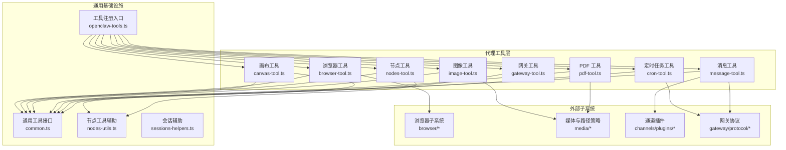
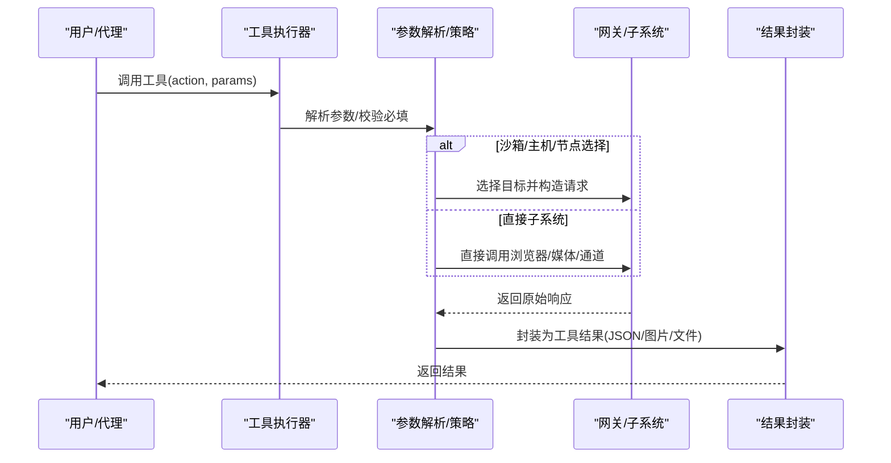
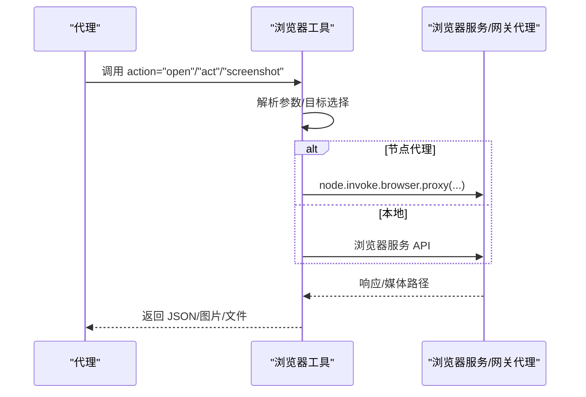
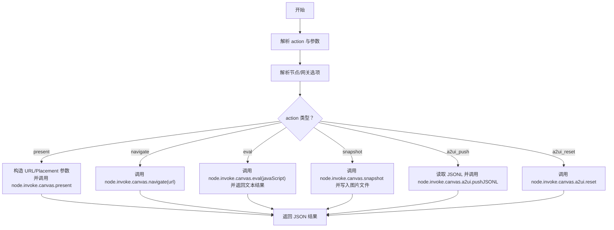
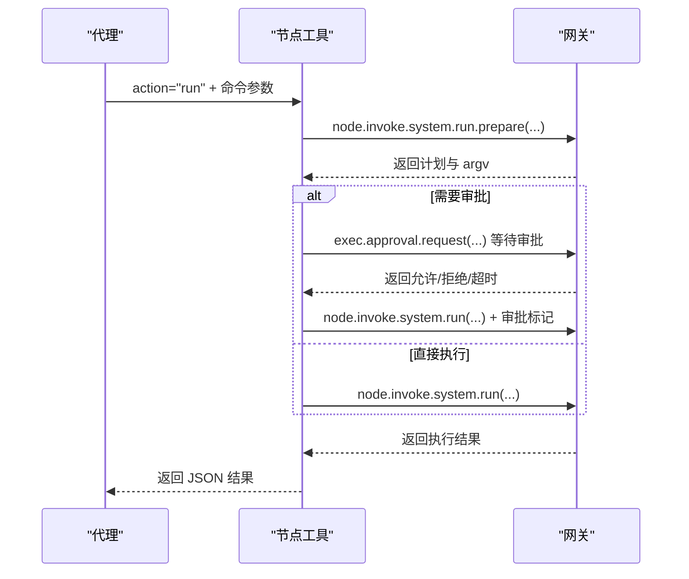
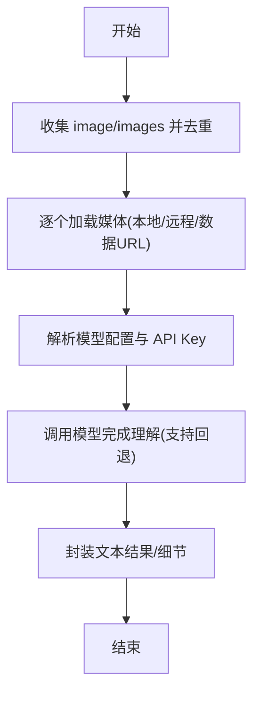
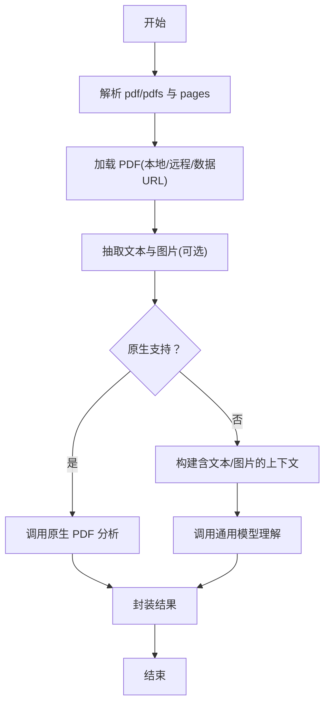
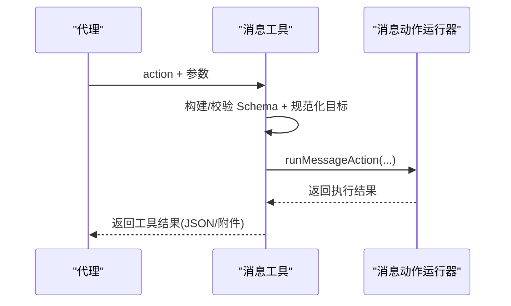
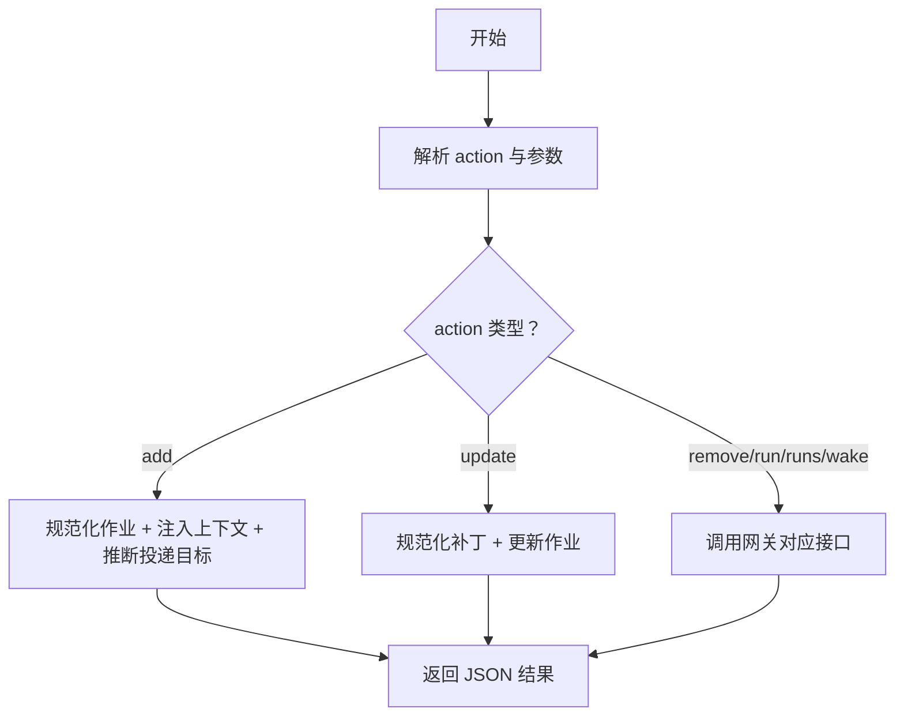
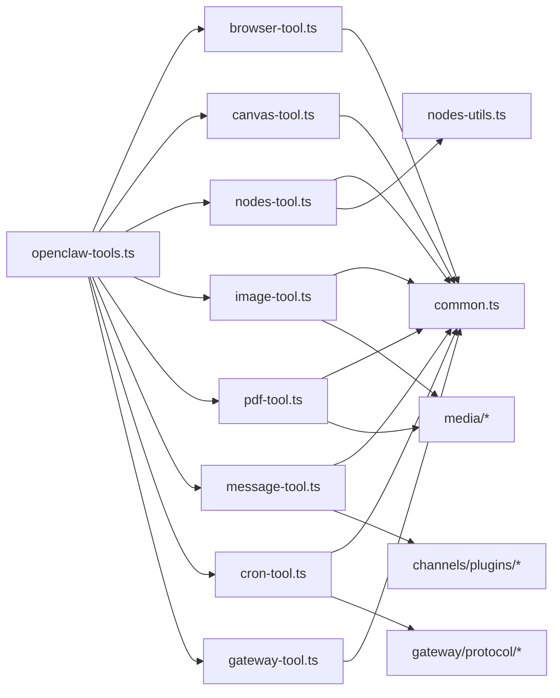

# 核心工具

<cite>
**本文引用的文件**
- [src/agents/tools/browser-tool.ts](file://src/agents/tools/browser-tool.ts)
- [src/agents/tools/canvas-tool.ts](file://src/agents/tools/canvas-tool.ts)
- [src/agents/tools/nodes-tool.ts](file://src/agents/tools/nodes-tool.ts)
- [src/agents/tools/image-tool.ts](file://src/agents/tools/image-tool.ts)
- [src/agents/tools/pdf-tool.ts](file://src/agents/tools/pdf-tool.ts)
- [src/agents/tools/message-tool.ts](file://src/agents/tools/message-tool.ts)
- [src/agents/tools/cron-tool.ts](file://src/agents/tools/cron-tool.ts)
- [src/agents/tools/gateway-tool.ts](file://src/agents/tools/gateway-tool.ts)
- [src/agents/tools/common.ts](file://src/agents/tools/common.ts)
- [src/agents/tools/nodes-utils.ts](file://src/agents/tools/nodes-utils.ts)
- [src/agents/tools/sessions-helpers.ts](file://src/agents/tools/sessions-helpers.ts)
- [src/agents/openclaw-tools.ts](file://src/agents/openclaw-tools.ts)
- [src/agents/pi-embedded-subscribe.tools.ts](file://src/agents/pi-embedded-subscribe.tools.ts)
- [src/browser/client.js](file://src/browser/client.js)
- [src/browser/client-actions.js](file://src/browser/client-actions.js)
- [src/browser/config.js](file://src/browser/config.js)
- [src/browser/paths.js](file://src/browser/paths.js)
- [src/browser/proxy-files.js](file://src/browser/proxy-files.js)
- [src/browser/session-tab-registry.js](file://src/browser/session-tab-registry.js)
- [src/cli/nodes-camera.js](file://src/cli/nodes-camera.js)
- [src/cli/nodes-canvas.js](file://src/cli/nodes-canvas.js)
- [src/cli/nodes-screen.js](file://src/cli/nodes-screen.js)
- [src/media/pdf-extract.js](file://src/media/pdf-extract.js)
- [src/media/inbound-path-policy.js](file://src/media/inbound-path-policy.js)
- [src/media/local-roots.js](file://src/media/local-roots.js)
- [src/media/mime.js](file://src/media/mime.js)
- [src/utils/message-channel.js](file://src/utils/message-channel.js)
- [src/routing/session-key.js](file://src/routing/session-key.js)
- [src/infra/outbound/message-action-runner.js](file://src/infra/outbound/message-action-runner.js)
- [src/channels/plugins/index.js](file://src/channels/plugins/index.js)
- [src/channels/plugins/message-actions.js](file://src/channels/plugins/message-actions.js)
- [src/cron/normalize.js](file://src/cron/normalize.js)
- [src/cron/webhook-url.js](file://src/cron/webhook-url.js)
- [src/shared/chat-content.js](file://src/shared/chat-content.js)
- [src/sessions/session-key-utils.js](file://src/sessions/session-key-utils.js)
- [src/gateway/protocol/client-info.js](file://src/gateway/protocol/client-info.js)
</cite>

## 目录
1. [简介](#简介)
2. [项目结构](#项目结构)
3. [核心组件](#核心组件)
4. [架构总览](#架构总览)
5. [详细组件分析](#详细组件分析)
6. [依赖关系分析](#依赖关系分析)
7. [性能考量](#性能考量)
8. [故障排除指南](#故障排除指南)
9. [结论](#结论)

## 简介
本文件系统性梳理 OpenClaw 的核心工具体系，覆盖浏览器控制、画布操作、节点设备管理、图像与 PDF 分析、消息发送、定时任务（Cron）、网关工具以及会话相关工具。文档从架构、数据流、处理逻辑、集成点、错误处理与性能特性等维度进行深入解析，并提供参数配置、使用场景、安全限制与最佳实践，帮助开发者与使用者正确、安全地使用这些工具。

## 项目结构
OpenClaw 的核心工具主要位于 agents/tools 目录下，按功能划分为独立模块，统一通过工具工厂函数创建并注册到代理运行时。各工具共享通用的参数解析、结果封装与网关调用能力；部分工具还涉及浏览器、节点、媒体与通道插件等子系统。

图表来源
- [src/agents/openclaw-tools.ts](file://src/agents/openclaw-tools.ts#L1-L22)
- [src/agents/tools/browser-tool.ts](file://src/agents/tools/browser-tool.ts#L1-L660)
- [src/agents/tools/canvas-tool.ts](file://src/agents/tools/canvas-tool.ts#L1-L216)
- [src/agents/tools/nodes-tool.ts](file://src/agents/tools/nodes-tool.ts#L1-L816)
- [src/agents/tools/image-tool.ts](file://src/agents/tools/image-tool.ts#L1-L512)
- [src/agents/tools/pdf-tool.ts](file://src/agents/tools/pdf-tool.ts#L1-L559)
- [src/agents/tools/message-tool.ts](file://src/agents/tools/message-tool.ts#L1-L793)
- [src/agents/tools/cron-tool.ts](file://src/agents/tools/cron-tool.ts#L1-L527)
- [src/agents/tools/gateway-tool.ts](file://src/agents/tools/gateway-tool.ts#L1-L200)
- [src/agents/tools/common.ts](file://src/agents/tools/common.ts#L1-L200)
- [src/agents/tools/nodes-utils.ts](file://src/agents/tools/nodes-utils.ts#L1-L200)
- [src/agents/tools/sessions-helpers.ts](file://src/agents/tools/sessions-helpers.ts#L1-L120)

章节来源
- [src/agents/openclaw-tools.ts](file://src/agents/openclaw-tools.ts#L1-L22)

## 核心组件
- 浏览器工具：提供浏览器状态、启动/停止、标签页管理、打开/聚焦/关闭、快照/截图、导航、控制台、PDF 导出、上传/对话框钩子、动作执行等能力；支持沙箱浏览器或节点代理。
- 画布工具：在节点上呈现/隐藏页面、导航、JavaScript 评估、截图、推送 A2UI JSONL、重置 A2UI。
- 节点工具：发现/描述节点、配对审批/拒绝、通知、相机拍照/视频、相册最新照片、屏幕录制、位置获取、系统命令执行（含审批流程）、通用命令调用。
- 图像工具：基于多模型的图像理解，支持本地/远程/数据 URL 加载、最大数量与大小限制、自动注入上下文图片、模型回退。
- PDF 工具：原生 PDF 分析（Anthropic/Gemini）与文本/图像提取回退，支持页码范围、最大字节与页数限制。
- 消息工具：跨通道发送、删除、反应、投票、主题、事件、存在状态、频道管理等，动态构建 Schema 并根据当前通道能力启用特性。
- 定时任务工具：管理 Cron 作业（增删改查、立即运行、查看历史），支持唤醒事件与提醒上下文注入。
- 网关工具：封装对网关的调用，供其他工具复用。

章节来源
- [src/agents/tools/browser-tool.ts](file://src/agents/tools/browser-tool.ts#L281-L660)
- [src/agents/tools/canvas-tool.ts](file://src/agents/tools/canvas-tool.ts#L80-L216)
- [src/agents/tools/nodes-tool.ts](file://src/agents/tools/nodes-tool.ts#L155-L816)
- [src/agents/tools/image-tool.ts](file://src/agents/tools/image-tool.ts#L270-L512)
- [src/agents/tools/pdf-tool.ts](file://src/agents/tools/pdf-tool.ts#L295-L559)
- [src/agents/tools/message-tool.ts](file://src/agents/tools/message-tool.ts#L669-L793)
- [src/agents/tools/cron-tool.ts](file://src/agents/tools/cron-tool.ts#L210-L527)
- [src/agents/tools/gateway-tool.ts](file://src/agents/tools/gateway-tool.ts#L1-L200)

## 架构总览
工具的执行路径通常遵循“参数解析 → 策略选择（沙箱/主机/节点）→ 网关调用/子系统交互 → 结果封装/媒体处理”的模式。浏览器工具可直接调用浏览器服务或经由网关路由到节点代理；节点工具通过网关执行节点命令；图像/PDF 工具加载媒体后调用模型完成分析；消息工具根据通道能力动态生成 Schema 并执行；定时任务工具与网关协议紧密耦合。

图表来源
- [src/agents/tools/browser-tool.ts](file://src/agents/tools/browser-tool.ts#L305-L657)
- [src/agents/tools/nodes-tool.ts](file://src/agents/tools/nodes-tool.ts#L181-L786)
- [src/agents/tools/image-tool.ts](file://src/agents/tools/image-tool.ts#L321-L510)
- [src/agents/tools/pdf-tool.ts](file://src/agents/tools/pdf-tool.ts#L357-L558)
- [src/agents/tools/message-tool.ts](file://src/agents/tools/message-tool.ts#L689-L790)
- [src/agents/tools/cron-tool.ts](file://src/agents/tools/cron-tool.ts#L273-L524)

## 详细组件分析

### 浏览器工具（browser）
- 功能概览
  - 控制浏览器状态、启动/停止、列出配置文件、标签页管理、打开/聚焦/关闭、快照/截图、导航、控制台、PDF 导出、上传/对话框钩子、动作执行。
  - 支持沙箱浏览器（通过桥接 URL）与主机浏览器；当可用节点具备浏览器代理能力时，自动路由至节点代理。
- 关键参数
  - action: 必填，如 status/start/stop/profiles/tabs/open/focus/close/snapshot/screenshot/navigate/console/pdf/upload/dialog/act。
  - target: sandbox/host/node；profile: chrome/openclaw；node: 指定节点；timeoutMs/超时；其他按 action 细化。
- 执行策略
  - 若指定 node 或 gateway.nodes.browser.mode=manual/auto 且有可用节点，则走 node.invoke.browser.proxy；否则走本地浏览器服务。
  - 截图/上传/对话框等操作返回媒体文件路径或二进制数据，自动持久化与路径映射。
- 安全与限制
  - 沙箱策略可禁止 host 控制；未启用浏览器时抛错；Chrome 扩展接管需附着标签页。
- 最佳实践
  - 使用 snapshot 获取稳定引用；优先传递上次调用返回的 targetId；合理设置超时；上传文件需在允许目录内。

图表来源
- [src/agents/tools/browser-tool.ts](file://src/agents/tools/browser-tool.ts#L305-L657)
- [src/browser/client.js](file://src/browser/client.js#L1-L200)
- [src/browser/client-actions.js](file://src/browser/client-actions.js#L1-L200)
- [src/browser/config.js](file://src/browser/config.js#L1-L200)
- [src/browser/paths.js](file://src/browser/paths.js#L1-L200)
- [src/browser/proxy-files.js](file://src/browser/proxy-files.js#L1-L200)
- [src/browser/session-tab-registry.js](file://src/browser/session-tab-registry.js#L1-L200)

章节来源
- [src/agents/tools/browser-tool.ts](file://src/agents/tools/browser-tool.ts#L281-L660)

### 画布工具（canvas）
- 功能概览
  - 在节点画布上呈现/隐藏页面、导航、执行 JavaScript、截图并返回图片、推送 A2UI JSONL、重置 A2UI。
- 关键参数
  - action: present/hide/navigate/eval/snapshot/a2ui_push/a2ui_reset。
  - node: 目标节点；gatewayUrl/token/timeoutMs；present 的 target/url/placement；snapshot 的格式/尺寸/质量/延迟；a2ui_push 的 jsonl/jsonlPath。
- 执行策略
  - 通过网关 node.invoke 调度节点命令；截图写入临时文件并封装为图片结果；A2UI 推送读取本地 JSONL。
- 安全与限制
  - jsonlPath 受本地根目录白名单限制；超出范围直接拒绝。
- 最佳实践
  - 使用 snapshot 记录 UI 状态；A2UI JSONL 一次性推送；注意图片质量与尺寸平衡。

图表来源
- [src/agents/tools/canvas-tool.ts](file://src/agents/tools/canvas-tool.ts#L88-L213)
- [src/cli/nodes-canvas.js](file://src/cli/nodes-canvas.js#L1-L200)
- [src/media/local-roots.js](file://src/media/local-roots.js#L1-L200)
- [src/media/inbound-path-policy.js](file://src/media/inbound-path-policy.js#L1-L200)
- [src/media/mime.js](file://src/media/mime.js#L1-L200)

章节来源
- [src/agents/tools/canvas-tool.ts](file://src/agents/tools/canvas-tool.ts#L80-L216)

### 节点工具（nodes）
- 功能概览
  - 列表/描述节点、配对审批/拒绝、通知、相机拍照/视频、相册最新照片、屏幕录制、位置获取、系统命令执行（含审批）、通用命令调用。
- 关键参数
  - action: status/describe/pending/approve/reject/notify/camera_snap/camera_clip/photos_latest/screen_record/location_get/run/invoke。
  - node: 目标节点；notify 的标题/正文/音效/优先级/投递方式；camera_snap/clip 的朝向/尺寸/质量/延时/设备；screen_record 的帧率/屏幕索引/输出路径/时长；location_get 的精度与时延；run 的命令/工作目录/环境变量/超时；invoke 的命令与参数。
- 执行策略
  - 通过网关 node.invoke 调用节点命令；系统运行支持准备阶段与审批流程；相机/屏幕录制写入临时文件并返回路径。
- 安全与限制
  - system.run 需要节点支持 system.run；不满足时抛错；invoke 媒体命令默认被阻止以避免上下文膨胀。
- 最佳实践
  - 先 describe/resolveNodeId 再执行；合理设置超时；相机/屏幕录制注意隐私与存储空间。

图表来源
- [src/agents/tools/nodes-tool.ts](file://src/agents/tools/nodes-tool.ts#L607-L747)
- [src/agents/tools/nodes-utils.ts](file://src/agents/tools/nodes-utils.ts#L1-L200)

章节来源
- [src/agents/tools/nodes-tool.ts](file://src/agents/tools/nodes-tool.ts#L155-L816)

### 图像工具（image）
- 功能概览
  - 使用图像模型对单张或多张图片进行理解，支持本地/远程/数据 URL；自动注入提示词；限制最大图片数量与体积；支持沙箱模式。
- 关键参数
  - prompt: 提示词；image/images: 单个或多个路径/URL；model: 模型覆盖；maxBytesMb/maxImages: 限制。
- 执行策略
  - 解析模型配置（优先显式配置，其次与主模型配对，再回退到默认），加载媒体并转为 base64，调用模型完成理解，回退链路处理。
- 安全与限制
  - 沙箱模式禁止远程 URL；超过最大数量/大小会截断或报错；仅允许受信任的本地根目录。
- 最佳实践
  - 当主模型具备视觉能力时，尽量让提示词包含图片；避免一次性传入过多图片；控制图片大小以提升性能。

图表来源
- [src/agents/tools/image-tool.ts](file://src/agents/tools/image-tool.ts#L321-L510)
- [src/media/pdf-extract.js](file://src/media/pdf-extract.js#L1-L200)

章节来源
- [src/agents/tools/image-tool.ts](file://src/agents/tools/image-tool.ts#L270-L512)

### PDF 工具（pdf）
- 功能概览
  - 对 PDF 进行原生分析（Anthropic/Gemini）或文本/图像提取后交给通用模型理解；支持页码范围、最大字节与页数限制。
- 关键参数
  - prompt: 提示词；pdf/pdfs: 单个或多个路径/URL；pages: 页码范围；model: 模型覆盖；maxBytesMb: 限制。
- 执行策略
  - 优先尝试原生 PDF 分析；若失败则抽取文本与图片，构建上下文交由模型回答；支持回退链路。
- 安全与限制
  - 沙箱模式禁止远程 URL；非 PDF 会拒绝；页码范围与最大页数受控。
- 最佳实践
  - 优先使用原生 PDF 分析以获得更准确的结果；必要时限制页数与大小。

图表来源
- [src/agents/tools/pdf-tool.ts](file://src/agents/tools/pdf-tool.ts#L357-L558)
- [src/media/pdf-extract.js](file://src/media/pdf-extract.js#L1-L200)

章节来源
- [src/agents/tools/pdf-tool.ts](file://src/agents/tools/pdf-tool.ts#L295-L559)

### 消息工具（message）
- 功能概览
  - 跨通道发送、删除、反应、投票、主题、事件、存在状态、频道管理等；Schema 动态构建，依据当前通道能力启用按钮/卡片/Discord 组件等。
- 关键参数
  - action: send/delete/react/poll/thread/event/presence/channel 等；路由参数（channel/targets/accountId）；发送参数（message/media/buffer/caption/buttons/card/components）。
- 执行策略
  - 根据通道能力过滤/扩展可用动作；标准化目标；通过消息动作运行器执行；支持沙箱根目录与中止信号。
- 安全与限制
  - 严格的目标规范化；对按钮/卡片/组件进行类型校验；支持干跑与显式目标要求。
- 最佳实践
  - 明确目标与通道；在需要时开启显式目标；谨慎使用组件与附件。

图表来源
- [src/agents/tools/message-tool.ts](file://src/agents/tools/message-tool.ts#L669-L793)
- [src/infra/outbound/message-action-runner.js](file://src/infra/outbound/message-action-runner.js#L1-L200)
- [src/utils/message-channel.js](file://src/utils/message-channel.js#L1-L200)

章节来源
- [src/agents/tools/message-tool.ts](file://src/agents/tools/message-tool.ts#L669-L793)

### 定时任务工具（cron）
- 功能概览
  - 管理 Cron 作业（状态/列表/新增/更新/删除/立即运行/历史），支持唤醒事件；可注入最近聊天上下文到提醒任务文本。
- 关键参数
  - action: status/list/add/update/remove/run/runs/wake；job/patch: 作业定义；jobId/id: 作业标识；mode/runMode: 唤醒/运行模式；contextMessages: 上下文消息数。
- 执行策略
  - 新增作业时进行扁平参数恢复与规范化；根据会话键推断投递目标；webhook 回调 URL 校验；添加提醒上下文（最多 10 条，每条最多 220 字，总量不超过 700 字）。
- 安全与限制
  - 仅限拥有者使用（ownerOnly）；严格校验作业类型与会话目标一致性；webhook 需为 http(s) URL。
- 最佳实践
  - 优先使用隔离会话的任务；明确投递目标；谨慎使用 webhook；合理设置上下文消息数。

图表来源
- [src/agents/tools/cron-tool.ts](file://src/agents/tools/cron-tool.ts#L273-L524)
- [src/cron/normalize.js](file://src/cron/normalize.js#L1-L200)
- [src/cron/webhook-url.js](file://src/cron/webhook-url.js#L1-L200)
- [src/shared/chat-content.js](file://src/shared/chat-content.js#L1-L200)
- [src/sessions/session-key-utils.js](file://src/sessions/session-key-utils.js#L1-L200)

章节来源
- [src/agents/tools/cron-tool.ts](file://src/agents/tools/cron-tool.ts#L210-L527)

### 网关工具（gateway）
- 功能概览
  - 为其他工具提供统一的网关调用封装，支持自定义网关地址、令牌与超时；用于节点工具、消息工具、定时任务工具等。
- 关键参数
  - gatewayUrl/gatewayToken/timeoutMs；调用命令与参数。
- 执行策略
  - 读取网关选项并发起 node.invoke 或专用网关 RPC；统一处理超时与幂等键。
- 最佳实践
  - 明确网关身份与客户端模式；合理设置超时；使用幂等键避免重复执行。

章节来源
- [src/agents/tools/gateway-tool.ts](file://src/agents/tools/gateway-tool.ts#L1-L200)
- [src/agents/tools/nodes-tool.ts](file://src/agents/tools/nodes-tool.ts#L80-L90)
- [src/agents/tools/message-tool.ts](file://src/agents/tools/message-tool.ts#L731-L743)
- [src/agents/tools/cron-tool.ts](file://src/agents/tools/cron-tool.ts#L276-L282)

## 依赖关系分析
- 工具注册
  - openclaw-tools.ts 统一导入并创建各类工具实例，作为代理运行时的工具集合。
- 工具间耦合
  - 多数工具依赖通用工具接口（参数解析、结果封装、网关调用）；节点工具与网关耦合最深；浏览器工具与浏览器子系统耦合；消息工具与通道插件耦合；图像/PDF 工具与媒体/模型系统耦合。
- 可能的循环依赖
  - 工具通过 common.ts 与 gateway-tool.ts 间接耦合，未见直接循环；浏览器工具与网关代理通过 callGatewayTool 间接交互。
- 外部依赖
  - 浏览器服务、节点命令、通道插件、网关协议、媒体加载与模型服务。

图表来源
- [src/agents/openclaw-tools.ts](file://src/agents/openclaw-tools.ts#L1-L22)
- [src/agents/tools/common.ts](file://src/agents/tools/common.ts#L1-L200)
- [src/agents/tools/gateway-tool.ts](file://src/agents/tools/gateway-tool.ts#L1-L200)
- [src/agents/tools/nodes-utils.ts](file://src/agents/tools/nodes-utils.ts#L1-L200)
- [src/agents/tools/message-tool.ts](file://src/agents/tools/message-tool.ts#L1-L200)
- [src/agents/tools/image-tool.ts](file://src/agents/tools/image-tool.ts#L1-L200)
- [src/agents/tools/pdf-tool.ts](file://src/agents/tools/pdf-tool.ts#L1-L200)
- [src/agents/tools/cron-tool.ts](file://src/agents/tools/cron-tool.ts#L1-L200)
- [src/gateway/protocol/client-info.js](file://src/gateway/protocol/client-info.js#L1-L200)

章节来源
- [src/agents/openclaw-tools.ts](file://src/agents/openclaw-tools.ts#L1-L22)

## 性能考量
- 媒体处理
  - 图像/PDF 工具支持最大数量与体积限制，避免大文件导致内存与带宽压力；建议在沙箱模式下限制远程访问。
- 超时与重试
  - 各工具提供超时参数与回退链路；节点命令执行前先进行准备与审批，避免长时间阻塞。
- 结果封装
  - 图片与文件结果采用临时文件与媒体路径，减少大对象在上下文中的传输成本；仅在需要时注入 base64。
- 浏览器与节点
  - 自动选择节点代理可降低本地资源占用；合理设置超时与目标（sandbox/host/node）以避免不必要的网络往返。

## 故障排除指南
- 浏览器工具
  - 未启用浏览器：检查配置；沙箱不可用：确认 sandboxBridgeUrl；Chrome 扩展未附着：引导用户点击工具栏按钮。
- 画布工具
  - jsonlPath 超出允许根目录：检查路径是否在白名单内；截图失败：检查格式/质量参数。
- 节点工具
  - system.run 不支持：确认节点命令列表；需要审批：等待 UI 审批或取消；invoke 媒体命令被阻止：改用专用 action。
- 图像/PDF 工具
  - 超过最大数量/大小：减少图片/PDF 数量或调整限制；非 PDF 文件：确认 MIME 类型；沙箱远程 URL：改为本地路径。
- 消息工具
  - 目标缺失：显式提供 target/targets；通道不支持动作：切换通道或使用 send；组件无效：检查组件 Schema。
- 定时任务工具
  - webhook URL 非法：确保 http(s)；上下文注入失败：检查会话键与历史记录；作业类型与会话目标不一致：修正 payload.kind。
- 权限与沙箱
  - 工具结果媒体白名单：仅特定工具允许本地媒体路径；PI 工具订阅中对媒体路径进行可信判定；网关调用需有效令牌与超时。

章节来源
- [src/agents/tools/browser-tool.ts](file://src/agents/tools/browser-tool.ts#L137-L199)
- [src/agents/tools/canvas-tool.ts](file://src/agents/tools/canvas-tool.ts#L30-L51)
- [src/agents/tools/nodes-tool.ts](file://src/agents/tools/nodes-tool.ts#L607-L747)
- [src/agents/tools/image-tool.ts](file://src/agents/tools/image-tool.ts#L424-L426)
- [src/agents/tools/pdf-tool.ts](file://src/agents/tools/pdf-tool.ts#L449-L451)
- [src/agents/tools/message-tool.ts](file://src/agents/tools/message-tool.ts#L712-L724)
- [src/agents/tools/cron-tool.ts](file://src/agents/tools/cron-tool.ts#L380-L390)
- [src/agents/pi-embedded-subscribe.tools.ts](file://src/agents/pi-embedded-subscribe.tools.ts#L133-L170)

## 结论
OpenClaw 的核心工具体系以“统一入口、分层职责、安全可控”为设计原则：通过 openclaw-tools.ts 统一注册，各工具模块专注于自身领域；通用基础设施提供参数解析、结果封装与网关调用；浏览器、节点、媒体与通道插件分别承担子系统职责。在使用过程中，应关注参数校验、目标选择、超时与回退、媒体与路径策略、通道能力适配与审批流程，以确保工具的安全、稳定与高效运行。