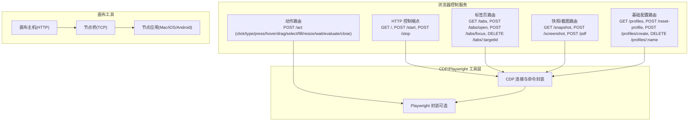
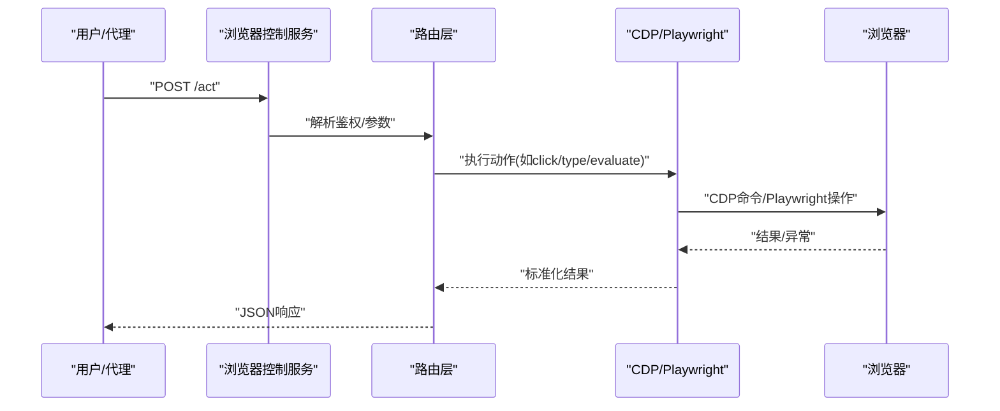
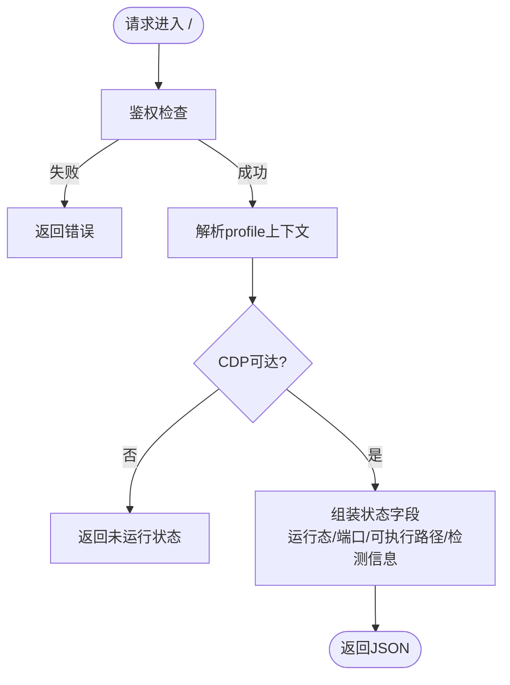
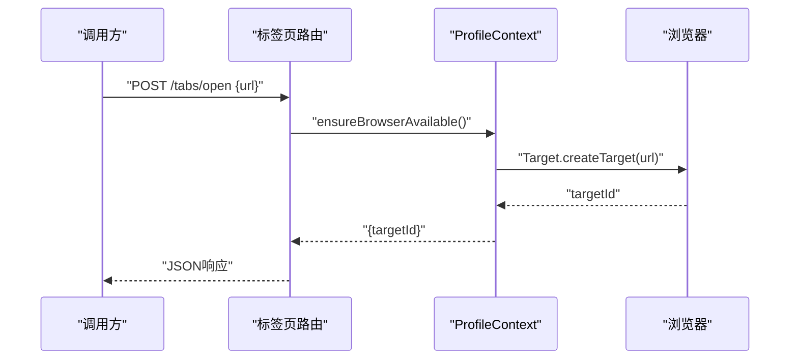
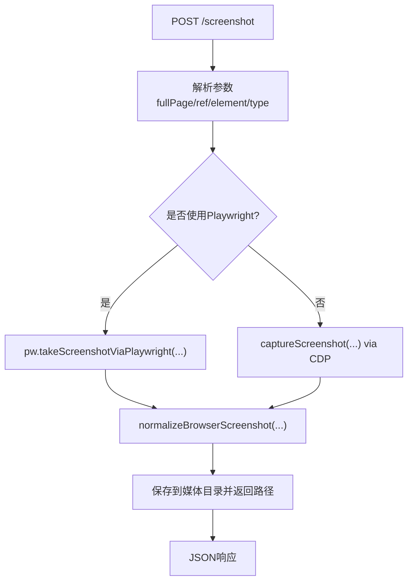
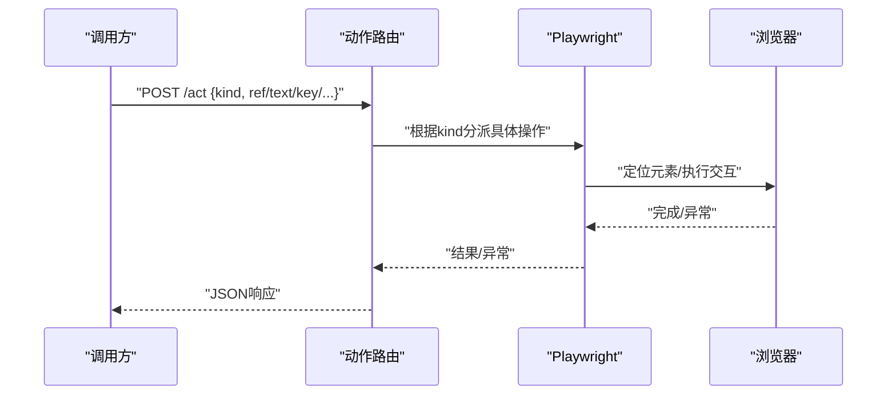
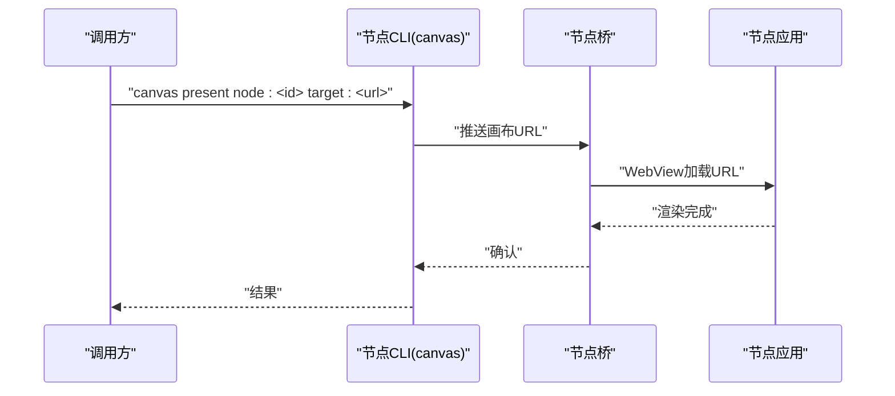
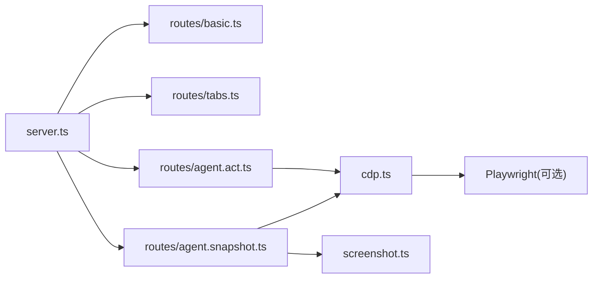

# 浏览器和画布工具

<cite>
**本文引用的文件**
- [docs/tools/browser.md](file://docs/tools/browser.md)
- [src/browser/server.ts](file://src/browser/server.ts)
- [src/browser/routes/basic.ts](file://src/browser/routes/basic.ts)
- [src/browser/routes/tabs.ts](file://src/browser/routes/tabs.ts)
- [src/browser/routes/agent.snapshot.ts](file://src/browser/routes/agent.snapshot.ts)
- [src/browser/routes/agent.act.ts](file://src/browser/routes/agent.act.ts)
- [src/browser/cdp.ts](file://src/browser/cdp.ts)
- [src/browser/screenshot.ts](file://src/browser/screenshot.ts)
- [skills/canvas/SKILL.md](file://skills/canvas/SKILL.md)
- [src/cli/nodes-cli/register.canvas.ts](file://src/cli/nodes-cli/register.canvas.ts)
</cite>

## 目录
1. [简介](#简介)
2. [项目结构](#项目结构)
3. [核心组件](#核心组件)
4. [架构总览](#架构总览)
5. [详细组件分析](#详细组件分析)
6. [依赖关系分析](#依赖关系分析)
7. [性能考量](#性能考量)
8. [故障排除指南](#故障排除指南)
9. [结论](#结论)
10. [附录](#附录)

## 简介
本文件面向OpenClaw的“浏览器与画布工具”体系，系统性阐述两类能力：
- 浏览器工具：通过CDP与Playwright驱动受控浏览器，提供状态查询、生命周期控制、标签页管理、快照/截图、动作执行、导航、控制台、PDF导出、上传/对话框、等待与评估等能力，并支持多配置文件（profiles）管理。
- 画布工具：在连接的节点（Mac/iOS/Android）上展示/隐藏/导航/截图/评估内容，支持A2UI推送与重置。

文档将从架构、数据流、处理逻辑、集成点、错误处理与性能优化等方面进行深入解析，并提供可操作的工具调用示例、配置参数说明与故障排除建议。

## 项目结构
浏览器与画布工具由“网关侧控制服务 + 路由层 + CDP/Playwright工具层 + 配置与运行时”构成；画布工具由“画布主机 + 节点桥 + 节点应用”三层组成。

图示来源
- [src/browser/server.ts](file://src/browser/server.ts#L20-L86)
- [src/browser/routes/basic.ts](file://src/browser/routes/basic.ts#L30-L192)
- [src/browser/routes/tabs.ts](file://src/browser/routes/tabs.ts#L102-L222)
- [src/browser/routes/agent.snapshot.ts](file://src/browser/routes/agent.snapshot.ts#L88-L342)
- [src/browser/routes/agent.act.ts](file://src/browser/routes/agent.act.ts#L21-L381)
- [src/browser/cdp.ts](file://src/browser/cdp.ts#L19-L47)
- [skills/canvas/SKILL.md](file://skills/canvas/SKILL.md#L17-L47)

章节来源
- [src/browser/server.ts](file://src/browser/server.ts#L20-L86)
- [src/browser/routes/basic.ts](file://src/browser/routes/basic.ts#L30-L192)
- [src/browser/routes/tabs.ts](file://src/browser/routes/tabs.ts#L102-L222)
- [src/browser/routes/agent.snapshot.ts](file://src/browser/routes/agent.snapshot.ts#L88-L342)
- [src/browser/routes/agent.act.ts](file://src/browser/routes/agent.act.ts#L21-L381)
- [src/browser/cdp.ts](file://src/browser/cdp.ts#L19-L47)
- [skills/canvas/SKILL.md](file://skills/canvas/SKILL.md#L17-L47)

## 核心组件
- 浏览器控制HTTP服务：负责鉴权、中间件安装、路由注册与监听端口。
- 路由层：按功能拆分，包含基础状态/配置、标签页、快照/截图/PDF、动作执行、下载/对话框钩子等。
- CDP/Playwright工具：封装CDP命令、截图、无障碍树、DOM文本/查询、元素交互、PDF生成、等待与高亮等。
- 画布主机：静态资源服务、Live Reload、节点桥通信。
- 节点桥与节点应用：将画布URL推送到已连接节点并渲染。

章节来源
- [src/browser/server.ts](file://src/browser/server.ts#L20-L86)
- [src/browser/routes/basic.ts](file://src/browser/routes/basic.ts#L30-L192)
- [src/browser/routes/tabs.ts](file://src/browser/routes/tabs.ts#L102-L222)
- [src/browser/routes/agent.snapshot.ts](file://src/browser/routes/agent.snapshot.ts#L88-L342)
- [src/browser/routes/agent.act.ts](file://src/browser/routes/agent.act.ts#L21-L381)
- [src/browser/cdp.ts](file://src/browser/cdp.ts#L49-L140)
- [skills/canvas/SKILL.md](file://skills/canvas/SKILL.md#L17-L47)

## 架构总览
浏览器控制服务采用“HTTP路由 + CDP/Playwright”双层抽象：
- HTTP路由层：统一鉴权与参数解析，按功能路由到对应处理器。
- CDP/Playwright层：对浏览器进行实际操作，如截图、快照、导航、动作、PDF等。
- 多配置文件（profiles）：每个profile独立端口/颜色/驱动类型，支持本地/远程/扩展中继三种模式。

图示来源
- [src/browser/server.ts](file://src/browser/server.ts#L53-L61)
- [src/browser/routes/agent.act.ts](file://src/browser/routes/agent.act.ts#L25-L322)
- [src/browser/cdp.ts](file://src/browser/cdp.ts#L159-L187)

章节来源
- [src/browser/server.ts](file://src/browser/server.ts#L53-L61)
- [src/browser/routes/agent.act.ts](file://src/browser/routes/agent.act.ts#L25-L322)
- [src/browser/cdp.ts](file://src/browser/cdp.ts#L159-L187)

## 详细组件分析

### 浏览器控制服务与基础API
- 基础状态与生命周期
  - GET /：返回当前profile状态、CDP就绪情况、进程信息、可检测浏览器等。
  - POST /start：启动指定profile的浏览器。
  - POST /stop：停止当前profile的浏览器。
- 配置文件管理
  - GET /profiles：列出所有配置文件及其状态。
  - POST /reset-profile：重置当前profile（清理用户数据目录）。
  - POST /profiles/create：创建新配置文件（可指定颜色、CDP地址、驱动类型）。
  - DELETE /profiles/:name：删除指定配置文件（移动用户数据目录至回收站）。

图示来源
- [src/browser/routes/basic.ts](file://src/browser/routes/basic.ts#L42-L96)

章节来源
- [src/browser/routes/basic.ts](file://src/browser/routes/basic.ts#L30-L192)

### 标签页管理
- GET /tabs：查询当前浏览器标签页列表（若不可达则返回空列表）。
- POST /tabs/open：打开新标签页并返回目标ID。
- POST /tabs/focus：聚焦指定标签页。
- DELETE /tabs/:targetId：关闭指定标签页。
- POST /tabs/action：统一入口，支持list/new/close/select等子动作。

图示来源
- [src/browser/routes/tabs.ts](file://src/browser/routes/tabs.ts#L119-L136)
- [src/browser/cdp.ts](file://src/browser/cdp.ts#L103-L140)

章节来源
- [src/browser/routes/tabs.ts](file://src/browser/routes/tabs.ts#L102-L222)
- [src/browser/cdp.ts](file://src/browser/cdp.ts#L103-L140)

### 快照与截图/PDF
- GET /snapshot：返回无障碍树或AI快照（支持交互式/紧凑/深度/选择器/帧作用域等选项），可选叠加标签化截图。
- POST /screenshot：截取全页或元素截图，自动归一化尺寸与体积。
- POST /pdf：生成当前页面PDF并保存到媒体存储。

图示来源
- [src/browser/routes/agent.snapshot.ts](file://src/browser/routes/agent.snapshot.ts#L148-L210)
- [src/browser/screenshot.ts](file://src/browser/screenshot.ts#L11-L58)
- [src/browser/cdp.ts](file://src/browser/cdp.ts#L49-L101)

章节来源
- [src/browser/routes/agent.snapshot.ts](file://src/browser/routes/agent.snapshot.ts#L88-L342)
- [src/browser/screenshot.ts](file://src/browser/screenshot.ts#L11-L58)
- [src/browser/cdp.ts](file://src/browser/cdp.ts#L49-L101)

### 动作执行（act）
支持多种动作类型，均通过Playwright执行，确保稳定与可重复：
- 点击：click（支持双击、按钮、修饰键、超时）
- 输入：type（支持提交、慢速输入、超时）
- 按键：press（支持延迟）
- 悬停：hover
- 滚动到可视：scrollIntoView
- 拖拽：drag（起止ref）
- 选择：select（多值）
- 填表：fill（字段数组）
- 调整视口：resize
- 等待：wait（时间/文本/选择器/URL/加载状态/JS谓词）
- 评估：evaluate（需启用）
- 关闭：close

图示来源
- [src/browser/routes/agent.act.ts](file://src/browser/routes/agent.act.ts#L25-L322)

章节来源
- [src/browser/routes/agent.act.ts](file://src/browser/routes/agent.act.ts#L21-L381)

### 导航、控制台、PDF、上传/对话框、等待与评估
- 导航：POST /navigate，支持SSRF策略校验与目标页切换后的targetId解析。
- 控制台：GET /console（调试用）。
- PDF：POST /pdf，生成并保存PDF。
- 上传/对话框：通过“arming”动作（如upload/dialog）配合后续点击/按键触发。
- 等待：wait支持时间、文本出现/消失、选择器可见、URL匹配、加载状态、JS谓词。
- 评估：evaluate执行页面JS（需启用）。

章节来源
- [src/browser/routes/agent.snapshot.ts](file://src/browser/routes/agent.snapshot.ts#L92-L120)
- [src/browser/routes/agent.act.ts](file://src/browser/routes/agent.act.ts#L223-L321)

### 配置管理（profiles）
- 列表：GET /profiles
- 创建：POST /profiles/create（name/color/cdpUrl/driver）
- 删除：DELETE /profiles/:name
- 重置：POST /reset-profile
- 默认profile与颜色、端口范围、保留端口等规则见配置与分配模块。

章节来源
- [src/browser/routes/basic.ts](file://src/browser/routes/basic.ts#L128-L191)
- [src/browser/profiles.ts](file://src/browser/profiles.ts#L15-L114)

### 画布工具
- present：在节点画布上显示内容（可指定目标URL）。
- hide：隐藏画布。
- navigate：在节点画布内导航到新URL。
- eval：在画布上下文中执行JavaScript。
- snapshot：捕获画布截图。
- a2ui push/reset：推送/重置A2UI内容（通过节点桥）。

图示来源
- [skills/canvas/SKILL.md](file://skills/canvas/SKILL.md#L13-L47)
- [src/cli/nodes-cli/register.canvas.ts](file://src/cli/nodes-cli/register.canvas.ts#L154-L205)

章节来源
- [skills/canvas/SKILL.md](file://skills/canvas/SKILL.md#L48-L199)
- [src/cli/nodes-cli/register.canvas.ts](file://src/cli/nodes-cli/register.canvas.ts#L154-L205)

## 依赖关系分析
- 浏览器控制服务依赖Express与中间件栈，路由层依赖CDP/Playwright工具层。
- CDP工具层封装了截图、无障碍树、DOM查询、运行时求值等通用能力。
- 画布工具依赖画布主机HTTP服务、节点桥与节点应用。

图示来源
- [src/browser/server.ts](file://src/browser/server.ts#L53-L61)
- [src/browser/routes/basic.ts](file://src/browser/routes/basic.ts#L30-L192)
- [src/browser/routes/tabs.ts](file://src/browser/routes/tabs.ts#L102-L222)
- [src/browser/routes/agent.snapshot.ts](file://src/browser/routes/agent.snapshot.ts#L88-L342)
- [src/browser/routes/agent.act.ts](file://src/browser/routes/agent.act.ts#L21-L381)
- [src/browser/cdp.ts](file://src/browser/cdp.ts#L19-L47)
- [src/browser/screenshot.ts](file://src/browser/screenshot.ts#L11-L58)

章节来源
- [src/browser/server.ts](file://src/browser/server.ts#L53-L61)
- [src/browser/routes/basic.ts](file://src/browser/routes/basic.ts#L30-L192)
- [src/browser/routes/tabs.ts](file://src/browser/routes/tabs.ts#L102-L222)
- [src/browser/routes/agent.snapshot.ts](file://src/browser/routes/agent.snapshot.ts#L88-L342)
- [src/browser/routes/agent.act.ts](file://src/browser/routes/agent.act.ts#L21-L381)
- [src/browser/cdp.ts](file://src/browser/cdp.ts#L19-L47)
- [src/browser/screenshot.ts](file://src/browser/screenshot.ts#L11-L58)

## 性能考量
- 截图归一化：限制最大边长与体积，按阶梯质量压缩，避免超大媒体输出。
- 快照策略：优先使用Playwright以获得更稳定的AI/角色快照；在无Playwright时回退至CDP原生无障碍树。
- 等待与高亮：合理设置超时与条件组合，减少无效轮询。
- 端口与颜色：预分配端口范围，避免冲突；颜色便于识别当前profile。

章节来源
- [src/browser/screenshot.ts](file://src/browser/screenshot.ts#L11-L58)
- [src/browser/routes/agent.snapshot.ts](file://src/browser/routes/agent.snapshot.ts#L219-L264)
- [src/browser/profiles.ts](file://src/browser/profiles.ts#L15-L114)

## 故障排除指南
- “浏览器未运行”：确认profile已启动且CDP可达；检查端口占用与防火墙。
- “权限不足/鉴权失败”：确保网关已生成或配置了有效令牌/密码。
- “Playwright不可用”：某些功能需要完整Playwright包；在容器环境中使用内置CLI安装。
- “快照/截图过大”：系统会尝试降采样与降质压缩，仍超限请降低分辨率或裁剪区域。
- “等待不生效”：组合多种等待条件（时间/文本/URL/加载状态/JS谓词），并设置合理超时。
- “画布白屏/无法加载”：确认绑定模式与URL一致（Tailscale/LAN/Loopback），检查Live Reload与文件变更。

章节来源
- [docs/tools/browser.md](file://docs/tools/browser.md#L647-L674)
- [src/browser/routes/agent.snapshot.ts](file://src/browser/routes/agent.snapshot.ts#L196-L209)
- [src/browser/routes/agent.act.ts](file://src/browser/routes/agent.act.ts#L248-L275)
- [skills/canvas/SKILL.md](file://skills/canvas/SKILL.md#L151-L199)

## 结论
OpenClaw的浏览器与画布工具通过“HTTP控制服务 + CDP/Playwright”的清晰分层，提供了安全、可控、可扩展的自动化浏览与可视化呈现能力。浏览器工具覆盖从状态管理到复杂交互的全链路流程；画布工具则实现了跨平台的内容展示与实时更新。结合多配置文件与严格的鉴权/SSRF策略，可在不同部署场景下灵活落地。

## 附录

### 工具调用示例（基于官方文档与路由定义）
- 浏览器基础
  - 查询状态：GET /
  - 启动/停止：POST /start, POST /stop
  - 列出配置文件：GET /profiles
  - 创建/删除/重置配置文件：POST /profiles/create, DELETE /profiles/:name, POST /reset-profile
- 标签页
  - 打开/聚焦/关闭：POST /tabs/open, POST /tabs/focus, DELETE /tabs/:targetId
  - 统一动作：POST /tabs/action {action:list/new/close/select, index}
- 快照/截图/PDF
  - 快照：GET /snapshot（支持格式与模式参数）
  - 截图：POST /screenshot（支持全页/元素/类型）
  - PDF：POST /pdf
- 动作执行
  - 点击/输入/按键/悬停/拖拽/选择/填表/调整视口/等待/评估/关闭
- 画布
  - present/hide/navigate/eval/snapshot/a2ui push/reset（通过节点CLI）

章节来源
- [docs/tools/browser.md](file://docs/tools/browser.md#L431-L674)
- [src/browser/routes/basic.ts](file://src/browser/routes/basic.ts#L30-L192)
- [src/browser/routes/tabs.ts](file://src/browser/routes/tabs.ts#L102-L222)
- [src/browser/routes/agent.snapshot.ts](file://src/browser/routes/agent.snapshot.ts#L88-L342)
- [src/browser/routes/agent.act.ts](file://src/browser/routes/agent.act.ts#L21-L381)
- [skills/canvas/SKILL.md](file://skills/canvas/SKILL.md#L48-L199)