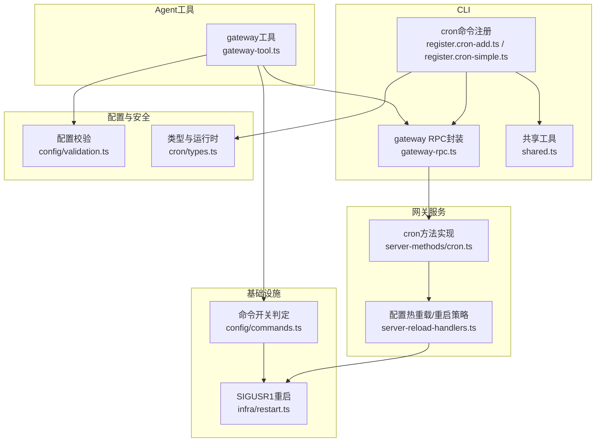
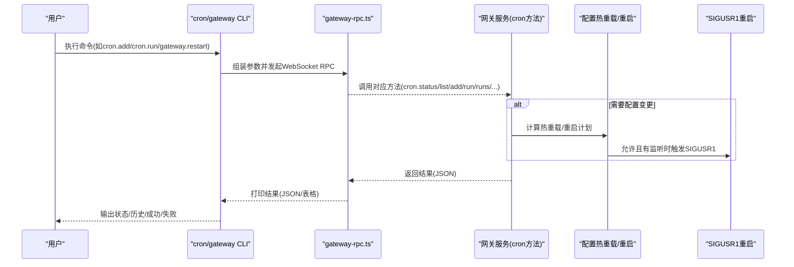
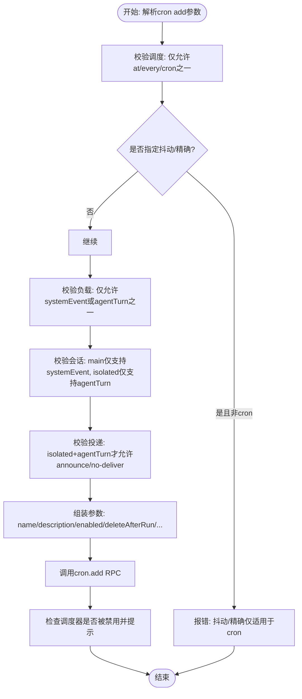
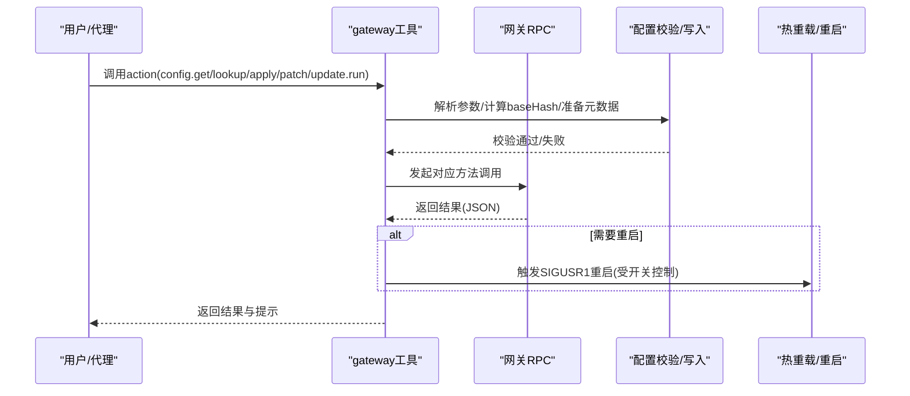
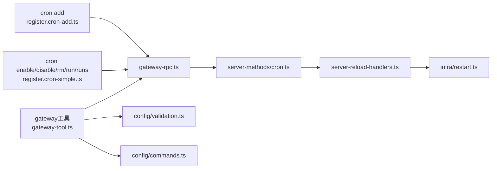

# 系统自动化工具

<cite>
**本文引用的文件**   
- [src/cli/cron-cli/register.cron-add.ts](file://src/cli/cron-cli/register.cron-add.ts)
- [src/cli/cron-cli/register.cron-simple.ts](file://src/cli/cron-cli/register.cron-simple.ts)
- [src/cli/cron-cli/shared.ts](file://src/cli/cron-cli/shared.ts)
- [src/cli/gateway-rpc.ts](file://src/cli/gateway-rpc.ts)
- [src/agents/tools/gateway-tool.ts](file://src/agents/tools/gateway-tool.ts)
- [src/gateway/server-methods/cron.ts](file://src/gateway/server-methods/cron.ts)
- [src/gateway/server-reload-handlers.ts](file://src/gateway/server-reload-handlers.ts)
- [src/infra/restart.ts](file://src/infra/restart.ts)
- [src/config/commands.ts](file://src/config/commands.ts)
- [src/config/validation.ts](file://src/config/validation.ts)
- [src/cron/types.ts](file://src/cron/types.ts)
- [docs/cli/cron.md](file://docs/cli/cron.md)
- [docs/cli/gateway.md](file://docs/cli/gateway.md)
- [docs/gateway/security/index.md](file://docs/gateway/security/index.md)
</cite>

## 目录
1. [简介](#简介)
2. [项目结构](#项目结构)
3. [核心组件](#核心组件)
4. [架构总览](#架构总览)
5. [详细组件分析](#详细组件分析)
6. [依赖关系分析](#依赖关系分析)
7. [性能考量](#性能考量)
8. [故障排除指南](#故障排除指南)
9. [结论](#结论)
10. [附录](#附录)

## 简介
本文件面向OpenClaw系统自动化工具，聚焦两类CLI与后端能力：
- cron工具：用于管理网关内置的定时任务调度器，支持状态查询、任务列表、新增、更新、删除、立即执行、执行历史等操作。
- gateway工具：用于对网关进行重启、配置模式查找、读取配置、应用配置、合并配置、触发更新执行等操作，并包含配置验证、写入与自动重启/唤醒机制。

文档将从命令行入口、协议交互、后端服务、配置与安全限制等维度，给出可操作的使用说明、参数配置、执行策略与故障排除建议。

## 项目结构
围绕自动化工具的关键代码分布在以下模块：
- CLI层：cron命令注册与参数解析、gateway RPC封装、共享打印与错误处理。
- Agent工具层：gateway工具定义与动作分发，含配置读取、写入参数解析、重启调度。
- 网关服务层：cron方法实现（状态、列表、新增、更新、删除、运行、历史）、配置热重载与重启策略。
- 基础设施层：SIGUSR1重启信号发射、重启策略开关、命令权限控制。
- 配置与安全：配置校验、命令开关、安全限制与凭据策略。

**图表来源**
- [src/cli/cron-cli/register.cron-add.ts](file://src/cli/cron-cli/register.cron-add.ts#L1-L283)
- [src/cli/cron-cli/register.cron-simple.ts](file://src/cli/cron-cli/register.cron-simple.ts#L1-L110)
- [src/cli/gateway-rpc.ts](file://src/cli/gateway-rpc.ts#L1-L200)
- [src/agents/tools/gateway-tool.ts](file://src/agents/tools/gateway-tool.ts#L1-L229)
- [src/gateway/server-methods/cron.ts](file://src/gateway/server-methods/cron.ts#L230-L268)
- [src/gateway/server-reload-handlers.ts](file://src/gateway/server-reload-handlers.ts#L138-L161)
- [src/infra/restart.ts](file://src/infra/restart.ts#L104-L151)
- [src/config/commands.ts](file://src/config/commands.ts#L88-L91)
- [src/config/validation.ts](file://src/config/validation.ts#L1-L200)
- [src/cron/types.ts](file://src/cron/types.ts#L1-L160)

**章节来源**
- [src/cli/cron-cli/register.cron-add.ts](file://src/cli/cron-cli/register.cron-add.ts#L1-L283)
- [src/cli/cron-cli/register.cron-simple.ts](file://src/cli/cron-cli/register.cron-simple.ts#L1-L110)
- [src/cli/gateway-rpc.ts](file://src/cli/gateway-rpc.ts#L1-L200)
- [src/agents/tools/gateway-tool.ts](file://src/agents/tools/gateway-tool.ts#L1-L229)
- [src/gateway/server-methods/cron.ts](file://src/gateway/server-methods/cron.ts#L230-L268)
- [src/gateway/server-reload-handlers.ts](file://src/gateway/server-reload-handlers.ts#L138-L161)
- [src/infra/restart.ts](file://src/infra/restart.ts#L104-L151)
- [src/config/commands.ts](file://src/config/commands.ts#L88-L91)
- [src/config/validation.ts](file://src/config/validation.ts#L1-L200)
- [src/cron/types.ts](file://src/cron/types.ts#L1-L160)

## 核心组件
- cron CLI命令族
  - status：查询调度器状态
  - list：列出任务（可包含禁用任务）
  - add/create：新增任务（支持一次性/at、周期性/every、Cron表达式/cron，以及会话目标、唤醒模式、负载类型、投递方式等）
  - enable/disable：启停任务
  - rm/remove/delete：删除任务
  - run：立即执行（支持强制/到期两种模式）
  - runs：查看执行历史（基于JSONL存储）
- gateway工具
  - restart：重启网关（支持延迟、原因、完成提示）
  - config.get：读取当前配置
  - config.schema.lookup：按点路径查询配置模式
  - config.apply：整包替换配置（需提供baseHash）
  - config.patch：部分合并配置（需提供baseHash）
  - update.run：触发一次更新执行（如模型/插件升级）

这些组件通过CLI与网关RPC交互，最终由网关服务执行具体逻辑，并在必要时触发热重载或SIGUSR1重启。

**章节来源**
- [src/cli/cron-cli/register.cron-add.ts](file://src/cli/cron-cli/register.cron-add.ts#L19-L283)
- [src/cli/cron-cli/register.cron-simple.ts](file://src/cli/cron-cli/register.cron-simple.ts#L32-L110)
- [src/agents/tools/gateway-tool.ts](file://src/agents/tools/gateway-tool.ts#L70-L229)
- [docs/cli/cron.md](file://docs/cli/cron.md#L1-L78)
- [docs/cli/gateway.md](file://docs/cli/gateway.md#L1-L215)

## 架构总览
下图展示从CLI到网关服务再到重启/热重载的整体流程：

**图表来源**
- [src/cli/cron-cli/register.cron-add.ts](file://src/cli/cron-cli/register.cron-add.ts#L99-L283)
- [src/cli/cron-cli/register.cron-simple.ts](file://src/cli/cron-cli/register.cron-simple.ts#L86-L110)
- [src/cli/gateway-rpc.ts](file://src/cli/gateway-rpc.ts#L1-L200)
- [src/gateway/server-methods/cron.ts](file://src/gateway/server-methods/cron.ts#L230-L268)
- [src/gateway/server-reload-handlers.ts](file://src/gateway/server-reload-handlers.ts#L138-L161)
- [src/infra/restart.ts](file://src/infra/restart.ts#L104-L151)

## 详细组件分析

### cron 工具：定时任务管理
- 命令族与行为
  - status：查询调度器状态
  - list：列出任务，支持包含禁用任务
  - add/create：参数校验严格，要求且仅允许一种调度方式（at/every/cron），并根据会话目标与负载类型约束投递选项
  - enable/disable：通过update打补丁启停
  - rm/remove/delete：删除任务
  - run：立即执行，支持“到期才运行/强制运行”，返回排队成功即视为入队
  - runs：查看执行历史，支持分页与过滤
- 参数与约束
  - 调度：at（一次性）、every（固定间隔）、cron（支持时区与抖动窗口）
  - 会话：main或isolated，分别对应系统事件或代理回合
  - 投递：announce（消息通道）、webhook（HTTP回调），支持最佳努力投递
  - 安全：Cron负载字段允许不安全外部内容的显式开关
- 执行策略
  - 一次性任务默认成功后删除，可通过保留标志保持
  - 连续错误采用指数退避，成功后恢复常规调度
  - 历史记录受配置项控制（会话保留、运行日志大小/行数）
- 可视化：命令注册与参数解析

**图表来源**
- [src/cli/cron-cli/register.cron-add.ts](file://src/cli/cron-cli/register.cron-add.ts#L107-L207)

**章节来源**
- [src/cli/cron-cli/register.cron-add.ts](file://src/cli/cron-cli/register.cron-add.ts#L19-L283)
- [src/cli/cron-cli/register.cron-simple.ts](file://src/cli/cron-cli/register.cron-simple.ts#L32-L110)
- [src/gateway/server-methods/cron.ts](file://src/gateway/server-methods/cron.ts#L230-L268)
- [src/cron/types.ts](file://src/cron/types.ts#L1-L160)
- [docs/cli/cron.md](file://docs/cli/cron.md#L1-L78)

### gateway 工具：网关管理与配置
- 动作与用途
  - restart：重启网关（支持延迟重启、原因、完成提示），受命令开关控制
  - config.get：读取当前配置快照
  - config.schema.lookup：按点路径查询配置模式（用于编辑前预览）
  - config.apply：整包替换配置（需baseHash校验）
  - config.patch：部分合并配置（需baseHash校验）
  - update.run：触发一次更新执行（如模型/插件升级），支持超时与重启延时
- 配置写入与校验
  - 写入前解析baseHash（来自当前快照），若缺失则报错
  - 支持指定会话键、完成提示、重启延时
  - 配置变更由热重载处理器评估，必要时通过SIGUSR1重启
- 安全与限制
  - commands.restart开关可阻止手动重启
  - 配置校验覆盖多种场景（如通道、Cron、Webhook等），并提供允许值提示
  - 安全策略涵盖SSRF防护、不安全外部内容绕过标志等

**图表来源**
- [src/agents/tools/gateway-tool.ts](file://src/agents/tools/gateway-tool.ts#L70-L229)
- [src/config/validation.ts](file://src/config/validation.ts#L1-L200)
- [src/gateway/server-reload-handlers.ts](file://src/gateway/server-reload-handlers.ts#L138-L161)
- [src/infra/restart.ts](file://src/infra/restart.ts#L104-L151)

**章节来源**
- [src/agents/tools/gateway-tool.ts](file://src/agents/tools/gateway-tool.ts#L70-L229)
- [src/config/commands.ts](file://src/config/commands.ts#L88-L91)
- [src/config/validation.ts](file://src/config/validation.ts#L1-L200)
- [docs/gateway/security/index.md](file://docs/gateway/security/index.md#L528-L552)
- [docs/gateway/security/index.md](file://docs/gateway/security/index.md#L748-L774)

## 依赖关系分析
- CLI到网关RPC：cron与gateway工具均通过统一的RPC封装发起WebSocket调用
- 网关服务到基础设施：cron方法实现依赖服务端状态与存储；配置变更依赖热重载与SIGUSR1重启
- 权限与策略：命令开关决定是否允许重启；配置校验决定写入合法性；安全策略限制不安全内容与SSRF风险

**图表来源**
- [src/cli/cron-cli/register.cron-add.ts](file://src/cli/cron-cli/register.cron-add.ts#L1-L283)
- [src/cli/cron-cli/register.cron-simple.ts](file://src/cli/cron-cli/register.cron-simple.ts#L1-L110)
- [src/cli/gateway-rpc.ts](file://src/cli/gateway-rpc.ts#L1-L200)
- [src/agents/tools/gateway-tool.ts](file://src/agents/tools/gateway-tool.ts#L1-L229)
- [src/gateway/server-methods/cron.ts](file://src/gateway/server-methods/cron.ts#L230-L268)
- [src/gateway/server-reload-handlers.ts](file://src/gateway/server-reload-handlers.ts#L138-L161)
- [src/infra/restart.ts](file://src/infra/restart.ts#L104-L151)
- [src/config/validation.ts](file://src/config/validation.ts#L1-L200)
- [src/config/commands.ts](file://src/config/commands.ts#L88-L91)

**章节来源**
- [src/cli/cron-cli/register.cron-add.ts](file://src/cli/cron-cli/register.cron-add.ts#L1-L283)
- [src/cli/cron-cli/register.cron-simple.ts](file://src/cli/cron-cli/register.cron-simple.ts#L1-L110)
- [src/cli/gateway-rpc.ts](file://src/cli/gateway-rpc.ts#L1-L200)
- [src/agents/tools/gateway-tool.ts](file://src/agents/tools/gateway-tool.ts#L1-L229)
- [src/gateway/server-methods/cron.ts](file://src/gateway/server-methods/cron.ts#L230-L268)
- [src/gateway/server-reload-handlers.ts](file://src/gateway/server-reload-handlers.ts#L138-L161)
- [src/infra/restart.ts](file://src/infra/restart.ts#L104-L151)
- [src/config/validation.ts](file://src/config/validation.ts#L1-L200)
- [src/config/commands.ts](file://src/config/commands.ts#L88-L91)

## 性能考量
- 调度器响应性：在手动执行期间保持list/status等只读接口可用，避免阻塞
- 历史记录与存储：合理设置会话保留与运行日志裁剪策略，避免磁盘膨胀
- 指数退避：连续错误后逐步延长等待时间，降低系统压力
- 热重载与重启：优先热应用安全变更，关键变更时通过SIGUSR1重启，减少中断时间

[本节为通用指导，无需特定文件引用]

## 故障排除指南
- cron命令无输出或卡住
  - 使用--json查看机器可读输出，确认RPC连接与鉴权
  - 对于run命令，其返回排队成功即入队；使用runs查看最终结果
- 无法删除/更新任务
  - 确认任务ID正确，必要时先list核对
  - 检查调度器是否被禁用（CLI会在某些操作后提示）
- 配置写入失败
  - 缺少baseHash：先执行config.get获取快照再进行apply/patch
  - 配置校验失败：参考允许值提示修正字段
- 无法重启网关
  - commands.restart为false时禁止重启；修改配置后需确保允许外部SIGUSR1重启
  - 若无SIGUSR1监听，热重载将跳过重启
- 安全与SSRF
  - webhook目标为私有地址会被SSRF防护拦截；请使用公网可达地址或合规内网
  - 不安全外部内容开关仅用于临时调试，生产环境应保持关闭

**章节来源**
- [src/cli/cron-cli/register.cron-simple.ts](file://src/cli/cron-cli/register.cron-simple.ts#L86-L110)
- [src/agents/tools/gateway-tool.ts](file://src/agents/tools/gateway-tool.ts#L154-L207)
- [src/gateway/server-reload-handlers.ts](file://src/gateway/server-reload-handlers.ts#L138-L161)
- [src/config/validation.ts](file://src/config/validation.ts#L1-L200)
- [docs/gateway/security/index.md](file://docs/gateway/security/index.md#L528-L552)

## 结论
cron与gateway工具共同构成OpenClaw系统自动化的核心：前者负责定时任务的生命周期管理，后者负责网关配置与运行态的可控变更。通过严格的参数校验、安全策略与热重载/重启机制，系统在保证稳定性的同时提供了灵活的运维能力。建议在生产环境中：
- 明确命令开关与凭据策略
- 合理配置调度与日志保留
- 使用schema.lookup与配置校验降低误配风险
- 通过runs与健康检查持续监控执行结果

[本节为总结，无需特定文件引用]

## 附录

### 常用命令与参数速查
- cron
  - status：查询调度器状态
  - list [--all] [--json]：列出任务（可包含禁用）
  - add/create：必选--name；调度二选一(--at/--every/--cron)；会话与负载需匹配；投递仅对isolated agentTurn有效
  - enable/disable：按ID启停
  - rm/remove/delete：按ID删除
  - run：<id> [--due]：立即执行（到期/强制）
  - runs --id <job-id> [--limit N]：查看历史
- gateway（工具）
  - restart [--delayMs N] [--reason TEXT] [--note TEXT]
  - config.get
  - config.schema.lookup --path DOT.PATH
  - config.apply --raw JSON --baseHash HASH [--sessionKey KEY] [--note TEXT] [--restartDelayMs N]
  - config.patch --raw JSON --baseHash HASH [--sessionKey KEY] [--note TEXT] [--restartDelayMs N]
  - update.run [--sessionKey KEY] [--note TEXT] [--restartDelayMs N]

**章节来源**
- [docs/cli/cron.md](file://docs/cli/cron.md#L1-L78)
- [docs/cli/gateway.md](file://docs/cli/gateway.md#L1-L215)
- [src/cli/cron-cli/register.cron-add.ts](file://src/cli/cron-cli/register.cron-add.ts#L61-L283)
- [src/cli/cron-cli/register.cron-simple.ts](file://src/cli/cron-cli/register.cron-simple.ts#L32-L110)
- [src/agents/tools/gateway-tool.ts](file://src/agents/tools/gateway-tool.ts#L70-L229)