# 通信工具

<cite>
**本文引用的文件**
- [src/channels/plugins/message-action-names.ts](file://src/channels/plugins/message-action-names.ts)
- [src/channels/plugins/actions/discord/handle-action.ts](file://src/channels/plugins/actions/discord/handle-action.ts)
- [src/agents/tools/discord-actions-messaging.ts](file://src/agents/tools/discord-actions-messaging.ts)
- [src/discord/send.messages.ts](file://src/discord/send.messages.ts)
- [src/discord/send.reactions.ts](file://src/discord/send.reactions.ts)
- [src/cli/program/register.message.ts](file://src/cli/program/register.message.ts)
- [src/cli/program/message/register.thread.ts](file://src/cli/program/message/register.thread.ts)
- [src/cli/program/message/register.emoji-sticker.ts](file://src/cli/program/message/register.emoji-sticker.ts)
- [src/agents/tools/discord-actions-guild.ts](file://src/agents/tools/discord-actions-guild.ts)
- [extensions/msteams/src/send.ts](file://extensions/msteams/src/send.ts)
- [extensions/msteams/src/messenger.ts](file://extensions/msteams/src/messenger.ts)
- [extensions/msteams/src/attachments/payload.ts](file://extensions/msteams/src/attachments/payload.ts)
- [src/commands/message-format.ts](file://src/commands/message-format.ts)
- [src/infra/outbound/message-action-runner.ts](file://src/infra/outbound/message-action-runner.ts)
- [src/infra/outbound/channel-selection.ts](file://src/infra/outbound/channel-selection.ts)
- [src/utils/message-channel.ts](file://src/utils/message-channel.ts)
</cite>

## 目录
1. [简介](#简介)
2. [项目结构](#项目结构)
3. [核心组件](#核心组件)
4. [架构总览](#架构总览)
5. [组件详解](#组件详解)
6. [依赖关系分析](#依赖关系分析)
7. [性能考量](#性能考量)
8. [故障排查指南](#故障排查指南)
9. [结论](#结论)
10. [附录：工具调用示例与跨平台兼容性](#附录工具调用示例与跨平台兼容性)

## 简介
本文件面向OpenClaw的通信工具系统，聚焦“message”工具链在多通道（尤其是Discord与Microsoft Teams）上的能力与使用方式。内容涵盖：
- 消息发送：文本消息、媒体附件、MS Teams自适应卡片
- 频道操作：投票（poll）、反应（react/reactions）、阅读状态（read）、编辑（edit）、删除（delete）、固定/取消固定（pin/unpin/list-pins）
- 频道与成员管理：权限（permissions）、线程（thread-create/thread-list/thread-reply）
- 搜索与内容管理：消息搜索（search）、贴图（sticker）、成员信息（member-info）、角色信息（role-info）、表情列表（emoji-list）、表情/贴图上传（emoji-upload/sticker-upload）、角色增删（role-add/role-remove）
- 频道信息与语音状态：频道信息（channel-info/channel-list）、语音状态（voice-status）、活动（event-list/event-create）、超时/踢出/封禁（timeout/kick/ban）

同时提供CLI命令组织、参数解析、跨上下文装饰、渠道选择与Markdown能力判定等基础设施说明，并给出跨平台兼容性建议。

## 项目结构
与“message”工具相关的关键模块分布如下：
- 动作名称与类型定义：统一的动作名集合与类型别名
- Discord动作处理器：将动作名映射到具体实现（发送、投票、反应、线程、管理等）
- Discord底层发送与反应API：对Discord REST接口的封装
- CLI命令注册：message子命令及其子组（thread、emoji/sticker、poll、reactions、read/edit/delete、pins、permissions、search等）
- MS Teams扩展：Proactive消息、文件处理、自适应卡片、会话存储
- 基础设施：跨上下文消息装饰、渠道选择、Markdown能力判定

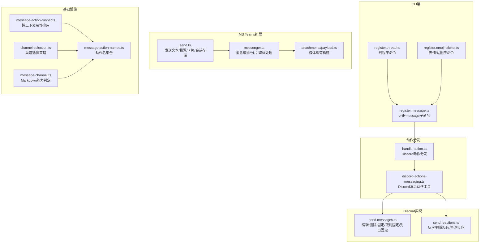

**图表来源**
- [src/cli/program/register.message.ts](file://src/cli/program/register.message.ts#L24-L68)
- [src/channels/plugins/actions/discord/handle-action.ts](file://src/channels/plugins/actions/discord/handle-action.ts#L17-L200)
- [src/agents/tools/discord-actions-messaging.ts](file://src/agents/tools/discord-actions-messaging.ts#L59-L200)
- [src/discord/send.messages.ts](file://src/discord/send.messages.ts#L48-L96)
- [src/discord/send.reactions.ts](file://src/discord/send.reactions.ts#L40-L92)
- [extensions/msteams/src/send.ts](file://extensions/msteams/src/send.ts#L94-L510)
- [extensions/msteams/src/messenger.ts](file://extensions/msteams/src/messenger.ts#L225-L415)
- [extensions/msteams/src/attachments/payload.ts](file://extensions/msteams/src/attachments/payload.ts#L1-L14)
- [src/channels/plugins/message-action-names.ts](file://src/channels/plugins/message-action-names.ts#L1-L57)
- [src/infra/outbound/message-action-runner.ts](file://src/infra/outbound/message-action-runner.ts#L161-L214)
- [src/infra/outbound/channel-selection.ts](file://src/infra/outbound/channel-selection.ts#L86-L134)
- [src/utils/message-channel.ts](file://src/utils/message-channel.ts#L135-L148)

**章节来源**
- [src/channels/plugins/message-action-names.ts](file://src/channels/plugins/message-action-names.ts#L1-L57)
- [src/cli/program/register.message.ts](file://src/cli/program/register.message.ts#L24-L68)

## 核心组件
- 动作名集合与类型：统一维护所有支持的消息动作名称，作为各适配器与CLI的契约基础
- Discord动作分发器：根据动作名将请求路由到具体实现（发送、投票、反应、线程、管理、搜索、表情/贴图、权限等）
- Discord底层API：对编辑、删除、固定/取消固定、列出固定、反应、移除/查询反应等进行REST封装
- CLI命令体系：按功能分组注册子命令，提供参数校验与帮助示例
- MS Teams扩展：支持Proactive消息、文件大小与类型处理、自适应卡片发送、会话存储与错误分类
- 基础设施：跨上下文消息装饰（如组件/交互按钮）、渠道选择策略（显式/回退/单配置/多配置）、Markdown能力判定

**章节来源**
- [src/channels/plugins/message-action-names.ts](file://src/channels/plugins/message-action-names.ts#L1-L57)
- [src/channels/plugins/actions/discord/handle-action.ts](file://src/channels/plugins/actions/discord/handle-action.ts#L17-L200)
- [src/agents/tools/discord-actions-messaging.ts](file://src/agents/tools/discord-actions-messaging.ts#L59-L200)
- [src/discord/send.messages.ts](file://src/discord/send.messages.ts#L48-L96)
- [src/discord/send.reactions.ts](file://src/discord/send.reactions.ts#L40-L92)
- [src/cli/program/register.message.ts](file://src/cli/program/register.message.ts#L24-L68)
- [extensions/msteams/src/send.ts](file://extensions/msteams/src/send.ts#L94-L510)
- [src/infra/outbound/message-action-runner.ts](file://src/infra/outbound/message-action-runner.ts#L161-L214)
- [src/infra/outbound/channel-selection.ts](file://src/infra/outbound/channel-selection.ts#L86-L134)
- [src/utils/message-channel.ts](file://src/utils/message-channel.ts#L135-L148)

## 架构总览
下图展示从CLI到动作分发、再到具体实现与第三方平台的调用路径，以及MS Teams扩展的消息编排流程。

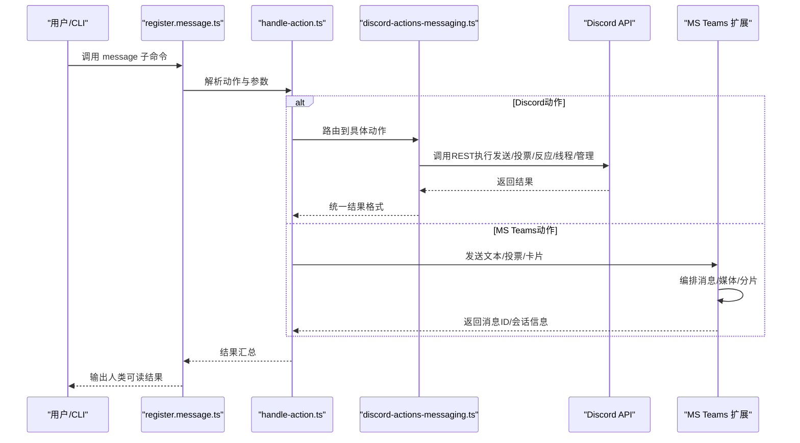

**图表来源**
- [src/cli/program/register.message.ts](file://src/cli/program/register.message.ts#L24-L68)
- [src/channels/plugins/actions/discord/handle-action.ts](file://src/channels/plugins/actions/discord/handle-action.ts#L17-L200)
- [src/agents/tools/discord-actions-messaging.ts](file://src/agents/tools/discord-actions-messaging.ts#L59-L200)
- [extensions/msteams/src/send.ts](file://extensions/msteams/src/send.ts#L94-L510)

## 组件详解

### 消息发送（send）
- 支持文本消息与媒体附件；在不同渠道中，媒体URL的传递方式与限制不同
- 在Discord中，支持以组件/嵌入形式发送；支持静默发送、回复引用、会话键等
- 在MS Teams中，支持Proactive消息、文件大小与类型处理、自适应卡片发送

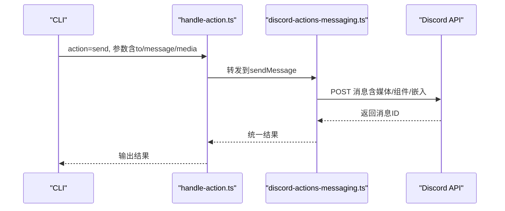

**图表来源**
- [src/channels/plugins/actions/discord/handle-action.ts](file://src/channels/plugins/actions/discord/handle-action.ts#L40-L83)
- [src/agents/tools/discord-actions-messaging.ts](file://src/agents/tools/discord-actions-messaging.ts#L59-L200)

**章节来源**
- [src/channels/plugins/actions/discord/handle-action.ts](file://src/channels/plugins/actions/discord/handle-action.ts#L40-L83)
- [src/agents/tools/discord-actions-messaging.ts](file://src/agents/tools/discord-actions-messaging.ts#L59-L200)
- [extensions/msteams/src/send.ts](file://extensions/msteams/src/send.ts#L94-L304)

### 媒体附件与MS Teams自适应卡片
- MS Teams发送逻辑根据会话类型（个人/群组/频道）与文件大小/类型决定采用内联base64或OneDrive分享链接
- 支持发送任意自适应卡片（Adaptive Card），并记录消息ID与会话ID
- 媒体载荷构建保留媒体类型的基数关系，便于多附件场景

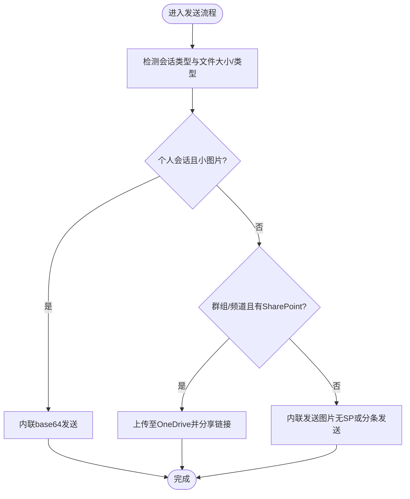

**图表来源**
- [extensions/msteams/src/send.ts](file://extensions/msteams/src/send.ts#L90-L191)
- [extensions/msteams/src/messenger.ts](file://extensions/msteams/src/messenger.ts#L225-L262)
- [extensions/msteams/src/attachments/payload.ts](file://extensions/msteams/src/attachments/payload.ts#L1-L14)

**章节来源**
- [extensions/msteams/src/send.ts](file://extensions/msteams/src/send.ts#L90-L191)
- [extensions/msteams/src/messenger.ts](file://extensions/msteams/src/messenger.ts#L225-L262)
- [extensions/msteams/src/attachments/payload.ts](file://extensions/msteams/src/attachments/payload.ts#L1-L14)

### 投票（poll）
- 支持问题、选项、是否多选、持续时间（小时）等参数
- 在Discord中通过专用发送函数实现，支持内容附加与最大选择数计算

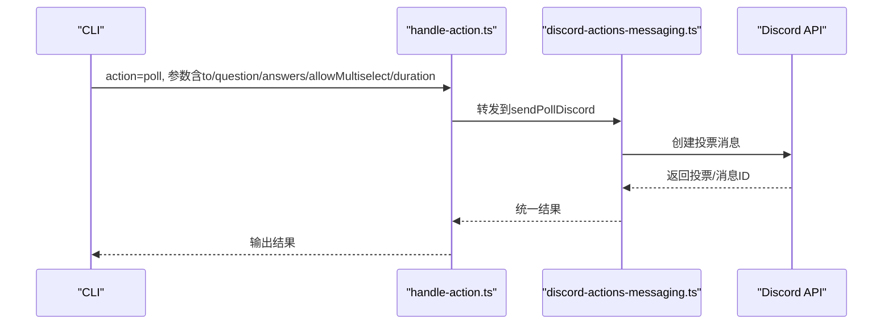

**图表来源**
- [src/channels/plugins/actions/discord/handle-action.ts](file://src/channels/plugins/actions/discord/handle-action.ts#L85-L110)
- [src/agents/tools/discord-actions-messaging.ts](file://src/agents/tools/discord-actions-messaging.ts#L157-L179)

**章节来源**
- [src/channels/plugins/actions/discord/handle-action.ts](file://src/channels/plugins/actions/discord/handle-action.ts#L85-L110)
- [src/agents/tools/discord-actions-messaging.ts](file://src/agents/tools/discord-actions-messaging.ts#L157-L179)

### 反应与反应列表（react/reactions）
- react：支持添加/移除指定emoji，或清空自己的反应
- reactions：查询消息的反应统计，支持限制返回数量
- 底层通过REST接口实现，支持按账户切换

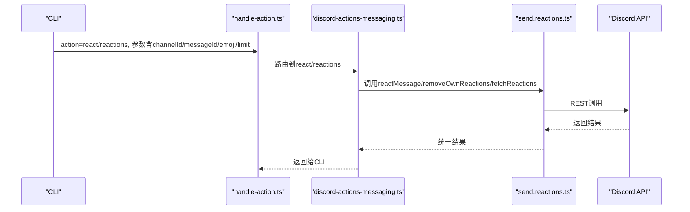

**图表来源**
- [src/channels/plugins/actions/discord/handle-action.ts](file://src/channels/plugins/actions/discord/handle-action.ts#L112-L150)
- [src/agents/tools/discord-actions-messaging.ts](file://src/agents/tools/discord-actions-messaging.ts#L86-L139)
- [src/discord/send.reactions.ts](file://src/discord/send.reactions.ts#L40-L92)

**章节来源**
- [src/channels/plugins/actions/discord/handle-action.ts](file://src/channels/plugins/actions/discord/handle-action.ts#L112-L150)
- [src/agents/tools/discord-actions-messaging.ts](file://src/agents/tools/discord-actions-messaging.ts#L86-L139)
- [src/discord/send.reactions.ts](file://src/discord/send.reactions.ts#L40-L92)

### 阅读状态、编辑与删除（read/edit/delete）
- read：支持按before/after/around与limit读取消息
- edit：编辑指定消息内容
- delete：删除指定消息

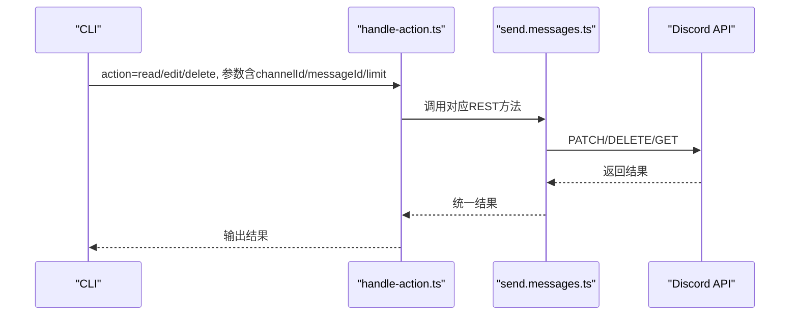

**图表来源**
- [src/channels/plugins/actions/discord/handle-action.ts](file://src/channels/plugins/actions/discord/handle-action.ts#L152-L197)
- [src/discord/send.messages.ts](file://src/discord/send.messages.ts#L48-L96)

**章节来源**
- [src/channels/plugins/actions/discord/handle-action.ts](file://src/channels/plugins/actions/discord/handle-action.ts#L152-L197)
- [src/discord/send.messages.ts](file://src/discord/send.messages.ts#L48-L96)

### 固定/取消固定与列出固定（pin/unpin/list-pins）
- 支持对消息进行固定/取消固定
- 支持列出频道内所有固定消息

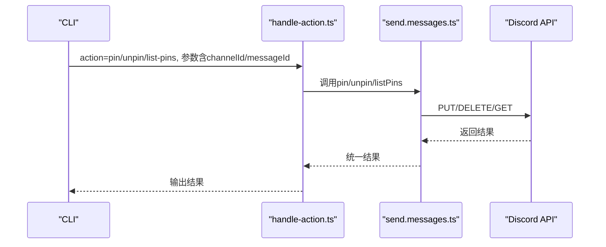

**图表来源**
- [src/channels/plugins/actions/discord/handle-action.ts](file://src/channels/plugins/actions/discord/handle-action.ts#L199-L212)
- [src/discord/send.messages.ts](file://src/discord/send.messages.ts#L70-L96)

**章节来源**
- [src/channels/plugins/actions/discord/handle-action.ts](file://src/channels/plugins/actions/discord/handle-action.ts#L199-L212)
- [src/discord/send.messages.ts](file://src/discord/send.messages.ts#L70-L96)

### 线程创建/列表/回复（thread-create/thread-list/thread-reply）
- thread-create：创建线程，支持名称、初始消息、自动归档分钟数、标签等
- thread-list：列出线程，支持包含已归档、分页与过滤
- thread-reply：在线程中回复消息，支持媒体与回复引用

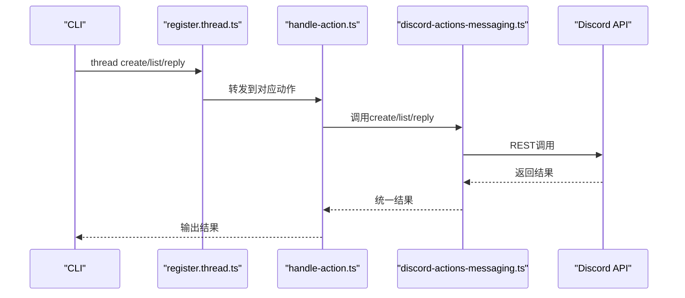

**图表来源**
- [src/cli/program/message/register.thread.ts](file://src/cli/program/message/register.thread.ts#L1-L36)
- [src/channels/plugins/actions/discord/handle-action.ts](file://src/channels/plugins/actions/discord/handle-action.ts#L226-L248)
- [src/agents/tools/discord-actions-messaging.ts](file://src/agents/tools/discord-actions-messaging.ts#L361-L430)

**章节来源**
- [src/cli/program/message/register.thread.ts](file://src/cli/program/message/register.thread.ts#L1-L36)
- [src/channels/plugins/actions/discord/handle-action.ts](file://src/channels/plugins/actions/discord/handle-action.ts#L226-L248)
- [src/agents/tools/discord-actions-messaging.ts](file://src/agents/tools/discord-actions-messaging.ts#L361-L430)

### 权限管理（permissions）
- 查询频道权限，支持按账户切换

**章节来源**
- [src/channels/plugins/actions/discord/handle-action.ts](file://src/channels/plugins/actions/discord/handle-action.ts#L214-L224)
- [src/agents/tools/discord-actions-messaging.ts](file://src/agents/tools/discord-actions-messaging.ts#L180-L189)

### 搜索与内容管理（search/sticker/member-info/role-info/emoji-list/emoji-upload/sticker-upload/role-add/role-remove）
- search：在Discord中搜索消息
- sticker：发送贴图（可带内容）
- member-info/role-info：查询成员与角色信息
- emoji-list/emoji-upload：列出与上传表情
- sticker-upload：上传贴图
- role-add/role-remove：添加/移除角色

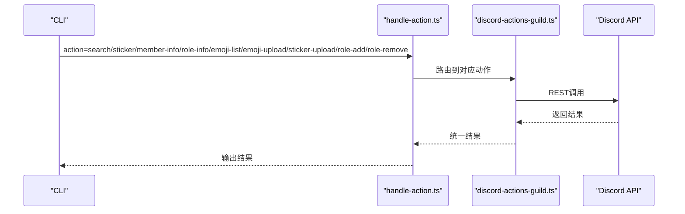

**图表来源**
- [src/channels/plugins/actions/discord/handle-action.ts](file://src/channels/plugins/actions/discord/handle-action.ts#L48-L97)
- [src/agents/tools/discord-actions-guild.ts](file://src/agents/tools/discord-actions-guild.ts#L95-L135)
- [src/agents/tools/discord-actions-guild.ts](file://src/agents/tools/discord-actions-guild.ts#L208-L247)

**章节来源**
- [src/channels/plugins/actions/discord/handle-action.ts](file://src/channels/plugins/actions/discord/handle-action.ts#L48-L97)
- [src/agents/tools/discord-actions-guild.ts](file://src/agents/tools/discord-actions-guild.ts#L95-L135)
- [src/agents/tools/discord-actions-guild.ts](file://src/agents/tools/discord-actions-guild.ts#L208-L247)

### 频道信息与语音状态（channel-info/channel-list/voice-status/event-list/event-create/timeout/kick/ban）
- channel-info/channel-list：查询频道信息与列表
- voice-status：查询语音状态
- event-list/event-create：活动列表与创建
- timeout/kick/ban：超时/踢出/封禁

**章节来源**
- [src/agents/tools/discord-actions-guild.ts](file://src/agents/tools/discord-actions-guild.ts#L208-L247)

## 依赖关系分析
- 动作名集合被CLI与动作分发器共同依赖，确保一致性
- 渠道选择策略在未显式指定渠道时，支持回退到工具上下文或单配置渠道
- 跨上下文消息装饰在需要时注入组件/交互元素，增强跨平台一致性

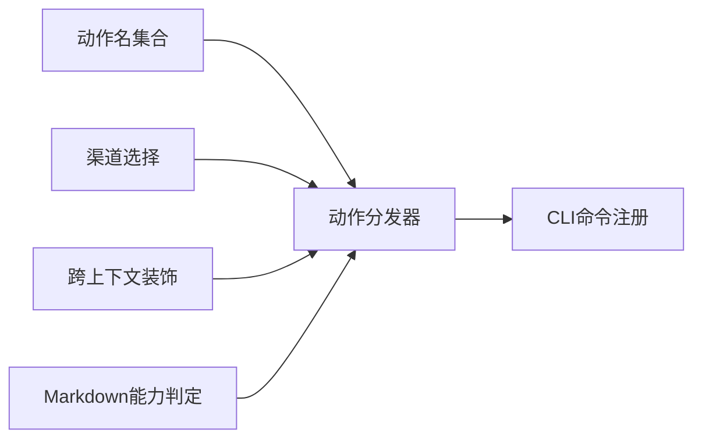

**图表来源**
- [src/channels/plugins/message-action-names.ts](file://src/channels/plugins/message-action-names.ts#L1-L57)
- [src/channels/plugins/actions/discord/handle-action.ts](file://src/channels/plugins/actions/discord/handle-action.ts#L17-L200)
- [src/infra/outbound/channel-selection.ts](file://src/infra/outbound/channel-selection.ts#L86-L134)
- [src/infra/outbound/message-action-runner.ts](file://src/infra/outbound/message-action-runner.ts#L161-L214)
- [src/utils/message-channel.ts](file://src/utils/message-channel.ts#L135-L148)

**章节来源**
- [src/channels/plugins/message-action-names.ts](file://src/channels/plugins/message-action-names.ts#L1-L57)
- [src/infra/outbound/channel-selection.ts](file://src/infra/outbound/channel-selection.ts#L86-L134)
- [src/infra/outbound/message-action-runner.ts](file://src/infra/outbound/message-action-runner.ts#L161-L214)
- [src/utils/message-channel.ts](file://src/utils/message-channel.ts#L135-L148)

## 性能考量
- 分片与批量：MS Teams在多媒体场景下采用分片与内联混合策略，避免大文件上传失败
- 重试机制：MS Teams发送支持可配置重试与回调，提升稳定性
- 并发控制：反应移除/查询使用并发聚合，减少往返次数
- 渠道选择：在多配置场景下，优先显式指定渠道，减少歧义与错误

[本节为通用指导，不直接分析具体文件]

## 故障排查指南
- 错误分类与提示：MS Teams发送失败时，会对错误进行分类并输出HTTP状态码与提示信息
- 未知错误格式化：对不可识别错误进行统一格式化，便于定位
- CLI帮助与示例：message命令提供丰富的帮助与示例，便于快速定位参数问题

**章节来源**
- [extensions/msteams/src/send.ts](file://extensions/msteams/src/send.ts#L341-L349)
- [src/cli/program/register.message.ts](file://src/cli/program/register.message.ts#L24-L68)

## 结论
OpenClaw的通信工具通过统一的动作名集合与清晰的分发机制，实现了对多渠道消息操作的一致抽象。在Discord侧覆盖了发送、投票、反应、线程、管理等完整链路；在MS Teams侧提供了Proactive消息、文件处理与自适应卡片能力。配合CLI命令体系、渠道选择策略与跨上下文装饰，既保证了易用性，也兼顾了跨平台一致性与可扩展性。

[本节为总结性内容，不直接分析具体文件]

## 附录：工具调用示例与跨平台兼容性

### CLI命令组织与示例
- message命令提供子命令分组：send、broadcast、poll、reactions、read/edit/delete、pins、permissions、search、thread、emoji/sticker、discord-admin等
- 提供常见用法示例，如发送文本、带媒体消息、创建Discord投票、对消息加反应等

**章节来源**
- [src/cli/program/register.message.ts](file://src/cli/program/register.message.ts#L24-L68)

### 跨平台兼容性说明
- Markdown能力判定：针对不同渠道启用Markdown渲染，避免在不支持的渠道上出现格式异常
- 渠道选择策略：当存在多个已配置渠道时，要求显式指定渠道或回退到唯一配置，避免歧义
- 跨上下文装饰：在需要时注入组件/交互元素，提升跨平台一致性体验

**章节来源**
- [src/utils/message-channel.ts](file://src/utils/message-channel.ts#L135-L148)
- [src/infra/outbound/channel-selection.ts](file://src/infra/outbound/channel-selection.ts#L86-L134)
- [src/infra/outbound/message-action-runner.ts](file://src/infra/outbound/message-action-runner.ts#L161-L214)

### 人类可读结果输出
- 对常见动作（如投票、反应）输出友好提示，便于确认操作成功与结果概览

**章节来源**
- [src/commands/message-format.ts](file://src/commands/message-format.ts#L338-L375)