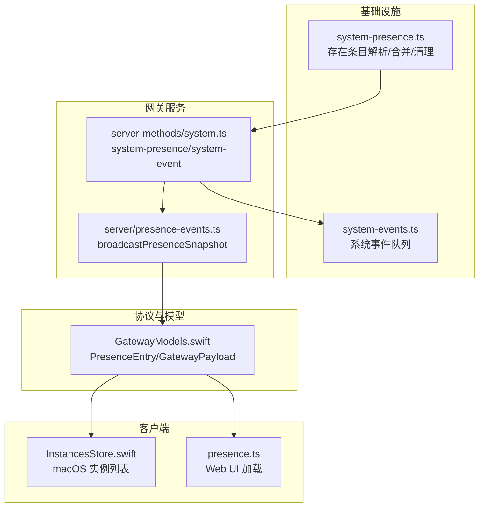
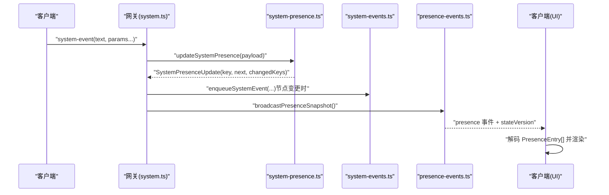
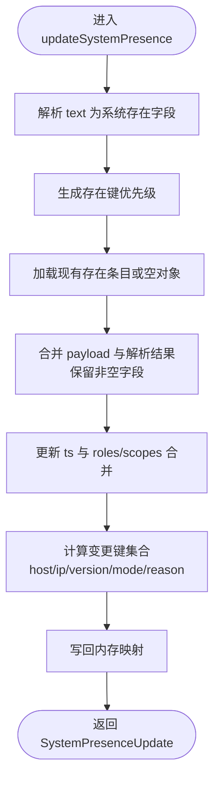
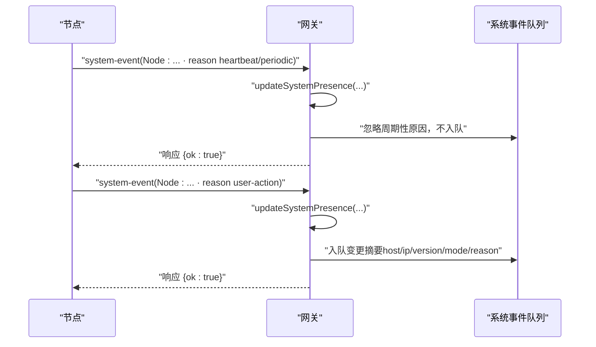
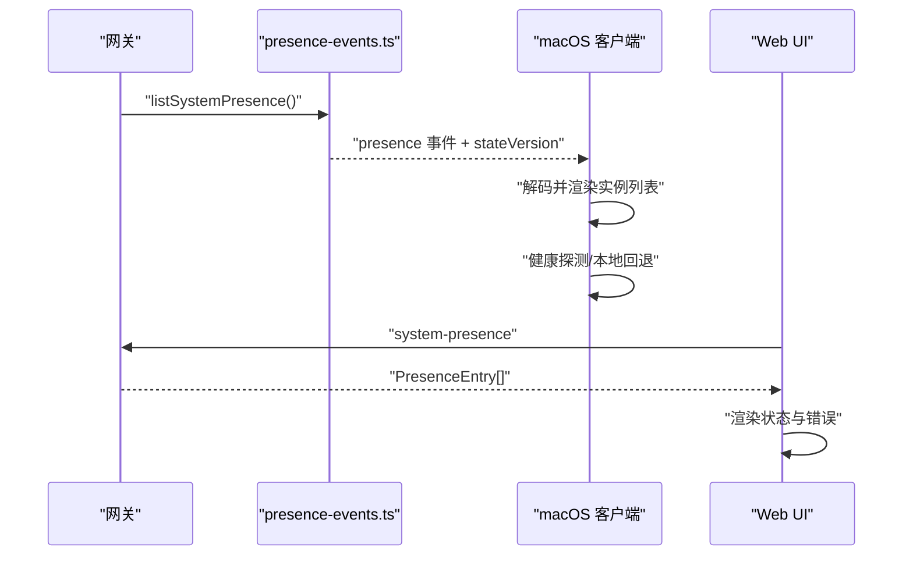
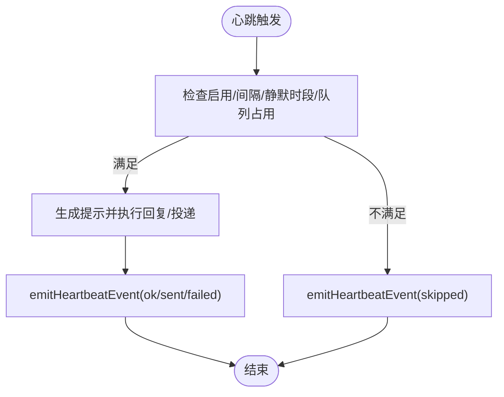
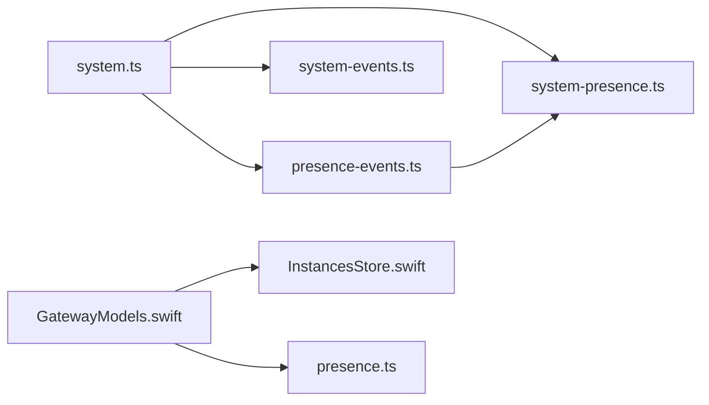

# 在线状态系统

<cite>
**本文档引用的文件**
- [docs/concepts/presence.md](file://docs/concepts/presence.md)
- [src/infra/system-presence.ts](file://src/infra/system-presence.ts)
- [src/gateway/server-methods/system.ts](file://src/gateway/server-methods/system.ts)
- [src/gateway/server/presence-events.ts](file://src/gateway/server/presence-events.ts)
- [src/infra/system-events.ts](file://src/infra/system-events.ts)
- [apps/macos/Sources/OpenClaw/InstancesStore.swift](file://apps/macos/Sources/OpenClaw/InstancesStore.swift)
- [ui/src/ui/controllers/presence.ts](file://ui/src/ui/controllers/presence.ts)
- [src/infra/heartbeat-events.ts](file://src/infra/heartbeat-events.ts)
- [src/infra/heartbeat-runner.ts](file://src/infra/heartbeat-runner.ts)
- [apps/shared/OpenClawKit/Sources/OpenClawProtocol/GatewayModels.swift](file://apps/shared/OpenClawKit/Sources/OpenClawProtocol/GatewayModels.swift)
- [apps/macos/Sources/OpenClawProtocol/GatewayModels.swift](file://apps/macos/Sources/OpenClawProtocol/GatewayModels.swift)
- [src/gateway/method-scopes.ts](file://src/gateway/method-scopes.ts)
- [src/gateway/node-registry.ts](file://src/gateway/node-registry.ts)
</cite>

## 目录
1. [简介](#简介)
2. [项目结构](#项目结构)
3. [核心组件](#核心组件)
4. [架构总览](#架构总览)
5. [详细组件分析](#详细组件分析)
6. [依赖关系分析](#依赖关系分析)
7. [性能考量](#性能考量)
8. [故障排查指南](#故障排查指南)
9. [结论](#结论)

## 简介
本文件系统化阐述 OpenClaw 的在线状态（presence）机制与 system-presence 事件体系，覆盖以下关键主题：
- 设备身份标识与连接状态追踪
- 多角色连接管理（网关、客户端、节点）
- system-presence 事件结构与传播
- 设备信息聚合与 UI 展示优化
- 状态更新机制、心跳检测与离线处理策略
- 节点辅助方法与操作员辅助方法的使用场景

该系统通过“存在条目（PresenceEntry）”在内存中维护各连接端的状态快照，并以“system-presence”和“presence”事件形式在网关与客户端之间进行广播与刷新。

## 项目结构
OpenClaw 的在线状态系统横跨后端基础设施、网关服务、协议模型以及多个前端平台（macOS、Web UI），形成如下分层：
- 基础设施层：负责存在条目的解析、合并、持久化（内存）、过期清理与列表导出
- 网关服务层：提供 system-presence 查询、system-event 接收与 presence 事件广播
- 协议与模型层：定义 PresenceEntry 结构及 GatewayPayload 包装
- 客户端层：macOS 应用与 Web UI 分别消费 presence 事件并渲染实例列表

图表来源
- [src/infra/system-presence.ts](file://src/infra/system-presence.ts#L1-L290)
- [src/gateway/server-methods/system.ts](file://src/gateway/server-methods/system.ts#L1-L135)
- [src/gateway/server/presence-events.ts](file://src/gateway/server/presence-events.ts#L1-L23)
- [apps/shared/OpenClawKit/Sources/OpenClawProtocol/GatewayModels.swift](file://apps/shared/OpenClawKit/Sources/OpenClawProtocol/GatewayModels.swift#L182-L221)
- [apps/macos/Sources/OpenClaw/InstancesStore.swift](file://apps/macos/Sources/OpenClaw/InstancesStore.swift#L1-L333)
- [ui/src/ui/controllers/presence.ts](file://ui/src/ui/controllers/presence.ts#L1-L38)

章节来源
- [docs/concepts/presence.md](file://docs/concepts/presence.md#L1-L103)
- [src/infra/system-presence.ts](file://src/infra/system-presence.ts#L1-L290)
- [src/gateway/server-methods/system.ts](file://src/gateway/server-methods/system.ts#L1-L135)
- [src/gateway/server/presence-events.ts](file://src/gateway/server/presence-events.ts#L1-L23)

## 核心组件
- 存在条目与键空间
  - PresenceEntry 字段包含主机名、IP、版本、平台、设备族、型号、模式、最后输入秒数、原因、标签、文本、时间戳、设备 ID、角色、作用域、实例 ID 等
  - 键生成优先级：deviceId > instanceId > 解析出的 instanceId > 解析出的 host > ip > 文本前缀 > 主机名
- 存在条目更新与合并
  - updateSystemPresence 合并 payload 与解析结果，保留非空字段；合并 roles/scopes 列表
  - 记录变更键集合（host/ip/version/mode/reason），用于区分“周期性/心跳”与“实质性变更”
- 系统事件队列
  - enqueueSystemEvent 将人类可读事件按会话键入队，限制最大长度，支持上下文键去重
- 网关广播
  - broadcastPresenceSnapshot 每次广播携带 presence 版本号与健康版本号，支持丢弃慢消费者

章节来源
- [apps/shared/OpenClawKit/Sources/OpenClawProtocol/GatewayModels.swift](file://apps/shared/OpenClawKit/Sources/OpenClawProtocol/GatewayModels.swift#L205-L221)
- [src/infra/system-presence.ts](file://src/infra/system-presence.ts#L193-L246)
- [src/infra/system-events.ts](file://src/infra/system-events.ts#L51-L83)
- [src/gateway/server/presence-events.ts](file://src/gateway/server/presence-events.ts#L4-L22)

## 架构总览
下面的时序图展示了从客户端发送 system-event 到网关更新存在条目、生成系统事件并广播 presence 的完整流程：

图表来源
- [src/gateway/server-methods/system.ts](file://src/gateway/server-methods/system.ts#L34-L133)
- [src/infra/system-presence.ts](file://src/infra/system-presence.ts#L193-L246)
- [src/infra/system-events.ts](file://src/infra/system-events.ts#L51-L83)
- [src/gateway/server/presence-events.ts](file://src/gateway/server/presence-events.ts#L4-L22)

## 详细组件分析

### 组件A：存在条目解析与合并（system-presence）
- 关键职责
  - 初始化自存在条目（网关启动时）
  - 解析 text 字段中的节点信息（主机、IP、版本、最后输入秒数、模式、原因）
  - 依据多种来源合并字段，生成最终存在条目
  - 计算变更键集合，区分“周期性/心跳”与“实质性变更”
  - 过期清理与列表导出（TTL=5分钟，最大200条）
- 数据结构复杂度
  - 合并与变更检测为 O(n)（n 为跟踪键数量）
  - 列表导出时按 ts 排序，整体 O(n log n)
- 优化点
  - 使用 Map 存储，键规范化避免大小写差异
  - 合并字符串列表时使用 Set 去重

图表来源
- [src/infra/system-presence.ts](file://src/infra/system-presence.ts#L193-L246)

章节来源
- [src/infra/system-presence.ts](file://src/infra/system-presence.ts#L1-L290)

### 组件B：system-event 与系统事件队列
- 关键职责
  - 接收客户端的 system-event 请求，调用 updateSystemPresence 更新存在条目
  - 对节点存在行（以“Node:”开头）进行差异化处理：忽略“周期性/心跳”原因，仅对实质性字段变更触发系统事件
  - 将变更摘要入队到系统事件队列，供后续提示或上下文注入使用
  - 广播 presence 快照，附带 presence/health 版本号
- 多角色连接管理
  - 客户端（macOS/Web/CLI）：通过 connect 与 system-event 上报存在
  - 节点（role=node）：通过 WebSocket 连接并携带 role，网关同样作为存在条目入库
  - 操作员（operator.*）：通过 scopes 控制访问能力，不影响存在条目生成

图表来源
- [src/gateway/server-methods/system.ts](file://src/gateway/server-methods/system.ts#L85-L126)
- [src/infra/system-events.ts](file://src/infra/system-events.ts#L51-L83)

章节来源
- [src/gateway/server-methods/system.ts](file://src/gateway/server-methods/system.ts#L1-L135)
- [src/infra/system-events.ts](file://src/infra/system-events.ts#L1-L120)
- [src/gateway/method-scopes.ts](file://src/gateway/method-scopes.ts#L1-L30)

### 组件C：presence 事件广播与 UI 展示
- 网关侧
  - broadcastPresenceSnapshot 每次广播携带 presence 版本号与健康版本号，dropIfSlow=true 避免阻塞
- macOS 客户端
  - 通过 GatewayPushSubscription 订阅 presence 事件，收到后解码 PresenceEntry[]
  - 支持健康探测（health snapshot）与本地回退实例，提升 UI 可用性
  - 对节点登录进行通知（去重与节流）
- Web UI
  - 通过 client.request("system-presence", {}) 获取数组并渲染状态消息

图表来源
- [src/gateway/server/presence-events.ts](file://src/gateway/server/presence-events.ts#L4-L22)
- [apps/macos/Sources/OpenClaw/InstancesStore.swift](file://apps/macos/Sources/OpenClaw/InstancesStore.swift#L84-L140)
- [ui/src/ui/controllers/presence.ts](file://ui/src/ui/controllers/presence.ts#L13-L37)

章节来源
- [src/gateway/server/presence-events.ts](file://src/gateway/server/presence-events.ts#L1-L23)
- [apps/macos/Sources/OpenClaw/InstancesStore.swift](file://apps/macos/Sources/OpenClaw/InstancesStore.swift#L1-L333)
- [ui/src/ui/controllers/presence.ts](file://ui/src/ui/controllers/presence.ts#L1-L38)

### 组件D：心跳检测与离线处理策略
- 心跳运行器
  - 支持启用/禁用、按代理配置的间隔、静默时段、队列占用等条件控制执行
  - 生成“心跳”提示，必要时向用户通道发送“心跳已读”占位消息
  - 事件指标：ok-empty、ok-token、skipped、failed，用于 UI 状态指示
- 离线处理
  - presence TTL=5 分钟，超过则清理
  - 最大条目数 200，按最早 ts 淘汰
  - UI 在无 payload 或解码失败时显示本地回退实例与健康探测结果

图表来源
- [src/infra/heartbeat-runner.ts](file://src/infra/heartbeat-runner.ts#L605-L800)
- [src/infra/heartbeat-events.ts](file://src/infra/heartbeat-events.ts#L39-L58)

章节来源
- [src/infra/heartbeat-runner.ts](file://src/infra/heartbeat-runner.ts#L1-L800)
- [src/infra/heartbeat-events.ts](file://src/infra/heartbeat-events.ts#L1-L59)
- [src/infra/system-presence.ts](file://src/infra/system-presence.ts#L270-L289)
- [apps/macos/Sources/OpenClaw/InstancesStore.swift](file://apps/macos/Sources/OpenClaw/InstancesStore.swift#L180-L222)

### 组件E：节点辅助方法与操作员辅助方法
- 节点辅助方法
  - 通过 node-registry 提供 invoke 能力，支持超时、幂等键、请求/响应管理
  - 适用于操作员对节点命令的发起与结果等待
- 操作员辅助方法
  - 通过 scopes 控制操作员权限（ADMIN/READ/WRITE/APPROVALS/PAIRING）
  - system.ts 中对节点存在行的“周期性/心跳”原因进行过滤，避免噪声干扰

章节来源
- [src/gateway/node-registry.ts](file://src/gateway/node-registry.ts#L107-L155)
- [src/gateway/method-scopes.ts](file://src/gateway/method-scopes.ts#L1-L30)
- [src/gateway/server-methods/system.ts](file://src/gateway/server-methods/system.ts#L85-L126)

## 依赖关系分析
- 组件耦合
  - system.ts 依赖 system-presence.ts 与 system-events.ts，负责存在更新与事件入队
  - presence-events.ts 依赖 system-presence.ts 输出列表并广播
  - 客户端通过 GatewayModels.swift 的 PresenceEntry/GatewayPayload 解码并应用
- 外部依赖
  - macOS 客户端依赖健康探测接口与本地回退逻辑
  - Web UI 依赖浏览器网关客户端的请求/响应

图表来源
- [src/gateway/server-methods/system.ts](file://src/gateway/server-methods/system.ts#L1-L135)
- [src/gateway/server/presence-events.ts](file://src/gateway/server/presence-events.ts#L1-L23)
- [src/infra/system-presence.ts](file://src/infra/system-presence.ts#L1-L290)
- [src/infra/system-events.ts](file://src/infra/system-events.ts#L1-L120)
- [apps/shared/OpenClawKit/Sources/OpenClawProtocol/GatewayModels.swift](file://apps/shared/OpenClawKit/Sources/OpenClawProtocol/GatewayModels.swift#L182-L221)
- [apps/macos/Sources/OpenClaw/InstancesStore.swift](file://apps/macos/Sources/OpenClaw/InstancesStore.swift#L1-L333)
- [ui/src/ui/controllers/presence.ts](file://ui/src/ui/controllers/presence.ts#L1-L38)

## 性能考量
- 内存占用
  - presence TTL=5 分钟，最大条目数 200，避免无限增长
  - 合并字符串列表使用 Set 去重，降低重复存储
- 广播吞吐
  - presence 事件 dropIfSlow=true，避免慢消费者拖累整体
  - stateVersion 用于 UI 端增量渲染与去重
- UI 渲染
  - macOS 与 Web UI 在网络异常时提供本地回退与健康探测，保证可用性

## 故障排查指南
- 现象：Instances 列表为空或显示本地回退
  - 检查网关是否成功广播 presence 事件
  - 确认客户端解码是否成功（UTF-8/JSON）
  - 触发健康探测以确认网关连通性
- 现象：重复实例或旧实例未消失
  - 确保客户端稳定 instanceId（connect 与 system-event 使用一致）
  - 检查是否存在“周期性/心跳”原因导致的事件被忽略
- 现象：节点登录通知频繁或缺失
  - 核对节点存在行的 reason 是否为“node-connected”，并确保 UI 去重逻辑生效

章节来源
- [apps/macos/Sources/OpenClaw/InstancesStore.swift](file://apps/macos/Sources/OpenClaw/InstancesStore.swift#L104-L140)
- [apps/macos/Sources/OpenClaw/InstancesStore.swift](file://apps/macos/Sources/OpenClaw/InstancesStore.swift#L180-L222)
- [docs/concepts/presence.md](file://docs/concepts/presence.md#L96-L103)

## 结论
OpenClaw 的在线状态系统通过“存在条目 + 系统事件 + presence 事件”的协同机制，实现了对网关、客户端与节点的统一可见性与快速反馈。其设计强调：
- 明确的身份标识（deviceId/instanceId/host/ip/text）与健壮的键生成策略
- 事件的差异化处理（周期性/心跳 vs 实质性变更）
- UI 层的容错与回退（健康探测、本地实例）
- 可控的心跳与状态更新节奏，兼顾实时性与稳定性