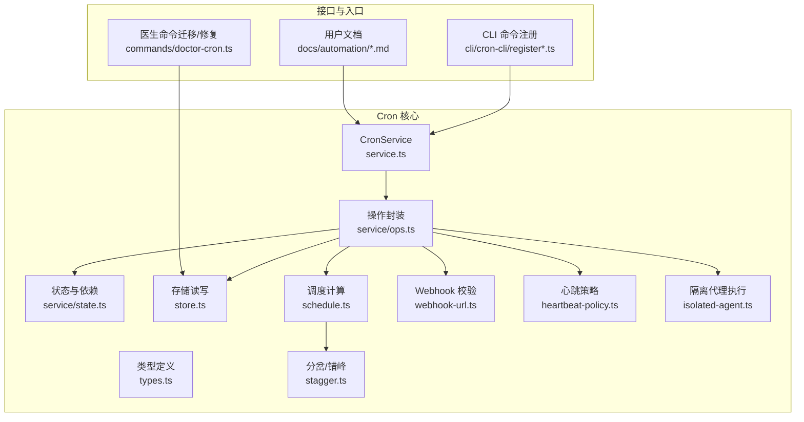
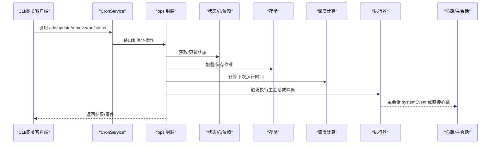
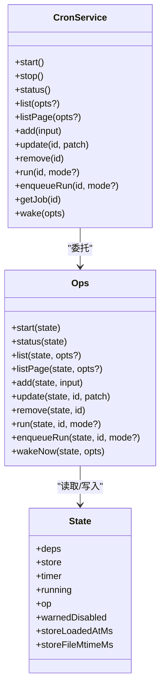
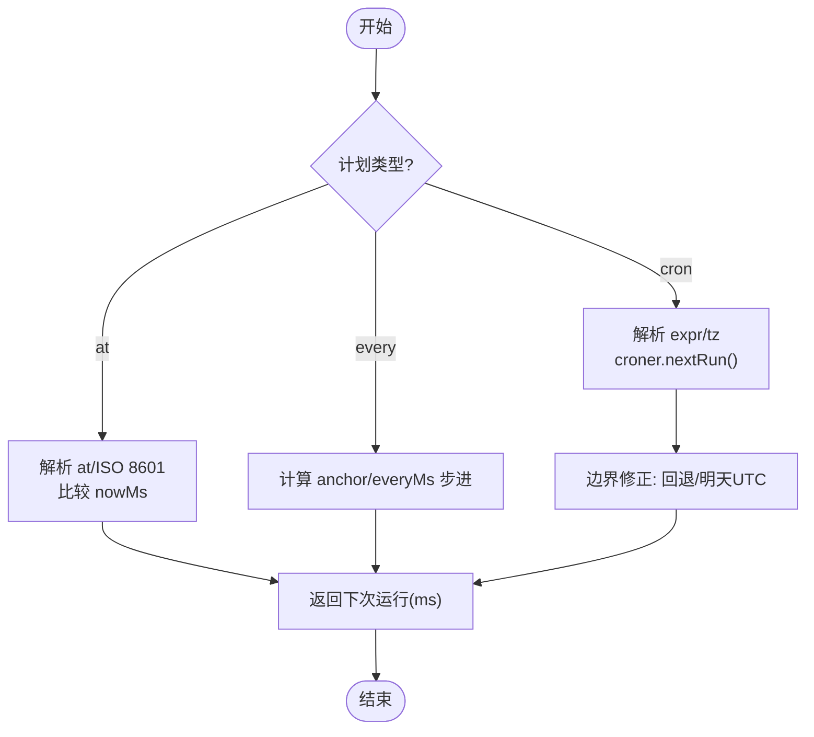
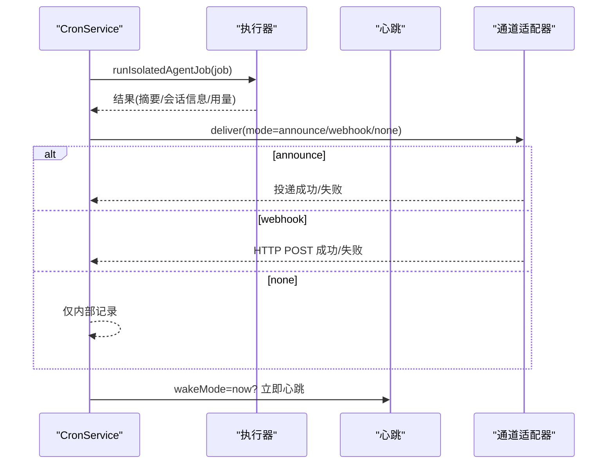
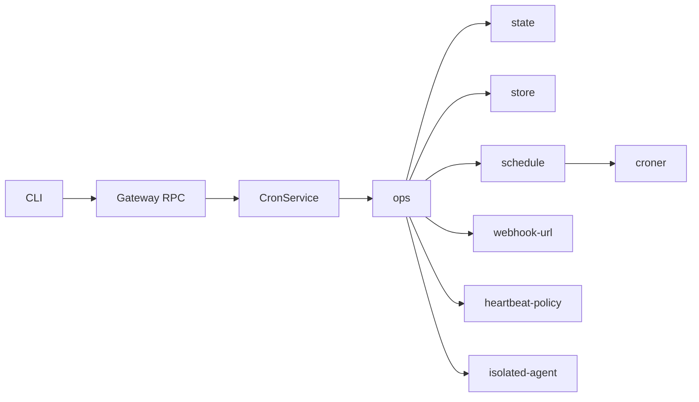

# Cron作业调度

<cite>
**本文引用的文件**
- [service.ts](file://src/cron/service.ts)
- [types.ts](file://src/cron/types.ts)
- [schedule.ts](file://src/cron/schedule.ts)
- [state.ts](file://src/cron/service/state.ts)
- [ops.ts](file://src/cron/service/ops.ts)
- [stagger.ts](file://src/cron/stagger.ts)
- [webhook-url.ts](file://src/cron/webhook-url.ts)
- [heartbeat-policy.ts](file://src/cron/heartbeat-policy.ts)
- [isolated-agent.ts](file://src/cron/isolated-agent.ts)
- [store.ts](file://src/cron/store.ts)
- [normalize.ts](file://src/cron/normalize.ts)
- [cron-jobs.md](file://docs/automation/cron-jobs.md)
- [cron-vs-heartbeat.md](file://docs/automation/cron-vs-heartbeat.md)
- [register.cron-simple.ts](file://src/cli/cron-cli/register.cron-simple.ts)
- [register.ts](file://src/cli/cron-cli/register.ts)
- [register.cron-add.ts](file://src/cli/cron-cli/register.cron-add.ts)
- [shared.ts](file://src/cli/cron-cli/shared.ts)
- [doctor-cron.ts](file://src/commands/doctor-cron.ts)
</cite>

## 目录
1. [简介](#简介)
2. [项目结构](#项目结构)
3. [核心组件](#核心组件)
4. [架构总览](#架构总览)
5. [详细组件分析](#详细组件分析)
6. [依赖关系分析](#依赖关系分析)
7. [性能考量](#性能考量)
8. [故障排除指南](#故障排除指南)
9. [结论](#结论)
10. [附录](#附录)

## 简介
本文件系统化阐述 OpenClaw 的 Cron 作业调度系统：从 Cron 表达式语法、调度规则与执行机制，到作业的创建、配置、监控与管理；解释心跳机制与 Cron 的差异及适用场景；覆盖并发控制、资源限制与失败重试策略；并讨论时间同步、时区处理与跨平台兼容性。文末提供作业模板、最佳实践与故障排除清单。

## 项目结构
Cron 调度系统由“服务层（CronService）+ 存储（JSON 文件）+ 调度器（croner）+ 执行器（主会话/隔离会话）+ CLI 与网关 API + 文档与规范”构成。核心代码位于 src/cron 及其子目录，CLI 命令注册在 src/cli/cron-cli，官方文档位于 docs/automation。



图表来源
- [service.ts](file://src/cron/service.ts#L1-L60)
- [ops.ts](file://src/cron/service/ops.ts#L1-L120)
- [state.ts](file://src/cron/service/state.ts#L1-L170)
- [store.ts](file://src/cron/store.ts#L24-L75)
- [schedule.ts](file://src/cron/schedule.ts#L1-L171)
- [stagger.ts](file://src/cron/stagger.ts#L1-L48)
- [webhook-url.ts](file://src/cron/webhook-url.ts#L1-L23)
- [heartbeat-policy.ts](file://src/cron/heartbeat-policy.ts#L1-L49)
- [isolated-agent.ts](file://src/cron/isolated-agent.ts#L1-L2)
- [register.cron-simple.ts](file://src/cli/cron-cli/register.cron-simple.ts#L1-L109)
- [register.ts](file://src/cli/cron-cli/register.ts#L1-L27)
- [register.cron-add.ts](file://src/cli/cron-cli/register.cron-add.ts#L1-L59)
- [shared.ts](file://src/cli/cron-cli/shared.ts#L1-L22)
- [doctor-cron.ts](file://src/commands/doctor-cron.ts#L1-L17)
- [cron-jobs.md](file://docs/automation/cron-jobs.md#L1-L686)
- [cron-vs-heartbeat.md](file://docs/automation/cron-vs-heartbeat.md#L1-L287)

章节来源
- [service.ts](file://src/cron/service.ts#L1-L60)
- [ops.ts](file://src/cron/service/ops.ts#L1-L120)
- [store.ts](file://src/cron/store.ts#L24-L75)
- [schedule.ts](file://src/cron/schedule.ts#L1-L171)
- [stagger.ts](file://src/cron/stagger.ts#L1-L48)
- [webhook-url.ts](file://src/cron/webhook-url.ts#L1-L23)
- [heartbeat-policy.ts](file://src/cron/heartbeat-policy.ts#L1-L49)
- [isolated-agent.ts](file://src/cron/isolated-agent.ts#L1-L2)
- [register.cron-simple.ts](file://src/cli/cron-cli/register.cron-simple.ts#L1-L109)
- [register.ts](file://src/cli/cron-cli/register.ts#L1-L27)
- [register.cron-add.ts](file://src/cli/cron-cli/register.cron-add.ts#L1-L59)
- [shared.ts](file://src/cli/cron-cli/shared.ts#L1-L22)
- [doctor-cron.ts](file://src/commands/doctor-cron.ts#L1-L17)
- [cron-jobs.md](file://docs/automation/cron-jobs.md#L1-L686)
- [cron-vs-heartbeat.md](file://docs/automation/cron-vs-heartbeat.md#L1-L287)

## 核心组件
- CronService：对外暴露启动、停止、状态查询、列表、分页、增删改查、手动运行、入队运行、唤醒等方法，内部通过 ops 封装对状态机与存储进行操作。
- 类型系统：统一定义 CronSchedule、CronPayload、CronDelivery、CronJob 等数据模型与字段约束。
- 调度引擎：基于 croner 计算下次运行时间，支持 at/every/cron 三种模式，并内置时区解析与缓存。
- 分岔/错峰：对“整点”类 Cron 表达式默认施加最多 5 分钟的确定性抖动，降低负载尖峰。
- 执行路径：主会话（systemEvent + 心跳）与隔离会话（独立 cron:<jobId> 会话）两种执行面。
- 存储：本地 JSON 文件持久化作业与运行历史，含权限保护与原子写入策略。
- CLI 与网关：CLI 提供 add/list/run/status 等命令；网关提供 cron.* RPC 方法。
- 文档与规范：官方文档详细说明语法、交付、重试、维护、配置与排障。

章节来源
- [service.ts](file://src/cron/service.ts#L7-L60)
- [types.ts](file://src/cron/types.ts#L5-L160)
- [schedule.ts](file://src/cron/schedule.ts#L64-L139)
- [stagger.ts](file://src/cron/stagger.ts#L35-L47)
- [store.ts](file://src/cron/store.ts#L24-L75)
- [ops.ts](file://src/cron/service/ops.ts#L236-L342)
- [register.cron-simple.ts](file://src/cli/cron-cli/register.cron-simple.ts#L32-L109)
- [register.cron-add.ts](file://src/cli/cron-cli/register.cron-add.ts#L19-L59)
- [cron-jobs.md](file://docs/automation/cron-jobs.md#L100-L280)

## 架构总览
下图展示 CronService 的调用链路与关键模块交互：



图表来源
- [service.ts](file://src/cron/service.ts#L13-L60)
- [ops.ts](file://src/cron/service/ops.ts#L92-L131)
- [state.ts](file://src/cron/service/state.ts#L38-L115)
- [store.ts](file://src/cron/store.ts#L63-L75)
- [schedule.ts](file://src/cron/schedule.ts#L64-L139)

## 详细组件分析

### CronService 类与生命周期
- 启停：start 加载并校正过期标记，运行错峰补跑，重新计算并上锁设置定时器；stop 停止定时器。
- 状态：status 返回启用状态、存储路径、作业数与下一次唤醒时间。
- 列表与分页：支持按名称/描述/agent 过滤、排序与分页。
- 增删改：规范化输入、重建 nextRunAtMs、持久化并重置定时器。
- 手动运行：run 支持 due/force 模式；enqueueRun 入队异步执行，避免阻塞读操作。
- 唤醒：wakeNow 控制主会话立即心跳或等待下次心跳。



图表来源
- [service.ts](file://src/cron/service.ts#L7-L60)
- [ops.ts](file://src/cron/service/ops.ts#L92-L131)
- [state.ts](file://src/cron/service/state.ts#L121-L143)

章节来源
- [service.ts](file://src/cron/service.ts#L7-L60)
- [ops.ts](file://src/cron/service/ops.ts#L92-L131)
- [state.ts](file://src/cron/service/state.ts#L121-L143)

### 调度规则与 Cron 表达式
- 支持三种计划：
  - at：一次性绝对时间（ISO 8601），未指定时区按 UTC 处理。
  - every：固定间隔毫秒，可选 anchor 锚点。
  - cron：5/6 字段表达式（秒可选），支持 IANA 时区。
- 时区解析：优先使用表达式中的 tz，否则回退到系统本地时区。
- 缓存：对 croner 实例做 LRU 式缓存，上限 512。
- 整点错峰：对“整点”类表达式（如 0 * * * * 或 0 0 * * *）默认施加最多 5 分钟抖动，避免全量 Gateway 在同一时刻触发。
- 时间修正：针对某些时区/日期组合的边界问题，提供二次与明天 UTC 的回退策略以确保返回未来时间。



图表来源
- [schedule.ts](file://src/cron/schedule.ts#L64-L139)
- [stagger.ts](file://src/cron/stagger.ts#L35-L47)

章节来源
- [schedule.ts](file://src/cron/schedule.ts#L1-L171)
- [stagger.ts](file://src/cron/stagger.ts#L1-L48)
- [cron-jobs.md](file://docs/automation/cron-jobs.md#L113-L134)

### 执行机制：主会话与隔离会话
- 主会话（main）：enqueue systemEvent，按 wakeMode 决定是否立即心跳；适合需要主会话上下文与对话连续性的任务。
- 隔离会话（isolated）：在 cron:<jobId> 中独立运行，每次 fresh session，可选择 announce/webhook/none 交付模式，默认 announce。
- 心跳策略：当仅产生心跳 OK 且无内容时，按策略决定是否投递摘要；对 Telegram 等通道的目标格式有特殊处理。



图表来源
- [ops.ts](file://src/cron/service/ops.ts#L83-L105)
- [heartbeat-policy.ts](file://src/cron/heartbeat-policy.ts#L31-L48)
- [isolated-agent.ts](file://src/cron/isolated-agent.ts#L1-L2)

章节来源
- [ops.ts](file://src/cron/service/ops.ts#L83-L105)
- [heartbeat-policy.ts](file://src/cron/heartbeat-policy.ts#L1-L49)
- [isolated-agent.ts](file://src/cron/isolated-agent.ts#L1-L2)
- [cron-jobs.md](file://docs/automation/cron-jobs.md#L135-L167)

### 存储与持久化
- 存储位置：默认 ~/.openclaw/cron/jobs.json；可通过配置覆盖。
- 安全模式：写入前确保目录与文件权限为 0700/0600。
- 原子写入：先写临时文件再 rename，失败重试 EBUSY。
- 运行日志：每个作业的 runs/<jobId>.jsonl，支持大小与行数裁剪。
- 会话清理：根据 cron.sessionRetention 清理过期 run-session 与归档转录。

```mermaid
flowchart TD
Load["加载 store"] --> Parse["JSON5 解析/校验"]
Parse --> Save["序列化并写入临时文件"]
Save --> Rename{"rename 成功?"}
Rename --> |是| Done["完成"]
Rename --> |否(EAGAIN/EBUSY)| Retry["延时重试"] --> Rename
```

图表来源
- [store.ts](file://src/cron/store.ts#L24-L75)

章节来源
- [store.ts](file://src/cron/store.ts#L24-L75)
- [cron-jobs.md](file://docs/automation/cron-jobs.md#L360-L423)

### 重试策略与失败告警
- 重试分类：瞬时错误（限流、过载、网络、5xx、Cloudflare）与永久错误（鉴权、配置/校验）。
- 默认行为：
  - 一次性作业：瞬时错误最多重试 3 次（指数退避），永久错误立即禁用。
  - 周期性作业：每次失败后指数退避（30s→1m→5m→15m→60m），成功后重置。
- 失败告警：可配置失败告警通道与冷却时间，避免风暴重复通知。

章节来源
- [cron-jobs.md](file://docs/automation/cron-jobs.md#L367-L398)

### CLI 与网关 API
- CLI：cron status/list/add/edit/run/rm/runs 等，支持 JSON 输出与人类可读输出。
- 网关 API：cron.status/list/add/update/remove/run/runs 等，供工具调用与 RPC 使用。
- 医生命令：doctor --fix 可对旧版存储字段进行规范化迁移。

章节来源
- [register.cron-simple.ts](file://src/cli/cron-cli/register.cron-simple.ts#L1-L109)
- [register.cron-add.ts](file://src/cli/cron-cli/register.cron-add.ts#L1-L59)
- [register.ts](file://src/cli/cron-cli/register.ts#L1-L27)
- [shared.ts](file://src/cli/cron-cli/shared.ts#L1-L22)
- [doctor-cron.ts](file://src/commands/doctor-cron.ts#L1-L17)

## 依赖关系分析
- 组件耦合：
  - CronService 通过 ops 与 state 解耦，便于测试与扩展。
  - schedule 依赖 croner 并提供缓存与边界修正。
  - store 提供安全写入与缓存命中。
  - CLI 与网关通过 RPC/命令行桥接，不直接依赖内部实现。
- 外部依赖：
  - croner：Cron 表达式解析与下一时刻计算。
  - Node FS：文件读写与权限设置。
  - 命令行库（commander）：CLI 参数解析与帮助。
- 潜在循环：未见直接循环依赖；各模块职责清晰。



图表来源
- [register.ts](file://src/cli/cron-cli/register.ts#L12-L27)
- [service.ts](file://src/cron/service.ts#L7-L60)
- [ops.ts](file://src/cron/service/ops.ts#L1-L27)
- [schedule.ts](file://src/cron/schedule.ts#L1-L31)
- [webhook-url.ts](file://src/cron/webhook-url.ts#L1-L23)
- [heartbeat-policy.ts](file://src/cron/heartbeat-policy.ts#L1-L49)
- [isolated-agent.ts](file://src/cron/isolated-agent.ts#L1-L2)

章节来源
- [register.ts](file://src/cli/cron-cli/register.ts#L1-L27)
- [service.ts](file://src/cron/service.ts#L7-L60)
- [ops.ts](file://src/cron/service/ops.ts#L1-L27)
- [schedule.ts](file://src/cron/schedule.ts#L1-L31)

## 性能考量
- 调度抖动：整点类表达式默认 5 分钟抖动，降低尖峰。
- 日志裁剪：run-log 支持最大字节与保留行数，避免无限增长。
- 会话清理：可配置 cron.sessionRetention，避免长期占用磁盘。
- 并发与队列：手动运行通过命令队列限流，避免过度竞争。
- 高频建议：缩短保留窗口、适度裁剪日志、将嘈杂任务放入隔离并减少重复投递。

章节来源
- [stagger.ts](file://src/cron/stagger.ts#L3-L47)
- [cron-jobs.md](file://docs/automation/cron-jobs.md#L445-L522)

## 故障排除指南
- 无作业运行：
  - 检查 cron.enabled 与环境变量 OPENCLAW_SKIP_CRON。
  - 确认 Gateway 连续运行，Cron 在进程内执行。
  - 核对 cron 表达式与时区（--tz）。
- 周期性作业反复延迟：
  - 瞬时错误采用指数退避；成功后自动重置。
  - 一次性作业对瞬时错误最多重试 3 次。
- Telegram 投递目标错误：
  - 明确使用 -100…:topic:<id>，避免歧义。
- 子代理摘要重试：
  - 若主会话繁忙，最多重试 3 次并强制过期超过 5 分钟的条目。
- 医生修复：
  - 使用 doctor --fix 规范化旧版存储字段。

章节来源
- [cron-jobs.md](file://docs/automation/cron-jobs.md#L659-L686)
- [doctor-cron.ts](file://src/commands/doctor-cron.ts#L1-L17)

## 结论
OpenClaw 的 Cron 系统以清晰的职责划分与稳健的工程实践实现了高可用的调度能力：通过 croner 的可靠解析、确定性抖动与严格的存储安全策略，结合主/隔离双执行路径与灵活的交付模式，满足从一次性提醒到高频报表的多样化需求。配合 CLI 与网关 API，用户可在不同平台上一致地创建、管理与观测 Cron 作业。

## 附录

### Cron 表达式语法与示例
- at：一次性绝对时间（ISO 8601）。若省略时区视为 UTC。
- every：固定间隔毫秒，可选 anchor 锚点。
- cron：5/6 字段表达式（秒可选），支持 IANA 时区；整点类表达式默认抖动。
- 示例参考官方文档中的 JSON Schema 与 CLI 快速开始。

章节来源
- [schedule.ts](file://src/cron/schedule.ts#L64-L139)
- [stagger.ts](file://src/cron/stagger.ts#L35-L47)
- [cron-jobs.md](file://docs/automation/cron-jobs.md#L280-L360)

### 作业创建与配置要点
- 选择执行面：主会话用于需要上下文的任务；隔离会话用于独立、频繁或噪声较大的任务。
- 交付模式：announce（直接通道投递）、webhook（HTTP POST）、none（内部记录）。
- 时区与时钟：明确 --tz；注意主机时区与表达式时区的差异。
- 超时与模型：隔离任务可覆盖模型与思考等级；设置合理超时避免长时间占用。
- 重试与告警：理解默认重试策略，必要时配置失败告警与冷却。

章节来源
- [normalize.ts](file://src/cron/normalize.ts#L306-L486)
- [types.ts](file://src/cron/types.ts#L23-L108)
- [cron-jobs.md](file://docs/automation/cron-jobs.md#L182-L247)

### 心跳机制与 Cron 的区别与应用
- 心跳：周期性批量检查，共享主会话上下文，低开销、智能抑制。
- Cron：精确时间触发，可隔离执行，适合严格时间点与独立任务。
- 组合使用：心跳负责常规监控，Cron 负责精确与独立任务。

章节来源
- [cron-vs-heartbeat.md](file://docs/automation/cron-vs-heartbeat.md#L14-L156)

### 时间同步、时区与跨平台
- 时区：表达式优先使用 tz，否则回退系统本地时区；建议显式指定。
- 时间同步：依赖系统时间；建议使用 NTP 保持主机时间准确。
- 跨平台：Node 环境与 croner；在 Windows/macOS/Linux 上均可运行。

章节来源
- [schedule.ts](file://src/cron/schedule.ts#L8-L14)
- [cron-jobs.md](file://docs/automation/cron-jobs.md#L117-L122)

### 最佳实践
- 将嘈杂/频繁任务放入隔离会话并使用 announce/webhook 控制投递。
- 对整点类任务使用默认抖动，避免全量尖峰。
- 合理设置 run-log 与 sessionRetention，平衡可观测性与磁盘占用。
- 使用 doctor --fix 保持存储结构一致性。
- 通过 CLI 与网关 API 统一管理，避免手工编辑 JSON。

章节来源
- [cron-jobs.md](file://docs/automation/cron-jobs.md#L445-L522)
- [doctor-cron.ts](file://src/commands/doctor-cron.ts#L1-L17)