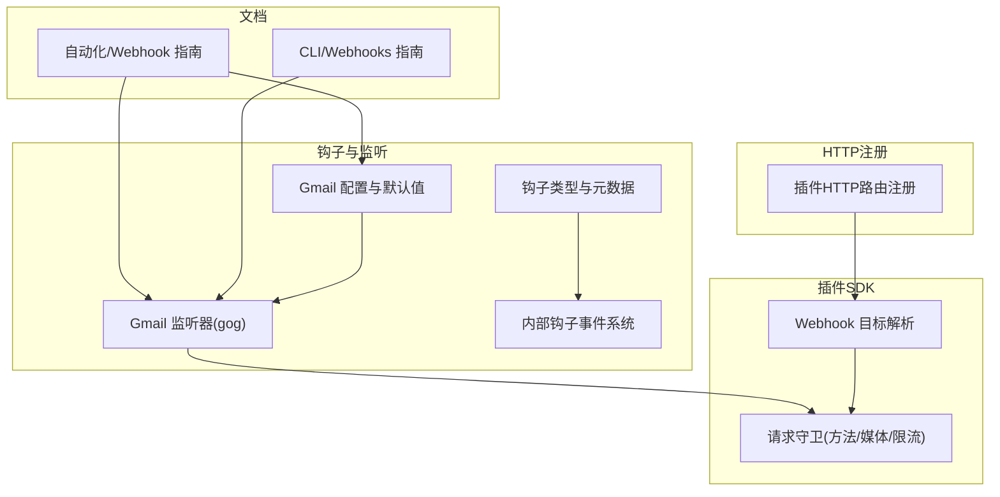
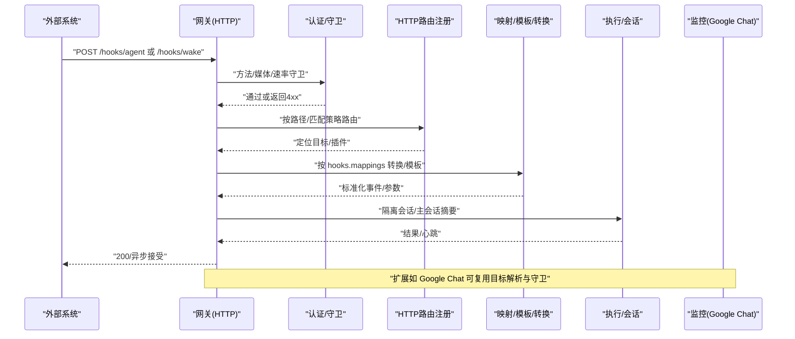
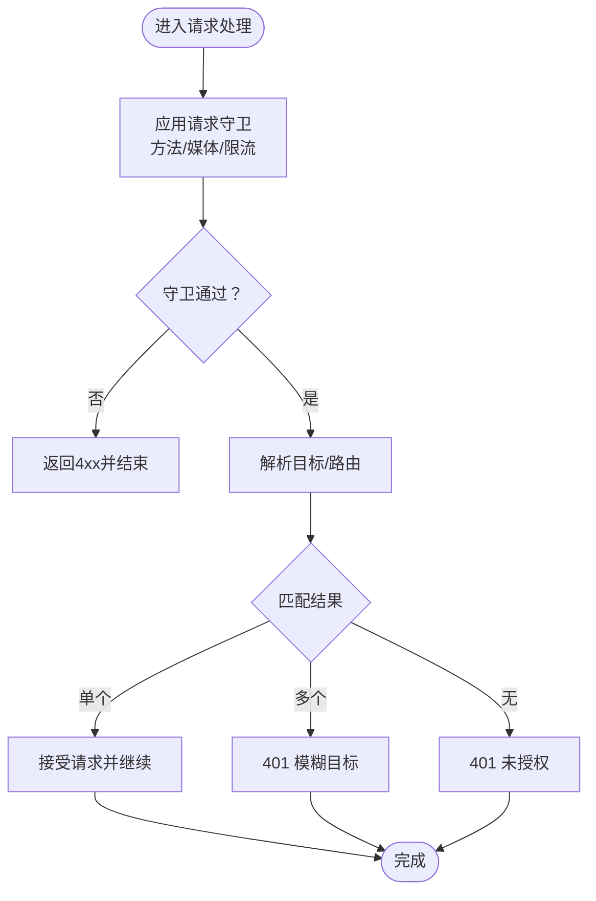
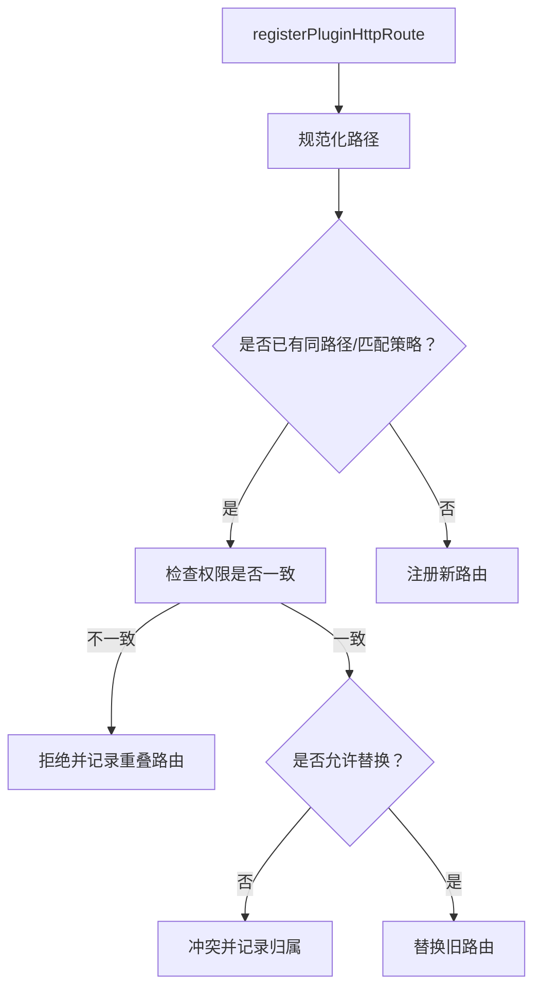
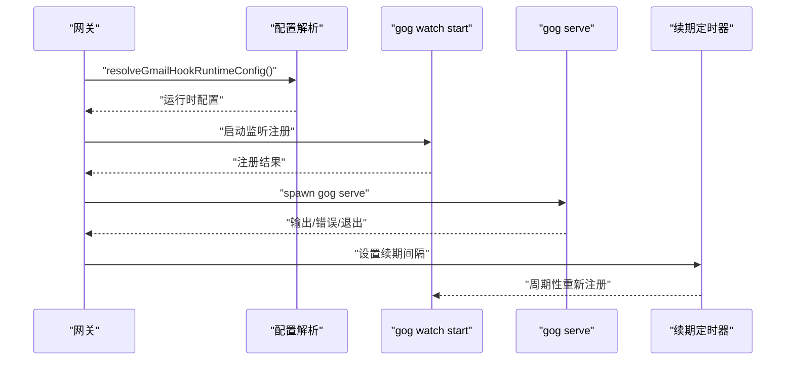
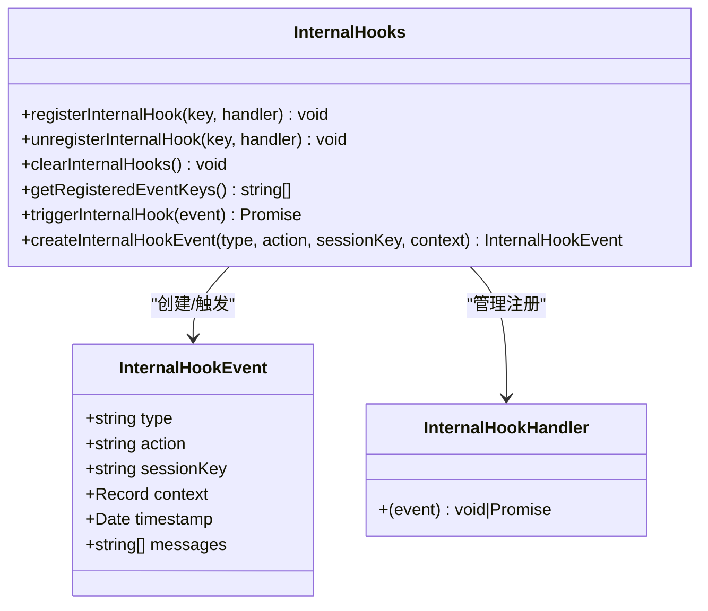
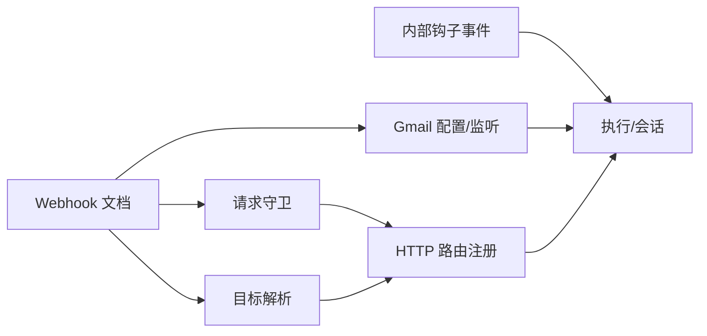

# Webhook系统

<cite>
**本文引用的文件**
- [docs/automation/webhook.md](file://docs/automation/webhook.md)
- [docs/cli/webhooks.md](file://docs/cli/webhooks.md)
- [src/hooks/gmail.ts](file://src/hooks/gmail.ts)
- [src/hooks/gmail-watcher.ts](file://src/hooks/gmail-watcher.ts)
- [src/hooks/config.ts](file://src/hooks/config.ts)
- [src/hooks/types.ts](file://src/hooks/types.ts)
- [src/hooks/internal-hooks.ts](file://src/hooks/internal-hooks.ts)
- [src/plugin-sdk/webhook-targets.ts](file://src/plugin-sdk/webhook-targets.ts)
- [src/plugin-sdk/webhook-request-guards.ts](file://src/plugin-sdk/webhook-request-guards.ts)
- [src/plugins/http-registry.ts](file://src/plugins/http-registry.ts)
- [extensions/googlechat/src/monitor-webhook.ts](file://extensions/googlechat/src/monitor-webhook.ts)
</cite>

## 目录
1. [简介](#简介)
2. [项目结构](#项目结构)
3. [核心组件](#核心组件)
4. [架构总览](#架构总览)
5. [组件详解](#组件详解)
6. [依赖关系分析](#依赖关系分析)
7. [性能考量](#性能考量)
8. [故障排查指南](#故障排查指南)
9. [结论](#结论)
10. [附录](#附录)

## 简介
本文件系统化阐述 OpenClaw 的 Webhook 能力：如何启用与配置、HTTP 入口点的创建、请求验证与安全策略、负载格式与响应处理、轮询机制（Gmail Pub/Sub）、事件触发条件、以及调试与性能优化实践。目标是帮助开发者与运维人员快速、安全地将外部系统接入 OpenClaw，并在生产环境中稳定运行。

## 项目结构
与 Webhook 相关的代码主要分布在以下模块：
- 文档层：自动化与 CLI 指南，定义了端点、认证、映射与 Gmail 集成流程
- 钩子与监听：Gmail Pub/Sub 监听器、钩子生命周期与事件模型
- 插件 SDK：通用 Webhook 请求守卫与目标解析工具
- HTTP 注册：插件 HTTP 路由注册与冲突检测

**图表来源**
- [docs/automation/webhook.md](file://docs/automation/webhook.md#L1-L216)
- [docs/cli/webhooks.md](file://docs/cli/webhooks.md#L1-L26)
- [src/hooks/gmail.ts](file://src/hooks/gmail.ts#L1-L272)
- [src/hooks/gmail-watcher.ts](file://src/hooks/gmail-watcher.ts#L1-L247)
- [src/hooks/types.ts](file://src/hooks/types.ts#L1-L68)
- [src/hooks/internal-hooks.ts](file://src/hooks/internal-hooks.ts#L1-L422)
- [src/plugin-sdk/webhook-targets.ts](file://src/plugin-sdk/webhook-targets.ts#L222-L281)
- [src/plugin-sdk/webhook-request-guards.ts](file://src/plugin-sdk/webhook-request-guards.ts#L139-L177)
- [src/plugins/http-registry.ts](file://src/plugins/http-registry.ts#L12-L74)

**章节来源**
- [docs/automation/webhook.md](file://docs/automation/webhook.md#L1-L216)
- [docs/cli/webhooks.md](file://docs/cli/webhooks.md#L1-L26)

## 核心组件
- Webhook 端点与认证
  - 端点：/hooks/wake、/hooks/agent、/hooks/<name>（映射）
  - 认证：支持 Authorization Bearer 或 x-openclaw-token；查询参数 token 被拒绝
  - 响应：成功 200；鉴权失败 401；重复失败 429；无效负载 400；超大负载 413
- Gmail Pub/Sub 集成
  - 自动启动 gog gmail watch serve；支持 Tailscale 出口；自动续期
  - 默认监听路径与端口；可配置 serve 路径与绑定地址
- 插件 HTTP 路由注册
  - 规范化路径、重名/权限冲突检测、替换策略
- 请求守卫与目标解析
  - 方法限制、JSON 内容类型校验、速率限制
  - 多目标匹配时的歧义处理与统一拒绝逻辑
- 内部钩子事件系统
  - 事件类型与上下文；注册/触发/清理；消息回传

**章节来源**
- [docs/automation/webhook.md](file://docs/automation/webhook.md#L13-L167)
- [src/hooks/gmail.ts](file://src/hooks/gmail.ts#L19-L206)
- [src/hooks/gmail-watcher.ts](file://src/hooks/gmail-watcher.ts#L128-L202)
- [src/plugins/http-registry.ts](file://src/plugins/http-registry.ts#L12-L74)
- [src/plugin-sdk/webhook-request-guards.ts](file://src/plugin-sdk/webhook-request-guards.ts#L139-L177)
- [src/plugin-sdk/webhook-targets.ts](file://src/plugin-sdk/webhook-targets.ts#L222-L281)
- [src/hooks/internal-hooks.ts](file://src/hooks/internal-hooks.ts#L159-L312)

## 架构总览
下图展示了从外部系统到 OpenClaw 的典型调用链路，包括认证、路由、映射与执行路径。

**图表来源**
- [docs/automation/webhook.md](file://docs/automation/webhook.md#L42-L167)
- [src/plugin-sdk/webhook-request-guards.ts](file://src/plugin-sdk/webhook-request-guards.ts#L139-L177)
- [src/plugins/http-registry.ts](file://src/plugins/http-registry.ts#L12-L74)
- [src/plugin-sdk/webhook-targets.ts](file://src/plugin-sdk/webhook-targets.ts#L222-L281)
- [extensions/googlechat/src/monitor-webhook.ts](file://extensions/googlechat/src/monitor-webhook.ts#L122-L159)

## 组件详解

### Webhook 端点与负载规范
- 端点
  - /hooks/wake：唤醒主会话并可选立即心跳
  - /hooks/agent：隔离会话执行，带会话键、通道、收件人等可选参数
  - /hooks/<name>：通过 hooks.mappings 将任意载荷映射为 wake/agent 动作
- 负载字段
  - /hooks/wake：text 必填；mode 可选(now/next-heartbeat)
  - /hooks/agent：message 必填；name、agentId、sessionKey、wakeMode、deliver、channel、to、model、thinking、timeoutSeconds 等可选
- 响应
  - 成功 200；鉴权失败 401；重复失败 429；无效负载 400；超大负载 413

**章节来源**
- [docs/automation/webhook.md](file://docs/automation/webhook.md#L42-L167)

### 认证与安全策略
- 认证方式
  - 推荐使用 Authorization: Bearer <token>
  - 支持 x-openclaw-token
  - 查询参数 token 被拒绝（返回 400）
- 安全建议
  - 仅在受信网络暴露端点（回环/隧道/可信反向代理）
  - 使用专用 token，避免复用网关认证令牌
  - 对多代理路由设置 allowedAgentIds 限制
  - 控制 sessionKey 的请求覆盖与前缀白名单
  - 避免在日志中记录敏感原始载荷
  - 可选择性禁用外部内容安全包装（危险）

**章节来源**
- [docs/automation/webhook.md](file://docs/automation/webhook.md#L34-L216)

### 请求守卫与目标解析
- 请求守卫
  - 限制允许的方法（默认仅 POST），否则 405 并返回 Allow
  - 可选速率限制（基于客户端地址），重复失败返回 429
  - 可选要求 JSON Content-Type，否则 415
- 目标解析
  - 单一匹配返回目标对象
  - 多匹配或无匹配时分别返回 401 与自定义消息
  - 同步/异步版本均可用

**图表来源**
- [src/plugin-sdk/webhook-request-guards.ts](file://src/plugin-sdk/webhook-request-guards.ts#L139-L177)
- [src/plugin-sdk/webhook-targets.ts](file://src/plugin-sdk/webhook-targets.ts#L222-L281)

**章节来源**
- [src/plugin-sdk/webhook-request-guards.ts](file://src/plugin-sdk/webhook-request-guards.ts#L139-L177)
- [src/plugin-sdk/webhook-targets.ts](file://src/plugin-sdk/webhook-targets.ts#L222-L281)

### 插件 HTTP 路由注册
- 路径规范化与回退路径
- 路由匹配策略（如 exact）与重名冲突检测
- 权限冲突与替换策略（replaceExisting、所有权检查）
- 日志提示与幂等注册

**图表来源**
- [src/plugins/http-registry.ts](file://src/plugins/http-registry.ts#L12-L74)

**章节来源**
- [src/plugins/http-registry.ts](file://src/plugins/http-registry.ts#L12-L74)

### Gmail Pub/Sub 集成与轮询
- 运行时配置
  - 解析 hooks.gmail 与 hooks.token；构建默认 hookUrl；serve 绑定/端口/路径
  - Tailscale 模式下的路径与目标处理
- 监听器生命周期
  - 自动启动 gog gmail watch start（注册订阅）
  - 子进程 gog gmail watch serve 监听推送
  - 地址占用错误处理与自动重启
  - 定时续期（renewEveryMinutes）
- CLI 辅助
  - openclaw webhooks gmail setup 生成配置
  - openclaw webhooks gmail run 启动监听

**图表来源**
- [src/hooks/gmail.ts](file://src/hooks/gmail.ts#L100-L206)
- [src/hooks/gmail-watcher.ts](file://src/hooks/gmail-watcher.ts#L132-L202)

**章节来源**
- [src/hooks/gmail.ts](file://src/hooks/gmail.ts#L19-L206)
- [src/hooks/gmail-watcher.ts](file://src/hooks/gmail-watcher.ts#L128-L202)
- [docs/cli/webhooks.md](file://docs/cli/webhooks.md#L18-L26)

### 内部钩子事件系统
- 事件类型与上下文
  - command、session、agent、gateway、message 等
  - message 事件包含 received/sent/transcribed/preprocessed 等动作
- 注册/触发/清理
  - 支持按类型或具体 event:action 注册
  - 触发时捕获异常并记录，不影响其他处理器
  - 提供消息回传数组用于钩子间通信

**图表来源**
- [src/hooks/internal-hooks.ts](file://src/hooks/internal-hooks.ts#L159-L312)

**章节来源**
- [src/hooks/internal-hooks.ts](file://src/hooks/internal-hooks.ts#L1-L422)

### 钩子配置与运行时资格
- 配置解析
  - hooks.internal.entries 中的钩子条目与启用状态
  - 运行时平台/二进制/环境变量/配置项的资格评估
- 包含判断
  - 显式禁用优先于资格评估
  - 插件托管钩子与普通钩子的区别处理

**章节来源**
- [src/hooks/config.ts](file://src/hooks/config.ts#L24-L84)
- [src/hooks/types.ts](file://src/hooks/types.ts#L35-L61)

### 扩展示例：Google Chat 监控
- 目标解析与认证
  - 依据 Bearer Token 与 Audience 类型/值进行验证
  - 无 Bearer 时要求附加 Bearer，否则 401
- 解析与执行
  - 认证后读取并解析事件载荷
  - 与通用目标解析与守卫配合

**章节来源**
- [extensions/googlechat/src/monitor-webhook.ts](file://extensions/googlechat/src/monitor-webhook.ts#L122-L159)

## 依赖关系分析
- 文档驱动的端点与行为约定
- 钩子系统为内部事件编排提供基础
- 插件 SDK 为外部 Webhook 提供通用守卫与目标解析
- HTTP 注册模块确保路由唯一性与权限一致性
- Gmail 监听器依赖 gog 二进制与配置，提供轮询与续期能力

**图表来源**
- [docs/automation/webhook.md](file://docs/automation/webhook.md#L1-L216)
- [src/plugin-sdk/webhook-request-guards.ts](file://src/plugin-sdk/webhook-request-guards.ts#L139-L177)
- [src/plugin-sdk/webhook-targets.ts](file://src/plugin-sdk/webhook-targets.ts#L222-L281)
- [src/plugins/http-registry.ts](file://src/plugins/http-registry.ts#L12-L74)
- [src/hooks/gmail.ts](file://src/hooks/gmail.ts#L100-L206)
- [src/hooks/internal-hooks.ts](file://src/hooks/internal-hooks.ts#L270-L288)

**章节来源**
- [docs/automation/webhook.md](file://docs/automation/webhook.md#L1-L216)
- [src/plugin-sdk/webhook-request-guards.ts](file://src/plugin-sdk/webhook-request-guards.ts#L139-L177)
- [src/plugin-sdk/webhook-targets.ts](file://src/plugin-sdk/webhook-targets.ts#L222-L281)
- [src/plugins/http-registry.ts](file://src/plugins/http-registry.ts#L12-L74)
- [src/hooks/gmail.ts](file://src/hooks/gmail.ts#L100-L206)
- [src/hooks/internal-hooks.ts](file://src/hooks/internal-hooks.ts#L270-L288)

## 性能考量
- 速率限制
  - 对重复鉴权失败的客户端进行每客户端限流，防止暴力破解
- 轮询与续期
  - Gmail 监听器按 renewEveryMinutes 周期性续期，避免订阅过期
- 负载大小
  - 通过 maxBytes 控制单次推送大小，避免内存压力
- 路由冲突与替换
  - 在插件路由注册时避免重名与权限冲突，减少运行时查找成本

**章节来源**
- [docs/automation/webhook.md](file://docs/automation/webhook.md#L164-L167)
- [src/hooks/gmail.ts](file://src/hooks/gmail.ts#L141-L148)
- [src/hooks/gmail-watcher.ts](file://src/hooks/gmail-watcher.ts#L189-L195)
- [src/plugins/http-registry.ts](file://src/plugins/http-registry.ts#L36-L48)

## 故障排查指南
- 常见错误码
  - 401：鉴权失败（未提供或错误 token）
  - 405：方法不允许（仅允许 POST）
  - 413：请求体过大（超过 maxBytes）
  - 429：重复鉴权失败（触发限流）
- Gmail 监听器
  - 地址占用：端口被占用时停止自动重启，需手动排查其他监听器
  - gog 二进制缺失：确认已安装并可执行
  - 续期失败：检查网络与 Google API 权限
- 目标解析
  - 多匹配：确保目标选择逻辑明确，避免歧义
  - 无匹配：核对 token、Audience 类型与值

**章节来源**
- [docs/automation/webhook.md](file://docs/automation/webhook.md#L159-L167)
- [src/hooks/gmail-watcher.ts](file://src/hooks/gmail-watcher.ts#L25-L27)
- [src/hooks/gmail-watcher.ts](file://src/hooks/gmail-watcher.ts#L102-L118)
- [src/plugin-sdk/webhook-targets.ts](file://src/plugin-sdk/webhook-targets.ts#L250-L271)

## 结论
OpenClaw 的 Webhook 系统以“文档即规范”的方式定义端点与行为，结合插件 SDK 的通用守卫与目标解析，以及 Gmail Pub/Sub 的轮询与续期能力，提供了从外部系统到内部会话执行的完整闭环。通过严格的认证、速率限制与会话键策略，系统在保证安全性的同时具备良好的可扩展性与可观测性。

## 附录
- 配置要点速查
  - hooks.enabled、hooks.token、hooks.path
  - hooks.allowedAgentIds、hooks.defaultSessionKey、hooks.allowRequestSessionKey、hooks.allowedSessionKeyPrefixes
  - hooks.mappings/presets/transformsDir
  - hooks.gmail.account/topic/pushToken/hookUrl/includeBody/maxBytes/renewEveryMinutes/serve/tailscale
- 常用命令
  - openclaw webhooks gmail setup
  - openclaw webhooks gmail run

**章节来源**
- [docs/automation/webhook.md](file://docs/automation/webhook.md#L13-L158)
- [docs/cli/webhooks.md](file://docs/cli/webhooks.md#L18-L26)