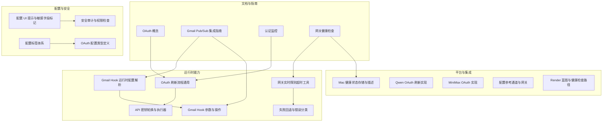
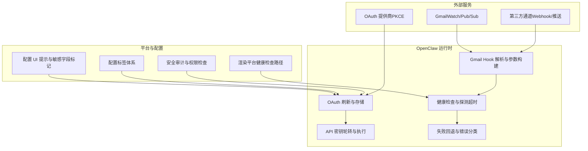
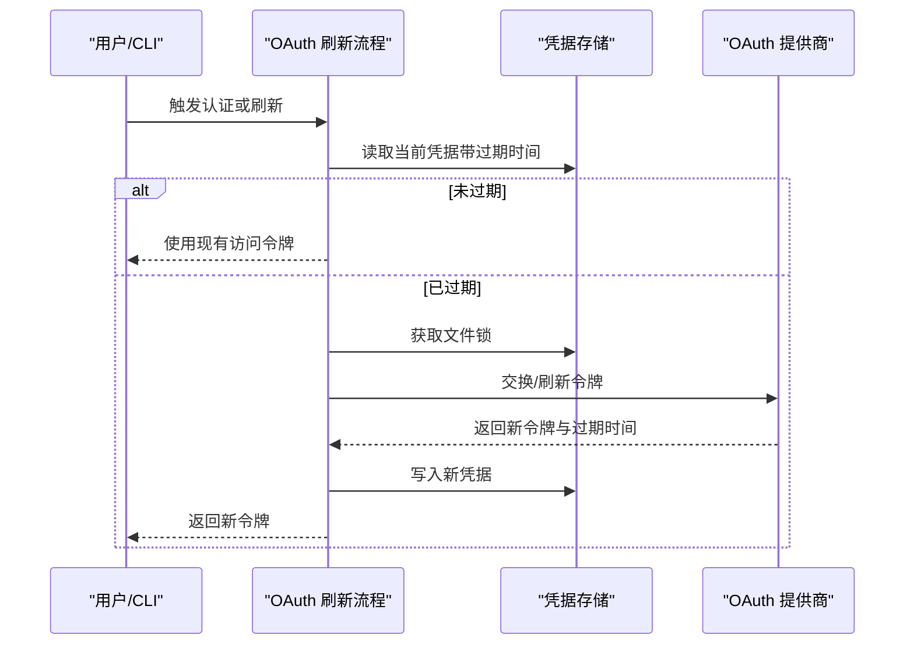
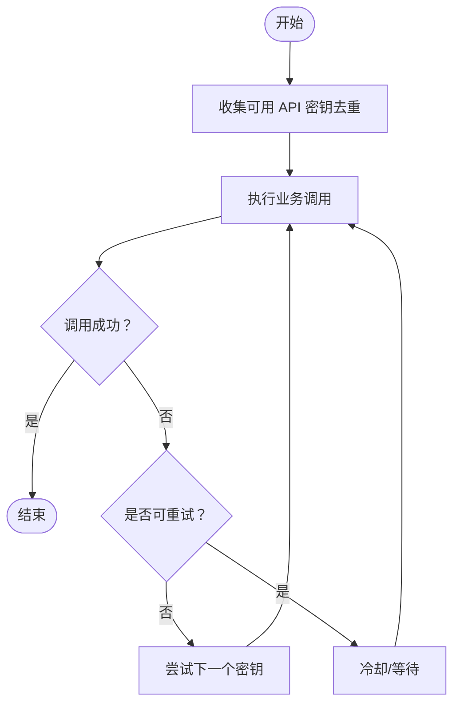
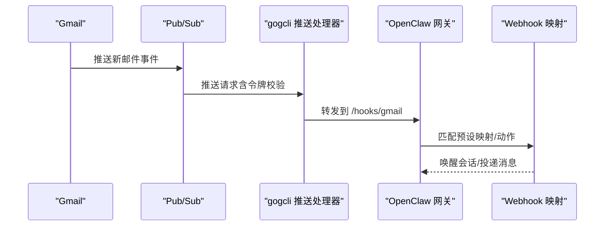
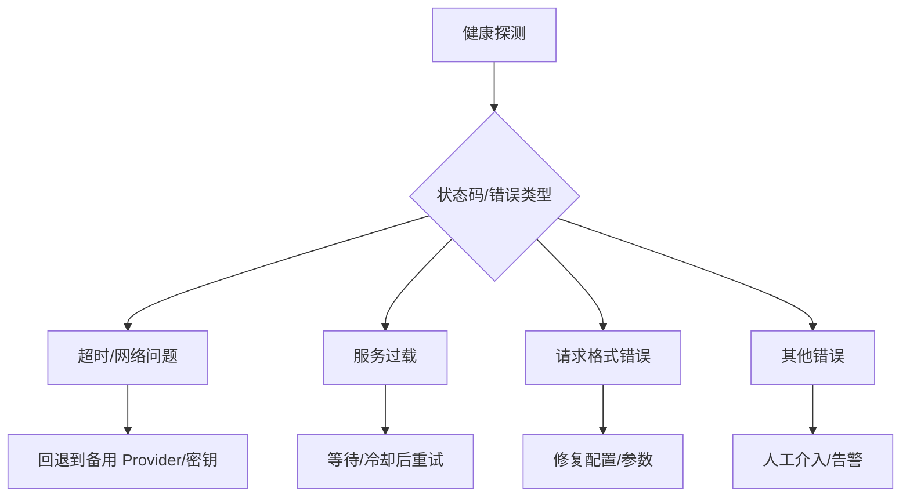
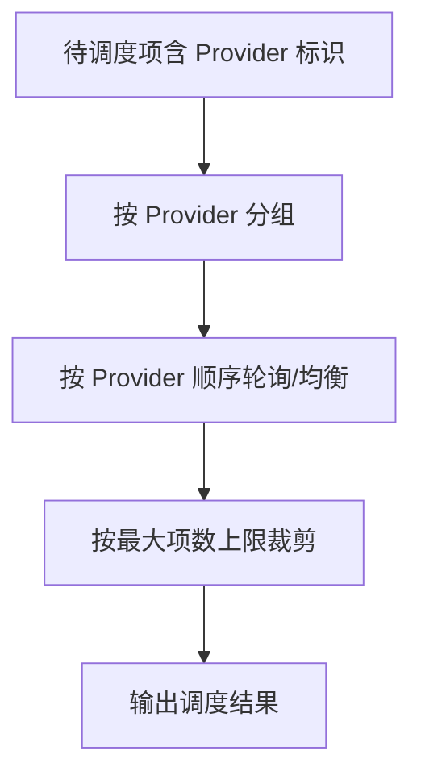
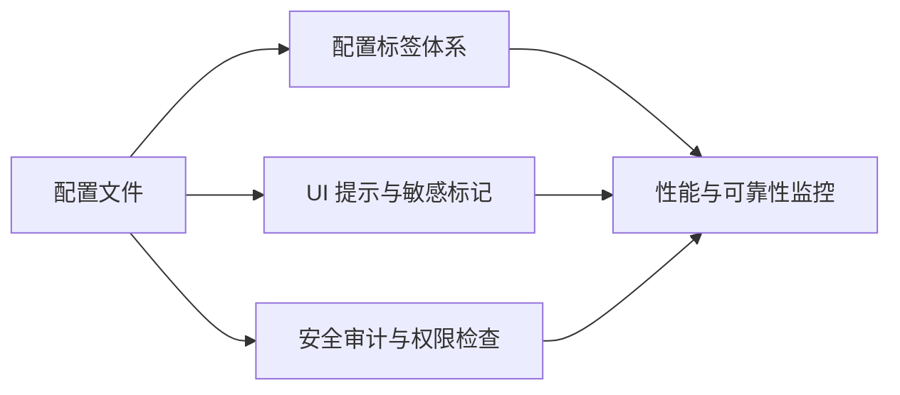
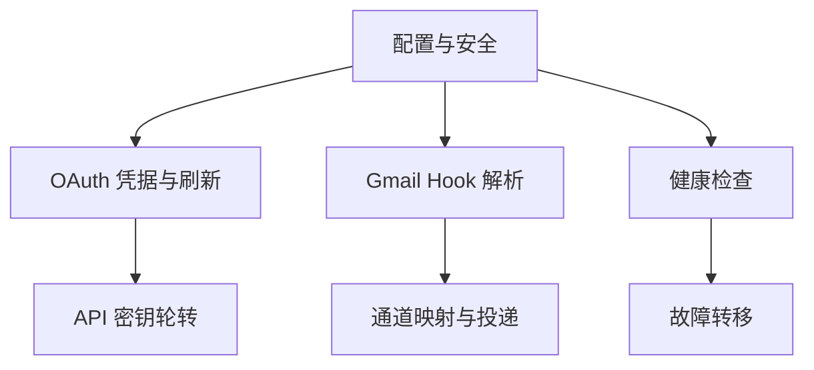

# 外部服务集成

<cite>
**本文引用的文件**
- [OAuth 概念](file://docs/concepts/oauth.md)
- [Gmail Pub/Sub 集成指南](file://docs/automation/gmail-pubsub.md)
- [认证监控](file://docs/automation/auth-monitoring.md)
- [网关健康检查](file://docs/gateway/health.md)
- [配置参考](file://docs/gateway/configuration-reference.md)
- [配置 UI 提示与敏感字段标记](file://src/config/schema.hints.ts)
- [配置标签体系](file://src/config/schema.tags.ts)
- [OAuth 配置类型定义](file://src/config/types.auth.ts)
- [API 密钥轮换与执行器](file://src/agents/api-key-rotation.ts)
- [OAuth 刷新流程（通用）](file://src/agents/auth-profiles/oauth.ts)
- [Qwen OAuth 刷新实现](file://src/providers/qwen-portal-oauth.ts)
- [MiniMax OAuth 实现](file://extensions/minimax-portal-auth/oauth.ts)
- [Gmail Hook 运行时配置解析](file://src/hooks/gmail.ts)
- [Gmail Hook 参数与操作](file://src/hooks/gmail-ops.ts)
- [失败回退与错误分类](file://src/agents/failover-error.test.ts)
- [Mac 健康状态存储与描述](file://apps/macos/Sources/OpenClaw/HealthStore.swift)
- [网关实时探测超时工具](file://src/gateway/gateway-models.profiles.live.test.ts)
- [安全审计与权限检查](file://src/security/audit.ts)
- [威胁模型与持久化攻击](file://SECURITY.md)
- [Render 蓝图与健康检查路径](file://docs/zh-CN/install/render.mdx)
</cite>

## 目录
1. [简介](#简介)
2. [项目结构](#项目结构)
3. [核心组件](#核心组件)
4. [架构总览](#架构总览)
5. [组件详解](#组件详解)
6. [依赖关系分析](#依赖关系分析)
7. [性能考量](#性能考量)
8. [故障排查指南](#故障排查指南)
9. [结论](#结论)
10. [附录](#附录)

## 简介
本章节面向需要在 OpenClaw 中集成第三方外部服务的工程师与运维人员，系统性阐述以下主题：
- OAuth 认证与令牌刷新：支持 PKCE 授权码流程、刷新令牌与过期时间管理、多账户/多配置文件路由。
- API 密钥管理与轮转：多密钥收集、失败重试与冷却策略、速率限制识别与自动切换。
- Gmail 监控与邮件处理：通过 Gmail Watch/Pub/Sub 推送接入 OpenClaw Webhook，实现邮件到会话的唤醒与投递。
- 认证监控、健康检查与故障转移：基于 CLI 状态检查、健康快照与探测超时，结合错误分类进行回退。
- 服务发现、负载均衡与容错：通过配置与探测工具实现跨 Provider 的资源调度与故障隔离。
- 集成配置、安全与可观测性：配置分组与敏感字段标记、渲染平台健康检查、审计与权限校验。
- 常见服务集成模板与最佳实践：提供可复用的配置片段与实施建议。

## 项目结构
围绕外部服务集成，OpenClaw 在多个层面提供了能力与文档：
- 文档层：概念与自动化指南（OAuth、Gmail Pub/Sub、健康检查、认证监控）。
- 配置层：Zod Schema、UI 提示、敏感字段标记、配置标签体系。
- 运行时层：OAuth 存储与刷新、API 密钥轮转、Gmail Hook 解析与参数构建、健康状态采集与错误分类。
- 平台层：macOS 健康状态存储、网关探测超时、安全审计与威胁模型。

**图表来源**
- [OAuth 概念](file://docs/concepts/oauth.md#L1-L159)
- [Gmail Pub/Sub 集成指南](file://docs/automation/gmail-pubsub.md#L1-L257)
- [认证监控](file://docs/automation/auth-monitoring.md#L1-L45)
- [网关健康检查](file://docs/gateway/health.md#L1-L36)
- [配置 UI 提示与敏感字段标记](file://src/config/schema.hints.ts#L1-L239)
- [配置标签体系](file://src/config/schema.tags.ts#L1-L53)
- [OAuth 配置类型定义](file://src/config/types.auth.ts#L1-L29)
- [OAuth 刷新流程（通用）](file://src/agents/auth-profiles/oauth.ts#L154-L177)
- [API 密钥轮换与执行器](file://src/agents/api-key-rotation.ts#L1-L46)
- [Gmail Hook 运行时配置解析](file://src/hooks/gmail.ts#L100-L271)
- [Gmail Hook 参数与操作](file://src/hooks/gmail-ops.ts#L97-L117)
- [失败回退与错误分类](file://src/agents/failover-error.test.ts#L71-L82)
- [网关实时探测超时工具](file://src/gateway/gateway-models.profiles.live.test.ts#L104-L145)
- [Mac 健康状态存储与描述](file://apps/macos/Sources/OpenClaw/HealthStore.swift#L147-L163)
- [Qwen OAuth 刷新实现](file://src/providers/qwen-portal-oauth.ts#L39-L62)
- [MiniMax OAuth 实现](file://extensions/minimax-portal-auth/oauth.ts#L90-L182)
- [配置参考（通道与网关）](file://docs/gateway/configuration-reference.md#L1-L800)
- [Render 蓝图与健康检查路径](file://docs/zh-CN/install/render.mdx#L39-L115)

**章节来源**
- [OAuth 概念](file://docs/concepts/oauth.md#L1-L159)
- [Gmail Pub/Sub 集成指南](file://docs/automation/gmail-pubsub.md#L1-L257)
- [认证监控](file://docs/automation/auth-monitoring.md#L1-L45)
- [网关健康检查](file://docs/gateway/health.md#L1-L36)
- [配置 UI 提示与敏感字段标记](file://src/config/schema.hints.ts#L1-L239)
- [配置标签体系](file://src/config/schema.tags.ts#L1-L53)
- [OAuth 配置类型定义](file://src/config/types.auth.ts#L1-L29)
- [OAuth 刷新流程（通用）](file://src/agents/auth-profiles/oauth.ts#L154-L177)
- [API 密钥轮换与执行器](file://src/agents/api-key-rotation.ts#L1-L46)
- [Gmail Hook 运行时配置解析](file://src/hooks/gmail.ts#L100-L271)
- [Gmail Hook 参数与操作](file://src/hooks/gmail-ops.ts#L97-L117)
- [失败回退与错误分类](file://src/agents/failover-error.test.ts#L71-L82)
- [网关实时探测超时工具](file://src/gateway/gateway-models.profiles.live.test.ts#L104-L145)
- [Mac 健康状态存储与描述](file://apps/macos/Sources/OpenClaw/HealthStore.swift#L147-L163)
- [Qwen OAuth 刷新实现](file://src/providers/qwen-portal-oauth.ts#L39-L62)
- [MiniMax OAuth 实现](file://extensions/minimax-portal-auth/oauth.ts#L90-L182)
- [配置参考（通道与网关）](file://docs/gateway/configuration-reference.md#L1-L800)
- [Render 蓝图与健康检查路径](file://docs/zh-CN/install/render.mdx#L39-L115)

## 核心组件
- OAuth 凭据与存储：支持 PKCE 授权码、刷新令牌与过期时间管理；多账户/多配置文件路由。
- API 密钥轮转：多密钥收集、失败重试与冷却策略、速率限制识别与自动切换。
- Gmail 监控：Gmail Watch + Pub/Sub 推送 + gogcli + OpenClaw Webhook。
- 健康检查与故障转移：CLI 状态检查、健康快照、探测超时、错误分类与回退。
- 配置与安全：配置 UI 提示、敏感字段标记、渲染平台健康检查、安全审计与权限校验。

**章节来源**
- [OAuth 概念](file://docs/concepts/oauth.md#L1-L159)
- [API 密钥轮换与执行器](file://src/agents/api-key-rotation.ts#L1-L46)
- [Gmail Pub/Sub 集成指南](file://docs/automation/gmail-pubsub.md#L1-L257)
- [网关健康检查](file://docs/gateway/health.md#L1-L36)
- [配置 UI 提示与敏感字段标记](file://src/config/schema.hints.ts#L1-L239)
- [安全审计与权限检查](file://src/security/audit.ts#L276-L343)

## 架构总览
下图展示从外部服务（OAuth 提供商、Gmail、第三方通道）到 OpenClaw 的集成路径与关键交互点。

**图表来源**
- [OAuth 概念](file://docs/concepts/oauth.md#L1-L159)
- [Gmail Pub/Sub 集成指南](file://docs/automation/gmail-pubsub.md#L1-L257)
- [API 密钥轮换与执行器](file://src/agents/api-key-rotation.ts#L1-L46)
- [Gmail Hook 运行时配置解析](file://src/hooks/gmail.ts#L100-L271)
- [网关健康检查](file://docs/gateway/health.md#L1-L36)
- [配置 UI 提示与敏感字段标记](file://src/config/schema.hints.ts#L1-L239)
- [配置标签体系](file://src/config/schema.tags.ts#L1-L53)
- [安全审计与权限检查](file://src/security/audit.ts#L276-L343)
- [Render 蓝图与健康检查路径](file://docs/zh-CN/install/render.mdx#L39-L115)

## 组件详解

### OAuth 认证与令牌刷新
- 支持 PKCE 授权码流程与刷新令牌；凭据存储于 per-agent 目录，避免多端同时登录导致的随机登出。
- 运行时根据过期时间判断是否需要刷新；刷新在文件锁保护下进行，确保并发安全。
- 多账户/多配置文件路由：通过配置顺序与会话覆盖实现按需选择。

**图表来源**
- [OAuth 刷新流程（通用）](file://src/agents/auth-profiles/oauth.ts#L154-L177)
- [OAuth 概念](file://docs/concepts/oauth.md#L1-L159)

**章节来源**
- [OAuth 概念](file://docs/concepts/oauth.md#L1-L159)
- [OAuth 刷新流程（通用）](file://src/agents/auth-profiles/oauth.ts#L154-L177)

### API 密钥管理与轮转
- 多密钥收集去重，失败时自动切换下一个密钥；支持速率限制识别与自定义重试条件。
- 执行器封装统一的重试/回退逻辑，便于在不同 Provider 间平滑切换。

**图表来源**
- [API 密钥轮换与执行器](file://src/agents/api-key-rotation.ts#L1-L46)

**章节来源**
- [API 密钥轮换与执行器](file://src/agents/api-key-rotation.ts#L1-L46)

### Gmail 监控、邮件处理与通知
- 通过 Gmail Watch 启动 Watch，Pub/Sub 推送至本地或公网暴露的 gogcli 服务，再转发到 OpenClaw Webhook。
- 支持自定义主题、订阅、推送令牌、Hook URL、正文包含与大小限制等参数。
- 提供向导式一键配置与手动运行两种方式，支持 Tailscale Funnel 公网暴露。

**图表来源**
- [Gmail Pub/Sub 集成指南](file://docs/automation/gmail-pubsub.md#L1-L257)
- [Gmail Hook 运行时配置解析](file://src/hooks/gmail.ts#L100-L271)
- [Gmail Hook 参数与操作](file://src/hooks/gmail-ops.ts#L97-L117)

**章节来源**
- [Gmail Pub/Sub 集成指南](file://docs/automation/gmail-pubsub.md#L1-L257)
- [Gmail Hook 运行时配置解析](file://src/hooks/gmail.ts#L100-L271)
- [Gmail Hook 参数与操作](file://src/hooks/gmail-ops.ts#L97-L117)

### 认证监控、健康检查与故障转移
- 认证监控：通过 CLI 状态检查返回退出码，支持“即将过期/已过期/正常”三态。
- 健康检查：CLI 快速诊断、深度探测、WebSocket 健康快照；macOS 平台提供健康状态存储与描述。
- 故障转移：基于 HTTP 状态码分类（超时/过载/格式错误等），结合探测超时与冷却策略进行回退。

**图表来源**
- [认证监控](file://docs/automation/auth-monitoring.md#L1-L45)
- [网关健康检查](file://docs/gateway/health.md#L1-L36)
- [Mac 健康状态存储与描述](file://apps/macos/Sources/OpenClaw/HealthStore.swift#L147-L163)
- [失败回退与错误分类](file://src/agents/failover-error.test.ts#L71-L82)
- [网关实时探测超时工具](file://src/gateway/gateway-models.profiles.live.test.ts#L104-L145)

**章节来源**
- [认证监控](file://docs/automation/auth-monitoring.md#L1-L45)
- [网关健康检查](file://docs/gateway/health.md#L1-L36)
- [Mac 健康状态存储与描述](file://apps/macos/Sources/OpenClaw/HealthStore.swift#L147-L163)
- [失败回退与错误分类](file://src/agents/failover-error.test.ts#L71-L82)
- [网关实时探测超时工具](file://src/gateway/gateway-models.profiles.live.test.ts#L104-L145)

### 服务发现、负载均衡与容错
- 服务发现：通过配置与通道默认行为实现 Provider 与账户的自动发现与启动。
- 负载均衡：按 Provider 分桶与最大数量限制进行分布均衡，避免单 Provider 过载。
- 容错：探测超时、错误分类、冷却与回退策略协同工作，保障整体可用性。

**图表来源**
- [网关实时探测超时工具](file://src/gateway/gateway-models.profiles.live.test.ts#L126-L145)

**章节来源**
- [网关实时探测超时工具](file://src/gateway/gateway-models.profiles.live.test.ts#L126-L145)

### 集成配置、安全与性能监控
- 配置 UI 提示与敏感字段标记：对 token/password/api.key 等敏感键进行自动标记与占位符提示。
- 配置标签体系：将配置按安全、认证、网络、可靠性等标签归类，便于治理与审计。
- 渲染平台健康检查：通过健康检查路径与自动重启机制提升可用性。
- 安全审计：文件权限检查、配置完整性与权限风险评估。

**图表来源**
- [配置 UI 提示与敏感字段标记](file://src/config/schema.hints.ts#L1-L239)
- [配置标签体系](file://src/config/schema.tags.ts#L1-L53)
- [安全审计与权限检查](file://src/security/audit.ts#L276-L343)
- [Render 蓝图与健康检查路径](file://docs/zh-CN/install/render.mdx#L39-L115)

**章节来源**
- [配置 UI 提示与敏感字段标记](file://src/config/schema.hints.ts#L1-L239)
- [配置标签体系](file://src/config/schema.tags.ts#L1-L53)
- [安全审计与权限检查](file://src/security/audit.ts#L276-L343)
- [Render 蓝图与健康检查路径](file://docs/zh-CN/install/render.mdx#L39-L115)

### 常见服务集成模板与最佳实践
- OAuth 模板：使用 PKCE 授权码流程，配置 per-agent 凭据存储，启用多账户路由。
- API 密钥模板：为每个 Provider 维护多密钥列表，启用轮转与速率限制识别。
- Gmail 模板：使用向导一键配置 Watch/Pub/Sub/Webhook，设置主题/订阅/推送令牌与正文大小限制。
- 健康检查模板：定期执行 CLI 健康检查，结合渲染平台健康检查路径与自动重启。
- 安全模板：严格控制配置文件权限，启用敏感字段标记与审计，遵循威胁模型与最小权限原则。

**章节来源**
- [OAuth 概念](file://docs/concepts/oauth.md#L1-L159)
- [API 密钥轮换与执行器](file://src/agents/api-key-rotation.ts#L1-L46)
- [Gmail Pub/Sub 集成指南](file://docs/automation/gmail-pubsub.md#L1-L257)
- [网关健康检查](file://docs/gateway/health.md#L1-L36)
- [配置 UI 提示与敏感字段标记](file://src/config/schema.hints.ts#L1-L239)
- [安全审计与权限检查](file://src/security/audit.ts#L276-L343)
- [威胁模型与持久化攻击](file://SECURITY.md#L48-L67)

## 依赖关系分析
- OAuth 与 API 密钥：两者共同构成外部服务认证的双轨制，前者适合长期订阅型服务，后者适合一次性密钥型服务。
- Gmail Hook 与通道：Gmail 作为外部事件源，通过 Webhook 与通道映射对接到具体消息通道。
- 健康检查与故障转移：健康快照与探测超时为回退策略提供依据，错误分类细化回退粒度。
- 配置与安全：UI 提示与标签体系辅助正确配置，安全审计与权限检查降低泄露风险。

**图表来源**
- [OAuth 刷新流程（通用）](file://src/agents/auth-profiles/oauth.ts#L154-L177)
- [API 密钥轮换与执行器](file://src/agents/api-key-rotation.ts#L1-L46)
- [Gmail Hook 运行时配置解析](file://src/hooks/gmail.ts#L100-L271)
- [网关健康检查](file://docs/gateway/health.md#L1-L36)
- [配置 UI 提示与敏感字段标记](file://src/config/schema.hints.ts#L1-L239)
- [安全审计与权限检查](file://src/security/audit.ts#L276-L343)

**章节来源**
- [OAuth 刷新流程（通用）](file://src/agents/auth-profiles/oauth.ts#L154-L177)
- [API 密钥轮换与执行器](file://src/agents/api-key-rotation.ts#L1-L46)
- [Gmail Hook 运行时配置解析](file://src/hooks/gmail.ts#L100-L271)
- [网关健康检查](file://docs/gateway/health.md#L1-L36)
- [配置 UI 提示与敏感字段标记](file://src/config/schema.hints.ts#L1-L239)
- [安全审计与权限检查](file://src/security/audit.ts#L276-L343)

## 性能考量
- 密钥轮转与冷却：在高并发场景下，合理设置冷却窗口与最大失败窗口，避免雪崩效应。
- 探测超时与抖动：为探测引入抖动与指数回退，减少集中重试带来的瞬时压力。
- 负载均衡与分桶：按 Provider 分桶与最大数量限制，避免单点过载。
- 邮件处理吞吐：合理设置正文大小限制与包含正文开关，平衡信息完整性和传输成本。

## 故障排查指南
- OAuth 凭据：使用状态检查命令快速定位“已过期/缺失/即将过期”，必要时重新授权。
- 健康检查：通过 CLI 快速诊断与 WebSocket 健康快照，结合日志过滤定位问题根因。
- Gmail 集成：确认 Watch/Pub/Sub 主题/订阅/推送令牌配置正确，测试发送一封邮件验证链路。
- 安全审计：检查配置文件权限与敏感字段标记，避免误将密钥写入可读/可写位置。

**章节来源**
- [认证监控](file://docs/automation/auth-monitoring.md#L1-L45)
- [网关健康检查](file://docs/gateway/health.md#L1-L36)
- [Gmail Pub/Sub 集成指南](file://docs/automation/gmail-pubsub.md#L1-L257)
- [安全审计与权限检查](file://src/security/audit.ts#L276-L343)

## 结论
OpenClaw 在外部服务集成方面提供了从认证、密钥管理、邮件监控到健康检查与故障转移的完整能力栈。通过 OAuth 与 API 密钥双轨制、Gmail Pub/Sub 与 Webhook 的无缝衔接、以及配置与安全的强约束，能够满足生产级的稳定性与安全性要求。建议在实际部署中结合模板与最佳实践，建立自动化监控与告警体系，持续优化负载均衡与冷却策略，确保系统的高可用与低风险。

## 附录
- 配置参考：通道与网关相关配置项详见配置参考文档。
- 渲染平台：利用健康检查路径与自动重启机制提升可用性。

**章节来源**
- [配置参考（通道与网关）](file://docs/gateway/configuration-reference.md#L1-L800)
- [Render 蓝图与健康检查路径](file://docs/zh-CN/install/render.mdx#L39-L115)