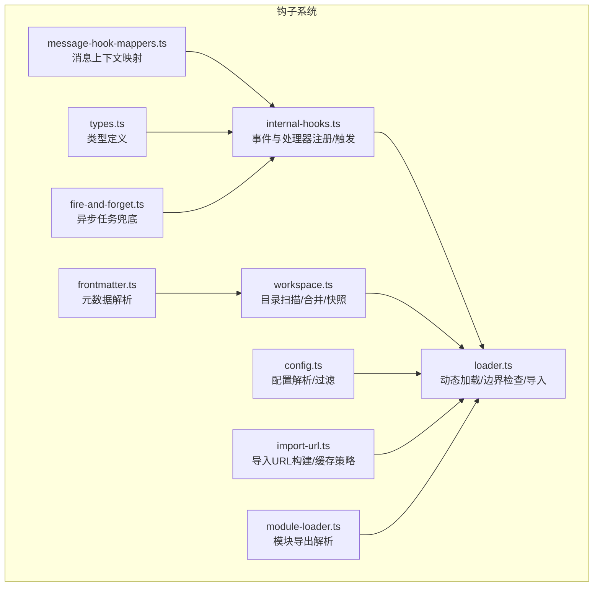
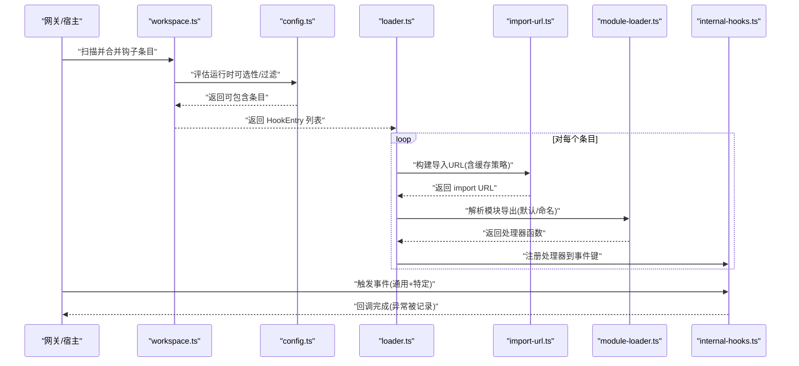
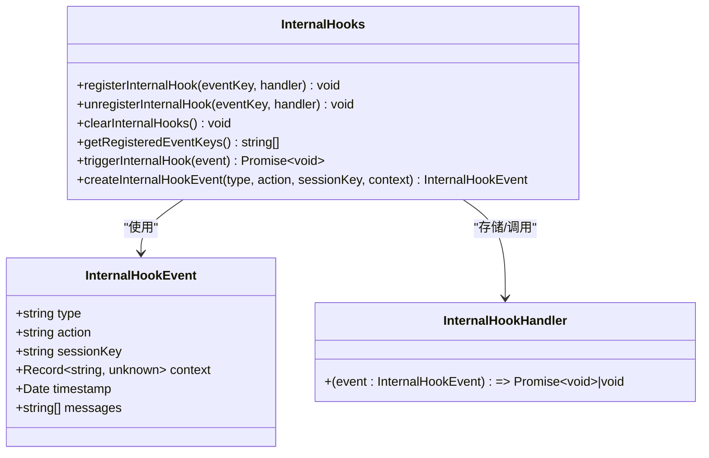
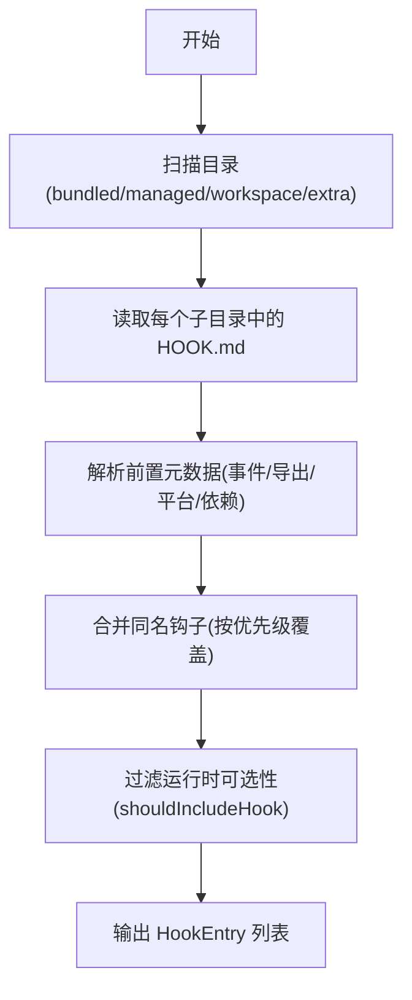
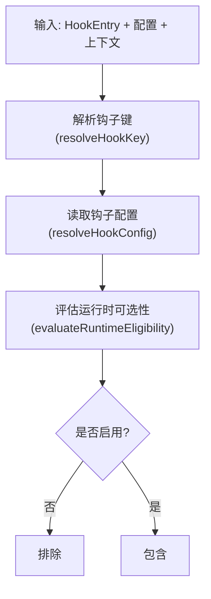
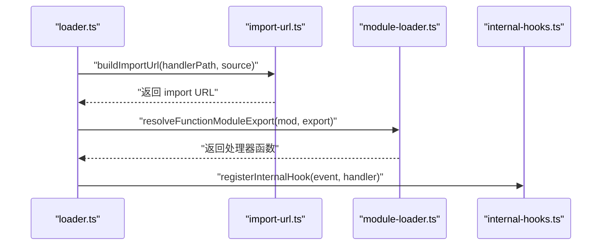
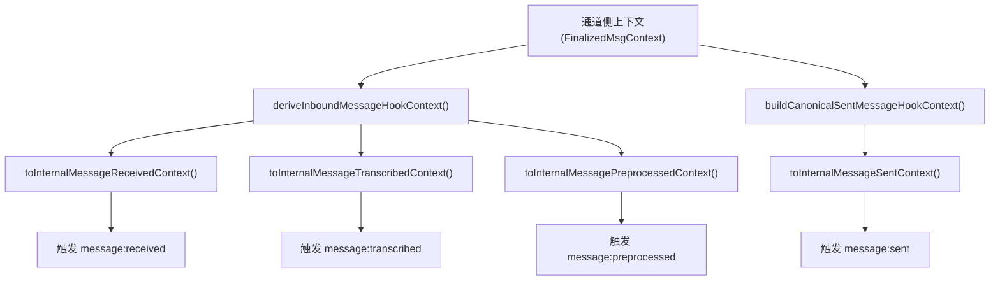
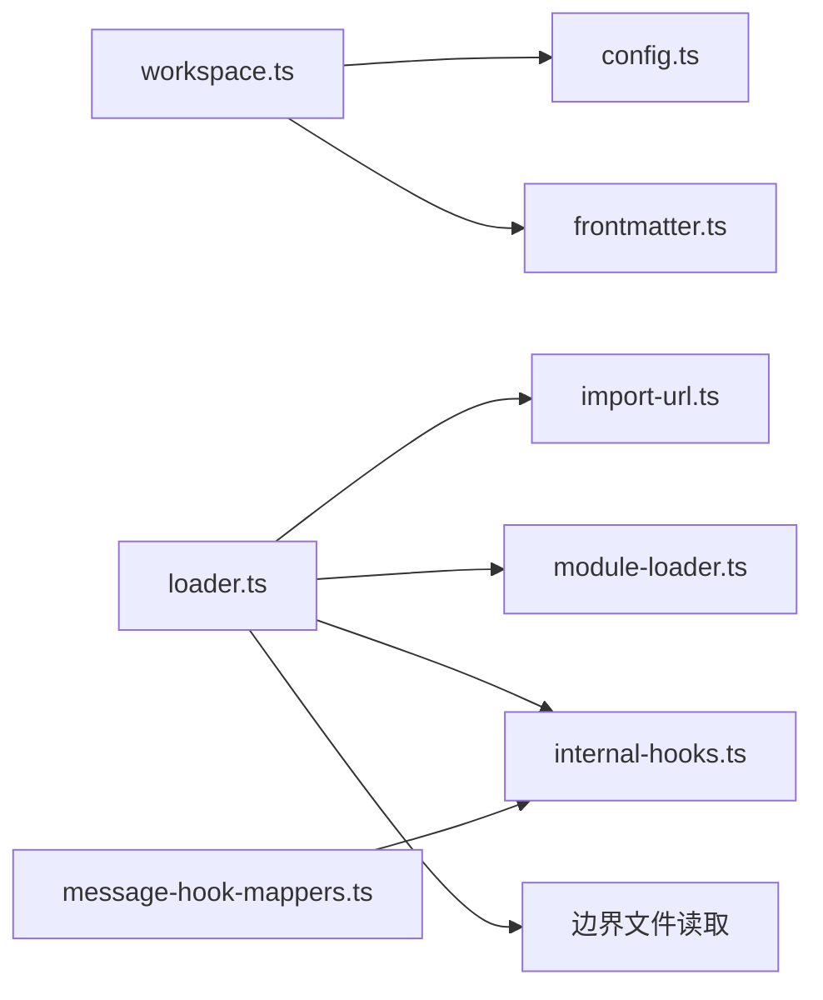

# 钩子系统

<cite>
**本文引用的文件**
- [src/hooks/internal-hooks.ts](file://src/hooks/internal-hooks.ts)
- [src/hooks/loader.ts](file://src/hooks/loader.ts)
- [src/hooks/workspace.ts](file://src/hooks/workspace.ts)
- [src/hooks/config.ts](file://src/hooks/config.ts)
- [src/hooks/frontmatter.ts](file://src/hooks/frontmatter.ts)
- [src/hooks/import-url.ts](file://src/hooks/import-url.ts)
- [src/hooks/module-loader.ts](file://src/hooks/module-loader.ts)
- [src/hooks/message-hook-mappers.ts](file://src/hooks/message-hook-mappers.ts)
- [src/hooks/types.ts](file://src/hooks/types.ts)
- [src/hooks/bundled/command-logger/handler.ts](file://src/hooks/bundled/command-logger/handler.ts)
- [src/hooks/bundled/session-memory/handler.ts](file://src/hooks/bundled/session-memory/handler.ts)
- [src/hooks/bundled/boot-md/handler.ts](file://src/hooks/bundled/boot-md/handler.ts)
- [src/hooks/bundled/bootstrap-extra-files/handler.ts](file://src/hooks/bundled/bootstrap-extra-files/handler.ts)
- [src/hooks/fire-and-forget.ts](file://src/hooks/fire-and-forget.ts)
- [src/plugins/hook-runner-global.test.ts](file://src/plugins/hook-runner-global.test.ts)
</cite>

## 目录
1. [简介](#简介)
2. [项目结构](#项目结构)
3. [核心组件](#核心组件)
4. [架构总览](#架构总览)
5. [详细组件分析](#详细组件分析)
6. [依赖关系分析](#依赖关系分析)
7. [性能考量](#性能考量)
8. [故障排查指南](#故障排查指南)
9. [结论](#结论)
10. [附录](#附录)

## 简介
本文件系统性阐述 OpenClaw 的钩子系统：包括架构设计、加载机制与生命周期管理；钩子的注册、发现、执行与卸载流程；消息钩子映射、事件过滤与条件触发策略；安全沙箱、权限控制与资源隔离；以及钩子开发指南、API 参考、调试工具、模板与最佳实践。

## 项目结构
钩子系统主要位于 src/hooks 目录，围绕“事件模型 + 动态加载 + 前置元数据解析 + 运行时过滤”的分层组织：
- 事件与上下文定义：internal-hooks.ts
- 发现与合并：workspace.ts
- 配置与运行时过滤：config.ts、frontmatter.ts
- 加载与导入：loader.ts、import-url.ts、module-loader.ts
- 消息钩子映射：message-hook-mappers.ts
- 类型与工具：types.ts、fire-and-forget.ts
- 示例钩子：bundled/* 下的 handler.ts

图表来源
- [src/hooks/internal-hooks.ts](file://src/hooks/internal-hooks.ts#L1-L422)
- [src/hooks/workspace.ts](file://src/hooks/workspace.ts#L1-L381)
- [src/hooks/config.ts](file://src/hooks/config.ts#L1-L85)
- [src/hooks/frontmatter.ts](file://src/hooks/frontmatter.ts#L1-L82)
- [src/hooks/loader.ts](file://src/hooks/loader.ts#L1-L210)
- [src/hooks/import-url.ts](file://src/hooks/import-url.ts#L1-L39)
- [src/hooks/module-loader.ts](file://src/hooks/module-loader.ts#L1-L47)
- [src/hooks/message-hook-mappers.ts](file://src/hooks/message-hook-mappers.ts#L1-L274)
- [src/hooks/types.ts](file://src/hooks/types.ts#L1-L68)
- [src/hooks/fire-and-forget.ts](file://src/hooks/fire-and-forget.ts#L1-L12)

章节来源
- [src/hooks/internal-hooks.ts](file://src/hooks/internal-hooks.ts#L1-L422)
- [src/hooks/workspace.ts](file://src/hooks/workspace.ts#L1-L381)
- [src/hooks/config.ts](file://src/hooks/config.ts#L1-L85)
- [src/hooks/frontmatter.ts](file://src/hooks/frontmatter.ts#L1-L82)
- [src/hooks/loader.ts](file://src/hooks/loader.ts#L1-L210)
- [src/hooks/import-url.ts](file://src/hooks/import-url.ts#L1-L39)
- [src/hooks/module-loader.ts](file://src/hooks/module-loader.ts#L1-L47)
- [src/hooks/message-hook-mappers.ts](file://src/hooks/message-hook-mappers.ts#L1-L274)
- [src/hooks/types.ts](file://src/hooks/types.ts#L1-L68)
- [src/hooks/fire-and-forget.ts](file://src/hooks/fire-and-forget.ts#L1-L12)

## 核心组件
- 事件与处理器
  - 内部钩子事件类型与上下文：command、session、agent、gateway、message 等
  - 注册/注销/清空/查询事件键
  - 触发器按“通用类型”和“具体事件:动作”两级匹配，顺序调用，异常捕获不中断
- 目录发现与合并
  - 扫描 bundled、managed、workspace、extraDirs，按优先级合并，同名以高优先级覆盖
  - 解析 HOOK.md 前置元数据，提取事件列表、导出名、平台/依赖要求等
- 配置与过滤
  - 通过配置项决定钩子启用/禁用、环境变量、配置路径真值判断、二进制/远程能力检测
- 动态加载
  - 边界文件读取（boundary file）确保只在允许范围内访问
  - 导入 URL 构建：immutable 源跳过缓存，mutable 源基于 mtime/size 缓存
  - 解析默认或命名导出函数作为处理器
- 消息钩子映射
  - 将通道侧上下文标准化为统一的“入站/出站”消息上下文，再映射到内部事件上下文
- 工具与兜底
  - fire-and-forget：异步任务错误兜底日志
  - 全局钩子运行器单例：跨模块重载保持状态一致性

章节来源
- [src/hooks/internal-hooks.ts](file://src/hooks/internal-hooks.ts#L13-L312)
- [src/hooks/workspace.ts](file://src/hooks/workspace.ts#L136-L335)
- [src/hooks/config.ts](file://src/hooks/config.ts#L24-L84)
- [src/hooks/loader.ts](file://src/hooks/loader.ts#L42-L201)
- [src/hooks/import-url.ts](file://src/hooks/import-url.ts#L23-L38)
- [src/hooks/module-loader.ts](file://src/hooks/module-loader.ts#L28-L46)
- [src/hooks/message-hook-mappers.ts](file://src/hooks/message-hook-mappers.ts#L15-L273)
- [src/hooks/fire-and-forget.ts](file://src/hooks/fire-and-forget.ts#L3-L11)

## 架构总览
钩子系统采用“事件驱动 + 动态加载 + 安全边界 + 运行时过滤”的架构，核心流程如下：

图表来源
- [src/hooks/workspace.ts](file://src/hooks/workspace.ts#L230-L335)
- [src/hooks/config.ts](file://src/hooks/config.ts#L63-L84)
- [src/hooks/loader.ts](file://src/hooks/loader.ts#L68-L128)
- [src/hooks/import-url.ts](file://src/hooks/import-url.ts#L23-L38)
- [src/hooks/module-loader.ts](file://src/hooks/module-loader.ts#L28-L46)
- [src/hooks/internal-hooks.ts](file://src/hooks/internal-hooks.ts#L270-L288)

## 详细组件分析

### 事件与处理器注册/触发
- 事件类型与上下文
  - 支持 command、session、agent、gateway、message 等类型
  - message 类型包含 received/sent/transcribed/preprocessed 等动作
  - 提供强类型的上下文接口，便于静态校验
- 注册/注销/清理
  - 全局 Map 存储事件键到处理器数组
  - 单例模式避免打包拆分导致的跨模块不可见问题
- 触发
  - 同时匹配“类型”和“类型:动作”，按注册顺序串行执行
  - 异常被捕获并记录，不影响其他处理器执行

图表来源
- [src/hooks/internal-hooks.ts](file://src/hooks/internal-hooks.ts#L13-L312)

章节来源
- [src/hooks/internal-hooks.ts](file://src/hooks/internal-hooks.ts#L13-L312)

### 目录发现与合并（workspace）
- 扫描范围
  - bundledHooksDir（内置）、managedHooksDir（受管）、workspaceHooksDir（工作区）、extraDirs（用户自定义）
- 合并策略
  - 优先级：extra < bundled < managed < workspace；同名以高优先级覆盖
- 条目解析
  - 从 HOOK.md 解析前置元数据，生成 HookEntry（含 metadata、invocation、frontmatter）
- 快照
  - 生成当前工作区可用钩子的快照，便于诊断与展示

图表来源
- [src/hooks/workspace.ts](file://src/hooks/workspace.ts#L136-L300)

章节来源
- [src/hooks/workspace.ts](file://src/hooks/workspace.ts#L136-L335)

### 配置与运行时过滤（config/frontmatter）
- 配置解析
  - 通过 resolveHookConfig 获取钩子级配置（enabled、env、messages 等）
  - isConfigPathTruthy 支持默认值与路径真值判断
- 运行时可选性
  - evaluateRuntimeEligibility 综合 os、always、requires（bin/env/config）、远程能力
  - shouldIncludeHook 返回最终是否包含该钩子

图表来源
- [src/hooks/config.ts](file://src/hooks/config.ts#L24-L84)
- [src/hooks/frontmatter.ts](file://src/hooks/frontmatter.ts#L47-L81)

章节来源
- [src/hooks/config.ts](file://src/hooks/config.ts#L24-L84)
- [src/hooks/frontmatter.ts](file://src/hooks/frontmatter.ts#L47-L81)

### 动态加载与导入（loader/import-url/module-loader）
- 边界检查
  - openBoundaryFile/openBoundaryFileSync 限制文件访问范围，防止越界
- 导入 URL 构建
  - immutable 源（bundled）不加时间戳缓存；mutable 源（workspace/managed/plugin）基于 mtime/size
- 模块导出解析
  - 支持显式导出名或回退到默认导出
- 处理器注册
  - 从 metadata.events 中读取事件列表，逐个注册到处理器

图表来源
- [src/hooks/loader.ts](file://src/hooks/loader.ts#L76-L128)
- [src/hooks/import-url.ts](file://src/hooks/import-url.ts#L23-L38)
- [src/hooks/module-loader.ts](file://src/hooks/module-loader.ts#L28-L46)
- [src/hooks/internal-hooks.ts](file://src/hooks/internal-hooks.ts#L214-L219)

章节来源
- [src/hooks/loader.ts](file://src/hooks/loader.ts#L42-L201)
- [src/hooks/import-url.ts](file://src/hooks/import-url.ts#L1-L39)
- [src/hooks/module-loader.ts](file://src/hooks/module-loader.ts#L1-L47)

### 消息钩子映射（message-hook-mappers）
- 标准化入站/出站消息上下文
  - 统一字段：from/to/content/timestamp/channelId/accountId/conversationId/messageId 等
  - 入站扩展：transcript、provider/surface/threadId、媒体信息、群组标识
- 映射到内部事件上下文
  - received/sent/transcribed/preprocessed 四类上下文分别构造
- 映射到插件上下文
  - 用于与插件生态交互的消息上下文

图表来源
- [src/hooks/message-hook-mappers.ts](file://src/hooks/message-hook-mappers.ts#L57-L273)

章节来源
- [src/hooks/message-hook-mappers.ts](file://src/hooks/message-hook-mappers.ts#L1-L274)

### 生命周期管理与全局运行器
- 生命周期
  - 发现：workspace 扫描与合并
  - 过滤：config/frontmatter 运行时可选性
  - 加载：loader 导入与注册
  - 触发：internal-hooks 事件触发
  - 卸载：unregister/clear 清理处理器
- 全局运行器单例
  - 在 hook-runner-global.test.ts 中验证：模块重载后仍保持同一运行器实例，且可重置共享状态

图表来源
- [src/hooks/workspace.ts](file://src/hooks/workspace.ts#L230-L335)
- [src/hooks/config.ts](file://src/hooks/config.ts#L63-L84)
- [src/hooks/loader.ts](file://src/hooks/loader.ts#L42-L201)
- [src/hooks/internal-hooks.ts](file://src/hooks/internal-hooks.ts#L214-L249)
- [src/plugins/hook-runner-global.test.ts](file://src/plugins/hook-runner-global.test.ts#L14-L48)

章节来源
- [src/plugins/hook-runner-global.test.ts](file://src/plugins/hook-runner-global.test.ts#L1-L49)

### 示例钩子（bundled）
- command-logger：审计命令事件，写入本地日志文件
- session-memory：在 /new 或 /reset 时保存会话摘要到记忆文件
- boot-md：网关启动时对各代理执行一次性引导清单
- bootstrap-extra-files：在代理引导阶段注入额外文件

章节来源
- [src/hooks/bundled/command-logger/handler.ts](file://src/hooks/bundled/command-logger/handler.ts#L1-L69)
- [src/hooks/bundled/session-memory/handler.ts](file://src/hooks/bundled/session-memory/handler.ts#L1-L372)
- [src/hooks/bundled/boot-md/handler.ts](file://src/hooks/bundled/boot-md/handler.ts#L1-L45)
- [src/hooks/bundled/bootstrap-extra-files/handler.ts](file://src/hooks/bundled/bootstrap-extra-files/handler.ts#L1-L74)

## 依赖关系分析
- 组件耦合
  - internal-hooks 与 loader 通过注册接口耦合
  - workspace 与 config/frontmatter 通过 shouldIncludeHook 耦合
  - loader 与 import-url/module-loader 通过导入链路耦合
  - message-hook-mappers 与 internal-hooks 通过上下文映射耦合
- 外部依赖
  - Node 文件系统与边界读取
  - 模块导入与缓存策略
  - 配置解析与运行时平台/二进制检测

图表来源
- [src/hooks/workspace.ts](file://src/hooks/workspace.ts#L1-L381)
- [src/hooks/config.ts](file://src/hooks/config.ts#L1-L85)
- [src/hooks/frontmatter.ts](file://src/hooks/frontmatter.ts#L1-L82)
- [src/hooks/loader.ts](file://src/hooks/loader.ts#L1-L210)
- [src/hooks/import-url.ts](file://src/hooks/import-url.ts#L1-L39)
- [src/hooks/module-loader.ts](file://src/hooks/module-loader.ts#L1-L47)
- [src/hooks/internal-hooks.ts](file://src/hooks/internal-hooks.ts#L1-L422)
- [src/hooks/message-hook-mappers.ts](file://src/hooks/message-hook-mappers.ts#L1-L274)

章节来源
- [src/hooks/workspace.ts](file://src/hooks/workspace.ts#L1-L381)
- [src/hooks/config.ts](file://src/hooks/config.ts#L1-L85)
- [src/hooks/frontmatter.ts](file://src/hooks/frontmatter.ts#L1-L82)
- [src/hooks/loader.ts](file://src/hooks/loader.ts#L1-L210)
- [src/hooks/import-url.ts](file://src/hooks/import-url.ts#L1-L39)
- [src/hooks/module-loader.ts](file://src/hooks/module-loader.ts#L1-L47)
- [src/hooks/internal-hooks.ts](file://src/hooks/internal-hooks.ts#L1-L422)
- [src/hooks/message-hook-mappers.ts](file://src/hooks/message-hook-mappers.ts#L1-L274)

## 性能考量
- 模块缓存与热更新
  - immutable 源（bundled）不加时间戳，利于 V8 模块缓存复用
  - mutable 源（workspace/managed/plugin）基于 mtime/size 构造缓存键，仅在文件变化时失效
- 并发与顺序
  - 触发时按注册顺序串行执行，保证确定性；如需并发可在钩子里自行实现
- I/O 与边界检查
  - 所有文件访问均通过边界检查，避免越界与潜在性能抖动
- 测试友好
  - 在测试环境可禁用 LLM 生成 slug 等耗时操作，提升钩子执行速度

章节来源
- [src/hooks/import-url.ts](file://src/hooks/import-url.ts#L23-L38)
- [src/hooks/loader.ts](file://src/hooks/loader.ts#L92-L128)
- [src/hooks/bundled/session-memory/handler.ts](file://src/hooks/bundled/session-memory/handler.ts#L292-L297)

## 故障排查指南
- 常见问题
  - 处理器未触发：确认事件键拼写（类型:动作），检查注册是否成功
  - 越界访问：边界文件读取失败会记录错误，检查 handlerPath/baseDir 是否在允许范围内
  - 导出非函数：resolveFunctionModuleExport 失败时会记录错误，检查默认导出或命名导出
  - 运行时未包含：shouldIncludeHook 可能因平台/二进制/配置路径等原因被过滤
- 调试工具
  - 使用 getRegisteredEventKeys 查看已注册事件键
  - 使用 createInternalHookEvent 构造事件进行单元测试
  - 使用 fireAndForget 包裹异步钩子任务，避免未捕获异常导致进程退出
- 单元测试参考
  - hook-runner-global.test.ts 展示了全局运行器在模块重载后的状态保持与重置行为

章节来源
- [src/hooks/internal-hooks.ts](file://src/hooks/internal-hooks.ts#L254-L256)
- [src/hooks/internal-hooks.ts](file://src/hooks/internal-hooks.ts#L298-L312)
- [src/hooks/fire-and-forget.ts](file://src/hooks/fire-and-forget.ts#L3-L11)
- [src/plugins/hook-runner-global.test.ts](file://src/plugins/hook-runner-global.test.ts#L14-L48)

## 结论
OpenClaw 的钩子系统以事件为中心、以安全边界为基础、以动态加载为手段，实现了灵活、可控、可观测的扩展机制。通过清晰的生命周期、完善的过滤与映射、稳健的错误处理与缓存策略，既满足日常开发需求，又兼顾生产环境的稳定性与性能。

## 附录

### 钩子开发指南
- 目录结构
  - 在 bundled/managed/workspace 下创建子目录，包含 HOOK.md 与 handler.ts/js
- HOOK.md 元数据
  - events：声明处理的事件列表
  - export：指定导出名（默认 default）
  - os/requires：平台与依赖约束
  - hookKey：钩子键，用于配置项匹配
- 处理器实现
  - 接收 InternalHookEvent，按 event.type/action 分支处理
  - 使用 createInternalHookEvent 构造事件上下文
  - 使用 fireAndForget 包裹异步任务
- 示例参考
  - command-logger：审计命令
  - session-memory：会话记忆
  - boot-md：启动引导
  - bootstrap-extra-files：引导注入

章节来源
- [src/hooks/types.ts](file://src/hooks/types.ts#L10-L52)
- [src/hooks/bundled/command-logger/handler.ts](file://src/hooks/bundled/command-logger/handler.ts#L1-L69)
- [src/hooks/bundled/session-memory/handler.ts](file://src/hooks/bundled/session-memory/handler.ts#L1-L372)
- [src/hooks/bundled/boot-md/handler.ts](file://src/hooks/bundled/boot-md/handler.ts#L1-L45)
- [src/hooks/bundled/bootstrap-extra-files/handler.ts](file://src/hooks/bundled/bootstrap-extra-files/handler.ts#L1-L74)

### API 参考
- 事件与处理器
  - registerHook/unregisterHook/clearHooks/getRegisteredHookEventKeys/triggerHook/createHookEvent
- 消息映射
  - deriveInboundMessageHookContext/buildCanonicalSentMessageHookContext
  - toInternalMessage*Context/toPluginMessage*Event
- 工具
  - fireAndForget

章节来源
- [src/hooks/internal-hooks.ts](file://src/hooks/internal-hooks.ts#L1-L422)
- [src/hooks/message-hook-mappers.ts](file://src/hooks/message-hook-mappers.ts#L1-L274)
- [src/hooks/fire-and-forget.ts](file://src/hooks/fire-and-forget.ts#L1-L12)

### 安全与权限控制
- 边界文件读取
  - openBoundaryFile/openBoundaryFileSync 限制访问范围，防止越界
- 导入 URL 构建
  - immutable 源不加缓存，减少模块缓存污染风险
  - mutable 源基于文件元数据缓存，避免重复加载
- 运行时过滤
  - 平台/二进制/环境变量/配置路径共同决定钩子是否启用

章节来源
- [src/hooks/loader.ts](file://src/hooks/loader.ts#L76-L94)
- [src/hooks/import-url.ts](file://src/hooks/import-url.ts#L23-L38)
- [src/hooks/config.ts](file://src/hooks/config.ts#L39-L61)

### 最佳实践
- 事件键命名规范：使用“类型:动作”精确匹配
- 处理器幂等与无副作用：避免外部状态的隐式修改
- 错误处理：使用 fireAndForget 或 try/catch 记录错误
- 性能优化：避免在钩子里做昂贵的 I/O 或网络请求；必要时异步化
- 配置优先：通过配置项控制钩子启用与参数，便于灰度与回滚

章节来源
- [src/hooks/internal-hooks.ts](file://src/hooks/internal-hooks.ts#L270-L288)
- [src/hooks/fire-and-forget.ts](file://src/hooks/fire-and-forget.ts#L3-L11)
- [src/hooks/bundled/session-memory/handler.ts](file://src/hooks/bundled/session-memory/handler.ts#L292-L297)