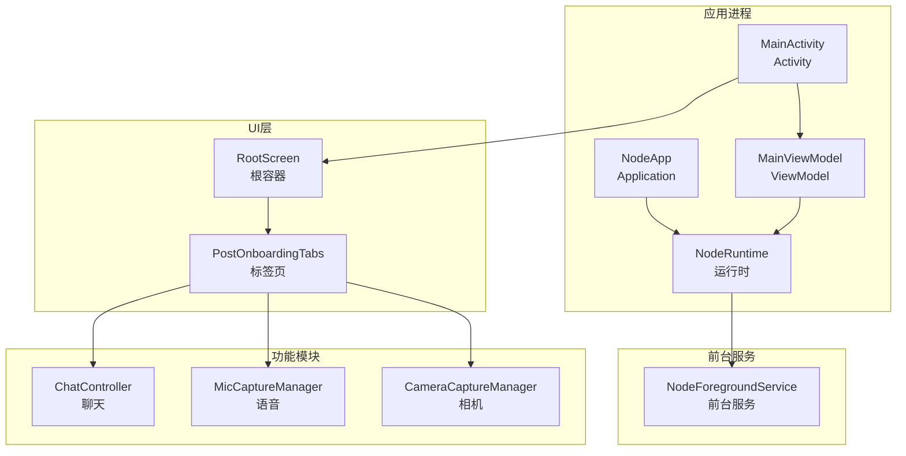
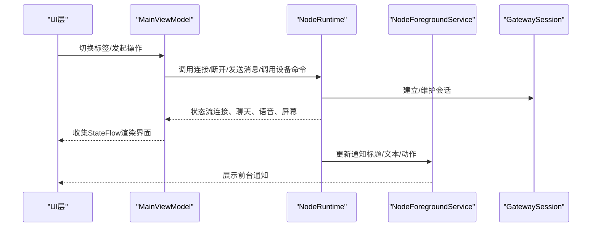
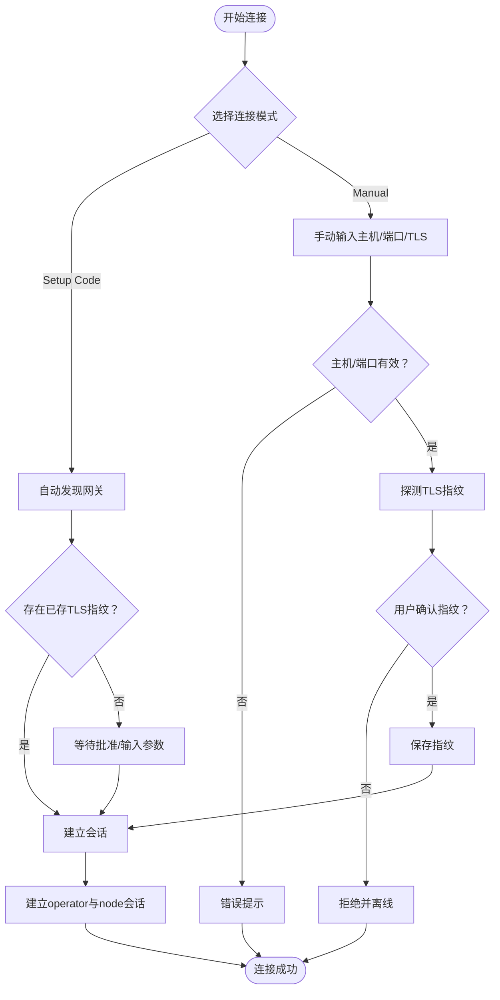
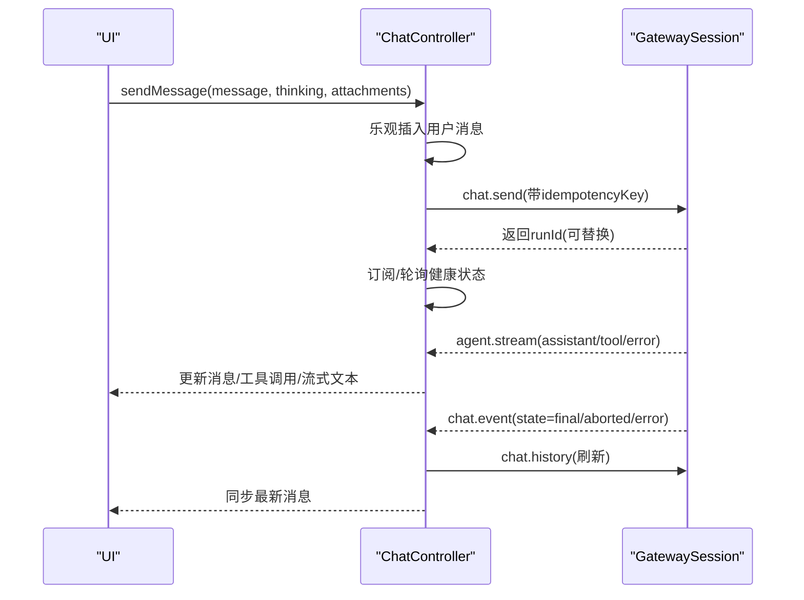
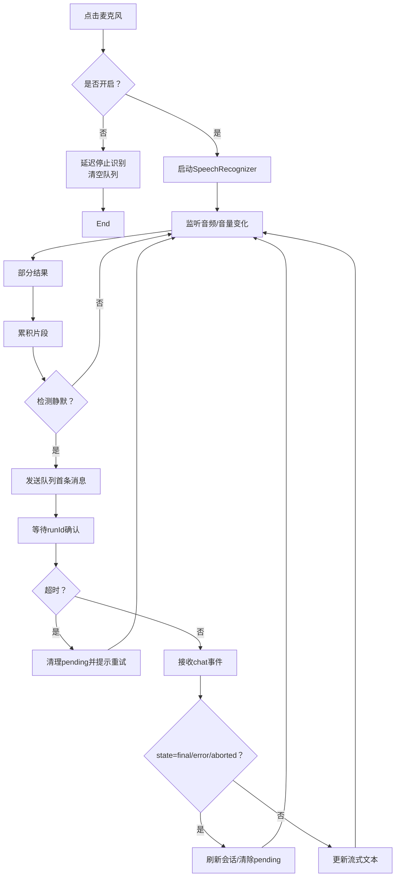
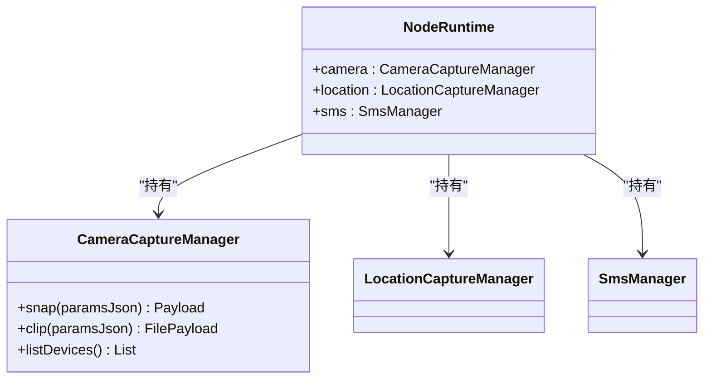
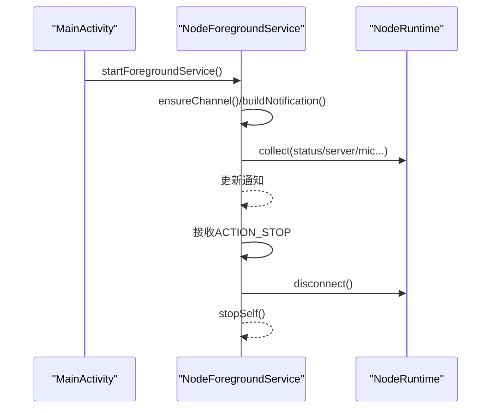
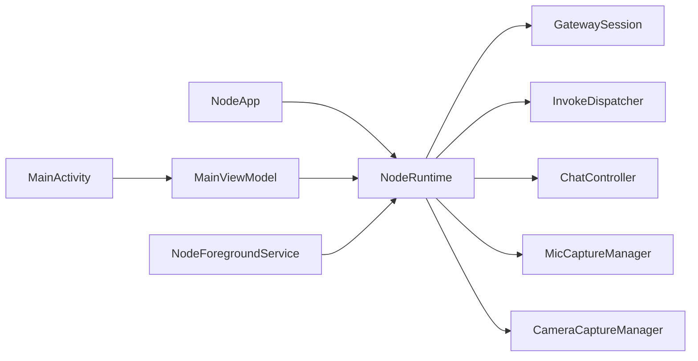

# Android节点应用

<cite>
**本文档引用的文件**
- [apps/android/README.md](file://apps/android/README.md)
- [apps/android/app/src/main/java/ai/openclaw/app/NodeApp.kt](file://apps/android/app/src/main/java/ai/openclaw/app/NodeApp.kt)
- [apps/android/app/src/main/java/ai/openclaw/app/MainActivity.kt](file://apps/android/app/src/main/java/ai/openclaw/app/MainActivity.kt)
- [apps/android/app/src/main/java/ai/openclaw/app/MainViewModel.kt](file://apps/android/app/src/main/java/ai/openclaw/app/MainViewModel.kt)
- [apps/android/app/src/main/java/ai/openclaw/app/NodeRuntime.kt](file://apps/android/app/src/main/java/ai/openclaw/app/NodeRuntime.kt)
- [apps/android/app/src/main/java/ai/openclaw/app/NodeForegroundService.kt](file://apps/android/app/src/main/java/ai/openclaw/app/NodeForegroundService.kt)
- [apps/android/app/src/main/AndroidManifest.xml](file://apps/android/app/src/main/AndroidManifest.xml)
- [apps/android/app/src/main/java/ai/openclaw/app/ui/RootScreen.kt](file://apps/android/app/src/main/java/ai/openclaw/app/ui/RootScreen.kt)
- [apps/android/app/src/main/java/ai/openclaw/app/ui/PostOnboardingTabs.kt](file://apps/android/app/src/main/java/ai/openclaw/app/ui/PostOnboardingTabs.kt)
- [apps/android/app/src/main/java/ai/openclaw/app/node/CameraCaptureManager.kt](file://apps/android/app/src/main/java/ai/openclaw/app/node/CameraCaptureManager.kt)
- [apps/android/app/src/main/java/ai/openclaw/app/voice/MicCaptureManager.kt](file://apps/android/app/src/main/java/ai/openclaw/app/voice/MicCaptureManager.kt)
- [apps/android/app/src/main/java/ai/openclaw/app/chat/ChatController.kt](file://apps/android/app/src/main/java/ai/openclaw/app/chat/ChatController.kt)
</cite>

## 目录
1. [简介](#简介)
2. [项目结构](#项目结构)
3. [核心组件](#核心组件)
4. [架构总览](#架构总览)
5. [详细组件分析](#详细组件分析)
6. [依赖关系分析](#依赖关系分析)
7. [性能考虑](#性能考虑)
8. [故障排除指南](#故障排除指南)
9. [结论](#结论)
10. [附录](#附录)

## 简介
本文件面向OpenClaw的Android节点应用，系统化阐述其功能特性与实现方式，覆盖连接标签、聊天界面、语音标签、设备命令与通知管理等。文档同时提供安装配置、权限申请、网络设置与数据备份机制说明，并深入解析Android特有实现（前台服务、后台限制处理、设备兼容性适配与本地资源管理）。最后给出使用指南、配置选项、故障排除与性能优化建议。

## 项目结构
Android节点应用位于apps/android目录，采用Kotlin + Jetpack Compose实现，核心入口为NodeApp、MainActivity与MainViewModel，运行时由NodeRuntime统一编排，通过NodeForegroundService维持前台连接状态并推送通知。应用清单声明了必要的权限与服务，UI层以标签页形式组织Connect、Chat、Voice、Screen、Settings五大模块。

图表来源
- [apps/android/app/src/main/java/ai/openclaw/app/NodeApp.kt](file://apps/android/app/src/main/java/ai/openclaw/app/NodeApp.kt#L1-L27)
- [apps/android/app/src/main/java/ai/openclaw/app/MainActivity.kt](file://apps/android/app/src/main/java/ai/openclaw/app/MainActivity.kt#L1-L64)
- [apps/android/app/src/main/java/ai/openclaw/app/MainViewModel.kt](file://apps/android/app/src/main/java/ai/openclaw/app/MainViewModel.kt#L1-L203)
- [apps/android/app/src/main/java/ai/openclaw/app/NodeRuntime.kt](file://apps/android/app/src/main/java/ai/openclaw/app/NodeRuntime.kt#L1-L923)
- [apps/android/app/src/main/java/ai/openclaw/app/NodeForegroundService.kt](file://apps/android/app/src/main/java/ai/openclaw/app/NodeForegroundService.kt#L1-L159)
- [apps/android/app/src/main/java/ai/openclaw/app/ui/RootScreen.kt](file://apps/android/app/src/main/java/ai/openclaw/app/ui/RootScreen.kt#L1-L21)
- [apps/android/app/src/main/java/ai/openclaw/app/ui/PostOnboardingTabs.kt](file://apps/android/app/src/main/java/ai/openclaw/app/ui/PostOnboardingTabs.kt#L1-L327)
- [apps/android/app/src/main/java/ai/openclaw/app/chat/ChatController.kt](file://apps/android/app/src/main/java/ai/openclaw/app/chat/ChatController.kt#L1-L538)
- [apps/android/app/src/main/java/ai/openclaw/app/voice/MicCaptureManager.kt](file://apps/android/app/src/main/java/ai/openclaw/app/voice/MicCaptureManager.kt#L1-L574)
- [apps/android/app/src/main/java/ai/openclaw/app/node/CameraCaptureManager.kt](file://apps/android/app/src/main/java/ai/openclaw/app/node/CameraCaptureManager.kt#L1-L420)

章节来源
- [apps/android/README.md](file://apps/android/README.md#L1-L229)
- [apps/android/app/src/main/AndroidManifest.xml](file://apps/android/app/src/main/AndroidManifest.xml#L1-L77)

## 核心组件
- NodeApp：应用入口，初始化NodeRuntime并启用严格模式（调试构建）。
- MainActivity：设置窗口与权限请求器，绑定生命周期，启动前台服务并在首帧后启动。
- MainViewModel：桥接NodeRuntime状态与UI，暴露连接、聊天、语音、屏幕等状态流与操作方法。
- NodeRuntime：核心运行时，负责网关发现与连接、会话管理、设备能力调用分发、Canvas A2UI交互、状态聚合与UI更新。
- NodeForegroundService：前台服务，持续显示连接状态通知，支持停止动作。
- UI层：RootScreen根据onboarding完成状态切换到标签页；PostOnboardingTabs定义五-tab布局与状态栏、底部导航。

章节来源
- [apps/android/app/src/main/java/ai/openclaw/app/NodeApp.kt](file://apps/android/app/src/main/java/ai/openclaw/app/NodeApp.kt#L1-L27)
- [apps/android/app/src/main/java/ai/openclaw/app/MainActivity.kt](file://apps/android/app/src/main/java/ai/openclaw/app/MainActivity.kt#L1-L64)
- [apps/android/app/src/main/java/ai/openclaw/app/MainViewModel.kt](file://apps/android/app/src/main/java/ai/openclaw/app/MainViewModel.kt#L1-L203)
- [apps/android/app/src/main/java/ai/openclaw/app/NodeRuntime.kt](file://apps/android/app/src/main/java/ai/openclaw/app/NodeRuntime.kt#L1-L923)
- [apps/android/app/src/main/java/ai/openclaw/app/NodeForegroundService.kt](file://apps/android/app/src/main/java/ai/openclaw/app/NodeForegroundService.kt#L1-L159)
- [apps/android/app/src/main/java/ai/openclaw/app/ui/RootScreen.kt](file://apps/android/app/src/main/java/ai/openclaw/app/ui/RootScreen.kt#L1-L21)
- [apps/android/app/src/main/java/ai/openclaw/app/ui/PostOnboardingTabs.kt](file://apps/android/app/src/main/java/ai/openclaw/app/ui/PostOnboardingTabs.kt#L1-L327)

## 架构总览
应用采用MVVM + 协程流的设计，NodeRuntime作为单一真相源，MainViewModel将状态流暴露给UI，NodeForegroundService基于运行时状态动态更新通知。NodeRuntime内部通过GatewaySession管理与网关的双向通信，InvokeDispatcher分发设备命令，ChatController与MicCaptureManager分别承载聊天与语音能力。

图表来源
- [apps/android/app/src/main/java/ai/openclaw/app/MainViewModel.kt](file://apps/android/app/src/main/java/ai/openclaw/app/MainViewModel.kt#L1-L203)
- [apps/android/app/src/main/java/ai/openclaw/app/NodeRuntime.kt](file://apps/android/app/src/main/java/ai/openclaw/app/NodeRuntime.kt#L1-L923)
- [apps/android/app/src/main/java/ai/openclaw/app/NodeForegroundService.kt](file://apps/android/app/src/main/java/ai/openclaw/app/NodeForegroundService.kt#L1-L159)

## 详细组件分析

### 连接标签（Connect）
- 功能要点
  - 支持“Setup Code”与“Manual”两种连接模式。
  - 自动发现可信网关（基于TLS指纹存储），首次连接需验证指纹并通过用户确认后保存。
  - 手动连接需开启TLS且提供主机、端口与TLS开关。
- 关键流程
  - 发现阶段：GatewayDiscovery收集可用网关列表，记录上次稳定ID。
  - 首次TLS：probeGatewayTlsFingerprint获取指纹，弹出信任提示，确认后保存并重连。
  - 运行时：NodeRuntime维护两个GatewaySession（operator与node），分别处理控制与节点事件。

图表来源
- [apps/android/app/src/main/java/ai/openclaw/app/NodeRuntime.kt](file://apps/android/app/src/main/java/ai/openclaw/app/NodeRuntime.kt#L524-L761)

章节来源
- [apps/android/app/src/main/java/ai/openclaw/app/NodeRuntime.kt](file://apps/android/app/src/main/java/ai/openclaw/app/NodeRuntime.kt#L524-L761)

### 聊天界面（Chat）
- 功能要点
  - 支持多会话加载与切换，历史消息拉取，思考级别（off/low/medium/high）。
  - 流式助手回复展示，工具调用进度跟踪，超时与中断处理。
  - 附件上传（类型、MIME、文件名、Base64内容）。
- 关键流程
  - 初始化：bootstrap触发订阅或历史拉取，健康检查轮询。
  - 发送：构造参数（sessionKey/message/thinking/timeout/idempotencyKey/附件），乐观插入用户消息，启动pendingRun计时。
  - 事件：chat/与agent/事件驱动消息与工具调用状态变更，最终刷新历史。

图表来源
- [apps/android/app/src/main/java/ai/openclaw/app/chat/ChatController.kt](file://apps/android/app/src/main/java/ai/openclaw/app/chat/ChatController.kt#L112-L349)

章节来源
- [apps/android/app/src/main/java/ai/openclaw/app/chat/ChatController.kt](file://apps/android/app/src/main/java/ai/openclaw/app/chat/ChatController.kt#L1-L538)

### 语音标签（Voice）
- 功能要点
  - 基于Android SpeechRecognizer的离线/在线识别，支持部分结果与实时音量指示。
  - 语音转文字后进入消息队列，按网关可用性排队发送，支持超时与重试。
  - 与TalkModeManager配合，实现TTS播放与“全量响应TTS”策略。
- 关键流程
  - 开启：校验权限与可用性，启动识别监听；设置状态与输入音量。
  - 录制：累积片段，静默间隔触发发送；发送前注入idempotencyKey并记录pendingRunId。
  - 回应：接收chat事件（delta/final/error/aborted），更新会话与流式文本，必要时播放TTS。

图表来源
- [apps/android/app/src/main/java/ai/openclaw/app/voice/MicCaptureManager.kt](file://apps/android/app/src/main/java/ai/openclaw/app/voice/MicCaptureManager.kt#L102-L376)
- [apps/android/app/src/main/java/ai/openclaw/app/NodeRuntime.kt](file://apps/android/app/src/main/java/ai/openclaw/app/NodeRuntime.kt#L325-L353)

章节来源
- [apps/android/app/src/main/java/ai/openclaw/app/voice/MicCaptureManager.kt](file://apps/android/app/src/main/java/ai/openclaw/app/voice/MicCaptureManager.kt#L1-L574)
- [apps/android/app/src/main/java/ai/openclaw/app/NodeRuntime.kt](file://apps/android/app/src/main/java/ai/openclaw/app/NodeRuntime.kt#L325-L353)

### 设备命令（相机/位置/短信/通知等）
- 相机（CameraCaptureManager）
  - 支持JPEG抓拍与视频录制（含可选音频），自动EXIF旋转与尺寸压缩，限制单次载荷大小。
  - 参数：facing/deviceId/quality/maxWidth/durationMs/includeAudio。
- 位置（LocationCaptureManager）
  - 通过LocationHandler与LocationMode协作，按精确度与前台状态决定上报策略。
- 短信（SmsManager/SmsHandler）
  - 通过系统SMS能力发送，受权限与设备能力约束。
- 通知（DeviceNotificationListenerService）
  - 作为通知监听服务接入，向网关转发通知事件。

图表来源
- [apps/android/app/src/main/java/ai/openclaw/app/node/CameraCaptureManager.kt](file://apps/android/app/src/main/java/ai/openclaw/app/node/CameraCaptureManager.kt#L1-L420)
- [apps/android/app/src/main/java/ai/openclaw/app/NodeRuntime.kt](file://apps/android/app/src/main/java/ai/openclaw/app/NodeRuntime.kt#L44-L136)

章节来源
- [apps/android/app/src/main/java/ai/openclaw/app/node/CameraCaptureManager.kt](file://apps/android/app/src/main/java/ai/openclaw/app/node/CameraCaptureManager.kt#L1-L420)
- [apps/android/app/src/main/java/ai/openclaw/app/NodeRuntime.kt](file://apps/android/app/src/main/java/ai/openclaw/app/NodeRuntime.kt#L44-L136)

### 通知管理（前台服务）
- 功能要点
  - 启动前台服务，创建低重要性通知通道，显示连接状态与服务器信息。
  - 动态更新通知标题/文本，包含“正在监听/等待”等状态后缀。
  - 提供“断开连接”动作，触发NodeRuntime断开并停止服务。
- 生命周期
  - onCreate：初始通知，订阅运行时状态流，合并状态生成通知并更新。
  - onStartCommand：接收ACTION_STOP，调用NodeRuntime.disconnect()并stopSelf()。
  - onDestroy：取消协程作业，释放资源。

图表来源
- [apps/android/app/src/main/java/ai/openclaw/app/NodeForegroundService.kt](file://apps/android/app/src/main/java/ai/openclaw/app/NodeForegroundService.kt#L25-L75)
- [apps/android/app/src/main/java/ai/openclaw/app/NodeRuntime.kt](file://apps/android/app/src/main/java/ai/openclaw/app/NodeRuntime.kt#L692-L707)

章节来源
- [apps/android/app/src/main/java/ai/openclaw/app/NodeForegroundService.kt](file://apps/android/app/src/main/java/ai/openclaw/app/NodeForegroundService.kt#L1-L159)
- [apps/android/app/src/main/java/ai/openclaw/app/NodeRuntime.kt](file://apps/android/app/src/main/java/ai/openclaw/app/NodeRuntime.kt#L692-L707)

## 依赖关系分析
- 组件耦合
  - NodeApp仅持有NodeRuntime引用，避免全局状态散落。
  - MainActivity通过MainViewModel间接依赖NodeRuntime，UI与业务解耦。
  - NodeRuntime聚合多个Handler与Session，形成高内聚低耦合的运行时。
- 外部依赖
  - Android框架：权限、通知、前台服务、SpeechRecognizer、CameraX。
  - 网关协议：WebSocket会话、事件流、invoke调用、TLS指纹校验。
- 潜在风险
  - 前台服务类型与通知权限在不同Android版本差异较大，需在清单与运行时中统一处理。
  - 语音识别依赖系统服务，权限缺失或语言不支持时需降级处理。

图表来源
- [apps/android/app/src/main/java/ai/openclaw/app/NodeApp.kt](file://apps/android/app/src/main/java/ai/openclaw/app/NodeApp.kt#L1-L27)
- [apps/android/app/src/main/java/ai/openclaw/app/NodeRuntime.kt](file://apps/android/app/src/main/java/ai/openclaw/app/NodeRuntime.kt#L1-L923)
- [apps/android/app/src/main/java/ai/openclaw/app/NodeForegroundService.kt](file://apps/android/app/src/main/java/ai/openclaw/app/NodeForegroundService.kt#L1-L159)

章节来源
- [apps/android/app/src/main/java/ai/openclaw/app/NodeApp.kt](file://apps/android/app/src/main/java/ai/openclaw/app/NodeApp.kt#L1-L27)
- [apps/android/app/src/main/java/ai/openclaw/app/NodeRuntime.kt](file://apps/android/app/src/main/java/ai/openclaw/app/NodeRuntime.kt#L1-L923)
- [apps/android/app/src/main/java/ai/openclaw/app/NodeForegroundService.kt](file://apps/android/app/src/main/java/ai/openclaw/app/NodeForegroundService.kt#L1-L159)

## 性能考虑
- 启动路径优化
  - MainActivity在首帧后才启动前台服务，减少冷启动阻塞。
  - NodeRuntime在初始化阶段仅订阅必要状态，避免过早计算。
- I/O与序列化
  - 相机JPEG压缩采用二分策略，限制载荷大小，避免超限。
  - JSON解析忽略未知字段，增强健壮性。
- 协程与背压
  - 语音识别与聊天均采用队列与超时机制，防止积压与内存膨胀。
  - pendingRunTimeout统一管理未完成任务，避免泄漏。
- UI渲染
  - 使用StateFlow与collectAsState，避免不必要的重组。
  - 底部导航在软键盘弹出时隐藏，提升输入体验。

## 故障排除指南
- 权限相关
  - 无麦克风/相机/定位权限：MicCaptureManager/CameraCaptureManager会在运行时请求，失败则禁用对应功能。
  - 通知监听：确保系统设置中已授权通知监听服务。
- 连接问题
  - 首次TLS指纹未确认：在信任提示中核对指纹后保存再连接。
  - 手动连接失败：检查主机/端口/TLS配置与可达性。
  - 断线重连：NodeRuntime自动维护两个会话，保持连接稳定。
- 语音问题
  - 识别不可用：检查系统语音识别服务与语言包。
  - 超时：超过pendingRunTimeoutMs后自动清理并提示重试。
- 聊天问题
  - 健康检查失败：UI显示“Gateway health not OK”，待恢复后重试。
  - 事件流中断：提示“Event stream interrupted”，建议刷新页面。
- 屏幕/Canvas问题
  - A2UI不可达：在Screen标签页点击“恢复”按钮，或保持应用前台并确保Canvas可达。

章节来源
- [apps/android/app/src/main/java/ai/openclaw/app/voice/MicCaptureManager.kt](file://apps/android/app/src/main/java/ai/openclaw/app/voice/MicCaptureManager.kt#L448-L566)
- [apps/android/app/src/main/java/ai/openclaw/app/chat/ChatController.kt](file://apps/android/app/src/main/java/ai/openclaw/app/chat/ChatController.kt#L228-L349)
- [apps/android/app/src/main/java/ai/openclaw/app/NodeRuntime.kt](file://apps/android/app/src/main/java/ai/openclaw/app/NodeRuntime.kt#L442-L491)

## 结论
Android节点应用以NodeRuntime为核心，结合前台服务与Jetpack Compose UI，实现了从连接、聊天、语音到设备命令的完整闭环。通过严格的权限管理、TLS指纹信任机制与状态流驱动的UI设计，应用在保证安全性的同时提供了良好的用户体验。后续可在端到端测试覆盖、Canvas自动重载策略与后台限制适配上进一步完善。

## 附录

### 安装与配置
- 构建与运行
  - 在apps/android目录执行assembleDebug/installDebug/testDebugUnitTest。
  - 使用adb reverse建立USB隧道进行无局域网测试。
- 快速迭代
  - Live Edit与Apply Changes支持物理设备热更新。
- 性能基准
  - 使用macrobenchmark与脚本进行冷启动与热点分析。

章节来源
- [apps/android/README.md](file://apps/android/README.md#L26-L141)
- [apps/android/README.md](file://apps/android/README.md#L112-L141)

### 权限申请与网络设置
- 权限清单
  - INTERNET/ACCESS_NETWORK_STATE/FOREGROUND_SERVICE/POST_NOTIFICATIONS/NEARBY_WIFI_DEVICES/ACCESS_FINE_LOCATION/ACCESS_COARSE_LOCATION/CAMERA/RECORD_AUDIO/SEND_SMS/READ_MEDIA_*等。
- 网络安全
  - 使用networkSecurityConfig与TLS指纹pinning，保障传输安全。
- 数据备份
  - 允许备份与数据提取规则，确保用户可迁移。

章节来源
- [apps/android/app/src/main/AndroidManifest.xml](file://apps/android/app/src/main/AndroidManifest.xml#L1-L77)

### Android特有实现
- 前台服务
  - FOREGROUND_SERVICE_TYPE_DATA_SYNC，即时前台行为，避免被系统回收。
- 后台限制处理
  - 通过前台服务与状态流驱动，降低被系统限制影响。
- 设备兼容性适配
  - CameraX与SpeechRecognizer按API级别降级，权限按Android版本差异化处理。
- 本地资源管理
  - FileProvider与媒体读取权限分离，兼容不同Android版本。

章节来源
- [apps/android/app/src/main/java/ai/openclaw/app/NodeForegroundService.kt](file://apps/android/app/src/main/java/ai/openclaw/app/NodeForegroundService.kt#L131-L138)
- [apps/android/app/src/main/AndroidManifest.xml](file://apps/android/app/src/main/AndroidManifest.xml#L1-L77)