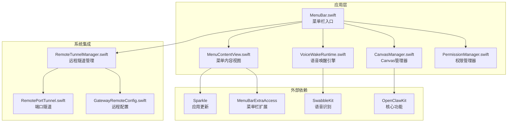
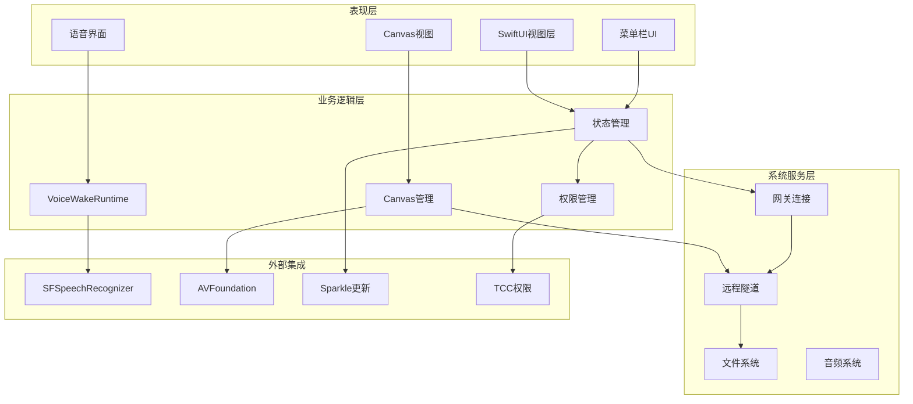
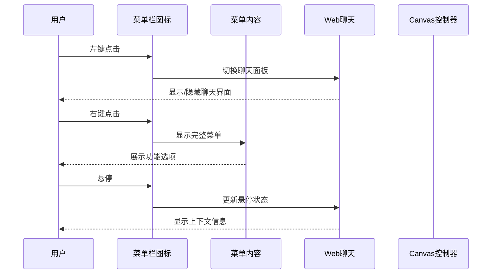
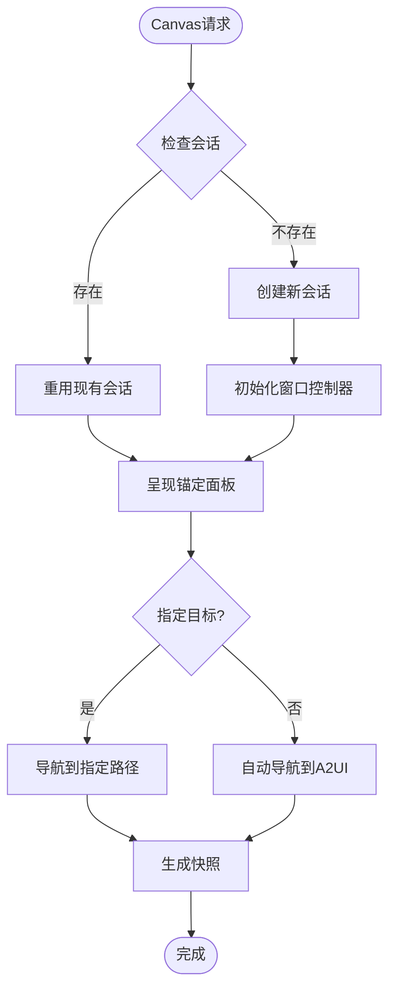
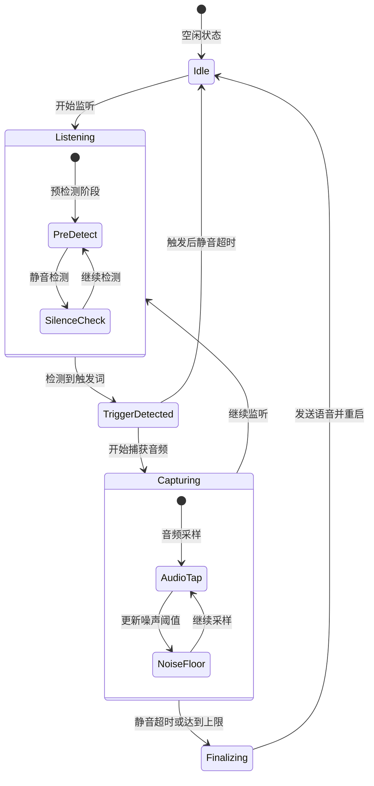
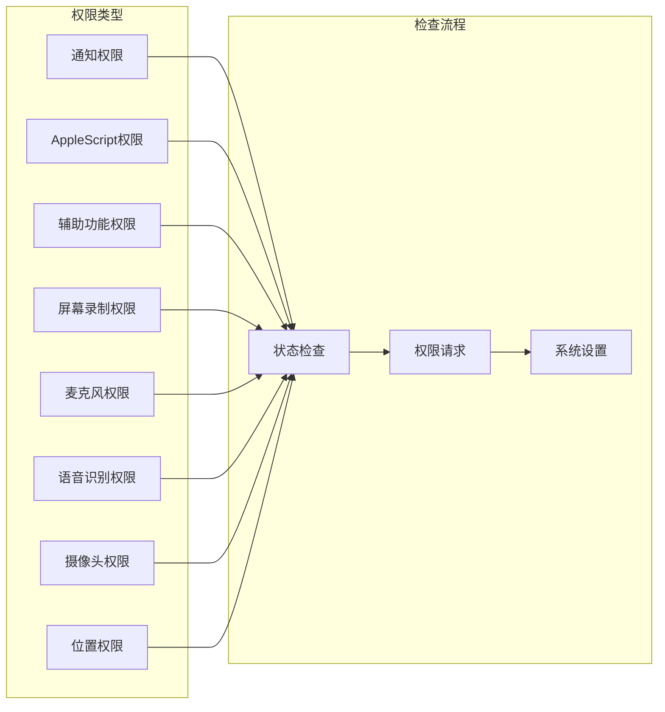
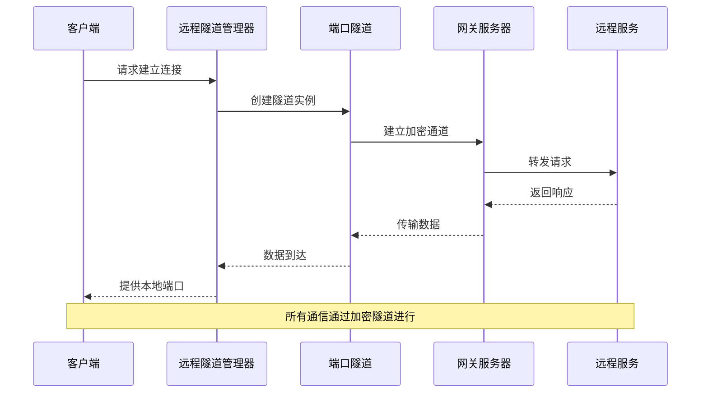
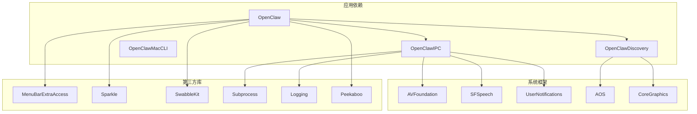

# macOS菜单栏应用

<cite>
**本文档引用的文件**
- [apps/macos/README.md](file://apps/macos/README.md)
- [apps/macos/Package.swift](file://apps/macos/Package.swift)
- [apps/macos/Sources/OpenClaw/MenuBar.swift](file://apps/macos/Sources/OpenClaw/MenuBar.swift)
- [apps/macos/Sources/OpenClaw/MenuContentView.swift](file://apps/macos/Sources/OpenClaw/MenuContentView.swift)
- [apps/macos/Sources/OpenClaw/CanvasManager.swift](file://apps/macos/Sources/OpenClaw/CanvasManager.swift)
- [apps/macos/Sources/OpenClaw/VoiceWakeRuntime.swift](file://apps/macos/Sources/OpenClaw/VoiceWakeRuntime.swift)
- [apps/macos/Sources/OpenClaw/PermissionManager.swift](file://apps/macos/Sources/OpenClaw/PermissionManager.swift)
- [apps/macos/Sources/OpenClaw/RemoteTunnelManager.swift](file://apps/macos/Sources/OpenClaw/RemoteTunnelManager.swift)
- [apps/macos/Sources/OpenClaw/RemotePortTunnel.swift](file://apps/macos/Sources/OpenClaw/RemotePortTunnel.swift)
- [apps/macos/Sources/OpenClaw/GatewayRemoteConfig.swift](file://apps/macos/Sources/OpenClaw/GatewayRemoteConfig.swift)
</cite>

## 目录
1. [简介](#简介)
2. [项目结构](#项目结构)
3. [核心组件](#核心组件)
4. [架构概览](#架构概览)
5. [详细组件分析](#详细组件分析)
6. [依赖关系分析](#依赖关系分析)
7. [性能考虑](#性能考虑)
8. [故障排除指南](#故障排除指南)
9. [结论](#结论)

## 简介

OpenClaw macOS菜单栏应用是一个功能丰富的系统级工具，专为macOS平台设计，提供语音唤醒、推断模式覆盖、Canvas集成和系统托盘控制等功能。该应用采用SwiftUI构建，集成了多种现代macOS特性，包括菜单栏集成、系统权限管理、后台运行支持和自动更新机制。

应用的核心目标是为用户提供无缝的AI助手体验，通过菜单栏快速访问各种功能，同时保持系统的轻量级和响应性。支持本地和远程两种连接模式，允许用户根据需求选择最适合的工作方式。

## 项目结构

OpenClaw macOS应用采用模块化架构，主要包含以下核心模块：

**图表来源**
- [apps/macos/Package.swift](file://apps/macos/Package.swift#L17-L57)
- [apps/macos/Sources/OpenClaw/MenuBar.swift](file://apps/macos/Sources/OpenClaw/MenuBar.swift#L1-L50)

**章节来源**
- [apps/macos/Package.swift](file://apps/macos/Package.swift#L1-L93)
- [apps/macos/README.md](file://apps/macos/README.md#L1-L65)

## 核心组件

### 菜单栏应用主体

OpenClaw应用的核心是基于SwiftUI的菜单栏扩展，提供了直观的系统集成界面。应用采用响应式设计，能够根据状态动态调整界面元素。

关键特性包括：
- 实时状态指示器显示连接状态和工作负载
- 智能权限管理集成
- 支持左键点击和右键菜单的不同交互模式
- 自动悬停HUD抑制机制

### Canvas集成系统

Canvas系统是OpenClaw的核心功能模块，提供了一个完整的Web内容展示和交互环境。系统支持多种内容类型，包括静态页面、动态应用和实时数据可视化。

主要功能：
- 多会话管理支持
- 自动锚定到菜单栏位置
- 支持HTTP、HTTPS和本地文件系统
- 内置调试状态显示

### 语音唤醒引擎

语音唤醒系统提供了先进的语音识别和处理能力，支持自定义触发词和多种音频输入设备。系统采用智能噪声抑制和VAD（Voice Activity Detection）算法。

核心功能：
- 多触发词支持
- 实时音频流处理
- 自适应噪声抑制
- 触发后降噪处理

**章节来源**
- [apps/macos/Sources/OpenClaw/MenuBar.swift](file://apps/macos/Sources/OpenClaw/MenuBar.swift#L10-L207)
- [apps/macos/Sources/OpenClaw/MenuContentView.swift](file://apps/macos/Sources/OpenClaw/MenuContentView.swift#L1-L187)
- [apps/macos/Sources/OpenClaw/CanvasManager.swift](file://apps/macos/Sources/OpenClaw/CanvasManager.swift#L1-L114)

## 架构概览

OpenClaw应用采用了分层架构设计，确保了良好的可维护性和扩展性：

**图表来源**
- [apps/macos/Sources/OpenClaw/MenuBar.swift](file://apps/macos/Sources/OpenClaw/MenuBar.swift#L11-L92)
- [apps/macos/Sources/OpenClaw/VoiceWakeRuntime.swift](file://apps/macos/Sources/OpenClaw/VoiceWakeRuntime.swift#L11-L50)

## 详细组件分析

### 菜单栏交互系统

菜单栏应用实现了复杂的用户交互模式，支持多种鼠标事件和键盘快捷键：

**图表来源**
- [apps/macos/Sources/OpenClaw/MenuBar.swift](file://apps/macos/Sources/OpenClaw/MenuBar.swift#L134-L192)

菜单栏系统的关键特性：
- 状态按钮高亮显示当前工作状态
- 悬停时自动抑制系统HUD显示
- 支持透明点击处理
- 动态外观调整以反映暂停状态

### Canvas管理系统

Canvas系统提供了强大的Web内容展示能力，支持多种部署模式：

**图表来源**
- [apps/macos/Sources/OpenClaw/CanvasManager.swift](file://apps/macos/Sources/OpenClaw/CanvasManager.swift#L32-L114)

Canvas管理器的核心功能：
- 会话生命周期管理
- 自动锚定到菜单栏位置
- 支持HTTP、HTTPS和本地文件
- 内置调试状态监控

### 语音唤醒引擎

语音唤醒系统采用了先进的音频处理技术，提供了精确的触发检测和降噪能力：

**图表来源**
- [apps/macos/Sources/OpenClaw/VoiceWakeRuntime.swift](file://apps/macos/Sources/OpenClaw/VoiceWakeRuntime.swift#L14-L777)

语音唤醒引擎的技术特点：
- 自适应噪声抑制算法
- 多触发词匹配支持
- 实时音频流处理
- 智能静音检测
- 触发后降噪处理

### 权限管理系统

权限管理系统确保了应用在各种敏感功能上的合规使用：

**图表来源**
- [apps/macos/Sources/OpenClaw/PermissionManager.swift](file://apps/macos/Sources/OpenClaw/PermissionManager.swift#L12-L228)

权限管理的关键特性：
- 异步权限检查机制
- 交互式权限请求
- 系统设置快速跳转
- 权限状态持续监控
- 自动权限修复建议

### 远程访问系统

远程访问系统提供了安全的远程连接能力，支持多种隧道协议：

**图表来源**
- [apps/macos/Sources/OpenClaw/RemoteTunnelManager.swift](file://apps/macos/Sources/OpenClaw/RemoteTunnelManager.swift)
- [apps/macos/Sources/OpenClaw/RemotePortTunnel.swift](file://apps/macos/Sources/OpenClaw/RemotePortTunnel.swift)
- [apps/macos/Sources/OpenClaw/GatewayRemoteConfig.swift](file://apps/macos/Sources/OpenClaw/GatewayRemoteConfig.swift)

远程访问系统的核心功能：
- 自动隧道建立和维护
- 加密数据传输
- 多隧道并发管理
- 故障自动恢复
- 端口映射管理

**章节来源**
- [apps/macos/Sources/OpenClaw/MenuBar.swift](file://apps/macos/Sources/OpenClaw/MenuBar.swift#L134-L192)
- [apps/macos/Sources/OpenClaw/CanvasManager.swift](file://apps/macos/Sources/OpenClaw/CanvasManager.swift#L142-L172)
- [apps/macos/Sources/OpenClaw/VoiceWakeRuntime.swift](file://apps/macos/Sources/OpenClaw/VoiceWakeRuntime.swift#L278-L382)
- [apps/macos/Sources/OpenClaw/PermissionManager.swift](file://apps/macos/Sources/OpenClaw/PermissionManager.swift#L25-L52)

## 依赖关系分析

OpenClaw应用的依赖关系体现了现代化的软件架构原则：

**图表来源**
- [apps/macos/Package.swift](file://apps/macos/Package.swift#L17-L57)

依赖管理策略：
- 明确的模块边界划分
- 最小化外部依赖
- 系统框架的直接使用
- 第三方库的版本锁定

**章节来源**
- [apps/macos/Package.swift](file://apps/macos/Package.swift#L17-L57)

## 性能考虑

OpenClaw应用在性能优化方面采用了多项策略：

### 内存管理
- 懒加载音频引擎以避免不必要的资源占用
- 智能缓存机制减少重复初始化
- 及时释放不再使用的资源

### 线程安全
- 使用Actor模型保护共享状态
- 主线程专用UI更新
- 异步任务管理避免阻塞

### 资源优化
- 条件加载非必要功能
- 自适应采样率调整
- 智能重启机制避免频繁重启

## 故障排除指南

### 常见问题诊断

**菜单栏图标不显示**
- 检查应用是否正确安装到应用程序文件夹
- 验证系统偏好设置中的权限
- 重启Dock进程

**语音唤醒无响应**
- 确认麦克风权限已授予
- 检查语音识别权限状态
- 测试不同音频输入设备

**Canvas页面无法加载**
- 验证网络连接状态
- 检查防火墙设置
- 清除Canvas缓存

**远程连接失败**
- 检查网关服务器状态
- 验证隧道配置
- 查看防火墙端口设置

### 调试工具

应用内置了完整的调试功能：
- 详细的日志输出系统
- 实时状态监控面板
- 性能指标收集
- 错误报告生成

**章节来源**
- [apps/macos/Sources/OpenClaw/MenuContentView.swift](file://apps/macos/Sources/OpenClaw/MenuContentView.swift#L229-L329)

## 结论

OpenClaw macOS菜单栏应用展现了现代桌面应用开发的最佳实践。通过精心设计的架构、完善的权限管理和强大的功能集成，该应用为用户提供了无缝的AI助手体验。

应用的主要优势包括：
- 深度系统集成和用户体验优化
- 先进的语音处理技术和实时响应能力
- 灵活的Canvas系统支持多样化内容展示
- 完善的安全机制和权限管理
- 良好的性能表现和资源管理

未来的发展方向可能包括更多AI功能集成、增强的多语言支持和进一步的性能优化。该应用为macOS平台上的AI应用开发提供了优秀的参考范例。