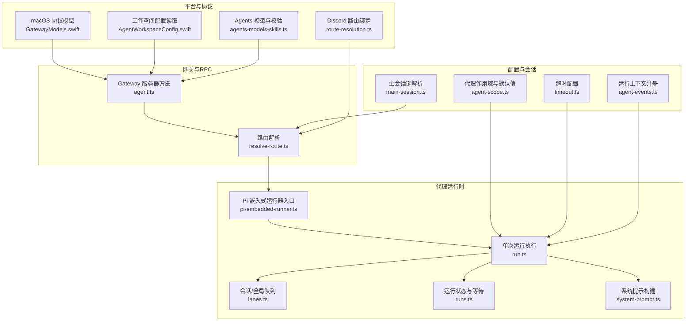
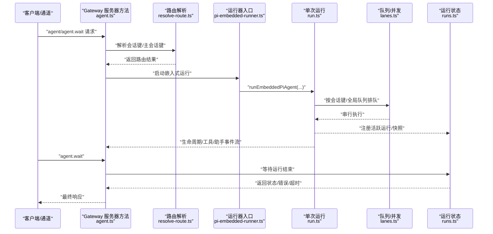
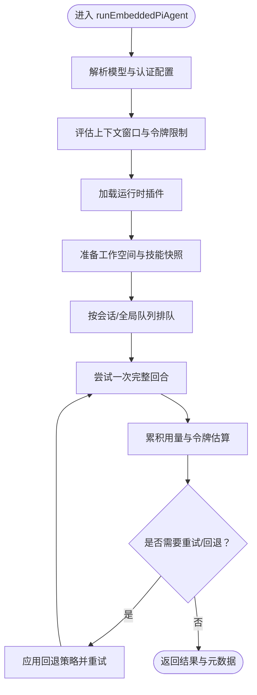
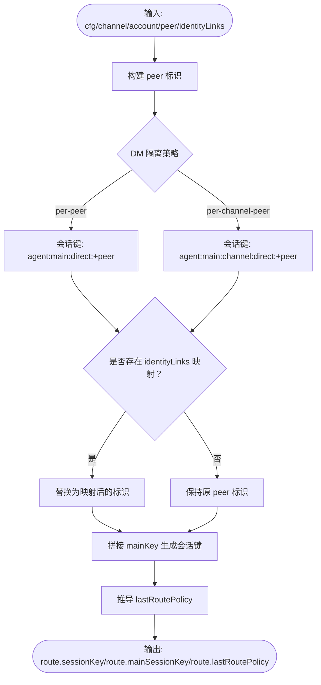
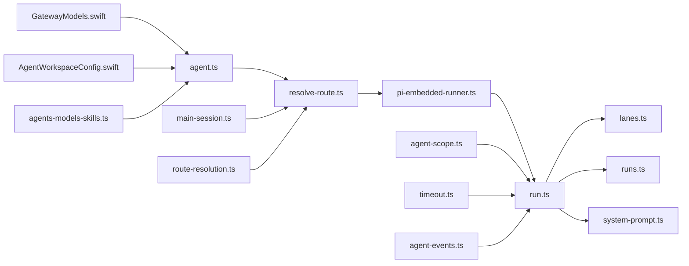

# 代理系统

<cite>
**本文引用的文件**
- [agent-loop.md](file://docs/concepts/agent-loop.md)
- [agent-workspace.md](file://docs/concepts/agent-workspace.md)
- [agent.md](file://docs/concepts/agent.md)
- [pi-embedded-runner.ts](file://src/agents/pi-embedded-runner.ts)
- [run.ts](file://src/agents/pi-embedded-runner/run.ts)
- [lanes.ts](file://src/agents/pi-embedded-runner/lanes.ts)
- [runs.ts](file://src/agents/pi-embedded-runner/runs.ts)
- [system-prompt.ts](file://src/agents/pi-embedded-runner/system-prompt.ts)
- [agent.ts](file://src/gateway/server-methods/agent.ts)
- [resolve-route.ts](file://src/routing/resolve-route.ts)
- [resolve-route.test.ts](file://src/routing/resolve-route.test.ts)
- [main-session.ts](file://src/config/sessions/main-session.ts)
- [agent-scope.ts](file://src/agents/agent-scope.ts)
- [timeout.ts](file://src/agents/timeout.ts)
- [agent-events.ts](file://src/infra/agent-events.ts)
- [GatewayModels.swift](file://apps/macos/Sources/OpenClawProtocol/GatewayModels.swift)
- [AgentWorkspaceConfig.swift](file://apps/macos/Sources/OpenClaw/AgentWorkspaceConfig.swift)
- [agents-models-skills.ts](file://src/gateway/protocol/schema/agents-models-skills.ts)
- [route-resolution.ts](file://extensions/discord/src/monitor/route-resolution.ts)
</cite>

## 目录
1. [简介](#简介)
2. [项目结构](#项目结构)
3. [核心组件](#核心组件)
4. [架构总览](#架构总览)
5. [详细组件分析](#详细组件分析)
6. [依赖关系分析](#依赖关系分析)
7. [性能考量](#性能考量)
8. [故障排查指南](#故障排查指南)
9. [结论](#结论)
10. [附录](#附录)

## 简介
本文件面向 OpenClaw 代理系统的开发者与运维人员，系统性阐述 Pi Agent 运行时的工作原理与工程实现，覆盖以下主题：
- 代理循环（Agent Loop）的执行机制与生命周期事件
- 代理工作空间（Agent Workspace）的组织结构与备份策略
- 代理生命周期管理、消息处理、工具调用与上下文状态管理
- 多代理路由、会话隔离、代理间通信与队列并发控制
- 配置项、性能优化策略与调试技巧
- 具体代码示例路径，帮助快速定位实现与扩展点

## 项目结构
OpenClaw 将“Pi Agent 运行时”作为核心嵌入式能力，围绕其构建了网关、路由、会话、插件与协议层。下图给出与代理系统相关的关键模块关系。

**图表来源**
- [agent.ts:254-269](file://src/gateway/server-methods/agent.ts#L254-L269)
- [resolve-route.ts:658-692](file://src/routing/resolve-route.ts#L658-L692)
- [pi-embedded-runner.ts:1-29](file://src/agents/pi-embedded-runner.ts#L1-L29)
- [run.ts:265-385](file://src/agents/pi-embedded-runner/run.ts#L265-L385)
- [lanes.ts:1-20](file://src/agents/pi-embedded-runner/lanes.ts#L1-L20)
- [runs.ts:1-120](file://src/agents/pi-embedded-runner/runs.ts#L1-L120)
- [system-prompt.ts:11-87](file://src/agents/pi-embedded-runner/system-prompt.ts#L11-L87)
- [main-session.ts:1-38](file://src/config/sessions/main-session.ts#L1-L38)
- [agent-scope.ts:44-84](file://src/agents/agent-scope.ts#L44-L84)
- [timeout.ts:1-48](file://src/agents/timeout.ts#L1-L48)
- [agent-events.ts:27-60](file://src/infra/agent-events.ts#L27-L60)
- [GatewayModels.swift:2009-2361](file://apps/macos/Sources/OpenClawProtocol/GatewayModels.swift#L2009-L2361)
- [AgentWorkspaceConfig.swift:1-30](file://apps/macos/Sources/OpenClaw/AgentWorkspaceConfig.swift#L1-L30)
- [agents-models-skills.ts:47-165](file://src/gateway/protocol/schema/agents-models-skills.ts#L47-L165)
- [route-resolution.ts:80-100](file://extensions/discord/src/monitor/route-resolution.ts#L80-L100)

**章节来源**
- [agent-loop.md:1-149](file://docs/concepts/agent-loop.md#L1-L149)
- [agent-workspace.md:1-237](file://docs/concepts/agent-workspace.md#L1-L237)
- [agent.md:1-124](file://docs/concepts/agent.md#L1-L124)

## 核心组件
- 代理运行时入口：导出运行、队列、沙箱、系统提示、历史限制、工具拆分等能力，统一对外暴露。
- 单次运行执行：负责模型解析、认证、上下文窗口评估、重试回退、用量统计、错误归因与元数据组装。
- 队列与并发：按会话键串行化运行，支持全局队列与嵌套队列，避免竞态与历史不一致。
- 运行状态与等待：维护活跃运行、快照、等待者集合，提供查询、中止、等待结束等能力。
- 系统提示构建：聚合技能、引导文件、时间/能力信息、工具摘要等，形成最终系统提示。
- 路由与会话：根据通道、账号、身份映射生成会话键与主会话键，支持 DM 隔离与最后路由策略。
- 配置与默认：主会话键解析、代理作用域、超时、运行上下文注册等。

**章节来源**
- [pi-embedded-runner.ts:1-29](file://src/agents/pi-embedded-runner.ts#L1-L29)
- [run.ts:265-385](file://src/agents/pi-embedded-runner/run.ts#L265-L385)
- [lanes.ts:1-20](file://src/agents/pi-embedded-runner/lanes.ts#L1-L20)
- [runs.ts:1-120](file://src/agents/pi-embedded-runner/runs.ts#L1-L120)
- [system-prompt.ts:11-87](file://src/agents/pi-embedded-runner/system-prompt.ts#L11-L87)
- [resolve-route.ts:658-692](file://src/routing/resolve-route.ts#L658-L692)
- [main-session.ts:1-38](file://src/config/sessions/main-session.ts#L1-L38)
- [agent-scope.ts:44-84](file://src/agents/agent-scope.ts#L44-L84)
- [timeout.ts:1-48](file://src/agents/timeout.ts#L1-L48)
- [agent-events.ts:27-60](file://src/infra/agent-events.ts#L27-L60)

## 架构总览
下图展示从网关到运行时的端到端流程，以及关键事件流。

**图表来源**
- [agent.ts:254-269](file://src/gateway/server-methods/agent.ts#L254-L269)
- [resolve-route.ts:658-692](file://src/routing/resolve-route.ts#L658-L692)
- [pi-embedded-runner.ts:1-29](file://src/agents/pi-embedded-runner.ts#L1-L29)
- [run.ts:265-385](file://src/agents/pi-embedded-runner/run.ts#L265-L385)
- [lanes.ts:1-20](file://src/agents/pi-embedded-runner/lanes.ts#L1-L20)
- [runs.ts:182-214](file://src/agents/pi-embedded-runner/runs.ts#L182-L214)

## 详细组件分析

### 代理循环（Agent Loop）
- 生命周期与事件流
  - 网关 RPC 的 agent 与 agent.wait 提供入口；agent 返回 runId 后立即返回，随后在运行时持续发出生命周期、工具与助手事件流。
  - agent.wait 仅等待生命周期结束或错误，不中断正在运行的代理。
- 队列与并发
  - 每个会话键拥有独立“会话车道”，可选通过全局车道串行化；消息通道可选择收集/引导/跟进模式，影响车道系统。
- 会话与工作空间准备
  - 解析并创建工作空间；加载技能快照；注入引导/上下文文件；获取会话写锁后打开会话管理器。
- 提示组装与系统提示
  - 组合基础提示、技能提示、引导上下文与运行时覆盖，确保模型可见内容与令牌限制。
- 插件钩子与内部钩子
  - 支持 before_model_resolve、before_prompt_build、before_agent_start、agent_end、before_tool_call/after_tool_call、tool_result_persist、message_*、session_*、gateway_* 等。
- 流式输出与部分回复
  - 助手增量来自运行时，可按文本结束或消息结束发送块回复；支持理由流与合并策略。
- 工具执行与消息工具
  - 工具开始/更新/结束事件在工具流中发出；消息工具发送去重与重复确认抑制。
- 收敛与重试
  - 自动收敛触发收敛事件与可能的重试；重试时清空内存缓冲与工具摘要以避免重复输出。
- 超时与提前终止
  - agent.wait 默认超时；运行时有默认 600 秒超时；可被取消信号、网关断开或 RPC 超时提前终止。

**章节来源**
- [agent-loop.md:1-149](file://docs/concepts/agent-loop.md#L1-L149)

### 代理工作空间（Agent Workspace）
- 定位与布局
  - 默认位于 ~/.openclaw/workspace；可通过配置覆盖；sandbox 模式下非主会话可使用沙箱工作空间。
- 文件清单与用途
  - 包含 AGENTS.md、SOUL.md、TOOLS.md、BOOTSTRAP.md、IDENTITY.md、USER.md、HEARTBEAT.md、BOOT.md 及每日记忆目录等；缺失文件以“缺失标记”注入。
- 备份与迁移
  - 推荐私有 Git 备份；可将工作空间迁移到新机器并单独迁移会话与配置。
- 注意事项
  - 工作空间是默认 CWD，但不是硬沙箱；启用沙箱与只读访问可提升隔离。

**章节来源**
- [agent-workspace.md:1-237](file://docs/concepts/agent-workspace.md#L1-L237)

### 代理运行时（Pi 嵌入式）
- 运行器入口
  - 导出 runEmbeddedPiAgent、队列与等待、历史限制、系统提示构建、沙箱信息、工具拆分等。
- 单次运行执行
  - 解析模型与认证配置，评估上下文窗口，应用重试与回退策略，累积用量并生成元数据；对 Anthropic 特殊拒绝标记进行清洗；支持运行时认证刷新与过期调度。
- 队列与并发
  - 会话车道优先，必要时进入全局车道；cron 任务使用嵌套车道避免死锁。
- 运行状态与等待
  - 维护活跃运行、快照与等待者集合；支持按会话中止、按模式中止（全部/仅收敛中）、查询活跃数、等待结束与清理。
- 系统提示构建
  - 聚合工具摘要、模型别名、用户时区/时间格式、反应指导、沙箱信息、上下文文件与引导截断警告等。

**图表来源**
- [run.ts:265-385](file://src/agents/pi-embedded-runner/run.ts#L265-L385)
- [run.ts:794-840](file://src/agents/pi-embedded-runner/run.ts#L794-L840)
- [runs.ts:182-214](file://src/agents/pi-embedded-runner/runs.ts#L182-L214)

**章节来源**
- [pi-embedded-runner.ts:1-29](file://src/agents/pi-embedded-runner.ts#L1-L29)
- [run.ts:265-385](file://src/agents/pi-embedded-runner/run.ts#L265-L385)
- [lanes.ts:1-20](file://src/agents/pi-embedded-runner/lanes.ts#L1-L20)
- [runs.ts:1-120](file://src/agents/pi-embedded-runner/runs.ts#L1-L120)
- [system-prompt.ts:11-87](file://src/agents/pi-embedded-runner/system-prompt.ts#L11-L87)

### 路由与会话隔离
- 会话键与主会话键
  - 主会话键可为 global 或基于默认代理与 mainKey 组合；会话键结合通道、账号、DM 隔离策略与身份映射生成。
- 最后路由策略
  - 根据会话键与主会话键推导 lastRoutePolicy，决定 inbound 最后路由使用 main 还是 session。
- DM 隔离与身份链接
  - per-peer 与 per-channel-peer 两种 DM 隔离；支持 identityLinks 将不同渠道的 peerId 映射到同一会话键。
- Discord 绑定会话键
  - 可将 boundSessionKey 强制覆盖路由中的 sessionKey，并派生 agentId 与 lastRoutePolicy。

**图表来源**
- [resolve-route.ts:658-692](file://src/routing/resolve-route.ts#L658-L692)
- [resolve-route.test.ts:36-128](file://src/routing/resolve-route.test.ts#L36-L128)
- [route-resolution.ts:80-100](file://extensions/discord/src/monitor/route-resolution.ts#L80-L100)

**章节来源**
- [resolve-route.ts:658-692](file://src/routing/resolve-route.ts#L658-L692)
- [resolve-route.test.ts:36-128](file://src/routing/resolve-route.test.ts#L36-L128)
- [route-resolution.ts:80-100](file://extensions/discord/src/monitor/route-resolution.ts#L80-L100)

### 配置与生命周期管理
- 主会话键解析
  - 支持 global 作用域；否则基于默认代理与 mainKey 组合生成。
- 代理作用域与默认代理
  - 列举代理条目、解析默认代理 ID；当存在多个 default 标记时记录告警并使用首个。
- 超时配置
  - 默认 600 秒；支持秒/毫秒覆盖与最小值约束；0 表示无超时（使用最大安全值）。
- 运行上下文注册
  - 为 runId 注册/更新 sessionKey、verboseLevel、isControlUiVisible、isHeartbeat 等上下文，便于事件与 UI 展示。

**章节来源**
- [main-session.ts:1-38](file://src/config/sessions/main-session.ts#L1-L38)
- [agent-scope.ts:44-84](file://src/agents/agent-scope.ts#L44-L84)
- [timeout.ts:1-48](file://src/agents/timeout.ts#L1-L48)
- [agent-events.ts:27-60](file://src/infra/agent-events.ts#L27-L60)

### 平台与协议集成
- macOS 协议模型
  - 定义 AgentSummary、AgentsCreateParams/Result、AgentsListParams/Result、AgentsFiles* 等结构，用于网关 RPC。
- 工作空间配置读取
  - 从根配置中读取/设置 agents.defaults.workspace，并进行空白裁剪与空值清理。
- Agents 模型与校验
  - 使用类型定义与 Schema 校验 Agents 相关参数与结果，保证网关契约一致性。
- Discord 路由绑定
  - 在监控阶段根据 boundSessionKey 强制覆盖路由，派生 agentId 与 lastRoutePolicy。

**章节来源**
- [GatewayModels.swift:2009-2361](file://apps/macos/Sources/OpenClawProtocol/GatewayModels.swift#L2009-L2361)
- [AgentWorkspaceConfig.swift:1-30](file://apps/macos/Sources/OpenClaw/AgentWorkspaceConfig.swift#L1-L30)
- [agents-models-skills.ts:47-165](file://src/gateway/protocol/schema/agents-models-skills.ts#L47-L165)
- [route-resolution.ts:80-100](file://extensions/discord/src/monitor/route-resolution.ts#L80-L100)

## 依赖关系分析
- 组件耦合与内聚
  - 运行器入口与单次运行紧密耦合，但通过 lanes 与 runs 抽象出并发与状态管理，降低耦合度。
  - 路由解析与会话键生成独立于运行时，仅依赖配置与输入上下文，内聚良好。
- 直接与间接依赖
  - 运行时依赖模型解析、认证存储、上下文引擎、插件钩子、用量统计与日志诊断。
  - 网关依赖路由解析与运行器入口；平台层（Swift）依赖协议模型与配置读取。
- 循环依赖
  - 未发现直接循环依赖；全局单例用于运行状态共享，避免模块热分发导致的状态不一致。
- 外部依赖与集成点
  - 模型提供方认证与运行时交换；上下文引擎插件；通道路由扩展（如 Discord）。

**图表来源**
- [agent.ts:254-269](file://src/gateway/server-methods/agent.ts#L254-L269)
- [resolve-route.ts:658-692](file://src/routing/resolve-route.ts#L658-L692)
- [pi-embedded-runner.ts:1-29](file://src/agents/pi-embedded-runner.ts#L1-L29)
- [run.ts:265-385](file://src/agents/pi-embedded-runner/run.ts#L265-L385)
- [lanes.ts:1-20](file://src/agents/pi-embedded-runner/lanes.ts#L1-L20)
- [runs.ts:1-120](file://src/agents/pi-embedded-runner/runs.ts#L1-L120)
- [system-prompt.ts:11-87](file://src/agents/pi-embedded-runner/system-prompt.ts#L11-L87)
- [main-session.ts:1-38](file://src/config/sessions/main-session.ts#L1-L38)
- [agent-scope.ts:44-84](file://src/agents/agent-scope.ts#L44-L84)
- [timeout.ts:1-48](file://src/agents/timeout.ts#L1-L48)
- [agent-events.ts:27-60](file://src/infra/agent-events.ts#L27-L60)
- [GatewayModels.swift:2009-2361](file://apps/macos/Sources/OpenClawProtocol/GatewayModels.swift#L2009-L2361)
- [AgentWorkspaceConfig.swift:1-30](file://apps/macos/Sources/OpenClaw/AgentWorkspaceConfig.swift#L1-L30)
- [agents-models-skills.ts:47-165](file://src/gateway/protocol/schema/agents-models-skills.ts#L47-L165)
- [route-resolution.ts:80-100](file://extensions/discord/src/monitor/route-resolution.ts#L80-L100)

**章节来源**
- [agent.ts:254-269](file://src/gateway/server-methods/agent.ts#L254-L269)
- [resolve-route.ts:658-692](file://src/routing/resolve-route.ts#L658-L692)
- [run.ts:265-385](file://src/agents/pi-embedded-runner/run.ts#L265-L385)

## 性能考量
- 队列与并发
  - 会话级串行化避免工具/会话竞态；全局队列用于跨会话协调；cron 使用嵌套队列避免死锁。
- 上下文窗口与收敛
  - 严格评估上下文窗口与令牌预留，自动收敛减少溢出风险；重试时重置内存缓冲与工具摘要，避免重复输出。
- 用量统计与令牌估算
  - 使用最后一次 API 调用的缓存字段进行上下文大小估算，避免累积总和导致的误判。
- 流式输出与块回复
  - 块回复可减少单行碎片；合并策略与边界控制（text_end/message_end）平衡实时性与吞吐。
- 认证刷新与过载回退
  - 运行时认证刷新带宽限与重试；过载/速率限制场景采用指数退避与回退策略。

[本节为通用性能建议，无需特定文件引用]

## 故障排查指南
- 常见问题定位
  - 运行未结束：使用 waitForEmbeddedPiRunEnd 查询；检查活跃运行数量与等待者集合。
  - 中止运行：按会话中止或按模式中止（全部/仅收敛中）；注意 isCompacting 与 isStreaming 状态。
  - 超时与提前终止：确认 agent.wait 超时、运行时超时、取消信号、网关断开或 RPC 超时。
  - 路由异常：核对 DM 隔离策略、identityLinks 映射与 boundSessionKey 绑定。
- 日志与诊断
  - 运行器内部使用诊断日志记录运行状态变化、消息排队与等待超时；通过全局单例维护运行状态，确保跨模块一致性。
- 配置核对
  - 确认 agents.defaults.workspace、agents.defaults.timeoutSeconds、channels.*.allowFrom 等关键配置。

**章节来源**
- [runs.ts:182-214](file://src/agents/pi-embedded-runner/runs.ts#L182-L214)
- [runs.ts:41-58](file://src/agents/pi-embedded-runner/runs.ts#L41-L58)
- [runs.ts:66-124](file://src/agents/pi-embedded-runner/runs.ts#L66-L124)
- [agent-loop.md:138-149](file://docs/concepts/agent-loop.md#L138-L149)
- [agent-events.ts:27-60](file://src/infra/agent-events.ts#L27-L60)

## 结论
OpenClaw 的代理系统以 Pi 嵌入式运行时为核心，围绕“会话键隔离 + 队列串行化 + 系统提示构建 + 插件钩子”的设计，实现了稳定、可观测且可扩展的代理循环。通过明确的生命周期事件流、完善的并发控制与收敛策略，以及清晰的配置与协议接口，开发者可以高效地创建、配置与扩展代理能力。

[本节为总结性内容，无需特定文件引用]

## 附录

### 代理配置选项与示例路径
- 基础配置
  - 设置 agents.defaults.workspace 与 channels.<channel>.allowFrom
  - 示例路径：[agent.md:114-121](file://docs/concepts/agent.md#L114-L121)
- 工作空间布局与备份
  - 示例路径：[agent-workspace.md:24-62](file://docs/concepts/agent-workspace.md#L24-L62)
- 超时配置
  - 示例路径：[timeout.ts:9-13](file://src/agents/timeout.ts#L9-L13)
- 主会话键解析
  - 示例路径：[main-session.ts:11-24](file://src/config/sessions/main-session.ts#L11-L24)
- 代理作用域与默认代理
  - 示例路径：[agent-scope.ts:72-84](file://src/agents/agent-scope.ts#L72-L84)
- 网关协议模型（Agents）
  - 示例路径：[agents-models-skills.ts:47-165](file://src/gateway/protocol/schema/agents-models-skills.ts#L47-L165)
  - 平台模型：[GatewayModels.swift:2009-2361](file://apps/macos/Sources/OpenClawProtocol/GatewayModels.swift#L2009-L2361)
- 工作空间配置读取
  - 示例路径：[AgentWorkspaceConfig.swift:1-30](file://apps/macos/Sources/OpenClaw/AgentWorkspaceConfig.swift#L1-L30)

### 代理创建与使用示例路径
- 网关 RPC 调用（agent/agent.wait）
  - 示例路径：[agent.ts:254-269](file://src/gateway/server-methods/agent.ts#L254-L269)
- 路由解析与会话键生成
  - 示例路径：[resolve-route.ts:658-692](file://src/routing/resolve-route.ts#L658-L692)
- 运行器入口与运行执行
  - 示例路径：[pi-embedded-runner.ts:1-29](file://src/agents/pi-embedded-runner.ts#L1-L29)
  - 示例路径：[run.ts:265-385](file://src/agents/pi-embedded-runner/run.ts#L265-L385)
- 队列与并发控制
  - 示例路径：[lanes.ts:1-20](file://src/agents/pi-embedded-runner/lanes.ts#L1-L20)
- 运行状态与等待
  - 示例路径：[runs.ts:182-214](file://src/agents/pi-embedded-runner/runs.ts#L182-L214)
- 系统提示构建
  - 示例路径：[system-prompt.ts:11-87](file://src/agents/pi-embedded-runner/system-prompt.ts#L11-L87)