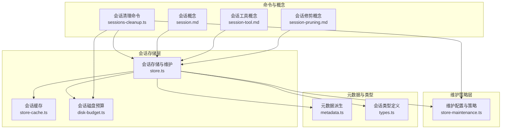
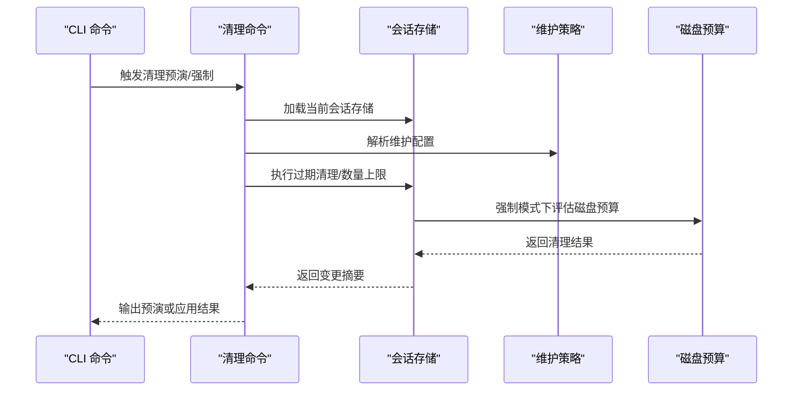
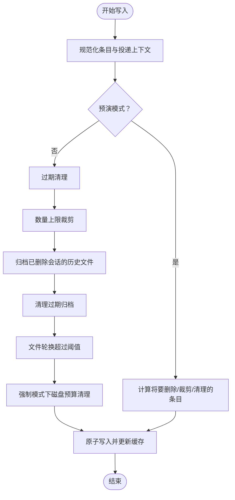
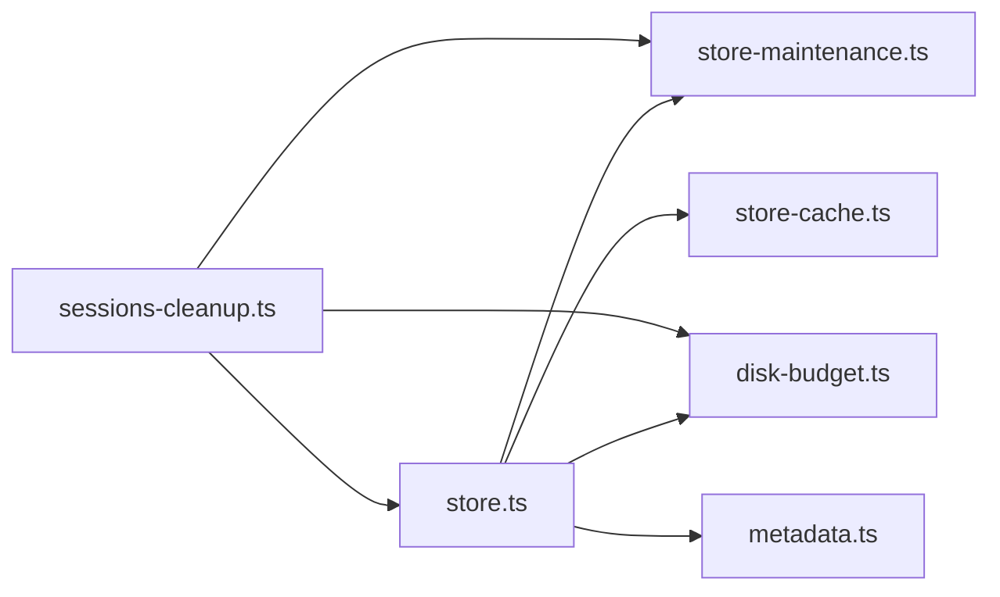

# 会话管理

<cite>
**本文引用的文件**
- [会话存储与维护](file://src/config/sessions/store.ts)
- [会话维护配置与策略](file://src/config/sessions/store-maintenance.ts)
- [会话磁盘预算与清理](file://src/config/sessions/disk-budget.ts)
- [会话缓存](file://src/config/sessions/store-cache.ts)
- [会话元数据派生](file://src/config/sessions/metadata.ts)
- [会话清理命令](file://src/commands/sessions-cleanup.ts)
- [会话概念说明](file://docs/concepts/session.md)
- [会话工具概念说明](file://docs/concepts/session-tool.md)
- [会话修剪概念说明](file://docs/concepts/session-pruning.md)
- [会话类型定义](file://src/config/sessions/types.ts)
</cite>

## 目录
1. [简介](#简介)
2. [项目结构](#项目结构)
3. [核心组件](#核心组件)
4. [架构总览](#架构总览)
5. [详细组件分析](#详细组件分析)
6. [依赖关系分析](#依赖关系分析)
7. [性能考量](#性能考量)
8. [故障排除指南](#故障排除指南)
9. [结论](#结论)
10. [附录：常用操作与示例路径](#附录常用操作与示例路径)

## 简介
本文件系统性阐述 OpenClaw 的会话管理系统，覆盖会话的概念、生命周期、上下文构建与维护、会话工具的作用与实现、会话修剪策略、状态持久化、并发访问控制、会话隔离与安全考虑，并提供配置选项、性能优化建议与故障排除指南。文档同时给出可直接定位到源码的示例路径，便于开发者快速上手与扩展。

## 项目结构
围绕会话管理的关键模块分布如下：
- 会话存储与维护：负责会话条目的读写、合并、归档、转储与并发锁队列。
- 维护策略：负责过期清理、数量上限、文件轮换、磁盘预算等。
- 磁盘预算与清理：在强制模式下按时间与引用关系清理历史与归档文件。
- 缓存：对会话存储进行对象与序列化缓存以提升读取性能。
- 元数据：从入站消息中派生会话来源、群组标签等信息。
- 清理命令：CLI 提供的会话清理预演与执行能力。
- 概念文档：会话键规则、生命周期、安全隔离、工具集与修剪策略等。

图表来源
- [会话存储与维护:1-884](file://src/config/sessions/store.ts#L1-L884)
- [会话维护配置与策略:1-328](file://src/config/sessions/store-maintenance.ts#L1-L328)
- [会话磁盘预算与清理:1-376](file://src/config/sessions/disk-budget.ts#L1-L376)
- [会话缓存:1-82](file://src/config/sessions/store-cache.ts#L1-L82)
- [会话元数据派生:1-173](file://src/config/sessions/metadata.ts#L1-L173)
- [会话清理命令:1-469](file://src/commands/sessions-cleanup.ts#L1-L469)
- [会话概念说明:1-311](file://docs/concepts/session.md#L1-L311)
- [会话工具概念说明:1-224](file://docs/concepts/session-tool.md#L1-L224)
- [会话修剪概念说明:1-122](file://docs/concepts/session-pruning.md#L1-L122)

章节来源
- [会话存储与维护:1-884](file://src/config/sessions/store.ts#L1-L884)
- [会话维护配置与策略:1-328](file://src/config/sessions/store-maintenance.ts#L1-L328)
- [会话磁盘预算与清理:1-376](file://src/config/sessions/disk-budget.ts#L1-L376)
- [会话缓存:1-82](file://src/config/sessions/store-cache.ts#L1-L82)
- [会话元数据派生:1-173](file://src/config/sessions/metadata.ts#L1-L173)
- [会话清理命令:1-469](file://src/commands/sessions-cleanup.ts#L1-L469)
- [会话概念说明:1-311](file://docs/concepts/session.md#L1-L311)
- [会话工具概念说明:1-224](file://docs/concepts/session-tool.md#L1-L224)
- [会话修剪概念说明:1-122](file://docs/concepts/session-pruning.md#L1-L122)

## 核心组件
- 会话存储与维护（store.ts）
  - 负责加载、合并、持久化会话条目；提供维护前后的归档、转储与磁盘预算清理；通过写锁队列保证并发一致性。
  - 关键职责：规范化键名、合并条目、维护警告、磁盘预算、文件轮换、原子写入。
- 维护策略（store-maintenance.ts）
  - 解析配置，提供过期清理、数量上限、文件轮换、活动会话预警等能力。
- 磁盘预算（disk-budget.ts）
  - 在强制模式下按时间与引用关系清理历史与归档文件，确保不超过配额。
- 缓存（store-cache.ts）
  - 对会话存储进行对象与序列化缓存，支持 TTL 控制，减少重复解析与 IO。
- 元数据（metadata.ts）
  - 从入站消息派生会话来源、群组显示名、通道与主题等元信息。
- 清理命令（sessions-cleanup.ts）
  - 支持预演（dry-run）、强制执行、JSON 输出、按活跃键保护等。

章节来源
- [会话存储与维护:1-884](file://src/config/sessions/store.ts#L1-L884)
- [会话维护配置与策略:1-328](file://src/config/sessions/store-maintenance.ts#L1-L328)
- [会话磁盘预算与清理:1-376](file://src/config/sessions/disk-budget.ts#L1-L376)
- [会话缓存:1-82](file://src/config/sessions/store-cache.ts#L1-L82)
- [会话元数据派生:1-173](file://src/config/sessions/metadata.ts#L1-L173)
- [会话清理命令:1-469](file://src/commands/sessions-cleanup.ts#L1-L469)

## 架构总览
会话管理采用“存储 + 维护 + 预算 + 命令”的分层设计：
- 存储层：统一的 JSON 存储 sessions.json，条目包含会话标识、更新时间、模型、令牌统计、来源与投递上下文等。
- 维护层：在写入时自动执行过期清理、数量上限、文件轮换与磁盘预算清理。
- 预算层：在强制模式下清理未被引用的历史与归档文件，避免无限增长。
- 命令层：CLI 提供清理预演与执行，支持按活跃键保护与 JSON 报告。

图表来源
- [会话清理命令:293-469](file://src/commands/sessions-cleanup.ts#L293-L469)
- [会话存储与维护:340-533](file://src/config/sessions/store.ts#L340-L533)
- [会话维护配置与策略:130-148](file://src/config/sessions/store-maintenance.ts#L130-L148)
- [会话磁盘预算与清理:188-376](file://src/config/sessions/disk-budget.ts#L188-L376)

## 详细组件分析

### 会话存储与维护（store.ts）
- 并发与锁队列
  - 使用写锁队列确保同一存储文件的串行写入，避免竞态与覆盖。
  - 支持超时与过期检测，失败时返回明确错误。
- 维护流程
  - 预演模式仅报告将要删除的条目与归档，不实际修改。
  - 强制模式按顺序执行：过期清理、数量上限、归档旧会话、清理归档、文件轮换、磁盘预算清理。
- 缓存与序列化
  - 读取时支持缓存与文件快照校验；写入时原子落盘并更新缓存。
- 元数据与投递上下文
  - 自动规范化投递字段与运行时模型字段，合并入站消息派生的元信息。
- 归档与转储
  - 删除不再引用的会话历史文件并清理过期归档；支持文件轮换防止单文件过大。

图表来源
- [会话存储与维护:340-533](file://src/config/sessions/store.ts#L340-L533)
- [会话维护配置与策略:155-327](file://src/config/sessions/store-maintenance.ts#L155-L327)
- [会话磁盘预算与清理:188-376](file://src/config/sessions/disk-budget.ts#L188-L376)

章节来源
- [会话存储与维护:195-533](file://src/config/sessions/store.ts#L195-L533)
- [会话维护配置与策略:155-327](file://src/config/sessions/store-maintenance.ts#L155-L327)
- [会话磁盘预算与清理:188-376](file://src/config/sessions/disk-budget.ts#L188-L376)

### 会话维护配置与策略（store-maintenance.ts）
- 配置解析
  - 默认保留期、最大条目数、文件轮换阈值、磁盘配额与高水位线等。
- 过期清理
  - 基于 updatedAt 与保留期阈值删除陈旧条目。
- 数量上限
  - 按最近更新时间排序，优先删除最旧条目。
- 文件轮换
  - 当文件大小超过阈值时重命名为备份文件，并清理旧备份。
- 活动会话预警
  - 在预演模式下检测是否可能误删活跃会话，输出警告。

章节来源
- [会话维护配置与策略:130-327](file://src/config/sessions/store-maintenance.ts#L130-L327)

### 会话磁盘预算与清理（disk-budget.ts）
- 预算评估
  - 计算目录总占用，若超过上限则先清理可删除的归档与历史文件。
- 强制清理
  - 若仍超限，则按 updatedAt 升序删除条目，同时清理对应的会话历史文件。
- 保护活跃会话
  - 可通过活跃键参数跳过清理该会话及其历史文件。
- 结果报告
  - 返回清理前后字节数、移除文件数与条目数等指标。

章节来源
- [会话磁盘预算与清理:188-376](file://src/config/sessions/disk-budget.ts#L188-L376)

### 会话缓存（store-cache.ts）
- 对象缓存与序列化缓存
  - 以 TTL 控制缓存有效期，结合文件 mtime 与 size 校验缓存一致性。
- 写入后更新
  - 原子写入成功后同步更新缓存，避免脏读。

章节来源
- [会话缓存:1-82](file://src/config/sessions/store-cache.ts#L1-L82)

### 会话元数据派生（metadata.ts）
- 来源派生
  - 从入站消息提取标签、提供商、表面、聊天类型、路由 ID、账号与主题等。
- 群组补全
  - 补充群组显示名、频道、空间等信息，用于 UI 展示与检索。
- 合并策略
  - 合并现有来源信息，避免覆盖非空字段。

章节来源
- [会话元数据派生:45-173](file://src/config/sessions/metadata.ts#L45-L173)

### 会话清理命令（sessions-cleanup.ts）
- 预演与执行
  - 支持 dry-run 输出将要执行的操作与影响范围；强制模式实际应用维护策略。
- JSON 输出
  - 支持 JSON 格式输出摘要，便于自动化集成。
- 活跃键保护
  - 传入活跃会话键时，在清理过程中跳过该会话，避免误删。
- 多代理支持
  - 可按代理或全部代理目标执行清理。

章节来源
- [会话清理命令:293-469](file://src/commands/sessions-cleanup.ts#L293-L469)

### 会话概念与工具（概念文档）
- 会话键与生命周期
  - 直聊与群聊键规则、每日/空闲重置策略、手动重置触发词等。
- 安全与隔离
  - 多用户共享主会话可能导致隐私泄露，推荐 per-channel-peer 或更高隔离级别。
- 会话工具
  - 列表、历史、发送、跨会话回声与子代理生成等工具集。
- 会话修剪
  - 请求前对工具结果进行修剪，降低上下文膨胀，改善缓存命中与成本。

章节来源
- [会话概念说明:1-311](file://docs/concepts/session.md#L1-L311)
- [会话工具概念说明:1-224](file://docs/concepts/session-tool.md#L1-L224)
- [会话修剪概念说明:1-122](file://docs/concepts/session-pruning.md#L1-L122)

## 依赖关系分析
- 组件耦合
  - store.ts 依赖 store-maintenance.ts 与 disk-budget.ts 的策略与预算逻辑；依赖 store-cache.ts 进行缓存；依赖 metadata.ts 合并入站元信息。
  - sessions-cleanup.ts 依赖 store.ts 的加载与更新接口，以及 store-maintenance.ts 的维护配置与策略。
- 并发与一致性
  - 通过写锁队列与原子写入保障并发安全；缓存与序列化缓存配合确保一致性。
- 外部依赖
  - 文件系统与 JSON 序列化；日志子系统；配置加载器。

图表来源
- [会话存储与维护:1-884](file://src/config/sessions/store.ts#L1-L884)
- [会话维护配置与策略:1-328](file://src/config/sessions/store-maintenance.ts#L1-L328)
- [会话磁盘预算与清理:1-376](file://src/config/sessions/disk-budget.ts#L1-L376)
- [会话缓存:1-82](file://src/config/sessions/store-cache.ts#L1-L82)
- [会话元数据派生:1-173](file://src/config/sessions/metadata.ts#L1-L173)
- [会话清理命令:1-469](file://src/commands/sessions-cleanup.ts#L1-L469)

## 性能考量
- 缓存与 TTL
  - 启用对象与序列化缓存可显著降低重复解析开销；可通过环境变量调整 TTL。
- 维护成本
  - 大规模存储在写入路径上执行维护，会增加延迟；建议启用强制模式并设置合理的时间与数量限制。
- 磁盘预算
  - 启用磁盘预算并在高水位线以下运行，避免频繁清理导致的抖动。
- 文件轮换
  - 合理设置轮换阈值，平衡单文件大小与 IO 成本。

章节来源
- [会话存储与维护:52-67](file://src/config/sessions/store.ts#L52-L67)
- [会话概念说明:101-120](file://docs/concepts/session.md#L101-L120)

## 故障排除指南
- 写入失败或文件丢失
  - 在 Windows 上存在临时文件与重命名竞态，系统内置重试与降级处理；如持续失败，检查磁盘权限与路径有效性。
- 活跃会话被误删
  - 使用预演模式并传入活跃会话键，确认不会影响当前会话后再强制执行。
- 清理后仍超配额
  - 检查高水位线与保留期设置，适当提高阈值或缩短保留期；必要时扩大 maxDiskBytes。
- 缓存不一致
  - 清理缓存后重启进程，或等待 TTL 过期后自动失效。

章节来源
- [会话存储与维护:464-508](file://src/config/sessions/store.ts#L464-L508)
- [会话清理命令:325-361](file://src/commands/sessions-cleanup.ts#L325-L361)
- [会话磁盘预算与清理:227-244](file://src/config/sessions/disk-budget.ts#L227-L244)

## 结论
OpenClaw 的会话管理通过“存储 + 维护 + 预算 + 命令”的体系实现了高可用、可预测且可审计的状态管理。其设计兼顾性能与安全性，支持多维度的隔离与清理策略，并提供了完善的 CLI 工具链辅助运维与诊断。遵循本文档的配置与实践建议，可在生产环境中稳定运行并持续优化。

## 附录：常用操作与示例路径
- 创建/更新会话条目
  - [更新会话条目:729-754](file://src/config/sessions/store.ts#L729-L754)
  - [记录入站元信息:756-800](file://src/config/sessions/store.ts#L756-L800)
- 查询会话
  - [读取 updatedAt:272-283](file://src/config/sessions/store.ts#L272-L283)
- 销毁/清理会话
  - [清理命令（预演/强制）:293-469](file://src/commands/sessions-cleanup.ts#L293-L469)
- 会话修剪（请求前）
  - [修剪策略说明:1-122](file://docs/concepts/session-pruning.md#L1-L122)
- 会话工具
  - [工具集说明:1-224](file://docs/concepts/session-tool.md#L1-L224)
- 配置参考
  - [会话配置与默认值:74-176](file://docs/concepts/session.md#L74-L176)