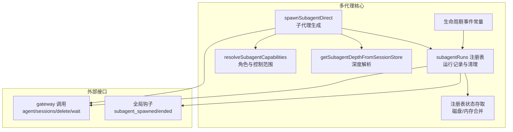
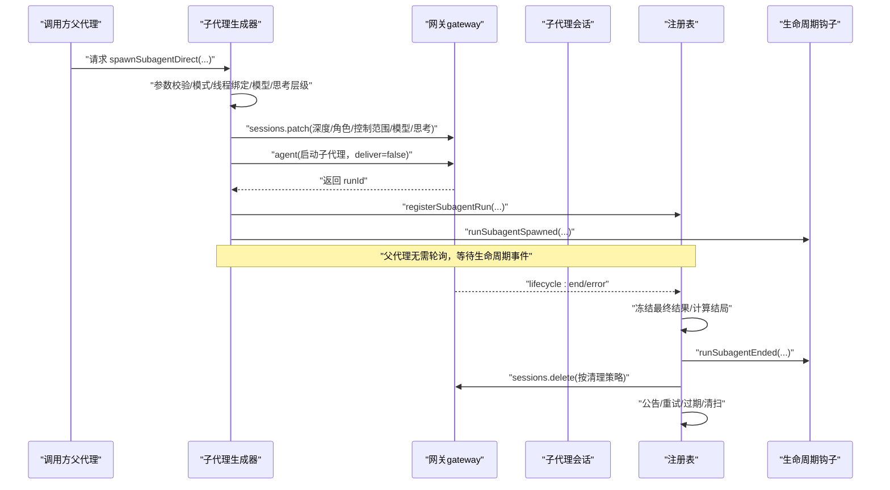
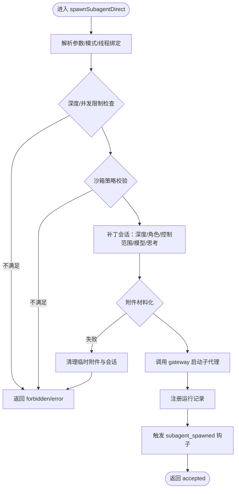
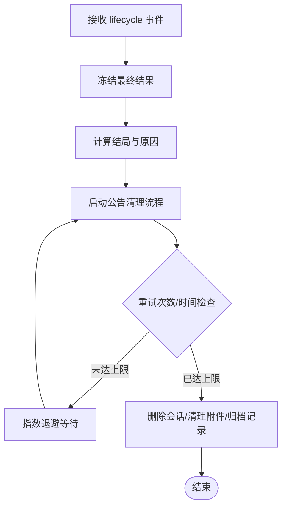
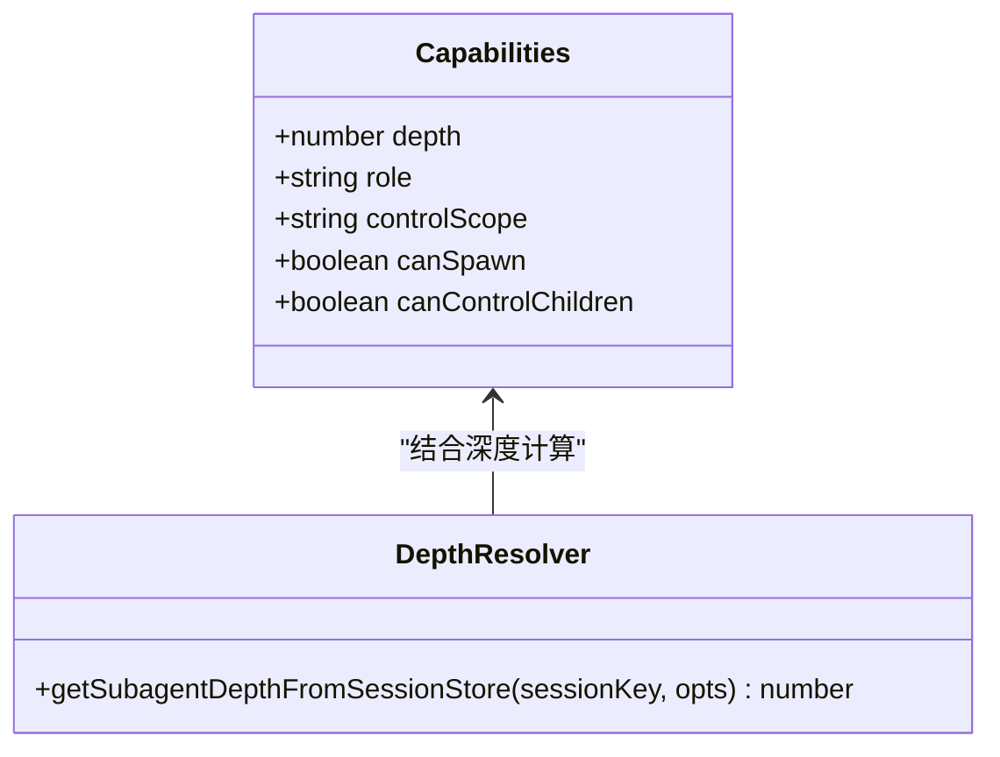
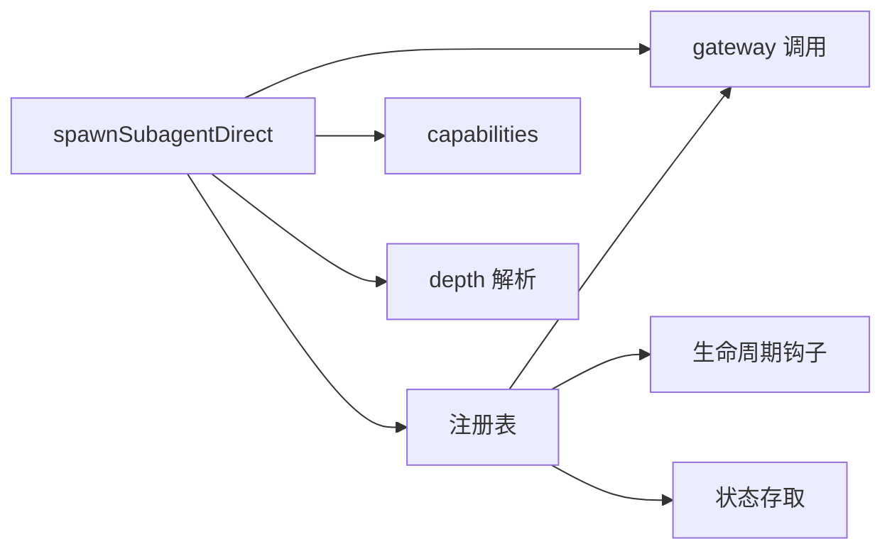

# 多代理架构

<cite>
**本文引用的文件**
- [src/agents/subagent-spawn.ts](file://src/agents/subagent-spawn.ts)
- [src/agents/subagent-registry.ts](file://src/agents/subagent-registry.ts)
- [src/agents/subagent-capabilities.ts](file://src/agents/subagent-capabilities.ts)
- [src/agents/subagent-depth.ts](file://src/agents/subagent-depth.ts)
- [src/agents/subagent-lifecycle-events.ts](file://src/agents/subagent-lifecycle-events.ts)
- [src/agents/subagent-registry.types.ts](file://src/agents/subagent-registry.types.ts)
- [src/agents/subagent-registry-state.ts](file://src/agents/subagent-registry-state.ts)
- [src/agents/openclaw-tools.subagents.sessions-spawn.lifecycle.test.ts](file://src/agents/openclaw-tools.subagents.sessions-spawn.lifecycle.test.ts)
- [extensions/open-prose/skills/prose/state/postgres.md](file://extensions/open-prose/skills/prose/state/postgres.md)
</cite>

## 目录
1. [引言](#引言)
2. [项目结构](#项目结构)
3. [核心组件](#核心组件)
4. [架构总览](#架构总览)
5. [详细组件分析](#详细组件分析)
6. [依赖关系分析](#依赖关系分析)
7. [性能考量](#性能考量)
8. [故障排查指南](#故障排查指南)
9. [结论](#结论)
10. [附录：代码示例与最佳实践](#附录代码示例与最佳实践)

## 引言
本文件面向希望在 OpenClaw 中构建复杂多代理系统的开发者，系统性阐述多代理架构的设计原理与实现机制，重点覆盖以下方面：
- 子代理注册表（Subagent Registry）：运行期状态持久化、生命周期事件驱动的清理与回溯、并发与幂等处理。
- 子代理生成（Subagent Spawn）：参数校验、权限与沙箱策略、深度与并发限制、线程绑定、附件与工作区继承、启动与回溯。
- 代理层次结构与角色控制：基于深度的角色划分、控制范围、可孵化能力。
- 代理间通信与状态同步：通过会话键与生命周期事件进行解耦，自动公告完成结果，支持“无轮询”等待。
- 资源共享与冲突解决：会话存储与工作区继承、附件挂载、线程绑定、超时与重试退避。
- 深度限制、生命周期管理、状态同步：最大孵化深度、活跃子代理数量上限、归档与清扫、孤儿运行处理。
- 应用场景、性能考虑与调试技巧：典型用法、并发与资源瓶颈、测试与钩子调试。

## 项目结构
OpenClaw 的多代理能力由一组协同模块构成，围绕“生成—登记—公告—清理”的闭环展开，并通过会话键与生命周期事件实现跨进程、跨通道的解耦协作。

图示来源
- [src/agents/subagent-spawn.ts:257-789](file://src/agents/subagent-spawn.ts#L257-L789)
- [src/agents/subagent-registry.ts:1-800](file://src/agents/subagent-registry.ts#L1-L800)
- [src/agents/subagent-capabilities.ts:1-157](file://src/agents/subagent-capabilities.ts#L1-L157)
- [src/agents/subagent-depth.ts:1-177](file://src/agents/subagent-depth.ts#L1-L177)
- [src/agents/subagent-lifecycle-events.ts:1-48](file://src/agents/subagent-lifecycle-events.ts#L1-L48)
- [src/agents/subagent-registry-state.ts:1-57](file://src/agents/subagent-registry-state.ts#L1-L57)

章节来源
- [src/agents/subagent-spawn.ts:1-789](file://src/agents/subagent-spawn.ts#L1-L789)
- [src/agents/subagent-registry.ts:1-800](file://src/agents/subagent-registry.ts#L1-L800)
- [src/agents/subagent-capabilities.ts:1-157](file://src/agents/subagent-capabilities.ts#L1-L157)
- [src/agents/subagent-depth.ts:1-177](file://src/agents/subagent-depth.ts#L1-L177)
- [src/agents/subagent-lifecycle-events.ts:1-48](file://src/agents/subagent-lifecycle-events.ts#L1-L48)
- [src/agents/subagent-registry-state.ts:1-57](file://src/agents/subagent-registry-state.ts#L1-L57)

## 核心组件
- 子代理生成器（spawnSubagentDirect）
  - 输入参数与模式选择、线程绑定准备、模型与思考层级解析、附件材料化、系统提示注入、会话键生成与补丁、调用 gateway 启动子代理、注册运行记录、触发生命周期钩子。
- 子代理注册表（subagentRuns）
  - 运行记录结构化、生命周期事件监听、冻结最终结果、公告与清理流程、孤儿运行判定与清理、归档与清扫、磁盘/内存状态合并。
- 角色与控制范围（capabilities）
  - 基于深度的角色（main/orchestrator/leaf）与控制范围（children/none），决定是否允许进一步孵化。
- 深度解析（depth）
  - 从会话存储中解析当前会话的子代理深度，支持祖先链回溯与默认值。
- 生命周期事件（lifecycle-events）
  - 完成/错误/被杀/会话重置/删除等终端原因与对应结果枚举。
- 注册表状态（state）
  - 磁盘持久化与恢复、多进程可见的快照合并、失败容忍。

章节来源
- [src/agents/subagent-spawn.ts:257-789](file://src/agents/subagent-spawn.ts#L257-L789)
- [src/agents/subagent-registry.ts:1-800](file://src/agents/subagent-registry.ts#L1-L800)
- [src/agents/subagent-capabilities.ts:1-157](file://src/agents/subagent-capabilities.ts#L1-L157)
- [src/agents/subagent-depth.ts:1-177](file://src/agents/subagent-depth.ts#L1-L177)
- [src/agents/subagent-lifecycle-events.ts:1-48](file://src/agents/subagent-lifecycle-events.ts#L1-L48)
- [src/agents/subagent-registry-state.ts:1-57](file://src/agents/subagent-registry-state.ts#L1-L57)

## 架构总览
下图展示了从“生成子代理”到“完成公告与清理”的端到端流程，以及与生命周期事件、钩子、网关调用的关系。

图示来源
- [src/agents/subagent-spawn.ts:257-789](file://src/agents/subagent-spawn.ts#L257-L789)
- [src/agents/subagent-registry.ts:765-800](file://src/agents/subagent-registry.ts#L765-L800)
- [src/agents/subagent-lifecycle-events.ts:1-48](file://src/agents/subagent-lifecycle-events.ts#L1-L48)

## 详细组件分析

### 组件A：子代理生成（spawnSubagentDirect）
- 关键职责
  - 参数与模式解析：任务、标签、目标代理、模型、思考层级、线程绑定、清理策略、沙箱模式、期望完成消息、附件与挂载路径。
  - 权限与安全：目标代理与请求者代理一致性校验、允许列表（支持通配符）、沙箱运行时策略（inherit/require）。
  - 限制与深度：最大孵化深度、每会话活跃子代理数上限、线程绑定可用性检查。
  - 会话与元数据：生成子代理会话键、补丁深度/角色/控制范围、模型与思考层级、工作区与附件继承、系统提示注入。
  - 启动与回溯：调用 gateway 启动子代理（deliver=false），注册运行记录，触发生命周期钩子；失败时清理临时附件与会话。
- 数据流与复杂度
  - 时间复杂度近似 O(1)，主要开销在网关调用与文件系统操作。
  - 与注册表交互为幂等写入，失败时尽力清理。
- 错误处理
  - 严格输入校验与错误摘要，失败时清理附件与会话，确保不会遗留半成品。

图示来源
- [src/agents/subagent-spawn.ts:257-789](file://src/agents/subagent-spawn.ts#L257-L789)

章节来源
- [src/agents/subagent-spawn.ts:257-789](file://src/agents/subagent-spawn.ts#L257-L789)

### 组件B：子代理注册表（subagentRuns）
- 关键职责
  - 运行记录结构化与持久化：磁盘/内存合并快照、失败容忍的保存与恢复。
  - 生命周期事件驱动：监听 agent lifecycle 事件，冻结最终结果，计算结局，延迟错误处理以等待后续 start/end。
  - 公告与清理：自动公告完成摘要，带指数退避与最大重试次数，超时或过期后放弃并清理。
  - 并发与一致性：孤儿运行检测与清理、归档与清扫定时器、多进程可见状态。
- 数据结构与复杂度
  - 内部使用 Map 存储运行记录，查询/更新均为 O(1)。
  - 清扫与重试采用定时器与延迟队列，避免阻塞主流程。
- 错误处理
  - 对磁盘读写失败、钩子执行失败采取“尽力而为”，保证核心流程不受影响。

图示来源
- [src/agents/subagent-registry.ts:451-579](file://src/agents/subagent-registry.ts#L451-L579)

章节来源
- [src/agents/subagent-registry.ts:1-800](file://src/agents/subagent-registry.ts#L1-L800)
- [src/agents/subagent-registry.types.ts:1-59](file://src/agents/subagent-registry.types.ts#L1-L59)
- [src/agents/subagent-registry-state.ts:1-57](file://src/agents/subagent-registry-state.ts#L1-L57)

### 组件C：角色与控制范围（capabilities）
- 设计要点
  - 角色：main（根）、orchestrator（中间层）、leaf（最深层）。
  - 控制范围：children（可控制子代）、none（仅自身）。
  - 可孵化能力：main/orchestrator 可继续孵化，leaf 不可。
- 作用
  - 与最大孵化深度配合，形成“深度越深，权限越弱”的安全边界。
  - 与会话存储中的角色/控制范围字段兼容，支持显式覆盖。

图示来源
- [src/agents/subagent-capabilities.ts:1-157](file://src/agents/subagent-capabilities.ts#L1-L157)
- [src/agents/subagent-depth.ts:1-177](file://src/agents/subagent-depth.ts#L1-L177)

章节来源
- [src/agents/subagent-capabilities.ts:1-157](file://src/agents/subagent-capabilities.ts#L1-L157)
- [src/agents/subagent-depth.ts:1-177](file://src/agents/subagent-depth.ts#L1-L177)

### 组件D：生命周期事件与结果
- 终止原因
  - 完成、错误、被杀、会话重置、会话删除。
- 结局
  - ok、error、timeout、killed、reset、deleted。
- 用途
  - 注册表据此决定公告、清理与归档策略，钩子据此发出通知。

章节来源
- [src/agents/subagent-lifecycle-events.ts:1-48](file://src/agents/subagent-lifecycle-events.ts#L1-L48)

### 组件E：测试与用例验证
- 测试覆盖点
  - 子代理生命周期：启动、结束、错误、超时、清理策略（delete/keep）。
  - 线程绑定：不同通道下的线程绑定可用性与清理钩子。
  - 会话等待与超时：agent.wait 返回 timeout 时的回溯与提示。
  - 请求者上下文：announce 时携带正确的请求者账号信息。
- 测试工具
  - 使用测试夹具设置 gateway mock、重置注册表、伪造计时器，确保可重复与可控。

章节来源
- [src/agents/openclaw-tools.subagents.sessions-spawn.lifecycle.test.ts:1-373](file://src/agents/openclaw-tools.subagents.sessions-spawn.lifecycle.test.ts#L1-L373)

## 依赖关系分析
- 模块内聚与耦合
  - 生成器与注册表通过会话键与 runId 解耦，仅依赖 gateway 与钩子接口。
  - 深度与能力解析独立于生成器，便于复用与测试。
- 外部依赖
  - gateway：agent/sessions/delete/wait 等 RPC。
  - 钩子：subagent_spawned、subagent_ended。
  - 文件系统：附件材料化与注册表持久化。
- 循环依赖
  - 通过“运行时加载”与“事件驱动”避免直接循环导入。

图示来源
- [src/agents/subagent-spawn.ts:1-789](file://src/agents/subagent-spawn.ts#L1-L789)
- [src/agents/subagent-registry.ts:1-800](file://src/agents/subagent-registry.ts#L1-L800)
- [src/agents/subagent-capabilities.ts:1-157](file://src/agents/subagent-capabilities.ts#L1-L157)
- [src/agents/subagent-depth.ts:1-177](file://src/agents/subagent-depth.ts#L1-L177)
- [src/agents/subagent-registry-state.ts:1-57](file://src/agents/subagent-registry-state.ts#L1-L57)

章节来源
- [src/agents/subagent-spawn.ts:1-789](file://src/agents/subagent-spawn.ts#L1-L789)
- [src/agents/subagent-registry.ts:1-800](file://src/agents/subagent-registry.ts#L1-L800)
- [src/agents/subagent-capabilities.ts:1-157](file://src/agents/subagent-capabilities.ts#L1-L157)
- [src/agents/subagent-depth.ts:1-177](file://src/agents/subagent-depth.ts#L1-L177)
- [src/agents/subagent-registry-state.ts:1-57](file://src/agents/subagent-registry-state.ts#L1-L57)

## 性能考量
- 并发与吞吐
  - 生成器与注册表均采用 O(1) 查询/更新，适合高并发场景。
  - 公告清理采用指数退避与最大重试次数，避免风暴式重试。
- 资源占用
  - 附件材料化与会话删除为 I/O 密集，建议合理设置清理策略与归档周期。
  - 注册表状态持久化失败不阻塞主流程，但应关注磁盘空间与日志告警。
- 超时与重试
  - 子代理等待超时与公告超时均有明确阈值，避免无限等待。
- 线程绑定
  - 仅在支持的通道与已注册钩子的前提下启用，避免无效尝试。

[本节为通用指导，不直接分析具体文件]

## 故障排查指南
- 子代理无法启动
  - 检查沙箱策略与目标代理运行时一致性；确认允许列表包含目标代理；核对线程绑定可用性。
  - 查看生成器返回的错误摘要与清理动作（临时附件与会话删除）。
- 子代理完成后未收到公告
  - 确认注册表是否正确监听 lifecycle 事件；检查公告重试次数与过期时间；查看磁盘状态是否被其他进程覆盖。
- 孤儿运行与泄漏
  - 注册表会自动识别并清理孤儿运行；若长时间未清理，检查会话存储与权限。
- 清理策略异常
  - delete/keep 策略与会话生命周期钩子配合使用；确保钩子实现正确处理删除与 farewell。

章节来源
- [src/agents/subagent-spawn.ts:134-173](file://src/agents/subagent-spawn.ts#L134-L173)
- [src/agents/subagent-registry.ts:184-250](file://src/agents/subagent-registry.ts#L184-L250)
- [src/agents/subagent-registry.ts:532-579](file://src/agents/subagent-registry.ts#L532-L579)

## 结论
OpenClaw 的多代理架构通过“生成—登记—公告—清理”的闭环，结合会话键、生命周期事件与钩子机制，实现了高内聚、低耦合、可扩展且安全的子代理体系。深度与并发限制、沙箱策略与线程绑定共同构成了安全边界；磁盘/内存状态合并与孤儿运行清理保障了可靠性；测试用例覆盖关键行为，便于持续演进。

[本节为总结性内容，不直接分析具体文件]

## 附录：代码示例与最佳实践
- 创建子代理（示例路径）
  - 生成器入口：[spawnSubagentDirect:257-789](file://src/agents/subagent-spawn.ts#L257-L789)
  - 参数与模式：[SpawnSubagentParams/SpawnSubagentMode:47-66](file://src/agents/subagent-spawn.ts#L47-L66)
  - 线程绑定准备：[ensureThreadBindingForSubagentSpawn:196-255](file://src/agents/subagent-spawn.ts#L196-L255)
  - 附件材料化：[materializeSubagentAttachments:534-556](file://src/agents/subagent-spawn.ts#L534-L556)
  - 启动与注册：[callGateway + registerSubagentRun:606-714](file://src/agents/subagent-spawn.ts#L606-L714)
- 管理运行记录（示例路径）
  - 生命周期事件监听与处理：[onAgentEvent 分支:770-800](file://src/agents/subagent-registry.ts#L770-L800)
  - 公告与清理流程：[runSubagentAnnounceFlow:549-577](file://src/agents/subagent-registry.ts#L549-L577)
  - 归档与清扫：[sweepSubagentRuns:726-763](file://src/agents/subagent-registry.ts#L726-L763)
  - 状态持久化与恢复：[persist/restore:7-35](file://src/agents/subagent-registry-state.ts#L7-L35)
- 角色与深度（示例路径）
  - 能力解析：[resolveSubagentCapabilities:110-120](file://src/agents/subagent-capabilities.ts#L110-L120)
  - 深度解析：[getSubagentDepthFromSessionStore:124-176](file://src/agents/subagent-depth.ts#L124-L176)
- 测试与验证（示例路径）
  - 生命周期与清理策略：[sessions-spawn lifecycle test:131-308](file://src/agents/openclaw-tools.subagents.sessions-spawn.lifecycle.test.ts#L131-L308)
  - 超时回溯与 announce 上下文：[timeout & account tests:310-371](file://src/agents/openclaw-tools.subagents.sessions-spawn.lifecycle.test.ts#L310-L371)
- 多代理应用场景与约束说明
  - 子代理职责与输出写入规范：[postgres.md:265-289](file://extensions/open-prose/skills/prose/state/postgres.md#L265-L289)

章节来源
- [src/agents/subagent-spawn.ts:257-789](file://src/agents/subagent-spawn.ts#L257-L789)
- [src/agents/subagent-registry.ts:549-763](file://src/agents/subagent-registry.ts#L549-L763)
- [src/agents/subagent-capabilities.ts:110-120](file://src/agents/subagent-capabilities.ts#L110-L120)
- [src/agents/subagent-depth.ts:124-176](file://src/agents/subagent-depth.ts#L124-L176)
- [src/agents/openclaw-tools.subagents.sessions-spawn.lifecycle.test.ts:131-371](file://src/agents/openclaw-tools.subagents.sessions-spawn.lifecycle.test.ts#L131-L371)
- [extensions/open-prose/skills/prose/state/postgres.md:265-289](file://extensions/open-prose/skills/prose/state/postgres.md#L265-L289)