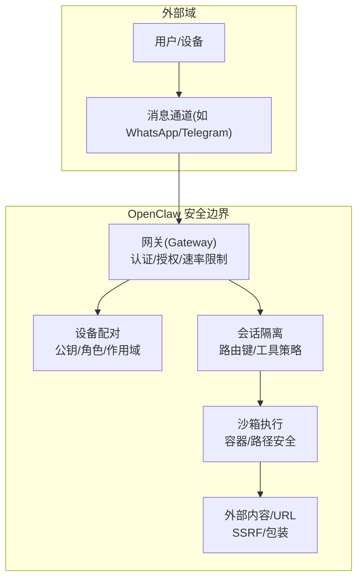
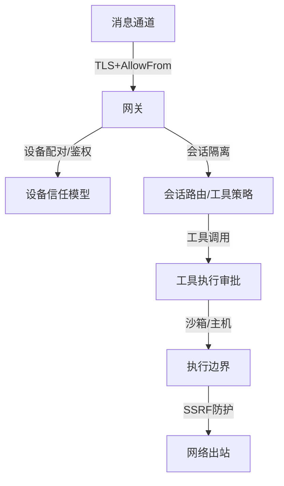
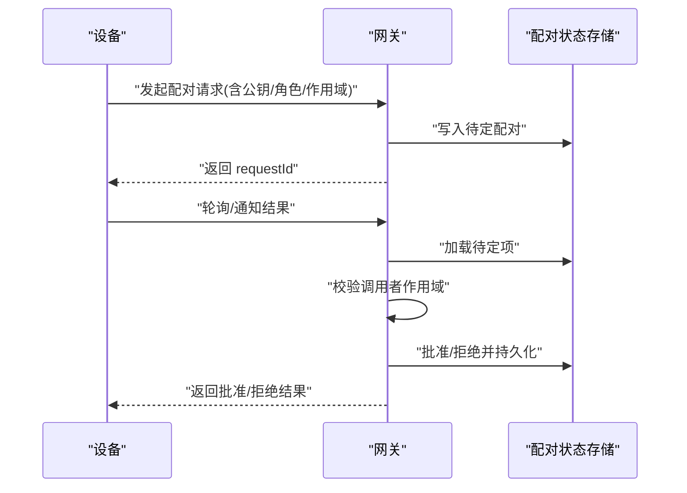
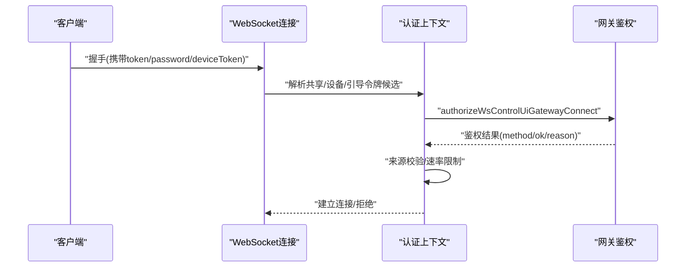
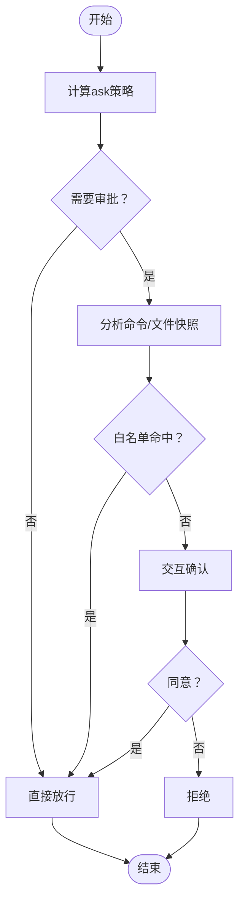
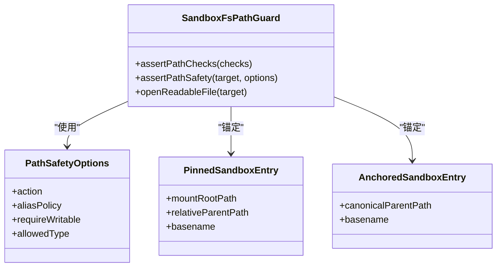
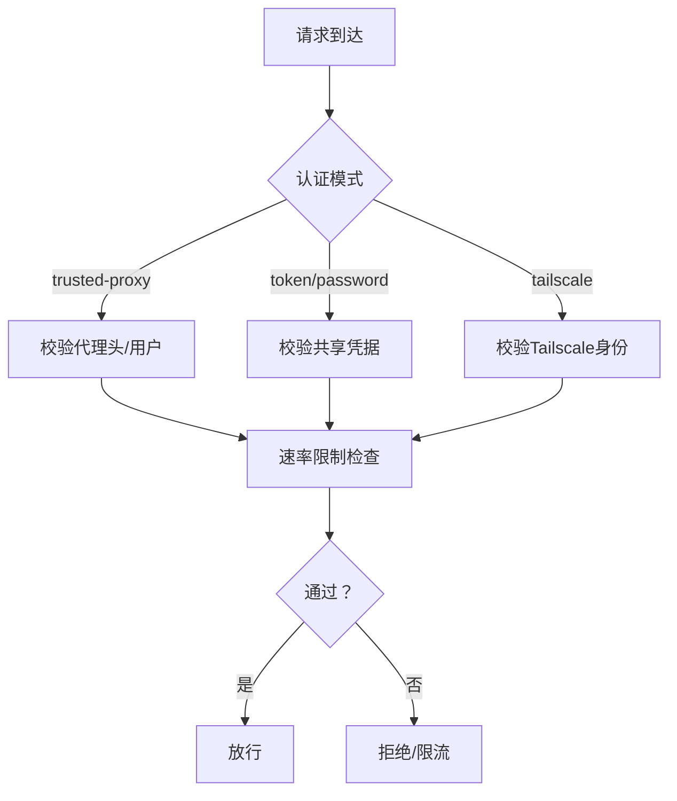
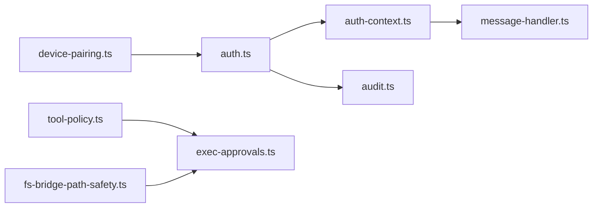

# 安全模型

<cite>
**本文引用的文件**
- [SECURITY.md](file://SECURITY.md)
- [THREAT-MODEL-ATLAS.md](file://docs/security/THREAT-MODEL-ATLAS.md)
- [auth.ts](file://src/gateway/auth.ts)
- [auth-context.ts](file://src/gateway/server/ws-connection/auth-context.ts)
- [message-handler.ts](file://src/gateway/server/ws-connection/message-handler.ts)
- [exec-approvals.ts](file://src/infra/exec-approvals.ts)
- [tool-policy.ts](file://src/agents/sandbox/tool-policy.ts)
- [fs-bridge-path-safety.ts](file://src/agents/sandbox/fs-bridge-path-safety.ts)
- [redact.ts](file://src/logging/redact.ts)
- [redact-snapshot.ts](file://src/config/redact-snapshot.ts)
- [index.md](file://docs/gateway/security/index.md)
- [audit.ts](file://src/security/audit.ts)
- [devices.ts](file://src/gateway/protocol/schema/devices.ts)
- [device-pairing.ts](file://src/infra/device-pairing.ts)
- [pairing.md](file://docs/channels/pairing.md)
</cite>

## 目录
1. [引言](#引言)
2. [项目结构与范围](#项目结构与范围)
3. [核心组件](#核心组件)
4. [架构总览](#架构总览)
5. [详细组件分析](#详细组件分析)
6. [依赖关系分析](#依赖关系分析)
7. [性能与安全权衡](#性能与安全权衡)
8. [故障排除指南](#故障排除指南)
9. [结论](#结论)
10. [附录：安全配置与合规建议](#附录安全配置与合规建议)

## 引言
本文件面向 OpenClaw 的安全模型，系统化梳理其信任模型、威胁与缓解、认证与授权、会话隔离、工具执行与沙箱边界、数据与日志处理、以及部署与运维安全建议。目标是帮助开发者在构建 AI 助手应用时，理解并正确实施端到端的安全控制，降低供应链、提示注入、命令执行、凭证泄露等风险。

## 项目结构与范围
OpenClaw 的安全相关能力主要分布在以下模块：
- 网关与通道：认证、速率限制、可信代理、WebSocket 控制界面接入
- 设备配对与本地信任：设备身份、公钥绑定、配对请求与批准流程
- 工具与执行：工具策略、执行审批（白名单/询问）、主机执行路径
- 沙箱与文件系统：容器挂载、路径安全检查、边界文件读取
- 日志与敏感信息：脱敏模式、快照还原、输出过滤
- 威胁建模与审计：ATLAS 风险矩阵、安全扫描与加固建议

图示来源
- [auth.ts:1-495](file://src/gateway/auth.ts#L1-L495)
- [device-pairing.ts:351-475](file://src/infra/device-pairing.ts#L351-L475)
- [tool-policy.ts:1-110](file://src/agents/sandbox/tool-policy.ts#L1-L110)
- [fs-bridge-path-safety.ts:1-80](file://src/agents/sandbox/fs-bridge-path-safety.ts#L1-L80)

章节来源
- [SECURITY.md:91-107](file://SECURITY.md#L91-L107)
- [THREAT-MODEL-ATLAS.md:56-123](file://docs/security/THREAT-MODEL-ATLAS.md#L56-L123)

## 核心组件
- 网关认证与授权：支持 token/password/trusted-proxy/tailscale 等多种模式，具备速率限制与本地直连判定。
- WebSocket 控制界面接入：基于握手参数解析共享凭据、设备令牌候选、引导令牌，并进行来源校验与安全度量记录。
- 设备配对与本地信任：通过 requestId 管理待定配对，支持角色与作用域校验、批准/拒绝/移除流程。
- 执行审批与工具策略：默认“拒绝一切”，允许通过白名单或交互式确认；工具策略按代理粒度叠加全局默认。
- 沙箱与文件系统：路径安全检查、边界文件读取、挂载根约束，防止越界访问。
- 日志与敏感信息：可配置脱敏模式、正则匹配、PEM 块遮蔽、配置快照还原逻辑。

章节来源
- [auth.ts:208-283](file://src/gateway/auth.ts#L208-L283)
- [auth-context.ts:84-167](file://src/gateway/server/ws-connection/auth-context.ts#L84-L167)
- [message-handler.ts:428-457](file://src/gateway/server/ws-connection/message-handler.ts#L428-L457)
- [device-pairing.ts:351-475](file://src/infra/device-pairing.ts#L351-L475)
- [exec-approvals.ts:146-175](file://src/infra/exec-approvals.ts#L146-L175)
- [tool-policy.ts:35-110](file://src/agents/sandbox/tool-policy.ts#L35-L110)
- [fs-bridge-path-safety.ts:47-80](file://src/agents/sandbox/fs-bridge-path-safety.ts#L47-L80)
- [redact.ts:47-83](file://src/logging/redact.ts#L47-L83)
- [redact-snapshot.ts:483-529](file://src/config/redact-snapshot.ts#L483-L529)

## 架构总览
下图展示从通道到执行的关键安全边界与数据流：

图示来源
- [THREAT-MODEL-ATLAS.md:125-134](file://docs/security/THREAT-MODEL-ATLAS.md#L125-L134)
- [auth.ts:369-476](file://src/gateway/auth.ts#L369-L476)
- [exec-approvals.ts:484-496](file://src/infra/exec-approvals.ts#L484-L496)
- [tool-policy.ts:16-33](file://src/agents/sandbox/tool-policy.ts#L16-L33)

## 详细组件分析

### 设备配对与本地信任模型
- 请求生命周期：生成 requestId，记录设备公钥、显示名、平台、角色/作用域、远端 IP；30 秒宽限期后过期。
- 授权与作用域：批准前可校验调用者作用域是否满足请求所需；批准后写入已配对设备状态并持久化。
- 本地信任：本地直连（回环/同主机）自动批准，其他尾网节点仍需人工批准。
- 数据结构：事件模式定义了请求/结果事件字段，确保跨进程/协议一致性。

图示来源
- [device-pairing.ts:351-475](file://src/infra/device-pairing.ts#L351-L475)
- [devices.ts:38-67](file://src/gateway/protocol/schema/devices.ts#L38-L67)

章节来源
- [device-pairing.ts:351-475](file://src/infra/device-pairing.ts#L351-L475)
- [devices.ts:38-67](file://src/gateway/protocol/schema/devices.ts#L38-L67)
- [pairing.md](file://docs/channels/pairing.md)

### WebSocket 连接认证与控制界面接入
- 握手阶段解析共享凭据（token/password）与设备令牌候选（显式设备令牌或共享令牌回退），并进行速率限制检查。
- 来源校验：若 Host 头回退被启用，将记录安全警告指标；控制界面策略可覆盖设备身份要求。
- 认证决策：优先共享凭据，其次引导令牌，最后设备令牌；失败时记录原因并可能触发速率限制。

图示来源
- [auth-context.ts:84-167](file://src/gateway/server/ws-connection/auth-context.ts#L84-L167)
- [auth.ts:369-476](file://src/gateway/auth.ts#L369-L476)
- [message-handler.ts:428-457](file://src/gateway/server/ws-connection/message-handler.ts#L428-L457)

章节来源
- [auth-context.ts:84-167](file://src/gateway/server/ws-connection/auth-context.ts#L84-L167)
- [auth.ts:369-476](file://src/gateway/auth.ts#L369-L476)
- [message-handler.ts:428-457](file://src/gateway/server/ws-connection/message-handler.ts#L428-L457)

### 执行审批与工具策略
- 默认策略：拒绝一切（deny），仅在白名单命中或交互确认后放行。
- 交互策略：ask=always 或 ask=on-miss 且未满足白名单分析时弹窗确认。
- 工具策略：按代理覆盖全局默认，图像工具默认放行以支持多模态工作流。
- 文件系统：执行审批绑定 argv/cwd/env 与文件快照，提升命令完整性保障。

图示来源
- [exec-approvals.ts:484-496](file://src/infra/exec-approvals.ts#L484-L496)
- [tool-policy.ts:16-33](file://src/agents/sandbox/tool-policy.ts#L16-L33)

章节来源
- [exec-approvals.ts:146-175](file://src/infra/exec-approvals.ts#L146-L175)
- [exec-approvals.ts:484-496](file://src/infra/exec-approvals.ts#L484-L496)
- [tool-policy.ts:35-110](file://src/agents/sandbox/tool-policy.ts#L35-L110)

### 沙箱安全模型与文件系统访问控制
- 路径安全检查：在容器挂载范围内打开边界文件，校验别名策略与类型，确保只读/可写约束。
- 锚定与固定条目：支持“固定挂载根+相对父路径”和“规范父路径+基名”的锚定方式，避免目录遍历。
- 运行命令：通过受控命令运行器执行脚本，支持超时、stdin、信号中断与失败容忍。

图示来源
- [fs-bridge-path-safety.ts:47-80](file://src/agents/sandbox/fs-bridge-path-safety.ts#L47-L80)

章节来源
- [fs-bridge-path-safety.ts:1-80](file://src/agents/sandbox/fs-bridge-path-safety.ts#L1-L80)

### 网关安全策略与速率限制
- 多模式认证：token/password/trusted-proxy/tailscale，支持本地直连快速通道与可信代理身份透传。
- 速率限制：共享密钥与设备令牌分别计数，失败尝试计入并可设置重试等待时间。
- 受信代理：严格校验代理头与用户头，支持允许用户列表与必填头集合。

图示来源
- [auth.ts:369-476](file://src/gateway/auth.ts#L369-L476)
- [auth-context.ts:120-134](file://src/gateway/server/ws-connection/auth-context.ts#L120-L134)

章节来源
- [auth.ts:208-283](file://src/gateway/auth.ts#L208-L283)
- [auth.ts:369-476](file://src/gateway/auth.ts#L369-L476)
- [auth-context.ts:84-167](file://src/gateway/server/ws-connection/auth-context.ts#L84-L167)

### 数据加密与隐私保护
- 脱敏策略：支持正则表达式模式、最小长度阈值、PEM 块遮蔽；默认模式可配置。
- 配置快照还原：在还原过程中保留原始值，若缺失则抛错并告警，避免静默丢失。
- 日志输出：对外部内容采用包装与安全提示，减少提示注入影响面。

章节来源
- [redact.ts:47-83](file://src/logging/redact.ts#L47-L83)
- [redact-snapshot.ts:483-529](file://src/config/redact-snapshot.ts#L483-L529)

### 威胁建模与风险矩阵
- ATLAS 框架：涵盖侦察、初始访问、执行、持久化、防御规避、发现、收集与外泄、影响等战术。
- 关键威胁：令牌窃取、AllowFrom 欺骗、直接/间接提示注入、执行审批绕过、技能供应链、资源耗尽等。
- 建议优先级：P0（立即）- 完成 VirusTotal 集成、实现技能沙箱、输出验证；P1（短期）- 速率限制、令牌加密、改进审批 UX；P2（中期）- 加密通道验证、配置完整性校验、更新签名与版本固定。

章节来源
- [THREAT-MODEL-ATLAS.md:138-527](file://docs/security/THREAT-MODEL-ATLAS.md#L138-L527)

## 依赖关系分析
- 组件耦合
  - 网关认证与 WebSocket 握手强耦合：鉴权结果直接影响连接建立与后续设备令牌校验。
  - 执行审批与工具策略弱耦合：策略决定是否进入审批流程，审批决定最终执行。
  - 沙箱与文件系统：路径安全检查前置于任何文件操作，形成强边界。
- 外部依赖
  - Tailscale 身份验证、可信代理头、速率限制器、JSONL Socket（审批 UI）。
- 潜在风险
  - 令牌明文存储（当前为高风险，建议加密与轮换）。
  - 速率限制与来源校验的误判与滥用风险。

图示来源
- [auth.ts:1-495](file://src/gateway/auth.ts#L1-L495)
- [auth-context.ts:1-263](file://src/gateway/server/ws-connection/auth-context.ts#L1-L263)
- [message-handler.ts:428-457](file://src/gateway/server/ws-connection/message-handler.ts#L428-L457)
- [tool-policy.ts:1-110](file://src/agents/sandbox/tool-policy.ts#L1-L110)
- [exec-approvals.ts:1-590](file://src/infra/exec-approvals.ts#L1-L590)
- [fs-bridge-path-safety.ts:1-80](file://src/agents/sandbox/fs-bridge-path-safety.ts#L1-L80)
- [audit.ts:632-657](file://src/security/audit.ts#L632-L657)
- [device-pairing.ts:351-475](file://src/infra/device-pairing.ts#L351-L475)

章节来源
- [audit.ts:632-657](file://src/security/audit.ts#L632-L657)

## 性能与安全权衡
- 默认“拒绝一切”与交互审批会增加用户等待时间，建议通过白名单与更严格的分析减少误报。
- 速率限制可缓解暴力破解，但需平衡真实用户的合理失败次数。
- 沙箱容器启动成本较高，可在开发环境与生产环境差异化启用。
- 日志脱敏与正则匹配存在 CPU 开销，建议在高吞吐场景优化正则复杂度。

## 故障排除指南
- WebSocket 连接被拒绝
  - 检查共享凭据是否正确传递，确认速率限制状态与来源校验日志。
  - 若启用 Host 头回退，关注安全警告指标。
- 设备配对失败
  - 确认 requestId 仍在宽限期内，检查调用者作用域是否满足请求所需。
  - 核对设备公钥与平台信息是否一致。
- 执行审批弹窗频繁
  - 优化工具策略与白名单，减少 on-miss 场景。
  - 使用“允许一次/允许总是”记录常用命令。
- 日志中出现敏感信息
  - 检查脱敏模式与正则配置，必要时调整 REDACT_PATTERNS。
- 审计报告高危项
  - 受信代理模式需确保代理正确终止 TLS 并仅包含代理 IP，禁止直接暴露网关端口。

章节来源
- [auth-context.ts:84-167](file://src/gateway/server/ws-connection/auth-context.ts#L84-L167)
- [message-handler.ts:428-457](file://src/gateway/server/ws-connection/message-handler.ts#L428-L457)
- [device-pairing.ts:351-475](file://src/infra/device-pairing.ts#L351-L475)
- [exec-approvals.ts:484-496](file://src/infra/exec-approvals.ts#L484-L496)
- [redact.ts:47-83](file://src/logging/redact.ts#L47-L83)
- [audit.ts:632-657](file://src/security/audit.ts#L632-L657)

## 结论
OpenClaw 的安全模型以“个人助理”为信任前提，强调网关认证、会话隔离、工具策略与执行审批的纵深防御。通过 ATLAS 威胁建模明确了关键风险与缓解优先级，结合沙箱与路径安全检查，有效降低提示注入、供应链与命令执行风险。建议尽快落实 P0 改进（技能沙箱、VirusTotal、输出验证），并完善令牌加密与轮换、速率限制与来源校验策略。

## 附录：安全配置与合规建议
- 认证与接入
  - 优先使用 token 模式，密码模式建议通过环境变量配置；受信代理模式需严格限制代理 IP 列表。
  - 控制界面默认仅本地绑定，非本地暴露需通过 SSH 隧道或 Tailscale serve/funnel。
- 执行与工具
  - 默认 deny，仅在白名单命中或交互确认后放行；谨慎开启 full 模式。
  - 对工具调用启用 workspaceOnly 限制，避免越权写入。
- 沙箱与文件系统
  - 启用沙箱模式并严格限制挂载根；对任意绝对路径仅允许在 OpenClaw 管理的临时根内。
- 日志与隐私
  - 启用脱敏模式，配置合理的 REDACT_PATTERNS；对外部内容采用包装与安全提示。
- 运维与合规
  - 定期轮换令牌与密码；使用 detect-secrets 扫描密钥泄露；遵循最小权限原则与最小暴露面。
  - 参考官方安全策略与威胁模型文档，结合组织基线进行合规审计。

章节来源
- [SECURITY.md:212-293](file://SECURITY.md#L212-L293)
- [index.md:756-784](file://docs/gateway/security/index.md#L756-L784)
- [THREAT-MODEL-ATLAS.md:530-557](file://docs/security/THREAT-MODEL-ATLAS.md#L530-L557)