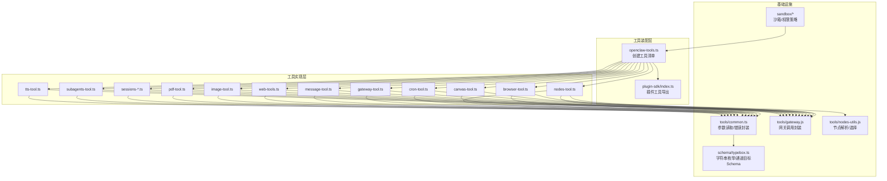
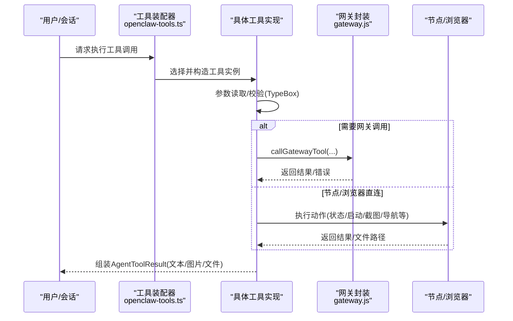
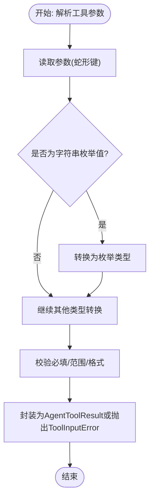
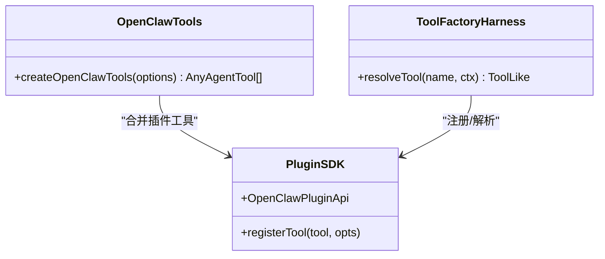
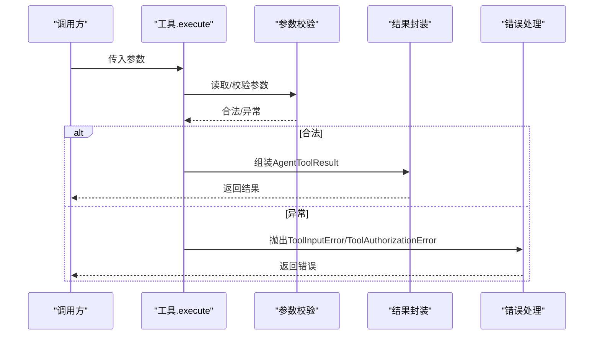
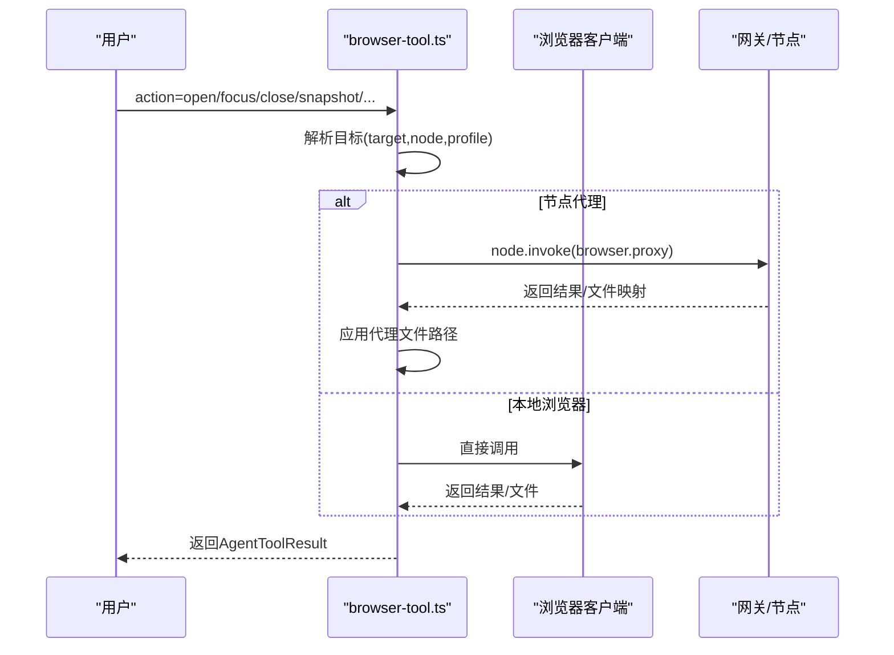
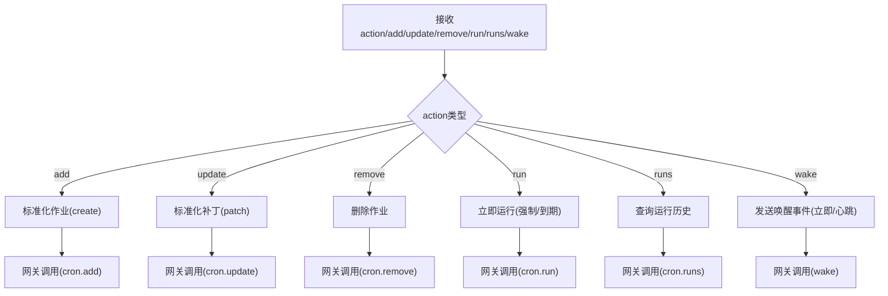
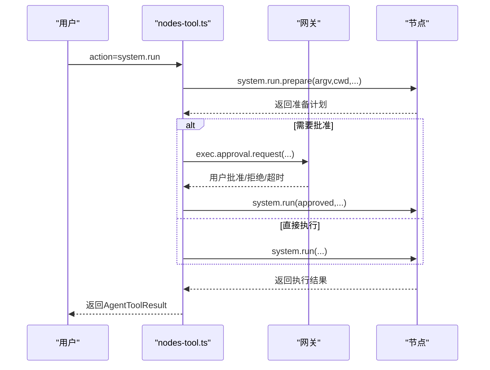
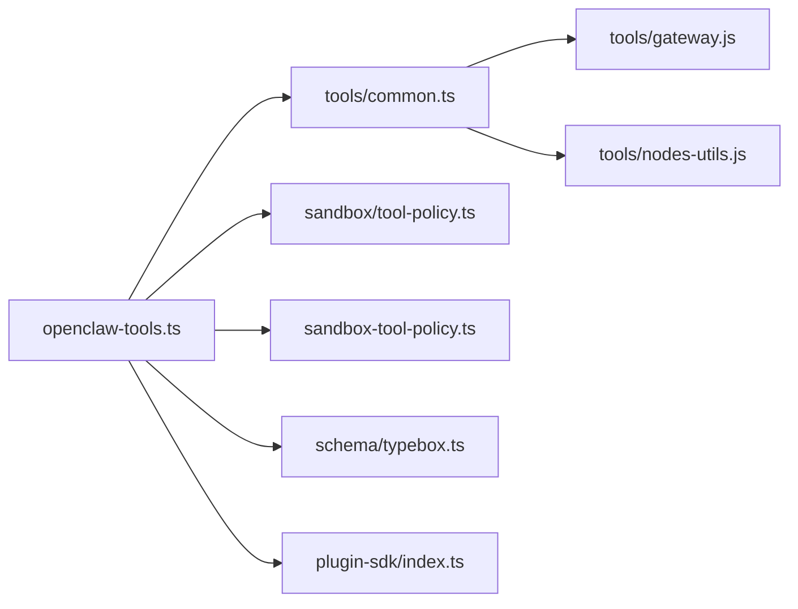

# 工具系统

<cite>
**本文引用的文件**
- [src/agents/openclaw-tools.ts](file://src/agents/openclaw-tools.ts)
- [src/agents/tools/common.ts](file://src/agents/tools/common.ts)
- [src/agents/tools/browser-tool.ts](file://src/agents/tools/browser-tool.ts)
- [src/agents/tools/canvas-tool.ts](file://src/agents/tools/canvas-tool.ts)
- [src/agents/tools/cron-tool.ts](file://src/agents/tools/cron-tool.ts)
- [src/agents/tools/nodes-tool.ts](file://src/agents/tools/nodes-tool.ts)
- [src/agents/tools/gateway-tool.ts](file://src/agents/tools/gateway-tool.ts)
- [src/agents/tools/message-tool.ts](file://src/agents/tools/message-tool.ts)
- [src/agents/tools/web-tools.ts](file://src/agents/tools/web-tools.ts)
- [src/agents/tools/image-tool.ts](file://src/agents/tools/image-tool.ts)
- [src/agents/tools/pdf-tool.ts](file://src/agents/tools/pdf-tool.ts)
- [src/agents/tools/sessions-*.ts](file://src/agents/tools/sessions-list-tool.ts)
- [src/agents/tools/sessions-*.ts](file://src/agents/tools/sessions-send-tool.ts)
- [src/agents/tools/sessions-*.ts](file://src/agents/tools/sessions-spawn-tool.ts)
- [src/agents/tools/sessions-*.ts](file://src/agents/tools/sessions-yield-tool.ts)
- [src/agents/tools/sessions-*.ts](file://src/agents/tools/sessions-history-tool.ts)
- [src/agents/tools/sessions-*.ts](file://src/agents/tools/sessions-status-tool.ts)
- [src/agents/tools/subagents-tool.ts](file://src/agents/tools/subagents-tool.ts)
- [src/agents/tools/tts-tool.ts](file://src/agents/tools/tts-tool.ts)
- [src/agents/tools/gateway.js](file://src/agents/tools/gateway.js)
- [src/agents/tools/nodes-utils.js](file://src/agents/tools/nodes-utils.js)
- [src/agents/schema/typebox.ts](file://src/agents/schema/typebox.ts)
- [src/agents/tool-policy.ts](file://src/agents/tool-policy.ts)
- [src/agents/sandbox/tool-policy.ts](file://src/agents/sandbox/tool-policy.ts)
- [src/agents/sandbox-tool-policy.ts](file://src/agents/sandbox-tool-policy.ts)
- [src/agents/sandbox-explain.test.ts](file://src/agents/sandbox-explain.test.ts)
- [src/plugin-sdk/index.ts](file://src/plugin-sdk/index.ts)
- [extensions/feishu/src/tool-factory-test-harness.ts](file://extensions/feishu/src/tool-factory-test-harness.ts)
- [ui/src/ui/views/agents-utils.ts](file://ui/src/ui/views/agents-utils.ts)
- [docs/cli/index.md](file://docs/cli/index.md)
- [docs/zh-CN/cli/index.md](file://docs/zh-CN/cli/index.md)
- [docs/concepts/typebox.md](file://docs/concepts/typebox.md)
</cite>

## 目录
1. [简介](#简介)
2. [项目结构](#项目结构)
3. [核心组件](#核心组件)
4. [架构总览](#架构总览)
5. [详细组件分析](#详细组件分析)
6. [依赖关系分析](#依赖关系分析)
7. [性能考量](#性能考量)
8. [故障排查指南](#故障排查指南)
9. [结论](#结论)
10. [附录](#附录)

## 简介
本文件系统性阐述 OpenClaw 工具系统的设计理念与实现架构，覆盖 TypeBox 类型系统在工具参数校验中的应用、工具注册与发现机制、工具调用流程、各类工具类型（浏览器控制、Canvas 渲染、定时任务 Cron、节点管理等）的实现要点，以及安全模型、权限控制与沙箱策略。同时提供工具开发指南、自定义工具创建步骤、工具配置与调试方法，并通过图示展示关键流程，帮助开发者快速理解与扩展工具体系。

## 项目结构
OpenClaw 的工具系统围绕“代理工具”（AgentTool）抽象构建，核心入口负责组装内置工具与插件工具，统一通过网关（Gateway）进行外部调用或节点命令执行。TypeBox 负责工具参数 Schema 的声明与校验；沙箱与权限策略在运行期对工具访问进行约束。

图表来源
- [src/agents/openclaw-tools.ts:30-241](file://src/agents/openclaw-tools.ts#L30-L241)
- [src/plugin-sdk/index.ts:1-800](file://src/plugin-sdk/index.ts#L1-L800)
- [src/agents/tools/browser-tool.ts:1-684](file://src/agents/tools/browser-tool.ts#L1-L684)
- [src/agents/tools/canvas-tool.ts:80-105](file://src/agents/tools/canvas-tool.ts#L80-L105)
- [src/agents/tools/cron-tool.ts:1-541](file://src/agents/tools/cron-tool.ts#L1-L541)
- [src/agents/tools/nodes-tool.ts:1-815](file://src/agents/tools/nodes-tool.ts#L1-L815)
- [src/agents/tools/gateway-tool.ts](file://src/agents/tools/gateway-tool.ts)
- [src/agents/tools/message-tool.ts](file://src/agents/tools/message-tool.ts)
- [src/agents/tools/web-tools.ts](file://src/agents/tools/web-tools.ts)
- [src/agents/tools/image-tool.ts](file://src/agents/tools/image-tool.ts)
- [src/agents/tools/pdf-tool.ts](file://src/agents/tools/pdf-tool.ts)
- [src/agents/tools/sessions-list-tool.ts](file://src/agents/tools/sessions-list-tool.ts)
- [src/agents/tools/sessions-send-tool.ts](file://src/agents/tools/sessions-send-tool.ts)
- [src/agents/tools/sessions-spawn-tool.ts](file://src/agents/tools/sessions-spawn-tool.ts)
- [src/agents/tools/sessions-yield-tool.ts](file://src/agents/tools/sessions-yield-tool.ts)
- [src/agents/tools/sessions-history-tool.ts](file://src/agents/tools/sessions-history-tool.ts)
- [src/agents/tools/sessions-status-tool.ts](file://src/agents/tools/sessions-status-tool.ts)
- [src/agents/tools/subagents-tool.ts](file://src/agents/tools/subagents-tool.ts)
- [src/agents/tools/tts-tool.ts](file://src/agents/tools/tts-tool.ts)
- [src/agents/tools/common.ts:1-328](file://src/agents/tools/common.ts#L1-L328)
- [src/agents/schema/typebox.ts:1-44](file://src/agents/schema/typebox.ts#L1-L44)
- [src/agents/tools/gateway.js](file://src/agents/tools/gateway.js)
- [src/agents/tools/nodes-utils.js](file://src/agents/tools/nodes-utils.js)

章节来源
- [src/agents/openclaw-tools.ts:30-241](file://src/agents/openclaw-tools.ts#L30-L241)
- [src/plugin-sdk/index.ts:1-800](file://src/plugin-sdk/index.ts#L1-L800)

## 核心组件
- 工具装配器：负责按会话上下文与配置生成工具清单，合并内置工具与插件工具。
- 工具基类与参数读取：统一的参数读取、类型转换、错误封装与结果包装。
- 网关调用封装：统一的网关 RPC 调用与超时、鉴权处理。
- 沙箱与权限策略：基于工具名与组的白名单/黑名单策略，支持全局与单个代理覆盖。
- TypeBox 类型系统：用于工具 Schema 声明，确保跨 Provider 的兼容性。

章节来源
- [src/agents/openclaw-tools.ts:30-241](file://src/agents/openclaw-tools.ts#L30-L241)
- [src/agents/tools/common.ts:1-328](file://src/agents/tools/common.ts#L1-L328)
- [src/agents/tools/gateway.js](file://src/agents/tools/gateway.js)
- [src/agents/schema/typebox.ts:1-44](file://src/agents/schema/typebox.ts#L1-L44)
- [src/agents/tool-policy.ts:1-211](file://src/agents/tool-policy.ts#L1-L211)
- [src/agents/sandbox/tool-policy.ts:1-87](file://src/agents/sandbox/tool-policy.ts#L1-L87)
- [src/agents/sandbox-tool-policy.ts:1-37](file://src/agents/sandbox-tool-policy.ts#L1-L37)

## 架构总览
工具系统采用“装配器 + 工具实现 + 网关/节点桥接”的分层设计。工具装配器根据会话与配置决定可用工具集；每个工具实现负责参数解析与调用路径选择（本地浏览器、节点代理、网关内部能力等）；网关封装统一处理鉴权、超时与错误；沙箱策略在运行期对工具访问进行限制。

图表来源
- [src/agents/openclaw-tools.ts:30-241](file://src/agents/openclaw-tools.ts#L30-L241)
- [src/agents/tools/browser-tool.ts:319-684](file://src/agents/tools/browser-tool.ts#L319-L684)
- [src/agents/tools/canvas-tool.ts:88-105](file://src/agents/tools/canvas-tool.ts#L88-L105)
- [src/agents/tools/cron-tool.ts:284-541](file://src/agents/tools/cron-tool.ts#L284-L541)
- [src/agents/tools/nodes-tool.ts:182-815](file://src/agents/tools/nodes-tool.ts#L182-L815)
- [src/agents/tools/gateway.js](file://src/agents/tools/gateway.js)

## 详细组件分析

### TypeBox 类型系统与工具 Schema
- 字符串枚举与可选枚举：通过 TypeBox 定义稳定的字符串枚举，避免 Provider 对 anyOf 的不兼容。
- 通道目标 Schema：为消息发送等场景提供统一的通道/目标描述。
- 工具 Schema：各工具以 Type.Object 声明参数结构，配合运行时参数读取函数完成校验与转换。

图表来源
- [src/agents/tools/common.ts:57-142](file://src/agents/tools/common.ts#L57-L142)
- [src/agents/schema/typebox.ts:15-43](file://src/agents/schema/typebox.ts#L15-L43)

章节来源
- [src/agents/schema/typebox.ts:1-44](file://src/agents/schema/typebox.ts#L1-L44)
- [src/agents/tools/common.ts:1-328](file://src/agents/tools/common.ts#L1-L328)

### 工具注册与发现机制
- 内置工具装配：工具装配器集中创建所有内置工具实例，注入会话、通道、账户等上下文。
- 插件工具集成：通过插件 SDK 导出工具，装配器去重后合并到最终工具列表。
- 工具工厂测试夹具：提供工具工厂的测试夹具，便于在测试中解析/调用已注册工具。

图表来源
- [src/agents/openclaw-tools.ts:219-241](file://src/agents/openclaw-tools.ts#L219-L241)
- [src/plugin-sdk/index.ts:1-800](file://src/plugin-sdk/index.ts#L1-L800)
- [extensions/feishu/src/tool-factory-test-harness.ts:37-76](file://extensions/feishu/src/tool-factory-test-harness.ts#L37-L76)

章节来源
- [src/agents/openclaw-tools.ts:30-241](file://src/agents/openclaw-tools.ts#L30-L241)
- [src/plugin-sdk/index.ts:1-800](file://src/plugin-sdk/index.ts#L1-L800)
- [extensions/feishu/src/tool-factory-test-harness.ts:37-76](file://extensions/feishu/src/tool-factory-test-harness.ts#L37-L76)

### 工具调用流程
- 参数读取与校验：统一使用工具参数读取函数，支持字符串、数组、数字、反应参数等。
- 结果封装：支持纯文本、图片、文件等多种内容类型，并进行图片清洗与安全限制。
- 错误处理：区分输入错误与授权错误，返回标准状态码与错误信息。

图表来源
- [src/agents/tools/common.ts:27-43](file://src/agents/tools/common.ts#L27-L43)
- [src/agents/tools/common.ts:217-269](file://src/agents/tools/common.ts#L217-L269)

章节来源
- [src/agents/tools/common.ts:1-328](file://src/agents/tools/common.ts#L1-L328)

### 浏览器控制工具
- 功能覆盖：状态查询、启动/停止、标签页管理、打开/聚焦/关闭、快照/截图、导航、控制台、PDF 保存、上传/对话框钩子、动作执行等。
- 目标选择：支持沙箱浏览器、宿主机浏览器、节点代理三种目标；自动/手动路由策略。
- 文件与截图：截图结果以文件形式返回，必要时进行图片清洗与 MIME 推断。

图表来源
- [src/agents/tools/browser-tool.ts:319-684](file://src/agents/tools/browser-tool.ts#L319-L684)

章节来源
- [src/agents/tools/browser-tool.ts:1-684](file://src/agents/tools/browser-tool.ts#L1-L684)

### Canvas 渲染工具
- 功能覆盖：画布呈现/隐藏、导航、JS 评估、快照、A2UI 推送/重置等。
- 节点解析：通过网关解析节点 ID，统一调用 node.invoke 执行命令。
- 图片与媒体：快照结果支持图片封装与清洗。

章节来源
- [src/agents/tools/canvas-tool.ts:80-105](file://src/agents/tools/canvas-tool.ts#L80-L105)
- [src/agents/tools/nodes-utils.js](file://src/agents/tools/nodes-utils.js)

### 定时任务工具（Cron）
- 功能覆盖：状态查询、任务列表、新增/更新/删除、立即运行、查看运行历史、发送唤醒事件。
- 作业构建：支持 at/every/cron 三种调度类型；payload 支持 systemEvent 与 agentTurn。
- 交付策略：支持 announce 或 webhook 回调；可从会话上下文推断默认投递目标。
- 上下文增强：在 systemEvent 中可附加最近对话上下文，提升任务执行语境质量。

图表来源
- [src/agents/tools/cron-tool.ts:284-541](file://src/agents/tools/cron-tool.ts#L284-L541)

章节来源
- [src/agents/tools/cron-tool.ts:1-541](file://src/agents/tools/cron-tool.ts#L1-L541)

### 节点管理工具
- 功能覆盖：节点状态、描述、待配对请求审批/拒绝、通知、相机拍照/视频、相册最新照片、屏幕录制、定位获取、设备信息/权限/健康、系统命令执行、通用命令调用。
- 权限与批准：系统命令执行需要批准，支持一次性/永久允许；未批准则阻断。
- 媒体返回：相机/屏幕录制等返回文件或图片，结合图片清洗策略。

图表来源
- [src/agents/tools/nodes-tool.ts:608-782](file://src/agents/tools/nodes-tool.ts#L608-L782)

章节来源
- [src/agents/tools/nodes-tool.ts:1-815](file://src/agents/tools/nodes-tool.ts#L1-L815)

### 其他工具类型
- 网关工具：封装对网关内部能力的调用，如配置查询、会话管理等。
- 消息工具：在指定通道/账户/线程上下文中发送消息。
- 网页工具：网页搜索与抓取，支持运行时元数据注入。
- 媒体工具：图像与 PDF 处理，支持图片清洗与 MIME 推断。
- 会话工具：列出/历史/发送/派生/挂起/状态等。
- 子代理工具：派生与管理子代理。
- TTS 工具：文本转语音。

章节来源
- [src/agents/tools/gateway-tool.ts](file://src/agents/tools/gateway-tool.ts)
- [src/agents/tools/message-tool.ts](file://src/agents/tools/message-tool.ts)
- [src/agents/tools/web-tools.ts](file://src/agents/tools/web-tools.ts)
- [src/agents/tools/image-tool.ts](file://src/agents/tools/image-tool.ts)
- [src/agents/tools/pdf-tool.ts](file://src/agents/tools/pdf-tool.ts)
- [src/agents/tools/sessions-list-tool.ts](file://src/agents/tools/sessions-list-tool.ts)
- [src/agents/tools/sessions-send-tool.ts](file://src/agents/tools/sessions-send-tool.ts)
- [src/agents/tools/sessions-spawn-tool.ts](file://src/agents/tools/sessions-spawn-tool.ts)
- [src/agents/tools/sessions-yield-tool.ts](file://src/agents/tools/sessions-yield-tool.ts)
- [src/agents/tools/sessions-history-tool.ts](file://src/agents/tools/sessions-history-tool.ts)
- [src/agents/tools/sessions-status-tool.ts](file://src/agents/tools/sessions-status-tool.ts)
- [src/agents/tools/subagents-tool.ts](file://src/agents/tools/subagents-tool.ts)
- [src/agents/tools/tts-tool.ts](file://src/agents/tools/tts-tool.ts)

## 依赖关系分析
- 工具装配器依赖：TypeBox（Schema）、工具公共模块（参数读取/封装）、网关封装、节点工具集。
- 权限与沙箱：工具策略与沙箱策略共同决定工具可用性；支持按代理覆盖与全局默认。
- 插件生态：通过插件 SDK 注册工具，装配器去重后合并。

图表来源
- [src/agents/openclaw-tools.ts:30-241](file://src/agents/openclaw-tools.ts#L30-L241)
- [src/agents/tools/common.ts:1-328](file://src/agents/tools/common.ts#L1-L328)
- [src/agents/sandbox/tool-policy.ts:1-87](file://src/agents/sandbox/tool-policy.ts#L1-L87)
- [src/agents/sandbox-tool-policy.ts:1-37](file://src/agents/sandbox-tool-policy.ts#L1-L37)
- [src/agents/schema/typebox.ts:1-44](file://src/agents/schema/typebox.ts#L1-L44)
- [src/plugin-sdk/index.ts:1-800](file://src/plugin-sdk/index.ts#L1-L800)
- [src/agents/tools/gateway.js](file://src/agents/tools/gateway.js)
- [src/agents/tools/nodes-utils.js](file://src/agents/tools/nodes-utils.js)

章节来源
- [src/agents/openclaw-tools.ts:30-241](file://src/agents/openclaw-tools.ts#L30-L241)
- [src/agents/sandbox/tool-policy.ts:1-87](file://src/agents/sandbox/tool-policy.ts#L1-L87)
- [src/agents/sandbox-tool-policy.ts:1-37](file://src/agents/sandbox-tool-policy.ts#L1-L37)
- [src/agents/tool-policy.ts:1-211](file://src/agents/tool-policy.ts#L1-L211)

## 性能考量
- 参数读取与校验：尽量使用统一的参数读取函数，减少重复解析与类型转换开销。
- 网关调用：合理设置超时与重试策略，避免阻塞工具执行。
- 媒体处理：图片清洗与文件写入可能带来 IO 开销，建议在需要时启用并限制尺寸/数量。
- 沙箱策略：在工具较多时，优先使用组别与通配策略，减少细粒度匹配成本。

## 故障排查指南
- 输入参数错误：检查工具 Schema 与参数读取逻辑，确认必填项与类型是否满足。
- 授权受限：确认工具 ownerOnly 标记与当前发送者身份；检查沙箱策略与工具策略。
- 网关/节点不可达：检查网关 URL/Token、节点连接状态与命令支持情况。
- 浏览器目标冲突：当使用用户浏览器档案时，禁止与节点目标混用；确认 target 与 profile 的组合。
- 节点系统命令未批准：等待用户批准或检查批准流程与超时设置。

章节来源
- [src/agents/tools/common.ts:27-43](file://src/agents/tools/common.ts#L27-L43)
- [src/agents/tools/browser-tool.ts:326-343](file://src/agents/tools/browser-tool.ts#L326-L343)
- [src/agents/tools/nodes-tool.ts:694-731](file://src/agents/tools/nodes-tool.ts#L694-L731)

## 结论
OpenClaw 工具系统以 TypeBox 保证 Schema 的跨 Provider 友好性，以装配器统一管理工具生命周期，以网关封装与节点桥接实现对外部能力的统一访问，并通过沙箱与权限策略保障安全可控。该体系既便于内置工具扩展，也支持插件生态的工具注册与发现，适合在多平台、多通道、多节点环境下稳定运行。

## 附录

### 工具开发指南
- 使用 TypeBox 定义工具 Schema，优先使用字符串枚举而非 anyOf。
- 在工具实现中统一使用参数读取函数，确保错误信息一致。
- 将工具注册到装配器，必要时提供插件接口供第三方扩展。
- 对媒体输出进行清洗与 MIME 推断，避免上下文膨胀。

章节来源
- [src/agents/schema/typebox.ts:1-44](file://src/agents/schema/typebox.ts#L1-L44)
- [src/agents/tools/common.ts:57-142](file://src/agents/tools/common.ts#L57-L142)
- [src/agents/openclaw-tools.ts:30-241](file://src/agents/openclaw-tools.ts#L30-L241)
- [src/plugin-sdk/index.ts:1-800](file://src/plugin-sdk/index.ts#L1-L800)

### 自定义工具创建步骤
- 定义工具 Schema（TypeBox），声明参数与可选枚举。
- 实现工具 execute 函数，使用参数读取函数解析输入。
- 选择调用路径：本地动作、网关调用或节点命令。
- 封装 AgentToolResult，必要时进行图片清洗与文件处理。
- 通过插件 SDK 注册工具，或在装配器中加入工具清单。

章节来源
- [src/agents/tools/common.ts:217-269](file://src/agents/tools/common.ts#L217-L269)
- [src/plugin-sdk/index.ts:1-800](file://src/plugin-sdk/index.ts#L1-L800)
- [extensions/feishu/src/tool-factory-test-harness.ts:37-76](file://extensions/feishu/src/tool-factory-test-harness.ts#L37-L76)

### 工具配置与调试
- CLI 参考：浏览器与 Canvas 相关命令行选项与子命令。
- UI 工具分类：在 UI 中可见的工具分组与用途说明。
- 文档参考：TypeBox Schema 示例与最小客户端示例。

章节来源
- [docs/cli/index.md:1053-1089](file://docs/cli/index.md#L1053-L1089)
- [docs/zh-CN/cli/index.md:949-985](file://docs/zh-CN/cli/index.md#L949-L985)
- [ui/src/ui/views/agents-utils.ts:73-115](file://ui/src/ui/views/agents-utils.ts#L73-L115)
- [docs/concepts/typebox.md:146-220](file://docs/concepts/typebox.md#L146-L220)

### 沙箱与权限策略详解
- 策略来源优先级：代理覆盖 > 全局 > 默认。
- 组展开与优先级：deny 优先于 allow，组别展开后仍遵循 deny 覆盖。
- 策略来源标注：记录 allow/deny 的来源字段，便于审计与排错。

章节来源
- [src/agents/sandbox/tool-policy.ts:35-87](file://src/agents/sandbox/tool-policy.ts#L35-L87)
- [src/agents/sandbox-explain.test.ts:8-34](file://src/agents/sandbox-explain.test.ts#L8-L34)
- [src/agents/sandbox-tool-policy.ts:21-37](file://src/agents/sandbox-tool-policy.ts#L21-L37)