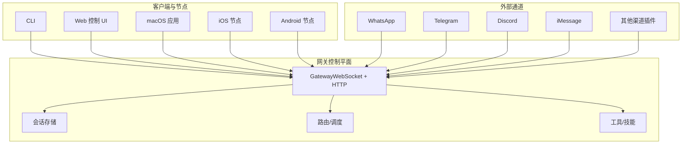
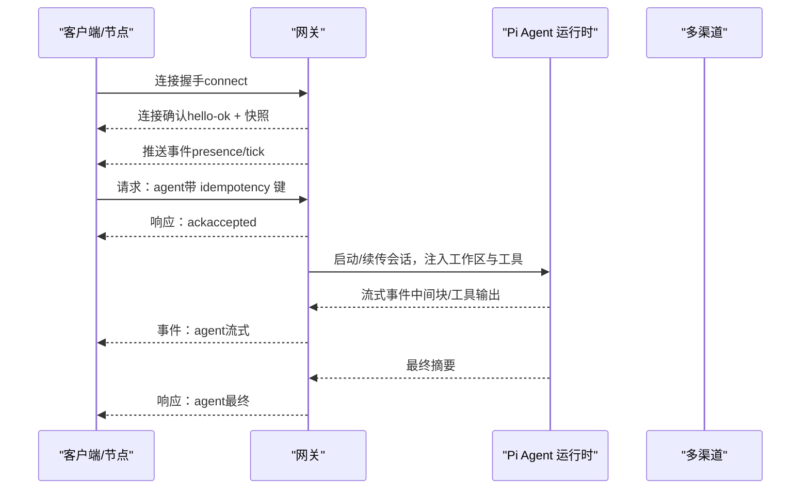
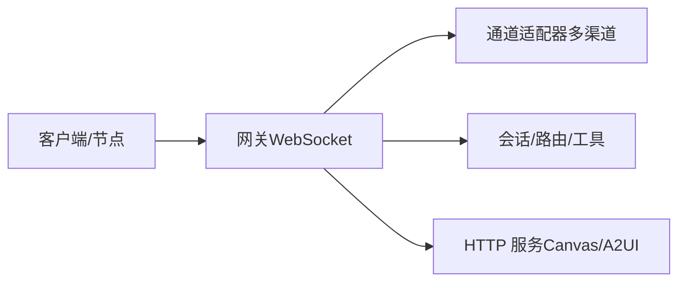
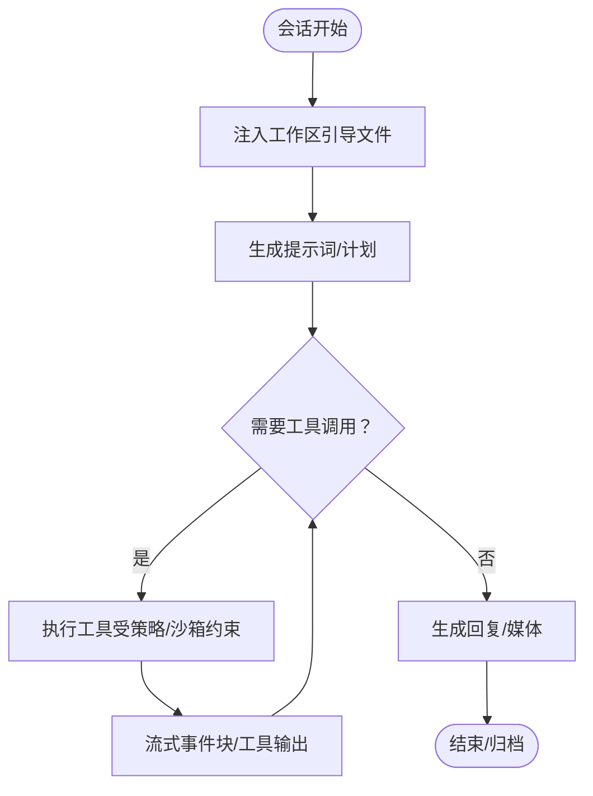
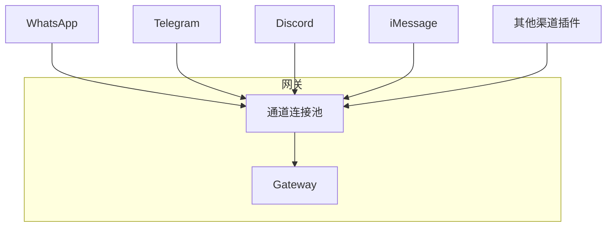
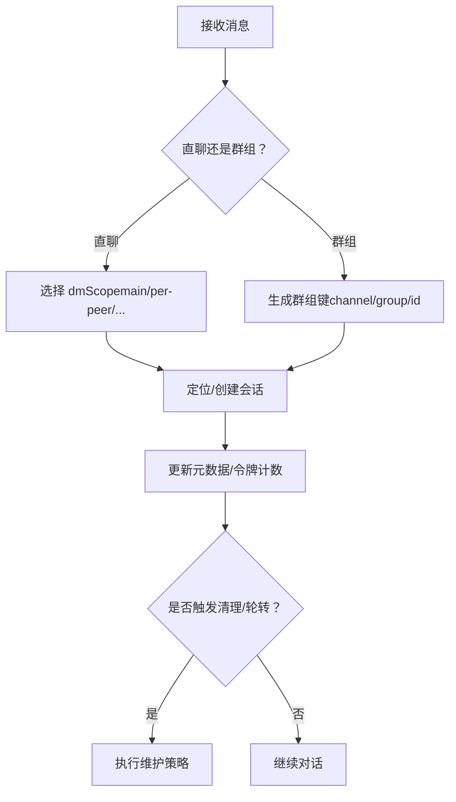
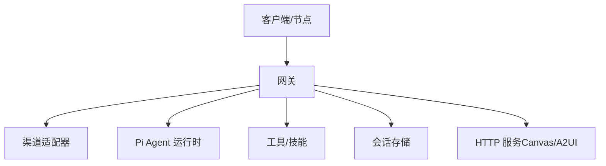

# 核心概念

<cite>
**本文引用的文件**
- [README.md](file://README.md)
- [docs/index.md](file://docs/index.md)
- [docs/concepts/architecture.md](file://docs/concepts/architecture.md)
- [docs/start/openclaw.md](file://docs/start/openclaw.md)
- [docs/concepts/agent.md](file://docs/concepts/agent.md)
- [docs/concepts/session.md](file://docs/concepts/session.md)
- [docs/concepts/features.md](file://docs/concepts/features.md)
</cite>

## 目录
1. [引言](#引言)
2. [项目结构](#项目结构)
3. [核心组件](#核心组件)
4. [架构总览](#架构总览)
5. [详细组件分析](#详细组件分析)
6. [依赖关系分析](#依赖关系分析)
7. [性能考量](#性能考量)
8. [故障排查指南](#故障排查指南)
9. [结论](#结论)
10. [附录](#附录)

## 引言
本篇“核心概念”面向希望理解 OpenClaw 基本理念与架构设计的读者，重点解释以下主题：
- 网关系统（Gateway）作为统一控制平面的角色与职责
- Pi Agent 运行时在 RPC 模式下的工作原理
- 多渠道即时通讯集成的实现方式与路由策略
- 会话管理、代理路由、工具系统的设计思想
- 本地优先的架构优势、安全性考虑与可扩展性设计

OpenClaw 是一个“自托管”的个人 AI 助手平台，通过单一网关连接多种消息渠道（如 WhatsApp、Telegram、Discord、iMessage 等），并将它们与以 Pi 为代表的编码型智能体连接起来。其产品形态是“助手”，而网关是“控制平面”。

章节来源
- [README.md:21-26](file://README.md#L21-L26)
- [docs/index.md:44-58](file://docs/index.md#L44-L58)

## 项目结构
从用户视角看，OpenClaw 的关键组成包括：
- 网关（Gateway）：单一控制平面，负责会话、通道、工具与事件的统一管理，并通过 WebSocket 对外提供类型化 API
- 客户端与节点（Clients/Nodes）：包括 macOS 应用、CLI、Web 控制界面、iOS/Android 节点等，均通过 WebSocket 与网关交互
- Pi Agent 运行时：嵌入式运行时（基于 pi-mono），在 RPC 模式下执行工具调用与流式输出
- 工具系统：内置系统工具与技能生态，支持沙箱与权限策略
- 会话模型：按发送者/频道/群组隔离或共享的会话键空间与持久化存储

图表来源
- [docs/concepts/architecture.md:12-26](file://docs/concepts/architecture.md#L12-L26)
- [docs/concepts/architecture.md:29-47](file://docs/concepts/architecture.md#L29-L47)
- [docs/concepts/features.md:33-48](file://docs/concepts/features.md#L33-L48)

章节来源
- [docs/index.md:59-71](file://docs/index.md#L59-L71)
- [docs/concepts/architecture.md:12-26](file://docs/concepts/architecture.md#L12-L26)

## 核心组件
- 网关（Gateway）
  - 维护各渠道连接，暴露类型化的 WebSocket API，校验帧并发出事件（agent、chat、presence、health、heartbeat、cron）
  - 提供 Canvas/A2UI 主机服务，使用与网关相同的端口
  - 作为会话与状态的唯一真相来源，所有 UI 客户端需向网关查询会话列表与令牌统计
- 客户端与节点
  - 控制面客户端（macOS 应用、CLI、Web UI、自动化）通过 WebSocket 订阅事件与发起请求
  - 设备节点（macOS/iOS/Android/headless）以 role=node 连接，声明能力与命令集；设备配对基于设备身份
- Pi Agent 运行时
  - 嵌入式运行时（基于 pi-mono），在 RPC 模式下执行工具调用与流式输出
  - 工作区（workspace）为工具与上下文的唯一工作目录，注入 AGENTS/SOUL/TOOLS 等引导文件
  - 支持队列模式（steer/followup/collect）、块级流式输出、思维/详细度级别等运行参数
- 会话管理
  - 直聊默认主键（main）收敛到统一会话；群组/频道隔离；支持 per-peer/per-channel-peer 等隔离策略
  - 会话存储位于网关主机，采用 sessions.json 映射与 JSONL 转录文件；支持维护策略（裁剪、轮转、磁盘预算）
- 工具系统
  - 内置系统工具（读/写/编辑/进程等），受工具策略与沙箱限制
  - 技能加载顺序：打包内置 → 本地管理 → 工作区覆盖；可通过配置/环境变量进行门控

章节来源
- [docs/concepts/architecture.md:29-47](file://docs/concepts/architecture.md#L29-L47)
- [docs/concepts/agent.md:10-47](file://docs/concepts/agent.md#L10-L47)
- [docs/concepts/session.md:57-72](file://docs/concepts/session.md#L57-L72)
- [docs/concepts/features.md:33-48](file://docs/concepts/features.md#L33-L48)

## 架构总览
OpenClaw 的架构以“网关为中心”的单控制平面为核心，所有消息表面（多渠道）与客户端/节点均通过 WebSocket 与网关交互。网关负责：
- 通道连接与消息路由
- 会话生命周期与状态持久化
- 代理运行时的工具调用与流式输出
- 事件推送与健康监控

图表来源
- [docs/concepts/architecture.md:61-78](file://docs/concepts/architecture.md#L61-L78)
- [docs/concepts/architecture.md:80-92](file://docs/concepts/architecture.md#L80-L92)

章节来源
- [docs/concepts/architecture.md:12-26](file://docs/concepts/architecture.md#L12-L26)
- [docs/concepts/architecture.md:80-92](file://docs/concepts/architecture.md#L80-L92)

## 详细组件分析

### 网关（Gateway）作为控制平面
- 单一网关拥有所有消息表面（WhatsApp、Telegram、Discord、iMessage、WebChat 等）
- 控制面客户端与设备节点共用同一 WebSocket 服务器，前者 role 非 node
- Canvas/A2UI 由网关 HTTP 服务提供，端口与网关一致
- 类型化 WS API：请求/响应/事件；严格 JSON Schema 校验；事件不重放，客户端需刷新

图表来源
- [docs/concepts/architecture.md:12-26](file://docs/concepts/architecture.md#L12-L26)
- [docs/concepts/architecture.md:29-47](file://docs/concepts/architecture.md#L29-L47)

章节来源
- [docs/concepts/architecture.md:12-26](file://docs/concepts/architecture.md#L12-L26)
- [docs/concepts/architecture.md:29-47](file://docs/concepts/architecture.md#L29-L47)

### Pi Agent 运行时（RPC 模式）
- 嵌入式运行时（基于 pi-mono），在 RPC 模式下执行工具调用与流式输出
- 工作区为工具与上下文的唯一工作目录，首次会话注入 AGENTS/SOUL/TOOLS 等引导文件
- 支持队列模式（steer/followup/collect）、块级流式输出、思维/详细度级别等运行参数
- 会话转录存储于网关主机，路径稳定且可追溯

图表来源
- [docs/concepts/agent.md:24-47](file://docs/concepts/agent.md#L24-L47)
- [docs/concepts/agent.md:73-81](file://docs/concepts/agent.md#L73-L81)
- [docs/concepts/agent.md:82-104](file://docs/concepts/agent.md#L82-L104)

章节来源
- [docs/concepts/agent.md:10-47](file://docs/concepts/agent.md#L10-L47)
- [docs/concepts/agent.md:73-104](file://docs/concepts/agent.md#L73-L104)

### 多渠道即时通讯集成与路由
- 渠道适配器（Baileys/grammY/discord.js/…）由网关统一维护，避免重复登录与冲突
- 设备节点（iOS/Android/macOS）通过 WebSocket 以 role=node 连接，声明能力与命令集
- WebChat 使用网关 WS API 获取历史与发送消息；远程部署通过 Tailscale/SSH 隧道访问

图表来源
- [docs/concepts/architecture.md:14-21](file://docs/concepts/architecture.md#L14-L21)
- [docs/concepts/architecture.md:53-57](file://docs/concepts/architecture.md#L53-L57)
- [docs/concepts/features.md:33-48](file://docs/concepts/features.md#L33-L48)

章节来源
- [docs/concepts/architecture.md:14-21](file://docs/concepts/architecture.md#L14-L21)
- [docs/concepts/architecture.md:53-57](file://docs/concepts/architecture.md#L53-L57)
- [docs/concepts/features.md:33-48](file://docs/concepts/features.md#L33-L48)

### 会话管理（键空间、隔离与持久化）
- 直聊默认收敛到主键（main）；群组/频道隔离；支持 per-peer/per-channel-peer 等隔离策略
- 会话存储位于网关主机，sessions.json 映射 + JSONL 转录文件；支持维护策略（裁剪、轮转、磁盘预算）
- 生命周期：按每日/空闲策略重置；支持按类型/按渠道覆盖；支持发送策略规则

图表来源
- [docs/concepts/session.md:10-20](file://docs/concepts/session.md#L10-L20)
- [docs/concepts/session.md:189-206](file://docs/concepts/session.md#L189-L206)
- [docs/concepts/session.md:88-120](file://docs/concepts/session.md#L88-L120)

章节来源
- [docs/concepts/session.md:57-72](file://docs/concepts/session.md#L57-L72)
- [docs/concepts/session.md:189-206](file://docs/concepts/session.md#L189-L206)
- [docs/concepts/session.md:88-120](file://docs/concepts/session.md#L88-L120)

### 代理路由与多代理隔离
- 支持按工作区/发送者/账户/频道等维度进行多代理路由与会话隔离
- 通过会话键空间与重置策略实现跨设备/跨渠道的一致体验
- 在多用户/多账号场景中，建议启用更严格的 DM 隔离策略，避免上下文泄露

章节来源
- [docs/concepts/session.md:10-20](file://docs/concepts/session.md#L10-L20)
- [docs/concepts/session.md:20-56](file://docs/concepts/session.md#L20-L56)

### 工具系统与安全策略
- 内置系统工具（读/写/编辑/进程等），受工具策略与沙箱限制
- 技能加载顺序：打包内置 → 本地管理 → 工作区覆盖；可通过配置/环境变量进行门控
- 默认：主会话工具在主机上运行；群组/频道会话可启用 per-session Docker 沙箱，允许/禁止特定工具

章节来源
- [docs/concepts/agent.md:49-64](file://docs/concepts/agent.md#L49-L64)
- [README.md:332-338](file://README.md#L332-L338)

## 依赖关系分析
- 组件内聚与耦合
  - 网关高度内聚：通道连接、会话管理、工具调度、事件推送均由网关统一处理
  - 客户端/节点低耦合：通过类型化 WS API 与网关交互，角色区分明确（node 与非 node）
- 直接与间接依赖
  - 渠道适配器（Baileys/grammY/discord.js/…）为直接依赖
  - Pi Agent 运行时与工具系统为间接依赖，通过 RPC 与工具策略解耦
- 可能的循环依赖
  - 无显式循环依赖迹象；客户端/节点仅消费网关 API，不反向依赖网关内部实现
- 外部依赖与集成点
  - Tailscale/SSH 隧道用于远程访问
  - OAuth/订阅式认证（Anthropic/OpenAI）用于模型提供商

图表来源
- [docs/concepts/architecture.md:12-26](file://docs/concepts/architecture.md#L12-L26)
- [docs/concepts/architecture.md:29-47](file://docs/concepts/architecture.md#L29-L47)

章节来源
- [docs/concepts/architecture.md:12-26](file://docs/concepts/architecture.md#L12-L26)
- [docs/concepts/architecture.md:29-47](file://docs/concepts/architecture.md#L29-L47)

## 性能考量
- 会话存储写入路径的维护开销：大型会话存储可能增加写延迟，建议生产环境启用 enforce 模式并设置时间/数量/磁盘预算上限
- 块级流式输出与工具调用频率：合理配置块边界与合并策略，减少细粒度消息带来的网络与渲染压力
- 远程访问与传输：Tailscale/SSH 隧道与 WS 加密在安全性与性能之间权衡

章节来源
- [docs/concepts/session.md:101-120](file://docs/concepts/session.md#L101-L120)
- [docs/concepts/agent.md:94-104](file://docs/concepts/agent.md#L94-L104)

## 故障排查指南
- 安全与权限
  - 默认：未知发送者 DM 需要配对码；可通过配对批准流程加入本地白名单
  - 公开 DM 需显式开启并包含通配符允许列表
- 远程访问
  - Tailscale Serve/Funnel 或 SSH 隧道；远程访问需遵循网关认证与授权策略
- 运维快照
  - 启动：openclaw gateway；健康：WS health；守护：launchd/systemd 自启
- 诊断命令
  - openclaw status / openclaw health --json；必要时使用 openclaw doctor

章节来源
- [README.md:112-125](file://README.md#L112-L125)
- [docs/concepts/architecture.md:117-134](file://docs/concepts/architecture.md#L117-L134)

## 结论
OpenClaw 以“网关为中心”的架构实现了多渠道、多代理、多节点的统一控制与协作。通过：
- 网关作为控制平面，集中管理通道、会话与工具
- Pi Agent 运行时在 RPC 模式下执行工具与流式输出
- 严格的会话隔离与安全策略，保障多用户/多账号场景下的隐私与一致性
- 本地优先与可扩展设计，兼顾易用性与规模化运维

这一设计使 OpenClaw 成为一个“始终在线、本地优先、可扩展、可治理”的个人 AI 助手平台。

## 附录
- 快速开始与向导：参见 [Getting started:63-82](file://README.md#L63-L82) 与 [Personal Assistant Setup:44-68](file://docs/start/openclaw.md#L44-L68)
- 配置参考：参见 [Gateway configuration:318-331](file://README.md#L318-L331)
- 安全指南：参见 [Security:332-338](file://README.md#L332-L338)