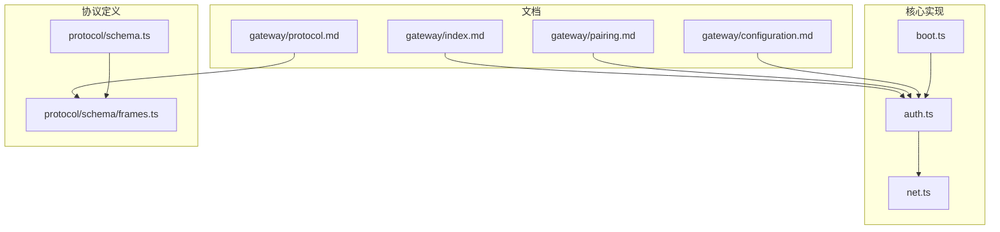
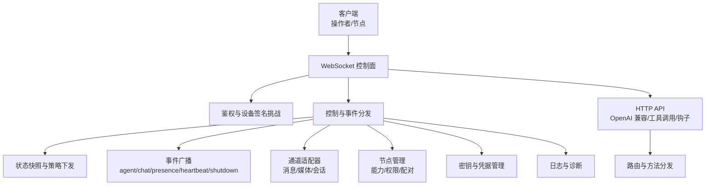
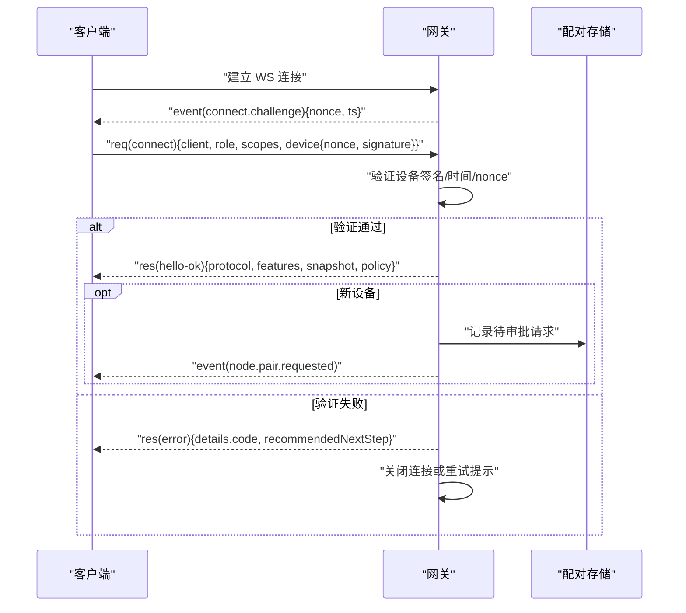
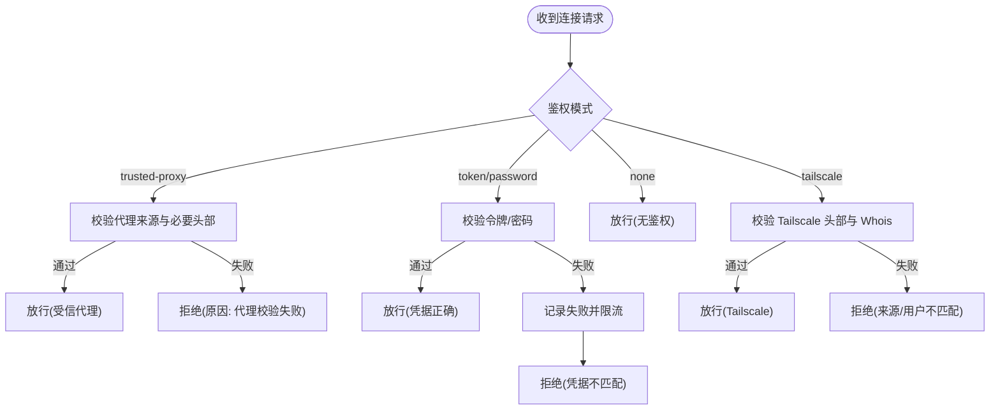
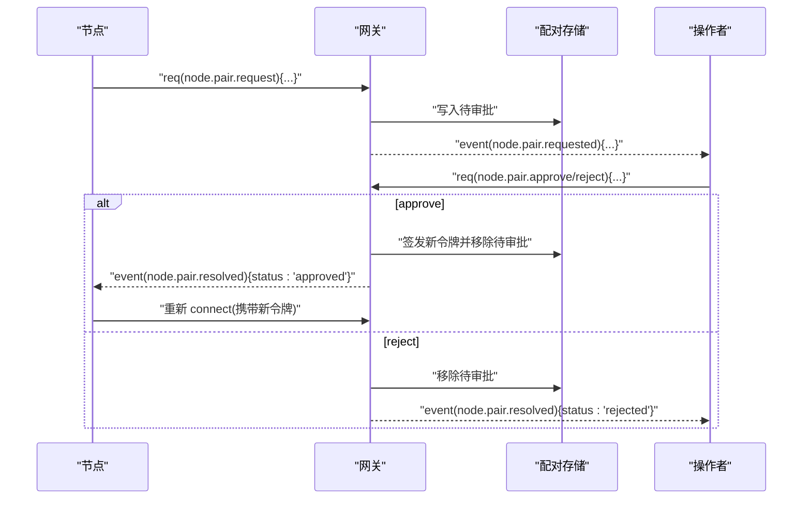
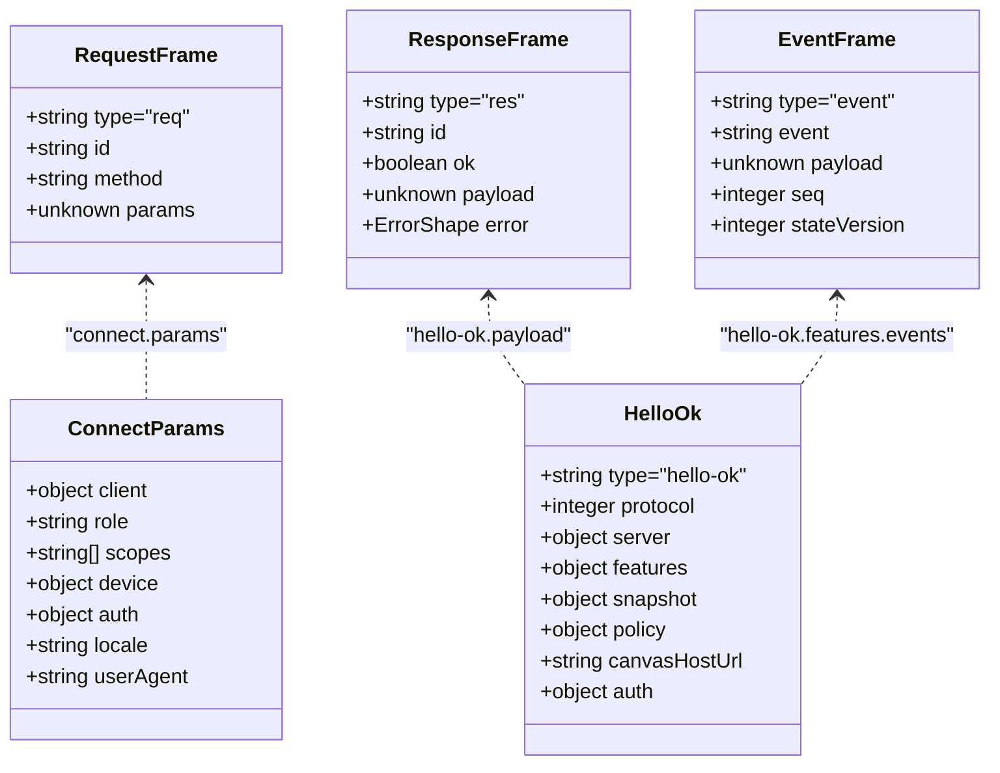
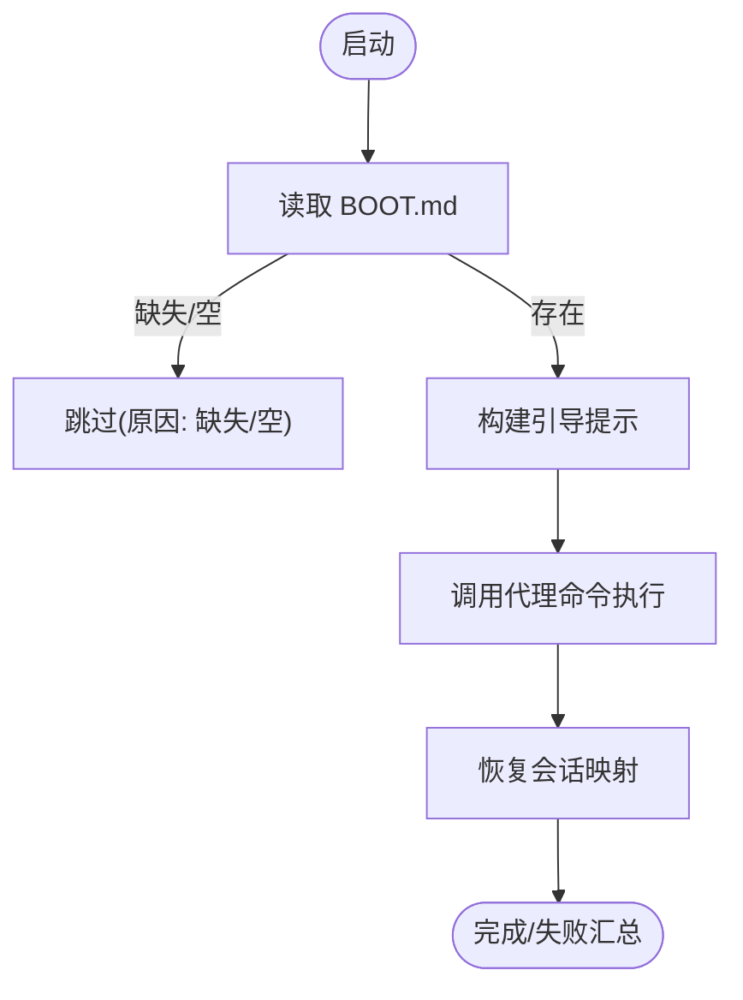
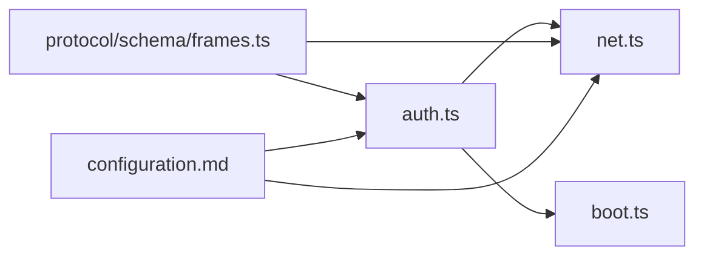

# 网关架构

<cite>
**本文引用的文件**   
- [docs/gateway/index.md](file://docs/gateway/index.md)
- [docs/gateway/protocol.md](file://docs/gateway/protocol.md)
- [docs/gateway/pairing.md](file://docs/gateway/pairing.md)
- [docs/gateway/configuration.md](file://docs/gateway/configuration.md)
- [src/gateway/auth.ts](file://src/gateway/auth.ts)
- [src/gateway/net.ts](file://src/gateway/net.ts)
- [src/gateway/boot.ts](file://src/gateway/boot.ts)
- [src/gateway/protocol/schema.ts](file://src/gateway/protocol/schema.ts)
- [src/gateway/protocol/schema/frames.ts](file://src/gateway/protocol/schema/frames.ts)
</cite>

## 目录
1. [简介](#简介)
2. [项目结构](#项目结构)
3. [核心组件](#核心组件)
4. [架构总览](#架构总览)
5. [详细组件分析](#详细组件分析)
6. [依赖关系分析](#依赖关系分析)
7. [性能考量](#性能考量)
8. [故障排查指南](#故障排查指南)
9. [结论](#结论)
10. [附录](#附录)

## 简介
本文件面向 OpenClaw 网关的控制平面与节点传输通道，系统性阐述以下主题：
- 控制平面职责：维护提供商连接、暴露类型化 WebSocket API、验证入站帧、发出各类事件、执行会话与健康监控、承载 HTTP API（兼容 OpenAI 风格）、以及控制 UI 与钩子端点。
- 客户端与节点：mac 应用、CLI、Web UI、自动化工具作为“操作者”角色；节点（macOS/iOS/Android/headless）作为“节点”角色，二者通过统一的 WebSocket 协议握手并声明角色与作用域。
- 连接生命周期：从首次连接挑战到握手完成、状态快照下发、事件广播与请求响应、断开与优雅关闭。
- 协议细节：帧格式、版本协商、鉴权与设备身份、配对流程与本地信任模型、TLS 与证书指纹校验。
- 实际配置与最佳实践：端口与绑定优先级、热重载模式、认证策略、可信代理、Tailscale 头部透传、安全策略与私有网络白名单。

## 项目结构
围绕网关的关键目录与文件：
- 文档层：gateway 相关运行手册、协议规范、配对说明、配置参考与示例。
- 核心实现层：鉴权与网络解析、协议帧定义、启动引导逻辑。
- 协议层：TypeBox 定义的帧与模型，生成与校验工具链。

图表来源
- [docs/gateway/index.md:1-262](file://docs/gateway/index.md#L1-L262)
- [docs/gateway/protocol.md:1-268](file://docs/gateway/protocol.md#L1-L268)
- [docs/gateway/pairing.md:1-100](file://docs/gateway/pairing.md#L1-L100)
- [docs/gateway/configuration.md:1-634](file://docs/gateway/configuration.md#L1-L634)
- [src/gateway/auth.ts:1-495](file://src/gateway/auth.ts#L1-L495)
- [src/gateway/net.ts:1-482](file://src/gateway/net.ts#L1-L482)
- [src/gateway/boot.ts:1-204](file://src/gateway/boot.ts#L1-L204)
- [src/gateway/protocol/schema.ts:1-19](file://src/gateway/protocol/schema.ts#L1-L19)
- [src/gateway/protocol/schema/frames.ts:1-165](file://src/gateway/protocol/schema/frames.ts#L1-L165)

章节来源
- [docs/gateway/index.md:1-262](file://docs/gateway/index.md#L1-L262)
- [docs/gateway/protocol.md:1-268](file://docs/gateway/protocol.md#L1-L268)
- [docs/gateway/pairing.md:1-100](file://docs/gateway/pairing.md#L1-L100)
- [docs/gateway/configuration.md:1-634](file://docs/gateway/configuration.md#L1-L634)
- [src/gateway/auth.ts:1-495](file://src/gateway/auth.ts#L1-L495)
- [src/gateway/net.ts:1-482](file://src/gateway/net.ts#L1-L482)
- [src/gateway/boot.ts:1-204](file://src/gateway/boot.ts#L1-L204)
- [src/gateway/protocol/schema.ts:1-19](file://src/gateway/protocol/schema.ts#L1-L19)
- [src/gateway/protocol/schema/frames.ts:1-165](file://src/gateway/protocol/schema/frames.ts#L1-L165)

## 核心组件
- 鉴权与网络
  - 鉴权模式解析与授权：支持无鉴权、令牌、密码、可信代理、Tailscale 头部透传；速率限制与失败回退；支持设备签名挑战与迁移兼容。
  - 网络解析：主机名与地址解析、X-Forwarded-For/X-Real-IP 解析、可信代理判定、本地/私网/环回地址识别、绑定主机选择与安全 WS URL 校验。
- 协议与帧
  - 帧类型：请求、响应、事件；握手 connect 流程；Hello OK 快照与策略下发；错误结构体；方法与事件能力清单。
  - 版本协商：最小/最大协议版本；TypeBox 模型与生成脚本。
- 启动引导
  - 引导检查与一次性任务：读取工作区 BOOT.md，构建会话上下文，调用代理命令执行，失败回滚映射恢复。
- 配置与运行
  - 端口与绑定优先级、热重载模式、HTTP/WS/控制 UI 的认证边界、远程访问与 SSH 隧道、服务生命周期与多实例隔离。

章节来源
- [src/gateway/auth.ts:1-495](file://src/gateway/auth.ts#L1-L495)
- [src/gateway/net.ts:1-482](file://src/gateway/net.ts#L1-L482)
- [src/gateway/protocol/schema/frames.ts:1-165](file://src/gateway/protocol/schema/frames.ts#L1-L165)
- [src/gateway/boot.ts:1-204](file://src/gateway/boot.ts#L1-L204)
- [docs/gateway/index.md:70-124](file://docs/gateway/index.md#L70-L124)
- [docs/gateway/configuration.md:436-475](file://docs/gateway/configuration.md#L436-L475)

## 架构总览
下图展示网关作为控制平面的总体交互：客户端（操作者/节点）通过 WebSocket 连接，经鉴权与设备签名挑战后进入控制与事件通道；同时承载 HTTP API 与控制 UI；通道侧负责路由与转发。

图表来源
- [docs/gateway/protocol.md:10-268](file://docs/gateway/protocol.md#L10-L268)
- [docs/gateway/index.md:68-124](file://docs/gateway/index.md#L68-L124)
- [src/gateway/auth.ts:369-495](file://src/gateway/auth.ts#L369-L495)

## 详细组件分析

### WebSocket 协议与握手
- 传输与首帧约束：文本帧 JSON，首个帧必须是 connect 请求。
- 握手阶段：
  - 网关在连接建立后发送 connect.challenge（包含随机 nonce 与时间戳）。
  - 客户端需使用服务器提供的 nonce 进行设备签名，并在 connect.params.device 中回传 nonce，以证明设备身份与时间有效性。
  - 成功后返回 hello-ok，包含协议版本、特性清单、初始快照与策略（如心跳间隔）。
- 角色与作用域：
  - 操作者（operator）：控制平面客户端，具备只读/写/管理/审批/配对等作用域。
  - 节点（node）：能力宿主，声明能力类别、命令白名单与权限开关，由网关进行服务端允许列表校验。
- 方法与事件：
  - 请求/响应帧用于方法调用；事件帧用于状态与系统通知广播。
  - 常见事件：connect.challenge、agent、chat、presence、tick、health、heartbeat、shutdown。
- 设备身份与配对：
  - 节点应携带稳定的设备标识（公钥指纹派生），网关签发按设备+角色的作用域令牌；新设备默认需要批准，本地连接可自动批准。
- TLS 与证书固定：
  - 支持 WSS；可配置证书指纹以进行客户端固定校验。

图表来源
- [docs/gateway/protocol.md:22-90](file://docs/gateway/protocol.md#L22-L90)
- [docs/gateway/protocol.md:216-262](file://docs/gateway/protocol.md#L216-L262)
- [docs/gateway/pairing.md:27-71](file://docs/gateway/pairing.md#L27-L71)

章节来源
- [docs/gateway/protocol.md:10-268](file://docs/gateway/protocol.md#L10-L268)
- [docs/gateway/pairing.md:1-100](file://docs/gateway/pairing.md#L1-L100)

### 鉴权与可信代理/Tailscale
- 模式解析：
  - 支持 none/token/password/trusted-proxy；默认 token；当启用 Tailscale serve 且非 password/trusted-proxy 时可允许 Tailscale 头部透传。
- 授权流程：
  - 受信代理模式：校验代理来源、必要头部、用户头与可选用户白名单。
  - Tailscale 模式：要求来自本地直连或受信代理，校验 X-Forwarded-* 与 Tailscale 用户头一致性，通过后放行。
  - 令牌/密码模式：严格比较，失败计入速率限制。
- 速率限制：
  - 对共享密钥类失败进行限流，返回 retryAfterMs。
- 本地直连判定：
  - 结合 Host/Loopback/Forwarded 判定是否本地直连，避免误判。

图表来源
- [src/gateway/auth.ts:208-495](file://src/gateway/auth.ts#L208-L495)
- [src/gateway/net.ts:195-210](file://src/gateway/net.ts#L195-L210)

章节来源
- [src/gateway/auth.ts:1-495](file://src/gateway/auth.ts#L1-L495)
- [src/gateway/net.ts:1-482](file://src/gateway/net.ts#L1-L482)

### 配对与本地信任模型
- Gateway-owned 配对：
  - 节点发起配对请求，网关记录待审批并广播 node.pair.requested；操作者通过 CLI/UI 批准/拒绝；批准后签发新令牌并轮换。
  - 待审批请求 5 分钟后过期；支持静默审批（macOS 应用在满足条件时尝试）。
- 存储位置：
  - 默认位于网关状态目录下的 nodes/paired.json 与 nodes/pending.json；可通过环境变量覆盖。
- 本地连接自动批准：
  - 本地直连（环回/同机尾网地址）可自动批准，便于本地开发与无人值守场景。
- 传输行为：
  - 传输层无状态，仅转发；配对状态由网关本地存储维护。

图表来源
- [docs/gateway/pairing.md:27-71](file://docs/gateway/pairing.md#L27-L71)
- [docs/gateway/protocol.md:216-262](file://docs/gateway/protocol.md#L216-L262)

章节来源
- [docs/gateway/pairing.md:1-100](file://docs/gateway/pairing.md#L1-L100)
- [docs/gateway/protocol.md:216-262](file://docs/gateway/protocol.md#L216-L262)

### 协议帧与版本化
- 帧类型与结构：
  - 请求：{type:"req", id, method, params}
  - 响应：{type:"res", id, ok, payload|error}
  - 事件：{type:"event", event, payload, seq?, stateVersion?}
- 握手与快照：
  - connect.challenge → connect → hello-ok（含 features/methods/events、snapshot、policy）
- 错误与重试：
  - 统一错误形状；部分错误包含 details.code 与推荐下一步动作；可带 retryAfterMs。
- 版本与生成：
  - PROTOCOL_VERSION 来自 schema；客户端发送 min/maxProtocol；TypeBox 定义模型，支持生成与校验脚本。

图表来源
- [src/gateway/protocol/schema/frames.ts:126-165](file://src/gateway/protocol/schema/frames.ts#L126-L165)
- [src/gateway/protocol/schema.ts:1-19](file://src/gateway/protocol/schema.ts#L1-L19)

章节来源
- [src/gateway/protocol/schema/frames.ts:1-165](file://src/gateway/protocol/schema/frames.ts#L1-L165)
- [src/gateway/protocol/schema.ts:1-19](file://src/gateway/protocol/schema.ts#L1-L19)

### 启动引导与一次性任务
- BOOT.md 机制：
  - 在工作区根读取 BOOT.md，构建引导提示，调用代理命令执行一次性任务，完成后恢复会话映射。
- 失败处理：
  - 任一步骤失败均记录错误并返回失败结果；映射恢复失败也会被记录。

图表来源
- [src/gateway/boot.ts:138-204](file://src/gateway/boot.ts#L138-L204)

章节来源
- [src/gateway/boot.ts:1-204](file://src/gateway/boot.ts#L1-L204)

## 依赖关系分析
- 组件耦合与内聚
  - 鉴权模块与网络模块高内聚：鉴权依赖网络解析（IP/代理/Host）与 Tailscale Whois；网络模块依赖共享网络工具与 Tailnet 辅助。
  - 协议层与实现层解耦：TypeBox 模型独立于运行时，便于生成与校验。
- 外部依赖与集成点
  - Tailscale：用于服务/隧道与用户身份核验。
  - 通道适配器：通过控制平面路由消息与媒体。
  - 钩子与 HTTP API：在同一端口上复用，遵循配置热重载策略。
- 潜在循环依赖
  - 当前文件未见直接循环导入；协议模型通过聚合导出，避免循环。

图表来源
- [src/gateway/auth.ts:1-495](file://src/gateway/auth.ts#L1-L495)
- [src/gateway/net.ts:1-482](file://src/gateway/net.ts#L1-L482)
- [src/gateway/boot.ts:1-204](file://src/gateway/boot.ts#L1-L204)
- [src/gateway/protocol/schema/frames.ts:1-165](file://src/gateway/protocol/schema/frames.ts#L1-L165)
- [docs/gateway/configuration.md:1-634](file://docs/gateway/configuration.md#L1-L634)

章节来源
- [src/gateway/auth.ts:1-495](file://src/gateway/auth.ts#L1-L495)
- [src/gateway/net.ts:1-482](file://src/gateway/net.ts#L1-L482)
- [src/gateway/protocol/schema/frames.ts:1-165](file://src/gateway/protocol/schema/frames.ts#L1-L165)
- [docs/gateway/configuration.md:1-634](file://docs/gateway/configuration.md#L1-L634)

## 性能考量
- 端口与绑定
  - 默认绑定环回，避免不必要的外网监听；生产建议使用 Tailscale/VPN 或 SSH 隧道。
- 热重载与重启
  - hybrid 模式优先热应用安全变更；关键配置变更自动重启；配置 RPC 速率限制防止滥用。
- 速率限制
  - 共享密钥类失败统一限流，减少暴力尝试与资源消耗。
- 事件与快照
  - 事件不重放，出现序列缺口时需刷新 health/system-presence；合理设置 tick 间隔与缓冲策略。

章节来源
- [docs/gateway/index.md:76-124](file://docs/gateway/index.md#L76-L124)
- [docs/gateway/configuration.md:436-475](file://docs/gateway/configuration.md#L436-L475)
- [src/gateway/auth.ts:406-476](file://src/gateway/auth.ts#L406-L476)

## 故障排查指南
- 常见症状与定位
  - “拒绝绑定且无鉴权”：非环回绑定但未配置令牌/密码。
  - “端口冲突”：已有进程占用；可强制终止或更换端口。
  - “配置为远程模式”：当前模式不允许本地启动；切换为 local。
  - “握手未授权”：客户端与网关令牌/密码不一致。
- 诊断命令
  - 状态查询、通道探测、健康检查、日志跟踪、医生命令（doctor）。
- 迁移与兼容
  - 设备签名挑战迁移：始终等待 connect.challenge 并使用 v2/v3 签名；若失败，依据错误 details.code 与 reason 进行修复。

章节来源
- [docs/gateway/index.md:235-244](file://docs/gateway/index.md#L235-L244)
- [docs/gateway/protocol.md:231-256](file://docs/gateway/protocol.md#L231-L256)

## 结论
OpenClaw 网关以统一的 WebSocket 协议为核心，将控制平面、节点传输、HTTP API 与控制 UI 融合在同一进程中，通过严格的鉴权与设备签名挑战保障安全，借助可信代理与 Tailscale 提供灵活的本地/远程接入路径。配对与本地信任模型确保节点加入的可控性与可审计性。结合热重载与速率限制，网关在易用性与安全性之间取得平衡，适合个人与团队的多样化部署场景。

## 附录
- 运行与配置速查
  - 本地启动与健康检查、通道就绪探测、远程访问（Tailscale/SSH 隧道）、服务安装与生命周期管理。
  - 端口与绑定优先级、热重载模式、认证策略、可信代理与 Tailscale 头部透传、TLS 与证书指纹。
- 协议快速参考
  - 首帧必须为 connect；成功后收到 hello-ok 快照与策略；常见事件包括 agent、chat、presence、tick、health、heartbeat、shutdown。
- 配对快速参考
  - CLI 工作流：查看待审批、批准/拒绝、重命名节点；API 事件与方法：node.pair.requested/resolved、request/list/approve/reject/verify。

章节来源
- [docs/gateway/index.md:27-124](file://docs/gateway/index.md#L27-L124)
- [docs/gateway/protocol.md:202-268](file://docs/gateway/protocol.md#L202-L268)
- [docs/gateway/pairing.md:37-100](file://docs/gateway/pairing.md#L37-L100)
- [docs/gateway/configuration.md:1-634](file://docs/gateway/configuration.md#L1-L634)