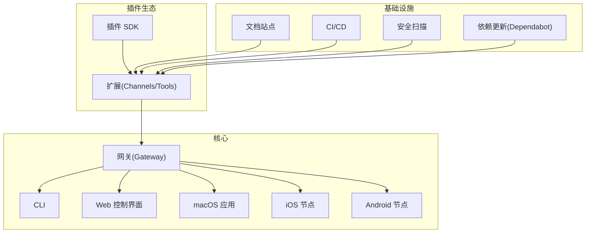
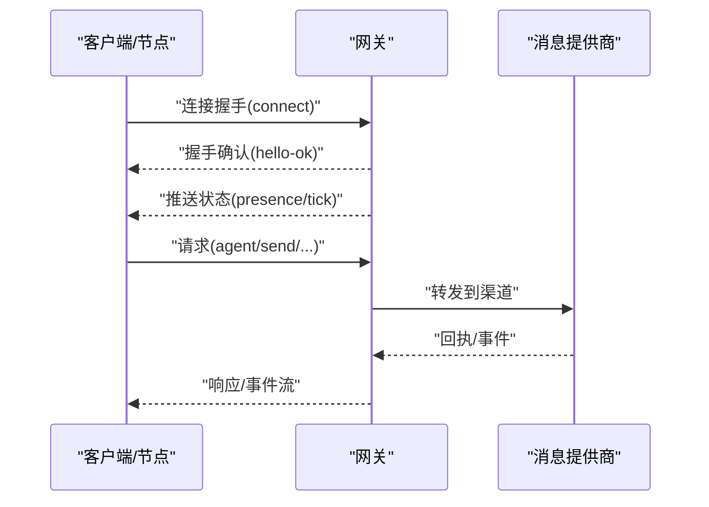
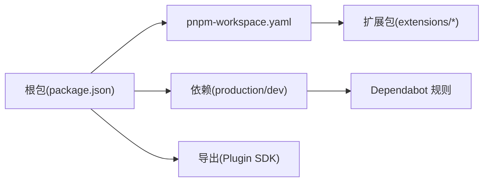

# 社区与贡献

<cite>
**本文引用的文件**
- [CONTRIBUTING.md](file://CONTRIBUTING.md)
- [README.md](file://README.md)
- [SECURITY.md](file://SECURITY.md)
- [VISION.md](file://VISION.md)
- [.github/pull_request_template.md](file://.github/pull_request_template.md)
- [.github/dependabot.yml](file://.github/dependabot.yml)
- [.github/labeler.yml](file://.github/labeler.yml)
- [package.json](file://package.json)
- [pnpm-workspace.yaml](file://pnpm-workspace.yaml)
- [tsconfig.json](file://tsconfig.json)
- [docs/index.md](file://docs/index.md)
- [docs/start/getting-started.md](file://docs/start/getting-started.md)
- [docs/help/index.md](file://docs/help/index.md)
- [docs/concepts/architecture.md](file://docs/concepts/architecture.md)
</cite>

## 目录
1. [引言](#引言)
2. [项目结构](#项目结构)
3. [核心组件](#核心组件)
4. [架构总览](#架构总览)
5. [详细组件分析](#详细组件分析)
6. [依赖分析](#依赖分析)
7. [性能考虑](#性能考虑)
8. [故障排查指南](#故障排查指南)
9. [结论](#结论)
10. [附录](#附录)

## 引言
本指南面向希望参与 OpenClaw 社区与贡献的开发者与用户，系统性介绍开源社区文化、贡献方式与协作流程，覆盖代码贡献、文档改进、问题反馈、功能建议等；并提供开发环境搭建、代码规范、测试要求、提交流程等技术细节；同时说明治理结构、决策流程与维护团队；最后给出社区资源链接，帮助新成员快速融入。

## 项目结构
OpenClaw 是一个多平台、多通道的个人 AI 助手网关，采用模块化与插件化设计，支持跨平台运行与扩展。项目采用 monorepo 结构，通过 pnpm workspace 管理根包与扩展包，核心能力包括：
- 网关（Gateway）：控制平面，负责会话、路由、工具与事件管理
- 客户端与节点：CLI、Web 控制界面、桌面应用与移动端节点
- 插件生态：扩展渠道与能力，遵循插件 SDK
- 文档与工具链：文档站点、脚手架、CI/CD、安全扫描与依赖更新策略

图表来源
- [docs/concepts/architecture.md:12-26](file://docs/concepts/architecture.md#L12-L26)
- [package.json:23-34](file://package.json#L23-L34)
- [.github/dependabot.yml:13-50](file://.github/dependabot.yml#L13-L50)

章节来源
- [README.md:1-50](file://README.md#L1-L50)
- [docs/index.md:44-72](file://docs/index.md#L44-L72)
- [docs/concepts/architecture.md:12-26](file://docs/concepts/architecture.md#L12-L26)

## 核心组件
- 网关（Gateway）：单一路由与控制平面，承载会话、消息、工具与事件，客户端与节点通过 WebSocket 连接。
- 客户端与节点：CLI、Web 控制界面、macOS 应用、iOS/Android 节点，均通过网关协议进行通信。
- 插件与扩展：通过插件 SDK 开发，支持渠道与工具扩展；内存与技能作为特殊插件类型存在。
- 文档与工具链：文档站点、脚手架、CI/CD、安全扫描与依赖更新策略，保障质量与可维护性。

章节来源
- [docs/concepts/architecture.md:27-58](file://docs/concepts/architecture.md#L27-L58)
- [VISION.md:52-83](file://VISION.md#L52-L83)
- [package.json:37-213](file://package.json#L37-L213)

## 架构总览
OpenClaw 的核心是“网关 + 多客户端/节点”的架构。所有消息面由网关统一接入与路由，客户端与节点通过 WebSocket 协议与网关交互；Web 控制界面与 CLI 均基于同一协议；Canvas/A2UI 作为可视化工作区由网关 HTTP 服务提供。

图表来源
- [docs/concepts/architecture.md:59-78](file://docs/concepts/architecture.md#L59-L78)

章节来源
- [docs/concepts/architecture.md:80-92](file://docs/concepts/architecture.md#L80-L92)

## 详细组件分析

### 贡献方式与协作流程
- 提交前准备：本地构建与测试、遵循审查对话责任归属规则、使用美式英语、避免编辑受保护路径
- 提交流程：PR 模板填写、安全影响评估、可复现步骤与证据、兼容性与迁移说明
- 审查与合并：Codex 本地审查、机器人审查对话处理、保持 PR 聚焦单一主题

章节来源
- [CONTRIBUTING.md:82-111](file://CONTRIBUTING.md#L82-L111)
- [.github/pull_request_template.md:1-116](file://.github/pull_request_template.md#L1-L116)

### 开发环境搭建
- 运行时与安装：推荐 Node 24，兼容 Node 22 LTS；支持 npm/pnpm/bun；可通过安装脚本快速部署
- 从源码构建：使用 pnpm 安装依赖、构建 UI、编译产物、安装守护进程后进入开发循环
- 快速起步：运行向导、启动网关、打开控制界面、发送测试消息

章节来源
- [README.md:50-111](file://README.md#L50-L111)
- [docs/start/getting-started.md:20-82](file://docs/start/getting-started.md#L20-L82)

### 代码规范与质量
- 代码格式：oxlint、oxfmt、SwiftLint、SwiftFormat 统一风格
- 类型检查：TypeScript 严格模式、装饰器配置与路径别名
- 静态检查：重复代码检测、文档链接校验、配置基线生成与校验
- 依赖更新：Dependabot 分生态自动更新与分组策略

章节来源
- [package.json:214-346](file://package.json#L214-L346)
- [tsconfig.json:1-30](file://tsconfig.json#L1-L30)
- [.github/dependabot.yml:1-128](file://.github/dependabot.yml#L1-L128)

### 测试与验证
- 测试矩阵：单元测试、端到端测试、Docker 场景测试、实时模型测试、UI 测试
- 性能与覆盖率：热点分析、性能预算、覆盖率收集
- 并发与稳定性：并行测试执行、强制重试、清理脚本

章节来源
- [package.json:306-346](file://package.json#L306-L346)

### 文档贡献
- 文档站点：Mint 驱动，文档清单生成、链接审计、拼写检查
- 文档标签：按变更文件自动打标签，便于分类与追踪

章节来源
- [package.json:244-251](file://package.json#L244-L251)
- [.github/labeler.yml:1-317](file://.github/labeler.yml#L1-L317)

### 安全与漏洞报告
- 报告渠道：按子系统定向仓库或邮件；需包含标题、严重度、影响、组件、技术复现、影响演示、环境、修复建议
- 受理门槛：最小化“可复现 PoC”与“影响证据”，缺失将降优先级
- 信任模型：单用户受信操作者模型，明确边界与隔离建议

章节来源
- [SECURITY.md:5-47](file://SECURITY.md#L5-L47)
- [SECURITY.md:91-107](file://SECURITY.md#L91-L107)

### 治理结构与维护团队
- 治理角色：彼得·斯坦伯格（Benevolent Dictator）、多位维护者分别负责不同子系统与平台
- 申请成为维护者：邮件提交贡献记录、项目经验、时间承诺等，审核周期数周
- 当前关注与路线图：稳定性、UX、技能生态、性能优化

章节来源
- [CONTRIBUTING.md:12-81](file://CONTRIBUTING.md#L12-L81)
- [CONTRIBUTING.md:154-172](file://CONTRIBUTING.md#L154-L172)
- [VISION.md:17-32](file://VISION.md#L17-L32)

### 社区资源与沟通
- 主页与文档：官网、文档索引、概念与参考
- 讨论与支持：Discord 频道、帮助入口、常见问题
- 问题与建议：Issues、讨论区、PR 模板与标签

章节来源
- [README.md:26-49](file://README.md#L26-L49)
- [docs/help/index.md:1-22](file://docs/help/index.md#L1-L22)
- [.github/labeler.yml:1-317](file://.github/labeler.yml#L1-L317)

## 依赖分析
- 包管理：pnpm workspace 管理根包与扩展；onlyBuiltDependencies 明确原生依赖范围
- 依赖更新：Dependabot 分生态每日检查，生产与开发依赖分组更新，限制 PR 数量
- 导出与别名：插件 SDK 多入口导出、路径映射，确保类型与默认导出一致

图表来源
- [package.json:37-213](file://package.json#L37-L213)
- [pnpm-workspace.yaml:1-18](file://pnpm-workspace.yaml#L1-L18)
- [.github/dependabot.yml:13-50](file://.github/dependabot.yml#L13-L50)

章节来源
- [package.json:441-479](file://package.json#L441-L479)
- [pnpm-workspace.yaml:7-17](file://pnpm-workspace.yaml#L7-L17)
- [.github/dependabot.yml:1-128](file://.github/dependabot.yml#L1-L128)

## 性能考虑
- 性能预算与热点：通过性能预算与热点分析工具识别瓶颈
- 测试并行：并行测试执行提升回归效率
- 构建与打包：UI 打包、协议生成、构建后处理减少重复工作

章节来源
- [package.json:334-346](file://package.json#L334-L346)

## 故障排查指南
- 快速定位：从帮助入口开始，检查安装与环境变量、日志与诊断命令
- 网关问题：使用 Doctor 与健康检查、日志与远程访问排查
- 常见问题：FAQ 与概念性问题指引

章节来源
- [docs/help/index.md:1-22](file://docs/help/index.md#L1-L22)
- [docs/start/getting-started.md:83-102](file://docs/start/getting-started.md#L83-L102)

## 结论
OpenClaw 以“自托管、多通道、代理原生、开源”为核心理念，通过清晰的贡献流程、完善的工具链与安全策略，鼓励社区协作与持续演进。新成员可从文档与向导入手，按流程提交贡献，并在 Discord 等渠道获得支持。

## 附录
- 快速链接
  - 贡献指南：[CONTRIBUTING.md](file://CONTRIBUTING.md)
  - 安全策略：[SECURITY.md](file://SECURITY.md)
  - 项目愿景：[VISION.md](file://VISION.md)
  - 文档首页：[docs/index.md](file://docs/index.md)
  - 快速开始：[docs/start/getting-started.md](file://docs/start/getting-started.md)
  - 帮助中心：[docs/help/index.md](file://docs/help/index.md)
  - 架构概览：[docs/concepts/architecture.md](file://docs/concepts/architecture.md)