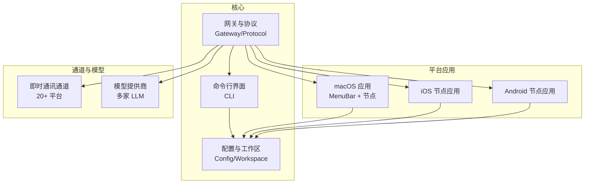
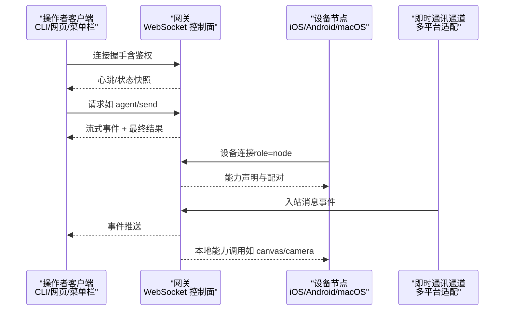
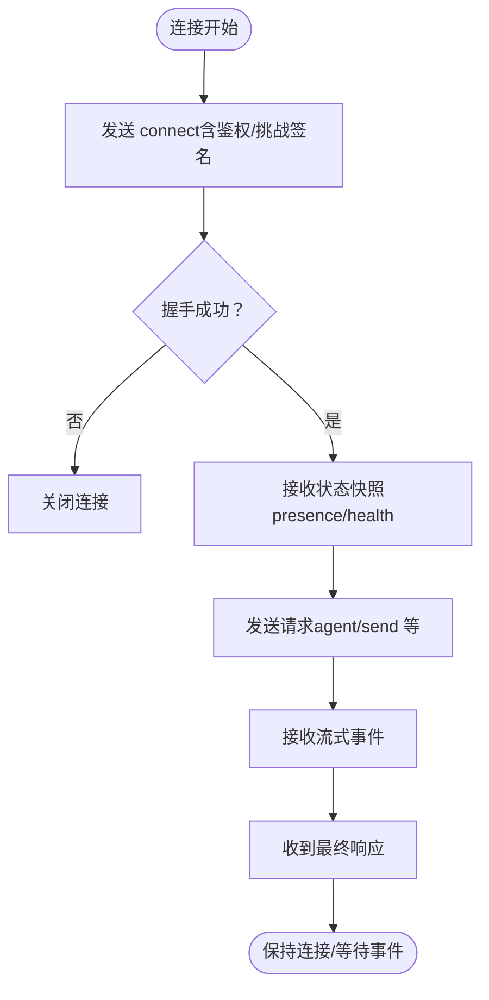
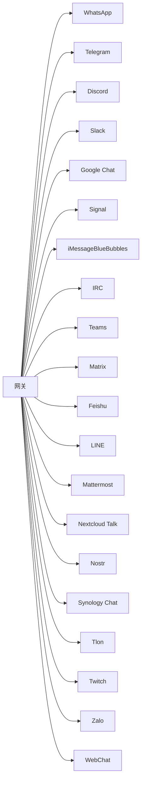
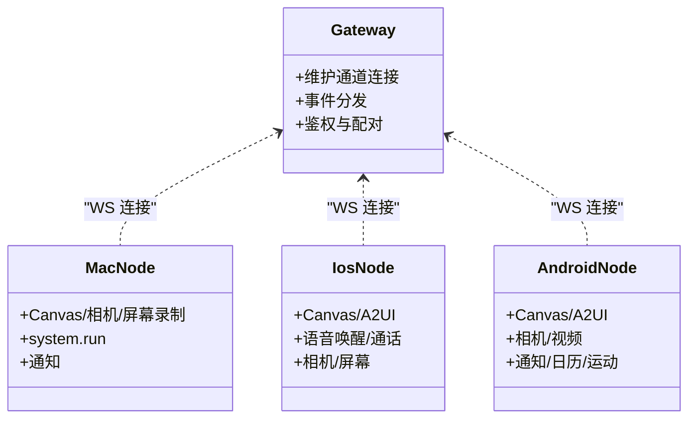
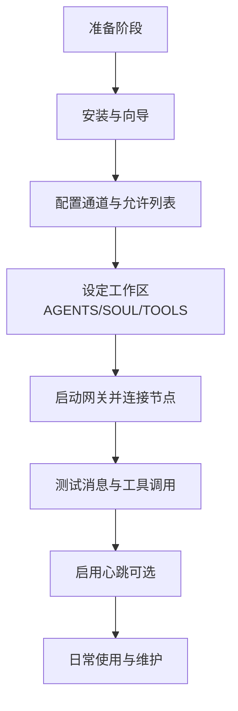
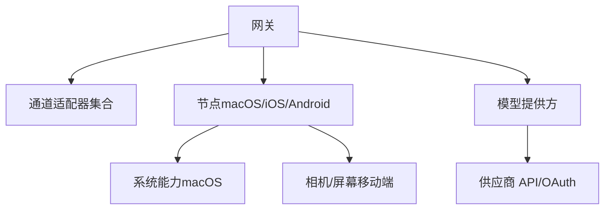

# 项目介绍

<cite>
**本文引用的文件**
- [README.md](file://README.md)
- [VISION.md](file://VISION.md)
- [docs/start/openclaw.md](file://docs/start/openclaw.md)
- [docs/concepts/architecture.md](file://docs/concepts/architecture.md)
- [docs/channels/index.md](file://docs/channels/index.md)
- [docs/platforms/macos.md](file://docs/platforms/macos.md)
- [docs/platforms/ios.md](file://docs/platforms/ios.md)
- [docs/platforms/android.md](file://docs/platforms/android.md)
- [docs/providers/index.md](file://docs/providers/index.md)
- [docs/start/lore.md](file://docs/start/lore.md)
- [docs/start/showcase.md](file://docs/start/showcase.md)
- [src/compat/legacy-names.ts](file://src/compat/legacy-names.ts)
- [apps/macos/Sources/OpenClaw/Resources/Info.plist](file://apps/macos/Sources/OpenClaw/Resources/Info.plist)
- [src/config/version.ts](file://src/config/version.ts)
</cite>

## 目录
1. [引言](#引言)
2. [项目结构](#项目结构)
3. [核心组件](#核心组件)
4. [架构总览](#架构总览)
5. [详细组件分析](#详细组件分析)
6. [依赖关系分析](#依赖关系分析)
7. [性能与安全考量](#性能与安全考量)
8. [故障排查指南](#故障排查指南)
9. [结论](#结论)
10. [附录](#附录)

## 引言
OpenClaw 是一个“个人 AI 助手”，可在你的设备上本地运行，连接你常用的即时通讯渠道，提供始终在线、快速且贴近本地体验的智能助理服务。它强调隐私与安全，默认强安全策略，同时保持强大能力与灵活扩展。

- 核心价值主张
  - 本地优先：所有数据与执行均在你的设备上完成，避免云端传输风险。
  - 多渠道接入：支持 20+ 即时通讯平台，统一在一个网关下路由与处理。
  - 跨平台部署：macOS、iOS、Android 可选配套应用，亦可仅用 CLI/Web 运行。
  - 模型即插即用：支持多家主流大模型供应商，便于按需切换与容灾。
  - 安全默认：严格的 DM 配对、沙箱与权限控制，确保高风险路径可控。

- 为什么选择本地运行
  - 数据主权：消息与操作不出设备，降低泄露与滥用风险。
  - 低延迟：本地执行与响应，适合高频交互与实时任务。
  - 可审计：所有会话与工具调用均可记录与回溯。
  - 可扩展：通过插件与技能生态，持续增强个人助理能力。

- 项目定位
  - OpenClaw 不是“云服务”，而是“你的个人助理系统”。网关是控制平面，产品是“能做事”的助理。

**章节来源**
- [README.md](file://README.md#L21-L24)
- [VISION.md](file://VISION.md#L15-L16)

## 项目结构
OpenClaw 采用模块化与多平台并行的组织方式：
- 核心运行时与网关：src/ 下的 CLI、通道适配器、协议与基础设施。
- 平台配套应用：apps/ 下的 macOS、iOS、Android 应用与共享库。
- 文档与指南：docs/ 下的架构、通道、平台、提供商等参考文档。
- 插件与扩展：extensions/ 下的第三方通道与工具扩展。
- 技能与工作区：skills/ 下的社区技能与工作区模板。

**图表来源**
- [docs/concepts/architecture.md](file://docs/concepts/architecture.md#L12-L26)
- [docs/channels/index.md](file://docs/channels/index.md#L14-L37)
- [docs/providers/index.md](file://docs/providers/index.md#L9-L14)

**章节来源**
- [docs/concepts/architecture.md](file://docs/concepts/architecture.md#L12-L26)
- [docs/channels/index.md](file://docs/channels/index.md#L14-L37)
- [docs/providers/index.md](file://docs/providers/index.md#L9-L14)

## 核心组件
- 网关（Gateway）
  - 单一长连接的 WebSocket 控制平面，负责维护各通道连接、事件分发、节点管理与安全校验。
  - 支持远程访问（Tailscale/SSH 隧道）与本地守护进程（launchd/systemd）。
- 通道适配器（Channels）
  - 针对 WhatsApp、Telegram、Discord、Slack、Google Chat、Signal、iMessage、IRC、Teams、Matrix、Feishu、LINE、Mattermost、Nextcloud Talk、Nostr、Synology Chat、Tlon、Twitch、Zalo、WebChat 等平台的适配与路由。
- 模型提供方（Providers）
  - 支持 OpenAI、Anthropic、Bedrock、Hugging Face、LiteLLM、Ollama、Cloudflare、Vercel、Moonshot、Qwen 等多家供应商。
- 平台节点（Nodes）
  - macOS/iOS/Android 节点应用，作为“设备侧”能力的承载，提供 Canvas、相机、屏幕录制、位置、通知等本地能力。
- 工作区与技能（Workspace & Skills）
  - 通过 AGENTS.md、SOUL.md、TOOLS.md 等注入指令与记忆，结合 ClawHub 技能市场实现能力扩展。

**章节来源**
- [docs/concepts/architecture.md](file://docs/concepts/architecture.md#L27-L48)
- [docs/channels/index.md](file://docs/channels/index.md#L14-L37)
- [docs/providers/index.md](file://docs/providers/index.md#L27-L51)
- [docs/platforms/macos.md](file://docs/platforms/macos.md#L15-L24)
- [docs/platforms/ios.md](file://docs/platforms/ios.md#L14-L18)
- [docs/platforms/android.md](file://docs/platforms/android.md#L10-L18)

## 架构总览
OpenClaw 的核心是“单网关、多客户端”的 WebSocket 架构。控制面（CLI、Web、macOS 应用）与设备节点（iOS/Android）均通过同一网关进行连接、鉴权与事件分发。

**图表来源**
- [docs/concepts/architecture.md](file://docs/concepts/architecture.md#L59-L78)
- [docs/concepts/architecture.md](file://docs/concepts/architecture.md#L80-L92)

**章节来源**
- [docs/concepts/architecture.md](file://docs/concepts/architecture.md#L12-L26)
- [docs/concepts/architecture.md](file://docs/concepts/architecture.md#L59-L78)
- [docs/concepts/architecture.md](file://docs/concepts/architecture.md#L80-L92)

## 详细组件分析

### 组件A：网关与协议
- 角色与职责
  - 维护通道连接与会话生命周期；提供类型化 WebSocket API；事件驱动（agent/chat/presence/health/heartbeat/cron）。
  - 安全：设备配对、鉴权令牌、本地/远程区分、签名挑战。
- 关键流程
  - 连接握手：首次帧必须为 connect；后续请求/响应与事件。
  - 事件不重放：断线后需刷新恢复。
- 远程访问
  - Tailscale Serve/Funnel 或 SSH 隧道；同套鉴权逻辑。

**图表来源**
- [docs/concepts/architecture.md](file://docs/concepts/architecture.md#L59-L78)
- [docs/concepts/architecture.md](file://docs/concepts/architecture.md#L80-L92)

**章节来源**
- [docs/concepts/architecture.md](file://docs/concepts/architecture.md#L27-L48)
- [docs/concepts/architecture.md](file://docs/concepts/architecture.md#L93-L109)

### 组件B：多渠道消息集成
- 支持平台概览（20+）
  - WhatsApp、Telegram、Discord、Slack、Google Chat、Signal、iMessage（BlueBubbles 推荐）、IRC、Microsoft Teams、Matrix、Feishu、LINE、Mattermost、Nextcloud Talk、Nostr、Synology Chat、Tlon、Twitch、Zalo、WebChat。
- 安全与路由
  - DM 默认配对策略、允许列表、群组路由与提及规则。
  - 同时运行多个通道，按聊天路由到对应会话。

**图表来源**
- [docs/channels/index.md](file://docs/channels/index.md#L14-L37)

**章节来源**
- [docs/channels/index.md](file://docs/channels/index.md#L14-L37)

### 组件C：跨平台部署与节点
- macOS
  - 菜单栏应用 + 网关代理；暴露 Canvas、Camera、Screen、System.run 等能力；LaunchAgent 管理。
- iOS
  - 节点应用，Canvas/A2UI、语音唤醒/通话、屏幕截图/相机。
- Android
  - 节点应用，Canvas/A2UI、相机/视频、通知/日历/运动等命令族。

**图表来源**
- [docs/platforms/macos.md](file://docs/platforms/macos.md#L15-L24)
- [docs/platforms/ios.md](file://docs/platforms/ios.md#L14-L18)
- [docs/platforms/android.md](file://docs/platforms/android.md#L10-L18)

**章节来源**
- [docs/platforms/macos.md](file://docs/platforms/macos.md#L15-L24)
- [docs/platforms/ios.md](file://docs/platforms/ios.md#L14-L18)
- [docs/platforms/android.md](file://docs/platforms/android.md#L10-L18)

### 组件D：模型提供商集成
- 供应商覆盖
  - OpenAI、Anthropic、Bedrock、Hugging Face、LiteLLM、Ollama、Cloudflare、Vercel、Moonshot、Qwen、Mistral、NVIDIA、Together、VLLM、Xiaomi、Z.AI 等。
- 使用方式
  - 通过向导完成认证；在配置中设置默认模型；支持主备与故障转移。

**章节来源**
- [docs/providers/index.md](file://docs/providers/index.md#L27-L51)

### 组件E：个人助理工作流（典型）
- 安全前置：先设置 allowFrom/群组策略，再启用心跳。
- 两部手机方案：个人号与助理号分离，避免误触发。
- 工作区注入：SOUL.md/TOOLS.md/AGENTS.md 提供人格与指令；可选内存文件。
- 心跳与会话：按需开启心跳，使用 /new 或 /reset 管理会话。

**图表来源**
- [docs/start/openclaw.md](file://docs/start/openclaw.md#L32-L66)
- [docs/start/openclaw.md](file://docs/start/openclaw.md#L105-L149)

**章节来源**
- [docs/start/openclaw.md](file://docs/start/openclaw.md#L13-L26)
- [docs/start/openclaw.md](file://docs/start/openclaw.md#L32-L66)
- [docs/start/openclaw.md](file://docs/start/openclaw.md#L105-L149)

## 依赖关系分析
- 内聚性与耦合
  - 网关作为控制平面，与通道适配器、节点、模型提供方松耦合，通过 WebSocket 与统一协议交互。
  - 平台应用（macOS/iOS/Android）通过节点角色与网关协作，职责清晰。
- 外部依赖
  - 通道：各平台 SDK/REST/WebSocket。
  - 模型：各供应商 API/OAuth/本地推理引擎。
  - 远程：Tailscale/SSH 隧道。
- 版本与兼容
  - 版本解析与比较函数保证升级与兼容性判断的基础能力。

**图表来源**
- [docs/concepts/architecture.md](file://docs/concepts/architecture.md#L12-L26)
- [src/config/version.ts](file://src/config/version.ts#L1-L49)

**章节来源**
- [src/config/version.ts](file://src/config/version.ts#L1-L49)

## 性能与安全考量
- 性能
  - 本地执行减少网络往返；WebSocket 长连接降低握手开销；媒体管线支持大小限制与临时文件生命周期管理。
- 安全
  - 默认 DM 配对策略、允许列表、沙箱与权限控制；macOS TCC 与执行审批；远程访问强制鉴权与隧道。
  - 代码级安全建议：严格输入校验、最小权限原则、明确高风险路径开关。

**章节来源**
- [README.md](file://README.md#L112-L125)
- [docs/platforms/macos.md](file://docs/platforms/macos.md#L75-L111)
- [docs/concepts/architecture.md](file://docs/concepts/architecture.md#L93-L109)

## 故障排查指南
- 常见问题
  - 通道连不上：检查令牌/密钥、允许列表、Webhook/端口；查看健康状态与诊断输出。
  - 节点无法连接：确认发现（Bonjour/Tailscale）、手动主机/端口、配对请求批准。
  - 远程访问：确认隧道建立、鉴权令牌、TLS/密码策略。
- 工具与命令
  - status/status --all/status --deep、health --json、dashboard、doctor。
  - 平台调试：macOS 应用内置调试 CLI；iOS/Android 节点状态查询。

**章节来源**
- [docs/start/openclaw.md](file://docs/start/openclaw.md#L195-L202)
- [docs/platforms/ios.md](file://docs/platforms/ios.md#L97-L102)
- [docs/platforms/android.md](file://docs/platforms/android.md#L99-L112)

## 结论
OpenClaw 将“个人助理”的理念落地为一套可本地运行、可跨平台部署、可多渠道接入、可灵活扩展的系统。它以网关为核心，串联通道、节点与模型提供方，形成“本地可控、云端可选”的混合范式。通过强安全默认与开放生态，OpenClaw 既满足隐私与安全需求，又保留强大的自动化与人机协作能力。

## 附录

### 项目历史与愿景
- 起源与命名演化：Warelay → Clawdbot → Moltbot → OpenClaw，最终定名“OpenClaw”寓意开源、开放与“爪法至简”。
- 愿景与优先级：安全与默认安全、稳定性与首跑体验、模型与通道支持、性能与测试基建、计算机使用与代理能力、跨前端体验、跨平台应用完善。

**章节来源**
- [docs/start/lore.md](file://docs/start/lore.md#L12-L26)
- [VISION.md](file://VISION.md#L17-L32)

### 使用场景与案例
- 开发协作：PR 评审反馈、自动化构建与测试提示。
- 生活自动化：购物下单、日程安排、健康数据同步、家庭设备控制。
- 学习与知识：语言学习、记忆检索、语义搜索。
- 语音与电话：电话桥接、多语言转写、语音助手联动。
- 基础设施：Home Assistant 插件、Nix 打包、树莓派部署。

**章节来源**
- [docs/start/showcase.md](file://docs/start/showcase.md#L18-L42)
- [docs/start/showcase.md](file://docs/start/showcase.md#L88-L210)
- [docs/start/showcase.md](file://docs/start/showcase.md#L211-L287)
- [docs/start/showcase.md](file://docs/start/showcase.md#L289-L318)
- [docs/start/showcase.md](file://docs/start/showcase.md#L321-L337)
- [docs/start/showcase.md](file://docs/start/showcase.md#L339-L367)
- [docs/start/showcase.md](file://docs/start/showcase.md#L369-L389)
- [docs/start/showcase.md](file://docs/start/showcase.md#L391-L401)

### 版本与标识
- 项目名称与兼容：PROJECT_NAME 为 openclaw，兼容旧名与清单键。
- macOS 应用标识：CFBundleIdentifier 与版本字段。
- 版本解析：OpenClawVersion 解析与比较函数。

**章节来源**
- [src/compat/legacy-names.ts](file://src/compat/legacy-names.ts#L1-L15)
- [apps/macos/Sources/OpenClaw/Resources/Info.plist](file://apps/macos/Sources/OpenClaw/Resources/Info.plist#L9-L20)
- [src/config/version.ts](file://src/config/version.ts#L1-L49)