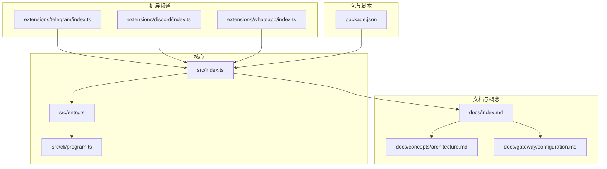
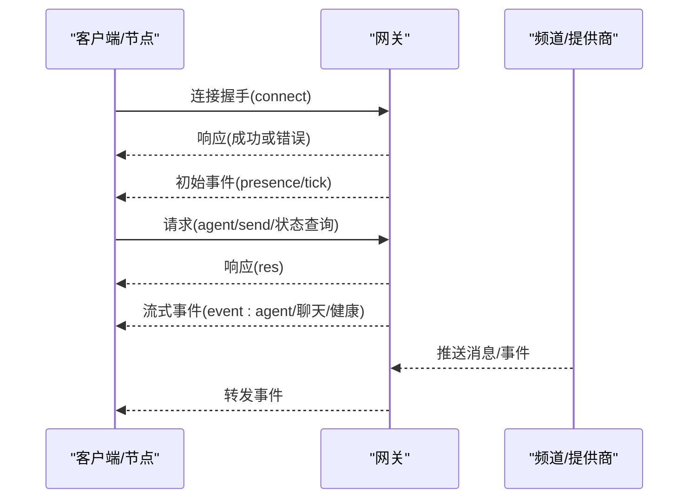
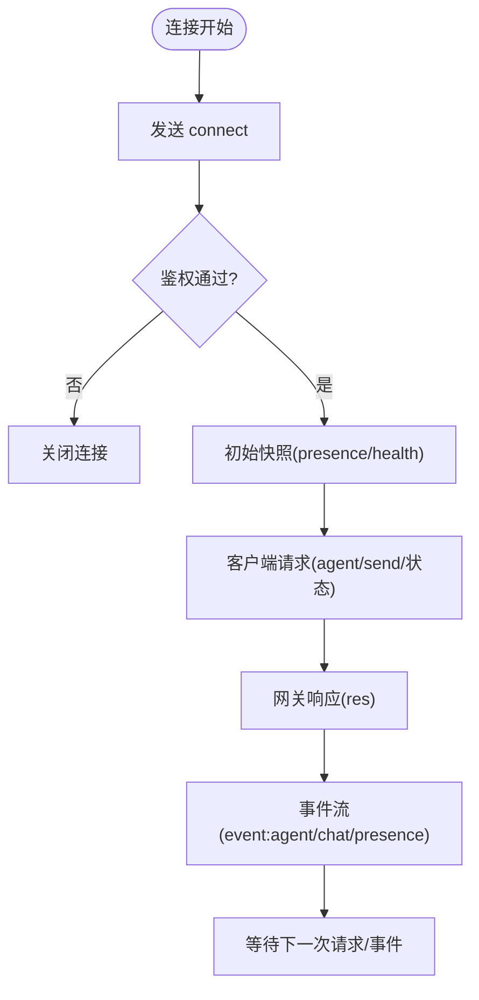
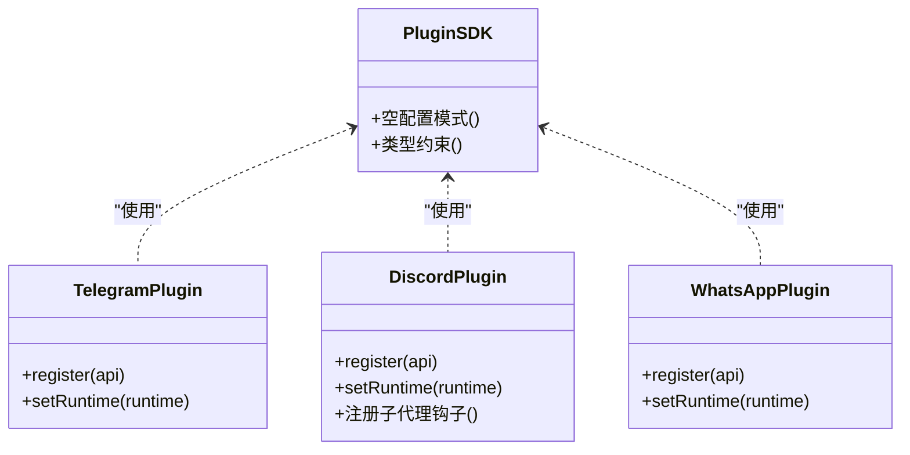
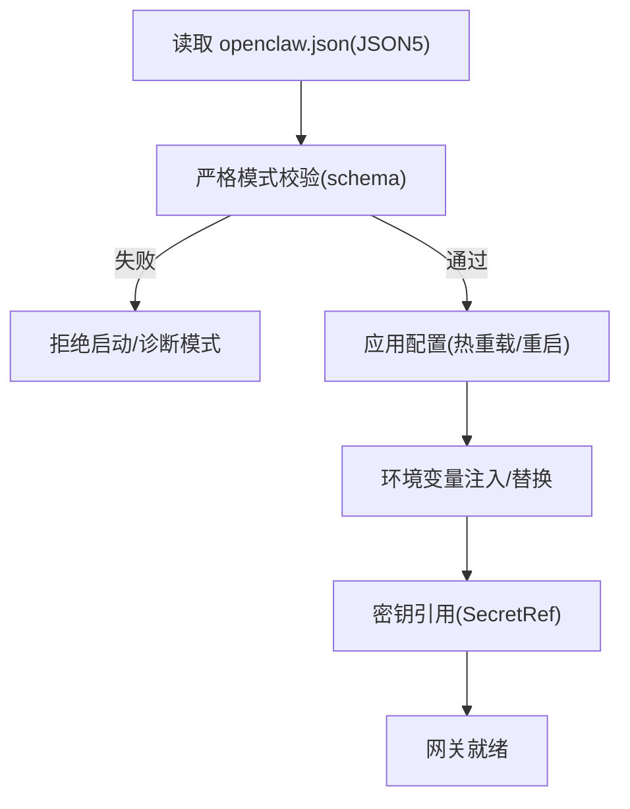
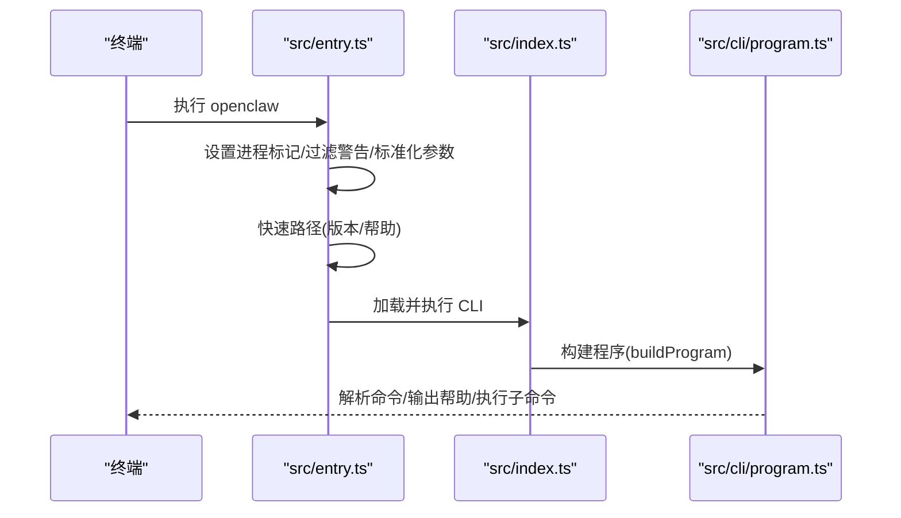
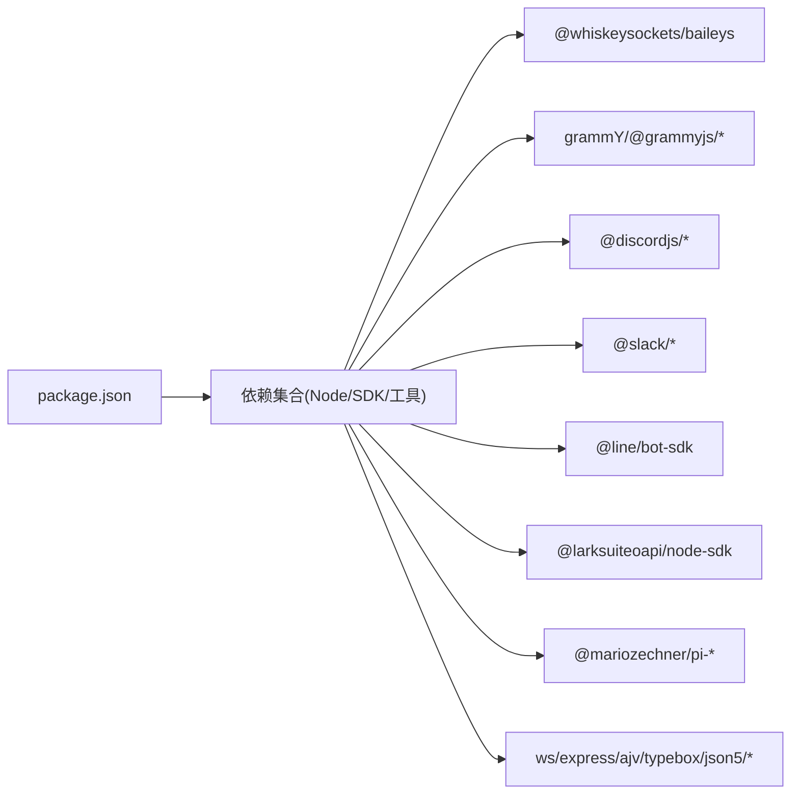

# 项目概述

<cite>
**本文档引用的文件**
- [README.md](file://README.md)
- [VISION.md](file://VISION.md)
- [CONTRIBUTING.md](file://CONTRIBUTING.md)
- [docs/index.md](file://docs/index.md)
- [docs/concepts/architecture.md](file://docs/concepts/architecture.md)
- [docs/gateway/configuration.md](file://docs/gateway/configuration.md)
- [src/index.ts](file://src/index.ts)
- [src/entry.ts](file://src/entry.ts)
- [src/cli/program.ts](file://src/cli/program.ts)
- [package.json](file://package.json)
- [extensions/telegram/index.ts](file://extensions/telegram/index.ts)
- [extensions/discord/index.ts](file://extensions/discord/index.ts)
- [extensions/whatsapp/index.ts](file://extensions/whatsapp/index.ts)
</cite>

## 目录
1. [引言](#引言)
2. [项目结构](#项目结构)
3. [核心组件](#核心组件)
4. [架构总览](#架构总览)
5. [详细组件分析](#详细组件分析)
6. [依赖分析](#依赖分析)
7. [性能考虑](#性能考虑)
8. [故障排除指南](#故障排除指南)
9. [结论](#结论)
10. [附录](#附录)

## 引言
OpenClaw 是一个可在您自己的设备上运行的个人 AI 助手，它通过您常用的即时通讯渠道（如 WhatsApp、Telegram、Slack、Discord、Google Chat、Signal、iMessage、BlueBubbles、IRC、Microsoft Teams、Matrix、飞书、LINE、Mattermost、Nextcloud Talk、Nostr、Synology Chat、Tlon、Twitch、Zalo、Zalo Personal、WebChat 等）与您对话，并能在 macOS/iOS/Android 上进行语音唤醒与实时画布协作。其核心价值在于“本地优先”：数据与控制权掌握在用户手中，同时提供强大的多通道集成、多代理路由、工具与自动化能力，以及可扩展的插件生态。

OpenClaw 的使命是成为“真正能做事”的个人 AI 助手——既安全可靠，又易于使用；既能满足单用户日常需求，也能支撑团队与企业级场景。其愿景强调安全默认、稳定可靠、易用的首次体验，以及对隐私与安全的持续投入。

**章节来源**
- file://README.md#L21-L27
- file://VISION.md#L15-L32

## 项目结构
OpenClaw 采用模块化与分层设计：
- 核心运行时与 CLI 入口位于 src/，负责启动、配置加载、端口检查、错误处理与命令解析。
- 文档与概念说明位于 docs/，覆盖架构、配置、频道集成、安全与运维等主题。
- 扩展（channels）位于 extensions/，每个频道以独立插件形式注册到主网关。
- 平台应用与节点位于 apps/，提供 macOS/iOS/Android 的配套体验。
- 技能与工具位于 skills/ 与扩展目录中，支持工作流自动化与增强能力。

**图表来源**
- [src/index.ts](file://src/index.ts#L1-L94)
- [src/entry.ts](file://src/entry.ts#L1-L195)
- [src/cli/program.ts](file://src/cli/program.ts#L1-L3)
- [docs/index.md](file://docs/index.md#L1-L193)
- [docs/concepts/architecture.md](file://docs/concepts/architecture.md#L1-L140)
- [docs/gateway/configuration.md](file://docs/gateway/configuration.md#L1-L547)
- [extensions/telegram/index.ts](file://extensions/telegram/index.ts#L1-L18)
- [extensions/discord/index.ts](file://extensions/discord/index.ts#L1-L20)
- [extensions/whatsapp/index.ts](file://extensions/whatsapp/index.ts#L1-L18)
- [package.json](file://package.json#L1-L458)

**章节来源**
- file://src/index.ts#L1-L94
- file://src/entry.ts#L1-L195
- file://docs/index.md#L1-L193
- file://package.json#L1-L458

## 核心组件
- 网关（Gateway）：单一长连接的控制平面，承载会话、路由、事件与通道连接，提供 WebSocket 控制面与 Canvas/A2UI 主机服务。
- 客户端与节点：macOS 应用、CLI、Web 控制界面、iOS/Android 节点均通过 WebSocket 连接网关，节点具备设备身份与权限声明。
- 频道插件（Channels）：以扩展形式接入 WhatsApp、Telegram、Discord 等，统一注册到网关并由网关调度。
- 配置系统：基于 JSON5 的严格校验配置，支持热重载、环境变量注入、密钥引用与远程写入 RPC。
- 插件 SDK：为频道与工具提供一致的开发接口，便于扩展与维护。

**章节来源**
- file://docs/concepts/architecture.md#L12-L140
- file://docs/gateway/configuration.md#L10-L547
- file://extensions/telegram/index.ts#L1-L18
- file://extensions/discord/index.ts#L1-L20
- file://extensions/whatsapp/index.ts#L1-L18

## 架构总览
OpenClaw 的核心是“单一网关控制平面”。所有客户端（macOS/CLI/Web）、节点（iOS/Android/headless）与频道（WhatsApp/Telegram/Discord 等）都通过 WebSocket 与网关交互。网关负责：
- 维护各提供商连接
- 暴露类型化 WS API（请求/响应/事件）
- 事件推送（agent、chat、presence、health、heartbeat、cron）
- 设备配对与本地信任机制
- Canvas/A2UI 主机服务（HTTP）

**图表来源**
- [docs/concepts/architecture.md](file://docs/concepts/architecture.md#L59-L78)

**章节来源**
- file://docs/concepts/architecture.md#L12-L140

## 详细组件分析

### 网关与协议
- 单一网关：每台主机仅有一个 Baileys 会话实例，避免重复连接与冲突。
- WebSocket 协议：文本帧 JSON，首帧必须为 connect；后续请求/响应与事件格式明确；支持鉴权令牌与幂等键。
- 设备配对与本地信任：设备身份、挑战签名、非本地需显式批准、本地可自动批准；认证策略适用于所有连接。
- 远程访问：推荐 Tailscale 或 SSH 隧道，远端同样适用相同握手与鉴权。

**图表来源**
- [docs/concepts/architecture.md](file://docs/concepts/architecture.md#L80-L140)

**章节来源**
- file://docs/concepts/architecture.md#L12-L140

### 频道插件体系
- 插件注册：每个频道插件在 register 中设置运行时并注册 ChannelPlugin。
- 统一扩展点：通过 plugin-sdk 导出的空配置模式与类型约束，确保频道一致性。
- 示例插件：Telegram、Discord、WhatsApp 插件均遵循相同模式，便于扩展更多频道。

**图表来源**
- [extensions/telegram/index.ts](file://extensions/telegram/index.ts#L1-L18)
- [extensions/discord/index.ts](file://extensions/discord/index.ts#L1-L20)
- [extensions/whatsapp/index.ts](file://extensions/whatsapp/index.ts#L1-L18)

**章节来源**
- file://extensions/telegram/index.ts#L1-L18
- file://extensions/discord/index.ts#L1-L20
- file://extensions/whatsapp/index.ts#L1-L18

### 配置与模型
- 配置来源：~/.openclaw/openclaw.json（JSON5），支持热重载与严格校验。
- 常见任务：频道接入、模型选择与回退、DM/群组访问策略、会话与重置、沙箱、心跳、定时任务、Webhook 映射、多代理路由、多文件组织($include)。
- 环境变量与密钥：支持 env 注入、Shell 导入、值内替换与 SecretRef 引用。
- RPC 更新：config.apply 与 config.patch 支持受控重启与速率限制。

**图表来源**
- [docs/gateway/configuration.md](file://docs/gateway/configuration.md#L61-L387)

**章节来源**
- file://docs/gateway/configuration.md#L10-L547

### CLI 启动与入口
- 入口文件：src/entry.ts 负责进程标题、实验性警告抑制、参数规范化、版本/帮助快速路径与 CLI 运行。
- 主入口：src/index.ts 导出公共 API 并安装未捕获异常处理器，随后解析命令行。
- 程序构建：src/cli/program.ts 提供 buildProgram，供入口调用。

**图表来源**
- [src/entry.ts](file://src/entry.ts#L1-L195)
- [src/index.ts](file://src/index.ts#L1-L94)
- [src/cli/program.ts](file://src/cli/program.ts#L1-L3)

**章节来源**
- file://src/entry.ts#L1-L195
- file://src/index.ts#L1-L94
- file://src/cli/program.ts#L1-L3

### 项目愿景与路线
- 当前优先级：安全与安全默认、缺陷修复与稳定性、安装可靠性与首次体验。
- 下一步优先级：支持主流模型提供商、完善主要消息渠道、性能与测试基础设施、提升计算机操作与代理能力、改进 CLI 与 Web 前端的人体工程学、跨平台配套应用。
- 贡献原则：PR 专注单一问题、避免大体积 PR、鼓励小而聚焦的改动、保持清晰的变更说明与截图。

**章节来源**
- file://VISION.md#L17-L32
- file://VISION.md#L34-L111

## 依赖分析
- 运行时与工具链：Node ≥22，TypeScript，Vitest，Oxlint/oxfmt，Playwright，WS，Express，Ajv，TypeBox 等。
- 第三方 SDK：Baileys（WhatsApp）、grammY（Telegram）、discord.js 生态、Slack Bolt、Line Bot SDK、Lark Suite SDK 等。
- 包导出与插件 SDK：通过 package.json 的 exports 字段暴露插件 SDK，便于扩展开发与类型提示。

**图表来源**
- [package.json](file://package.json#L335-L458)

**章节来源**
- file://package.json#L1-L458

## 性能考虑
- 配置热重载：大多数字段无需重启即可生效，混合模式下关键变更自动重启，减少停机时间。
- 会话与媒体：支持会话绑定、线程绑定、图像降采样与媒体生命周期管理，降低资源占用。
- 沙箱与隔离：Docker 沙箱可按会话/代理/共享作用域隔离，限制高风险操作。
- 远程访问：Tailscale Serve/Funnel 与 SSH 隧道，兼顾安全性与可用性。

**章节来源**
- file://docs/gateway/configuration.md#L349-L387
- file://docs/concepts/architecture.md#L117-L128

## 故障排除指南
- 常见问题：端口占用、环境变量缺失、配置校验失败、远程访问鉴权与隧道问题。
- 诊断工具：doctor 命令、日志查看、健康检查、心跳与会话修剪。
- 安全建议：默认 DM 策略、允许列表、分组提及规则、沙箱模式与工具白名单。

**章节来源**
- file://README.md#L112-L125
- file://docs/gateway/configuration.md#L61-L73

## 结论
OpenClaw 将“本地优先”的理念与强大的多通道集成、多代理路由、工具与自动化能力相结合，为个人与团队提供了可自托管、可扩展且安全可控的 AI 助手平台。其清晰的架构、严格的配置与安全默认、完善的文档与社区支持，使其在 AI 助手领域具备独特的定位与创新价值。

## 附录
- 快速开始：安装、向导、守护进程安装、启动网关与发送第一条消息。
- 在线资源：网站、文档、视觉展示、常见问题、向导与更新指南。
- 社区与贡献：维护者、Discord、GitHub 讨论、贡献流程与安全报告。

**章节来源**
- file://README.md#L50-L82
- file://README.md#L415-L432
- file://CONTRIBUTING.md#L76-L187