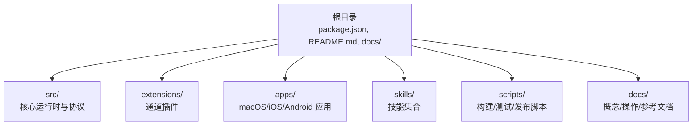
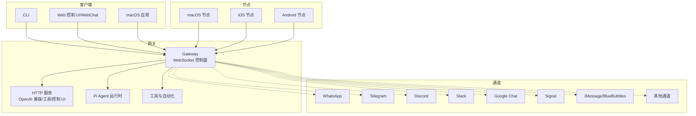
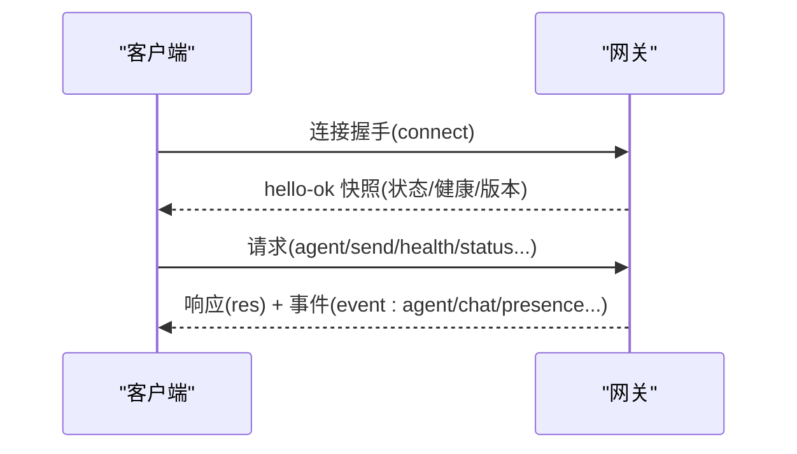
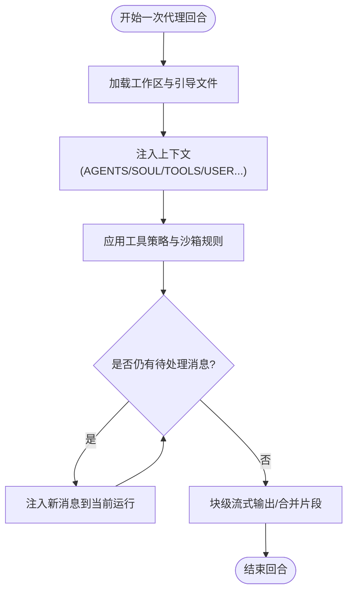
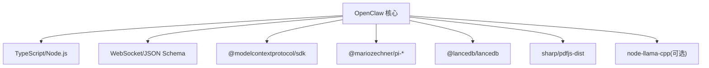

# 项目概述

<cite>
**本文档引用的文件**
- [README.md](file://README.md)
- [VISION.md](file://VISION.md)
- [CONTRIBUTING.md](file://CONTRIBUTING.md)
- [package.json](file://package.json)
- [src/index.ts](file://src/index.ts)
- [docs/start/getting-started.md](file://docs/start/getting-started.md)
- [docs/concepts/architecture.md](file://docs/concepts/architecture.md)
- [docs/gateway/index.md](file://docs/gateway/index.md)
- [docs/concepts/agent.md](file://docs/concepts/agent.md)
- [docs/channels/index.md](file://docs/channels/index.md)
- [Swabble/README.md](file://Swabble/README.md)
</cite>

## 目录
1. [简介](#简介)
2. [项目结构](#项目结构)
3. [核心组件](#核心组件)
4. [架构总览](#架构总览)
5. [详细组件分析](#详细组件分析)
6. [依赖关系分析](#依赖关系分析)
7. [性能考量](#性能考量)
8. [故障排查指南](#故障排查指南)
9. [结论](#结论)
10. [附录](#附录)

## 简介
OpenClaw 是一个“本地优先”的个人 AI 助手平台，强调在用户自己的设备上运行，连接用户已有的即时通讯渠道，并提供强大的工具与自动化能力。其核心价值主张包括：
- 本地优先：所有数据与计算尽可能在本地完成，降低隐私与安全风险。
- 多渠道即时通讯集成：支持 WhatsApp、Telegram、Discord、Slack、Google Chat、Signal、iMessage（通过 BlueBubbles）、IRC、Microsoft Teams、Matrix、Feishu、LINE、Mattermost、Nextcloud Talk、Nostr、Synology Chat、Tlon、Twitch、Zalo、Zalo Personal、WebChat 等。
- 强大的控制平面：以单一 WebSocket 网关作为控制面，统一管理会话、通道、工具与事件。
- 可扩展的运行时：基于 Pi Agent 的 RPC 模式，支持工具流式输出与块级流式输出。
- 完整的生态：配套的 macOS/iOS/Android 节点、浏览器控制、Canvas/A2UI 视觉工作区、语音唤醒与通话、技能与插件生态。

OpenClaw 的设计理念是“可运行的真实任务”，既尊重隐私与安全，又保持强大与易用性。项目当前聚焦于安全与稳定、首次运行体验、以及对主流模型提供商与消息渠道的支持。

**章节来源**
- [README.md:21-26](file://README.md#L21-L26)
- [VISION.md:15-32](file://VISION.md#L15-L32)

## 项目结构
仓库采用多模块组织方式，涵盖核心运行时、CLI、网关、通道插件、应用与节点、文档与脚本等。关键目录与职责概览：
- 根目录：包定义、入口脚本、构建与测试脚本、文档索引与国际化资源。
- src：核心运行时与协议实现、CLI、网关、通道适配器、工具与节点、配置与安全等。
- extensions：各即时通讯渠道的插件实现，按平台拆分。
- apps：macOS/iOS/Android 应用与共享库，提供节点能力与本地交互。
- skills：内置与工作区技能集合，支持自动发现与安装。
- docs：完整的概念、操作与参考文档，覆盖架构、通道、网关、工具、平台等。
- scripts：构建、测试、发布、协议生成、UI 打包等自动化脚本。
- assets：浏览器扩展等辅助资源。

```mermaid
graph TB
Root["根目录<br/>package.json, README.md, docs/"]
SRC["src/<br/>核心运行时与协议"]
EXT["extensions/<br/>通道插件"]
APPS["apps/<br/>macOS/iOS/Android 应用"]
SKILLS["skills/<br/>技能集合"]
SCRIPTS["scripts/<br/>构建/测试/发布脚本"]
DOCS["docs/<br/>概念/操作/参考文档"]
Root --> SRC
Root --> EXT
Root --> APPS
Root --> SKILLS
Root --> SCRIPTS
Root --> DOCS
```

**图表来源**
- [package.json:1-50](file://package.json#L1-L50)
- [README.md:140-184](file://README.md#L140-L184)

**章节来源**
- [package.json:16-34](file://package.json#L16-L34)
- [README.md:140-184](file://README.md#L140-L184)

## 核心组件
- 网关（Gateway）：单一路由与控制平面，负责维护各消息提供商连接、暴露 WebSocket 控制面 API、事件推送、HTTP 工具与兼容接口、以及服务生命周期管理。
- Pi Agent 运行时：嵌入式代理运行时（基于 pi-mono），提供会话管理、工具调用、上下文注入与流式输出能力。
- 通道插件（Channels）：针对不同即时通讯平台的适配器，统一接入网关控制面。
- 节点（Nodes）：macOS/iOS/Android 设备节点，提供本地能力（如摄像头、屏幕录制、位置、通知、系统命令执行等）并通过网关进行授权调用。
- 工具与自动化：浏览器控制、Canvas/A2UI、节点工具、定时任务、Webhook、Gmail Pub/Sub 等。
- 控制 UI 与 WebChat：通过网关端口提供可视化控制与聊天界面。
- 安全与权限：默认安全策略、沙箱模式、设备配对与签名、远程访问（Tailscale/SSH 隧道）与认证。

**章节来源**
- [docs/concepts/architecture.md:12-58](file://docs/concepts/architecture.md#L12-L58)
- [docs/concepts/agent.md:10-23](file://docs/concepts/agent.md#L10-L23)
- [docs/channels/index.md:14-47](file://docs/channels/index.md#L14-L47)
- [README.md:126-176](file://README.md#L126-L176)

## 架构总览
OpenClaw 的整体架构围绕“单一网关控制平面 + 多客户端/节点”展开。网关负责：
- 维护与各消息提供商的连接；
- 提供类型化 WebSocket API（请求/响应/事件）；
- 管理会话、路由、工具与事件；
- 对外暴露 HTTP 接口（OpenAI 兼容、工具调用、控制 UI）。

```mermaid
graph TB
subgraph "客户端"
CLI["CLI"]
Web["Web 控制 UI/WebChat"]
macOS["macOS 应用"]
end
subgraph "网关"
GW["Gateway<br/>WebSocket 控制面"]
HTTP["HTTP 服务<br/>OpenAI 兼容/工具/控制 UI"]
Agent["Pi Agent 运行时"]
Tools["工具与自动化"]
end
subgraph "节点"
NodeMac["macOS 节点"]
NodeiOS["iOS 节点"]
NodeAndroid["Android 节点"]
end
subgraph "通道"
WA["WhatsApp"]
TG["Telegram"]
DC["Discord"]
SL["Slack"]
GC["Google Chat"]
SI["Signal"]
IM["iMessage/BlueBubbles"]
Others["其他通道"]
end
CLI --> GW
Web --> GW
macOS --> GW
GW --> Agent
GW --> Tools
GW --> HTTP
NodeMac --> GW
NodeiOS --> GW
NodeAndroid --> GW
GW -.-> WA
GW -.-> TG
GW -.-> DC
GW -.-> SL
GW -.-> GC
GW -.-> SI
GW -.-> IM
GW -.-> Others
```

**图表来源**
- [docs/concepts/architecture.md:12-58](file://docs/concepts/architecture.md#L12-L58)
- [docs/gateway/index.md:68-77](file://docs/gateway/index.md#L68-L77)

**章节来源**
- [docs/concepts/architecture.md:12-58](file://docs/concepts/architecture.md#L12-L58)
- [docs/gateway/index.md:68-77](file://docs/gateway/index.md#L68-L77)

## 详细组件分析

### 网关（Gateway）
- 单一进程常驻，统一承载路由、控制平面与通道连接。
- 默认绑定回环地址，需认证后方可使用；支持热重载与多种重启策略。
- 提供 WebSocket 控制面与 HTTP 服务，统一处理健康检查、状态查询、消息发送、代理调用、工具执行等。
- 支持多网关实例隔离部署，确保严格隔离与冗余场景。

```mermaid
sequenceDiagram
participant Client as "客户端"
participant Gateway as "网关"
Client->>Gateway : 连接握手(connect)
Gateway-->>Client : hello-ok 快照(状态/健康/版本)
Client->>Gateway : 请求(agent/send/health/status...)
Gateway-->>Client : 响应(res) + 事件(event : agent/chat/presence...)
```

**图表来源**
- [docs/concepts/architecture.md:59-78](file://docs/concepts/architecture.md#L59-L78)
- [docs/gateway/index.md:202-214](file://docs/gateway/index.md#L202-L214)

**章节来源**
- [docs/gateway/index.md:27-66](file://docs/gateway/index.md#L27-L66)
- [docs/concepts/architecture.md:59-78](file://docs/concepts/architecture.md#L59-L78)

### Pi Agent 运行时
- 基于 pi-mono 的嵌入式代理运行时，提供会话管理、上下文注入、工具调用与流式输出。
- 工作区（Workspace）为代理唯一工作目录，注入 AGENTS.md、SOUL.md、TOOLS.md 等引导文件。
- 支持队列模式（steer/followup/collect）与块级流式输出策略，便于在多消息并发场景下保持一致性与低延迟。

```mermaid
flowchart TD
Start(["开始一次代理回合"]) --> LoadWorkspace["加载工作区与引导文件"]
LoadWorkspace --> InjectContext["注入上下文(AGENTS/SOUL/TOOLS/USER...)"]
InjectContext --> ToolPolicy["应用工具策略与沙箱规则"]
ToolPolicy --> RunLoop{"是否仍有待处理消息?"}
RunLoop --> |是| InjectMsg["注入新消息到当前运行"]
InjectMsg --> RunLoop
RunLoop --> |否| StreamBlocks["块级流式输出/合并片段"]
StreamBlocks --> End(["结束回合"])
```

**图表来源**
- [docs/concepts/agent.md:24-47](file://docs/concepts/agent.md#L24-L47)
- [docs/concepts/agent.md:82-104](file://docs/concepts/agent.md#L82-L104)

**章节来源**
- [docs/concepts/agent.md:10-23](file://docs/concepts/agent.md#L10-L23)
- [docs/concepts/agent.md:24-47](file://docs/concepts/agent.md#L24-L47)
- [docs/concepts/agent.md:82-104](file://docs/concepts/agent.md#L82-L104)

### 通道（Channels）
- 支持广泛的消息平台，每个通道通过网关统一接入，文本通用，媒体与互动能力因平台而异。
- 配对与白名单策略保障私域 DM 安全，默认仅允许已配对或白名单内的发件人。
- 支持群组路由、提及门控、回复标签与分片路由，满足复杂协作场景。

**章节来源**
- [docs/channels/index.md:14-47](file://docs/channels/index.md#L14-L47)
- [README.md:340-403](file://README.md#L340-L403)

### 节点（Nodes）
- macOS/iOS/Android 节点通过 WebSocket 连接到网关，声明角色与能力，经配对与授权后执行本地动作（如摄像头、屏幕录制、位置、通知、系统命令等）。
- 支持语音唤醒（Swabble）与通话模式，结合 Canvas/A2UI 实现可视化协作。

**章节来源**
- [README.md:156-161](file://README.md#L156-L161)
- [Swabble/README.md:1-112](file://Swabble/README.md#L1-L112)

### 工具与自动化
- 浏览器控制：受管 Chrome/Chromium，支持快照、动作与上传。
- Canvas/A2UI：可视化工作区，支持推送/重置/评估/截图。
- 节点工具：相机抓拍/视频、屏幕录制、位置获取、通知等。
- 定时任务、Webhook、Gmail Pub/Sub 等外部触发机制。

**章节来源**
- [README.md:163-169](file://README.md#L163-L169)

### 安全与权限
- 默认安全策略：工具在主会话中默认运行，群组/频道会话可通过沙箱模式隔离；提供工具白名单/黑名单与权限映射。
- 设备配对与签名：所有客户端连接需携带设备身份并签名挑战，非本地连接仍需显式批准。
- 远程访问：推荐 Tailscale/VPN，或 SSH 隧道；远端访问仍需网关认证。

**章节来源**
- [README.md:332-338](file://README.md#L332-L338)
- [docs/concepts/architecture.md:93-109](file://docs/concepts/architecture.md#L93-L109)
- [docs/gateway/index.md:108-123](file://docs/gateway/index.md#L108-L123)

## 依赖关系分析
OpenClaw 的技术栈以 TypeScript/Node.js 为核心，配合多语言与原生能力：
- 运行时与协议：WebSocket、JSON Schema、TypeBox 类型系统、Swift 模型代码生成。
- 消息通道：Baileys（WhatsApp）、grammY（Telegram）、Bolt（Slack）、discord.js（Discord）、signal-cli（Signal）、iMessage（BlueBubbles/imessage）、IRC、Matrix、Feishu、LINE、Mattermost、Nextcloud Talk、Nostr、Synology Chat、Tlon、Twitch、Zalo、WebChat 等。
- 工具与平台：@mariozechner/pi-*（Pi Agent 生态）、@modelcontextprotocol/sdk（MCP）、@lancedb/lancedb（向量数据库）、sharp/pdfjs-dist（图像/文档处理）、node-llama-cpp（本地模型，可选）等。
- UI 与打包：Hono（HTTP）、Playwright（浏览器测试）、Lit（Web UI）、Vitest（单元/集成测试）等。

```mermaid
graph TB
OpenClaw["OpenClaw 核心"]
TS["TypeScript/Node.js"]
WS["WebSocket/JSON Schema"]
MCP["@modelcontextprotocol/sdk"]
Pi["@mariozechner/pi-*"]
DB["@lancedb/lancedb"]
Sharp["sharp/pdfjs-dist"]
Llama["node-llama-cpp(可选)"]
OpenClaw --> TS
OpenClaw --> WS
OpenClaw --> MCP
OpenClaw --> Pi
OpenClaw --> DB
OpenClaw --> Sharp
OpenClaw --> Llama
```

**图表来源**
- [package.json:347-404](file://package.json#L347-L404)
- [package.json:405-427](file://package.json#L405-L427)
- [package.json:428-436](file://package.json#L428-L436)

**章节来源**
- [package.json:347-404](file://package.json#L347-L404)
- [package.json:405-427](file://package.json#L405-L427)
- [package.json:428-436](file://package.json#L428-L436)

## 性能考量
- 会话压缩与令牌使用跟踪：通过会话修剪与使用统计优化成本与延迟。
- 流式与块级输出：支持块级流式输出与合并，减少细粒度消息带来的网络与渲染压力。
- 沙箱与隔离：在群组/频道会话中启用沙箱，避免高风险工具对主机造成影响。
- 并发与队列：队列模式（steer/followup/collect）与注入策略保证在并发输入下的稳定性与一致性。

**章节来源**
- [docs/concepts/agent.md:82-104](file://docs/concepts/agent.md#L82-L104)
- [README.md:171-176](file://README.md#L171-L176)

## 故障排查指南
- 网关启动与健康：使用 `openclaw gateway status`、`openclaw health`、`openclaw logs --follow` 检查运行状态与日志。
- 端口与认证：若出现“拒绝绑定且未认证”或“端口占用”，请检查绑定模式与认证配置，或使用 `--force` 强制重启监听。
- 连接失败：确认首次帧必须为 `connect`，并携带正确的认证令牌；非本地连接仍需显式批准。
- 渠道探测：使用 `openclaw channels status --probe` 检查各通道连通性。
- 远程访问：通过 Tailscale/VPN 或 SSH 隧道连接，但需保持网关认证一致。

**章节来源**
- [docs/gateway/index.md:216-244](file://docs/gateway/index.md#L216-L244)
- [docs/concepts/architecture.md:59-78](file://docs/concepts/architecture.md#L59-L78)

## 结论
OpenClaw 将“本地优先、隐私安全、多渠道集成、强工具链”有机结合，形成一套可扩展、可运营、可进化的个人 AI 助手平台。其以单一网关为控制面，配合 Pi Agent 运行时与丰富的通道/节点/工具生态，既能满足日常助理需求，也能支撑复杂自动化与协作场景。随着对主流模型提供商与消息渠道的支持持续完善，以及性能与可用性的稳步提升，OpenClaw 将成为个人与小团队的首选本地 AI 助手解决方案。

## 附录

### 快速开始与安装
- 使用安装脚本或包管理器安装后，运行 `openclaw setup --wizard --install-daemon` 启动向导并安装守护进程。
- 通过 `openclaw dashboard` 打开控制 UI，或直接运行 `openclaw gateway --port 18789` 在前台启动网关。
- 参考文档：[Getting Started:1-136](file://docs/start/getting-started.md#L1-L136)

**章节来源**
- [docs/start/getting-started.md:28-77](file://docs/start/getting-started.md#L28-L77)

### 技术栈与系统边界
- 核心运行时：TypeScript/Node.js（引擎要求 Node ≥22），WebSocket/JSON Schema/TypeBox，Hono/Express/Undici。
- 通道适配：各平台 SDK/HTTP/WebSocket/REST，如 Baileys、grammY、Bolt、discord.js、signal-cli、BlueBubbles API 等。
- 工具与平台：Pi Agent 生态、MCP、LanceDB、Sharp/PDF.js、可选本地模型（node-llama-cpp）。
- UI 与测试：Lit、Playwright、Vitest、Oxlint/Oxfmt、SwiftLint/SwiftFormat。

**章节来源**
- [package.json:347-404](file://package.json#L347-L404)
- [package.json:405-427](file://package.json#L405-L427)
- [package.json:428-436](file://package.json#L428-L436)

### 发展历程与社区
- 项目起源于个人学习与实用探索，经历了 Warelay → Clawdbot → Moltbot → OpenClaw 的演进。
- 社区贡献遵循明确的 PR 规则与评审流程，鼓励 AI 辅助 PR，强调透明与可追溯性。
- 维护者团队持续扩展与加固核心能力，关注稳定性、UX、性能与安全性。

**章节来源**
- [VISION.md:11-13](file://VISION.md#L11-L13)
- [CONTRIBUTING.md:82-111](file://CONTRIBUTING.md#L82-L111)