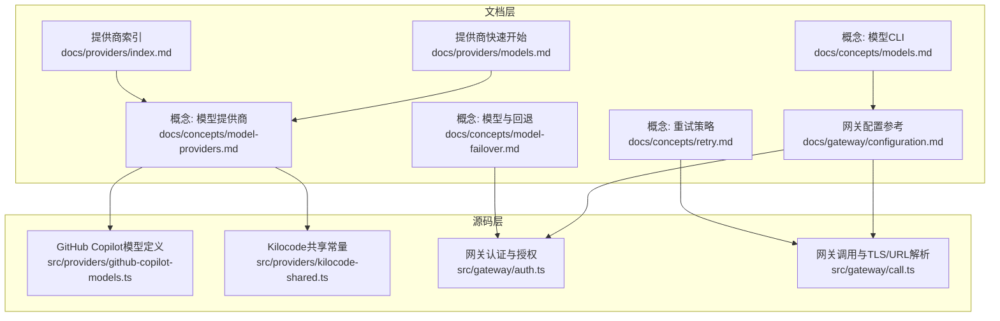
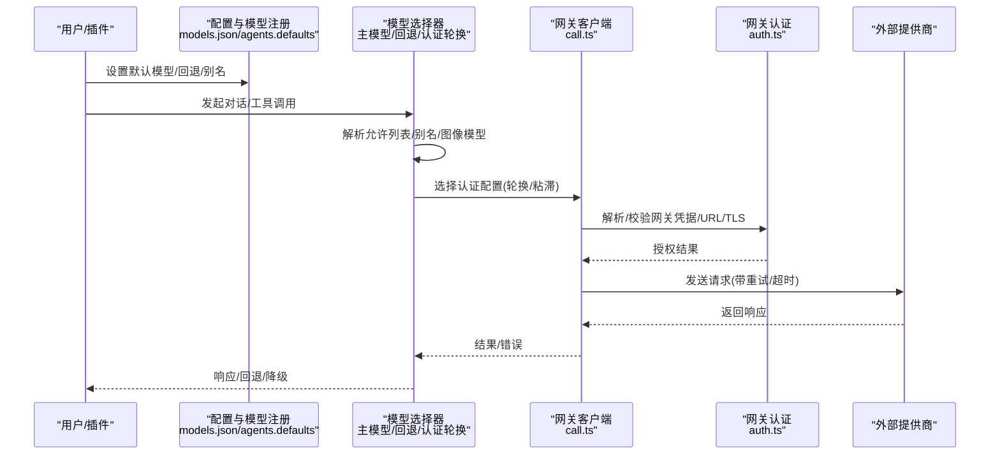
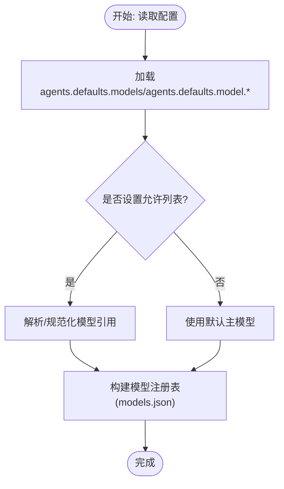
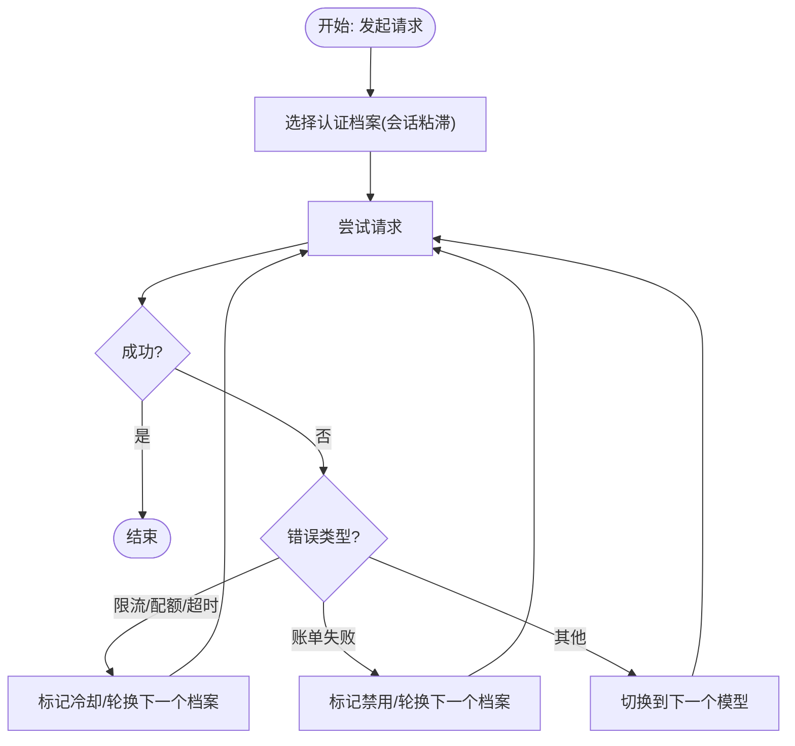
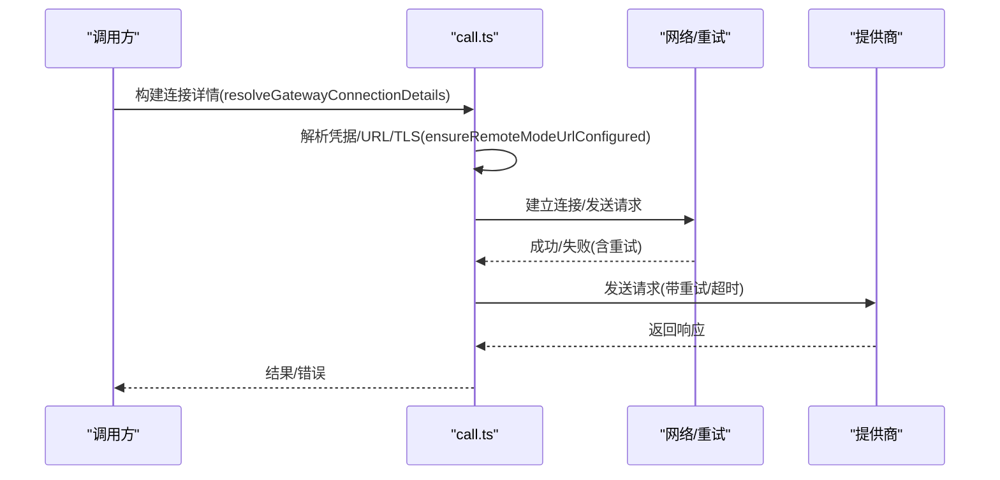
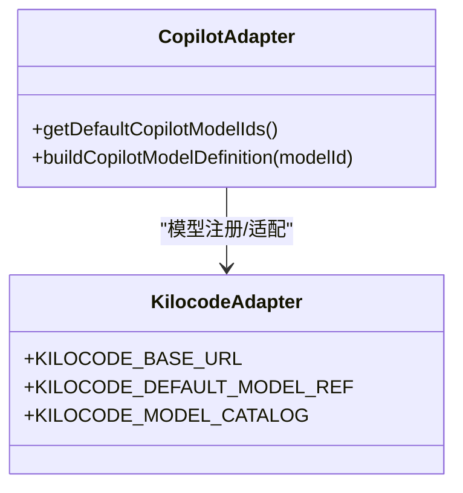
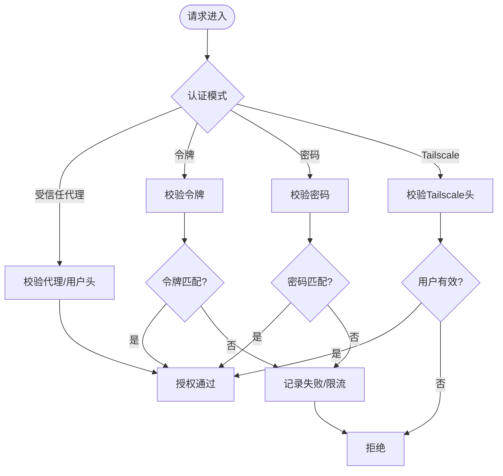

# AI模型提供商集成

## 目录
1. [简介](#简介)
2. [项目结构](#项目结构)
3. [核心组件](#核心组件)
4. [架构总览](#架构总览)
5. [详细组件分析](#详细组件分析)
6. [依赖关系分析](#依赖关系分析)
7. [性能考量](#性能考量)
8. [故障排除指南](#故障排除指南)
9. [结论](#结论)
10. [附录](#附录)

## 简介
本文件面向OpenClaw的AI模型提供商集成，系统化梳理支持的模型提供商（如OpenAI、Anthropic、Google、Claude等）的接入方式与配置方法；解释模型发现与注册机制（自动探测、能力检测、兼容性验证）；阐述模型选择算法（负载均衡、性能评估、故障转移策略）；说明模型回退机制（降级策略、错误处理、用户体验保障）；并给出模型配置最佳实践（API密钥管理、速率限制、成本控制），同时提供具体集成示例与故障排除指南。

## 项目结构
OpenClaw通过“概念文档 + 提供商文档 + 配置参考 + 源码实现”的分层组织，形成从“如何使用”到“如何实现”的完整闭环：
- 概念与用法：模型提供商概览、模型选择与回退、重试策略、配置与环境变量
- 提供商目录：各提供商快速入口与链接
- 配置参考：模型与提供商的配置键、合并策略、热重载与RPC更新
- 源码实现：提供商适配器（如Copilot、Kilocode）、网关认证与调用流程

图表来源
- [docs/concepts/model-providers.md](file://docs/concepts/model-providers.md#L1-L460)
- [docs/concepts/model-failover.md](file://docs/concepts/model-failover.md#L1-L153)
- [docs/concepts/retry.md](file://docs/concepts/retry.md#L1-L70)
- [docs/concepts/models.md](file://docs/concepts/models.md#L1-L222)
- [docs/providers/index.md](file://docs/providers/index.md#L1-L63)
- [docs/providers/models.md](file://docs/providers/models.md#L1-L45)
- [docs/gateway/configuration.md](file://docs/gateway/configuration.md#L1-L547)
- [src/providers/github-copilot-models.ts](file://src/providers/github-copilot-models.ts#L1-L44)
- [src/providers/kilocode-shared.ts](file://src/providers/kilocode-shared.ts#L1-L37)
- [src/gateway/auth.ts](file://src/gateway/auth.ts#L1-L504)
- [src/gateway/call.ts](file://src/gateway/call.ts#L1-L942)

章节来源
- [docs/concepts/model-providers.md](file://docs/concepts/model-providers.md#L1-L460)
- [docs/providers/index.md](file://docs/providers/index.md#L1-L63)
- [docs/providers/models.md](file://docs/providers/models.md#L1-L45)
- [docs/concepts/model-failover.md](file://docs/concepts/model-failover.md#L1-L153)
- [docs/concepts/retry.md](file://docs/concepts/retry.md#L1-L70)
- [docs/concepts/models.md](file://docs/concepts/models.md#L1-L222)
- [docs/gateway/configuration.md](file://docs/gateway/configuration.md#L1-L547)
- [src/providers/github-copilot-models.ts](file://src/providers/github-copilot-models.ts#L1-L44)
- [src/providers/kilocode-shared.ts](file://src/providers/kilocode-shared.ts#L1-L37)
- [src/gateway/auth.ts](file://src/gateway/auth.ts#L1-L504)
- [src/gateway/call.ts](file://src/gateway/call.ts#L1-L942)

## 核心组件
- 模型提供商与配置
  - 内置提供商：OpenAI、Anthropic、Google Gemini、OpenCode Zen、Kilocode、OpenRouter、Mistral、Groq、Cerebras、GitHub Copilot、Hugging Face Inference等
  - 自定义提供商：通过models.providers配置自定义base URL与API模式
  - 认证与轮换：支持多密钥轮换、按提供商排序、按会话粘滞、冷却与禁用策略
- 模型选择与回退
  - 优先主模型，其次回退列表；在提供商内先进行认证轮换，再进入下一个模型
  - 支持图像模型回退与别名映射
- 调用与重试
  - 单请求重试、指数抖动、最小延迟、最大延迟
  - Discord/Telegram等通道的差异化重试策略
- 网关安全与连接
  - 网关认证模式（无/令牌/密码/受信任代理）、Tailscale集成、TLS指纹校验、远程模式URL解析与安全检查

章节来源
- [docs/concepts/model-providers.md](file://docs/concepts/model-providers.md#L14-L167)
- [docs/concepts/model-failover.md](file://docs/concepts/model-failover.md#L11-L153)
- [docs/concepts/retry.md](file://docs/concepts/retry.md#L9-L70)
- [docs/concepts/models.md](file://docs/concepts/models.md#L16-L222)
- [docs/gateway/configuration.md](file://docs/gateway/configuration.md#L107-L132)
- [src/gateway/auth.ts](file://src/gateway/auth.ts#L217-L292)
- [src/gateway/call.ts](file://src/gateway/call.ts#L137-L226)

## 架构总览
OpenClaw的模型提供商集成由“配置层 + 选择层 + 调用层 + 安全层”构成，整体流程如下：

图表来源
- [docs/concepts/models.md](file://docs/concepts/models.md#L16-L36)
- [docs/concepts/model-failover.md](file://docs/concepts/model-failover.md#L11-L72)
- [docs/concepts/retry.md](file://docs/concepts/retry.md#L17-L25)
- [src/gateway/call.ts](file://src/gateway/call.ts#L137-L226)
- [src/gateway/auth.ts](file://src/gateway/auth.ts#L217-L292)

## 详细组件分析

### 组件A：模型提供商与配置
- 支持的提供商
  - 内置：OpenAI、Anthropic、Google Gemini、OpenCode Zen、Kilocode、OpenRouter、Mistral、Groq、Cerebras、GitHub Copilot、Hugging Face Inference等
  - 自定义：通过models.providers声明baseUrl、apiKey、api模式与模型清单
- 认证与轮换
  - 多密钥轮换：支持单次覆盖、逗号/分号分隔、编号列表、Live覆盖
  - 轮换触发：仅在限流/配额耗尽等场景尝试下一条密钥
  - 会话粘滞：同一会话固定认证档案，避免缓存冷启动
- 模型注册与发现
  - 允许列表与别名：agents.defaults.models作为白名单
  - 自定义提供商写入models.json，支持merge/replace模式与SecretRef标记持久化
- 运行时参数
  - 传输协议（SSE/WebSocket/Auto）、服务等级、开发者角色兼容性等

图表来源
- [docs/concepts/model-providers.md](file://docs/concepts/model-providers.md#L16-L167)
- [docs/concepts/models.md](file://docs/concepts/models.md#L48-L91)
- [docs/gateway/configuration.md](file://docs/gateway/configuration.md#L207-L222)

章节来源
- [docs/concepts/model-providers.md](file://docs/concepts/model-providers.md#L14-L167)
- [docs/concepts/models.md](file://docs/concepts/models.md#L48-L91)
- [docs/gateway/configuration.md](file://docs/gateway/configuration.md#L207-L222)

### 组件B：模型选择与回退
- 选择顺序
  - 主模型 → 回退列表 → 认证轮换 → 下一个模型
- 认证轮换
  - 显式配置优先于已配置档案，再回到存储档案
  - 未显式排序时采用轮询：OAuth优先于API Key，最久未用优先，冷却/禁用排末尾
  - 会话粘滞：同一会话复用选定档案，直至会话重置或冷却
- 冷却与禁用
  - 限流/配额/超时触发冷却，指数退避（1m/5m/25m/1h封顶）
  - 账单失败触发禁用，按提供商可配置退避上限与窗口
- 模型回退
  - 当前提供商所有档案均失败时，切换到下一个模型
  - 若运行时覆盖了模型，回退结束后仍回到默认主模型

图表来源
- [docs/concepts/model-failover.md](file://docs/concepts/model-failover.md#L42-L137)
- [src/gateway/auth.ts](file://src/gateway/auth.ts#L378-L485)

章节来源
- [docs/concepts/model-failover.md](file://docs/concepts/model-failover.md#L42-L137)
- [src/gateway/auth.ts](file://src/gateway/auth.ts#L378-L485)

### 组件C：重试策略与调用链
- 请求级重试
  - 默认重试次数、最大延迟、抖动比例
  - 不同提供商差异化行为（Discord基于retry_after，Telegram对瞬时错误重试）
- 网关调用与安全
  - URL解析：本地/远程/CLI/环境变量覆盖，安全检查（仅wss到非环回地址需TLS）
  - TLS指纹：本地TLS或远程配置，支持覆盖
  - 凭据解析：支持SecretRef与环境变量注入，远程模式凭据优先级

图表来源
- [docs/concepts/retry.md](file://docs/concepts/retry.md#L17-L37)
- [src/gateway/call.ts](file://src/gateway/call.ts#L137-L226)
- [src/gateway/call.ts](file://src/gateway/call.ts#L254-L304)
- [src/gateway/call.ts](file://src/gateway/call.ts#L702-L729)

章节来源
- [docs/concepts/retry.md](file://docs/concepts/retry.md#L17-L37)
- [src/gateway/call.ts](file://src/gateway/call.ts#L137-L226)
- [src/gateway/call.ts](file://src/gateway/call.ts#L254-L304)
- [src/gateway/call.ts](file://src/gateway/call.ts#L702-L729)

### 组件D：提供商适配器示例
- GitHub Copilot
  - 使用OpenAI兼容响应API，保留provider标识以附加特定头部
  - 默认上下文窗口与最大输出长度，输入支持文本与图像
- Kilocode
  - 默认网关URL、模型引用与静态目录，动态目录同步失败时回退静态目录
  - 默认上下文窗口、最大输出长度与成本结构

图表来源
- [src/providers/github-copilot-models.ts](file://src/providers/github-copilot-models.ts#L1-L44)
- [src/providers/kilocode-shared.ts](file://src/providers/kilocode-shared.ts#L1-L37)

章节来源
- [src/providers/github-copilot-models.ts](file://src/providers/github-copilot-models.ts#L1-L44)
- [src/providers/kilocode-shared.ts](file://src/providers/kilocode-shared.ts#L1-L37)

### 组件E：网关认证与授权
- 认证模式
  - 无/令牌/密码/受信任代理；支持Tailscale头认证（WS控制UI启用）
- 凭据解析
  - 支持SecretRef、环境变量、配置值；远程模式凭据优先级与回退策略
- 速率限制
  - 对错误凭据进行失败记录，返回retryAfterMs；本地直连请求简化处理

图表来源
- [src/gateway/auth.ts](file://src/gateway/auth.ts#L217-L292)
- [src/gateway/auth.ts](file://src/gateway/auth.ts#L378-L485)

章节来源
- [src/gateway/auth.ts](file://src/gateway/auth.ts#L217-L292)
- [src/gateway/auth.ts](file://src/gateway/auth.ts#L378-L485)

## 依赖关系分析
- 文档层依赖
  - 概念文档为实现提供规则与边界（模型选择、回退、重试、配置）
  - 提供商文档与配置参考为用户提供可操作的配置片段与最佳实践
- 源码层依赖
  - 模型注册与选择依赖配置层（agents.defaults.models、models.json）
  - 调用链依赖认证层（凭据解析、URL/TLS、远程模式）
  - 提供商适配器（Copilot/Kilocode）依赖通用模型定义接口

图表来源
- [docs/concepts/model-providers.md](file://docs/concepts/model-providers.md#L1-L460)
- [docs/concepts/model-failover.md](file://docs/concepts/model-failover.md#L1-L153)
- [docs/concepts/retry.md](file://docs/concepts/retry.md#L1-L70)
- [docs/gateway/configuration.md](file://docs/gateway/configuration.md#L1-L547)
- [src/gateway/call.ts](file://src/gateway/call.ts#L1-L942)
- [src/gateway/auth.ts](file://src/gateway/auth.ts#L1-L504)
- [src/providers/github-copilot-models.ts](file://src/providers/github-copilot-models.ts#L1-L44)
- [src/providers/kilocode-shared.ts](file://src/providers/kilocode-shared.ts#L1-L37)

章节来源
- [docs/concepts/model-providers.md](file://docs/concepts/model-providers.md#L1-L460)
- [docs/concepts/model-failover.md](file://docs/concepts/model-failover.md#L1-L153)
- [docs/concepts/retry.md](file://docs/concepts/retry.md#L1-L70)
- [docs/gateway/configuration.md](file://docs/gateway/configuration.md#L1-L547)
- [src/gateway/call.ts](file://src/gateway/call.ts#L1-L942)
- [src/gateway/auth.ts](file://src/gateway/auth.ts#L1-L504)
- [src/providers/github-copilot-models.ts](file://src/providers/github-copilot-models.ts#L1-L44)
- [src/providers/kilocode-shared.ts](file://src/providers/kilocode-shared.ts#L1-L37)

## 性能考量
- 传输协议与缓存友好
  - OpenAI默认优先WebSocket，SSE回退；启用“WebSocket预热”减少冷启动
  - 会话粘滞避免频繁切换档案导致缓存失效
- 重试与退避
  - 合理的最小/最大延迟与抖动，降低雪崩风险
  - 仅在限流/配额/超时等场景重试，避免对不可幂等操作重复执行
- 成本与上下文
  - 图像转小尺寸可显著降低视觉token消耗
  - 上下文窗口与最大输出长度影响成本与延迟，建议根据任务调整

## 故障排除指南
- 模型不可用/不允许
  - 症状：提示模型不在允许列表中
  - 处理：添加到agents.defaults.models或清空允许列表，或使用/models列出可用模型
- 认证失败/限流
  - 症状：429/配额耗尽/超时
  - 处理：启用多密钥轮换；检查冷却状态；必要时切换到备用模型
- 账单不足
  - 症状：余额过低
  - 处理：档案被禁用并进入较长退避；更换账户或充值后恢复
- 网关URL不安全
  - 症状：明文ws://到非环回地址被阻止
  - 处理：使用wss://或通过SSH隧道/Tailscale Serve/Funnel
- 重试无效
  - 症状：Telegram/Discord持续失败
  - 处理：检查retry_after与提供商返回的重试时机；确认Markdown解析错误不重试

章节来源
- [docs/concepts/models.md](file://docs/concepts/models.md#L61-L91)
- [docs/concepts/model-failover.md](file://docs/concepts/model-failover.md#L80-L137)
- [src/gateway/call.ts](file://src/gateway/call.ts#L186-L207)

## 结论
OpenClaw通过清晰的概念文档、完善的配置参考与稳健的源码实现，提供了可扩展、可观测、可回退的AI模型提供商集成方案。内置与自定义提供商并存，结合认证轮换、模型回退与重试策略，能够在复杂生产环境中实现高可用与成本可控的推理服务。

## 附录
- 快速开始步骤
  - 交互式向导：openclaw onboard
  - 设置默认模型：agents.defaults.model.primary
  - 列出/切换模型：openclaw models list/status/set
- 常用配置键
  - agents.defaults.model.primary/fallbacks
  - agents.defaults.models（允许列表+别名+参数）
  - models.providers（自定义提供商）
  - env与SecretRef（API密钥与敏感信息）

章节来源
- [docs/providers/models.md](file://docs/providers/models.md#L14-L24)
- [docs/concepts/models.md](file://docs/concepts/models.md#L116-L137)
- [docs/gateway/configuration.md](file://docs/gateway/configuration.md#L107-L132)