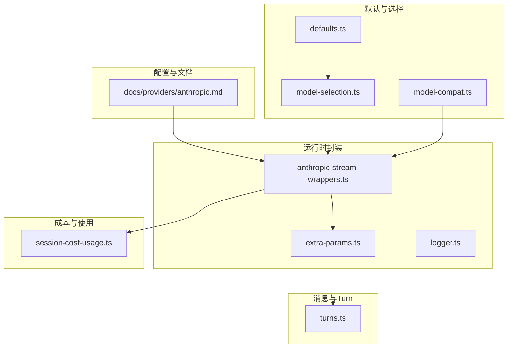
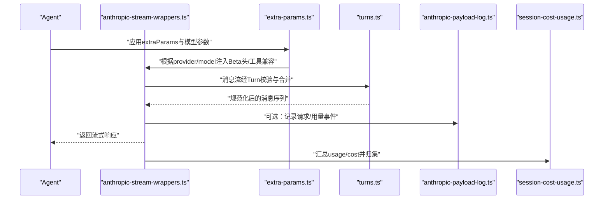
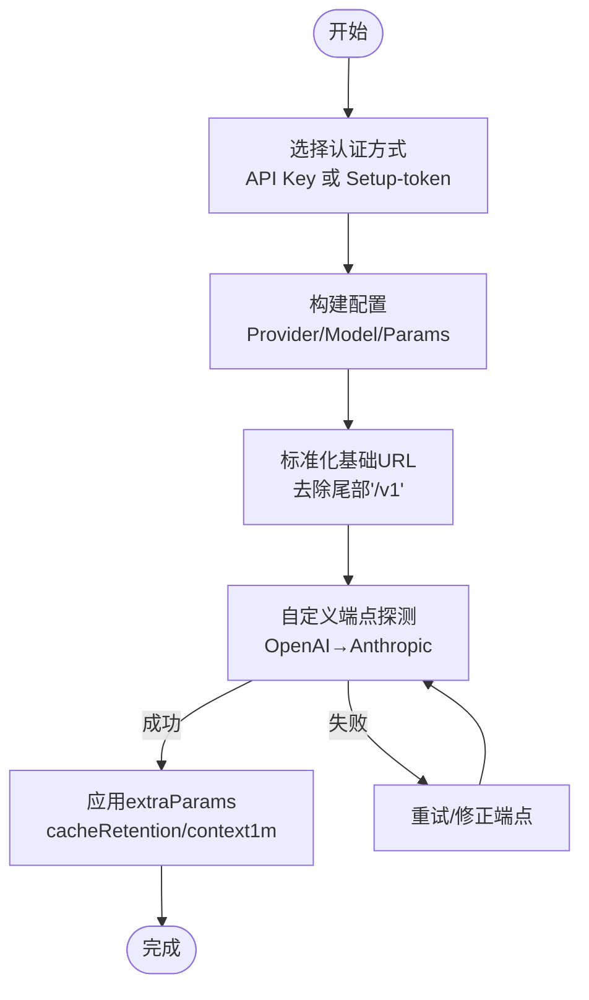
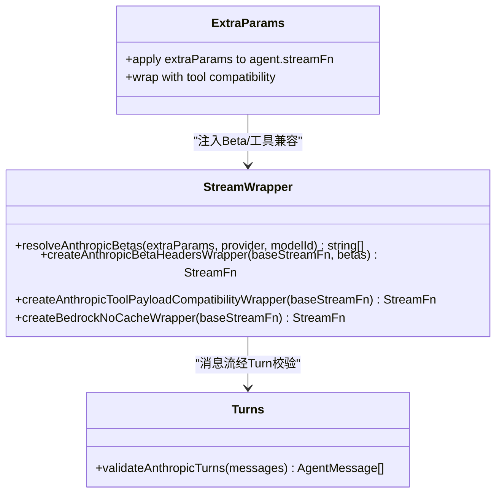
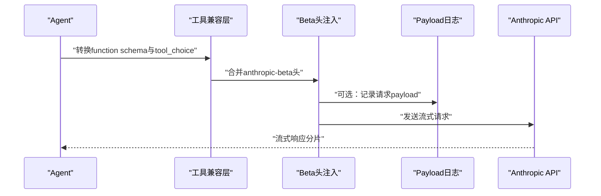
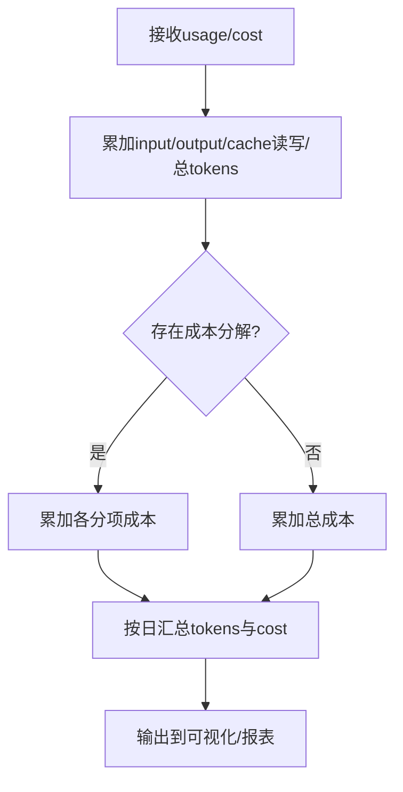
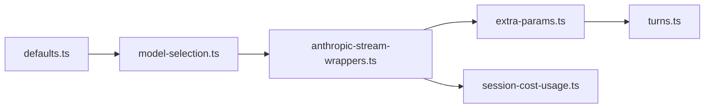

# Anthropic集成

## 目录
1. [简介](#简介)
2. [项目结构](#项目结构)
3. [核心组件](#核心组件)
4. [架构总览](#架构总览)
5. [详细组件分析](#详细组件分析)
6. [依赖关系分析](#依赖关系分析)
7. [性能考虑](#性能考虑)
8. [故障排查指南](#故障排查指南)
9. [结论](#结论)
10. [附录](#附录)

## 简介
本技术文档面向在OpenClaw中集成Anthropic Claude模型提供商的工程实践，聚焦以下目标：
- 集成配置：API密钥管理与端点设置
- 模型系列与特性：Haiku、Sonnet、Opus的定位与适用场景
- Claude特有能力：推理模式（thinking）、系统提示、工具调用支持
- 流式输出与响应格式：数据流包装、Turn序列校验与兼容性
- 性能优化与成本控制：令牌计费、使用量监控与缓存策略

## 项目结构
与Anthropic集成相关的核心代码分布在以下模块：
- 文档与配置：提供Anthropic认证方式、参数与行为说明
- 运行时封装：流式函数包装器、Beta能力注入、工具调用兼容
- 会话与消息：Turn序列校验、消息合并与清理
- 默认值与选择：默认Provider/模型、思考级别默认策略
- 成本与使用：使用量聚合、成本统计与可视化支撑

**图表来源**
- [docs/providers/anthropic.md](file://docs/providers/anthropic.md#L1-L232)
- [src/agents/pi-embedded-runner/anthropic-stream-wrappers.ts](file://src/agents/pi-embedded-runner/anthropic-stream-wrappers.ts#L1-L320)
- [src/agents/pi-embedded-runner/extra-params.ts](file://src/agents/pi-embedded-runner/extra-params.ts#L356-L389)
- [src/agents/pi-embedded-helpers/turns.ts](file://src/agents/pi-embedded-helpers/turns.ts#L192-L201)
- [src/agents/defaults.ts](file://src/agents/defaults.ts#L1-L7)
- [src/agents/model-selection.ts](file://src/agents/model-selection.ts#L550-L605)
- [src/agents/model-compat.ts](file://src/agents/model-compat.ts#L36-L48)
- [src/infra/session-cost-usage.ts](file://src/infra/session-cost-usage.ts#L186-L631)

**章节来源**
- [docs/providers/anthropic.md](file://docs/providers/anthropic.md#L1-L232)
- [src/agents/defaults.ts](file://src/agents/defaults.ts#L1-L7)
- [src/agents/model-selection.ts](file://src/agents/model-selection.ts#L550-L605)
- [src/agents/pi-embedded-runner/anthropic-stream-wrappers.ts](file://src/agents/pi-embedded-runner/anthropic-stream-wrappers.ts#L1-L320)
- [src/agents/pi-embedded-helpers/turns.ts](file://src/agents/pi-embedded-helpers/turns.ts#L192-L201)
- [src/infra/session-cost-usage.ts](file://src/infra/session-cost-usage.ts#L186-L631)

## 核心组件
- 认证与配置
  - 支持API Key与setup-token两种认证方式；提供CLI与配置片段示例
  - 提供prompt caching与1M上下文窗口等高级参数的配置入口
- 流式封装与Beta能力
  - 自动注入Anthropic Beta头，按OAuth或直接API Key区分默认Beta集合
  - 支持工具调用兼容层（OpenAI风格的function schema与tool_choice）
  - Bedrock场景下的缓存策略覆盖
- Turn序列与消息校验
  - 强制交替用户→助手的消息顺序，合并连续用户消息
  - 清理不匹配的tool_use/工具结果对
- 默认值与模型选择
  - 默认Provider与模型、默认思考级别策略（Claude 4.6家族默认adaptive）
- 成本与使用量
  - 统一归集input/output/cache读写/写入与总tokens/cost
  - 支持按天粒度汇总与可视化

**章节来源**
- [docs/providers/anthropic.md](file://docs/providers/anthropic.md#L14-L232)
- [src/agents/defaults.ts](file://src/agents/defaults.ts#L1-L7)
- [src/agents/model-selection.ts](file://src/agents/model-selection.ts#L550-L605)
- [src/agents/pi-embedded-runner/anthropic-stream-wrappers.ts](file://src/agents/pi-embedded-runner/anthropic-stream-wrappers.ts#L243-L320)
- [src/agents/pi-embedded-helpers/turns.ts](file://src/agents/pi-embedded-helpers/turns.ts#L192-L201)
- [src/infra/session-cost-usage.ts](file://src/infra/session-cost-usage.ts#L186-L631)

## 架构总览
下图展示从Agent到Anthropic API的关键调用链路，包括流式封装、Turn校验、Beta头注入与工具调用兼容。

**图表来源**
- [src/agents/pi-embedded-runner/extra-params.ts](file://src/agents/pi-embedded-runner/extra-params.ts#L356-L389)
- [src/agents/pi-embedded-runner/anthropic-stream-wrappers.ts](file://src/agents/pi-embedded-runner/anthropic-stream-wrappers.ts#L243-L320)
- [src/agents/pi-embedded-helpers/turns.ts](file://src/agents/pi-embedded-helpers/turns.ts#L192-L201)
- [src/agents/anthropic-payload-log.ts](file://src/agents/anthropic-payload-log.ts#L134-L184)
- [src/infra/session-cost-usage.ts](file://src/infra/session-cost-usage.ts#L186-L631)

## 详细组件分析

### 认证与端点配置
- 认证方式
  - API Key：适用于标准API访问与按量计费
  - Setup-token：适用于订阅账户，通过Claude CLI生成并在网关主机上粘贴
- 端点与兼容
  - Anthropic Messages端点URL规范：基础URL自动去除尾部“/v1”，避免重复拼接导致404
  - 自定义端点探测：先尝试OpenAI风格，再尝试Anthropic风格，失败则提示重试
- 配置要点
  - 默认Provider与模型：默认anthropic/claude-opus-4-6
  - Prompt缓存：cacheRetention支持none/short/long；API Key默认short，Bedrock按需覆盖
  - 1M上下文：context1m仅对特定前缀模型生效，并映射到对应Beta头

**图表来源**
- [src/commands/onboard-custom.ts](file://src/commands/onboard-custom.ts#L356-L382)
- [src/agents/model-compat.ts](file://src/agents/model-compat.ts#L36-L48)
- [docs/providers/anthropic.md](file://docs/providers/anthropic.md#L14-L125)

**章节来源**
- [docs/providers/anthropic.md](file://docs/providers/anthropic.md#L14-L125)
- [src/commands/onboard-custom.ts](file://src/commands/onboard-custom.ts#L356-L382)
- [src/agents/model-compat.ts](file://src/agents/model-compat.ts#L36-L48)

### Claude模型系列与适用场景
- Haiku：强调速度与效率，适合轻量任务与快速响应
- Sonnet：平衡推理与效率，适合通用复杂任务
- Opus：强调更强推理与长上下文能力，适合深度分析与创作
- 4.6家族默认思考级别：当未显式设置时，默认采用adaptive以提升推理质量

**章节来源**
- [src/agents/defaults.ts](file://src/agents/defaults.ts#L1-L7)
- [src/agents/model-selection.ts](file://src/agents/model-selection.ts#L590-L605)

### Claude特有能力与参数
- 推理模式（Thinking）
  - per-model params.thinking优先于全局thinkingDefault
  - Claude 4.6家族默认adaptive
- 系统提示与消息序列
  - 严格交替的user→assistant序列，合并连续用户消息
  - 清理缺失对应结果的tool_use块，保证消息完整性
- 工具调用支持
  - 自动将OpenAI风格的function schema与tool_choice映射到Anthropic兼容格式
  - 对特定provider启用OpenAI兼容的工具载荷
- Beta能力与头部
  - 默认Beta集合随认证方式变化（OAuth与直接API Key）
  - 可叠加自定义anthropicBeta；context1m仅对指定前缀模型生效且OAuth场景下会被忽略

**图表来源**
- [src/agents/pi-embedded-runner/anthropic-stream-wrappers.ts](file://src/agents/pi-embedded-runner/anthropic-stream-wrappers.ts#L243-L320)
- [src/agents/pi-embedded-runner/extra-params.ts](file://src/agents/pi-embedded-runner/extra-params.ts#L356-L389)
- [src/agents/pi-embedded-helpers/turns.ts](file://src/agents/pi-embedded-helpers/turns.ts#L192-L201)

**章节来源**
- [src/agents/pi-embedded-runner/anthropic-stream-wrappers.ts](file://src/agents/pi-embedded-runner/anthropic-stream-wrappers.ts#L1-L320)
- [src/agents/pi-embedded-runner/extra-params.ts](file://src/agents/pi-embedded-runner/extra-params.ts#L356-L389)
- [src/agents/pi-embedded-helpers/turns.ts](file://src/agents/pi-embedded-helpers/turns.ts#L192-L201)

### 流式输出处理与响应格式转换
- 流式封装
  - 包装StreamFn以注入Beta头与工具调用兼容层
  - 可选记录payload与usage到日志文件，便于诊断
- 响应格式
  - 将OpenAI风格的function schema与tool_choice转换为Anthropic可接受的格式
  - 在Bedrock场景强制cacheRetention:none以规避不一致行为
- Turn序列
  - 合并连续用户消息，确保严格交替
  - 清理不匹配的tool_use/工具结果对

**图表来源**
- [src/agents/pi-embedded-runner/anthropic-stream-wrappers.ts](file://src/agents/pi-embedded-runner/anthropic-stream-wrappers.ts#L272-L320)
- [src/agents/anthropic-payload-log.ts](file://src/agents/anthropic-payload-log.ts#L134-L184)

**章节来源**
- [src/agents/pi-embedded-runner/anthropic-stream-wrappers.ts](file://src/agents/pi-embedded-runner/anthropic-stream-wrappers.ts#L272-L320)
- [src/agents/anthropic-payload-log.ts](file://src/agents/anthropic-payload-log.ts#L134-L184)

### 使用量监控与成本控制
- 使用量聚合
  - 归集input/output/cache读写/写入与总tokens
  - 支持成本分解与总成本累计
- 日维度汇总
  - 按日期聚合tokens与cost，用于仪表盘与报表
- 诊断与日志
  - 可开启anthropic-payload日志，记录请求与usage，辅助问题定位

**图表来源**
- [src/infra/session-cost-usage.ts](file://src/infra/session-cost-usage.ts#L186-L631)
- [src/agents/anthropic-payload-log.ts](file://src/agents/anthropic-payload-log.ts#L158-L184)

**章节来源**
- [src/infra/session-cost-usage.ts](file://src/infra/session-cost-usage.ts#L186-L631)
- [src/agents/anthropic-payload-log.ts](file://src/agents/anthropic-payload-log.ts#L158-L184)

## 依赖关系分析
- Provider与模型
  - 默认Provider与模型由defaults.ts定义
  - 模型选择与思考级别默认策略由model-selection.ts决定
- 运行时封装
  - anthropic-stream-wrappers.ts负责Beta头与工具兼容
  - extra-params.ts在应用extraParams后注入封装
- 消息与Turn
  - turns.ts在流式阶段进行序列校验与合并
- 成本与使用
  - session-cost-usage.ts统一归集与汇总

**图表来源**
- [src/agents/defaults.ts](file://src/agents/defaults.ts#L1-L7)
- [src/agents/model-selection.ts](file://src/agents/model-selection.ts#L550-L605)
- [src/agents/pi-embedded-runner/anthropic-stream-wrappers.ts](file://src/agents/pi-embedded-runner/anthropic-stream-wrappers.ts#L1-L320)
- [src/agents/pi-embedded-runner/extra-params.ts](file://src/agents/pi-embedded-runner/extra-params.ts#L356-L389)
- [src/agents/pi-embedded-helpers/turns.ts](file://src/agents/pi-embedded-helpers/turns.ts#L192-L201)
- [src/infra/session-cost-usage.ts](file://src/infra/session-cost-usage.ts#L186-L631)

**章节来源**
- [src/agents/defaults.ts](file://src/agents/defaults.ts#L1-L7)
- [src/agents/model-selection.ts](file://src/agents/model-selection.ts#L550-L605)
- [src/agents/pi-embedded-runner/anthropic-stream-wrappers.ts](file://src/agents/pi-embedded-runner/anthropic-stream-wrappers.ts#L1-L320)
- [src/agents/pi-embedded-runner/extra-params.ts](file://src/agents/pi-embedded-runner/extra-params.ts#L356-L389)
- [src/agents/pi-embedded-helpers/turns.ts](file://src/agents/pi-embedded-helpers/turns.ts#L192-L201)
- [src/infra/session-cost-usage.ts](file://src/infra/session-cost-usage.ts#L186-L631)

## 性能考虑
- 缓存策略
  - API Key认证默认短缓存（short），减少prompt重复写入开销
  - 高频/低复用场景可将特定agent设为none，长周期复用场景可设为long（需Beta标志）
- 上下文窗口
  - 1M上下文仅对特定前缀模型启用，且需凭证允许额外用量
  - OAuth场景下会自动忽略context1m以避免被拒绝
- 工具调用
  - 开启OpenAI兼容schema与tool_choice可减少适配成本，提高吞吐
- Turn序列
  - 合并连续用户消息可降低往返次数，提升交互效率

**章节来源**
- [docs/providers/anthropic.md](file://docs/providers/anthropic.md#L47-L160)
- [src/agents/pi-embedded-runner/anthropic-stream-wrappers.ts](file://src/agents/pi-embedded-runner/anthropic-stream-wrappers.ts#L182-L241)

## 故障排查指南
- 401/令牌失效
  - 订阅账户的OAuth令牌可能过期或被撤销，需重新生成setup-token并粘贴至网关主机
- 无可用认证配置
  - 新建agent不会继承主agent密钥，需单独onboarding或粘贴token
  - 使用状态命令检查当前激活的profile与可用性
- 端点探测失败
  - 自定义端点未正确响应OpenAI或Anthropic风格请求，需修正baseUrl或重试
- 上下文1M请求被拒
  - OAuth令牌在该场景下会被拒绝，需切换为API Key或满足额外用量条件

**章节来源**
- [docs/providers/anthropic.md](file://docs/providers/anthropic.md#L206-L232)
- [src/commands/onboard-custom.ts](file://src/commands/onboard-custom.ts#L703-L743)

## 结论
OpenClaw对Anthropic的集成围绕“安全认证、参数兼容、流式封装、Turn校验与成本可观测”展开。通过默认的思考级别、工具调用兼容与缓存策略，可在不同场景下获得稳定且高效的推理体验。配合使用量与成本归集，可实现精细化的成本控制与性能优化。

## 附录
- 实时测试参考
  - setup-token live测试用于验证认证与基本completion流程，便于集成联调与回归

**章节来源**
- [src/agents/anthropic.setup-token.live.test.ts](file://src/agents/anthropic.setup-token.live.test.ts#L181-L249)