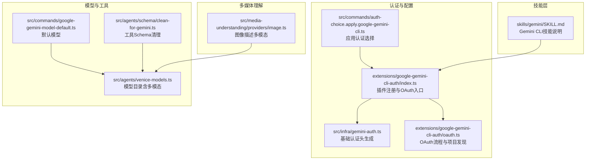
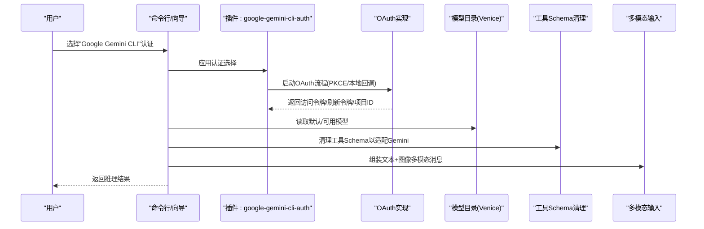
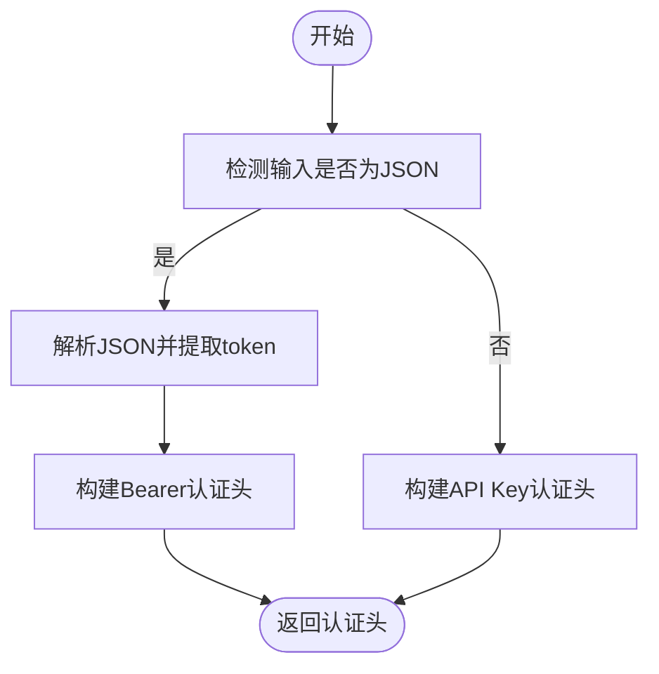
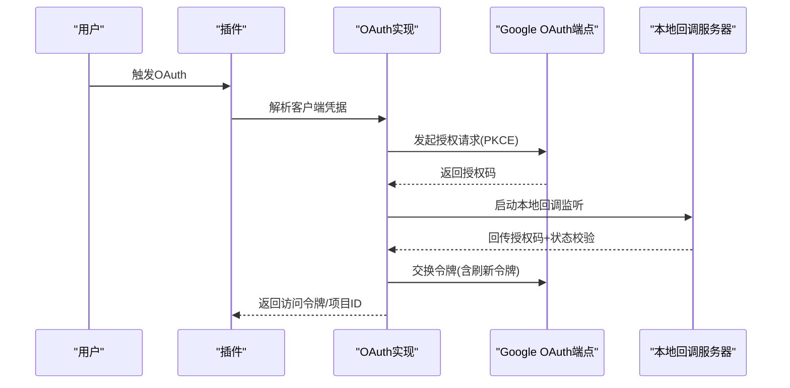
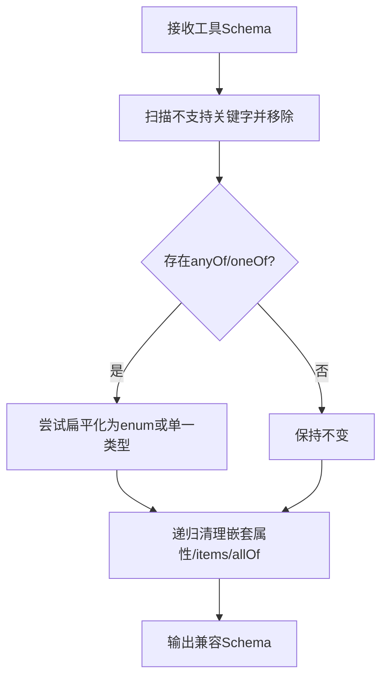
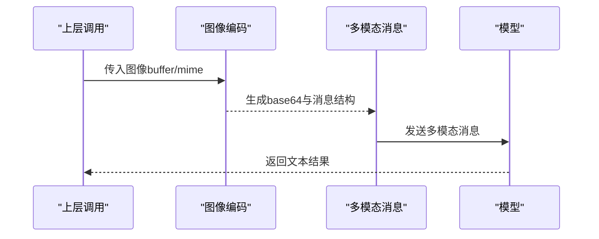
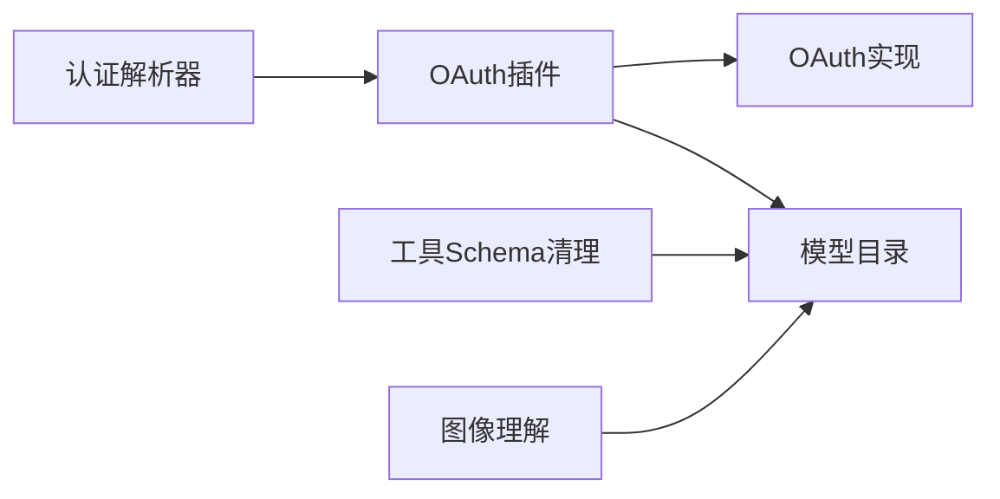

# Google集成


## 目录
1. [简介](#简介)
2. [项目结构](#项目结构)
3. [核心组件](#核心组件)
4. [架构总览](#架构总览)
5. [详细组件分析](#详细组件分析)
6. [依赖关系分析](#依赖关系分析)
7. [性能考量](#性能考量)
8. [故障排查指南](#故障排查指南)
9. [结论](#结论)
10. [附录](#附录)

## 简介
本文件面向在OpenClaw生态中集成Google AI模型提供商（以Gemini为核心）的开发者与运维人员，系统化说明以下内容：
- Gemini API的两种认证路径：传统API Key与OAuth（含Gemini CLI OAuth）
- 支持的模型类型与特性（含通过Venice代理的多模态模型）
- Google Cloud特定配置要点（项目ID、权限与环境变量）
- 多模态输入处理（文本、图像、视频）与工具Schema适配
- 最佳实践与成本优化建议

## 项目结构
围绕Google集成的关键模块分布于如下位置：
- 认证与插件注册：extensions/google-gemini-cli-auth
- 基础认证解析：src/infra/gemini-auth.ts
- 模型默认值与模型目录：src/commands/google-gemini-model-default.ts、src/agents/venice-models.ts
- 工具Schema清理（兼容Gemini限制）：src/agents/schema/clean-for-gemini.ts
- 多媒体理解（图像/视频）：src/media-understanding/providers/image.ts
- 技能层示例（Gemini CLI技能）：skills/gemini/SKILL.md



**图表来源**
- [src/infra/gemini-auth.ts](file://src/infra/gemini-auth.ts#L1-L41)
- [extensions/google-gemini-cli-auth/index.ts](file://extensions/google-gemini-cli-auth/index.ts#L1-L76)
- [extensions/google-gemini-cli-auth/oauth.ts](file://extensions/google-gemini-cli-auth/oauth.ts#L1-L735)
- [src/commands/auth-choice.apply.google-gemini-cli.ts](file://src/commands/auth-choice.apply.google-gemini-cli.ts#L1-L38)
- [src/commands/google-gemini-model-default.ts](file://src/commands/google-gemini-model-default.ts#L1-L12)
- [src/agents/venice-models.ts](file://src/agents/venice-models.ts#L405-L455)
- [src/agents/schema/clean-for-gemini.ts](file://src/agents/schema/clean-for-gemini.ts#L1-L416)
- [src/media-understanding/providers/image.ts](file://src/media-understanding/providers/image.ts#L45-L78)
- [skills/gemini/SKILL.md](file://skills/gemini/SKILL.md#L1-L44)

**章节来源**
- [src/infra/gemini-auth.ts](file://src/infra/gemini-auth.ts#L1-L41)
- [extensions/google-gemini-cli-auth/index.ts](file://extensions/google-gemini-cli-auth/index.ts#L1-L76)
- [extensions/google-gemini-cli-auth/oauth.ts](file://extensions/google-gemini-cli-auth/oauth.ts#L1-L735)
- [src/commands/auth-choice.apply.google-gemini-cli.ts](file://src/commands/auth-choice.apply.google-gemini-cli.ts#L1-L38)
- [src/commands/google-gemini-model-default.ts](file://src/commands/google-gemini-model-default.ts#L1-L12)
- [src/agents/venice-models.ts](file://src/agents/venice-models.ts#L405-L455)
- [src/agents/schema/clean-for-gemini.ts](file://src/agents/schema/clean-for-gemini.ts#L1-L416)
- [src/media-understanding/providers/image.ts](file://src/media-understanding/providers/image.ts#L45-L78)
- [skills/gemini/SKILL.md](file://skills/gemini/SKILL.md#L1-L44)

## 核心组件
- 认证解析器：统一解析传统API Key与OAuth JSON格式，输出符合Gemini要求的请求头。
- OAuth插件：封装Gemini CLI OAuth流程，自动发现或引导用户设置Google Cloud项目ID。
- 模型默认值与目录：提供默认模型与多模态模型清单（文本/图像），并标注上下文窗口与隐私级别。
- 工具Schema清理：针对Gemini严格JSON Schema子集进行清理与简化，避免400错误。
- 多媒体理解：将图像数据编码为多模态消息，调用模型完成视觉理解。

**章节来源**
- [src/infra/gemini-auth.ts](file://src/infra/gemini-auth.ts#L15-L40)
- [extensions/google-gemini-cli-auth/index.ts](file://extensions/google-gemini-cli-auth/index.ts#L19-L76)
- [extensions/google-gemini-cli-auth/oauth.ts](file://extensions/google-gemini-cli-auth/oauth.ts#L467-L604)
- [src/commands/google-gemini-model-default.ts](file://src/commands/google-gemini-model-default.ts#L4-L11)
- [src/agents/venice-models.ts](file://src/agents/venice-models.ts#L405-L432)
- [src/agents/schema/clean-for-gemini.ts](file://src/agents/schema/clean-for-gemini.ts#L4-L30)
- [src/media-understanding/providers/image.ts](file://src/media-understanding/providers/image.ts#L56-L77)

## 架构总览
下图展示从用户触发到模型调用的关键交互路径，涵盖认证、模型选择与多模态输入处理。



**图表来源**
- [src/commands/auth-choice.apply.google-gemini-cli.ts](file://src/commands/auth-choice.apply.google-gemini-cli.ts#L4-L37)
- [extensions/google-gemini-cli-auth/index.ts](file://extensions/google-gemini-cli-auth/index.ts#L24-L71)
- [extensions/google-gemini-cli-auth/oauth.ts](file://extensions/google-gemini-cli-auth/oauth.ts#L659-L734)
- [src/commands/google-gemini-model-default.ts](file://src/commands/google-gemini-model-default.ts#L6-L11)
- [src/agents/schema/clean-for-gemini.ts](file://src/agents/schema/clean-for-gemini.ts#L405-L416)
- [src/media-understanding/providers/image.ts](file://src/media-understanding/providers/image.ts#L56-L77)

## 详细组件分析

### 认证与授权
- 传统API Key模式：直接使用头部"x-goog-api-key"传递密钥。
- OAuth JSON模式：当输入为JSON时解析其中的token字段，使用"Authorization: Bearer ..."。
- OAuth插件支持Gemini CLI OAuth，包含PKCE、本地回调、刷新令牌与用户邮箱获取。
- 项目ID发现：优先从环境变量GOOGLE_CLOUD_PROJECT/GOOGLE_CLOUD_PROJECT_ID读取；若未配置且账户非免费层级，会提示设置。



**图表来源**
- [src/infra/gemini-auth.ts](file://src/infra/gemini-auth.ts#L15-L40)

**章节来源**
- [src/infra/gemini-auth.ts](file://src/infra/gemini-auth.ts#L15-L40)
- [extensions/google-gemini-cli-auth/index.ts](file://extensions/google-gemini-cli-auth/index.ts#L37-L69)
- [extensions/google-gemini-cli-auth/oauth.ts](file://extensions/google-gemini-cli-auth/oauth.ts#L467-L604)

### OAuth流程与项目发现
- 客户端凭据来源：优先使用环境变量OPENCLAW_GEMINI_OAUTH_CLIENT_ID/CLIENT_SECRET或GEMINI_CLI_OAUTH_CLIENT_ID/CLIENT_SECRET；若未找到则尝试从已安装的Gemini CLI中提取。
- 授权与令牌交换：使用PKCE参数生成挑战与验证器，打开浏览器完成授权后，本地监听回调或手动粘贴重定向URL换取令牌。
- 项目ID发现：调用Google内部接口加载/引导用户，若失败则回退至环境变量；若仍不可得则抛出明确错误提示。



**图表来源**
- [extensions/google-gemini-cli-auth/oauth.ts](file://extensions/google-gemini-cli-auth/oauth.ts#L217-L237)
- [extensions/google-gemini-cli-auth/oauth.ts](file://extensions/google-gemini-cli-auth/oauth.ts#L261-L275)
- [extensions/google-gemini-cli-auth/oauth.ts](file://extensions/google-gemini-cli-auth/oauth.ts#L305-L396)
- [extensions/google-gemini-cli-auth/oauth.ts](file://extensions/google-gemini-cli-auth/oauth.ts#L398-L450)
- [extensions/google-gemini-cli-auth/oauth.ts](file://extensions/google-gemini-cli-auth/oauth.ts#L467-L604)

**章节来源**
- [extensions/google-gemini-cli-auth/oauth.ts](file://extensions/google-gemini-cli-auth/oauth.ts#L197-L215)
- [extensions/google-gemini-cli-auth/oauth.ts](file://extensions/google-gemini-cli-auth/oauth.ts#L659-L734)

### 模型类型与多模态能力
- 默认模型：google/gemini-3.1-pro-preview。
- 通过Venice代理的多模态模型（文本+图像）：
  - gemini-3-pro-preview（上下文198k，最大输出32k）
  - gemini-3-1-pro-preview（上下文1M，最大输出32k）
  - gemini-3-flash-preview（上下文256k，最大输出65k）

```mermaid
classDiagram
class 模型目录 {
+id : string
+name : string
+reasoning : boolean
+input : ["text","image"]
+contextWindow : number
+maxTokens : number
+privacy : string
}
模型目录 <|.. "gemini-3-pro-preview"
模型目录 <|.. "gemini-3-1-pro-preview"
模型目录 <|.. "gemini-3-flash-preview"
```

**图表来源**
- [src/agents/venice-models.ts](file://src/agents/venice-models.ts#L405-L432)

**章节来源**
- [src/commands/google-gemini-model-default.ts](file://src/commands/google-gemini-model-default.ts#L4-L11)
- [src/agents/venice-models.ts](file://src/agents/venice-models.ts#L405-L432)

### 工具Schema清理（适配Gemini）
- 移除不被Cloud Code Assist接受的Schema关键字（如patternProperties、additionalProperties、$ref等）。
- 对anyOf/oneOf进行扁平化与类型推断，确保Schema可被Gemini严格校验接受。
- 保留元信息（title、description、default）并处理$ref与$defs。



**图表来源**
- [src/agents/schema/clean-for-gemini.ts](file://src/agents/schema/clean-for-gemini.ts#L4-L30)
- [src/agents/schema/clean-for-gemini.ts](file://src/agents/schema/clean-for-gemini.ts#L210-L366)
- [src/agents/schema/clean-for-gemini.ts](file://src/agents/schema/clean-for-gemini.ts#L373-L403)

**章节来源**
- [src/agents/schema/clean-for-gemini.ts](file://src/agents/schema/clean-for-gemini.ts#L4-L30)
- [src/agents/schema/clean-for-gemini.ts](file://src/agents/schema/clean-for-gemini.ts#L210-L366)

### 多模态输入处理（文本+图像）
- 将图像缓冲区转为base64，并按多模态消息格式组织（文本+图像），随后调用模型完成理解与生成。
- 该流程适用于支持图像输入的模型（如Venice目录中的Gemini系列）。



**图表来源**
- [src/media-understanding/providers/image.ts](file://src/media-understanding/providers/image.ts#L45-L78)

**章节来源**
- [src/media-understanding/providers/image.ts](file://src/media-understanding/providers/image.ts#L56-L77)

### 技能层示例（Gemini CLI）
- 提供Gemini CLI的一次性问答、摘要与生成能力，强调避免交互式模式与安全使用。
- 需要先完成一次交互式登录以建立认证缓存。

**章节来源**
- [skills/gemini/SKILL.md](file://skills/gemini/SKILL.md#L25-L44)

## 依赖关系分析
- 插件注册与OAuth实现紧密耦合：插件负责声明OAuth方法与环境变量，OAuth实现负责具体流程与项目发现。
- 认证解析器与插件解耦：认证解析器仅负责生成请求头，不关心OAuth细节。
- 模型目录与工具Schema清理：前者提供模型能力清单，后者保障工具定义可被Gemini接受。
- 多媒体理解与模型目录：图像理解依赖模型目录中的多模态模型。



**图表来源**
- [src/infra/gemini-auth.ts](file://src/infra/gemini-auth.ts#L15-L40)
- [extensions/google-gemini-cli-auth/index.ts](file://extensions/google-gemini-cli-auth/index.ts#L19-L76)
- [extensions/google-gemini-cli-auth/oauth.ts](file://extensions/google-gemini-cli-auth/oauth.ts#L467-L604)
- [src/agents/venice-models.ts](file://src/agents/venice-models.ts#L405-L432)
- [src/agents/schema/clean-for-gemini.ts](file://src/agents/schema/clean-for-gemini.ts#L405-L416)
- [src/media-understanding/providers/image.ts](file://src/media-understanding/providers/image.ts#L56-L77)

**章节来源**
- [extensions/google-gemini-cli-auth/index.ts](file://extensions/google-gemini-cli-auth/index.ts#L19-L76)
- [extensions/google-gemini-cli-auth/oauth.ts](file://extensions/google-gemini-cli-auth/oauth.ts#L467-L604)
- [src/agents/venice-models.ts](file://src/agents/venice-models.ts#L405-L432)
- [src/agents/schema/clean-for-gemini.ts](file://src/agents/schema/clean-for-gemini.ts#L405-L416)
- [src/media-understanding/providers/image.ts](file://src/media-understanding/providers/image.ts#L56-L77)

## 性能考量
- 减少不必要的Schema复杂度：通过清理工具Schema，降低模型侧校验开销，提高调用成功率与稳定性。
- 合理选择模型：根据任务复杂度与上下文窗口需求选择合适模型，避免超限导致的失败与重试。
- 多模态输入控制：对图像尺寸与数量进行预处理，减少传输与计算开销。
- 连接与超时：OAuth令牌交换与项目发现涉及网络请求，建议合理设置超时与重试策略（参考OAuth实现中的超时机制）。

## 故障排查指南
- OAuth无法回调本地端口
  - 现象：本地回调服务器启动失败或端口占用。
  - 处理：切换到手动模式，复制重定向URL回填；检查防火墙与端口占用。
  - 参考：OAuth实现中的本地回调与手动模式分支。
- 未设置Google Cloud项目ID
  - 现象：账户非免费层级但未配置GOOGLE_CLOUD_PROJECT/GOOGLE_CLOUD_PROJECT_ID。
  - 处理：按提示设置环境变量，或在引导流程中指定项目。
  - 参考：项目发现逻辑与错误提示。
- 工具Schema导致400错误
  - 现象：模型拒绝工具定义。
  - 处理：使用工具Schema清理函数规范化Schema，移除不支持关键字并扁平化anyOf/oneOf。
  - 参考：Schema清理算法与支持关键字列表。
- VPC/SC策略影响
  - 现象：因企业策略导致请求被拒绝。
  - 处理：确认网络策略与项目配置，必要时联系管理员调整。

**章节来源**
- [extensions/google-gemini-cli-auth/oauth.ts](file://extensions/google-gemini-cli-auth/oauth.ts#L305-L396)
- [extensions/google-gemini-cli-auth/oauth.ts](file://extensions/google-gemini-cli-auth/oauth.ts#L467-L604)
- [src/agents/schema/clean-for-gemini.ts](file://src/agents/schema/clean-for-gemini.ts#L4-L30)
- [src/agents/schema/clean-for-gemini.ts](file://src/agents/schema/clean-for-gemini.ts#L210-L366)

## 结论
通过统一的认证解析器、完善的OAuth流程与项目发现、严谨的工具Schema清理以及对多模态输入的支持，OpenClaw为集成Google AI模型提供了稳健的基础设施。遵循本文的最佳实践与排障建议，可在保证安全性的同时获得更优的性能与稳定性。

## 附录
- 环境变量与配置要点
  - GOOGLE_CLOUD_PROJECT 或 GOOGLE_CLOUD_PROJECT_ID：用于指定Google Cloud项目ID。
  - OPENCLAW_GEMINI_OAUTH_CLIENT_ID/CLIENT_SECRET 或 GEMINI_CLI_OAUTH_CLIENT_ID/CLIENT_SECRET：用于OAuth客户端凭据。
- 模型选择建议
  - 通用推理与多模态：优先考虑gemini-3-1-pro-preview或gemini-3-pro-preview。
  - 资源敏感场景：gemini-3-flash-preview具备更大上下文窗口与更高上限。
- 技能层使用
  - 使用Gemini CLI技能前需完成一次交互式登录以建立认证缓存。