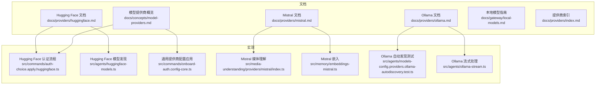
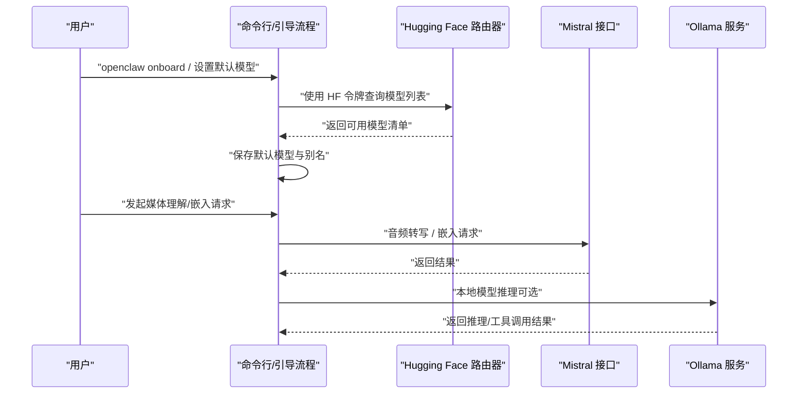
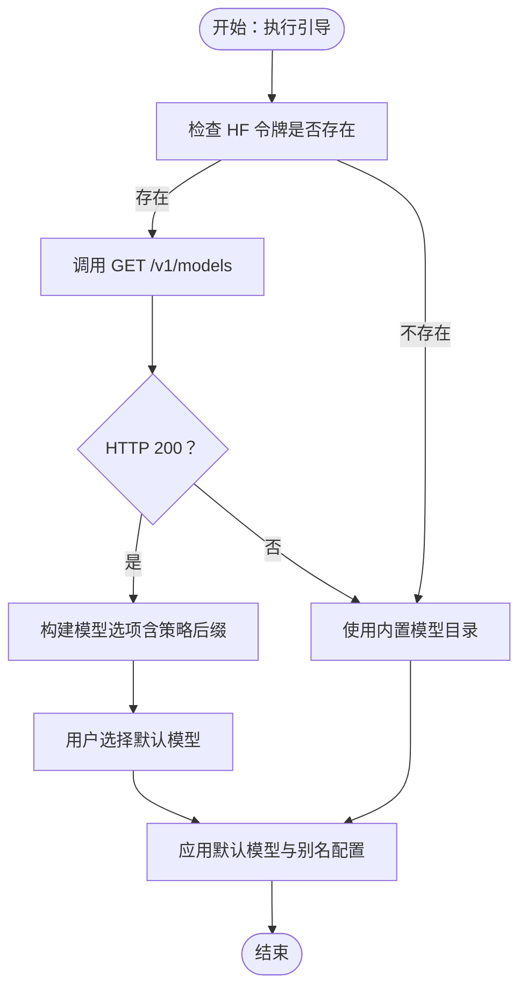
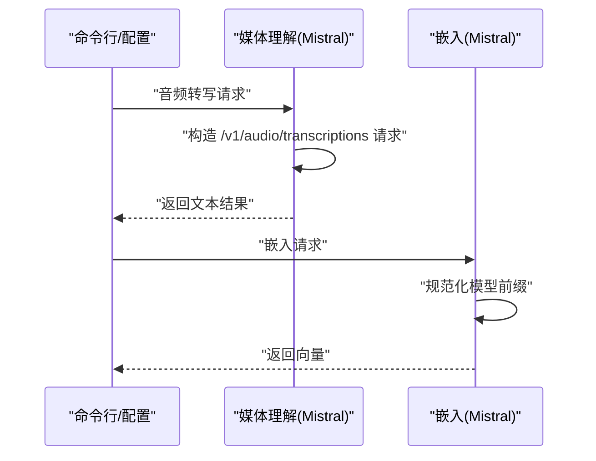
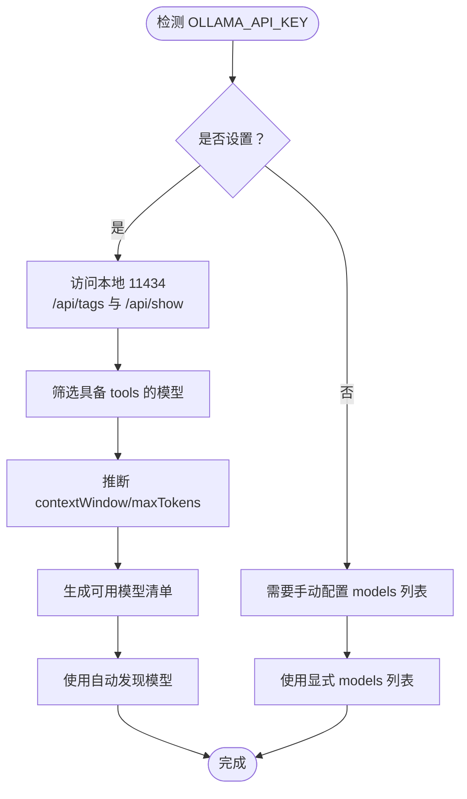
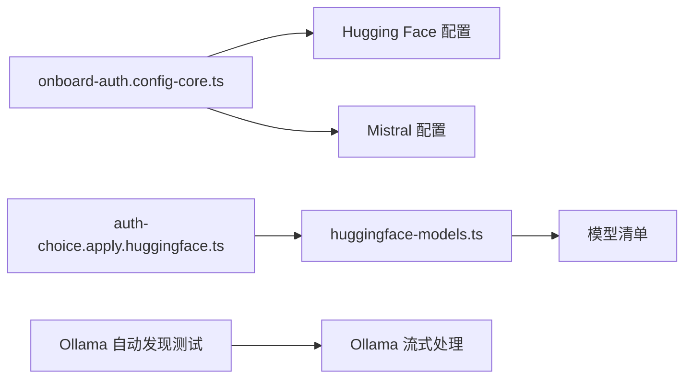

# 其他提供商

## 目录
1. [简介](#简介)
2. [项目结构](#项目结构)
3. [核心组件](#核心组件)
4. [架构总览](#架构总览)
5. [详细组件分析](#详细组件分析)
6. [依赖关系分析](#依赖关系分析)
7. [性能考量](#性能考量)
8. [故障排查指南](#故障排查指南)
9. [结论](#结论)
10. [附录](#附录)

## 简介
本章节面向希望在 OpenClaw 中集成第三方或本地模型提供商（如 Hugging Face、Mistral、Ollama）的开发者与运维人员。内容覆盖：
- 各提供商的认证方式、API 配置与独特特性
- 本地部署与远程接入的差异与注意事项
- 不同提供商的功能对比与选型建议
- 混合模型策略：多提供商负载均衡与故障转移
- 社区贡献的集成示例与最佳实践

## 项目结构
围绕“其他提供商”的文档与实现主要分布在以下位置：
- 文档层：docs/providers 下的各提供商独立文档；docs/concepts/model-providers.md 提供统一的提供商概览与配置规则；docs/gateway/local-models.md 聚焦本地/自托管场景
- 实现层：src/commands 与 src/agents 中的认证与模型发现逻辑；src/media-understanding 与 src/memory 中的媒体理解与嵌入实现

图表来源
- [docs/providers/huggingface.md](file://docs/providers/huggingface.md#L1-L210)
- [docs/providers/mistral.md](file://docs/providers/mistral.md#L1-L55)
- [docs/providers/ollama.md](file://docs/providers/ollama.md#L1-L283)
- [docs/concepts/model-providers.md](file://docs/concepts/model-providers.md#L1-L460)
- [docs/gateway/local-models.md](file://docs/gateway/local-models.md#L1-L151)
- [docs/providers/index.md](file://docs/providers/index.md#L1-L63)
- [src/commands/auth-choice.apply.huggingface.ts](file://src/commands/auth-choice.apply.huggingface.ts#L33-L97)
- [src/agents/huggingface-models.ts](file://src/agents/huggingface-models.ts#L1-L176)
- [src/commands/onboard-auth.config-core.ts](file://src/commands/onboard-auth.config-core.ts#L360-L429)
- [src/media-understanding/providers/mistral/index.ts](file://src/media-understanding/providers/mistral/index.ts#L1-L14)
- [src/memory/embeddings-mistral.ts](file://src/memory/embeddings-mistral.ts#L1-L51)
- [src/agents/models-config.providers.ollama-autodiscovery.test.ts](file://src/agents/models-config.providers.ollama-autodiscovery.test.ts)
- [src/agents/ollama-stream.ts](file://src/agents/ollama-stream.ts)

章节来源
- [docs/providers/index.md](file://docs/providers/index.md#L1-L63)
- [docs/concepts/model-providers.md](file://docs/concepts/model-providers.md#L1-L460)

## 核心组件
- Hugging Face Inference（OpenAI 兼容路由）
  - 认证：支持细粒度令牌（HF_TOKEN/HUGGINGFACE_HUB_TOKEN），用于调用推理路由器
  - API：OpenAI 兼容聊天补全端点，模型列表通过路由器查询
  - 特性：支持按成本/速度的策略后缀（:cheapest/:fastest），可锁定后端选择
- Mistral
  - 认证：MISTRAL_API_KEY
  - API：默认基础 URL，媒体理解使用 /v1/audio/transcriptions，嵌入使用 /v1/embeddings
  - 特性：支持音频转写与内存嵌入
- Ollama
  - 认证：本地运行无需密钥；可通过环境变量或配置启用
  - API：优先使用原生 Ollama API（/api/chat）以获得可靠工具调用与流式输出
  - 特性：可自动发现具备工具能力的模型；支持推理标记与上下文窗口推断

章节来源
- [docs/providers/huggingface.md](file://docs/providers/huggingface.md#L1-L210)
- [docs/providers/mistral.md](file://docs/providers/mistral.md#L1-L55)
- [docs/providers/ollama.md](file://docs/providers/ollama.md#L1-L283)
- [docs/concepts/model-providers.md](file://docs/concepts/model-providers.md#L158-L167)

## 架构总览
下图展示了 OpenClaw 在“其他提供商”上的关键交互路径：认证与模型发现、默认模型设置、以及媒体理解/嵌入调用。

图表来源
- [src/commands/auth-choice.apply.huggingface.ts](file://src/commands/auth-choice.apply.huggingface.ts#L33-L97)
- [src/agents/huggingface-models.ts](file://src/agents/huggingface-models.ts#L153-L176)
- [src/media-understanding/providers/mistral/index.ts](file://src/media-understanding/providers/mistral/index.ts#L6-L14)
- [src/memory/embeddings-mistral.ts](file://src/memory/embeddings-mistral.ts#L27-L51)
- [docs/providers/ollama.md](file://docs/providers/ollama.md#L11-L15)

章节来源
- [docs/concepts/model-providers.md](file://docs/concepts/model-providers.md#L20-L33)

## 详细组件分析

### Hugging Face 集成
- 认证与引导
  - 支持通过 CLI 引导流程输入细粒度令牌，并自动拉取模型清单用于默认模型选择
  - 当令牌有效时，优先使用路由器模型列表；否则回退到内置目录
- 模型发现与策略
  - 通过 GET /v1/models 获取模型清单，支持基于成本/速度的策略后缀（:cheapest/:fastest）
  - 使用策略后缀会锁定后端选择，不再允许交互式偏好
- 配置示例
  - 默认模型、别名、主备模型组合、强制后端选择等均有文档示例

图表来源
- [src/commands/auth-choice.apply.huggingface.ts](file://src/commands/auth-choice.apply.huggingface.ts#L59-L97)
- [src/agents/huggingface-models.ts](file://src/agents/huggingface-models.ts#L153-L176)

章节来源
- [docs/providers/huggingface.md](file://docs/providers/huggingface.md#L18-L95)
- [src/commands/auth-choice.apply.huggingface.ts](file://src/commands/auth-choice.apply.huggingface.ts#L33-L97)
- [src/agents/huggingface-models.ts](file://src/agents/huggingface-models.ts#L1-L176)

### Mistral 集成
- 认证与默认模型
  - 使用 MISTRAL_API_KEY；默认基础 URL 与默认模型已在配置应用中定义
- 媒体理解（音频转写）
  - 采用 OpenAI 兼容接口进行音频转写，默认路径为 /v1/audio/transcriptions
- 内存嵌入
  - 默认嵌入模型为 mistral-embed，支持前缀规范化

图表来源
- [src/media-understanding/providers/mistral/index.ts](file://src/media-understanding/providers/mistral/index.ts#L6-L14)
- [src/memory/embeddings-mistral.ts](file://src/memory/embeddings-mistral.ts#L19-L51)
- [src/commands/onboard-auth.config-core.ts](file://src/commands/onboard-auth.config-core.ts#L412-L429)

章节来源
- [docs/providers/mistral.md](file://docs/providers/mistral.md#L15-L55)
- [src/media-understanding/providers/mistral/index.ts](file://src/media-understanding/providers/mistral/index.ts#L1-L14)
- [src/memory/embeddings-mistral.ts](file://src/memory/embeddings-mistral.ts#L1-L51)
- [src/commands/onboard-auth.config-core.ts](file://src/commands/onboard-auth.config-core.ts#L412-L429)

### Ollama 集成
- 自动发现与本地模型
  - 当设置 OLLAMA_API_KEY 且未显式配置 provider 时，自动从本地 11434 端口查询 /api/tags 与 /api/show，仅保留具备工具能力的模型
  - 上下文窗口与最大输出根据模型信息推断，成本设为 0
- 原生 API 与兼容模式
  - 默认使用原生 Ollama API（/api/chat），支持可靠的流式与工具调用
  - 如需 OpenAI 兼容格式（例如代理限制），可切换至 openai-completions，但可能影响工具调用可靠性与流式行为
- 远程 Ollama 注意事项
  - 不要使用带 /v1 的 URL；应使用原生基础地址（无 /v1）

图表来源
- [docs/providers/ollama.md](file://docs/providers/ollama.md#L55-L84)
- [docs/providers/ollama.md](file://docs/providers/ollama.md#L169-L234)
- [src/agents/models-config.providers.ollama-autodiscovery.test.ts](file://src/agents/models-config.providers.ollama-autodiscovery.test.ts)

章节来源
- [docs/providers/ollama.md](file://docs/providers/ollama.md#L11-L151)
- [docs/providers/ollama.md](file://docs/providers/ollama.md#L183-L230)

## 依赖关系分析
- 认证与模型发现
  - Hugging Face：引导流程负责令牌校验与模型清单获取，随后将默认模型写入配置
  - Mistral：默认配置已包含基础 URL 与默认模型，媒体理解与嵌入分别封装在独立模块
  - Ollama：自动发现依赖本地服务可达性与工具能力标注
- 统一配置入口
  - 多数提供商通过“通用提供商配置应用”函数注入 baseUrl、api 类型与默认模型，便于扩展与复用

图表来源
- [src/commands/onboard-auth.config-core.ts](file://src/commands/onboard-auth.config-core.ts#L360-L429)
- [src/commands/auth-choice.apply.huggingface.ts](file://src/commands/auth-choice.apply.huggingface.ts#L59-L97)
- [src/agents/huggingface-models.ts](file://src/agents/huggingface-models.ts#L153-L176)
- [src/agents/models-config.providers.ollama-autodiscovery.test.ts](file://src/agents/models-config.providers.ollama-autodiscovery.test.ts)
- [src/agents/ollama-stream.ts](file://src/agents/ollama-stream.ts)

章节来源
- [docs/concepts/model-providers.md](file://docs/concepts/model-providers.md#L20-L33)

## 性能考量
- Hugging Face
  - 使用 :cheapest 或 :fastest 策略可按成本/吞吐锁定后端，减少交互选择开销
  - 令牌有效时优先使用实时模型清单，避免离线目录不一致导致的错误选择
- Mistral
  - 媒体理解与嵌入均走 OpenAI 兼容接口，注意网络延迟与并发限制
- Ollama
  - 原生 API 支持流式与工具调用，适合高并发推理场景
  - 自动发现仅保留具备工具能力的模型，避免无效模型带来的失败重试

[本节为通用指导，不直接分析具体文件]

## 故障排查指南
- Hugging Face
  - 若模型清单为空或不完整，确认令牌权限与网络可达性；必要时回退内置目录
  - 使用策略后缀时，交互式后端选择被锁定属预期行为
- Mistral
  - 确认基础 URL 与 API 密钥正确；音频转写与嵌入路径分别为 /v1/audio/transcriptions 与 /v1/embeddings
- Ollama
  - 本地未检测到模型：确保 Ollama 正在运行且可访问 /api/tags；仅工具能力模型会被自动发现
  - 远程 Ollama：不要使用带 /v1 的 URL；务必使用原生基础地址
  - 工具调用不可靠：切换至原生 Ollama API（/api/chat），避免 OpenAI 兼容模式

章节来源
- [docs/providers/huggingface.md](file://docs/providers/huggingface.md#L51-L95)
- [docs/providers/mistral.md](file://docs/providers/mistral.md#L47-L55)
- [docs/providers/ollama.md](file://docs/providers/ollama.md#L13-L15)
- [docs/providers/ollama.md](file://docs/providers/ollama.md#L235-L277)

## 结论
- Hugging Face 适合需要统一路由与多后端选择的场景，策略后缀可简化成本/性能权衡
- Mistral 提供稳定的音频转写与嵌入能力，适合对媒体理解有需求的场景
- Ollama 适合本地/自托管推理，原生 API 在工具调用与流式方面表现更佳
- 混合策略建议结合“主机优先、本地兜底”的原则，利用合并配置保持备用链路可用

[本节为总结性内容，不直接分析具体文件]

## 附录
- 混合模型策略与最佳实践
  - 主机优先、本地兜底：将主流云端模型作为 primary，本地/自托管模型作为 fallback，保持 models.mode: "merge"
  - 区域化与合规：在云厂商区域端点与本地之间平衡数据驻留与功能可用性
  - 安全加固：本地模型需严格控制提示词与会话压缩，降低注入风险
- 社区贡献示例
  - 参考本地模型指南中的 LM Studio + MiniMax M2.5 示例，结合 OpenRouter 的区域化变体实现混合路由

章节来源
- [docs/gateway/local-models.md](file://docs/gateway/local-models.md#L63-L111)
- [docs/concepts/model-providers.md](file://docs/concepts/model-providers.md#L437-L450)