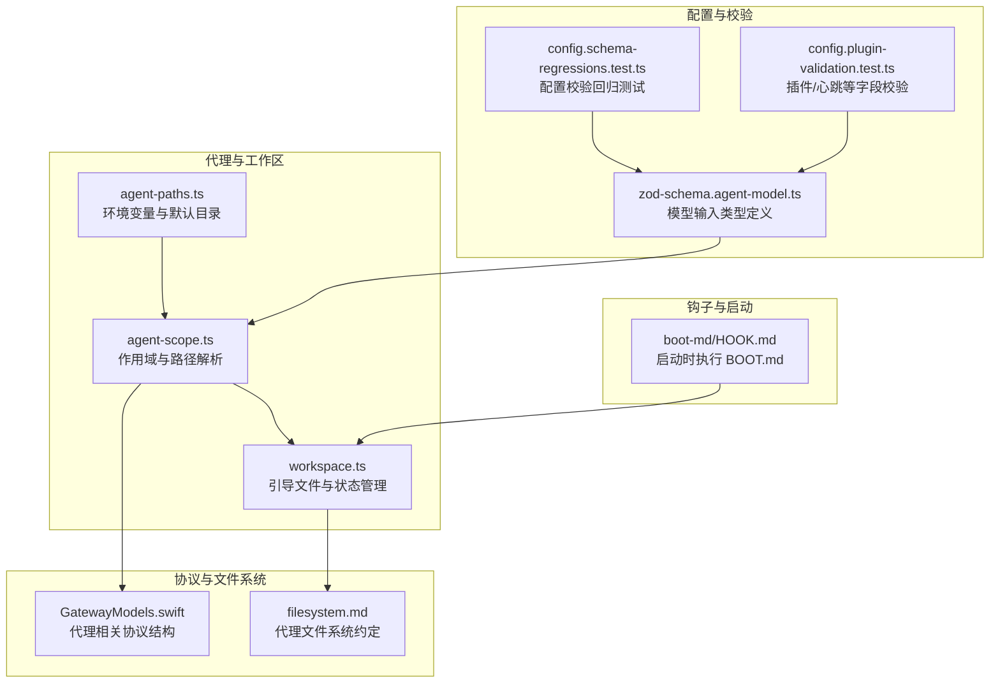
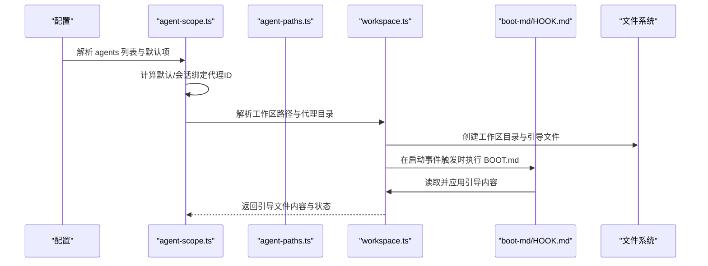
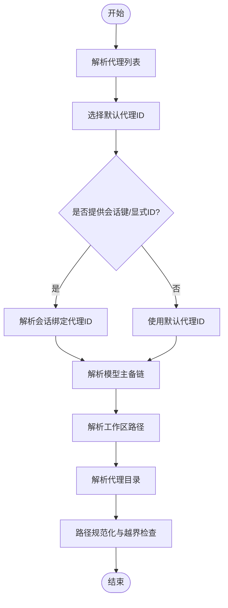
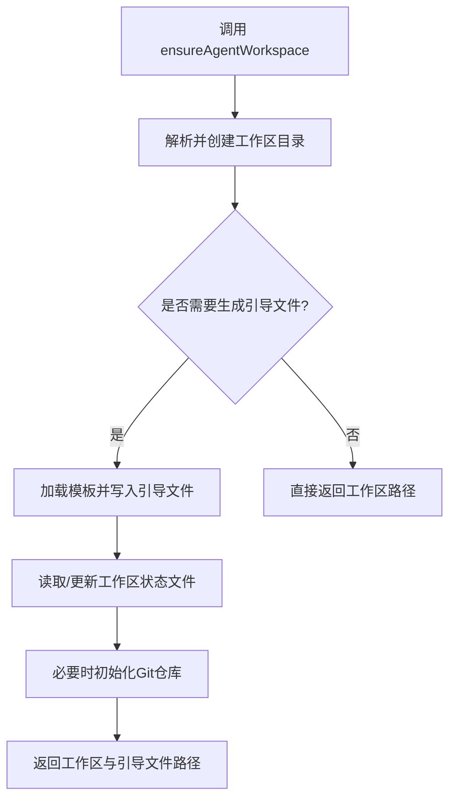
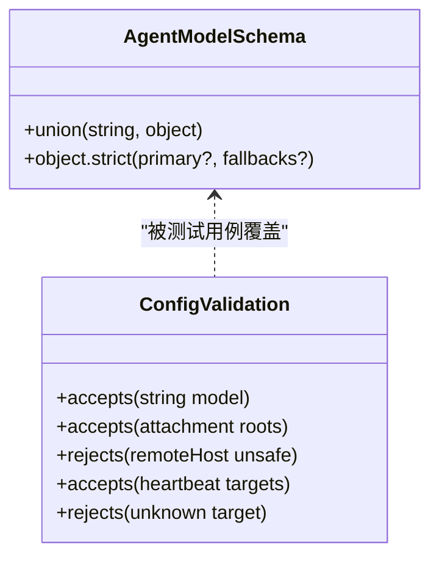
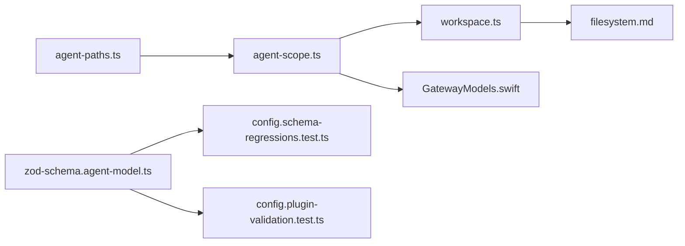

# 代理架构设计

## 目录
1. [引言](#引言)
2. [项目结构](#项目结构)
3. [核心组件](#核心组件)
4. [架构总览](#架构总览)
5. [组件详解](#组件详解)
6. [依赖关系分析](#依赖关系分析)
7. [性能考量](#性能考量)
8. [故障排查指南](#故障排查指南)
9. [结论](#结论)
10. [附录](#附录)

## 引言
本文件面向OpenClaw代理架构设计，聚焦代理生命周期管理、作用域隔离与文件系统组织等核心主题，系统阐述代理路径解析机制、代理作用域边界、引导文件加载流程与默认配置策略，并给出代理类型系统（模型输入、数据校验与类型约束）的设计要点与最佳实践。文档同时提供可直接定位到源码的参考路径，便于读者在仓库中快速检索实现细节。

## 项目结构
OpenClaw的代理能力由多模块协同实现：
- 代理作用域与路径解析：位于 src/agents 下的 agent-scope.ts 与 agent-paths.ts
- 工作区与引导文件：位于 src/agents/workspace.ts 及其配套模板与缓存逻辑
- 钩子与启动流程：位于 src/hooks/bundled/boot-md/HOOK.md
- 类型与配置校验：位于 src/config 下的 zod-schema 与测试用例
- 文件系统约定：见 extensions/open-prose/skills/prose/state/filesystem.md
- 协议与跨平台接口：位于 apps/*/Sources/OpenClawProtocol/GatewayModels.swift

**图表来源**
- [src/agents/agent-scope.ts](file://src/agents/agent-scope.ts#L1-L339)
- [src/agents/agent-paths.ts](file://src/agents/agent-paths.ts#L1-L26)
- [src/agents/workspace.ts](file://src/agents/workspace.ts#L1-L656)
- [src/hooks/bundled/boot-md/HOOK.md](file://src/hooks/bundled/boot-md/HOOK.md#L1-L21)
- [src/config/zod-schema.agent-model.ts](file://src/config/zod-schema.agent-model.ts#L1-L11)
- [src/config/config.schema-regressions.test.ts](file://src/config/config.schema-regressions.test.ts#L63-L117)
- [src/config/config.plugin-validation.test.ts](file://src/config/config.plugin-validation.test.ts#L251-L338)
- [apps/macos/Sources/OpenClawProtocol/GatewayModels.swift](file://apps/macos/Sources/OpenClawProtocol/GatewayModels.swift#L2107-L2171)
- [apps/shared/OpenClawKit/Sources/OpenClawProtocol/GatewayModels.swift](file://apps/shared/OpenClawKit/Sources/OpenClawProtocol/GatewayModels.swift#L2107-L2171)
- [extensions/open-prose/skills/prose/state/filesystem.md](file://extensions/open-prose/skills/prose/state/filesystem.md#L303-L368)

**章节来源**
- [src/agents/agent-scope.ts](file://src/agents/agent-scope.ts#L1-L339)
- [src/agents/agent-paths.ts](file://src/agents/agent-paths.ts#L1-L26)
- [src/agents/workspace.ts](file://src/agents/workspace.ts#L1-L656)
- [src/hooks/bundled/boot-md/HOOK.md](file://src/hooks/bundled/boot-md/HOOK.md#L1-L21)
- [src/config/zod-schema.agent-model.ts](file://src/config/zod-schema.agent-model.ts#L1-L11)
- [src/config/config.schema-regressions.test.ts](file://src/config/config.schema-regressions.test.ts#L63-L117)
- [src/config/config.plugin-validation.test.ts](file://src/config/config.plugin-validation.test.ts#L251-L338)
- [extensions/open-prose/skills/prose/state/filesystem.md](file://extensions/open-prose/skills/prose/state/filesystem.md#L303-L368)
- [apps/macos/Sources/OpenClawProtocol/GatewayModels.swift](file://apps/macos/Sources/OpenClawProtocol/GatewayModels.swift#L2107-L2171)
- [apps/shared/OpenClawKit/Sources/OpenClawProtocol/GatewayModels.swift](file://apps/shared/OpenClawKit/Sources/OpenClawProtocol/GatewayModels.swift#L2107-L2171)

## 核心组件
- 代理作用域与路径解析：负责从配置解析代理ID、默认代理、会话绑定代理ID、工作区路径与代理目录等；提供路径规范化与越界检测。
- 代理工作区与引导文件：负责默认工作区目录解析、引导文件（如 AGENTS.md、BOOTSTRAP.md 等）的生成、读取与缓存、最小化会话加载策略、Git 初始化与工作区状态记录。
- 代理路径环境：负责设置 OPENCLAW_AGENT_DIR 与 PI_CODING_AGENT_DIR 环境变量，支持用户覆盖与默认回退。
- 配置与类型系统：通过Zod Schema定义代理模型输入类型，结合测试用例确保配置合法性和向后兼容性。
- 钩子与启动流程：在网关启动时按作用域执行 BOOT.md，作为代理引导的统一入口。
- 跨平台协议：GatewayModels.swift 中的代理相关结构体用于跨平台通信与序列化。

**章节来源**
- [src/agents/agent-scope.ts](file://src/agents/agent-scope.ts#L46-L111)
- [src/agents/workspace.ts](file://src/agents/workspace.ts#L12-L45)
- [src/agents/agent-paths.ts](file://src/agents/agent-paths.ts#L6-L25)
- [src/config/zod-schema.agent-model.ts](file://src/config/zod-schema.agent-model.ts#L1-L11)
- [src/hooks/bundled/boot-md/HOOK.md](file://src/hooks/bundled/boot-md/HOOK.md#L1-L21)
- [apps/macos/Sources/OpenClawProtocol/GatewayModels.swift](file://apps/macos/Sources/OpenClawProtocol/GatewayModels.swift#L2107-L2171)

## 架构总览
下图展示代理生命周期中的关键交互：配置解析、作用域确定、工作区初始化、引导文件加载与钩子触发。

**图表来源**
- [src/agents/agent-scope.ts](file://src/agents/agent-scope.ts#L72-L111)
- [src/agents/agent-paths.ts](file://src/agents/agent-paths.ts#L6-L25)
- [src/agents/workspace.ts](file://src/agents/workspace.ts#L321-L459)
- [src/hooks/bundled/boot-md/HOOK.md](file://src/hooks/bundled/boot-md/HOOK.md#L1-L21)

## 组件详解

### 代理作用域与路径解析
- 代理列表与去重：从配置中提取有效代理条目并去重，若无配置则使用默认代理ID。
- 默认代理选择：支持多条 default=true 的警告提示，优先取第一条。
- 会话绑定代理ID：支持显式传入或从会话键解析，否则回退到默认代理。
- 模型主备链：支持显式代理模型与全局默认模型，以及备用模型数组的覆盖与回退。
- 工作区路径解析：优先使用代理配置，其次回退到全局默认工作区，最后回退到状态目录下的 workspace-&#123;id&#125;。
- 代理目录解析：默认位于状态目录 agents/&#123;id&#125;/agent。
- 路径越界与规范化：对路径进行标准化、大小写归一化与越界判断，保证作用域隔离。

**图表来源**
- [src/agents/agent-scope.ts](file://src/agents/agent-scope.ts#L46-L111)
- [src/agents/agent-scope.ts](file://src/agents/agent-scope.ts#L178-L272)
- [src/agents/agent-scope.ts](file://src/agents/agent-scope.ts#L274-L338)

**章节来源**
- [src/agents/agent-scope.ts](file://src/agents/agent-scope.ts#L46-L111)
- [src/agents/agent-scope.ts](file://src/agents/agent-scope.ts#L178-L272)
- [src/agents/agent-scope.ts](file://src/agents/agent-scope.ts#L274-L338)

### 代理路径环境与默认目录
- 环境变量注入：确保 OPENCLAW_AGENT_DIR 与 PI_CODING_AGENT_DIR 均指向代理目录，支持用户覆盖。
- 默认代理目录：基于状态目录与默认代理ID拼接，最终解析为用户可读路径。

**章节来源**
- [src/agents/agent-paths.ts](file://src/agents/agent-paths.ts#L6-L25)

### 工作区与引导文件加载
- 默认工作区：根据 OPENCLAW_PROFILE 或默认 profile 决定 home 下的 .openclaw/workspace(-profile)。
- 引导文件集：AGENTS.md、SOUL.md、TOOLS.md、IDENTITY.md、USER.md、HEARTBEAT.md、BOOTSTRAP.md、MEMORY.md(memory.md)。
- 安全读取：通过边界文件打开器限制访问范围，按 inode/dev/size/mtime 维度缓存，避免重复读取与竞态。
- 最小化会话加载：子代理/定时任务仅加载最小集合的引导文件。
- Git 初始化：新工作区自动尝试 git init（若可用）。
- 工作区状态：记录引导种子时间与结业完成时间，支持迁移与幂等。

**图表来源**
- [src/agents/workspace.ts](file://src/agents/workspace.ts#L321-L459)
- [src/agents/workspace.ts](file://src/agents/workspace.ts#L498-L555)
- [src/agents/workspace.ts](file://src/agents/workspace.ts#L565-L573)
- [src/agents/workspace.ts](file://src/agents/workspace.ts#L575-L655)

**章节来源**
- [src/agents/workspace.ts](file://src/agents/workspace.ts#L12-L45)
- [src/agents/workspace.ts](file://src/agents/workspace.ts#L321-L459)
- [src/agents/workspace.ts](file://src/agents/workspace.ts#L498-L555)
- [src/agents/workspace.ts](file://src/agents/workspace.ts#L565-L573)
- [src/agents/workspace.ts](file://src/agents/workspace.ts#L575-L655)

### 钩子与引导文件加载流程
- 启动钩子：在 gateway:startup 事件触发时，按每个代理作用域查找并执行 BOOT.md（若存在）。
- 与工作区集成：引导文件由工作区模块统一加载与缓存，确保安全与一致性。

**章节来源**
- [src/hooks/bundled/boot-md/HOOK.md](file://src/hooks/bundled/boot-md/HOOK.md#L1-L21)
- [src/agents/workspace.ts](file://src/agents/workspace.ts#L498-L555)

### 代理类型系统与配置策略
- 模型输入类型：支持字符串或带 primary/fallbacks 的对象，严格模式校验。
- 回归与兼容：测试覆盖字符串值、附件根路径、IMessage 远端主机安全校验等场景。
- 插件/心跳枚举：测试覆盖心跳目标与策略的合法值，拒绝未知目标与非法策略。

**图表来源**
- [src/config/zod-schema.agent-model.ts](file://src/config/zod-schema.agent-model.ts#L1-L11)
- [src/config/config.schema-regressions.test.ts](file://src/config/config.schema-regressions.test.ts#L63-L117)
- [src/config/config.plugin-validation.test.ts](file://src/config/config.plugin-validation.test.ts#L251-L338)

**章节来源**
- [src/config/zod-schema.agent-model.ts](file://src/config/zod-schema.agent-model.ts#L1-L11)
- [src/config/config.schema-regressions.test.ts](file://src/config/config.schema-regressions.test.ts#L63-L117)
- [src/config/config.plugin-validation.test.ts](file://src/config/config.plugin-validation.test.ts#L251-L338)

### 代理文件系统组织与作用域边界
- 代理内存与历史：agents/&#123;name&#125;/memory.md 保存当前累积状态；agents/&#123;name&#125;/&#123;name&#125;-NNN.md 记录每次调用的历史片段。
- 绑定与状态：bindings/ 目录存放运行时绑定产物；state.md 由虚拟机写入；各文件作者职责明确。
- 作用域隔离：工作区根目录内所有文件均受边界检查保护，防止越界访问；路径规范化与 realpath 对齐避免符号链接逃逸。

**章节来源**
- [extensions/open-prose/skills/prose/state/filesystem.md](file://extensions/open-prose/skills/prose/state/filesystem.md#L303-L368)
- [src/agents/workspace.ts](file://src/agents/workspace.ts#L48-L88)
- [src/agents/agent-scope.ts](file://src/agents/agent-scope.ts#L274-L338)

### 跨平台协议与数据契约
- 代理相关结构体：AgentsUpdateResult、AgentsDeleteParams、AgentsDeleteResult、AgentsFileEntry 等，用于跨平台序列化与通信。
- 平台一致性：macOS 与共享层的协议结构保持一致，确保跨端行为一致。

**章节来源**
- [apps/macos/Sources/OpenClawProtocol/GatewayModels.swift](file://apps/macos/Sources/OpenClawProtocol/GatewayModels.swift#L2107-L2171)
- [apps/shared/OpenClawKit/Sources/OpenClawProtocol/GatewayModels.swift](file://apps/shared/OpenClawKit/Sources/OpenClawProtocol/GatewayModels.swift#L2107-L2171)

## 依赖关系分析
- agent-scope.ts 依赖配置解析、会话键工具、工作区默认路径与日志子系统。
- workspace.ts 依赖边界文件读取、Home 目录解析、进程执行、会话键判定、模板目录解析与文件系统。
- agent-paths.ts 依赖配置路径解析与用户路径解析。
- 配置校验测试依赖 zod-schema 与具体配置键（如 agents.defaults、channels.*）。
- 协议层与文件系统约定独立于核心逻辑，通过结构体契约耦合。

**图表来源**
- [src/agents/agent-paths.ts](file://src/agents/agent-paths.ts#L1-L26)
- [src/agents/agent-scope.ts](file://src/agents/agent-scope.ts#L1-L16)
- [src/agents/workspace.ts](file://src/agents/workspace.ts#L1-L11)
- [src/config/zod-schema.agent-model.ts](file://src/config/zod-schema.agent-model.ts#L1-L11)
- [src/config/config.schema-regressions.test.ts](file://src/config/config.schema-regressions.test.ts#L63-L117)
- [src/config/config.plugin-validation.test.ts](file://src/config/config.plugin-validation.test.ts#L251-L338)
- [extensions/open-prose/skills/prose/state/filesystem.md](file://extensions/open-prose/skills/prose/state/filesystem.md#L303-L368)
- [apps/macos/Sources/OpenClawProtocol/GatewayModels.swift](file://apps/macos/Sources/OpenClawProtocol/GatewayModels.swift#L2107-L2171)

**章节来源**
- [src/agents/agent-paths.ts](file://src/agents/agent-paths.ts#L1-L26)
- [src/agents/agent-scope.ts](file://src/agents/agent-scope.ts#L1-L16)
- [src/agents/workspace.ts](file://src/agents/workspace.ts#L1-L11)
- [src/config/zod-schema.agent-model.ts](file://src/config/zod-schema.agent-model.ts#L1-L11)
- [src/config/config.schema-regressions.test.ts](file://src/config/config.schema-regressions.test.ts#L63-L117)
- [src/config/config.plugin-validation.test.ts](file://src/config/config.plugin-validation.test.ts#L251-L338)
- [extensions/open-prose/skills/prose/state/filesystem.md](file://extensions/open-prose/skills/prose/state/filesystem.md#L303-L368)
- [apps/macos/Sources/OpenClawProtocol/GatewayModels.swift](file://apps/macos/Sources/OpenClawProtocol/GatewayModels.swift#L2107-L2171)

## 性能考量
- 缓存与去重
  - 工作区引导文件按 inode/dev/size/mtime 维度缓存，避免重复读取与竞态。
  - 路径规范化与 realpath 对齐，减少多次解析开销。
- I/O 优化
  - 批量写入引导文件时采用“写临时文件再原子重命名”的方式，降低中断风险。
  - 最小化会话仅加载必要引导文件，缩短启动路径。
- 外部依赖
  - Git 初始化仅在新工作区且可用时执行，失败不阻塞工作区创建。
- 内存与并发
  - 模板加载结果缓存于 Map，避免重复 IO。
  - 测试用例覆盖缓存命中与缺失场景，保障缓存正确性。

**章节来源**
- [src/agents/workspace.ts](file://src/agents/workspace.ts#L42-L88)
- [src/agents/workspace.ts](file://src/agents/workspace.ts#L262-L276)
- [src/agents/workspace.ts](file://src/agents/workspace.ts#L565-L573)
- [src/agents/workspace.ts](file://src/agents/workspace.ts#L287-L302)
- [src/agents/workspace.bootstrap-cache.test.ts](file://src/agents/workspace.bootstrap-cache.test.ts#L159-L168)

## 故障排查指南
- 引导文件缺失
  - 现象：loadAgentsFile 返回 missing=true 且 content 未定义。
  - 排查：确认工作区已通过 ensureAgentWorkspace 初始化，或手动创建对应引导文件。
- 路径越界与权限
  - 现象：边界文件打开器返回安全/路径错误。
  - 排查：检查路径是否在工作区根内，避免符号链接逃逸；确认用户权限与大小写敏感平台差异。
- 会话绑定异常
  - 现象：resolveSessionAgentId 返回非预期代理ID。
  - 排查：核对会话键格式与显式ID传入；检查默认代理与多 default 条目警告。
- 配置校验失败
  - 现象：心跳目标未知或策略非法。
  - 排查：对照测试用例修正配置键值；确保枚举值在允许集合内。
- 协议字段不匹配
  - 现象：跨平台通信报错。
  - 排查：比对 GatewayModels.swift 中的结构体字段与序列化侧实现。

**章节来源**
- [src/agents/workspace.bootstrap-cache.test.ts](file://src/agents/workspace.bootstrap-cache.test.ts#L159-L168)
- [src/agents/workspace.ts](file://src/agents/workspace.ts#L48-L88)
- [src/agents/agent-scope.ts](file://src/agents/agent-scope.ts#L86-L111)
- [src/config/config.plugin-validation.test.ts](file://src/config/config.plugin-validation.test.ts#L308-L338)
- [apps/macos/Sources/OpenClawProtocol/GatewayModels.swift](file://apps/macos/Sources/OpenClawProtocol/GatewayModels.swift#L2107-L2171)

## 结论
OpenClaw代理架构以“作用域隔离 + 文件系统约定 + 安全边界 + 类型驱动”为核心设计原则，通过 agent-scope.ts 与 agent-paths.ts 明确代理生命周期与路径解析，借助 workspace.ts 提供健壮的工作区与引导文件管理，配合 zod 类型与测试用例确保配置合法性与向后兼容，最终在跨平台协议层实现一致的数据契约。该设计既满足多代理并行与会话绑定需求，又兼顾性能与安全性。

## 附录
- 配置模板与引导文件清单
  - AGENTS.md、SOUL.md、TOOLS.md、IDENTITY.md、USER.md、HEARTBEAT.md、BOOTSTRAP.md、MEMORY.md(memory.md)
- 关键实现参考路径
  - 代理作用域与路径解析：[src/agents/agent-scope.ts](file://src/agents/agent-scope.ts#L1-L339)
  - 代理路径环境：[src/agents/agent-paths.ts](file://src/agents/agent-paths.ts#L1-L26)
  - 工作区与引导文件：[src/agents/workspace.ts](file://src/agents/workspace.ts#L1-L656)
  - 启动钩子：[src/hooks/bundled/boot-md/HOOK.md](file://src/hooks/bundled/boot-md/HOOK.md#L1-L21)
  - 类型与校验：[src/config/zod-schema.agent-model.ts](file://src/config/zod-schema.agent-model.ts#L1-L11)、[src/config/config.schema-regressions.test.ts](file://src/config/config.schema-regressions.test.ts#L63-L117)、[src/config/config.plugin-validation.test.ts](file://src/config/config.plugin-validation.test.ts#L251-L338)
  - 文件系统约定：[extensions/open-prose/skills/prose/state/filesystem.md](file://extensions/open-prose/skills/prose/state/filesystem.md#L303-L368)
  - 协议结构：[apps/macos/Sources/OpenClawProtocol/GatewayModels.swift](file://apps/macos/Sources/OpenClawProtocol/GatewayModels.swift#L2107-L2171)、[apps/shared/OpenClawKit/Sources/OpenClawProtocol/GatewayModels.swift](file://apps/shared/OpenClawKit/Sources/OpenClawProtocol/GatewayModels.swift#L2107-L2171)