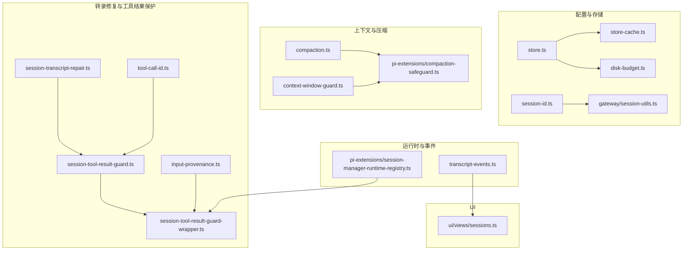
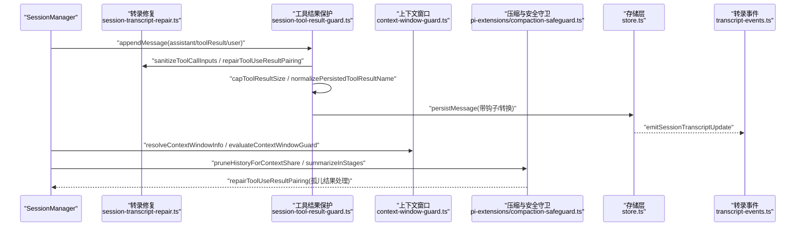
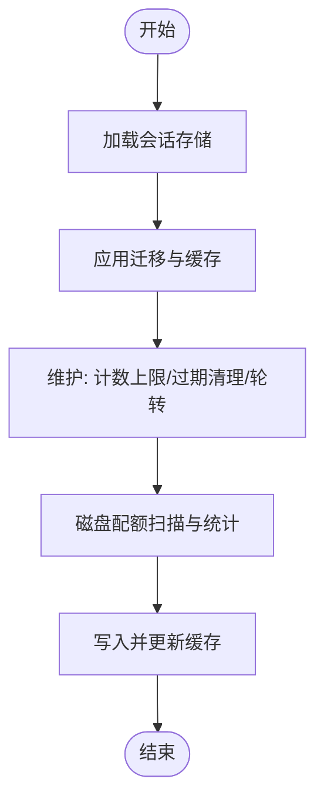
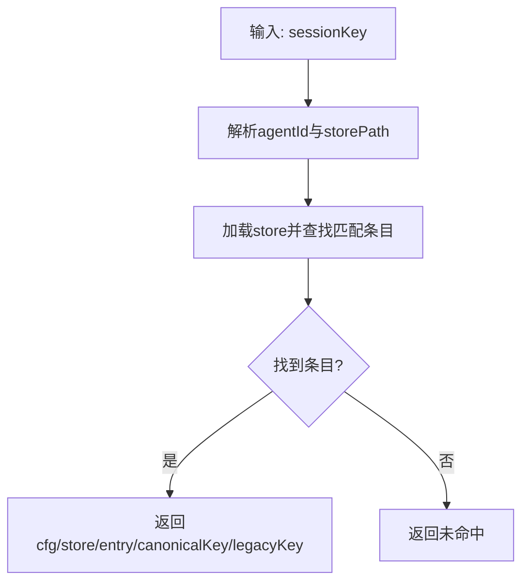
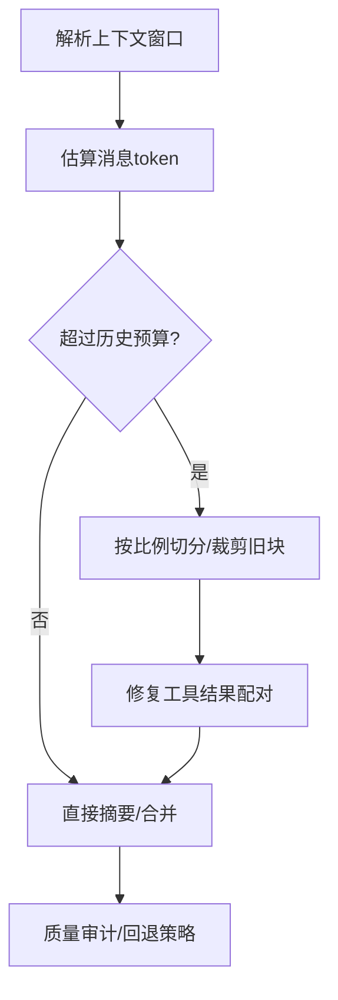
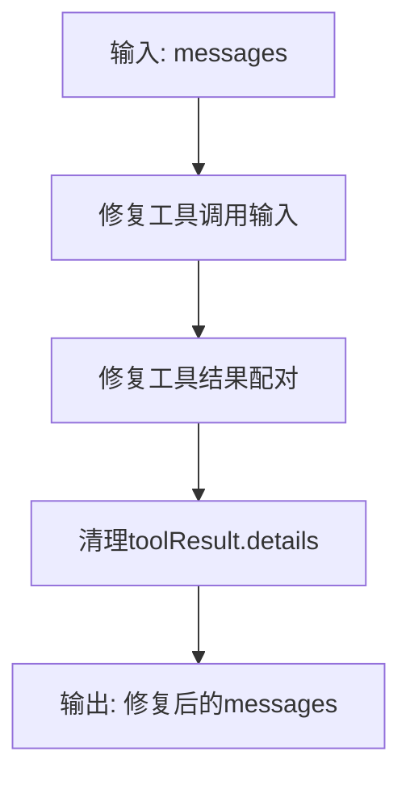
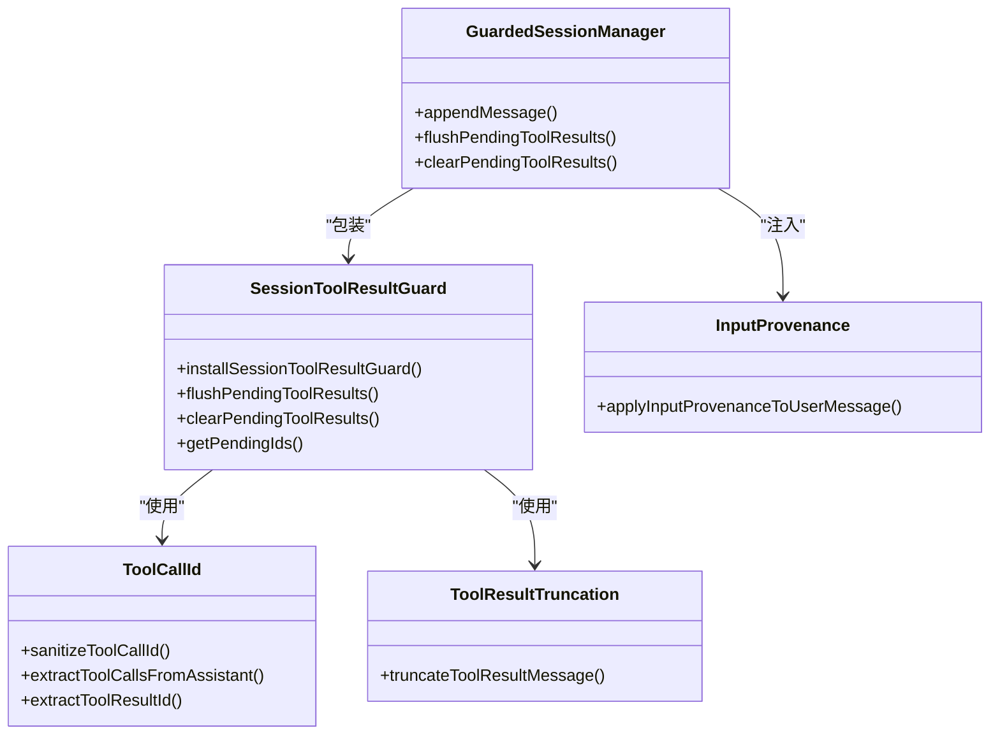
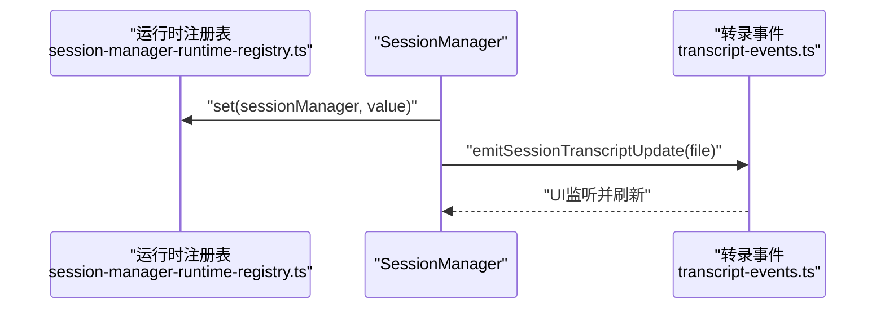
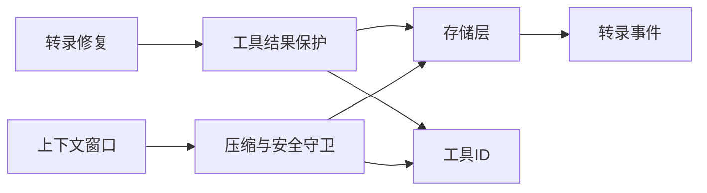

# 会话管理系统

## 目录
1. [简介](#简介)
2. [项目结构](#项目结构)
3. [核心组件](#核心组件)
4. [架构总览](#架构总览)
5. [详细组件分析](#详细组件分析)
6. [依赖关系分析](#依赖关系分析)
7. [性能考量](#性能考量)
8. [故障排除指南](#故障排除指南)
9. [结论](#结论)
10. [附录](#附录)

## 简介
本文件面向OpenClaw会话管理系统，系统性梳理会话的创建、维护与销毁流程，涵盖会话目录结构、会话标识符生成与校验、会话状态管理；解释上下文窗口管理机制（历史消息截断、令牌限制、上下文优化策略）；阐述会话转录修复系统（消息格式标准化、附件处理、传输完整性保证）；说明会话工具结果保护机制（工具调用跟踪、结果缓存与状态同步）；并提供性能优化技巧与故障排除指南。

## 项目结构
OpenClaw采用多模块分层组织：会话配置与存储位于config/sessions，会话运行时与扩展位于agents与agents/pi-extensions，输入来源与上下文窗口策略位于agents与config，UI侧提供会话视图展示。关键路径如下：
- 会话配置与存储：store.ts、store-cache.ts、disk-budget.ts
- 会话标识符与键解析：session-id.ts、gateway/session-utils.ts
- 上下文窗口与压缩：compaction.ts、context-window-guard.ts、pi-extensions/compaction-safeguard.ts
- 转录修复与工具结果保护：session-transcript-repair.ts、session-tool-result-guard.ts、session-tool-result-guard-wrapper.ts、tool-call-id.ts、input-provenance.ts
- 运行时注册表与事件：pi-extensions/session-manager-runtime-registry.ts、transcript-events.ts
- UI会话视图：ui/src/ui/views/sessions.ts

**图表来源**
- [src/config/sessions/store.ts](file://src/config/sessions/store.ts#L256-L305)
- [src/config/sessions/store-cache.ts](file://src/config/sessions/store-cache.ts#L1-L39)
- [src/config/sessions/disk-budget.ts](file://src/config/sessions/disk-budget.ts#L50-L89)
- [src/sessions/session-id.ts](file://src/sessions/session-id.ts#L1-L5)
- [src/gateway/session-utils.ts](file://src/gateway/session-utils.ts#L171-L188)
- [src/agents/compaction.ts](file://src/agents/compaction.ts#L1-L465)
- [src/agents/context-window-guard.ts](file://src/agents/context-window-guard.ts#L21-L74)
- [src/agents/pi-extensions/compaction-safeguard.ts](file://src/agents/pi-extensions/compaction-safeguard.ts#L698-L800)
- [src/agents/session-transcript-repair.ts](file://src/agents/session-transcript-repair.ts#L1-L503)
- [src/agents/session-tool-result-guard.ts](file://src/agents/session-tool-result-guard.ts#L1-L267)
- [src/agents/session-tool-result-guard-wrapper.ts](file://src/agents/session-tool-result-guard-wrapper.ts#L1-L77)
- [src/agents/tool-call-id.ts](file://src/agents/tool-call-id.ts#L1-L269)
- [src/sessions/input-provenance.ts](file://src/sessions/input-provenance.ts#L1-L82)
- [src/agents/pi-extensions/session-manager-runtime-registry.ts](file://src/agents/pi-extensions/session-manager-runtime-registry.ts#L1-L29)
- [src/sessions/transcript-events.ts](file://src/sessions/transcript-events.ts#L1-L200)
- [ui/src/ui/views/sessions.ts](file://ui/src/ui/views/sessions.ts#L110-L122)

**章节来源**
- [src/config/sessions/store.ts](file://src/config/sessions/store.ts#L256-L305)
- [src/agents/compaction.ts](file://src/agents/compaction.ts#L1-L465)
- [src/agents/context-window-guard.ts](file://src/agents/context-window-guard.ts#L21-L74)
- [src/agents/session-transcript-repair.ts](file://src/agents/session-transcript-repair.ts#L1-L503)
- [src/agents/session-tool-result-guard.ts](file://src/agents/session-tool-result-guard.ts#L1-L267)
- [src/agents/session-tool-result-guard-wrapper.ts](file://src/agents/session-tool-result-guard-wrapper.ts#L1-L77)
- [src/agents/tool-call-id.ts](file://src/agents/tool-call-id.ts#L1-L269)
- [src/sessions/input-provenance.ts](file://src/sessions/input-provenance.ts#L1-L82)
- [src/agents/pi-extensions/compaction-safeguard.ts](file://src/agents/pi-extensions/compaction-safeguard.ts#L698-L800)
- [src/config/sessions/store-cache.ts](file://src/config/sessions/store-cache.ts#L1-L39)
- [src/config/sessions/disk-budget.ts](file://src/config/sessions/disk-budget.ts#L50-L89)
- [src/sessions/session-id.ts](file://src/sessions/session-id.ts#L1-L5)
- [src/gateway/session-utils.ts](file://src/gateway/session-utils.ts#L171-L188)
- [src/agents/pi-extensions/session-manager-runtime-registry.ts](file://src/agents/pi-extensions/session-manager-runtime-registry.ts#L1-L29)
- [src/sessions/transcript-events.ts](file://src/sessions/transcript-events.ts#L1-L200)
- [ui/src/ui/views/sessions.ts](file://ui/src/ui/views/sessions.ts#L110-L122)

## 核心组件
- 会话存储与维护：负责会话条目加载、写入、迁移、缓存、磁盘配额与清理。
- 上下文窗口与压缩：计算上下文窗口、按比例裁剪历史、分片摘要、质量审计与回退。
- 转录修复：标准化工具调用块、修复工具结果配对、清理敏感附件内容。
- 工具结果保护：拦截并规范化工具结果、大小截断、合成缺失结果、状态同步。
- 输入来源与标识符：标准化输入来源元数据、生成与校验会话标识符。
- 运行时注册表与事件：为SessionManager提供会话级运行时注册表，持久化后触发转录更新事件。

**章节来源**
- [src/config/sessions/store.ts](file://src/config/sessions/store.ts#L256-L305)
- [src/agents/compaction.ts](file://src/agents/compaction.ts#L1-L465)
- [src/agents/context-window-guard.ts](file://src/agents/context-window-guard.ts#L21-L74)
- [src/agents/session-transcript-repair.ts](file://src/agents/session-transcript-repair.ts#L1-L503)
- [src/agents/session-tool-result-guard.ts](file://src/agents/session-tool-result-guard.ts#L1-L267)
- [src/sessions/input-provenance.ts](file://src/sessions/input-provenance.ts#L1-L82)
- [src/sessions/session-id.ts](file://src/sessions/session-id.ts#L1-L5)
- [src/agents/pi-extensions/session-manager-runtime-registry.ts](file://src/agents/pi-extensions/session-manager-runtime-registry.ts#L1-L29)
- [src/sessions/transcript-events.ts](file://src/sessions/transcript-events.ts#L1-L200)

## 架构总览
OpenClaw会话管理由“配置与存储层”、“上下文与压缩层”、“转录修复与工具保护层”、“运行时与事件层”构成。数据流从SessionManager写入消息开始，经工具结果保护与转录修复，进入上下文压缩与安全守卫，最终落盘并触发UI更新。

**图表来源**
- [src/agents/session-tool-result-guard.ts](file://src/agents/session-tool-result-guard.ts#L110-L266)
- [src/agents/session-transcript-repair.ts](file://src/agents/session-transcript-repair.ts#L218-L332)
- [src/agents/context-window-guard.ts](file://src/agents/context-window-guard.ts#L21-L74)
- [src/agents/pi-extensions/compaction-safeguard.ts](file://src/agents/pi-extensions/compaction-safeguard.ts#L698-L800)
- [src/config/sessions/store.ts](file://src/config/sessions/store.ts#L256-L305)
- [src/sessions/transcript-events.ts](file://src/sessions/transcript-events.ts#L1-L200)

## 详细组件分析

### 会话存储与维护
- 加载与写入：loadSessionStore、writeSessionStoreCache、applySessionStoreMigrations，支持缓存与序列化缓存。
- 维护操作：capEntryCount、pruneStaleEntries、rotateSessionFile、resolveMaintenanceConfig，结合磁盘配额统计与引用计数。
- 存储对象缓存：WeakMap式对象缓存与序列化缓存，提供clear/invalidate/set/get接口。

**图表来源**
- [src/config/sessions/store.ts](file://src/config/sessions/store.ts#L256-L305)
- [src/config/sessions/store-cache.ts](file://src/config/sessions/store-cache.ts#L1-L39)
- [src/config/sessions/disk-budget.ts](file://src/config/sessions/disk-budget.ts#L50-L89)

**章节来源**
- [src/config/sessions/store.ts](file://src/config/sessions/store.ts#L256-L305)
- [src/config/sessions/store-cache.ts](file://src/config/sessions/store-cache.ts#L1-L39)
- [src/config/sessions/disk-budget.ts](file://src/config/sessions/disk-budget.ts#L50-L89)

### 会话标识符与键解析
- 会话ID正则与校验：SESSION_ID_RE与looksLikeSessionId。
- 键解析与加载：loadSessionEntry根据配置解析store路径与条目，兼容canonical/legacy键。

**图表来源**
- [src/gateway/session-utils.ts](file://src/gateway/session-utils.ts#L171-L188)
- [src/sessions/session-id.ts](file://src/sessions/session-id.ts#L1-L5)

**章节来源**
- [src/sessions/session-id.ts](file://src/sessions/session-id.ts#L1-L5)
- [src/gateway/session-utils.ts](file://src/gateway/session-utils.ts#L171-L188)

### 上下文窗口与压缩
- 上下文窗口解析：优先模型配置，其次模型元数据，最后默认值，并可被代理默认contextTokens覆盖。
- 压缩策略：按token比例切分、分片摘要、自适应块比例、超大消息回退、工具结果细节剥离。
- 安全守卫：在压缩前评估新内容占用，必要时裁剪旧块并摘要丢失内容，确保严格提供商兼容。

**图表来源**
- [src/agents/context-window-guard.ts](file://src/agents/context-window-guard.ts#L21-L74)
- [src/agents/compaction.ts](file://src/agents/compaction.ts#L398-L460)
- [src/agents/pi-extensions/compaction-safeguard.ts](file://src/agents/pi-extensions/compaction-safeguard.ts#L766-L790)

**章节来源**
- [src/agents/context-window-guard.ts](file://src/agents/context-window-guard.ts#L21-L74)
- [src/agents/compaction.ts](file://src/agents/compaction.ts#L1-L465)
- [src/agents/pi-extensions/compaction-safeguard.ts](file://src/agents/pi-extensions/compaction-safeguard.ts#L698-L800)

### 转录修复系统
- 工具调用输入修复：丢弃无效/不合法块，标准化名称，仅对特定工具名进行敏感内容红化。
- 工具结果配对修复：严格要求assistant工具调用后紧随对应toolResult，否则移动/插入合成错误结果/丢弃孤儿结果。
- 结果细节清理：移除toolResult.details以避免污染摘要与上下文。

**图表来源**
- [src/agents/session-transcript-repair.ts](file://src/agents/session-transcript-repair.ts#L218-L332)
- [src/agents/session-transcript-repair.ts](file://src/agents/session-transcript-repair.ts#L342-L502)

**章节来源**
- [src/agents/session-transcript-repair.ts](file://src/agents/session-transcript-repair.ts#L1-L503)

### 工具结果保护机制
- 拦截与转换：在appendMessage前后执行before_message_write钩子与持久化转换，支持输入来源元数据注入。
- 规范化与截断：标准化toolResult名称、硬上限截断文本块、合成缺失结果（可配置）。
- 状态同步：跟踪待定工具调用ID，非工具结果消息前清空或刷新，避免孤儿tool_use导致API错误。

**图表来源**
- [src/agents/session-tool-result-guard.ts](file://src/agents/session-tool-result-guard.ts#L71-L266)
- [src/agents/session-tool-result-guard-wrapper.ts](file://src/agents/session-tool-result-guard-wrapper.ts#L20-L76)
- [src/agents/tool-call-id.ts](file://src/agents/tool-call-id.ts#L20-L145)
- [src/sessions/input-provenance.ts](file://src/sessions/input-provenance.ts#L50-L68)
- [src/agents/pi-embedded-runner/tool-result-truncation.ts](file://src/agents/pi-embedded-runner/tool-result-truncation.ts#L1-L200)

**章节来源**
- [src/agents/session-tool-result-guard.ts](file://src/agents/session-tool-result-guard.ts#L1-L267)
- [src/agents/session-tool-result-guard-wrapper.ts](file://src/agents/session-tool-result-guard-wrapper.ts#L1-L77)
- [src/agents/tool-call-id.ts](file://src/agents/tool-call-id.ts#L1-L269)
- [src/sessions/input-provenance.ts](file://src/sessions/input-provenance.ts#L1-L82)

### 会话状态管理与运行时注册表
- 会话级弱映射注册表：以SessionManager实例为键，保存运行时值，保证生命周期内稳定访问。
- 会话转录事件：每次持久化后触发transcript更新事件，驱动UI刷新。

**图表来源**
- [src/agents/pi-extensions/session-manager-runtime-registry.ts](file://src/agents/pi-extensions/session-manager-runtime-registry.ts#L1-L29)
- [src/sessions/transcript-events.ts](file://src/sessions/transcript-events.ts#L1-L200)

**章节来源**
- [src/agents/pi-extensions/session-manager-runtime-registry.ts](file://src/agents/pi-extensions/session-manager-runtime-registry.ts#L1-L29)
- [src/sessions/transcript-events.ts](file://src/sessions/transcript-events.ts#L1-L200)

### UI会话视图
- 渲染会话列表与覆盖项，提供刷新按钮与加载状态，便于用户查看当前活跃会话与覆盖配置。

**章节来源**
- [ui/src/ui/views/sessions.ts](file://ui/src/ui/views/sessions.ts#L110-L122)

## 依赖关系分析
- 组件耦合：工具结果保护依赖转录修复与工具ID提取；压缩依赖上下文窗口与转录修复；存储层依赖缓存与磁盘配额。
- 外部依赖：模型注册表用于获取API Key；文件边界读取用于工作区规则提取；事件系统驱动UI更新。

**图表来源**
- [src/agents/session-transcript-repair.ts](file://src/agents/session-transcript-repair.ts#L1-L503)
- [src/agents/session-tool-result-guard.ts](file://src/agents/session-tool-result-guard.ts#L1-L267)
- [src/agents/compaction.ts](file://src/agents/compaction.ts#L1-L465)
- [src/agents/context-window-guard.ts](file://src/agents/context-window-guard.ts#L21-L74)
- [src/config/sessions/store.ts](file://src/config/sessions/store.ts#L256-L305)
- [src/sessions/transcript-events.ts](file://src/sessions/transcript-events.ts#L1-L200)
- [src/agents/tool-call-id.ts](file://src/agents/tool-call-id.ts#L1-L269)

**章节来源**
- [src/agents/session-transcript-repair.ts](file://src/agents/session-transcript-repair.ts#L1-L503)
- [src/agents/session-tool-result-guard.ts](file://src/agents/session-tool-result-guard.ts#L1-L267)
- [src/agents/compaction.ts](file://src/agents/compaction.ts#L1-L465)
- [src/agents/context-window-guard.ts](file://src/agents/context-window-guard.ts#L21-L74)
- [src/config/sessions/store.ts](file://src/config/sessions/store.ts#L256-L305)
- [src/sessions/transcript-events.ts](file://src/sessions/transcript-events.ts#L1-L200)
- [src/agents/tool-call-id.ts](file://src/agents/tool-call-id.ts#L1-L269)

## 性能考量
- 缓存策略：启用存储对象缓存与序列化缓存，减少重复解析与I/O；提供失效与清理接口。
- 分片与回退：压缩采用分片摘要与自适应块比例，超大消息采用部分摘要与降级提示。
- 截断与安全：工具结果硬上限截断，避免单条消息占满上下文；修复孤儿结果，降低API失败率。
- 磁盘配额：基于条目字节测量与引用计数，定期清理与轮转，控制存储增长。

[本节为通用指导，无需具体文件来源]

## 故障排除指南
- 上下文窗口不足：检查context-window-guard阈值与模型元数据，确认是否低于硬阈值或警告阈值。
- 压缩取消：若无真实对话消息或模型/密钥缺失，压缩将被取消；检查模型初始化与API Key可用性。
- 工具结果异常：若出现“意外tool_use_id”错误，确认已执行工具结果配对修复；检查stopReason是否为error/aborted。
- 存储写入失败：检查store写入缓存与迁移逻辑；核对磁盘配额与清理策略。
- UI不刷新：确认transcript事件已触发且UI监听生效。

**章节来源**
- [src/agents/context-window-guard.ts](file://src/agents/context-window-guard.ts#L57-L74)
- [src/agents/pi-extensions/compaction-safeguard.ts](file://src/agents/pi-extensions/compaction-safeguard.ts#L714-L744)
- [src/agents/session-transcript-repair.ts](file://src/agents/session-transcript-repair.ts#L393-L403)
- [src/config/sessions/store.ts](file://src/config/sessions/store.ts#L256-L305)
- [src/sessions/transcript-events.ts](file://src/sessions/transcript-events.ts#L1-L200)

## 结论
OpenClaw会话管理系统通过严格的上下文窗口管理、可靠的转录修复与工具结果保护、完善的存储维护与事件驱动UI，实现了高可靠、高性能的会话生命周期管理。建议在生产中启用缓存与磁盘配额策略，合理设置上下文窗口与压缩参数，并持续监控工具结果配对与API错误，以获得最佳稳定性与用户体验。

[本节为总结，无需具体文件来源]

## 附录
- 术语
  - 会话：一次交互的历史记录，包含用户、助手与工具结果消息。
  - 上下文窗口：模型允许的最大token数，决定历史消息长度。
  - 工具调用：assistant消息中的toolCall/toolUse块，需与toolResult一一对应。
  - 压缩：将历史消息摘要为更紧凑形式，保留关键信息。
- 最佳实践
  - 合理设置contextTokens与maxHistoryShare，避免频繁压缩。
  - 对外部输入注入provenance，便于溯源与审计。
  - 使用工具结果截断与配对修复，降低API失败风险。
  - 定期清理过期会话与轮转日志文件，控制磁盘占用。

[本节为通用内容，无需具体文件来源]