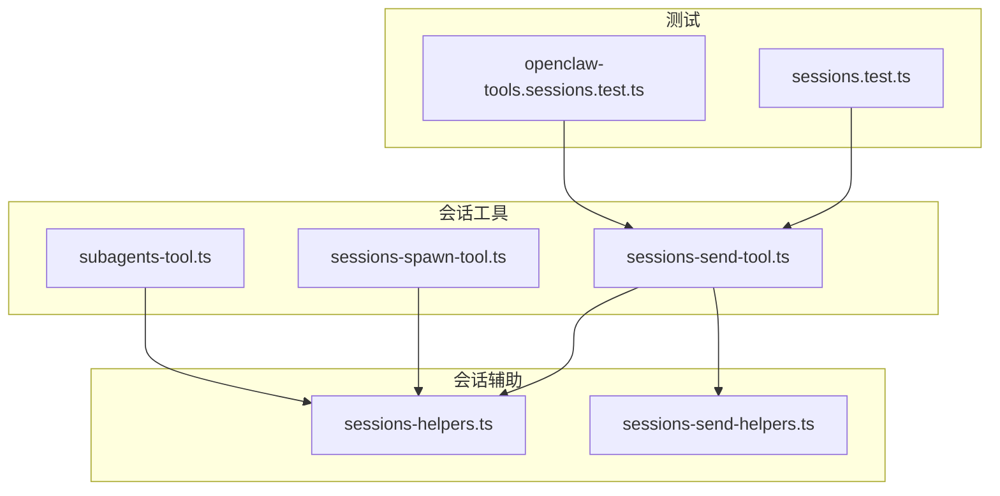
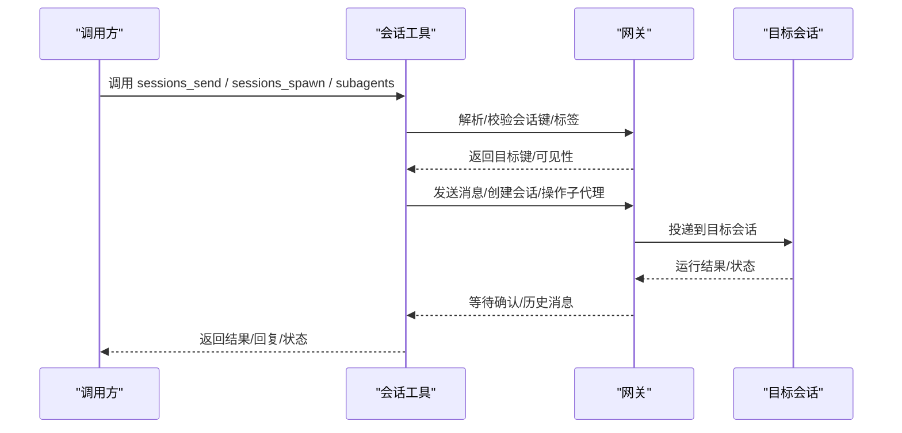
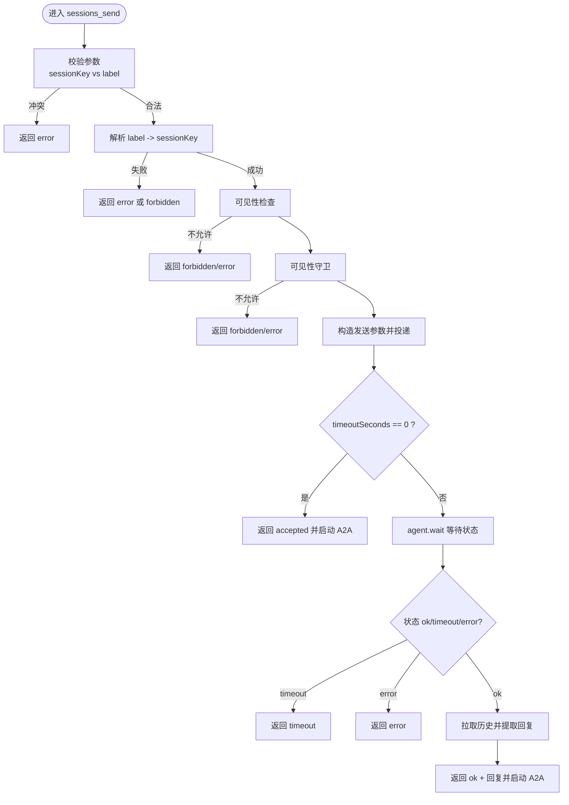
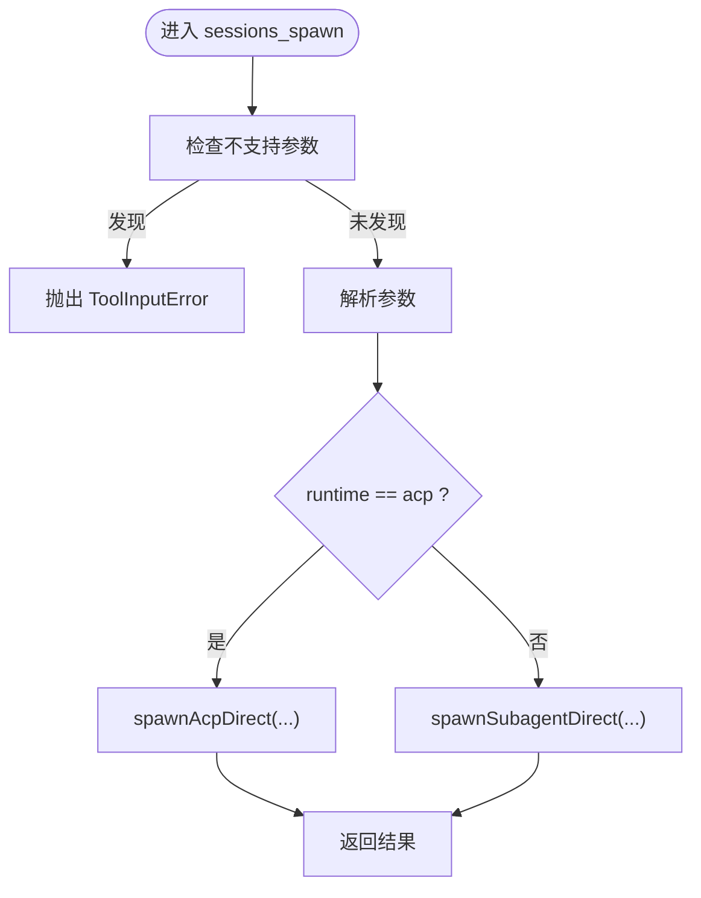
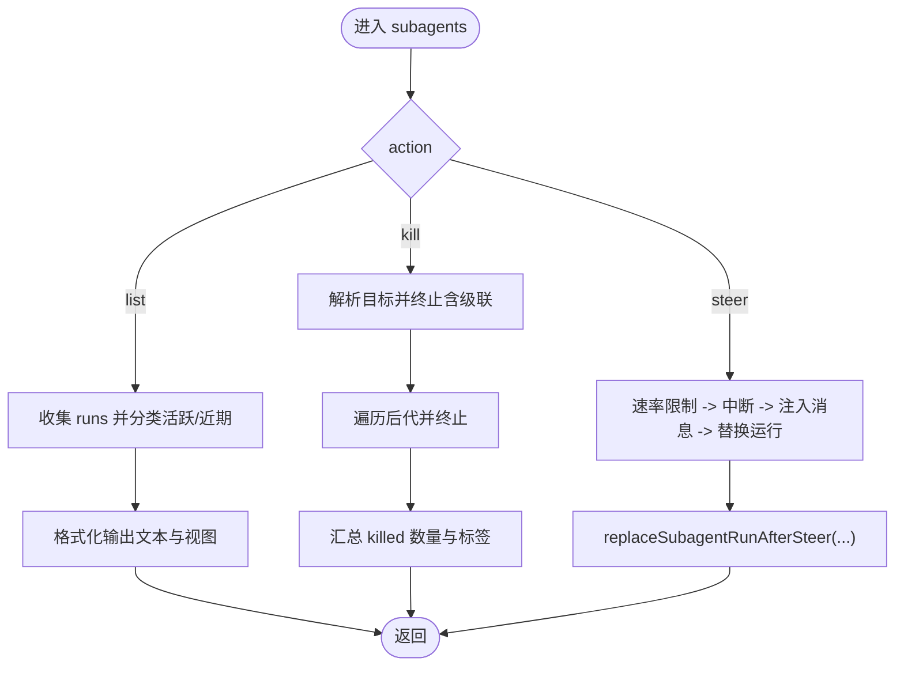
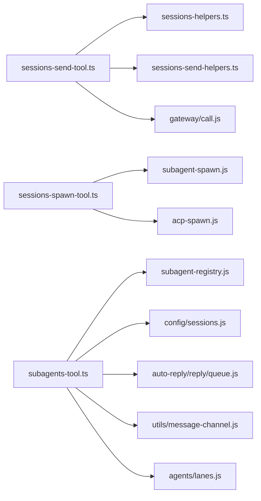

# 会话工具

## 目录
1. [简介](#简介)
2. [项目结构](#项目结构)
3. [核心组件](#核心组件)
4. [架构总览](#架构总览)
5. [详细组件分析](#详细组件分析)
6. [依赖关系分析](#依赖关系分析)
7. [性能考量](#性能考量)
8. [故障排查指南](#故障排查指南)
9. [结论](#结论)
10. [附录](#附录)

## 简介
本文件面向 OpenClaw 的“会话工具”能力，系统化梳理以下功能与机制：
- 会话发送工具：将消息投递到另一个会话，支持基于会话键或标签解析目标，并具备跨代理消息与可见性控制。
- 会话创建工具：以“子代理”或“ACP”两种运行时创建隔离会话，支持一次性任务或持久线程绑定模式。
- 子代理工具：对已创建的子代理进行列表、终止与“引导”（steer），并提供深度遍历级联终止能力。

文档重点覆盖：
- 会话生命周期管理：从创建、运行、终止到清理的全链路行为。
- 消息路由机制：内部通道、优先级队列、回显与等待确认。
- 并发控制策略：请求者上下文、沙箱限制、可见性守卫、速率限制与重启替换。
- 多代理协作、会话转发与状态同步：通过“会话发送”与“子代理引导”实现跨会话协同。
- 权限控制、超时管理与错误恢复：策略开关、超时与重试、失败降级与回退。

## 项目结构
围绕会话工具的核心文件组织如下：
- 会话发送工具：sessions-send-tool.ts
- 会话创建工具：sessions-spawn-tool.ts
- 子代理工具：subagents-tool.ts
- 通用会话辅助：sessions-helpers.ts、sessions-send-helpers.ts
- 行为测试：sessions.test.ts、openclaw-tools.sessions.test.ts

**图表来源**
- [sessions-send-tool.ts](file://src/agents/tools/sessions-send-tool.ts#L1-L362)
- [sessions-spawn-tool.ts](file://src/agents/tools/sessions-spawn-tool.ts#L1-L198)
- [subagents-tool.ts](file://src/agents/tools/subagents-tool.ts#L1-L712)
- [sessions-helpers.ts](file://src/agents/tools/sessions-helpers.ts#L1-L172)
- [sessions-send-helpers.ts](file://src/agents/tools/sessions-send-helpers.ts)
- [sessions.test.ts](file://src/agents/tools/sessions.test.ts#L389-L430)
- [openclaw-tools.sessions.test.ts](file://src/agents/openclaw-tools.sessions.test.ts#L655-L701)

**章节来源**
- [sessions-send-tool.ts](file://src/agents/tools/sessions-send-tool.ts#L1-L362)
- [sessions-spawn-tool.ts](file://src/agents/tools/sessions-spawn-tool.ts#L1-L198)
- [subagents-tool.ts](file://src/agents/tools/subagents-tool.ts#L1-L712)
- [sessions-helpers.ts](file://src/agents/tools/sessions-helpers.ts#L1-L172)

## 核心组件
- 会话发送工具（sessions_send）
  - 支持通过 sessionKey 或 label 定位目标会话；当仅提供 label 时，可按代理标识与沙箱限制进行解析与校验。
  - 内置跨代理消息策略与可见性守卫，确保在受限场景下不越权访问。
  - 发送采用内部通道与嵌套优先级，支持即时返回与等待确认两种模式，并在超时或错误时进行降级处理。
  - 提供 A2A（Agent-to-Agent）往返流程，用于会话间状态同步与回复提取。

- 会话创建工具（sessions_spawn）
  - 支持两种运行时：子代理（subagent）与 ACP（acp）。默认子代理，可选一次性（run）或持久（session）模式。
  - 支持工作目录、模型/思考覆盖、线程模式、沙箱继承/强制、附件挂载等参数。
  - 对不支持的参数进行显式拒绝，避免误用导致的路由错误。

- 子代理工具（subagents）
  - 提供 list/kill/steer 三种动作：
    - list：按活跃与近期两类展示子代理运行状态、耗时、令牌用量与任务摘要。
    - kill：终止指定子代理及其所有后代（级联终止），并返回被终止数量与标签。
    - steer：向目标子代理注入新消息，触发中断与重启替换，同时进行速率限制与等待收敛。
  - 具备请求者键解析逻辑，区分“编排型子代理”与“叶子子代理”，以正确看到其子代或兄弟代。

**章节来源**
- [sessions-send-tool.ts](file://src/agents/tools/sessions-send-tool.ts#L35-L362)
- [sessions-spawn-tool.ts](file://src/agents/tools/sessions-spawn-tool.ts#L62-L198)
- [subagents-tool.ts](file://src/agents/tools/subagents-tool.ts#L349-L712)

## 架构总览
会话工具的整体交互路径如下：

**图表来源**
- [sessions-send-tool.ts](file://src/agents/tools/sessions-send-tool.ts#L114-L359)
- [sessions-spawn-tool.ts](file://src/agents/tools/sessions-spawn-tool.ts#L130-L194)
- [subagents-tool.ts](file://src/agents/tools/subagents-tool.ts#L446-L704)

## 详细组件分析

### 会话发送工具（sessions_send）
- 输入参数与约束
  - 必填：message
  - sessionKey 与 label 二选一；label 可带 agentId 限定跨代理范围；沙箱模式下 label 解析受限制。
  - 可选：timeoutSeconds（0 表示非阻塞即时返回）。
- 关键流程
  - 参数校验与冲突检测（sessionKey 与 label 同时提供时报错）。
  - 若仅提供 label：构建解析参数（含 agentId 与 spawnedBy 限制），调用网关 sessions.resolve 获取目标键；失败时根据沙箱策略返回 forbidden 或 error。
  - 解析与可见性检查：resolveSessionReference 与 resolveVisibleSessionReference 保证目标存在且对请求者可见。
  - 可见性守卫：createSessionVisibilityGuard 基于策略与请求者上下文决定是否允许发送。
  - 构造发送参数：内部通道、嵌套优先级、输入溯源标记、幂等键等。
  - 非阻塞模式（timeoutSeconds=0）：直接返回 accepted 并异步启动 A2A 流程。
  - 阻塞模式：先 agent 调用获取 runId，再 agent.wait 等待状态；若超时或错误，返回对应状态；成功后拉取最近历史并提取助手回复，随后启动 A2A 流程。
- 错误与边界
  - 缺少必要参数、解析失败、不可见、策略禁止、等待超时、等待错误等均有明确返回码与错误信息。
- 并发与安全
  - 幂等键避免重复投递。
  - 可见性守卫与 A2A 策略共同防止越权跨代理发送。

**图表来源**
- [sessions-send-tool.ts](file://src/agents/tools/sessions-send-tool.ts#L46-L359)

**章节来源**
- [sessions-send-tool.ts](file://src/agents/tools/sessions-send-tool.ts#L27-L362)
- [sessions-helpers.ts](file://src/agents/tools/sessions-helpers.ts#L16-L29)
- [sessions-send-helpers.ts](file://src/agents/tools/sessions-send-helpers.ts)
- [sessions.test.ts](file://src/agents/tools/sessions.test.ts#L389-L430)
- [openclaw-tools.sessions.test.ts](file://src/agents/openclaw-tools.sessions.test.ts#L655-L701)

### 会话创建工具（sessions_spawn）
- 运行时选择
  - runtime=acp：使用 ACP 直接启动，支持 streamTo 父进程；当前不支持附件。
  - runtime=subagent：使用子代理直接启动，支持附件挂载、线程模式、持久/一次性模式、清理策略、沙箱模式等。
- 关键参数
  - task、label、agentId、model/thinking/cwd/runTimeoutSeconds/thread/mode/cleanup/sandbox/streamTo/attachments/attachAs 等。
- 不支持参数拦截
  - 对 target、transport、channel、to、threadId、replyTo 等进行显式拒绝，提示改用 sessions_send 或 message。
- 结果
  - 返回标准 JSON 结果，包含运行状态、子会话键、运行 ID 等。

**图表来源**
- [sessions-spawn-tool.ts](file://src/agents/tools/sessions-spawn-tool.ts#L80-L194)

**章节来源**
- [sessions-spawn-tool.ts](file://src/agents/tools/sessions-spawn-tool.ts#L10-L198)

### 子代理工具（subagents）
- 动作与目标解析
  - action=list/kill/steer；target 支持索引、标签、会话键前缀等；recentMinutes 控制近期窗口。
- 列表（list）
  - 按活跃与近期两类输出；显示标签、模型、耗时、令牌用量、状态与任务摘要。
- 终止（kill）
  - 支持单个或全部；对每个目标执行级联终止，统计被终止数量与标签。
- 引导（steer）
  - 速率限制（默认 2 秒）；中断当前运行并等待收敛；注入新消息，替换运行记录并返回 accepted。
  - 失败时回退正常公告行为，避免静默抑制完成事件。
- 请求者键解析
  - 区分“编排型子代理”（可看到子代）与“叶子子代理”（需上溯父会话看到兄弟代）。

**图表来源**
- [subagents-tool.ts](file://src/agents/tools/subagents-tool.ts#L349-L712)

**章节来源**
- [subagents-tool.ts](file://src/agents/tools/subagents-tool.ts#L45-L712)

## 依赖关系分析
- 会话发送工具依赖
  - 会话解析与可见性：sessions-helpers.ts
  - A2A 上下文构建：sessions-send-helpers.ts
  - 网关调用：callGateway
- 会话创建工具依赖
  - 子代理启动：spawnSubagentDirect
  - ACP 启动：spawnAcpDirect
- 子代理工具依赖
  - 子代理注册与运行记录：subagent-registry.js
  - 会话存储与路径解析：sessions.js
  - 自动回复队列清理：auto-reply/reply/queue.js
  - 内部通道与优先级：utils/message-channel.js、agents/lanes.js

**图表来源**
- [sessions-send-tool.ts](file://src/agents/tools/sessions-send-tool.ts#L1-L25)
- [sessions-spawn-tool.ts](file://src/agents/tools/sessions-spawn-tool.ts#L1-L8)
- [subagents-tool.ts](file://src/agents/tools/subagents-tool.ts#L1-L43)

**章节来源**
- [sessions-send-tool.ts](file://src/agents/tools/sessions-send-tool.ts#L1-L25)
- [sessions-spawn-tool.ts](file://src/agents/tools/sessions-spawn-tool.ts#L1-L8)
- [subagents-tool.ts](file://src/agents/tools/subagents-tool.ts#L1-L43)

## 性能考量
- 超时与等待
  - sessions_send 在阻塞模式下对 agent.wait 设置额外缓冲时间，避免网络抖动导致误判。
  - steer 场景中等待收敛以确保新消息追加至现有上下文，提升一致性。
- 幂等与重试
  - 使用随机幂等键避免重复投递；在失败时进行回退处理，保持完成事件可见。
- 缓存与计算
  - 子代理工具对后代计数与会话条目加载使用缓存，降低重复 IO。
- 速率限制
  - steer 采用请求者-目标维度的速率限制，避免频繁打断造成抖动。

[本节为通用指导，无需列出具体文件来源]

## 故障排查指南
- sessions_send 常见问题
  - 既无 sessionKey 也无 label：返回 error，提示必须提供其一。
  - label 解析失败：调用 sessions.resolve 失败时，若处于沙箱模式返回 forbidden，否则返回 error 并包含具体原因。
  - 跨代理发送被禁：tools.agentToAgent.enabled=false 或不在 allow 列表，返回 forbidden。
  - 等待超时：agent.wait 返回 timeout，返回 timeout 并携带错误信息。
  - 等待错误：agent.wait 返回 error，返回 error 并携带错误信息。
- sessions_spawn 常见问题
  - 使用了不支持的参数：抛出 ToolInputError，建议改用 message 或 sessions_send。
  - runtime=acp 时传入附件：返回 error，提示附件当前不支持。
- subagents 常见问题
  - steer 速率过快：返回 rate_limited，稍后再试。
  - steer 目标已是结束态：返回 done，提示已结束。
  - steer 自己：返回 forbidden，禁止自引导。

**章节来源**
- [sessions.test.ts](file://src/agents/tools/sessions.test.ts#L389-L430)
- [openclaw-tools.sessions.test.ts](file://src/agents/openclaw-tools.sessions.test.ts#L655-L701)
- [subagents-tool.ts](file://src/agents/tools/subagents-tool.ts#L548-L704)

## 结论
会话工具通过“发送、创建、编排”三类能力，实现了多代理协作下的会话生命周期闭环：
- sessions_send 提供细粒度的消息路由与跨代理通信能力，并结合可见性与策略进行安全控制。
- sessions_spawn 提供隔离运行环境与灵活的运行模式，满足多样化任务需求。
- subagents 提供可视化的子代理治理，支持列表、终止与引导，保障复杂场景下的可控性与可观测性。

配合完善的超时、错误与回退机制，这些工具在生产环境中能够稳定支撑多代理协同与会话转发。

[本节为总结性内容，无需列出具体文件来源]

## 附录
- 实际使用示例（概念性说明）
  - 多代理协作：父代理使用 sessions_send 将任务下发给子代理；子代理完成后，父代理通过 sessions_send 拉取最新回复并继续推进。
  - 会话转发：在沙箱模式下，通过 label 解析与可见性守卫，将消息转发到同一代理内的其他会话。
  - 状态同步：在 sessions_send 的 A2A 流程中，通过 chat.history 与 stripToolMessages 清洗工具消息，提取最终助手文本作为同步依据。
  - 权限控制：通过 tools.agentToAgent.* 与可见性策略，严格限制跨代理发送范围。
  - 超时管理：根据业务需要设置 timeoutSeconds；0 表示非阻塞即时返回，适合后台投递；>0 表示阻塞等待，适合需要确认的场景。
  - 错误恢复：在等待阶段出现超时或错误时，工具返回相应状态码与错误信息，便于上层进行重试或降级处理。

[本节为概念性内容，无需列出具体文件来源]