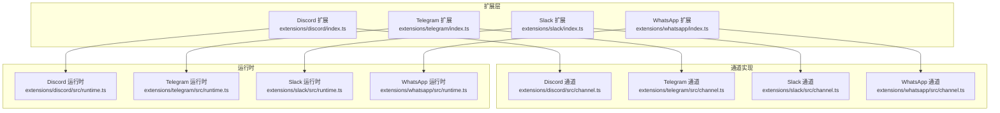
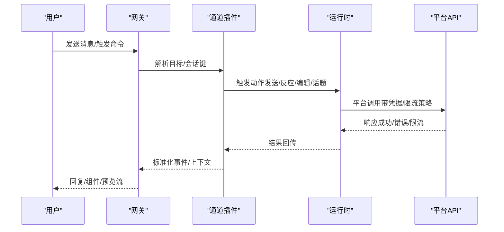
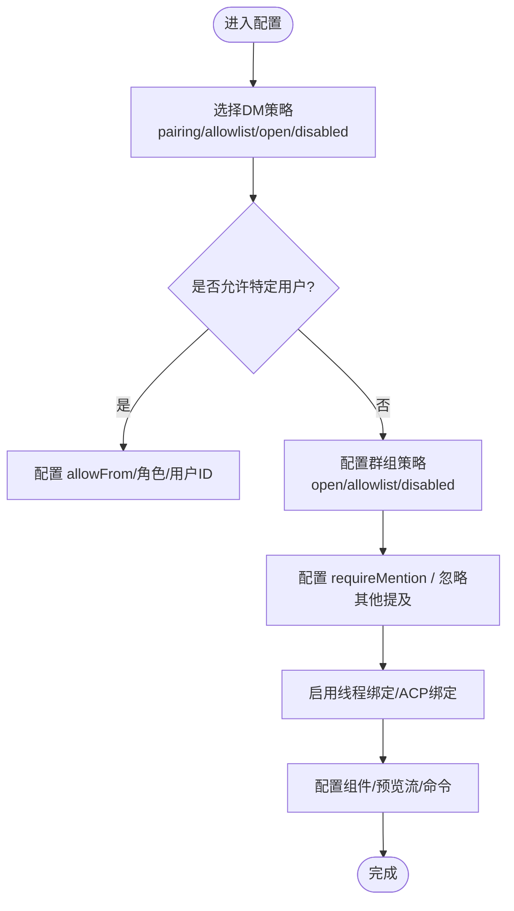
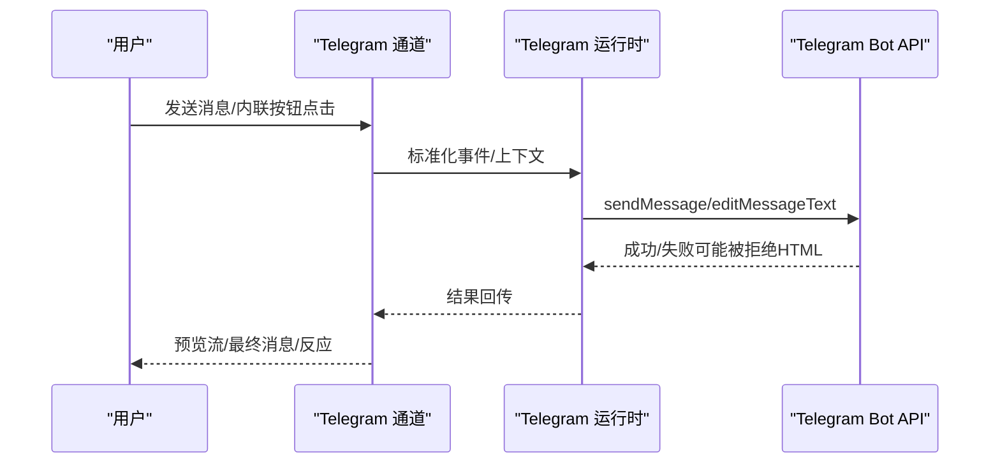
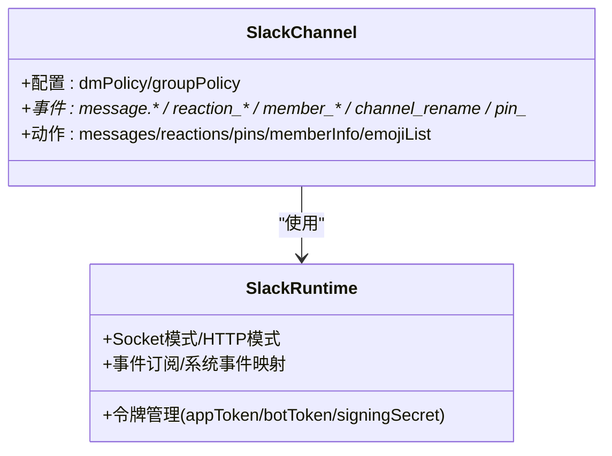
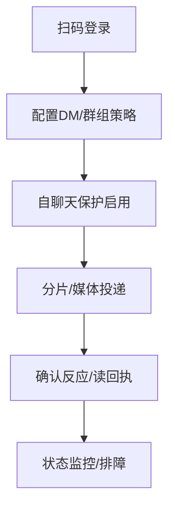
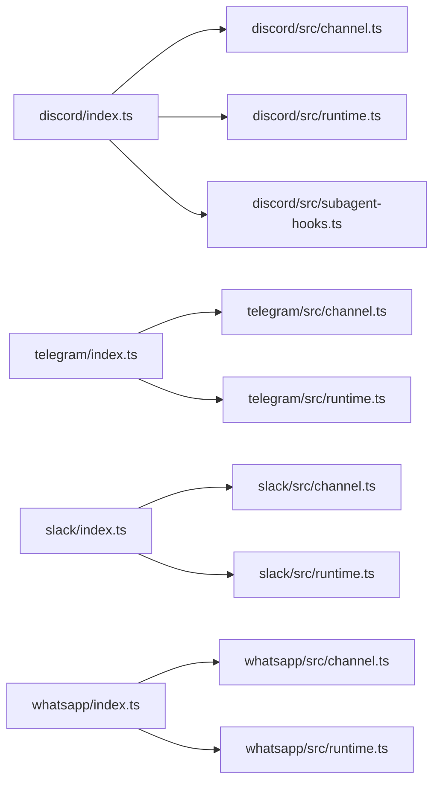

# 渠道工具

## 目录
1. [简介](#简介)
2. [项目结构](#项目结构)
3. [核心组件](#核心组件)
4. [架构总览](#架构总览)
5. [详细组件分析](#详细组件分析)
6. [依赖关系分析](#依赖关系分析)
7. [性能与速率限制](#性能与速率限制)
8. [故障排查指南](#故障排查指南)
9. [结论](#结论)
10. [附录：跨平台消息同步与合规建议](#附录跨平台消息同步与合规建议)

## 简介
本文件面向OpenClaw渠道工具，系统化梳理并解释各即时通讯平台的动作工具与运行机制，覆盖Discord消息发送、Telegram频道管理、Slack团队操作、WhatsApp群组管理等能力。文档重点包括：
- 平台消息格式与交互模型（含组件/按钮/表单）
- 权限控制与路由策略（DM/群组/提及/线程）
- 配置要点、速率限制与合规注意事项
- 跨平台消息同步、群组管理与用户交互示例
- 实际使用路径与排障建议

## 项目结构
OpenClaw通过“插件式扩展”在不同渠道之间复用统一的通道抽象与会话模型。各平台扩展位于extensions目录下，分别注册通道、运行时与子代理钩子；平台文档位于docs/channels目录，提供安装、配置、权限与特性参考。

图表来源
- [extensions/discord/index.ts](file://extensions/discord/index.ts#L1-L20)
- [extensions/telegram/index.ts](file://extensions/telegram/index.ts#L1-L18)
- [extensions/slack/index.ts](file://extensions/slack/index.ts#L1-L18)
- [extensions/whatsapp/index.ts](file://extensions/whatsapp/index.ts#L1-L18)

章节来源
- [extensions/discord/index.ts](file://extensions/discord/index.ts#L1-L20)
- [extensions/telegram/index.ts](file://extensions/telegram/index.ts#L1-L18)
- [extensions/slack/index.ts](file://extensions/slack/index.ts#L1-L18)
- [extensions/whatsapp/index.ts](file://extensions/whatsapp/index.ts#L1-L18)

## 核心组件
- 通道插件：负责注册平台通道、初始化运行时与事件钩子，统一对外暴露“发送/反应/编辑/话题/投票”等动作。
- 运行时：封装平台特有的连接、认证、事件订阅与消息收发逻辑。
- 子代理钩子（Discord）：支持线程绑定、持久化会话与ACP集成，便于长期工作空间与任务编排。

章节来源
- [extensions/discord/src/channel.ts](file://extensions/discord/src/channel.ts)
- [extensions/discord/src/runtime.ts](file://extensions/discord/src/runtime.ts)
- [extensions/discord/src/subagent-hooks.ts](file://extensions/discord/src/subagent-hooks.ts)
- [extensions/telegram/src/channel.ts](file://extensions/telegram/src/channel.ts)
- [extensions/telegram/src/runtime.ts](file://extensions/telegram/src/runtime.ts)
- [extensions/slack/src/channel.ts](file://extensions/slack/src/channel.ts)
- [extensions/slack/src/runtime.ts](file://extensions/slack/src/runtime.ts)
- [extensions/whatsapp/src/channel.ts](file://extensions/whatsapp/src/channel.ts)
- [extensions/whatsapp/src/runtime.ts](file://extensions/whatsapp/src/runtime.ts)

## 架构总览
OpenClaw采用“网关-通道-运行时”的分层设计：
- 网关负责会话、路由、权限与上下文注入
- 通道插件将平台事件标准化为内部信封，并反向下发动作
- 运行时对接平台API（如Discord Gateway、Telegram grammY、Slack Socket/HTTP、WhatsApp Baileys）

图表来源
- [extensions/discord/src/channel.ts](file://extensions/discord/src/channel.ts)
- [extensions/telegram/src/channel.ts](file://extensions/telegram/src/channel.ts)
- [extensions/slack/src/channel.ts](file://extensions/slack/src/channel.ts)
- [extensions/whatsapp/src/channel.ts](file://extensions/whatsapp/src/channel.ts)

## 详细组件分析

### Discord 渠道
- 安装与配对：需要Bot应用、启用特权Intent、生成邀请URL与权限、复制服务器/用户ID、设置令牌与启用开关。
- 权限与路由：
  - DM策略：pairing/allowlist/open/disabled；支持allowFrom与多账户继承规则
  - 群组策略：open/allowlist/disabled；支持按服务器/频道白名单、角色/用户允许列表、提及要求
  - 提及检测：@bot、自定义正则、回复到机器人
- 会话与线程：
  - DM默认共享主会话；群组通道隔离；论坛主题作为线程处理
  - 支持线程绑定、持久化ACP绑定、会话空闲/最大寿命控制
- 交互组件与预览流：
  - 支持文本/分隔/动作行/媒体画廊/文件块；按钮/选择器/模态表单
  - 预览流支持partial/block模式，文本优先；媒体回退为普通投递
- 命令与配置写入：原生斜杠命令可启用；支持从事件触发的配置写入（如频道迁移）

图表来源
- [docs/channels/discord.md](file://docs/channels/discord.md#L368-L460)
- [docs/channels/discord.md](file://docs/channels/discord.md#L619-L686)
- [docs/channels/discord.md](file://docs/channels/discord.md#L286-L367)

章节来源
- [docs/channels/discord.md](file://docs/channels/discord.md#L24-L171)
- [docs/channels/discord.md](file://docs/channels/discord.md#L368-L460)
- [docs/channels/discord.md](file://docs/channels/discord.md#L462-L751)
- [docs/channels/discord.md](file://docs/channels/discord.md#L753-L800)
- [extensions/discord/index.ts](file://extensions/discord/index.ts#L1-L20)
- [extensions/discord/src/channel.ts](file://extensions/discord/src/channel.ts)
- [extensions/discord/src/runtime.ts](file://extensions/discord/src/runtime.ts)
- [extensions/discord/src/subagent-hooks.ts](file://extensions/discord/src/subagent-hooks.ts)

### Telegram 渠道
- 设置要点：BotFather创建令牌、DM策略、群组可见性（隐私模式或管理员）、Webhook/长轮询模式
- 权限与路由：
  - DM策略：pairing/allowlist/open/disabled；支持numeric ID与前缀规范化
  - 群组策略：groupPolicy + groupAllowFrom；支持按群/话题隔离
  - 提及行为：@bot或正则；会话级激活命令
- 功能特性：
  - 预览流（消息编辑）：DM/群组均支持；复杂回复回退为最终投递并清理预览
  - HTML解析与链接预览；内联按钮作用域控制
  - 论坛话题：按话题隔离会话；支持ACP绑定与线程绑定
  - 反应通知与确认反应；配置写入（迁移/命令）
  - Webhook/长轮询；Polls/Stickers/语音/视频消息；媒体上限与重试
- 速率与限制：文本分片、媒体大小限制、历史窗口、超时与重试

图表来源
- [docs/channels/telegram.md](file://docs/channels/telegram.md#L222-L231)
- [docs/channels/telegram.md](file://docs/channels/telegram.md#L234-L274)
- [docs/channels/telegram.md](file://docs/channels/telegram.md#L328-L393)
- [docs/channels/telegram.md](file://docs/channels/telegram.md#L434-L471)
- [docs/channels/telegram.md](file://docs/channels/telegram.md#L704-L721)

章节来源
- [docs/channels/telegram.md](file://docs/channels/telegram.md#L24-L73)
- [docs/channels/telegram.md](file://docs/channels/telegram.md#L105-L220)
- [docs/channels/telegram.md](file://docs/channels/telegram.md#L222-L791)
- [extensions/telegram/index.ts](file://extensions/telegram/index.ts#L1-L18)
- [extensions/telegram/src/channel.ts](file://extensions/telegram/src/channel.ts)
- [extensions/telegram/src/runtime.ts](file://extensions/telegram/src/runtime.ts)

### Slack 渠道
- 模式与令牌：Socket Mode（默认）与HTTP Events API；需App Token与Bot Token；可选Signing Secret
- 权限与路由：
  - DM策略：pairing/allowlist/open/disabled；支持MPIM与多账户继承
  - 通道策略：open/allowlist；支持按通道/用户白名单、提及要求
  - 提及检测：@bot、正则、回复到机器人
- 命令与交互：
  - 原生斜杠命令可启用；参数菜单自适应渲染
  - 系统事件映射：编辑/删除/反应/成员变更/话题/视图提交
- 交付与媒体：
  - 文本分片、文件上传、线程回复；媒体上限与下载策略
- 速率与限制：文本分片、媒体上限、线程历史范围、打字指示回退

图表来源
- [docs/channels/slack.md](file://docs/channels/slack.md#L136-L205)
- [docs/channels/slack.md](file://docs/channels/slack.md#L207-L233)
- [docs/channels/slack.md](file://docs/channels/slack.md#L284-L325)
- [docs/channels/slack.md](file://docs/channels/slack.md#L492-L532)

章节来源
- [docs/channels/slack.md](file://docs/channels/slack.md#L24-L131)
- [docs/channels/slack.md](file://docs/channels/slack.md#L136-L205)
- [docs/channels/slack.md](file://docs/channels/slack.md#L207-L282)
- [docs/channels/slack.md](file://docs/channels/slack.md#L284-L340)
- [docs/channels/slack.md](file://docs/channels/slack.md#L492-L555)
- [extensions/slack/index.ts](file://extensions/slack/index.ts#L1-L18)
- [extensions/slack/src/channel.ts](file://extensions/slack/src/channel.ts)
- [extensions/slack/src/runtime.ts](file://extensions/slack/src/runtime.ts)

### WhatsApp 渠道
- 登录与部署：二维码登录（推荐独立号码）、个人号自聊天保护、Web-only通道
- 权限与路由：
  - DM策略：pairing/allowlist/open/disabled；E.164号码规范化
  - 群组策略：两层白名单（群组+发送者），支持提及要求
  - 自聊天保护：读回执跳过、避免自我提醒、默认响应前缀
- 交付与媒体：
  - 文本分片、图像/视频/音频/文档；PTT兼容编码；GIF播放
  - 媒体上限与自动优化；首项回退为文本警告
- 运行时与凭证：多账户、凭据路径迁移、登出行为

图表来源
- [docs/channels/whatsapp.md](file://docs/channels/whatsapp.md#L126-L133)
- [docs/channels/whatsapp.md](file://docs/channels/whatsapp.md#L134-L200)
- [docs/channels/whatsapp.md](file://docs/channels/whatsapp.md#L292-L316)
- [docs/channels/whatsapp.md](file://docs/channels/whatsapp.md#L318-L342)

章节来源
- [docs/channels/whatsapp.md](file://docs/channels/whatsapp.md#L24-L81)
- [docs/channels/whatsapp.md](file://docs/channels/whatsapp.md#L126-L200)
- [docs/channels/whatsapp.md](file://docs/channels/whatsapp.md#L202-L290)
- [docs/channels/whatsapp.md](file://docs/channels/whatsapp.md#L292-L364)
- [docs/channels/whatsapp.md](file://docs/channels/whatsapp.md#L366-L424)
- [extensions/whatsapp/index.ts](file://extensions/whatsapp/index.ts#L1-L18)
- [extensions/whatsapp/src/channel.ts](file://extensions/whatsapp/src/channel.ts)
- [extensions/whatsapp/src/runtime.ts](file://extensions/whatsapp/src/runtime.ts)

## 依赖关系分析
- 插件注册：各扩展在入口index中注册通道与运行时，部分平台还注册子代理钩子（Discord）
- 通道与运行时：通道负责动作与事件标准化，运行时负责平台API交互与会话生命周期
- 配置与策略：各平台均提供细粒度的策略字段（DM/群组/提及/线程/预览流/动作开关），并通过网关合并生效

图表来源
- [extensions/discord/index.ts](file://extensions/discord/index.ts#L1-L20)
- [extensions/telegram/index.ts](file://extensions/telegram/index.ts#L1-L18)
- [extensions/slack/index.ts](file://extensions/slack/index.ts#L1-L18)
- [extensions/whatsapp/index.ts](file://extensions/whatsapp/index.ts#L1-L18)

章节来源
- [extensions/discord/index.ts](file://extensions/discord/index.ts#L1-L20)
- [extensions/telegram/index.ts](file://extensions/telegram/index.ts#L1-L18)
- [extensions/slack/index.ts](file://extensions/slack/index.ts#L1-L18)
- [extensions/whatsapp/index.ts](file://extensions/whatsapp/index.ts#L1-L18)

## 性能与速率限制
- 文本分片与换行优先：多数平台默认以长度或段落边界切分，避免截断关键语义
- 媒体上限与优化：图片自动压缩/缩放，超出阈值回退为警告文本
- 预览流与阻塞流：预览流用于实时反馈，复杂内容回退为最终投递；避免重复流
- 事件与动作开关：通过动作门控减少无效调用，降低API压力
- 会话与历史：合理设置历史窗口，避免无界上下文导致延迟与成本上升

章节来源
- [docs/channels/discord.md](file://docs/channels/discord.md#L574-L617)
- [docs/channels/telegram.md](file://docs/channels/telegram.md#L722-L762)
- [docs/channels/slack.md](file://docs/channels/slack.md#L256-L282)
- [docs/channels/whatsapp.md](file://docs/channels/whatsapp.md#L294-L316)

## 故障排查指南
- Discord
  - 未收到DM配对码：检查DM策略、服务器隐私设置、开发者模式ID复制
  - 群组未响应：核对群组策略、提及要求、角色/用户白名单
  - 组件不可用：确认组件类型与作用域、reusable与allowedUsers
- Telegram
  - 非@提及不响应：隐私模式需关闭或设为管理员；确认群组可见性
  - setMyCommands失败：检查外网可达性与DNS；确认Webhook/长轮询配置
  - 论坛话题：注意特殊话题ID与线程绑定
- Slack
  - 无回复：检查groupPolicy、通道白名单、requireMention、用户白名单
  - Socket模式未连接：校验App Token/Bot Token与Socket Mode启用
  - HTTP模式无事件：校验Signing Secret、Webhook路径与请求URL
- WhatsApp
  - 未登录/断连：执行登录流程与doctor诊断；确保Node环境
  - 群组忽略：核对群组策略、发送者白名单、提及要求与重复键问题

章节来源
- [docs/channels/discord.md](file://docs/channels/discord.md#L169-L171)
- [docs/channels/discord.md](file://docs/channels/discord.md#L438-L460)
- [docs/channels/telegram.md](file://docs/channels/telegram.md#L793-L800)
- [docs/channels/telegram.md](file://docs/channels/telegram.md#L704-L721)
- [docs/channels/slack.md](file://docs/channels/slack.md#L433-L490)
- [docs/channels/whatsapp.md](file://docs/channels/whatsapp.md#L374-L424)

## 结论
OpenClaw通过模块化的扩展架构，将不同平台的差异抽象为统一的通道接口与运行时，使开发者能在同一套配置与会话模型下实现跨平台消息同步、群组管理与用户交互。建议在生产环境中：
- 明确DM/群组策略与白名单，最小权限原则
- 合理配置预览流与分片策略，兼顾体验与成本
- 使用线程绑定与ACP集成，构建稳定的工作空间
- 关注平台API限制与合规要求，定期排障与审计

## 附录：跨平台消息同步与合规建议
- 跨平台同步
  - 使用统一会话键（agent:&lt;agentId&gt;:&lt;channel&gt;:&lt;target&gt;）保持上下文连续性
  - 对论坛/线程场景，保留thread/话题标识，避免上下文错位
  - 利用线程绑定与ACP持久化，确保长期任务在多平台一致
- 群组管理
  - 为每个群组/频道维护明确的白名单与提及策略
  - 对敏感群组启用“仅@提及”或“允许列表”，并定期审计
- 用户交互
  - 组件/按钮/表单需遵循平台限制与可用性；对媒体类交互提供回退方案
  - 对反应/点赞/贴纸等非文本交互，建立清晰的事件映射与日志
- 合规与安全
  - 令牌与凭据存储于受控位置，避免明文泄露
  - 审计与日志记录关键事件（配对、策略变更、动作执行）
  - 遵循平台服务条款与数据保护法规，限制过度抓取与自动化滥用