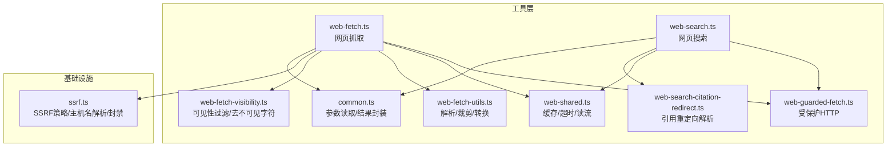
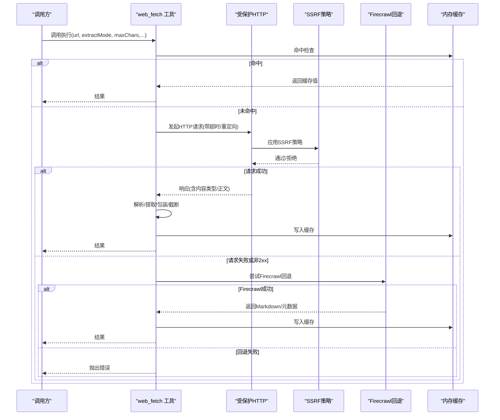
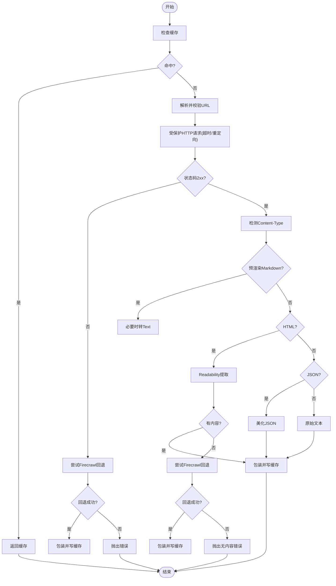
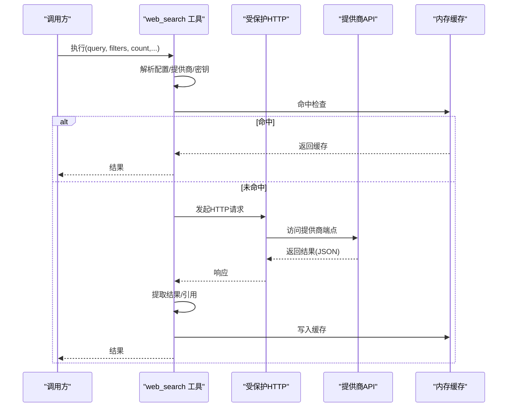
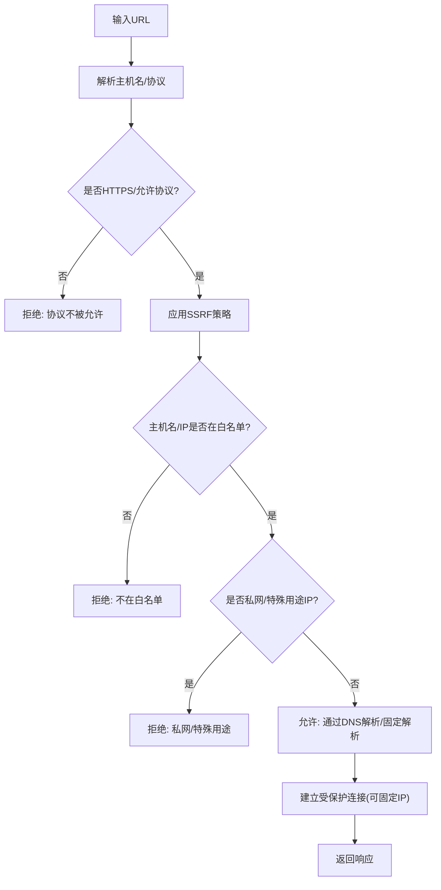
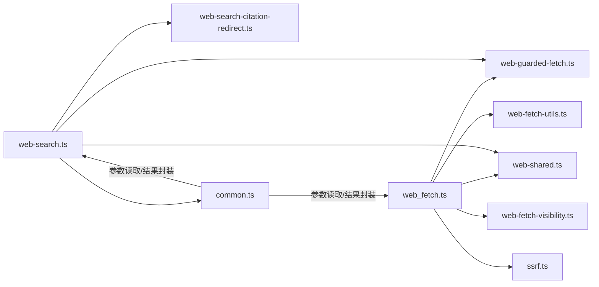

# 网络工具

## 目录
1. [简介](#简介)
2. [项目结构](#项目结构)
3. [核心组件](#核心组件)
4. [架构总览](#架构总览)
5. [详细组件分析](#详细组件分析)
6. [依赖关系分析](#依赖关系分析)
7. [性能考量](#性能考量)
8. [故障排查指南](#故障排查指南)
9. [结论](#结论)
10. [附录：使用示例与最佳实践](#附录使用示例与最佳实践)

## 简介
本文件面向OpenClaw网络工具的技术文档，重点覆盖网页抓取工具（web_fetch）与网页搜索工具（web_search）。内容涵盖HTTP请求处理、URL验证、内容解析与缓存机制，并系统阐述网络安全防护（SSRF防护、内容过滤、速率限制策略建议），以及实际使用示例与最佳实践。

## 项目结构
网络工具位于 agents/tools 子目录，围绕“抓取”和“搜索”两大能力构建，辅以通用的网络防护、共享缓存与内容清洗模块。

**图表来源**
- [web-fetch.ts](file://src/agents/tools/web-fetch.ts#L1-L787)
- [web-search.ts](file://src/agents/tools/web-search.ts#L1-L800)
- [web-guarded-fetch.ts](file://src/agents/tools/web-guarded-fetch.ts#L1-L84)
- [web-shared.ts](file://src/agents/tools/web-shared.ts#L1-L171)
- [web-fetch-utils.ts](file://src/agents/tools/web-fetch-utils.ts#L1-L255)
- [web-fetch-visibility.ts](file://src/agents/tools/web-fetch-visibility.ts#L1-L157)
- [web-search-citation-redirect.ts](file://src/agents/tools/web-search-citation-redirect.ts#L1-L23)
- [common.ts](file://src/agents/tools/common.ts#L1-L341)
- [ssrf.ts](file://src/infra/net/ssrf.ts#L1-L364)

**章节来源**
- [web-tools.ts](file://src/agents/tools/web-tools.ts#L1-L2)
- [openclaw-tools.ts](file://src/agents/openclaw-tools.ts#L159-L198)

## 核心组件
- 网页抓取工具（web_fetch）
  - 支持本地可读性提取（Readability）、Firecrawl回退、基础HTML清理三阶段提取
  - 内置缓存、超时控制、响应体大小限制、最大重定向次数
  - 受SSRF防护的受信网络模式发起HTTP请求
- 网页搜索工具（web_search）
  - 多提供商支持（Brave、Gemini、Grok、Kimi、Perplexity）
  - 结果分页、语言/地区/时间过滤、Perplexity原生API参数映射
  - 引用链接解析与去重
- 共享能力
  - 受保护HTTP请求（SSRF策略、环境代理信任模式）
  - 缓存（内存Map、TTL、容量上限）
  - 内容清洗（HTML可见性过滤、不可见Unicode清理、HTML→Markdown→Text）

**章节来源**
- [web-fetch.ts](file://src/agents/tools/web-fetch.ts#L1-L787)
- [web-search.ts](file://src/agents/tools/web-search.ts#L1-L800)
- [web-guarded-fetch.ts](file://src/agents/tools/web-guarded-fetch.ts#L1-L84)
- [web-shared.ts](file://src/agents/tools/web-shared.ts#L1-L171)
- [web-fetch-utils.ts](file://src/agents/tools/web-fetch-utils.ts#L1-L255)
- [web-fetch-visibility.ts](file://src/agents/tools/web-fetch-visibility.ts#L1-L157)
- [web-search-citation-redirect.ts](file://src/agents/tools/web-search-citation-redirect.ts#L1-L23)

## 架构总览
下图展示抓取与搜索的关键调用链路与安全边界：

**图表来源**
- [web-fetch.ts](file://src/agents/tools/web-fetch.ts#L508-L684)
- [web-guarded-fetch.ts](file://src/agents/tools/web-guarded-fetch.ts#L37-L50)
- [ssrf.ts](file://src/infra/net/ssrf.ts#L276-L330)
- [web-shared.ts](file://src/agents/tools/web-shared.ts#L26-L61)

## 详细组件分析

### 组件A：网页抓取（web_fetch）
- 功能要点
  - URL合法性校验（仅允许http/https）
  - 受SSRF防护的HTTP请求（受信网络模式）
  - 内容提取三阶段：Readability → Firecrawl → 基础HTML清理
  - 包装外部内容（含警告提示），并进行长度截断与包裹
  - 响应体大小限制、最大重定向次数、超时控制
  - 内存缓存（键：url+模式+字符数；TTL可配置；容量上限）
- 关键流程（抓取主流程）
  - 缓存命中则直接返回
  - 否则发起受保护HTTP请求，读取响应文本
  - 根据Content-Type选择提取路径（预渲染Markdown、HTML可读性、JSON美化、原始文本）
  - 包装并写入缓存，返回结果
- 错误处理
  - 非法URL、SSRF拦截、HTTP错误码、Firecrawl失败均会抛错
  - 错误详情会进行HTML到Markdown的降级展示与截断

**图表来源**
- [web-fetch.ts](file://src/agents/tools/web-fetch.ts#L508-L684)
- [web-fetch-utils.ts](file://src/agents/tools/web-fetch-utils.ts#L209-L255)
- [web-shared.ts](file://src/agents/tools/web-shared.ts#L26-L61)

**章节来源**
- [web-fetch.ts](file://src/agents/tools/web-fetch.ts#L1-L787)
- [web-fetch-utils.ts](file://src/agents/tools/web-fetch-utils.ts#L1-L255)
- [web-fetch-visibility.ts](file://src/agents/tools/web-fetch-visibility.ts#L1-L157)
- [web-guarded-fetch.ts](file://src/agents/tools/web-guarded-fetch.ts#L1-L84)
- [web-shared.ts](file://src/agents/tools/web-shared.ts#L1-L171)
- [ssrf.ts](file://src/infra/net/ssrf.ts#L1-L364)

### 组件B：网页搜索（web_search）
- 功能要点
  - 多提供商适配：Brave、Gemini、Grok、Kimi、Perplexity
  - 参数标准化与校验（数量、语言、国家、新鲜度、日期范围）
  - 引用链接提取与去重（支持Perplexity/Grok注解式引用）
  - 受保护HTTP访问外部服务端点
  - 结果缓存（按查询参数生成键，TTL可配置）
- 关键流程（搜索主流程）
  - 解析配置与API密钥来源（配置/环境变量）
  - 选择提供商（显式配置或自动检测）
  - 组装请求参数并发起HTTP请求
  - 解析响应，提取结果列表与引用链接
  - 写入缓存并返回

**图表来源**
- [web-search.ts](file://src/agents/tools/web-search.ts#L1-L800)
- [web-guarded-fetch.ts](file://src/agents/tools/web-guarded-fetch.ts#L64-L83)
- [web-shared.ts](file://src/agents/tools/web-shared.ts#L26-L61)

**章节来源**
- [web-search.ts](file://src/agents/tools/web-search.ts#L1-L800)
- [web-search-citation-redirect.ts](file://src/agents/tools/web-search-citation-redirect.ts#L1-L23)
- [web-guarded-fetch.ts](file://src/agents/tools/web-guarded-fetch.ts#L1-L84)
- [web-shared.ts](file://src/agents/tools/web-shared.ts#L1-L171)

### 组件C：受保护HTTP与SSRF防护
- 受保护HTTP
  - 提供两类模式：严格模式与受信环境代理模式
  - 自动注入超时信号，支持HEAD请求用于引用解析
- SSRF策略
  - 主机名校验、私网/特殊用途IP封禁、可选白名单
  - 支持固定解析（pinned lookup）与调度器绑定
  - 对解析结果二次校验，避免公网域名指向私网IP

**图表来源**
- [web-guarded-fetch.ts](file://src/agents/tools/web-guarded-fetch.ts#L1-L84)
- [ssrf.ts](file://src/infra/net/ssrf.ts#L32-L330)

**章节来源**
- [web-guarded-fetch.ts](file://src/agents/tools/web-guarded-fetch.ts#L1-L84)
- [ssrf.ts](file://src/infra/net/ssrf.ts#L1-L364)

### 组件D：内容解析与清洗
- HTML→Markdown→Text转换
  - 标题、列表、段落、链接等结构化处理
  - 文本规范化（空白折叠、换行规整）
- 可见性过滤与不可见字符清理
  - 基于CSS属性/类名/隐藏属性移除不可见元素
  - 清理零宽/隐藏Unicode字符，降低提示注入风险
- 文本截断与包装
  - 考虑外部内容包装开销后的截断策略
  - 警告提示与长度统计

**章节来源**
- [web-fetch-utils.ts](file://src/agents/tools/web-fetch-utils.ts#L1-L255)
- [web-fetch-visibility.ts](file://src/agents/tools/web-fetch-visibility.ts#L1-L157)
- [web-shared.ts](file://src/agents/tools/web-shared.ts#L89-L171)

## 依赖关系分析
- 模块耦合
  - web_fetch 依赖受保护HTTP、SSRF策略、内容清洗、缓存与超时工具
  - web_search 依赖受保护HTTP、缓存、引用解析与参数校验
- 外部依赖
  - Readability与DOM解析库用于HTML提取
  - Undici Agent用于受保护连接
  - Firecrawl作为可选回退服务（需API Key）
- 循环依赖
  - 未发现循环导入；各模块职责清晰

**图表来源**
- [web-fetch.ts](file://src/agents/tools/web-fetch.ts#L1-L787)
- [web-search.ts](file://src/agents/tools/web-search.ts#L1-L800)
- [web-guarded-fetch.ts](file://src/agents/tools/web-guarded-fetch.ts#L1-L84)
- [web-shared.ts](file://src/agents/tools/web-shared.ts#L1-L171)
- [web-fetch-utils.ts](file://src/agents/tools/web-fetch-utils.ts#L1-L255)
- [web-fetch-visibility.ts](file://src/agents/tools/web-fetch-visibility.ts#L1-L157)
- [web-search-citation-redirect.ts](file://src/agents/tools/web-search-citation-redirect.ts#L1-L23)
- [common.ts](file://src/agents/tools/common.ts#L1-L341)

**章节来源**
- [web-tools.ts](file://src/agents/tools/web-tools.ts#L1-L2)
- [openclaw-tools.ts](file://src/agents/openclaw-tools.ts#L159-L198)

## 性能考量
- 缓存策略
  - 内存Map缓存，支持TTL与容量上限，避免无限增长
  - 抓取与搜索分别维护独立缓存空间
- I/O与解析
  - 流式读取响应体，限制最大字节数，防止内存膨胀
  - Readability解析前进行HTML复杂度启发式检查，避免深度嵌套导致栈/内存问题
- 超时与重定向
  - 统一超时控制与最大重定向次数，避免长时间阻塞
- 外部服务
  - Firecrawl回退仅在可用API Key时启用，减少不必要的外部调用

[本节为通用指导，无需特定文件引用]

## 故障排查指南
- SSRF拦截
  - 现象：抛出“被阻止的主机名或私网/特殊用途IP地址”
  - 排查：确认目标URL为主机名而非私网IP；检查SSRF策略白名单；必要时使用受信环境代理模式
  - 参考测试：[web-fetch.ssrf.test.ts](file://src/agents/tools/web-fetch.ssrf.test.ts#L40-L90)
- URL非法
  - 现象：抛出“无效URL：必须为http或https”
  - 排查：确保URL协议为http/https且可解析
- HTTP错误
  - 现象：非2xx状态码，错误详情可能包含HTML，会被降级为Markdown再转Text并截断
  - 排查：检查目标站点状态、防火墙与反爬策略
- Firecrawl回退失败
  - 现象：Readability与Firecrawl均无内容
  - 排查：确认API Key有效、网络可达、请求参数合理
- 缓存命中与失效
  - 现象：重复请求返回缓存值
  - 排查：检查cacheTtlMinutes与键生成规则（url+extractMode+maxChars）

**章节来源**
- [web-fetch.ts](file://src/agents/tools/web-fetch.ts#L508-L684)
- [web-fetch.ssrf.test.ts](file://src/agents/tools/web-fetch.ssrf.test.ts#L40-L90)
- [web-shared.ts](file://src/agents/tools/web-shared.ts#L26-L61)

## 结论
OpenClaw网络工具通过“受保护HTTP + SSRF策略 + 多级内容提取 + 内存缓存”的组合，在保证安全性的同时提供了稳健的网页抓取与搜索能力。工具对错误与异常进行了充分封装，并提供了可配置的超时、重定向与响应体大小限制，适合在多场景下稳定运行。

[本节为总结，无需特定文件引用]

## 附录：使用示例与最佳实践
- 网页内容提取（web_fetch）
  - 场景：从新闻/技术博客提取正文，输出Markdown或纯文本
  - 最佳实践：
    - 设置合理的maxChars与maxResponseBytes，避免超大响应
    - 开启readability（默认开启），必要时启用Firecrawl回退
    - 使用缓存TTL降低重复抓取成本
  - 参考文档：[firecrawl.md](file://docs/tools/firecrawl.md#L1-L63)
- 搜索引擎查询（web_search）
  - 场景：跨提供商检索，按语言/国家/时间过滤，提取引用链接
  - 最佳实践：
    - 显式配置提供商与API Key，或依赖自动检测
    - 使用freshness/date_after/date_before限定时间范围
    - 对Perplexity使用原生API参数时注意模型与传输方式
- 引用链接处理
  - 场景：从搜索结果中提取引用URL并解析最终跳转地址
  - 最佳实践：使用HEAD请求解析重定向，设置短超时避免阻塞

**章节来源**
- [firecrawl.md](file://docs/tools/firecrawl.md#L1-L63)
- [web-search.ts](file://src/agents/tools/web-search.ts#L1-L800)
- [web-search-citation-redirect.ts](file://src/agents/tools/web-search-citation-redirect.ts#L1-L23)