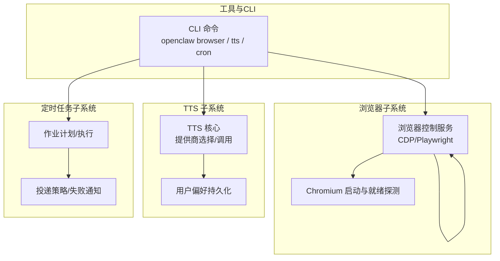
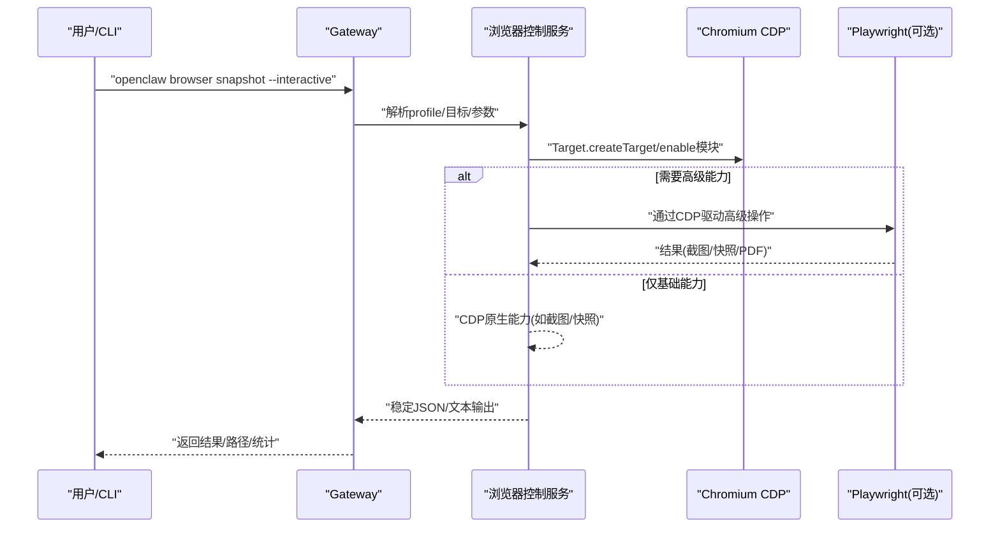
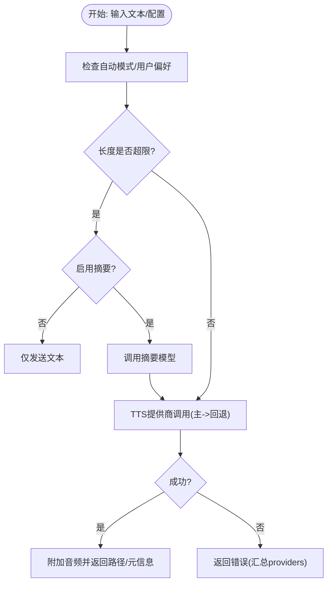
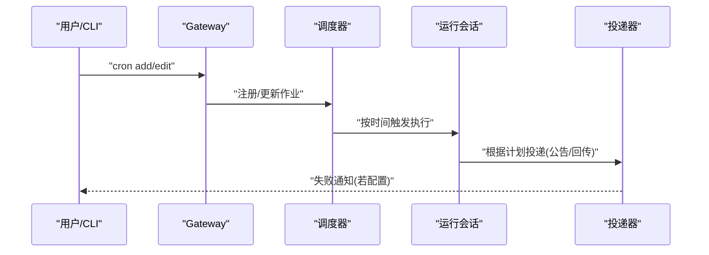
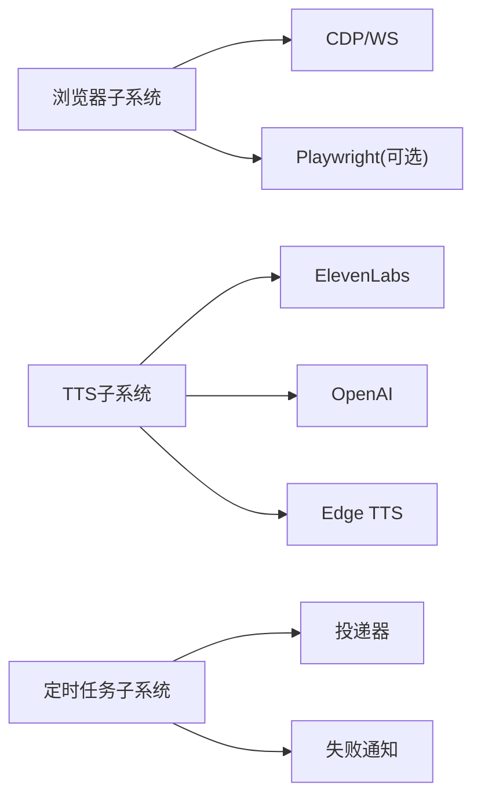

# 运行时工具


## 目录
1. [简介](#简介)
2. [项目结构](#项目结构)
3. [核心组件](#核心组件)
4. [架构总览](#架构总览)
5. [详细组件分析](#详细组件分析)
6. [依赖关系分析](#依赖关系分析)
7. [性能考量](#性能考量)
8. [故障排查指南](#故障排查指南)
9. [结论](#结论)
10. [附录](#附录)

## 简介
本文件面向OpenClaw运行时工具，系统性梳理以下三类工具的能力边界与实现要点：
- 浏览器工具（browser、browser_inspect）：通过CDP控制Chromium系浏览器，支持本地/远程/扩展中继模式，提供快照、截图、动作、状态与网络调试能力。
- 文本转语音工具（tts_speak）：将回复内容转换为音频，支持ElevenLabs、OpenAI、Edge TTS，具备自动摘要、模型指令覆盖、输出格式适配与用户偏好持久化。
- 定时任务工具（cron_schedule）：调度与执行后台作业，支持公告投递、Webhook回传、失败通知与会话保留策略。

文档同时说明各工具的执行环境、参数配置、返回值格式，并给出浏览器自动化、语音合成、定时执行的实际场景用法与安全沙箱机制、资源限制及性能监控方法。

## 项目结构
OpenClaw在“工具层”提供统一的命令入口与能力抽象，底层通过CDP或第三方服务实现具体功能；配置集中于Gateway配置文件，CLI提供稳定的JSON输出以适配脚本化集成。



图示来源
- [docs/tools/browser.md](file://docs/tools/browser.md#L1-L674)
- [docs/tts.md](file://docs/tts.md#L1-L404)
- [docs/cli/cron.md](file://docs/cli/cron.md#L1-L78)

章节来源
- [docs/tools/browser.md](file://docs/tools/browser.md#L1-L674)
- [docs/tts.md](file://docs/tts.md#L1-L404)
- [docs/cli/cron.md](file://docs/cli/cron.md#L1-L78)

## 核心组件
- 浏览器控制（browser、browser_inspect）
  - 支持本地openclaw专用配置文件夹与端口、远程CDP、扩展中继（chrome profile）三种模式。
  - 提供状态、标签页、导航、快照、截图、PDF、动作、Cookie/Storage、网络与调试接口。
  - 参考：[浏览器工具文档](file://docs/tools/browser.md#L1-L674)
- 文本转语音（tts）
  - 自动TTS开关、提供商优先级、模型指令覆盖、输出格式适配、用户偏好持久化。
  - 参考：[TTS工具文档](file://docs/tts.md#L1-L404)
- 定时任务（cron）
  - 作业添加/编辑、公告/无投递/轻量引导上下文、失败目的地与通知、运行日志裁剪。
  - 参考：[cron CLI文档](file://docs/cli/cron.md#L1-L78)

章节来源
- [docs/tools/browser.md](file://docs/tools/browser.md#L1-L674)
- [docs/tts.md](file://docs/tts.md#L1-L404)
- [docs/cli/cron.md](file://docs/cli/cron.md#L1-L78)

## 架构总览
下图展示浏览器、TTS与定时任务三类工具在系统中的交互位置与关键依赖：

```mermaid
graph TB
subgraph "外部接口"
EXT["浏览器/网页"]
TTSAPI["ElevenLabs/OpenAI/Edge TTS"]
CHAT["消息通道/账号"]
end
subgraph "OpenClaw 运行时"
B["浏览器子系统<br/>CDP/Playwright"]
T["TTS 子系统<br/>提供商/偏好/摘要"]
C["定时任务子系统<br/>计划/投递/失败通知"]
end
EXT <- --> B
TTSAPI <- --> T
CHAT <- --> C
B --> |"CDP/WS"| EXT
T --> |"HTTP/REST"| TTSAPI
C --> |"公告/回传"| CHAT
```

图示来源
- [src/browser/cdp.ts](file://src/browser/cdp.ts#L1-L486)
- [src/tts/tts.ts](file://src/tts/tts.ts#L1-L970)
- [src/cron/delivery.ts](file://src/cron/delivery.ts#L1-L302)

## 详细组件分析

### 组件A：浏览器工具（browser、browser_inspect）
- 执行环境
  - 本地模式：Gateway启动loopback控制服务，按配置启动Chromium实例，绑定专用端口与用户数据目录。
  - 远程模式：通过CDP URL连接到远端Chromium（含直接WebSocket与HTTP发现两种），支持凭据透传。
  - 扩展中继：通过本地relay与Chrome扩展绑定现有Chrome标签页。
- 参数与行为
  - 配置项涵盖启用、SSRF策略、默认profile、颜色、headless、noSandbox、可执行路径、多profile端口/URL、远程超时、节点代理等。
  - 控制API覆盖状态/标签页/快照/截图/动作/下载/调试/网络/状态/设置等。
  - 快照支持AI风格（数字ref）与ARIA风格（角色ref），并提供交互式、紧凑、深度、选择器与iframe作用域等变体。
- 返回值与输出
  - CLI支持--json输出稳定载荷；快照包含统计信息；调试输出包含trace路径等。
- 典型用法
  - 启动/停止浏览器、打开URL、截取全页/元素图、生成ARIA快照、等待URL/加载/JS谓词、设置地理/媒体/时区/语言/设备等。
- 安全与隔离
  - loopback访问控制、默认信任网络模型/严格模式切换、远程CDP建议加密与短期令牌、节点代理需私网/认证。
- 性能与监控
  - Playwright可选安装；容器/权限问题提示；日志与trace用于定位卡顿与渲染异常。



图示来源
- [src/browser/cdp.ts](file://src/browser/cdp.ts#L1-L486)
- [src/browser/chrome.ts](file://src/browser/chrome.ts#L1-L448)
- [docs/tools/browser.md](file://docs/tools/browser.md#L1-L674)

章节来源
- [src/browser/chrome.ts](file://src/browser/chrome.ts#L1-L448)
- [src/browser/cdp.ts](file://src/browser/cdp.ts#L1-L486)
- [docs/tools/browser.md](file://docs/tools/browser.md#L1-L674)

### 组件B：文本转语音（tts）
- 执行环境
  - 通过ElevenLabs/OpenAI/Edge TTS提供商生成音频；Edge无需密钥但为托管服务，其他需配置密钥。
  - 输出格式按渠道适配（Telegram要求Opus，其他默认MP3）。
- 参数与行为
  - 自动模式：off/always/inbound/tagged；最大文本长度、摘要阈值、摘要模型、超时、用户偏好路径。
  - 模型指令覆盖：允许在单条回复内注入[[tts:...]]与[[tts:text]]块，控制音色/语速/模型/语言等。
  - 用户偏好持久化：支持按主机写入tts.json，覆盖全局配置。
- 返回值与输出
  - 成功返回包含音频路径、延迟、提供商、输出格式、是否语音兼容等字段；失败返回错误汇总。
- 典型用法
  - 开启自动TTS、设置提供商、调整最大长度、启用摘要、发送一次性音频、通过slash命令管理状态。
- 安全与隔离
  - API密钥通过环境变量或配置注入；Edge TTS为公共服务，注意限额与稳定性。
- 性能与监控
  - 超时控制、临时文件清理、失败重试顺序（主提供商优先，其余作为回退）。



图示来源
- [src/tts/tts.ts](file://src/tts/tts.ts#L1-L970)
- [src/tts/tts-core.ts](file://src/tts/tts-core.ts#L1-L700)
- [docs/tts.md](file://docs/tts.md#L1-L404)

章节来源
- [src/tts/tts.ts](file://src/tts/tts.ts#L1-L970)
- [src/tts/tts-core.ts](file://src/tts/tts-core.ts#L1-L700)
- [docs/tts.md](file://docs/tts.md#L1-L404)

### 组件C：定时任务（cron）
- 执行环境
  - Gateway内置调度器，支持一次性与周期性作业；隔离Agent回合作业默认公告投递。
- 参数与行为
  - 作业添加/编辑：名称、Cron表达式、消息、交付模式（公告/webhook/无）、轻量引导上下文、保留策略。
  - 失败目的地：支持全局与作业级覆盖，避免与主投递目标重复。
  - 运行日志：按大小/行数裁剪run日志文件。
- 返回值与输出
  - 手动运行立即返回排队确认；后续可通过run id查询最终结果。
- 典型用法
  - 添加每日简报作业、修改投递目标、开启轻量上下文、禁用交付仅内部记录。
- 安全与隔离
  - 与消息通道解耦，失败通知独立路由；避免重复投递。
- 性能与监控
  - 错误后指数回退，成功恢复常规节奏；会话保留窗口可控。



图示来源
- [src/cron/delivery.ts](file://src/cron/delivery.ts#L1-L302)
- [src/cron/isolated-agent.ts](file://src/cron/isolated-agent.ts#L1-L2)
- [docs/cli/cron.md](file://docs/cli/cron.md#L1-L78)

章节来源
- [src/cron/delivery.ts](file://src/cron/delivery.ts#L1-L302)
- [src/cron/isolated-agent.ts](file://src/cron/isolated-agent.ts#L1-L2)
- [docs/cli/cron.md](file://docs/cli/cron.md#L1-L78)

## 依赖关系分析
- 浏览器子系统
  - 依赖CDP/WS与Playwright（可选）；通过Chromium启动器与就绪探测保障可用性。
- TTS子系统
  - 依赖ElevenLabs/OpenAI/Edge TTS API；与摘要模型、用户偏好、临时目录清理协同。
- 定时任务子系统
  - 依赖投递器与失败通知逻辑，确保与主投递目标不冲突。



图示来源
- [src/browser/cdp.ts](file://src/browser/cdp.ts#L1-L486)
- [src/browser/chrome.ts](file://src/browser/chrome.ts#L1-L448)
- [src/tts/tts.ts](file://src/tts/tts.ts#L1-L970)
- [src/cron/delivery.ts](file://src/cron/delivery.ts#L1-L302)

章节来源
- [src/browser/cdp.ts](file://src/browser/cdp.ts#L1-L486)
- [src/browser/chrome.ts](file://src/browser/chrome.ts#L1-L448)
- [src/tts/tts.ts](file://src/tts/tts.ts#L1-L970)
- [src/cron/delivery.ts](file://src/cron/delivery.ts#L1-L302)

## 性能考量
- 浏览器
  - Playwright安装与容器环境：参考文档中的Docker安装与缓存路径建议；必要时启用headless与no-sandbox。
  - 日志与trace：通过调试端点收集trace与错误，定位页面卡顿与渲染异常。
- TTS
  - 超时与重试：合理设置timeoutMs；主提供商失败后自动回退；临时文件定期清理。
  - 输出格式：按渠道选择最优格式，减少二次编码开销。
- 定时任务
  - 回退策略：连续失败采用指数回退，成功后回到正常节拍；运行日志裁剪降低磁盘压力。

## 故障排查指南
- 浏览器
  - 启动失败：检查端口占用、no-sandbox、容器权限；查看stderr提示；必要时调整extraArgs。
  - 远程CDP：确认HTTPS/WSS、短时效令牌、避免明文配置；验证握手超时。
  - 扩展中继：确保relay仅loopback或私网可达，避免跨网络暴露。
- TTS
  - API密钥：检查环境变量与配置；Edge TTS为公共服务，注意限额。
  - 文本过长：调整maxTextLength或启用摘要；检查摘要模型可用性。
- 定时任务
  - 投递失败：检查失败目的地配置与URL；避免与主投递目标重复；关注回退与会话保留。

章节来源
- [docs/tools/browser.md](file://docs/tools/browser.md#L1-L674)
- [docs/tts.md](file://docs/tts.md#L1-L404)
- [docs/cli/cron.md](file://docs/cli/cron.md#L1-L78)

## 结论
OpenClaw运行时工具以“统一CLI + 分层子系统”的方式，为浏览器自动化、语音合成与定时任务提供了高可靠、可配置且可审计的解决方案。通过严格的SSRF策略、loopback访问控制、提供商回退与日志裁剪，系统在易用性与安全性之间取得平衡。建议在生产环境中结合私网/认证、短期令牌与监控告警，持续优化性能与稳定性。

## 附录
- 关键配置与CLI参考
  - 浏览器：配置项、Profiles、远程CDP、扩展中继、控制API、Playwright要求、CLI参考。
  - TTS：提供商、自动模式、模型指令、输出格式、Slash命令、Gateway RPC。
  - cron：CLI常用操作、投递与失败通知、运行日志裁剪、升级迁移提示。

章节来源
- [docs/tools/browser.md](file://docs/tools/browser.md#L1-L674)
- [docs/tts.md](file://docs/tts.md#L1-L404)
- [docs/cli/cron.md](file://docs/cli/cron.md#L1-L78)