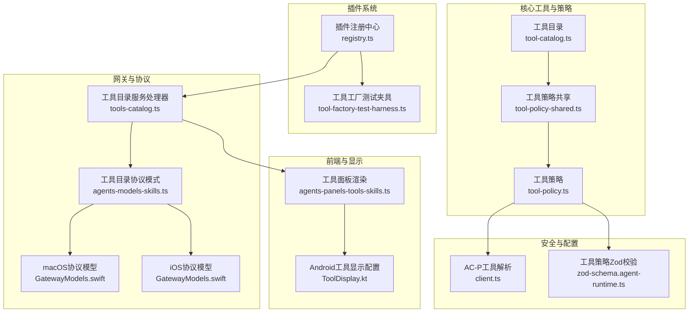
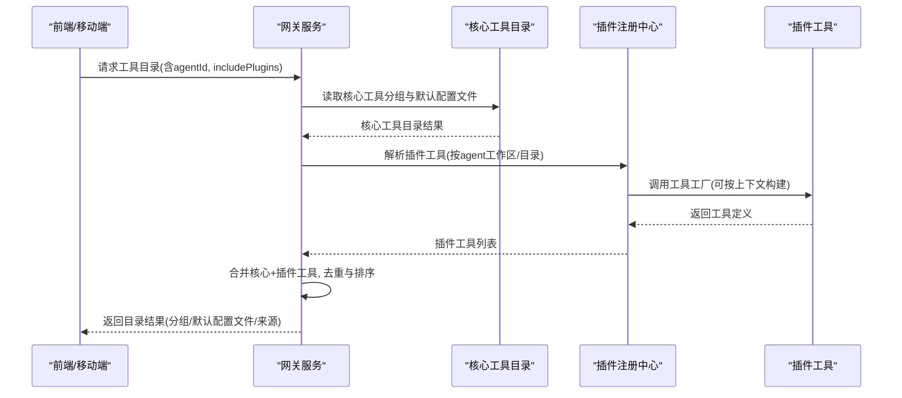
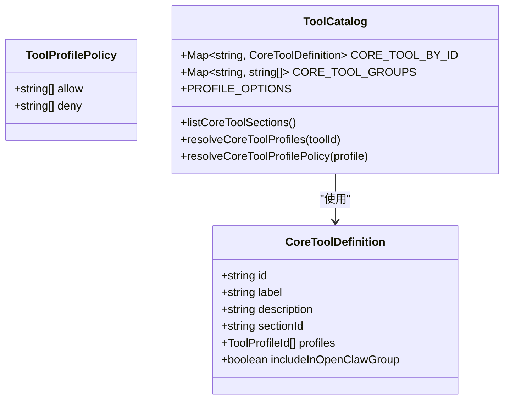
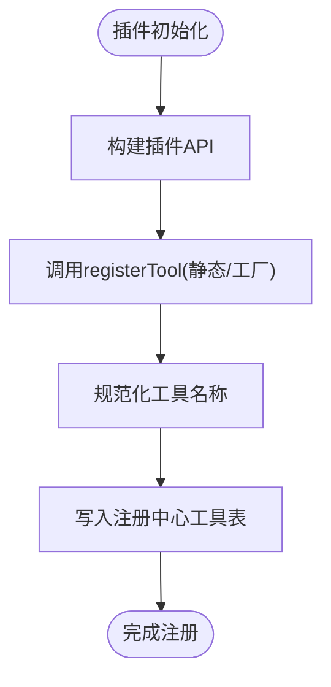
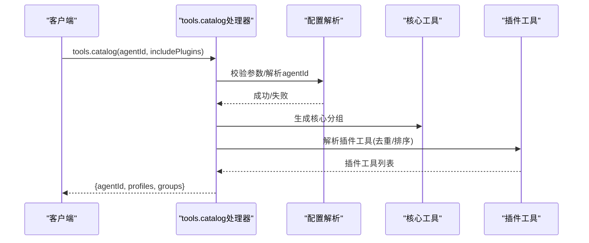
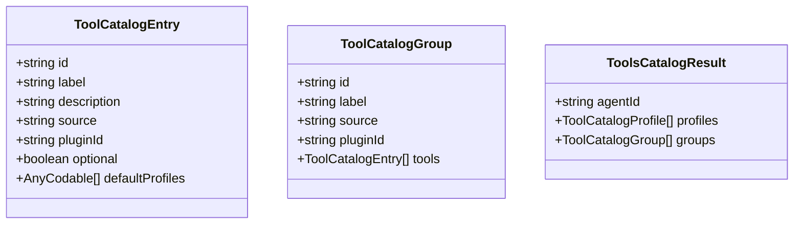
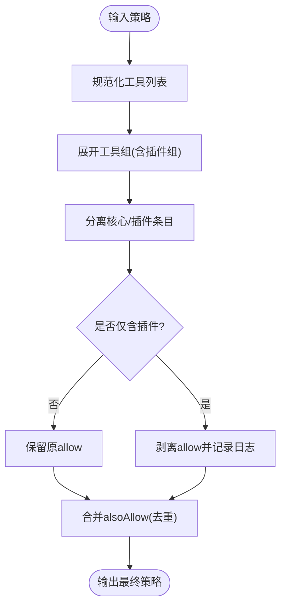
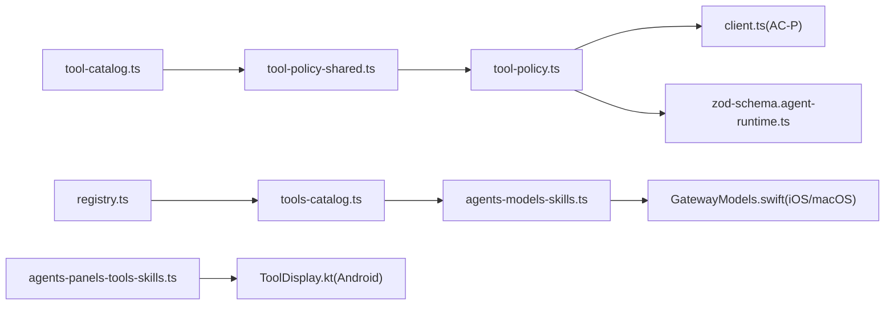

# 工具架构设计

## 目录
1. [简介](#简介)
2. [项目结构](#项目结构)
3. [核心组件](#核心组件)
4. [架构总览](#架构总览)
5. [详细组件分析](#详细组件分析)
6. [依赖关系分析](#依赖关系分析)
7. [性能考虑](#性能考虑)
8. [故障排查指南](#故障排查指南)
9. [结论](#结论)
10. [附录](#附录)

## 简介
本文件面向OpenClaw工具架构设计，系统性阐述工具系统的整体架构与实现细节，覆盖工具目录管理、工具分类体系、工具组配置、核心工具定义结构、工具配置文件组织、模块化设计（注册机制、动态加载与生命周期管理），并提供最佳实践与扩展指南。目标是帮助开发者在多平台（Web、iOS、Android）与多运行时（Node.js、Swift、Kotlin）下，一致地理解与扩展工具系统。

## 项目结构
OpenClaw的工具系统由“核心工具目录”“插件工具注册”“网关目录服务”“前端展示与策略”等模块协同构成，并通过跨平台协议模型保证一致性。

**图表来源**
- [src/agents/tool-catalog.ts](file://src/agents/tool-catalog.ts#L1-L327)
- [src/agents/tool-policy-shared.ts](file://src/agents/tool-policy-shared.ts#L1-L50)
- [src/agents/tool-policy.ts](file://src/agents/tool-policy.ts#L1-L206)
- [src/plugins/registry.ts](file://src/plugins/registry.ts#L1-L625)
- [src/gateway/server-methods/tools-catalog.ts](file://src/gateway/server-methods/tools-catalog.ts#L56-L166)
- [src/gateway/protocol/schema/agents-models-skills.ts](file://src/gateway/protocol/schema/agents-models-skills.ts#L219-L270)
- [apps/macos/Sources/OpenClawProtocol/GatewayModels.swift](file://apps/macos/Sources/OpenClawProtocol/GatewayModels.swift#L2411-L2513)
- [apps/shared/OpenClawKit/Sources/OpenClawProtocol/GatewayModels.swift](file://apps/shared/OpenClawKit/Sources/OpenClawProtocol/GatewayModels.swift#L2411-L2513)
- [ui/src/ui/views/agents-panels-tools-skills.ts](file://ui/src/ui/views/agents-panels-tools-skills.ts#L20-L153)
- [apps/android/app/src/main/java/ai/openclaw/app/tools/ToolDisplay.kt](file://apps/android/app/src/main/java/ai/openclaw/app/tools/ToolDisplay.kt#L1-L52)
- [src/acp/client.ts](file://src/acp/client.ts#L44-L93)
- [src/config/zod-schema.agent-runtime.ts](file://src/config/zod-schema.agent-runtime.ts#L252-L260)

**章节来源**
- [src/agents/tool-catalog.ts](file://src/agents/tool-catalog.ts#L1-L327)
- [src/plugins/registry.ts](file://src/plugins/registry.ts#L1-L625)
- [src/gateway/server-methods/tools-catalog.ts](file://src/gateway/server-methods/tools-catalog.ts#L56-L166)
- [src/gateway/protocol/schema/agents-models-skills.ts](file://src/gateway/protocol/schema/agents-models-skills.ts#L219-L270)
- [apps/macos/Sources/OpenClawProtocol/GatewayModels.swift](file://apps/macos/Sources/OpenClawProtocol/GatewayModels.swift#L2411-L2513)
- [apps/shared/OpenClawKit/Sources/OpenClawProtocol/GatewayModels.swift](file://apps/shared/OpenClawKit/Sources/OpenClawProtocol/GatewayModels.swift#L2411-L2513)
- [ui/src/ui/views/agents-panels-tools-skills.ts](file://ui/src/ui/views/agents-panels-tools-skills.ts#L20-L153)
- [apps/android/app/src/main/java/ai/openclaw/app/tools/ToolDisplay.kt](file://apps/android/app/src/main/java/ai/openclaw/app/tools/ToolDisplay.kt#L1-L52)
- [src/acp/client.ts](file://src/acp/client.ts#L44-L93)
- [src/config/zod-schema.agent-runtime.ts](file://src/config/zod-schema.agent-runtime.ts#L252-L260)

## 核心组件
- 工具目录与分组：定义核心工具清单、分组映射、默认配置文件与工具权限策略。
- 插件注册中心：统一注册工具、钩子、HTTP路由、CLI命令等，支持动态加载与生命周期管理。
- 网关工具目录服务：聚合核心与插件工具，输出标准化的目录结果（含分组、默认配置文件、来源标识）。
- 前端与移动端展示：根据目录结果渲染工具访问控制界面与显示配置。
- 安全与策略：工具名称归一化、组展开、策略合并与校验、所有者限制等。

**章节来源**
- [src/agents/tool-catalog.ts](file://src/agents/tool-catalog.ts#L1-L327)
- [src/plugins/registry.ts](file://src/plugins/registry.ts#L1-L625)
- [src/gateway/server-methods/tools-catalog.ts](file://src/gateway/server-methods/tools-catalog.ts#L56-L166)
- [src/agents/tool-policy.ts](file://src/agents/tool-policy.ts#L1-L206)
- [src/agents/tool-policy-shared.ts](file://src/agents/tool-policy-shared.ts#L1-L50)
- [ui/src/ui/views/agents-panels-tools-skills.ts](file://ui/src/ui/views/agents-panels-tools-skills.ts#L20-L153)
- [apps/android/app/src/main/java/ai/openclaw/app/tools/ToolDisplay.kt](file://apps/android/app/src/main/java/ai/openclaw/app/tools/ToolDisplay.kt#L1-L52)

## 架构总览
OpenClaw工具架构采用“核心+插件”的双轨目录模式。核心工具由内置清单驱动，插件工具通过注册中心动态注入。网关服务将两类工具整合为统一的目录结果，前端与移动端据此渲染工具访问策略与显示配置。

**图表来源**
- [src/gateway/server-methods/tools-catalog.ts](file://src/gateway/server-methods/tools-catalog.ts#L125-L166)
- [src/agents/tool-catalog.ts](file://src/agents/tool-catalog.ts#L56-L123)
- [src/plugins/registry.ts](file://src/plugins/registry.ts#L193-L218)

**章节来源**
- [src/gateway/server-methods/tools-catalog.ts](file://src/gateway/server-methods/tools-catalog.ts#L56-L166)
- [src/agents/tool-catalog.ts](file://src/agents/tool-catalog.ts#L56-L123)
- [src/plugins/registry.ts](file://src/plugins/registry.ts#L193-L218)

## 详细组件分析

### 工具目录与分组（核心）
- 工具定义结构：包含工具ID、标签、描述、所属分组、适用配置文件集合等。
- 分组映射：按sectionId生成分组；同时维护“OpenClaw组”聚合视图。
- 配置文件策略：内置“Minimal/Coding/Messaging/Full”四档策略，按工具的默认配置文件集合决定启用范围。
- 名称归一化与别名：提供工具名称归一化与别名映射，确保策略与UI一致。

**图表来源**
- [src/agents/tool-catalog.ts](file://src/agents/tool-catalog.ts#L18-L327)

**章节来源**
- [src/agents/tool-catalog.ts](file://src/agents/tool-catalog.ts#L1-L327)

### 插件注册与动态加载
- 注册接口：统一的registerTool接口支持静态工具或工厂函数两种形式；可声明多个名称与可选标记。
- 工厂解析：工具工厂可接收上下文参数，按环境/会话动态产出工具实例。
- 生命周期：注册中心记录插件状态、诊断信息与资源占用，便于诊断与治理。

**图表来源**
- [src/plugins/registry.ts](file://src/plugins/registry.ts#L193-L218)
- [extensions/feishu/src/tool-factory-test-harness.ts](file://extensions/feishu/src/tool-factory-test-harness.ts#L37-L76)

**章节来源**
- [src/plugins/registry.ts](file://src/plugins/registry.ts#L193-L218)
- [extensions/feishu/src/tool-factory-test-harness.ts](file://extensions/feishu/src/tool-factory-test-harness.ts#L37-L76)

### 网关工具目录服务
- 参数校验：对agentId与includePlugins进行验证。
- 目录构建：先生成核心工具分组，再扫描插件工具并按插件ID聚合成组。
- 结果输出：返回agentId、可用配置文件选项、工具分组列表（含来源、可选标记、默认配置文件）。

**图表来源**
- [src/gateway/server-methods/tools-catalog.ts](file://src/gateway/server-methods/tools-catalog.ts#L125-L166)

**章节来源**
- [src/gateway/server-methods/tools-catalog.ts](file://src/gateway/server-methods/tools-catalog.ts#L56-L166)

### 工具配置文件组织与显示
- 配置文件策略：工具条目包含默认配置文件数组，用于初始化策略与UI选择。
- 来源标识：区分core与plugin来源，便于UI标注与审计。
- 显示配置：移动端提供工具显示规范（emoji、标题、标签、详情键、动作），前端面板支持按配置文件与覆盖项组合呈现。

**图表来源**
- [src/gateway/protocol/schema/agents-models-skills.ts](file://src/gateway/protocol/schema/agents-models-skills.ts#L219-L270)
- [apps/macos/Sources/OpenClawProtocol/GatewayModels.swift](file://apps/macos/Sources/OpenClawProtocol/GatewayModels.swift#L2447-L2513)
- [apps/shared/OpenClawKit/Sources/OpenClawProtocol/GatewayModels.swift](file://apps/shared/OpenClawKit/Sources/OpenClawProtocol/GatewayModels.swift#L2447-L2513)

**章节来源**
- [src/gateway/protocol/schema/agents-models-skills.ts](file://src/gateway/protocol/schema/agents-models-skills.ts#L219-L270)
- [apps/macos/Sources/OpenClawProtocol/GatewayModels.swift](file://apps/macos/Sources/OpenClawProtocol/GatewayModels.swift#L2411-L2513)
- [apps/shared/OpenClawKit/Sources/OpenClawProtocol/GatewayModels.swift](file://apps/shared/OpenClawKit/Sources/OpenClawProtocol/GatewayModels.swift#L2411-L2513)
- [apps/android/app/src/main/java/ai/openclaw/app/tools/ToolDisplay.kt](file://apps/android/app/src/main/java/ai/openclaw/app/tools/ToolDisplay.kt#L1-L52)
- [ui/src/ui/views/agents-panels-tools-skills.ts](file://ui/src/ui/views/agents-panels-tools-skills.ts#L20-L153)

### 工具权限策略与安全
- 名称归一化与别名：避免大小写与连字符差异导致的策略不一致。
- 组展开：支持“group:plugins”与插件ID组展开，便于批量授权。
- 策略合并：允许alsoAllow与allow叠加；当仅包含插件工具时自动剥离allow以避免误禁核心工具。
- 所有者限制：对ownerOnly工具在非所有者调用时执行拦截或过滤。
- 参数校验：Zod模式禁止在同一作用域同时设置allow与alsoAllow，避免策略冲突。

**图表来源**
- [src/agents/tool-policy-shared.ts](file://src/agents/tool-policy-shared.ts#L19-L47)
- [src/agents/tool-policy.ts](file://src/agents/tool-policy.ts#L110-L206)
- [src/config/zod-schema.agent-runtime.ts](file://src/config/zod-schema.agent-runtime.ts#L252-L260)

**章节来源**
- [src/agents/tool-policy-shared.ts](file://src/agents/tool-policy-shared.ts#L1-L50)
- [src/agents/tool-policy.ts](file://src/agents/tool-policy.ts#L1-L206)
- [src/config/zod-schema.agent-runtime.ts](file://src/config/zod-schema.agent-runtime.ts#L252-L260)

### 工具名称解析与权限分类（AC-P）
- 工具名称解析：从标题前缀提取工具名，进行长度与格式校验。
- 权限分类：基于工具名映射到工具类别，用于权限策略与审计。

**章节来源**
- [src/acp/client.ts](file://src/acp/client.ts#L44-L93)

## 依赖关系分析
- 工具目录依赖于策略共享模块，后者提供名称归一化与组映射。
- 网关服务依赖核心工具目录与插件注册中心，负责聚合与去重。
- 前端与移动端依赖网关协议模型，确保跨平台一致的数据结构。
- 安全策略贯穿工具解析、策略合并与配置校验。

**图表来源**
- [src/agents/tool-catalog.ts](file://src/agents/tool-catalog.ts#L1-L327)
- [src/agents/tool-policy-shared.ts](file://src/agents/tool-policy-shared.ts#L1-L50)
- [src/agents/tool-policy.ts](file://src/agents/tool-policy.ts#L1-L206)
- [src/plugins/registry.ts](file://src/plugins/registry.ts#L1-L625)
- [src/gateway/server-methods/tools-catalog.ts](file://src/gateway/server-methods/tools-catalog.ts#L56-L166)
- [src/gateway/protocol/schema/agents-models-skills.ts](file://src/gateway/protocol/schema/agents-models-skills.ts#L219-L270)
- [apps/macos/Sources/OpenClawProtocol/GatewayModels.swift](file://apps/macos/Sources/OpenClawProtocol/GatewayModels.swift#L2411-L2513)
- [apps/shared/OpenClawKit/Sources/OpenClawProtocol/GatewayModels.swift](file://apps/shared/OpenClawKit/Sources/OpenClawProtocol/GatewayModels.swift#L2411-L2513)
- [ui/src/ui/views/agents-panels-tools-skills.ts](file://ui/src/ui/views/agents-panels-tools-skills.ts#L20-L153)
- [apps/android/app/src/main/java/ai/openclaw/app/tools/ToolDisplay.kt](file://apps/android/app/src/main/java/ai/openclaw/app/tools/ToolDisplay.kt#L1-L52)
- [src/acp/client.ts](file://src/acp/client.ts#L44-L93)
- [src/config/zod-schema.agent-runtime.ts](file://src/config/zod-schema.agent-runtime.ts#L252-L260)

**章节来源**
- [src/agents/tool-catalog.ts](file://src/agents/tool-catalog.ts#L1-L327)
- [src/agents/tool-policy-shared.ts](file://src/agents/tool-policy-shared.ts#L1-L50)
- [src/agents/tool-policy.ts](file://src/agents/tool-policy.ts#L1-L206)
- [src/plugins/registry.ts](file://src/plugins/registry.ts#L1-L625)
- [src/gateway/server-methods/tools-catalog.ts](file://src/gateway/server-methods/tools-catalog.ts#L56-L166)
- [src/gateway/protocol/schema/agents-models-skills.ts](file://src/gateway/protocol/schema/agents-models-skills.ts#L219-L270)
- [apps/macos/Sources/OpenClawProtocol/GatewayModels.swift](file://apps/macos/Sources/OpenClawProtocol/GatewayModels.swift#L2411-L2513)
- [apps/shared/OpenClawKit/Sources/OpenClawProtocol/GatewayModels.swift](file://apps/shared/OpenClawKit/Sources/OpenClawProtocol/GatewayModels.swift#L2411-L2513)
- [ui/src/ui/views/agents-panels-tools-skills.ts](file://ui/src/ui/views/agents-panels-tools-skills.ts#L20-L153)
- [apps/android/app/src/main/java/ai/openclaw/app/tools/ToolDisplay.kt](file://apps/android/app/src/main/java/ai/openclaw/app/tools/ToolDisplay.kt#L1-L52)
- [src/acp/client.ts](file://src/acp/client.ts#L44-L93)
- [src/config/zod-schema.agent-runtime.ts](file://src/config/zod-schema.agent-runtime.ts#L252-L260)

## 性能考虑
- 工具目录构建：核心工具分组与插件工具扫描应避免重复计算，优先使用Map/Set进行去重与查找。
- 名称归一化与组展开：在策略合并阶段集中处理，减少多次遍历。
- 网关响应：对includePlugins开关进行短路，仅在需要时扫描插件工具。
- 前端渲染：按分组与配置文件选项缓存目录结果，避免频繁请求。

## 故障排查指南
- 工具未出现在目录中
  - 检查插件是否正确注册工具（名称规范化、工厂返回值）。
  - 确认工具名称未与核心工具冲突且未被策略显式拒绝。
- 策略冲突或无效
  - 避免在同一作用域同时设置allow与alsoAllow。
  - 若仅包含插件工具，策略会被剥离以保护核心工具。
- 权限不足
  - ownerOnly工具在非所有者调用时会被拦截或过滤。
- 协议不匹配
  - 确保前端/移动端使用的协议模型与后端schema一致（字段命名、枚举值）。

**章节来源**
- [src/plugins/registry.ts](file://src/plugins/registry.ts#L193-L218)
- [src/agents/tool-policy.ts](file://src/agents/tool-policy.ts#L151-L195)
- [src/config/zod-schema.agent-runtime.ts](file://src/config/zod-schema.agent-runtime.ts#L252-L260)
- [src/gateway/protocol/schema/agents-models-skills.ts](file://src/gateway/protocol/schema/agents-models-skills.ts#L219-L270)

## 结论
OpenClaw工具架构通过“核心工具清单+插件动态注册”的双轨设计，实现了统一的工具目录、灵活的权限策略与跨平台一致的协议模型。配合严格的名称归一化、组展开与策略校验，系统在安全性与可扩展性之间取得平衡。建议在扩展新工具时遵循既定的注册流程、命名规范与策略约定，确保与现有生态无缝集成。

## 附录
- 最佳实践
  - 工具命名：使用小写与短横线风格，避免歧义；必要时在插件配置中提供别名映射。
  - 插件注册：优先使用工厂函数，支持按上下文动态生成工具；为工具提供清晰的标签与描述。
  - 策略设计：优先使用配置文件策略作为基线，再通过alsoAllow进行增量授权；避免直接设置allow。
  - 安全边界：ownerOnly工具需谨慎使用，确保调用方身份验证与审计。
- 扩展指南
  - 新增核心工具：在工具目录清单中添加定义，分配至合适分组与配置文件。
  - 新增插件工具：通过registerTool注册，必要时提供可选标记与元数据。
  - 新增配置文件：在工具条目的默认配置文件数组中加入新文件，前端/移动端同步更新显示逻辑。
  - 新增显示配置：移动端按工具显示规范补充emoji、标题、标签与动作；前端面板按分组与覆盖项渲染。