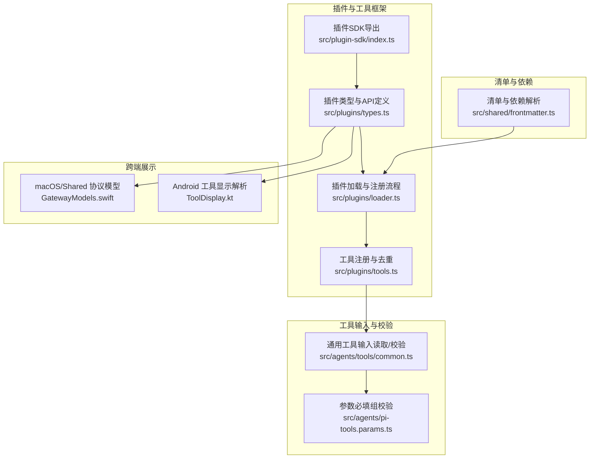
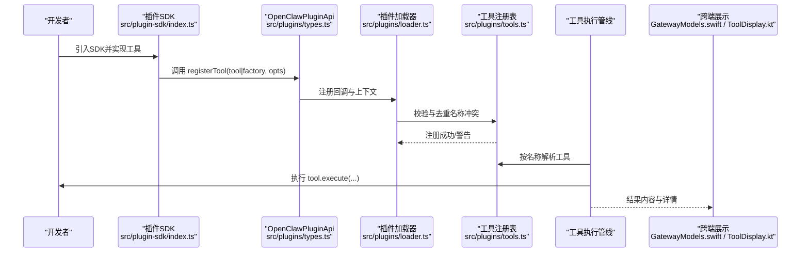
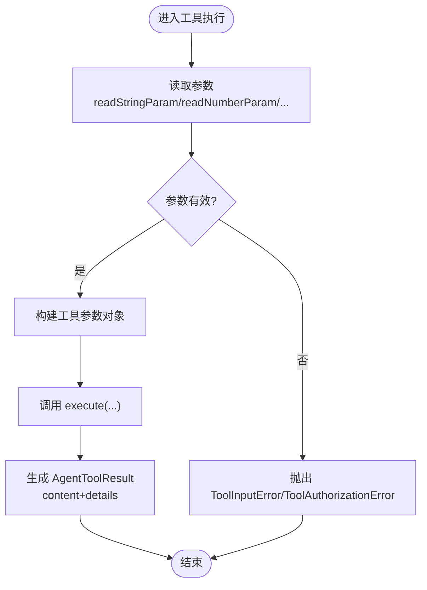
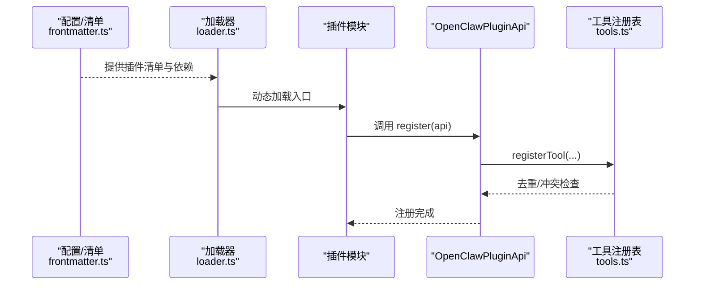
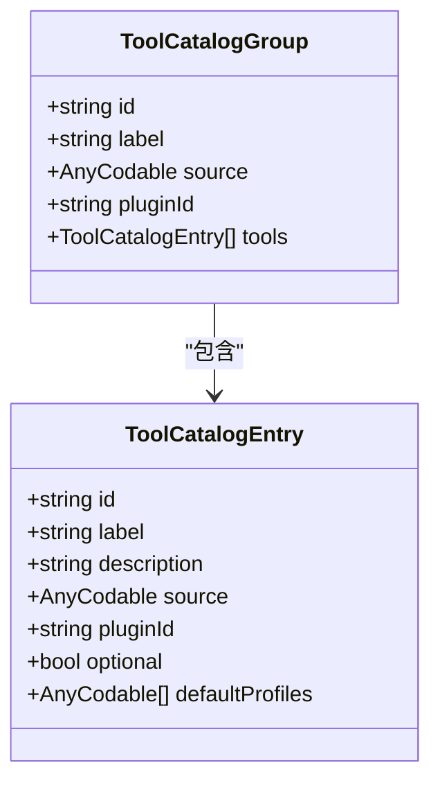
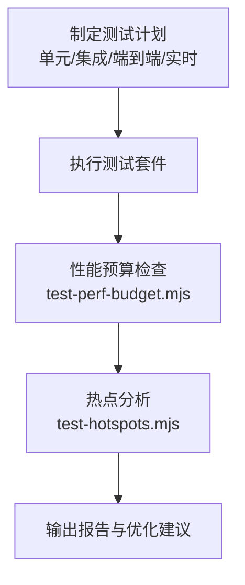
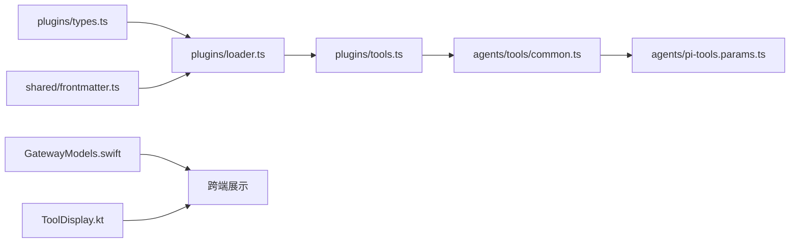

# 自定义工具开发

## 目录
1. [简介](#简介)
2. [项目结构](#项目结构)
3. [核心组件](#核心组件)
4. [架构总览](#架构总览)
5. [详细组件分析](#详细组件分析)
6. [依赖关系分析](#依赖关系分析)
7. [性能考量](#性能考量)
8. [故障排查指南](#故障排查指南)
9. [结论](#结论)
10. [附录](#附录)

## 简介
本指南面向在 OpenClaw 平台上开发“自定义工具”的工程师与技术作者，系统讲解工具开发框架、接口定义、参数校验与返回值规范、工具注册流程（含清单配置、元数据与依赖声明）、最佳实践（错误处理、异步与资源管理）、测试策略（单元/集成/性能），并提供从简单文件操作到复杂第三方服务集成的完整开发示例路径。文档同时覆盖工具在多端（macOS、Android、浏览器扩展）的展示与交互，以及发布与分发建议。

## 项目结构
OpenClaw 的工具生态由“插件 SDK”“插件加载器”“工具注册与冲突消解”“工具执行与结果处理”“跨端展示与交互”等模块构成。下图给出与“自定义工具开发”直接相关的核心子系统与文件映射：

图表来源
- [src/plugin-sdk/index.ts](file://src/plugin-sdk/index.ts#L1-L800)
- [src/plugins/types.ts](file://src/plugins/types.ts#L263-L306)
- [src/plugins/loader.ts](file://src/plugins/loader.ts#L447-L820)
- [src/plugins/tools.ts](file://src/plugins/tools.ts#L112-L139)
- [src/agents/tools/common.ts](file://src/agents/tools/common.ts#L74-L228)
- [src/agents/pi-tools.params.ts](file://src/agents/pi-tools.params.ts#L168-L204)
- [src/shared/frontmatter.ts](file://src/shared/frontmatter.ts#L43-L85)
- [apps/macos/Sources/OpenClawProtocol/GatewayModels.swift](file://apps/macos/Sources/OpenClawProtocol/GatewayModels.swift#L2456-L2513)
- [apps/shared/OpenClawKit/Sources/OpenClawProtocol/GatewayModels.swift](file://apps/shared/OpenClawKit/Sources/OpenClawProtocol/GatewayModels.swift#L2456-L2513)
- [apps/android/app/src/main/java/ai/openclaw/app/tools/ToolDisplay.kt](file://apps/android/app/src/main/java/ai/openclaw/app/tools/ToolDisplay.kt#L54-L91)

章节来源
- [src/plugin-sdk/index.ts](file://src/plugin-sdk/index.ts#L1-L800)
- [src/plugins/types.ts](file://src/plugins/types.ts#L263-L306)
- [src/plugins/loader.ts](file://src/plugins/loader.ts#L447-L820)
- [src/plugins/tools.ts](file://src/plugins/tools.ts#L112-L139)
- [src/agents/tools/common.ts](file://src/agents/tools/common.ts#L74-L228)
- [src/agents/pi-tools.params.ts](file://src/agents/pi-tools.params.ts#L168-L204)
- [src/shared/frontmatter.ts](file://src/shared/frontmatter.ts#L43-L85)
- [apps/macos/Sources/OpenClawProtocol/GatewayModels.swift](file://apps/macos/Sources/OpenClawProtocol/GatewayModels.swift#L2456-L2513)
- [apps/shared/OpenClawKit/Sources/OpenClawProtocol/GatewayModels.swift](file://apps/shared/OpenClawKit/Sources/OpenClawProtocol/GatewayModels.swift#L2456-L2513)
- [apps/android/app/src/main/java/ai/openclaw/app/tools/ToolDisplay.kt](file://apps/android/app/src/main/java/ai/openclaw/app/tools/ToolDisplay.kt#L54-L91)

## 核心组件
- 插件 API 与工具接口
  - OpenClawPluginApi 提供 registerTool、registerHook、registerHttpRoute、registerCommand 等能力，是工具注册与生命周期钩子的统一入口。
  - AnyAgentTool 定义了工具的标准结构（name、label、description、parameters、execute 等），并支持 ownerOnly 等安全标记。
- 工具参数读取与校验
  - 提供 readStringParam、readNumberParam、readStringArrayParam、readReactionParams 等读取函数，支持必填、trim、allowEmpty、integer 等选项。
  - assertRequiredParams 支持“任选其一”的必填组校验，便于复杂参数组合场景。
- 工具注册与冲突消解
  - 插件加载器负责扫描、校验、实例化插件，并在注册阶段进行名称冲突检测与诊断记录。
  - 工具注册时对重复名称进行拦截，避免覆盖与不可预期行为。
- 清单与依赖声明
  - frontmatter 解析工具/插件清单中的元数据与依赖（bins、env、config 等），用于安装前的环境与权限检查。
- 跨端展示与交互
  - macOS/Shared 的 GatewayModels.swift 定义工具目录与分类模型，支撑前端渲染与工具检索。
  - Android 的 ToolDisplay.kt 将工具名与参数映射为 UI 层可读的摘要与详情行，提升用户感知。

章节来源
- [src/plugins/types.ts](file://src/plugins/types.ts#L263-L306)
- [src/agents/tools/common.ts](file://src/agents/tools/common.ts#L74-L228)
- [src/agents/pi-tools.params.ts](file://src/agents/pi-tools.params.ts#L168-L204)
- [src/plugins/loader.ts](file://src/plugins/loader.ts#L769-L820)
- [src/plugins/tools.ts](file://src/plugins/tools.ts#L112-L139)
- [src/shared/frontmatter.ts](file://src/shared/frontmatter.ts#L62-L85)
- [apps/macos/Sources/OpenClawProtocol/GatewayModels.swift](file://apps/macos/Sources/OpenClawProtocol/GatewayModels.swift#L2456-L2513)
- [apps/shared/OpenClawKit/Sources/OpenClawProtocol/GatewayModels.swift](file://apps/shared/OpenClawKit/Sources/OpenClawProtocol/GatewayModels.swift#L2456-L2513)
- [apps/android/app/src/main/java/ai/openclaw/app/tools/ToolDisplay.kt](file://apps/android/app/src/main/java/ai/openclaw/app/tools/ToolDisplay.kt#L54-L91)

## 架构总览
下图展示了“工具开发—注册—执行—结果呈现”的关键流程与模块交互：

图表来源
- [src/plugin-sdk/index.ts](file://src/plugin-sdk/index.ts#L263-L306)
- [src/plugins/types.ts](file://src/plugins/types.ts#L263-L306)
- [src/plugins/loader.ts](file://src/plugins/loader.ts#L769-L820)
- [src/plugins/tools.ts](file://src/plugins/tools.ts#L112-L139)

## 详细组件分析

### 组件A：工具接口与参数校验
- 工具接口
  - 工具需实现 name、label、description、parameters、execute 等字段；可通过 ownerOnly 限制仅所有者可触发。
  - 返回值应遵循 AgentToolResult 规范，content 支持 text/image 等块，details 作为结构化数据。
- 参数读取与校验
  - 字符串/数字/数组/反应动作等参数读取函数提供统一的必填、空值、类型转换与错误抛出。
  - 必填组校验支持“至少提供一组键中的一个”，适合多入口参数场景。
- 错误处理
  - ToolInputError/ToolAuthorizationError 提供明确的状态码与错误语义，便于上层统一捕获与反馈。

图表来源
- [src/agents/tools/common.ts](file://src/agents/tools/common.ts#L74-L228)
- [src/agents/pi-tools.params.ts](file://src/agents/pi-tools.params.ts#L168-L204)

章节来源
- [src/agents/tools/common.ts](file://src/agents/tools/common.ts#L74-L228)
- [src/agents/pi-tools.params.ts](file://src/agents/pi-tools.params.ts#L168-L204)

### 组件B：工具注册流程
- 清单与依赖
  - frontmatter 解析清单中的 requires（bin/env/config 等），用于安装前的环境与权限检查。
- 加载与校验
  - 插件加载器按配置扫描候选插件，校验入口、根目录边界、配置模式匹配等。
  - 对返回 Promise 的 register 行为发出“异步注册被忽略”的警告，确保同步注册的确定性。
- 注册与冲突消解
  - 工具注册阶段对重复名称进行拦截，记录诊断信息并跳过冲突项。
  - 记录工具所属插件与可选状态，便于后续策略控制。

图表来源
- [src/shared/frontmatter.ts](file://src/shared/frontmatter.ts#L62-L85)
- [src/plugins/loader.ts](file://src/plugins/loader.ts#L769-L820)
- [src/plugins/tools.ts](file://src/plugins/tools.ts#L112-L139)

章节来源
- [src/shared/frontmatter.ts](file://src/shared/frontmatter.ts#L62-L85)
- [src/plugins/loader.ts](file://src/plugins/loader.ts#L769-L820)
- [src/plugins/tools.ts](file://src/plugins/tools.ts#L112-L139)

### 组件C：跨端展示与交互
- macOS/Shared
  - ToolCatalogEntry/ToolCatalogGroup 等模型承载工具目录与分组信息，支持 label、description、source、pluginId、defaultProfiles 等字段。
- Android
  - ToolDisplayRegistry 将工具名与参数映射为 UI 友好的摘要与详情行，支持动作级细节键与回退规则。

图表来源
- [apps/macos/Sources/OpenClawProtocol/GatewayModels.swift](file://apps/macos/Sources/OpenClawProtocol/GatewayModels.swift#L2456-L2513)
- [apps/shared/OpenClawKit/Sources/OpenClawProtocol/GatewayModels.swift](file://apps/shared/OpenClawKit/Sources/OpenClawProtocol/GatewayModels.swift#L2456-L2513)

章节来源
- [apps/macos/Sources/OpenClawProtocol/GatewayModels.swift](file://apps/macos/Sources/OpenClawProtocol/GatewayModels.swift#L2456-L2513)
- [apps/shared/OpenClawKit/Sources/OpenClawProtocol/GatewayModels.swift](file://apps/shared/OpenClawKit/Sources/OpenClawProtocol/GatewayModels.swift#L2456-L2513)
- [apps/android/app/src/main/java/ai/openclaw/app/tools/ToolDisplay.kt](file://apps/android/app/src/main/java/ai/openclaw/app/tools/ToolDisplay.kt#L54-L91)

### 组件D：测试与性能保障
- 测试策略
  - 单元/集成测试：默认运行，覆盖工具输入读取、参数校验、工具注册与冲突消解等。
  - 端到端测试：多实例网关行为与网络操作验证。
  - 实时测试：真实提供商与真实模型，注意配额与速率限制。
- 性能预算
  - test-perf-budget 通过环境变量设定最大墙钟时间、基线预算与回归阈值，保证测试稳定性。
  - test-hotspots 输出耗时 Top 文件，辅助定位热点测试用例。

图表来源
- [docs/help/testing.md](file://docs/help/testing.md#L42-L78)
- [docs/zh-CN/help/testing.md](file://docs/zh-CN/help/testing.md#L49-L90)
- [scripts/test-perf-budget.mjs](file://scripts/test-perf-budget.mjs#L1-L127)
- [scripts/test-hotspots.mjs](file://scripts/test-hotspots.mjs#L54-L83)

章节来源
- [docs/help/testing.md](file://docs/help/testing.md#L42-L78)
- [docs/zh-CN/help/testing.md](file://docs/zh-CN/help/testing.md#L49-L90)
- [scripts/test-perf-budget.mjs](file://scripts/test-perf-budget.mjs#L1-L127)
- [scripts/test-hotspots.mjs](file://scripts/test-hotspots.mjs#L54-L83)

### 组件E：开发示例（从简单到复杂）
- 简单文件操作工具
  - 使用 read/write/edit 等编码工具作为参考，理解参数别名（如 file_path）与返回值结构。
  - 示例路径参考：[src/agents/pi-tools.create-openclaw-coding-tools.adds-claude-style-aliases-schemas-without-dropping-f.test.ts](file://src/agents/pi-tools.create-openclaw-coding-tools.adds-claude-style-aliases-schemas-without-dropping-f.test.ts#L1-L40)
- 复杂第三方服务集成工具
  - 飞书云盘工具（drive）：基于 registerTool 工厂模式，按 action 分派具体实现，统一错误处理与结果封装。
    - 示例路径参考：[extensions/feishu/src/drive.ts](file://extensions/feishu/src/drive.ts#L186-L228)
  - 飞书文档工具（docx）：支持多种 action（read/write/append/insert/create 等），参数校验与媒体大小限制结合。
    - 示例路径参考：[extensions/feishu/src/docx.ts](file://extensions/feishu/src/docx.ts#L1260-L1289)
  - 工具工厂测试夹具：用于在测试环境中解析与验证工具注册。
    - 示例路径参考：[extensions/feishu/src/tool-factory-test-harness.ts](file://extensions/feishu/src/tool-factory-test-harness.ts#L37-L76)

章节来源
- [extensions/feishu/src/drive.ts](file://extensions/feishu/src/drive.ts#L186-L228)
- [extensions/feishu/src/docx.ts](file://extensions/feishu/src/docx.ts#L1260-L1289)
- [extensions/feishu/src/tool-factory-test-harness.ts](file://extensions/feishu/src/tool-factory-test-harness.ts#L37-L76)
- [src/agents/pi-tools.create-openclaw-coding-tools.adds-claude-style-aliases-schemas-without-dropping-f.test.ts](file://src/agents/pi-tools.create-openclaw-coding-tools.adds-claude-style-aliases-schemas-without-dropping-f.test.ts#L1-L40)

## 依赖关系分析
- 插件 SDK 导出统一 API，类型定义集中于 plugins/types.ts，工具注册与冲突消解位于 plugins/tools.ts。
- 工具输入读取与校验位于 agents/tools/common.ts 与 agents/pi-tools.params.ts，形成“输入—校验—执行”的闭环。
- frontmatter 提供清单与依赖解析，loader 负责加载与校验，最终注册到工具注册表。
- 跨端展示依赖 GatewayModels.swift 与 Android ToolDisplay.kt，将工具元数据与执行结果映射为 UI。

图表来源
- [src/plugins/types.ts](file://src/plugins/types.ts#L263-L306)
- [src/plugins/loader.ts](file://src/plugins/loader.ts#L447-L820)
- [src/plugins/tools.ts](file://src/plugins/tools.ts#L112-L139)
- [src/agents/tools/common.ts](file://src/agents/tools/common.ts#L74-L228)
- [src/agents/pi-tools.params.ts](file://src/agents/pi-tools.params.ts#L168-L204)
- [src/shared/frontmatter.ts](file://src/shared/frontmatter.ts#L62-L85)
- [apps/macos/Sources/OpenClawProtocol/GatewayModels.swift](file://apps/macos/Sources/OpenClawProtocol/GatewayModels.swift#L2456-L2513)
- [apps/android/app/src/main/java/ai/openclaw/app/tools/ToolDisplay.kt](file://apps/android/app/src/main/java/ai/openclaw/app/tools/ToolDisplay.kt#L54-L91)

章节来源
- [src/plugins/types.ts](file://src/plugins/types.ts#L263-L306)
- [src/plugins/loader.ts](file://src/plugins/loader.ts#L447-L820)
- [src/plugins/tools.ts](file://src/plugins/tools.ts#L112-L139)
- [src/agents/tools/common.ts](file://src/agents/tools/common.ts#L74-L228)
- [src/agents/pi-tools.params.ts](file://src/agents/pi-tools.params.ts#L168-L204)
- [src/shared/frontmatter.ts](file://src/shared/frontmatter.ts#L62-L85)
- [apps/macos/Sources/OpenClawProtocol/GatewayModels.swift](file://apps/macos/Sources/OpenClawProtocol/GatewayModels.swift#L2456-L2513)
- [apps/android/app/src/main/java/ai/openclaw/app/tools/ToolDisplay.kt](file://apps/android/app/src/main/java/ai/openclaw/app/tools/ToolDisplay.kt#L54-L91)

## 性能考量
- 测试性能预算
  - 使用 test-perf-budget.mjs 设置最大墙钟时间、基线预算与回归阈值，避免测试用例引入性能退化。
- 热点定位
  - 使用 test-hotspots.mjs 输出耗时 Top 文件，识别长尾测试用例并针对性优化。
- 工具执行
  - 合理拆分异步任务，避免阻塞主线程；对图片/媒体类工具，优先采用流式处理与缓存策略。

[本节为通用指导，无需列出章节来源]

## 故障排查指南
- 工具注册失败
  - 检查插件是否正确导出 register/activate，并确保未返回 Promise（否则会被忽略）。
  - 查看诊断日志中关于“缺少 register/activate 导出”“插件入口路径越界”等提示。
- 名称冲突
  - 工具名冲突将被拦截并记录诊断信息，需调整工具名或移除重复注册。
- 参数错误
  - 使用 ToolInputError/ToolAuthorizationError 明确错误类型与状态码；结合参数读取函数的必填/空值/类型转换选项进行定位。
- 跨端展示异常
  - macOS/Shared 的工具目录模型与 Android 的显示解析逻辑分别检查 label/description/source/pluginId 等字段是否正确填充。

章节来源
- [src/plugins/loader.ts](file://src/plugins/loader.ts#L769-L820)
- [src/plugins/tools.ts](file://src/plugins/tools.ts#L112-L139)
- [src/agents/tools/common.ts](file://src/agents/tools/common.ts#L26-L42)

## 结论
OpenClaw 的工具开发体系以“插件 API + 类型约束 + 参数校验 + 注册去重 + 跨端展示”为核心，辅以完善的测试与性能保障机制。开发者可从简单文件操作入手，逐步过渡到第三方服务集成，并通过统一的清单与依赖声明、严格的错误处理与资源管理，构建稳定、可维护、可扩展的自定义工具。

[本节为总结性内容，无需列出章节来源]

## 附录
- 技能开发入门（Workspace Skills）
  - 参考文档：[docs/tools/creating-skills.md](file://docs/tools/creating-skills.md#L1-L59)
- 测试与性能
  - 参考文档：[docs/help/testing.md](file://docs/help/testing.md#L42-L78)、[docs/zh-CN/help/testing.md](file://docs/zh-CN/help/testing.md#L49-L90)
  - 性能脚本：[scripts/test-perf-budget.mjs](file://scripts/test-perf-budget.mjs#L1-L127)、[scripts/test-hotspots.mjs](file://scripts/test-hotspots.mjs#L54-L83)