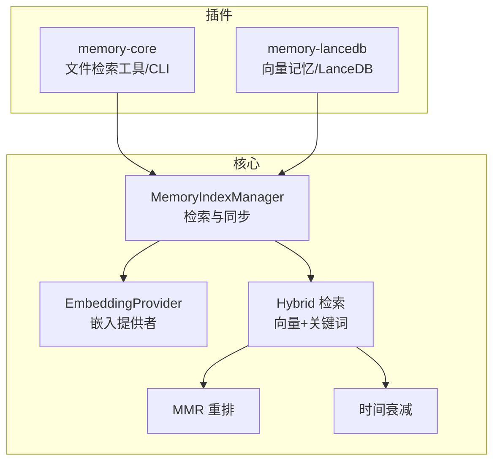
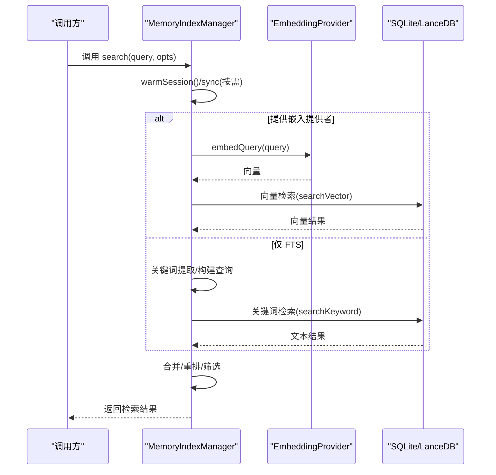
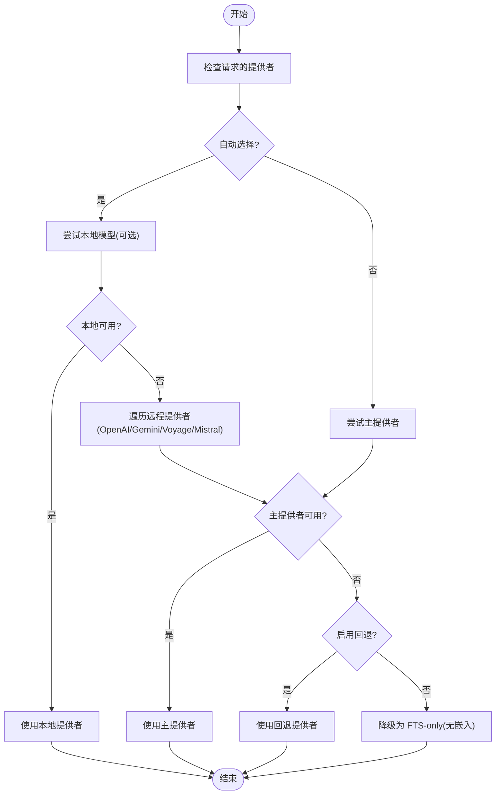
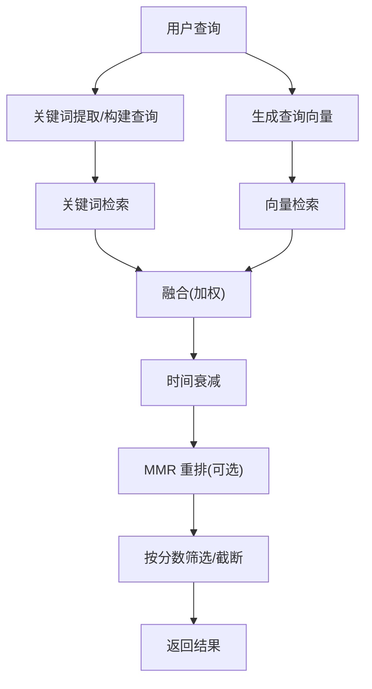
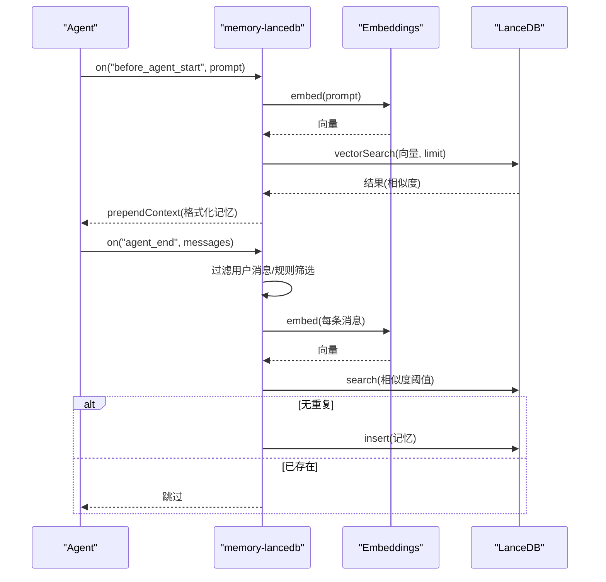
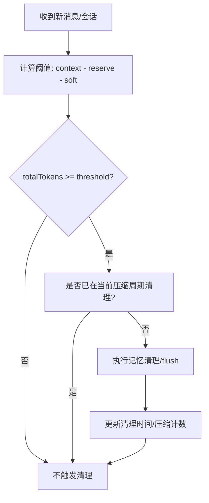
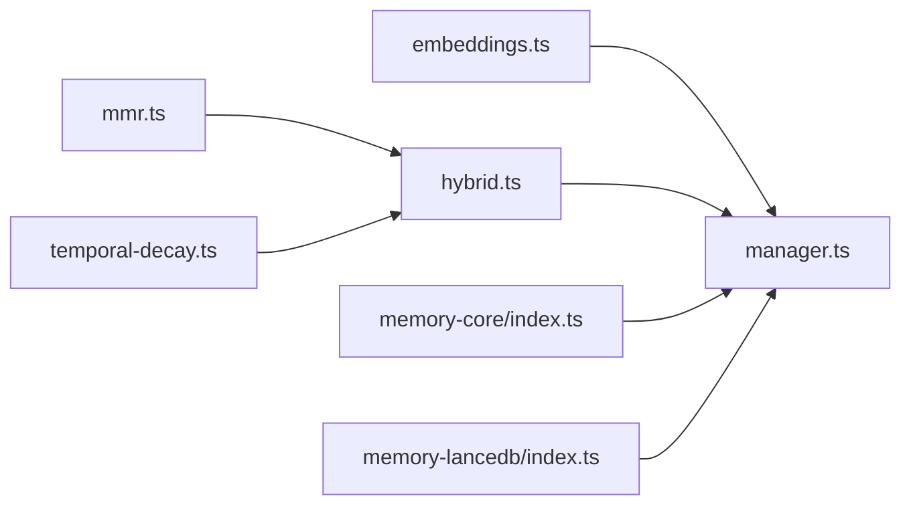

# 记忆管理系统


## 目录
1. [简介](#简介)
2. [项目结构](#项目结构)
3. [核心组件](#核心组件)
4. [架构总览](#架构总览)
5. [详细组件分析](#详细组件分析)
6. [依赖关系分析](#依赖关系分析)
7. [性能考虑](#性能考虑)
8. [故障排除指南](#故障排除指南)
9. [结论](#结论)
10. [附录](#附录)

## 简介
本文件为 OpenClaw 记忆管理系统的技术文档，覆盖记忆存储架构（内存缓存、持久化存储、分布式存储策略）、记忆检索机制（向量搜索、语义匹配、相关性排序算法）、记忆压缩与清理策略（会话整理、历史清理、存储优化）、记忆权限控制（访问限制、隐私保护、数据安全）、性能优化技巧（索引策略、查询优化、缓存管理），以及监控指标与故障排除指南。系统支持两种主要的记忆后端：内置 SQLite 文件搜索（核心插件）与基于 LanceDB 的向量记忆（LanceDB 插件），并提供混合检索与多种重排策略以提升相关性。

## 项目结构
OpenClaw 的记忆系统由“核心内存管理器”和“插件式存储后端”组成：
- 核心内存管理器：负责统一的检索接口、嵌入提供者选择、SQLite 数据库 schema、增量同步、缓存与只读恢复等。
- 插件后端：
  - 内置核心插件：提供文件级检索工具与 CLI 命令，面向本地 Markdown 文档。
  - LanceDB 插件：提供长时记忆的向量存储、自动召回与捕获、工具与 CLI 命令。



图表来源
- [src/memory/manager.ts](file://src/memory/manager.ts#L61-L238)
- [src/memory/hybrid.ts](file://src/memory/hybrid.ts#L57-L155)
- [extensions/memory-core/index.ts](file://extensions/memory-core/index.ts#L4-L39)
- [extensions/memory-lancedb/index.ts](file://extensions/memory-lancedb/index.ts#L292-L679)

章节来源
- [src/memory/index.ts](file://src/memory/index.ts#L1-L12)
- [src/memory/manager.ts](file://src/memory/manager.ts#L61-L238)
- [extensions/memory-core/index.ts](file://extensions/memory-core/index.ts#L4-L39)
- [extensions/memory-lancedb/index.ts](file://extensions/memory-lancedb/index.ts#L292-L679)

## 核心组件
- MemoryIndexManager：统一的记忆检索与同步入口，封装嵌入提供者、SQLite schema、增量同步、只读数据库恢复、缓存与批处理失败控制、源过滤与状态报告。
- EmbeddingProvider：抽象嵌入提供者接口，支持远程（OpenAI、Gemini、Voyage、Mistral）与本地（node-llama-cpp）模型，并具备自动选择与回退能力。
- Hybrid 检索：向量检索与关键词检索（FTS）融合，支持权重合并、MMR 多样性重排、时间衰减。
- 查询扩展：在无嵌入提供者时，从对话式查询中提取关键词，提升 FTS 匹配效果。
- 插件后端：
  - memory-core：注册内存搜索与获取工具、CLI 命令。
  - memory-lancedb：向量记忆存储、自动召回/捕获、工具与 CLI 命令。

章节来源
- [src/memory/manager.ts](file://src/memory/manager.ts#L61-L238)
- [src/memory/embeddings.ts](file://src/memory/embeddings.ts#L166-L286)
- [src/memory/hybrid.ts](file://src/memory/hybrid.ts#L57-L155)
- [src/memory/query-expansion.ts](file://src/memory/query-expansion.ts#L735-L780)
- [extensions/memory-core/index.ts](file://extensions/memory-core/index.ts#L4-L39)
- [extensions/memory-lancedb/index.ts](file://extensions/memory-lancedb/index.ts#L292-L679)

## 架构总览
记忆系统采用“核心管理器 + 插件后端”的分层设计：
- 核心管理器负责检索流程编排、嵌入提供者生命周期、SQLite schema 与增量同步。
- 插件后端提供具体存储实现：核心插件使用 SQLite + FTS；LanceDB 插件使用 LanceDB + 向量索引。
- 混合检索在可用时结合向量相似度与关键词匹配，通过权重融合与重排策略提升结果质量。



图表来源
- [src/memory/manager.ts](file://src/memory/manager.ts#L256-L364)
- [src/memory/manager-search.ts](file://src/memory/manager-search.ts#L20-L94)
- [src/memory/hybrid.ts](file://src/memory/hybrid.ts#L57-L155)

## 详细组件分析

### 核心检索与同步（MemoryIndexManager）
- 统一检索接口：支持最大结果数、最小分数、会话键过滤；按需触发 warmSession/sync。
- 嵌入提供者：支持自动选择与回退，记录回退原因；提供可用性探测。
- SQLite schema：维护 files/chunks/向量表/FTS 表/嵌入缓存表；支持源过滤与增量同步。
- 只读数据库恢复：检测只读错误并重建连接与元信息。
- 批处理与失败控制：批量嵌入的并发、轮询间隔、超时与失败计数。
- 状态报告：返回后端、文件/块数量、缓存、FTS/向量可用性、批处理统计、只读恢复统计等。

```mermaid
classDiagram
class MemoryIndexManager {
+search(query, opts) MemorySearchResult[]
+readFile(params) {text,path}
+sync(params) void
+probeEmbeddingAvailability() MemoryEmbeddingProbeResult
+probeVectorAvailability() boolean
+status() MemoryProviderStatus
+close() void
-ensureVectorReady(dims) Promise<bool>
-mergeHybridResults(...)
}
class EmbeddingProvider {
+id : string
+model : string
+embedQuery(text) number[]
+embedBatch(texts) number[][]
}
MemoryIndexManager --> EmbeddingProvider : "使用"
```

图表来源
- [src/memory/manager.ts](file://src/memory/manager.ts#L61-L238)
- [src/memory/types.ts](file://src/memory/types.ts#L61-L80)
- [src/memory/embeddings.ts](file://src/memory/embeddings.ts#L32-L60)

章节来源
- [src/memory/manager.ts](file://src/memory/manager.ts#L256-L364)
- [src/memory/manager.ts](file://src/memory/manager.ts#L451-L551)
- [src/memory/manager.ts](file://src/memory/manager.ts#L626-L738)

### 嵌入提供者与向量可用性
- 支持远程与本地嵌入提供者，自动选择与回退策略，缺失密钥时降级为 FTS-only。
- 向量可用性探测：确保向量维度与扩展加载成功；失败时回退到纯文本检索。
- 本地模型：延迟加载 node-llama-cpp，初始化上下文与模型文件解析。



图表来源
- [src/memory/embeddings.ts](file://src/memory/embeddings.ts#L166-L286)
- [src/memory/manager.ts](file://src/memory/manager.ts#L740-L766)

章节来源
- [src/memory/embeddings.ts](file://src/memory/embeddings.ts#L166-L286)
- [src/memory/manager.ts](file://src/memory/manager.ts#L740-L766)

### 混合检索与相关性排序
- 向量检索：基于 cosine 距离或本地解析嵌入计算相似度。
- 关键词检索：构建 BM25 查询，支持多关键词 OR 组合。
- 结果融合：加权求和向量分数与文本分数，应用时间衰减与 MMR 多样性重排。
- 权重与阈值：支持向量权重、文本权重、MMR 参数、时间半衰期等配置。



图表来源
- [src/memory/hybrid.ts](file://src/memory/hybrid.ts#L57-L155)
- [src/memory/mmr.ts](file://src/memory/mmr.ts#L116-L183)
- [src/memory/temporal-decay.ts](file://src/memory/temporal-decay.ts#L121-L167)

章节来源
- [src/memory/hybrid.ts](file://src/memory/hybrid.ts#L57-L155)
- [src/memory/mmr.ts](file://src/memory/mmr.ts#L116-L183)
- [src/memory/temporal-decay.ts](file://src/memory/temporal-decay.ts#L121-L167)

### 查询扩展（FTS-only 模式）
- 在无嵌入提供者时，从对话式查询中抽取关键词，构建 OR 查询提升命中率。
- 支持多语言停用词集合与分词策略，过滤无效 token。

章节来源
- [src/memory/query-expansion.ts](file://src/memory/query-expansion.ts#L735-L780)

### LanceDB 长时记忆插件
- 存储：LanceDB 表，向量字段使用 L2 距离，转换为相似度分数。
- 检索：向量检索 + 最小分数过滤。
- 工具：memory_recall、memory_store、memory_forget。
- 生命周期钩子：before_agent_start 自动召回；agent_end 自动捕获。
- CLI：ltm list/search/stats。



图表来源
- [extensions/memory-lancedb/index.ts](file://extensions/memory-lancedb/index.ts#L546-L658)
- [extensions/memory-lancedb/index.ts](file://extensions/memory-lancedb/index.ts#L116-L140)

章节来源
- [extensions/memory-lancedb/index.ts](file://extensions/memory-lancedb/index.ts#L292-L679)
- [extensions/memory-lancedb/config.ts](file://extensions/memory-lancedb/config.ts#L5-L181)

### 内置核心插件
- 注册 memory_search 与 memory_get 工具，绑定运行时工具工厂。
- 注册 CLI memory 命令族，对接核心检索能力。

章节来源
- [extensions/memory-core/index.ts](file://extensions/memory-core/index.ts#L4-L39)

### 记忆压缩与清理策略
- 触发条件：当会话总 token 数超过阈值（上下文窗口-保留-软阈值）且未在同一压缩周期内执行过记忆清理时触发。
- 清理动作：更新会话元数据（记录清理时间与压缩计数），避免重复执行。
- 与会话管理集成：清理完成后递增压缩计数并持久化。



图表来源
- [src/auto-reply/reply/memory-flush.ts](file://src/auto-reply/reply/memory-flush.ts#L195-L228)
- [src/auto-reply/reply/agent-runner-memory.ts](file://src/auto-reply/reply/agent-runner-memory.ts#L529-L566)

章节来源
- [src/auto-reply/reply/memory-flush.ts](file://src/auto-reply/reply/memory-flush.ts#L195-L228)
- [src/auto-reply/reply/agent-runner-memory.ts](file://src/auto-reply/reply/agent-runner-memory.ts#L529-L566)

## 依赖关系分析
- 核心管理器依赖嵌入提供者与 SQLite；在无嵌入提供者时仅使用 FTS。
- 混合检索依赖向量检索与关键词检索模块，以及 MMR 与时间衰减模块。
- LanceDB 插件独立于核心管理器，但共享相同的工具与生命周期钩子约定。
- 内置核心插件通过运行时工具工厂注册搜索与获取工具。



图表来源
- [src/memory/embeddings.ts](file://src/memory/embeddings.ts#L166-L286)
- [src/memory/manager.ts](file://src/memory/manager.ts#L61-L238)
- [src/memory/hybrid.ts](file://src/memory/hybrid.ts#L57-L155)
- [src/memory/mmr.ts](file://src/memory/mmr.ts#L116-L183)
- [src/memory/temporal-decay.ts](file://src/memory/temporal-decay.ts#L121-L167)
- [extensions/memory-core/index.ts](file://extensions/memory-core/index.ts#L4-L39)
- [extensions/memory-lancedb/index.ts](file://extensions/memory-lancedb/index.ts#L292-L679)

章节来源
- [src/memory/manager.ts](file://src/memory/manager.ts#L61-L238)
- [src/memory/hybrid.ts](file://src/memory/hybrid.ts#L57-L155)

## 性能考虑
- 索引策略
  - 向量：确保向量维度一致，使用 cosine 距离；在可用时优先向量检索，否则回退 FTS。
  - 文本：FTS 使用 bm25 排序，建议对高相关性关键词进行 OR 组合。
- 查询优化
  - 合理设置候选数与最小分数，避免过度扫描。
  - 在混合检索中调整向量权重与文本权重，平衡相关性与多样性。
  - 启用 MMR 降低重复内容，启用时间衰减使近期内容更相关。
- 缓存管理
  - 嵌入缓存表用于减少重复嵌入计算；注意缓存上限与失效策略。
  - 只读数据库错误时自动重建连接与元信息，减少长时间阻塞。
- 批处理
  - 控制批处理并发、轮询间隔与超时，避免资源争用与超时失败。

章节来源
- [src/memory/manager.ts](file://src/memory/manager.ts#L256-L364)
- [src/memory/hybrid.ts](file://src/memory/hybrid.ts#L57-L155)
- [src/memory/mmr.ts](file://src/memory/mmr.ts#L116-L183)
- [src/memory/temporal-decay.ts](file://src/memory/temporal-decay.ts#L121-L167)

## 故障排除指南
- 嵌入提供者不可用
  - 现象：返回 FTS-only 模式或探测失败。
  - 排查：检查 API 密钥、网络连通性、回退配置；查看 providerUnavailableReason。
- 只读数据库
  - 现象：SQLite 报错 SQLITE_READONLY。
  - 处理：系统自动检测并重建连接；关注 readonlyRecovery 统计。
- 向量不可用
  - 现象：向量维度不匹配或扩展加载失败。
  - 处理：确认模型维度与扩展路径；回退到 FTS-only 或修复本地模型。
- 混合检索结果重复
  - 处理：启用 MMR 并调整 lambda；或提高去重阈值。
- 记忆清理未生效
  - 排查：确认阈值计算、压缩计数与清理元数据是否正确写入。

章节来源
- [src/memory/manager.ts](file://src/memory/manager.ts#L468-L551)
- [src/memory/manager.ts](file://src/memory/manager.ts#L740-L766)
- [src/auto-reply/reply/memory-flush.ts](file://src/auto-reply/reply/memory-flush.ts#L195-L228)
- [src/auto-reply/reply/agent-runner-memory.ts](file://src/auto-reply/reply/agent-runner-memory.ts#L529-L566)

## 结论
OpenClaw 记忆系统通过核心管理器与插件后端的解耦设计，实现了灵活的存储与检索能力。在有嵌入提供者时，系统采用混合检索与多样性和时间感知的重排策略；在无嵌入提供者时，通过关键词扩展与 bm25 排序保证检索效果。配合批处理、缓存与只读恢复机制，系统在性能与稳定性方面具备良好表现。LanceDB 插件进一步增强了长时记忆的向量检索能力，并通过生命周期钩子实现自动召回与捕获。建议根据部署环境选择合适的嵌入提供者与重排策略，合理配置阈值与缓存参数，以获得最佳体验。

## 附录
- 监控指标建议
  - 后端状态：files/chunks、缓存条目数、FTS/向量可用性、批处理失败次数。
  - 搜索统计：平均响应时间、向量/文本命中率、MMR 重排比例。
  - 只读恢复：尝试次数、成功/失败次数、最后错误。
- 常见问题
  - 为什么某些查询在 FTS-only 模式下没有结果？检查关键词提取与停用词过滤。
  - 如何切换嵌入提供者？修改配置中的 provider/fallback 字段并重启服务。
  - 如何禁用 MMR 或时间衰减？在混合检索配置中关闭对应开关。

章节来源
- [src/memory/manager.ts](file://src/memory/manager.ts#L626-L738)
- [src/commands/status.scan.ts](file://src/commands/status.scan.ts#L157-L180)