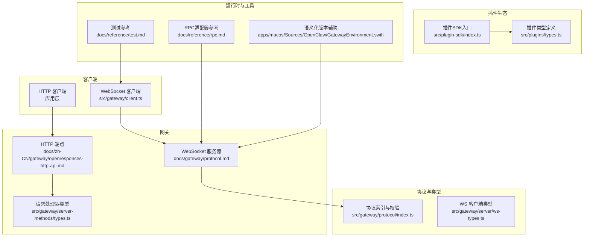
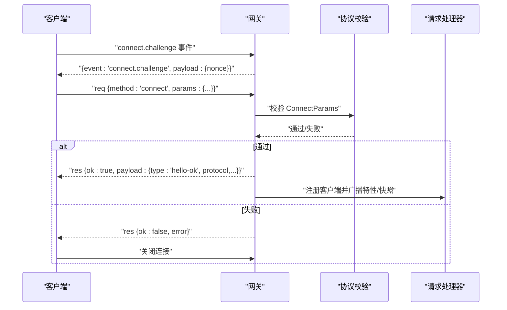
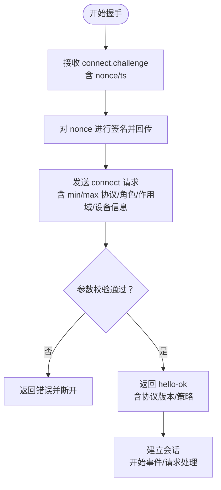
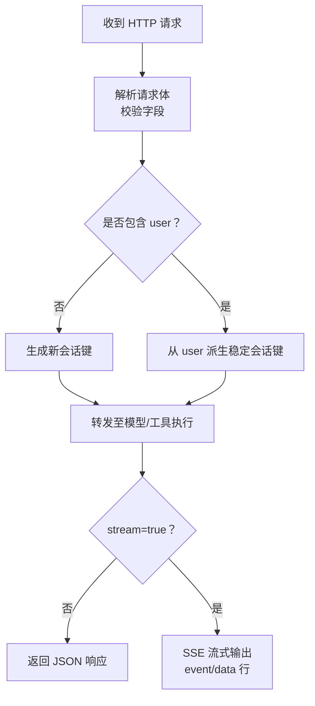
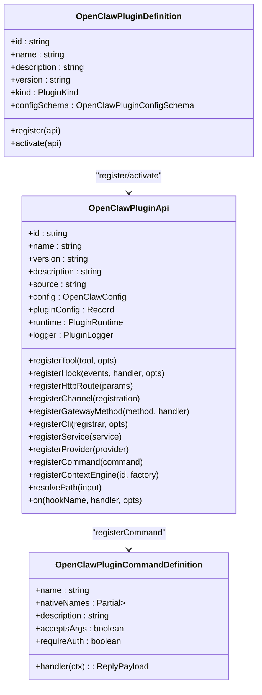
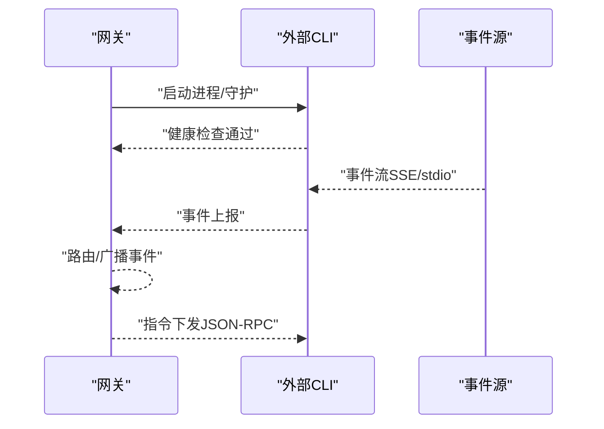
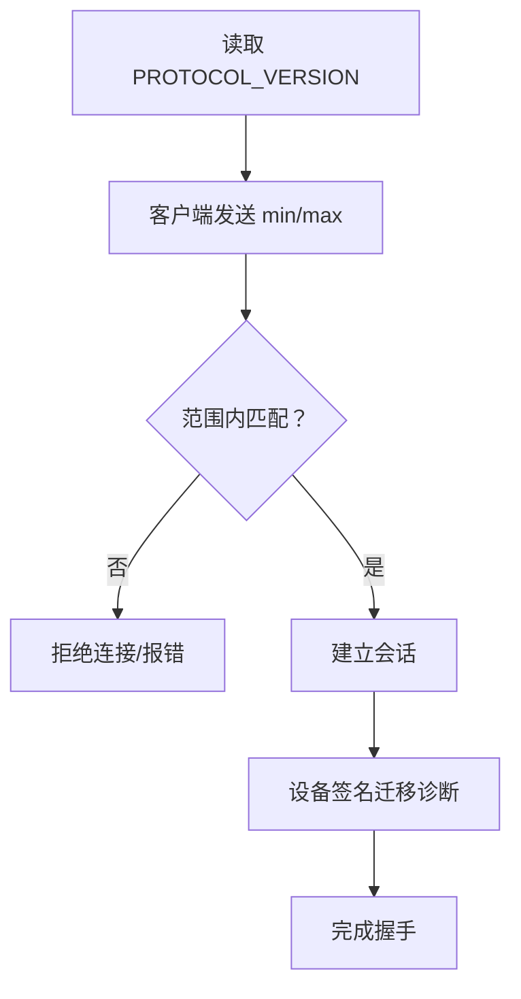
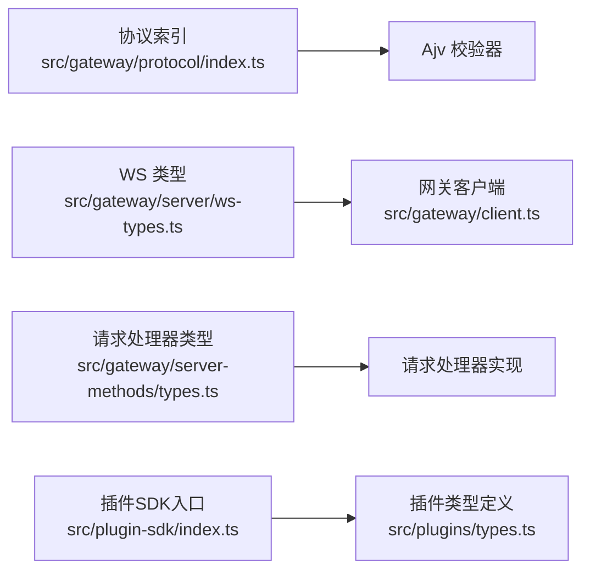

# API参考

## 目录
1. [简介](#简介)
2. [项目结构](#项目结构)
3. [核心组件](#核心组件)
4. [架构总览](#架构总览)
5. [详细组件分析](#详细组件分析)
6. [依赖关系分析](#依赖关系分析)
7. [性能考量](#性能考量)
8. [故障排查指南](#故障排查指南)
9. [结论](#结论)
10. [附录](#附录)

## 简介
本参考文档面向OpenClaw API系统，覆盖以下主题：
- WebSocket协议规范：连接建立、握手、帧格式、事件与心跳、实时交互与序列化。
- REST API端点：HTTP方法、URL模式、请求/响应格式、认证与错误处理。
- 插件SDK API：接口定义、类型声明、注册机制、命令与服务扩展。
- RPC适配器：外部CLI集成模式、适配器指南与生命周期管理。
- 版本管理与向后兼容：协议版本、兼容性检查与迁移。
- 客户端实现指南与最佳实践：连接策略、鉴权、重连与可观测性。
- API测试工具与调试方法：本地测试、覆盖率、端到端与基准脚本。

## 项目结构
OpenClaw在多语言与多平台下提供统一的控制平面与节点传输层。核心由“网关协议”“HTTP端点”“插件SDK”“RPC适配器”构成，并通过文档与测试保障一致性与可维护性。

图表来源
- [docs/gateway/protocol.md](file://docs/gateway/protocol.md#L1-L261)
- [src/gateway/protocol/index.ts](file://src/gateway/protocol/index.ts#L1-L673)
- [src/gateway/server-methods/types.ts](file://src/gateway/server-methods/types.ts#L1-L113)
- [src/plugin-sdk/index.ts](file://src/plugin-sdk/index.ts#L1-L812)
- [src/plugins/types.ts](file://src/plugins/types.ts#L1-L893)
- [docs/reference/rpc.md](file://docs/reference/rpc.md#L1-L44)
- [docs/reference/test.md](file://docs/reference/test.md#L1-L89)
- [apps/macos/Sources/OpenClaw/GatewayEnvironment.swift](file://apps/macos/Sources/OpenClaw/GatewayEnvironment.swift#L1-L38)

章节来源
- [docs/gateway/protocol.md](file://docs/gateway/protocol.md#L1-L261)
- [src/gateway/protocol/index.ts](file://src/gateway/protocol/index.ts#L1-L673)
- [src/gateway/server-methods/types.ts](file://src/gateway/server-methods/types.ts#L1-L113)
- [src/plugin-sdk/index.ts](file://src/plugin-sdk/index.ts#L1-L812)
- [src/plugins/types.ts](file://src/plugins/types.ts#L1-L893)
- [docs/reference/rpc.md](file://docs/reference/rpc.md#L1-L44)
- [docs/reference/test.md](file://docs/reference/test.md#L1-L89)
- [apps/macos/Sources/OpenClaw/GatewayEnvironment.swift](file://apps/macos/Sources/OpenClaw/GatewayEnvironment.swift#L1-L38)

## 核心组件
- 网关协议与帧模型：定义握手、请求/响应/事件帧、版本号与校验逻辑，确保跨客户端一致的行为与安全。
- WebSocket客户端与服务器：负责连接、挑战/应答、事件分发、心跳与序列号跟踪。
- HTTP端点：提供OpenResponses兼容的无状态请求模型、SSE流式返回与配置化的文件/图像限制。
- 插件SDK：统一的插件注册、命令、HTTP路由、服务与钩子体系，支撑生态扩展。
- RPC适配器：两类外部CLI集成模式（HTTP守护进程与stdio子进程），提供稳定生命周期与可观测性。
- 版本与兼容：协议版本常量、SemVer解析与迁移诊断，保障升级路径清晰。

章节来源
- [src/gateway/protocol/index.ts](file://src/gateway/protocol/index.ts#L1-L673)
- [src/gateway/server/ws-types.ts](file://src/gateway/server/ws-types.ts#L1-L14)
- [src/gateway/client.ts](file://src/gateway/client.ts#L360-L395)
- [docs/zh-CN/gateway/openresponses-http-api.md](file://docs/zh-CN/gateway/openresponses-http-api.md#L53-L257)
- [src/gateway/server-methods/types.ts](file://src/gateway/server-methods/types.ts#L1-L113)
- [src/plugin-sdk/index.ts](file://src/plugin-sdk/index.ts#L1-L812)
- [src/plugins/types.ts](file://src/plugins/types.ts#L1-L893)
- [docs/reference/rpc.md](file://docs/reference/rpc.md#L1-L44)
- [apps/macos/Sources/OpenClaw/GatewayEnvironment.swift](file://apps/macos/Sources/OpenClaw/GatewayEnvironment.swift#L1-L38)

## 架构总览
OpenClaw采用“单一会控+节点传输”的WebSocket协议，所有客户端（CLI、Web UI、移动端、节点）均通过该通道进行控制与数据传输；同时提供HTTP端点用于无状态调用与流式输出。

图表来源
- [docs/gateway/protocol.md](file://docs/gateway/protocol.md#L22-L90)
- [src/gateway/protocol/index.ts](file://src/gateway/protocol/index.ts#L253-L458)
- [src/gateway/server-methods/types.ts](file://src/gateway/server-methods/types.ts#L93-L113)

章节来源
- [docs/gateway/protocol.md](file://docs/gateway/protocol.md#L1-L261)
- [src/gateway/protocol/index.ts](file://src/gateway/protocol/index.ts#L253-L458)
- [src/gateway/server-methods/types.ts](file://src/gateway/server-methods/types.ts#L93-L113)

## 详细组件分析

### WebSocket协议规范
- 连接与握手
  - 首帧必须为“connect”请求；服务端先下发“connect.challenge”事件，包含随机nonce与时间戳。
  - 客户端需对服务端nonce签名并回传，同时声明最小/最大协议版本、客户端信息、角色与作用域、设备身份与权限等。
  - 成功后返回“hello-ok”，包含协议版本与策略（如心跳间隔）。
- 帧格式
  - 请求：req（id, method, params）
  - 响应：res（id, ok, payload|error）
  - 事件：event（event, payload, 可选seq与stateVersion）
- 角色与作用域
  - operator：控制面客户端；node：能力宿主（相机/画布/屏幕/系统运行）。
  - operator常见作用域：读取、写入、管理、审批、配对。
- 身份与配对
  - 客户端需携带设备身份与签名，服务端签名校验与过期控制。
  - 设备令牌按角色与作用域颁发，支持轮换与吊销。
- 实时交互
  - 事件包含序列号seq与状态版本，客户端可检测丢包与重放。
  - 心跳事件tick用于保活与健康度量。

图表来源
- [docs/gateway/protocol.md](file://docs/gateway/protocol.md#L22-L90)
- [src/gateway/client.ts](file://src/gateway/client.ts#L360-L395)

章节来源
- [docs/gateway/protocol.md](file://docs/gateway/protocol.md#L1-L261)
- [src/gateway/client.ts](file://src/gateway/client.ts#L360-L395)

### REST API端点（OpenResponses兼容）
- 端点启用与禁用
  - 通过配置项开启/关闭HTTP端点responses。
- 会话行为
  - 默认每次请求为无状态；若请求包含user字段，可派生稳定会话键以复用智能体会话。
- 请求结构
  - 支持字段：input（字符串或item数组）、instructions（系统提示拼接）、tools（客户端工具）、tool_choice（工具筛选）、stream（SSE开关）、max_output_tokens（尽力而为的输出限制）、user（会话路由）。
  - 当前忽略字段：max_tool_calls、reasoning、metadata、store、previous_response_id、truncation。
- Item（输入）
  - message：角色system/developer/user/assistant；最近的user或function_call_output作为当前消息，较早消息作为历史上下文。
  - function_call_output：工具结果回传给模型。
- 文件与图像限制
  - 可配置最大请求体大小、文件/图像大小、MIME白名单、重定向次数、超时等。
- 流式传输（SSE）
  - Content-Type为text/event-stream；每行事件为event与data；以data:[DONE]结束。

图表来源
- [docs/zh-CN/gateway/openresponses-http-api.md](file://docs/zh-CN/gateway/openresponses-http-api.md#L53-L257)

章节来源
- [docs/zh-CN/gateway/openresponses-http-api.md](file://docs/zh-CN/gateway/openresponses-http-api.md#L53-L257)
- [src/gateway/http-common.ts](file://src/gateway/http-common.ts#L36-L71)

### 插件SDK API
- 入口导出
  - 统一导出插件相关类型、适配器、工具构建、Webhook目标、运行时存储、状态帮助器等。
- 关键类型
  - OpenClawPluginApi：插件注册中心，支持注册工具、钩子、HTTP路由、通道、网关方法、CLI、服务、提供者与自定义命令。
  - OpenClawPluginDefinition：插件元信息与生命周期（register/activate）。
  - OpenClawPluginToolContext：工具执行上下文（会话、代理、请求者等）。
  - OpenClawPluginCommandDefinition：插件命令定义（名称、描述、是否需要授权、处理器）。
  - OpenClawPluginHttpRouteParams：HTTP路由注册（路径、处理器、鉴权模式、匹配方式）。
  - ProviderAuthMethod：提供者鉴权方法（OAuth/API Key/Token/设备码/自定义）。
- 注册机制
  - registerTool/registerHook/registerHttpRoute/registerChannel/registerGatewayMethod/registerCli/registerService/registerProvider/registerCommand/registerContextEngine等。
- 生命周期钩子
  - 包括模型解析、提示构建、代理开始、LLM输入/输出、工具调用前后、消息写入、会话开始/结束、子代理spawn/交付/结束、网关启动/停止等。

图表来源
- [src/plugin-sdk/index.ts](file://src/plugin-sdk/index.ts#L1-L812)
- [src/plugins/types.ts](file://src/plugins/types.ts#L248-L306)

章节来源
- [src/plugin-sdk/index.ts](file://src/plugin-sdk/index.ts#L1-L812)
- [src/plugins/types.ts](file://src/plugins/types.ts#L1-L893)

### RPC适配器实现与扩展
- 模式A：HTTP守护进程（如signal-cli）
  - 以JSON-RPC over HTTP运行，事件通过SSE推送，健康探针提供存活检查。
  - 网关负责生命周期管理（随通道启停）。
- 模式B：stdio子进程（如imsg）
  - 通过stdin/stdout逐行传递JSON对象，无需TCP端口。
  - 常用方法：watch.subscribe/watch.unsubscribe/send/chats.list。
- 适配器指南
  - 网关负责进程生命周期；客户端需具备超时与重启能力；优先使用稳定ID（如chat_id）而非显示字符串。

图表来源
- [docs/reference/rpc.md](file://docs/reference/rpc.md#L13-L44)

章节来源
- [docs/reference/rpc.md](file://docs/reference/rpc.md#L1-L44)

### API版本管理与向后兼容
- 协议版本
  - PROTOCOL_VERSION位于协议schema中，客户端发送min/max协议版本，服务端拒绝不兼容范围。
- 生成与校验
  - 通过协议生成脚本（TypeBox定义）生成TS与Swift模型，并提供一致性检查任务。
- 设备身份与迁移
  - 服务端返回DEVICE_AUTH_*错误码与reason，指导客户端完成v2/v3签名迁移。
- 语义化版本
  - 客户端可解析版本字符串并比较大小，用于兼容性检查与降级策略。

图表来源
- [docs/gateway/protocol.md](file://docs/gateway/protocol.md#L191-L248)
- [apps/macos/Sources/OpenClaw/GatewayEnvironment.swift](file://apps/macos/Sources/OpenClaw/GatewayEnvironment.swift#L1-L38)

章节来源
- [docs/gateway/protocol.md](file://docs/gateway/protocol.md#L191-L248)
- [apps/macos/Sources/OpenClaw/GatewayEnvironment.swift](file://apps/macos/Sources/OpenClaw/GatewayEnvironment.swift#L1-L38)

### 客户端实现指南与最佳实践
- 连接建立
  - 等待connect.challenge事件，使用服务端nonce进行签名并回传；声明角色与作用域。
- 帧处理
  - 严格区分req/res/event；记录seq并检测gap；处理tick事件更新保活时间。
- 认证与令牌
  - 使用设备令牌（按角色与作用域颁发）；支持轮换与吊销。
- 错误与重试
  - 遵循HTTP通用错误封装；WebSocket侧根据事件与响应错误码处理。
- 实时交互
  - 利用事件中的stateVersion与snapshot进行状态同步与一致性校验。

章节来源
- [src/gateway/client.ts](file://src/gateway/client.ts#L360-L395)
- [src/gateway/http-common.ts](file://src/gateway/http-common.ts#L36-L71)
- [docs/gateway/protocol.md](file://docs/gateway/protocol.md#L200-L222)

### API测试工具与调试方法
- 测试套件
  - 单元测试、通道/扩展专用套件、网关集成测试、端到端冒烟测试、Live测试。
- 覆盖率与并行
  - V8覆盖率、低内存配置、VM Forks行为控制。
- 基准脚本
  - 模型延迟基准、CLI启动基准。
- Docker与向导
  - 容器化引导冒烟、二维码导入冒烟。

章节来源
- [docs/reference/test.md](file://docs/reference/test.md#L1-L89)

## 依赖关系分析
- 协议与校验
  - 协议索引导出Ajv编译后的校验器，统一格式化错误信息。
- WebSocket类型
  - WS客户端类型定义了连接参数、连接ID与可选画布能力信息。
- 请求处理器
  - 定义了请求上下文、响应函数与处理器选项，贯穿网关内部方法分发。
- 插件SDK
  - 导出大量适配器、工具、Webhook与状态帮助器，形成生态扩展基础。

图表来源
- [src/gateway/protocol/index.ts](file://src/gateway/protocol/index.ts#L253-L458)
- [src/gateway/server/ws-types.ts](file://src/gateway/server/ws-types.ts#L1-L14)
- [src/gateway/server-methods/types.ts](file://src/gateway/server-methods/types.ts#L1-L113)
- [src/plugin-sdk/index.ts](file://src/plugin-sdk/index.ts#L1-L812)
- [src/plugins/types.ts](file://src/plugins/types.ts#L1-L893)

章节来源
- [src/gateway/protocol/index.ts](file://src/gateway/protocol/index.ts#L253-L458)
- [src/gateway/server/ws-types.ts](file://src/gateway/server/ws-types.ts#L1-L14)
- [src/gateway/server-methods/types.ts](file://src/gateway/server-methods/types.ts#L1-L113)
- [src/plugin-sdk/index.ts](file://src/plugin-sdk/index.ts#L1-L812)
- [src/plugins/types.ts](file://src/plugins/types.ts#L1-L893)

## 性能考量
- WebSocket
  - 合理的心跳间隔与丢包检测，避免频繁重建连接。
  - 事件序列化与反序列化开销控制，批量处理非关键事件。
- HTTP
  - SSE流式输出减少内存峰值；合理设置文件/图像上传限制与超时。
- 插件生态
  - 工具与钩子尽量异步化，避免阻塞主线程；利用运行时存储与缓存降低重复计算。
- 基准与监控
  - 使用内置基准脚本评估模型延迟与CLI启动性能，结合测试覆盖率与端到端验证。

## 故障排查指南
- WebSocket连接失败
  - 检查connect.challenge是否到达、nonce是否正确签名与未过期、角色与作用域是否满足服务端策略。
  - 查看设备身份迁移诊断错误码与原因，修正签名版本与payload绑定字段。
- HTTP端点异常
  - 校验请求体字段与内容类型；确认启用状态与body大小限制；检查SSE流是否正确终止。
- 插件注册问题
  - 确认OpenClawPluginApi的注册顺序与上下文；核对工具/命令/HTTP路由的鉴权与匹配规则。
- RPC适配器
  - 确认守护进程/子进程生命周期由网关管理；检查SSE或stdio事件流是否正常；验证JSON-RPC方法可用性。

章节来源
- [docs/gateway/protocol.md](file://docs/gateway/protocol.md#L224-L248)
- [docs/zh-CN/gateway/openresponses-http-api.md](file://docs/zh-CN/gateway/openresponses-http-api.md#L53-L257)
- [src/gateway/http-common.ts](file://src/gateway/http-common.ts#L36-L71)
- [docs/reference/rpc.md](file://docs/reference/rpc.md#L1-L44)

## 结论
OpenClaw通过统一的WebSocket协议与HTTP端点，为多端客户端提供一致的控制与传输能力；插件SDK与RPC适配器进一步拓展生态边界。配合严格的版本管理、兼容性检查与完善的测试工具链，能够保障在复杂场景下的稳定性与可演进性。

## 附录
- 客户端测试夹具
  - Swift测试夹具用于构造“hello-ok”帧与解析请求ID，便于单元测试与集成验证。
- 协议与模型生成
  - 通过协议生成脚本从TypeBox定义生成TS/JS与Swift模型，保证跨语言一致性。

章节来源
- [apps/shared/OpenClawKit/Tests/OpenClawKitTests/GatewayNodeSessionTests.swift](file://apps/shared/OpenClawKit/Tests/OpenClawKitTests/GatewayNodeSessionTests.swift#L104-L138)
- [apps/macos/Tests/OpenClawIPCTests/GatewayWebSocketTestSupport.swift](file://apps/macos/Tests/OpenClawIPCTests/GatewayWebSocketTestSupport.swift#L31-L71)
- [docs/gateway/protocol.md](file://docs/gateway/protocol.md#L195-L198)