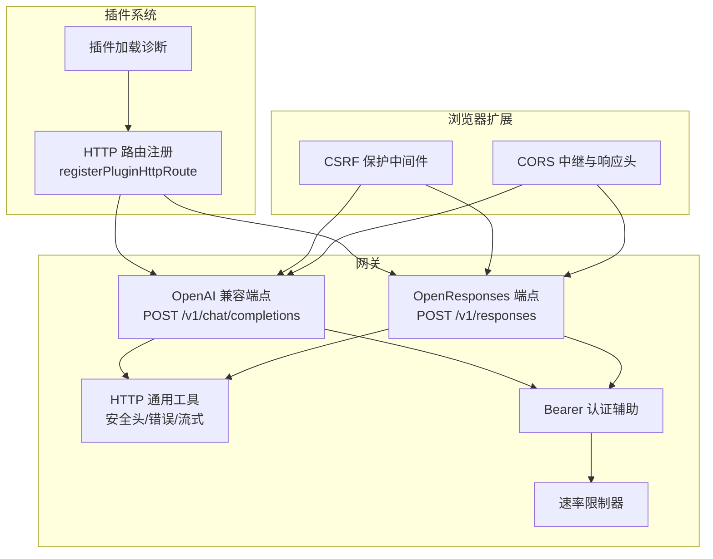
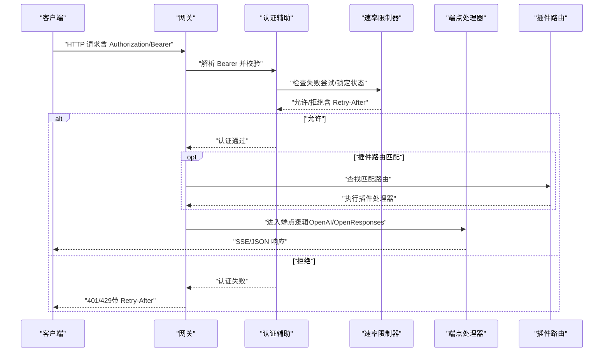
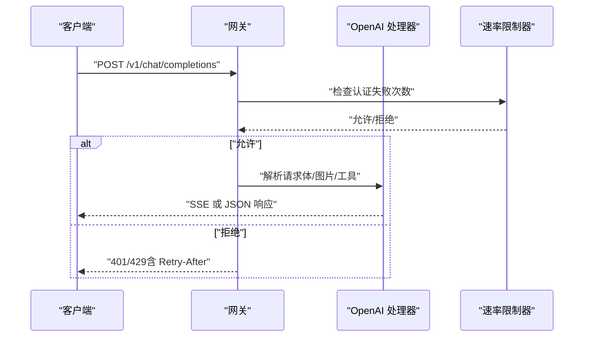
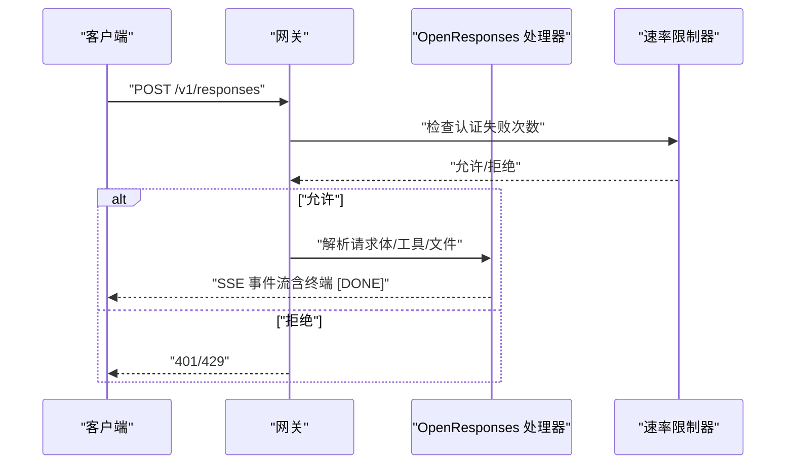
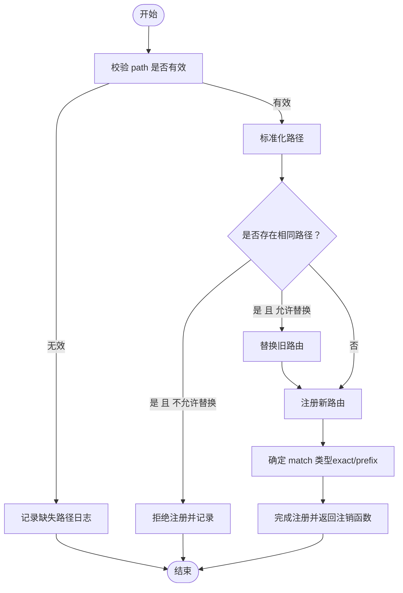
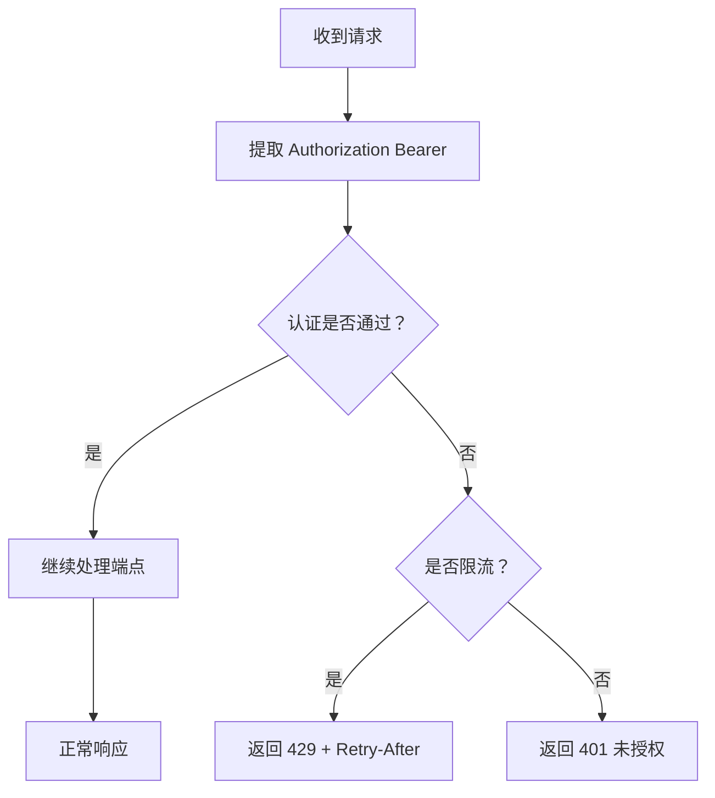
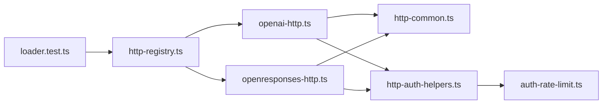

# REST API

## 目录
1. [简介](#简介)
2. [项目结构](#项目结构)
3. [核心组件](#核心组件)
4. [架构总览](#架构总览)
5. [详细组件分析](#详细组件分析)
6. [依赖关系分析](#依赖关系分析)
7. [性能考量](#性能考量)
8. [故障排查指南](#故障排查指南)
9. [结论](#结论)
10. [附录](#附录)

## 简介
本文件为 OpenClaw 的 REST API 接口文档，覆盖网关提供的 HTTP 端点（OpenAI 兼容聊天补全与 OpenResponses 响应接口）、插件动态 HTTP 路由注册机制、认证与授权流程、速率限制、安全头与 CORS 配置、错误处理与状态码语义，并提供客户端调用示例与测试建议。本文档面向开发者与集成者，既提供高层概览也包含可追溯到源码的定位信息。

## 项目结构
OpenClaw 的 REST API 主要由以下模块构成：
- 网关 HTTP 处理层：负责 OpenAI 兼容与 OpenResponses 两类端点的请求解析、流式输出、安全头设置与错误返回。
- 认证与授权辅助：提供 Bearer Token 校验、速率限制器与通用失败响应封装。
- 插件 HTTP 路由注册：允许插件以明确的鉴权级别动态注册自定义路由。
- 浏览器扩展与 CSRF 保护：浏览器扩展中继服务的 CORS 与跨站请求防护。
- 安全头与运行时配置：严格传输安全头与默认安全头设置。

图表来源
- [src/gateway/openai-http.ts](file://src/gateway/openai-http.ts#L1-L200)
- [src/gateway/openresponses-http.ts](file://src/gateway/openresponses-http.ts#L1-L200)
- [src/gateway/http-common.ts](file://src/gateway/http-common.ts#L1-L109)
- [src/gateway/auth-rate-limit.ts](file://src/gateway/auth-rate-limit.ts#L25-L167)
- [src/gateway/http-auth-helpers.ts](file://src/gateway/http-auth-helpers.ts#L1-L30)
- [src/plugins/http-registry.ts](file://src/plugins/http-registry.ts#L1-L92)
- [src/plugins/loader.test.ts](file://src/plugins/loader.test.ts#L587-L611)
- [src/browser/csrf.ts](file://src/browser/csrf.ts#L53-L87)
- [src/browser/extension-relay.ts](file://src/browser/extension-relay.ts#L546-L567)

章节来源
- [src/gateway/openai-http.ts](file://src/gateway/openai-http.ts#L1-L200)
- [src/gateway/openresponses-http.ts](file://src/gateway/openresponses-http.ts#L1-L200)
- [src/gateway/http-common.ts](file://src/gateway/http-common.ts#L1-L109)
- [src/gateway/auth-rate-limit.ts](file://src/gateway/auth-rate-limit.ts#L25-L167)
- [src/gateway/http-auth-helpers.ts](file://src/gateway/http-auth-helpers.ts#L1-L30)
- [src/plugins/http-registry.ts](file://src/plugins/http-registry.ts#L1-L92)
- [src/plugins/loader.test.ts](file://src/plugins/loader.test.ts#L587-L611)
- [src/browser/csrf.ts](file://src/browser/csrf.ts#L53-L87)
- [src/browser/extension-relay.ts](file://src/browser/extension-relay.ts#L546-L567)

## 核心组件
- OpenAI 兼容聊天补全端点
  - 方法：POST
  - 路径：/v1/chat/completions
  - 功能：接收消息数组与可选参数，支持流式返回（SSE），并按 OpenAI 格式输出 choices.chunk。
  - 请求体字段：model、messages、stream、user 等（兼容性细节见配置项）。
  - 响应：非流式返回完整响应；流式返回多条 SSE 事件，终端事件为 [DONE]。
  - 速率限制：通过速率限制器在认证阶段应用。
  - 错误：400（无效请求）、401（未授权）、405（方法不允许）、413（请求体过大）、429（限流）。
- OpenResponses 响应端点
  - 方法：POST
  - 路径：/v1/responses
  - 功能：基于输入与工具集生成响应，支持工具调用与推理内容，流式事件类型丰富。
  - 请求体字段：参考 OpenResponses 规范（模型、输入、指令、工具、tool_choice、stream、max_* 等）。
  - 响应：SSE 事件流，事件名与 JSON 类型一致，终端事件为 [DONE]。
  - 配置开关：可通过配置启用/禁用该端点。
- 插件动态 HTTP 路由
  - 注册函数：registerPluginHttpRoute
  - 必须显式声明 auth 级别（如 plugin、gateway 等）
  - 冲突策略：相同路径冲突需显式 replaceExisting=true，且不可被其他插件替换
  - 匹配策略：exact/prefix，重叠但 auth 不同将被拒绝
  - 升级提示：不再支持旧版 registerHttpHandler，应迁移到 registerHttpRoute/registerPluginHttpRoute
- 认证与授权
  - Bearer Token：从 Authorization: Bearer ... 解析，用于网关连接认证
  - 速率限制：失败尝试计数、滑动窗口、锁定时间、自动清理
  - 统一错误响应：未授权、无效请求、方法不允许、限流等
- 安全头与 CORS
  - 默认安全头：X-Content-Type-Options、Referrer-Policy、Permissions-Policy
  - 可选 HSTS：通过运行时配置注入
  - 浏览器扩展 CORS：对 chrome-extension 源进行预检放行与响应头设置
  - CSRF 保护：对非浏览器客户端豁免，对跨站变更类请求进行校验

章节来源
- [src/gateway/openai-http.ts](file://src/gateway/openai-http.ts#L1-L200)
- [src/gateway/openresponses-http.ts](file://src/gateway/openresponses-http.ts#L1-L200)
- [src/plugins/http-registry.ts](file://src/plugins/http-registry.ts#L1-L92)
- [docs/tools/plugin.md](file://docs/tools/plugin.md#L139-L144)
- [scripts/check-no-register-http-handler.mjs](file://scripts/check-no-register-http-handler.mjs#L1-L38)
- [src/gateway/http-auth-helpers.ts](file://src/gateway/http-auth-helpers.ts#L1-L30)
- [src/gateway/auth-rate-limit.ts](file://src/gateway/auth-rate-limit.ts#L25-L167)
- [src/gateway/http-common.ts](file://src/gateway/http-common.ts#L1-L109)
- [src/browser/extension-relay.ts](file://src/browser/extension-relay.ts#L546-L567)
- [src/browser/csrf.ts](file://src/browser/csrf.ts#L53-L87)
- [src/gateway/server-runtime-config.test.ts](file://src/gateway/server-runtime-config.test.ts#L252-L274)

## 架构总览
下图展示从客户端到网关端点、认证与速率限制、以及插件路由注册的整体交互。

图表来源
- [src/gateway/http-auth-helpers.ts](file://src/gateway/http-auth-helpers.ts#L1-L30)
- [src/gateway/auth-rate-limit.ts](file://src/gateway/auth-rate-limit.ts#L25-L167)
- [src/gateway/openai-http.ts](file://src/gateway/openai-http.ts#L1-L200)
- [src/gateway/openresponses-http.ts](file://src/gateway/openresponses-http.ts#L1-L200)
- [src/plugins/http-registry.ts](file://src/plugins/http-registry.ts#L1-L92)

## 详细组件分析

### OpenAI 兼容聊天补全（POST /v1/chat/completions）
- URL 模式与方法
  - 方法：POST
  - 路径：/v1/chat/completions
- 路径参数与查询参数
  - 无路径参数；查询参数未在实现中使用。
- 请求体
  - 支持字段：model、messages、stream、user 等；图片内容解析与 MIME 限制可配置。
  - 体限制：默认最大 20MB，可按配置调整。
- 响应
  - 非流式：标准 JSON 响应。
  - 流式：SSE，事件包含角色与内容增量，终端事件为 [DONE]。
- 错误与状态码
  - 400：无效请求（解析失败或参数非法）
  - 401：未授权（Bearer 缺失或不正确）
  - 405：方法不允许（仅接受 POST）
  - 413：请求体过大
  - 429：限流（带 Retry-After）
- 安全与认证
  - 使用 Bearer Token 进行网关连接认证，失败时应用速率限制。
- 示例（示意）
  - 成功（非流式）：返回包含 choices 的 JSON。
  - 成功（流式）：多条 SSE 事件，最后一条为 [DONE]。
  - 错误：返回包含 error 字段的 JSON，包含 message 与 type。

图表来源
- [src/gateway/openai-http.ts](file://src/gateway/openai-http.ts#L1-L200)
- [src/gateway/http-common.ts](file://src/gateway/http-common.ts#L36-L109)
- [src/gateway/auth-rate-limit.ts](file://src/gateway/auth-rate-limit.ts#L25-L167)

章节来源
- [src/gateway/openai-http.ts](file://src/gateway/openai-http.ts#L1-L200)
- [src/gateway/http-common.ts](file://src/gateway/http-common.ts#L36-L109)
- [src/gateway/auth-rate-limit.ts](file://src/gateway/auth-rate-limit.ts#L25-L167)

### OpenResponses 响应（POST /v1/responses）
- URL 模式与方法
  - 方法：POST
  - 路径：/v1/responses
- 路径参数与查询参数
  - 无路径参数；查询参数未在实现中使用。
- 请求体
  - 字段：model、input（字符串或 ItemParam[]）、instructions、tools、tool_choice、stream、max_output_tokens、max_tool_calls 等。
  - 输入文件与图片限制可配置。
- 响应
  - SSE 事件流，事件类型与 JSON 字段一致，终端事件为 [DONE]。
- 错误与状态码
  - 400：无效请求
  - 401：未授权
  - 405：方法不允许
  - 413：请求体过大
  - 429：限流
- 配置与兼容
  - 端点可独立启用/禁用；兼容 OpenAI 风格但语义更贴近 OpenResponses。

图表来源
- [src/gateway/openresponses-http.ts](file://src/gateway/openresponses-http.ts#L1-L200)
- [src/gateway/http-common.ts](file://src/gateway/http-common.ts#L36-L109)
- [src/gateway/auth-rate-limit.ts](file://src/gateway/auth-rate-limit.ts#L25-L167)
- [docs/experiments/plans/openresponses-gateway.md](file://docs/experiments/plans/openresponses-gateway.md#L39-L71)

章节来源
- [src/gateway/openresponses-http.ts](file://src/gateway/openresponses-http.ts#L1-L200)
- [src/gateway/http-common.ts](file://src/gateway/http-common.ts#L36-L109)
- [docs/experiments/plans/openresponses-gateway.md](file://docs/experiments/plans/openresponses-gateway.md#L39-L71)

### 插件动态 HTTP 路由注册
- 注册函数
  - registerPluginHttpRoute：支持 path、auth、match（exact/prefix）、replaceExisting、fallbackPath 等。
- 冲突与替换
  - 相同路径冲突需显式 replaceExisting=true，且不可被其他插件替换。
  - 重叠但 auth 不同将被拒绝。
- 升级与废弃
  - registerHttpHandler 已废弃，应迁移到 registerHttpRoute/registerPluginHttpRoute。
- 行为验证
  - 单元测试覆盖了注册、注销、路径缺失、替换行为与诊断日志。

图表来源
- [src/plugins/http-registry.ts](file://src/plugins/http-registry.ts#L1-L92)
- [src/plugins/loader.test.ts](file://src/plugins/loader.test.ts#L587-L611)
- [docs/tools/plugin.md](file://docs/tools/plugin.md#L139-L144)
- [scripts/check-no-register-http-handler.mjs](file://scripts/check-no-register-http-handler.mjs#L1-L38)

章节来源
- [src/plugins/http-registry.ts](file://src/plugins/http-registry.ts#L1-L92)
- [src/plugins/loader.test.ts](file://src/plugins/loader.test.ts#L587-L611)
- [docs/tools/plugin.md](file://docs/tools/plugin.md#L139-L144)
- [scripts/check-no-register-http-handler.mjs](file://scripts/check-no-register-http-handler.mjs#L1-L38)

### 认证与速率限制
- Bearer 认证
  - 从 Authorization 头解析 Bearer Token，用于网关连接认证。
  - 认证失败统一返回 401；若处于限流状态则返回 429 并携带 Retry-After。
- 速率限制
  - 滑动窗口、失败次数阈值、锁定时间、自动清理。
  - 支持按作用域（如共享密钥、设备令牌、钩子认证）区分。
- 统一错误响应
  - 提供 sendUnauthorized、sendRateLimited、sendInvalidRequest、sendMethodNotAllowed 等。

图表来源
- [src/gateway/http-auth-helpers.ts](file://src/gateway/http-auth-helpers.ts#L1-L30)
- [src/gateway/http-common.ts](file://src/gateway/http-common.ts#L41-L71)
- [src/gateway/auth-rate-limit.ts](file://src/gateway/auth-rate-limit.ts#L25-L167)

章节来源
- [src/gateway/http-auth-helpers.ts](file://src/gateway/http-auth-helpers.ts#L1-L30)
- [src/gateway/http-common.ts](file://src/gateway/http-common.ts#L41-L71)
- [src/gateway/auth-rate-limit.ts](file://src/gateway/auth-rate-limit.ts#L25-L167)

### 安全头与 CORS
- 默认安全头
  - 设置 X-Content-Type-Options、Referrer-Policy、Permissions-Policy。
  - 可选 Strict-Transport-Security（HSTS）通过运行时配置注入。
- 浏览器扩展 CORS
  - 对来自 chrome-extension 的预检请求放行，设置允许的方法与头部，缓存预检结果。
- CSRF 保护
  - 对非浏览器客户端豁免；对跨站变更类请求进行 Origin/Referer/sec-fetch-site 校验，拒绝则返回 403。

章节来源
- [src/gateway/http-common.ts](file://src/gateway/http-common.ts#L11-L22)
- [src/gateway/server-runtime-config.test.ts](file://src/gateway/server-runtime-config.test.ts#L252-L274)
- [src/browser/extension-relay.ts](file://src/browser/extension-relay.ts#L546-L567)
- [src/browser/csrf.ts](file://src/browser/csrf.ts#L53-L87)

## 依赖关系分析
- 端点到通用工具
  - OpenAI 与 OpenResponses 端点均依赖 http-common 的安全头、SSE、错误封装。
- 认证与速率限制
  - http-auth-helpers 依赖 auth 与速率限制器，统一失败响应。
- 插件路由
  - http-registry 负责注册/注销与冲突检测；loader.test 验证迁移与诊断。

图表来源
- [src/gateway/openai-http.ts](file://src/gateway/openai-http.ts#L1-L200)
- [src/gateway/openresponses-http.ts](file://src/gateway/openresponses-http.ts#L1-L200)
- [src/gateway/http-common.ts](file://src/gateway/http-common.ts#L1-L109)
- [src/gateway/http-auth-helpers.ts](file://src/gateway/http-auth-helpers.ts#L1-L30)
- [src/gateway/auth-rate-limit.ts](file://src/gateway/auth-rate-limit.ts#L25-L167)
- [src/plugins/http-registry.ts](file://src/plugins/http-registry.ts#L1-L92)
- [src/plugins/loader.test.ts](file://src/plugins/loader.test.ts#L587-L611)

章节来源
- [src/gateway/openai-http.ts](file://src/gateway/openai-http.ts#L1-L200)
- [src/gateway/openresponses-http.ts](file://src/gateway/openresponses-http.ts#L1-L200)
- [src/gateway/http-common.ts](file://src/gateway/http-common.ts#L1-L109)
- [src/gateway/http-auth-helpers.ts](file://src/gateway/http-auth-helpers.ts#L1-L30)
- [src/gateway/auth-rate-limit.ts](file://src/gateway/auth-rate-limit.ts#L25-L167)
- [src/plugins/http-registry.ts](file://src/plugins/http-registry.ts#L1-L92)
- [src/plugins/loader.test.ts](file://src/plugins/loader.test.ts#L587-L611)

## 性能考量
- 流式输出
  - SSE 逐块推送，降低首字节延迟；终端事件 [DONE] 明确结束。
- 体限制与超时
  - 请求体大小限制与读取超时控制内存占用与连接时间。
- 速率限制
  - 失败尝试滑动窗口与锁定避免暴力破解与滥用；自动清理避免内存泄漏。
- 图片/文件输入
  - 可配置最大数量、总大小、MIME 白名单、重定向次数与超时，平衡功能与资源消耗。

[本节为通用指导，无需列出具体文件来源]

## 故障排查指南
- 401 未授权
  - 检查 Authorization 头是否为 Bearer Token，确认 Token 正确。
  - 若频繁出现，可能触发速率限制，等待 Retry-After 后重试。
- 429 限流
  - 查看响应头 Retry-After，遵循冷却时间再试。
  - 检查速率限制配置与作用域。
- 400 无效请求
  - 检查请求体格式与字段类型；过大请求会返回 413。
- 405 方法不允许
  - 确认使用 POST 方法访问 /v1/chat/completions 或 /v1/responses。
- 插件路由冲突
  - 相同路径必须显式 replaceExisting=true；不同 auth 级别的重叠将被拒绝。
  - 使用 registerHttpHandler 的插件需迁移到 registerHttpRoute/registerPluginHttpRoute。

章节来源
- [src/gateway/http-common.ts](file://src/gateway/http-common.ts#L41-L71)
- [src/gateway/auth-rate-limit.ts](file://src/gateway/auth-rate-limit.ts#L25-L167)
- [docs/tools/plugin.md](file://docs/tools/plugin.md#L139-L144)
- [scripts/check-no-register-http-handler.mjs](file://scripts/check-no-register-http-handler.mjs#L1-L38)

## 结论
OpenClaw 的 REST API 以清晰的端点划分（OpenAI 兼容与 OpenResponses）、严格的认证与速率限制、完善的错误与安全头策略为基础，同时通过插件系统提供灵活的动态路由能力。建议集成方优先采用 Bearer Token 认证，关注 SSE 流式响应与 Retry-After 限流指示，并在迁移过程中将旧版注册方式升级至新版 API。

[本节为总结性内容，无需列出具体文件来源]

## 附录

### HTTP 状态码与错误响应语义
- 200 OK：成功响应（JSON/SSE）
- 400 Bad Request：无效请求（参数/体解析失败）
- 401 Unauthorized：未授权（Bearer 缺失或不正确）
- 405 Method Not Allowed：仅支持 POST
- 413 Payload Too Large：请求体超过限制
- 429 Too Many Requests：限流，带 Retry-After

章节来源
- [src/gateway/http-common.ts](file://src/gateway/http-common.ts#L36-L109)
- [src/gateway/auth-rate-limit.ts](file://src/gateway/auth-rate-limit.ts#L25-L167)

### 客户端实现要点与测试建议
- 使用 Bearer Token 在 Authorization 头中传递密钥。
- 对于流式响应，按 SSE 事件逐条处理，直到收到 [DONE]。
- 使用 curl 或 Node fetch 发起请求，观察响应头与体。
- 针对插件路由，确保 path 与 auth 显式声明，避免冲突。

[本节为通用指导，无需列出具体文件来源]