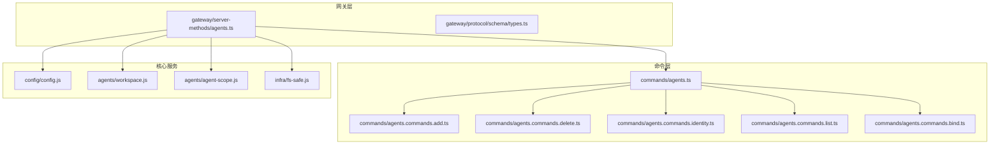
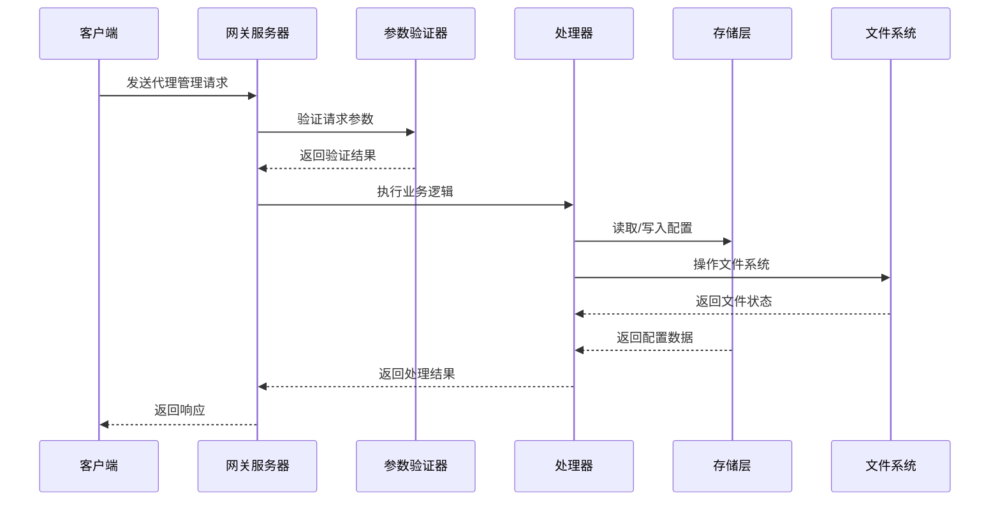
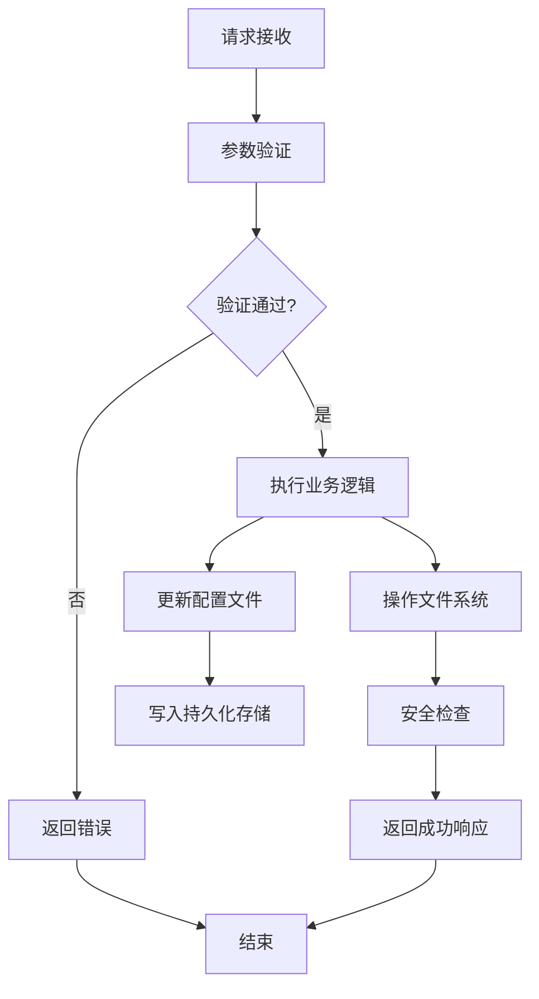
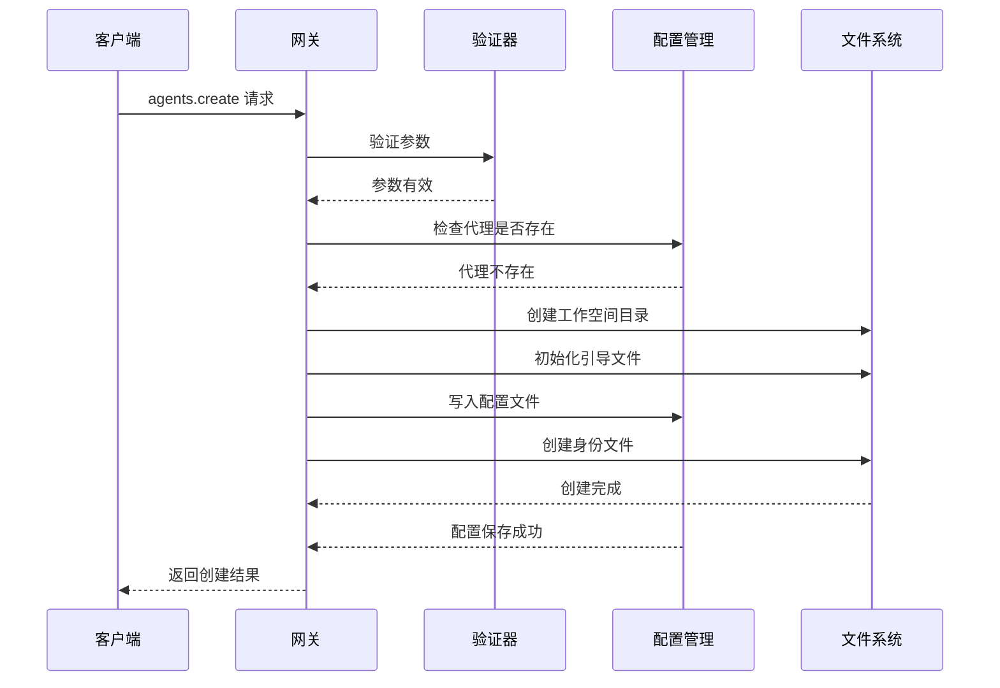
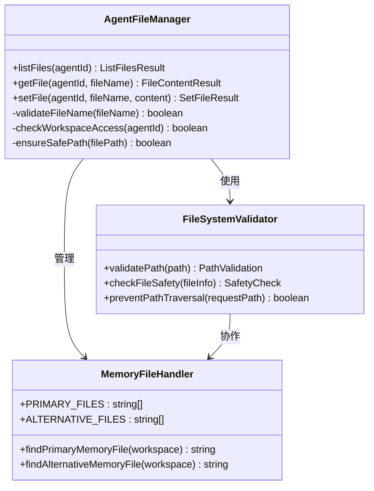
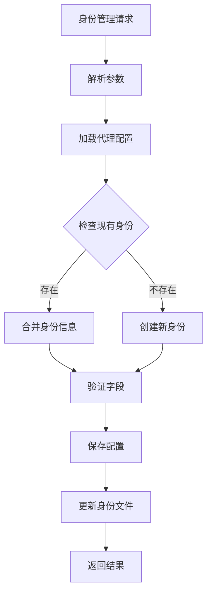
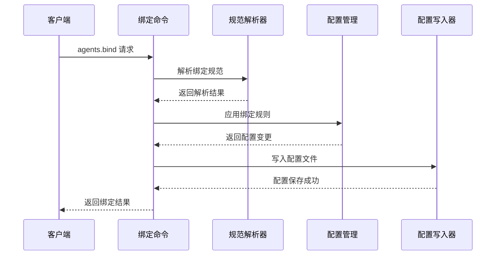
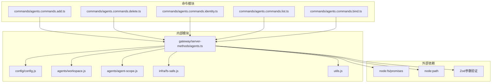

# 代理管理接口

## 目录
1. [简介](#简介)
2. [项目结构](#项目结构)
3. [核心组件](#核心组件)
4. [架构概览](#架构概览)
5. [详细组件分析](#详细组件分析)
6. [依赖关系分析](#依赖关系分析)
7. [性能考虑](#性能考虑)
8. [故障排除指南](#故障排除指南)
9. [结论](#结论)

## 简介

OpenClaw代理管理系统提供了一套完整的REST API接口，用于管理AI代理的全生命周期。该系统支持代理的创建、更新、删除、文件管理等功能，特别针对多代理协作场景进行了优化设计。

本系统采用分层架构设计，通过网关层提供统一的API接口，后端通过命令模式处理具体的业务逻辑。每个代理都拥有独立的工作空间和配置文件，支持复杂的路由绑定和身份管理功能。

## 项目结构

OpenClaw代理管理系统的文件组织遵循清晰的模块化原则：

**图表来源**
- [src/gateway/server-methods/agents.ts](file://src/gateway/server-methods/agents.ts#L1-L775)
- [src/commands/agents.ts](file://src/commands/agents.ts#L1-L7)

**章节来源**
- [src/gateway/server-methods/agents.ts](file://src/gateway/server-methods/agents.ts#L1-L775)
- [src/commands/agents.ts](file://src/commands/agents.ts#L1-L7)

## 核心组件

### 网关服务器方法

网关层提供了完整的代理管理API接口，包含以下核心方法：

- `agents.list` - 列出所有已配置的代理
- `agents.create` - 创建新代理
- `agents.update` - 更新现有代理配置
- `agents.delete` - 删除代理及其相关文件
- `agents.files.list` - 列出代理工作空间中的文件
- `agents.files.get` - 获取代理文件内容
- `agents.files.set` - 设置代理文件内容

### 命令处理器

每个API方法都对应一个专门的命令处理器，负责验证参数、执行业务逻辑并返回结果。命令处理器确保了系统的可扩展性和可维护性。

### 配置管理

系统使用集中式配置管理，所有代理信息存储在配置文件中，支持动态更新和持久化存储。

**章节来源**
- [src/gateway/server-methods/agents.ts](file://src/gateway/server-methods/agents.ts#L458-L775)
- [src/gateway/protocol/schema/types.ts](file://src/gateway/protocol/schema/types.ts#L73-L88)

## 架构概览

OpenClaw代理管理系统采用分层架构设计，确保了系统的可扩展性和安全性：

**图表来源**
- [src/gateway/server-methods/agents.ts](file://src/gateway/server-methods/agents.ts#L458-L775)

### 数据流架构

系统通过严格的数据流控制确保操作的安全性和一致性：

**图表来源**
- [src/gateway/server-methods/agents.ts](file://src/gateway/server-methods/agents.ts#L476-L593)

## 详细组件分析

### 代理创建流程

代理创建是系统中最复杂的操作之一，涉及多个步骤和安全检查：

**图表来源**
- [src/gateway/server-methods/agents.ts](file://src/gateway/server-methods/agents.ts#L476-L547)

#### 关键特性

1. **参数验证**：确保代理名称、工作空间路径等参数的有效性
2. **唯一性检查**：防止重复创建相同ID的代理
3. **工作空间初始化**：自动创建必要的目录和文件
4. **身份管理**：支持代理名称、表情符号、头像等身份信息设置
5. **安全保护**：防止路径遍历攻击和不安全的文件操作

**章节来源**
- [src/gateway/server-methods/agents.ts](file://src/gateway/server-methods/agents.ts#L476-L547)

### 代理文件管理

系统提供了完整的文件管理功能，支持对代理工作空间中的各种文件进行操作：

**图表来源**
- [src/gateway/server-methods/agents.ts](file://src/gateway/server-methods/agents.ts#L270-L349)

#### 支持的文件类型

系统支持以下类型的文件操作：

- **引导文件**：包含代理的基本配置信息
- **记忆文件**：存储代理的学习和记忆数据
- **工具文件**：定义代理可用的工具和能力
- **身份文件**：描述代理的身份特征和外观
- **心跳文件**：监控代理的运行状态

**章节来源**
- [src/gateway/server-methods/agents.ts](file://src/gateway/server-methods/agents.ts#L66-L67)
- [src/gateway/server-methods/agents.ts](file://src/gateway/server-methods/agents.ts#L270-L349)

### 代理身份管理

身份管理功能允许用户为代理设置个性化的标识信息：

**图表来源**
- [src/commands/agents.commands.identity.ts](file://src/commands/agents.commands.identity.ts#L68-L234)

#### 身份字段支持

- **名称**：代理的显示名称
- **表情符号**：用于快速识别的图标
- **主题**：代理的颜色方案或风格
- **头像**：代理的自定义图片

**章节来源**
- [src/commands/agents.commands.identity.ts](file://src/commands/agents.commands.identity.ts#L21-L31)

### 代理绑定管理

路由绑定功能允许将不同的通信渠道分配给特定的代理：

**图表来源**
- [src/commands/agents.commands.bind.ts](file://src/commands/agents.commands.bind.ts#L208-L283)

#### 绑定类型

系统支持多种绑定类型，包括但不限于：
- 频道绑定（如Telegram、Discord等）
- 账户绑定（特定平台的账户ID）
- 群组绑定（多用户群组）
- 个人绑定（一对一聊天）

**章节来源**
- [src/commands/agents.commands.bind.ts](file://src/commands/agents.commands.bind.ts#L18-L35)

## 依赖关系分析

系统各组件之间的依赖关系如下：

**图表来源**
- [src/gateway/server-methods/agents.ts](file://src/gateway/server-methods/agents.ts#L1-L49)

### 关键依赖关系

1. **配置管理依赖**：所有操作都依赖于配置文件的正确读取和写入
2. **文件系统安全**：通过多重安全检查防止路径遍历和不安全操作
3. **参数验证**：使用Zod库进行严格的输入参数验证
4. **代理作用域**：确保代理ID的标准化和唯一性

**章节来源**
- [src/gateway/server-methods/agents.ts](file://src/gateway/server-methods/agents.ts#L1-L49)

## 性能考虑

### 文件操作优化

系统在文件操作方面采用了多项优化措施：

1. **异步I/O操作**：所有文件操作都是异步执行，避免阻塞主线程
2. **批量操作**：支持批量文件操作，减少系统调用次数
3. **缓存机制**：对常用配置和文件元数据进行缓存
4. **并发控制**：限制同时进行的文件操作数量

### 内存管理

- **流式处理**：大文件操作采用流式处理方式，避免内存溢出
- **垃圾回收**：及时释放不再使用的对象引用
- **资源清理**：确保文件句柄和网络连接得到正确关闭

## 故障排除指南

### 常见错误及解决方案

| 错误类型 | 错误代码 | 可能原因 | 解决方案 |
|---------|---------|---------|---------|
| 参数无效 | INVALID_REQUEST | 输入参数格式不正确 | 检查API文档中的参数要求 |
| 代理不存在 | INVALID_REQUEST | 代理ID不存在 | 确认代理是否已创建 |
| 权限不足 | UNAUTHORIZED | 缺少必要的访问权限 | 检查认证配置 |
| 文件不存在 | NOT_FOUND | 请求的文件不存在 | 验证文件路径和名称 |
| 路径不安全 | INVALID_REQUEST | 路径包含非法字符 | 使用相对路径或预定义常量 |

### 调试建议

1. **启用详细日志**：查看系统日志以了解详细的错误信息
2. **验证配置**：检查代理配置文件的完整性和正确性
3. **测试连接**：确认文件系统权限和网络连接正常
4. **监控资源**：观察CPU、内存和磁盘使用情况

**章节来源**
- [src/gateway/server-methods/agents.ts](file://src/gateway/server-methods/agents.ts#L368-L413)

## 结论

OpenClaw代理管理系统提供了一个功能完整、安全可靠的代理管理解决方案。通过清晰的API设计、严格的安全检查和灵活的配置选项，系统能够满足从单个代理到复杂多代理协作的各种需求。

系统的主要优势包括：

1. **完整的生命周期管理**：支持代理的创建、更新、删除等全生命周期操作
2. **强大的文件管理**：提供全面的文件操作功能和安全保护
3. **灵活的身份管理**：支持个性化的代理身份设置
4. **智能路由绑定**：能够将不同渠道的消息路由到合适的代理
5. **安全可靠**：通过多重安全检查和权限控制确保系统安全

未来的发展方向包括增强多代理协作功能、优化性能表现和扩展更多通信渠道的支持。