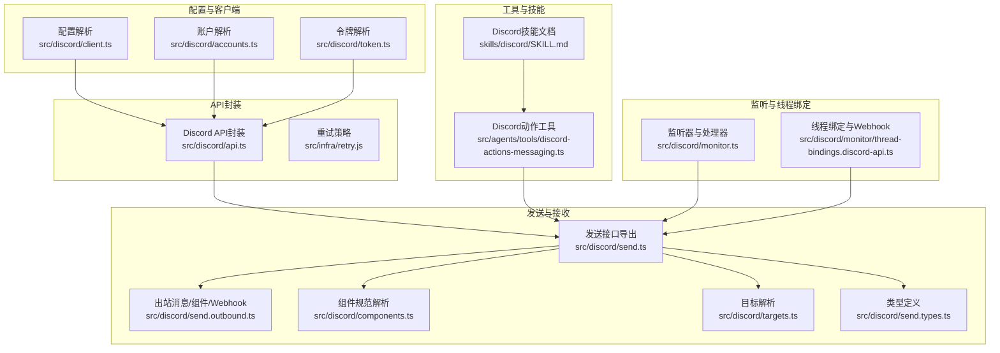
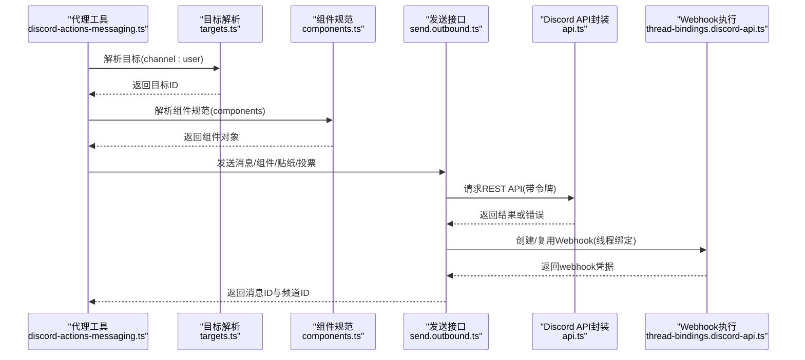
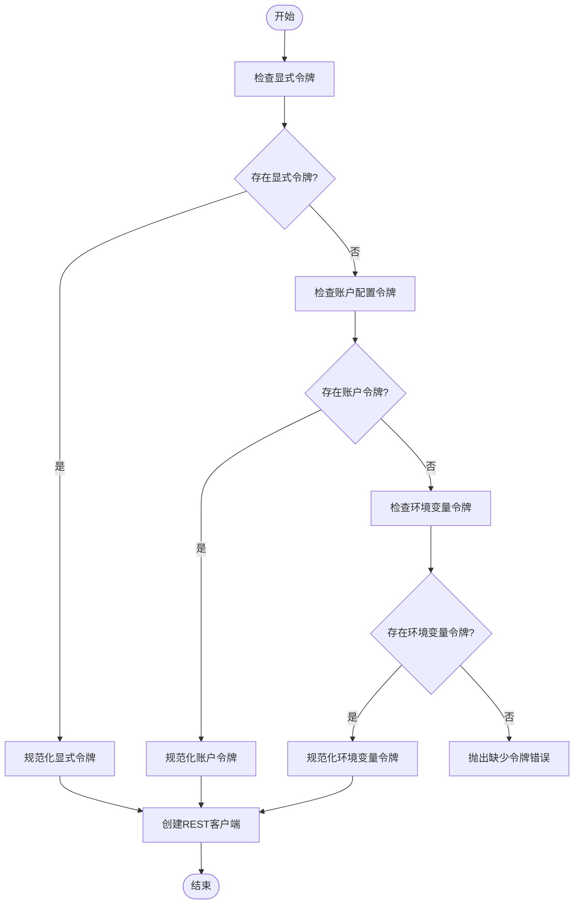
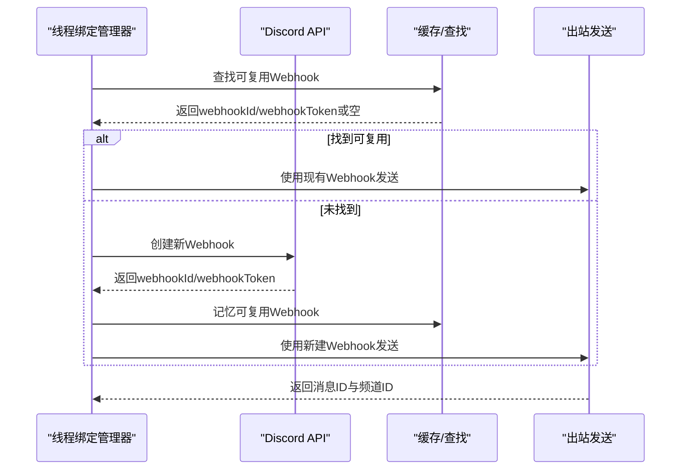
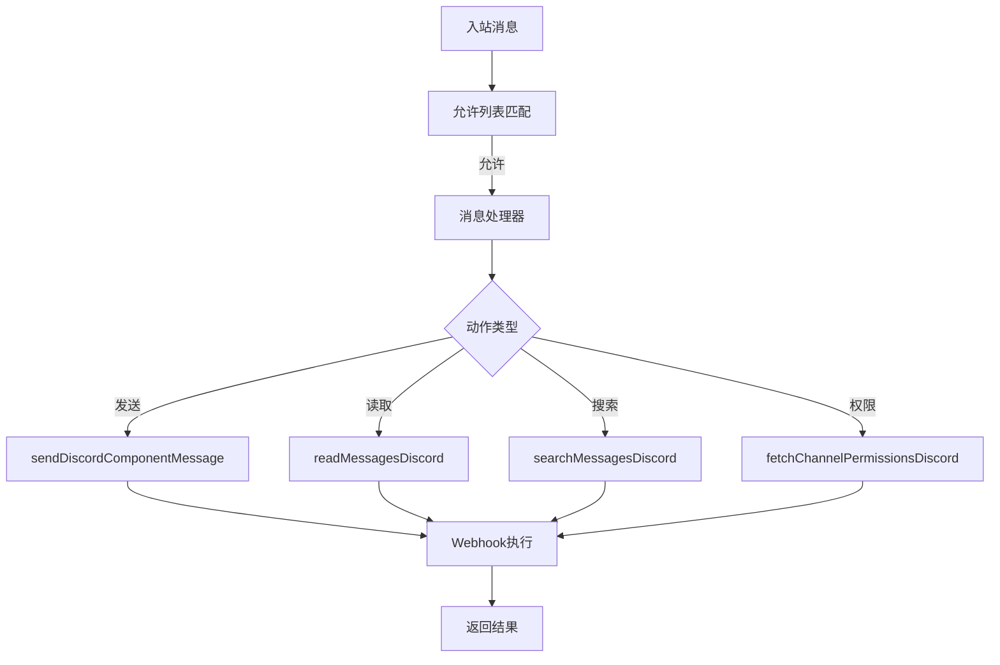
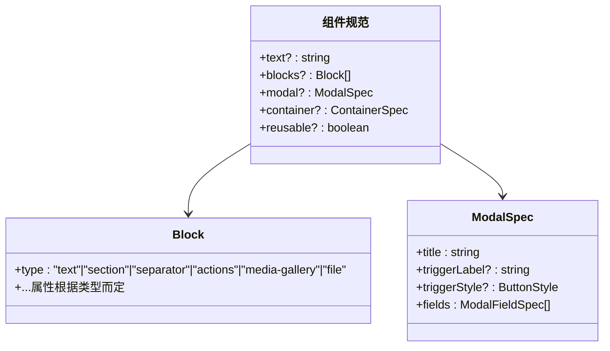
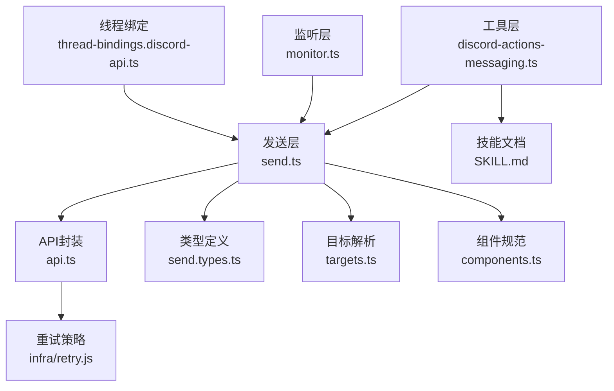

# Discord集成

## 目录
1. [简介](#简介)
2. [项目结构](#项目结构)
3. [核心组件](#核心组件)
4. [架构概览](#架构概览)
5. [详细组件分析](#详细组件分析)
6. [依赖关系分析](#依赖关系分析)
7. [性能考虑](#性能考虑)
8. [故障排除指南](#故障排除指南)
9. [结论](#结论)
10. [附录](#附录)

## 简介
本文件为OpenClaw项目中的Discord渠道集成提供完整的技术文档。内容涵盖Discord Bot API的使用方法（OAuth认证、Webhook配置、消息发送与接收处理）、Discord特定的消息格式、权限要求、速率限制策略以及最佳实践。同时提供可直接参考的代码路径，帮助开发者快速实现Discord消息处理、富文本消息发送、组件交互处理以及服务器权限管理。

## 项目结构
OpenClaw通过模块化设计实现对Discord的全面支持，主要涉及以下层次：
- 配置与客户端层：负责令牌解析、REST客户端创建与重试策略
- API封装层：统一处理Discord API错误、重试与速率限制
- 发送与接收层：提供消息发送、组件消息、Webhook活动记录等能力
- 工具与技能层：面向代理工具的Discord动作处理与策略控制
- 监听与线程绑定：处理入站消息、线程绑定与Webhook创建

**图表来源**
- [src/discord/client.ts](file://src/discord/client.ts#L1-L61)
- [src/discord/api.ts](file://src/discord/api.ts#L1-L137)
- [src/discord/send.ts](file://src/discord/send.ts#L1-L82)
- [src/discord/send.outbound.ts](file://src/discord/send.outbound.ts#L363-L415)
- [src/discord/components.ts](file://src/discord/components.ts#L1-L800)
- [src/discord/targets.ts](file://src/discord/targets.ts#L1-L158)
- [src/discord/send.types.ts](file://src/discord/send.types.ts#L1-L177)
- [src/agents/tools/discord-actions-messaging.ts](file://src/agents/tools/discord-actions-messaging.ts#L1-L530)
- [skills/discord/SKILL.md](file://skills/discord/SKILL.md#L1-L198)
- [src/discord/monitor.ts](file://src/discord/monitor.ts#L1-L29)
- [src/discord/monitor/thread-bindings.discord-api.ts](file://src/discord/monitor/thread-bindings.discord-api.ts#L157-L218)

**章节来源**
- [src/discord/client.ts](file://src/discord/client.ts#L1-L61)
- [src/discord/api.ts](file://src/discord/api.ts#L1-L137)
- [src/discord/send.ts](file://src/discord/send.ts#L1-L82)
- [src/discord/monitor.ts](file://src/discord/monitor.ts#L1-L29)

## 核心组件
本节概述Discord集成的关键组件及其职责：

- 客户端与令牌管理
  - 负责从配置或环境变量解析Discord Bot令牌，创建REST客户端并应用重试策略
  - 参考路径：[createDiscordClient](file://src/discord/client.ts#L45-L56)、[createDiscordRestClient](file://src/discord/client.ts#L34-L43)

- API封装与错误处理
  - 统一处理Discord API请求、响应状态码、错误载荷解析与重试逻辑
  - 支持429速率限制的自动退避与重试
  - 参考路径：[fetchDiscord](file://src/discord/api.ts#L96-L136)、[DiscordApiError](file://src/discord/api.ts#L80-L89)

- 发送接口导出
  - 汇总各类发送操作（消息、组件、权限、反应、线程、贴纸、投票等）
  - 参考路径：[send.ts导出](file://src/discord/send.ts#L1-L82)

- 组件消息规范
  - 解析并构建Discord组件消息（按钮、选择菜单、模态框等），支持自定义ID与交互
  - 参考路径：[readDiscordComponentSpec](file://src/discord/components.ts#L555-L605)、[buildDiscordComponentCustomId](file://src/discord/components.ts#L607-L617)

- 目标解析与策略
  - 将用户输入解析为明确的频道或用户目标，支持用户名到ID的目录查找
  - 参考路径：[parseDiscordTarget](file://src/discord/targets.ts#L19-L51)、[resolveDiscordTarget](file://src/discord/targets.ts#L67-L117)

- 工具动作处理
  - 提供代理工具的Discord动作入口，包含消息读取、发送、编辑、删除、反应、搜索、线程管理、权限查询等
  - 参考路径：[handleDiscordMessagingAction](file://src/agents/tools/discord-actions-messaging.ts#L59-L529)

**章节来源**
- [src/discord/client.ts](file://src/discord/client.ts#L1-L61)
- [src/discord/api.ts](file://src/discord/api.ts#L1-L137)
- [src/discord/send.ts](file://src/discord/send.ts#L1-L82)
- [src/discord/components.ts](file://src/discord/components.ts#L1-L800)
- [src/discord/targets.ts](file://src/discord/targets.ts#L1-L158)
- [src/agents/tools/discord-actions-messaging.ts](file://src/agents/tools/discord-actions-messaging.ts#L1-L530)

## 架构概览
下图展示了Discord集成的整体架构与数据流，从代理工具调用到Discord API请求与Webhook执行的全过程。

**图表来源**
- [src/agents/tools/discord-actions-messaging.ts](file://src/agents/tools/discord-actions-messaging.ts#L59-L529)
- [src/discord/targets.ts](file://src/discord/targets.ts#L19-L51)
- [src/discord/components.ts](file://src/discord/components.ts#L555-L605)
- [src/discord/send.outbound.ts](file://src/discord/send.outbound.ts#L363-L415)
- [src/discord/api.ts](file://src/discord/api.ts#L96-L136)
- [src/discord/monitor/thread-bindings.discord-api.ts](file://src/discord/monitor/thread-bindings.discord-api.ts#L157-L218)

## 详细组件分析

### OAuth认证与令牌管理
- 令牌来源优先级
  - 显式参数令牌
  - 账户配置令牌
  - 默认账户令牌（环境变量）
  - 参考路径：[resolveToken](file://src/discord/client.ts#L16-L28)
- 令牌规范化
  - 自动添加"Bot "前缀，去除多余空白
  - 参考路径：[normalizeDiscordToken](file://src/discord/token.ts#L1-L200)
- REST客户端创建
  - 基于令牌创建RequestClient，支持重试策略
  - 参考路径：[createDiscordRestClient](file://src/discord/client.ts#L34-L43)、[createDiscordClient](file://src/discord/client.ts#L45-L56)

**图表来源**
- [src/discord/client.ts](file://src/discord/client.ts#L16-L28)

**章节来源**
- [src/discord/client.ts](file://src/discord/client.ts#L1-L61)

### Webhook配置与线程绑定
- Webhook创建
  - 为指定频道创建OpenClaw专用Webhook，返回webhookId与webhookToken
  - 参考路径：[createWebhookForChannel](file://src/discord/monitor/thread-bindings.discord-api.ts#L157-L184)
- 复用策略
  - 缓存与全局查找已存在的Webhook，避免重复创建
  - 参考路径：[findReusableWebhook](file://src/discord/monitor/thread-bindings.discord-api.ts#L186-L218)
- 出站消息执行
  - 使用Webhook URL执行消息发送，记录通道活动
  - 参考路径：[sendWebhookMessageDiscord](file://src/discord/send.outbound.ts#L363-L415)

**图表来源**
- [src/discord/monitor/thread-bindings.discord-api.ts](file://src/discord/monitor/thread-bindings.discord-api.ts#L157-L218)
- [src/discord/send.outbound.ts](file://src/discord/send.outbound.ts#L363-L415)

**章节来源**
- [src/discord/monitor/thread-bindings.discord-api.ts](file://src/discord/monitor/thread-bindings.discord-api.ts#L157-L218)
- [src/discord/send.outbound.ts](file://src/discord/send.outbound.ts#L363-L415)

### 消息发送与接收处理
- 入站消息处理
  - 注册Discord监听器，解析允许列表与命令授权，构建消息处理器
  - 参考路径：[registerDiscordListener](file://src/discord/monitor/listeners.ts#L1-L200)、[createDiscordMessageHandler](file://src/discord/monitor/message-handler.ts#L1-L200)
- 出站消息发送
  - 支持普通文本、媒体、组件消息、语音消息、贴纸、投票等
  - 参考路径：[sendMessageDiscord](file://src/discord/send.outbound.ts#L1-L200)、[sendDiscordComponentMessage](file://src/discord/send.components.ts#L1-L200)
- 消息读取与搜索
  - 支持按条件读取消息列表与跨频道/作者搜索
  - 参考路径：[readMessagesDiscord](file://src/discord/send.messages.ts#L1-L200)、[searchMessagesDiscord](file://src/discord/send.messages.ts#L200-L400)
- 权限查询
  - 查询频道权限与成员权限，支持多账户
  - 参考路径：[fetchChannelPermissionsDiscord](file://src/discord/send.permissions.ts#L1-L200)、[fetchMemberGuildPermissionsDiscord](file://src/discord/send.permissions.ts#L200-L400)

**图表来源**
- [src/discord/monitor.ts](file://src/discord/monitor.ts#L1-L29)
- [src/agents/tools/discord-actions-messaging.ts](file://src/agents/tools/discord-actions-messaging.ts#L59-L529)
- [src/discord/send.outbound.ts](file://src/discord/send.outbound.ts#L363-L415)

**章节来源**
- [src/discord/monitor.ts](file://src/discord/monitor.ts#L1-L29)
- [src/agents/tools/discord-actions-messaging.ts](file://src/agents/tools/discord-actions-messaging.ts#L1-L530)

### 组件交互与富文本消息
- 组件规范解析
  - 支持按钮、选择菜单、模态框、媒体画廊、文件附件等组件块
  - 自定义ID生成与解析，支持模态触发器
  - 参考路径：[readDiscordComponentSpec](file://src/discord/components.ts#L555-L605)、[buildDiscordComponentCustomId](file://src/discord/components.ts#L607-L617)
- 富文本消息发送
  - 通过components字段传递Carbon组件实例，避免与embeds混用
  - 参考路径：[sendDiscordComponentMessage](file://src/discord/send.components.ts#L1-L200)、[技能文档-组件v2](file://skills/discord/SKILL.md#L58-L86)

**图表来源**
- [src/discord/components.ts](file://src/discord/components.ts#L144-L153)
- [src/discord/components.ts](file://src/discord/components.ts#L442-L553)
- [src/discord/components.ts](file://src/discord/components.ts#L137-L142)

**章节来源**
- [src/discord/components.ts](file://src/discord/components.ts#L1-L800)
- [skills/discord/SKILL.md](file://skills/discord/SKILL.md#L58-L86)

### 权限要求与最佳实践
- 必备配置
  - 令牌配置：channels.discord.token
  - 动作门控：channels.discord.actions.*（默认关闭：roles、moderation、presence、channels）
  - 参考路径：[技能文档-必须项](file://skills/discord/SKILL.md#L12-L18)
- 写作风格
  - 短小精悍、避免Markdown表格、提及用户使用&lt;@USER_ID>
  - 参考路径：[技能文档-写作风格](file://skills/discord/SKILL.md#L193-L198)
- 最佳实践
  - 优先使用组件v2（components）而非legacy embeds
  - 不要同时使用components与embeds
  - 使用显式ID（guildId、channelId、messageId、userId）
  - 参考路径：[技能文档-指南](file://skills/discord/SKILL.md#L19-L24)

**章节来源**
- [skills/discord/SKILL.md](file://skills/discord/SKILL.md#L1-L198)

## 依赖关系分析
- 组件耦合
  - 工具层依赖发送层；发送层依赖API封装与类型定义；目标解析与组件规范为通用工具
- 外部依赖
  - Discord API v10基础URL、HTTP客户端、重试机制
- 循环依赖
  - 未发现循环依赖迹象，模块边界清晰

**图表来源**
- [src/agents/tools/discord-actions-messaging.ts](file://src/agents/tools/discord-actions-messaging.ts#L1-L530)
- [src/discord/send.ts](file://src/discord/send.ts#L1-L82)
- [src/discord/api.ts](file://src/discord/api.ts#L1-L137)
- [src/discord/send.types.ts](file://src/discord/send.types.ts#L1-L177)
- [src/discord/targets.ts](file://src/discord/targets.ts#L1-L158)
- [src/discord/components.ts](file://src/discord/components.ts#L1-L800)
- [src/discord/monitor.ts](file://src/discord/monitor.ts#L1-L29)
- [src/discord/monitor/thread-bindings.discord-api.ts](file://src/discord/monitor/thread-bindings.discord-api.ts#L157-L218)

**章节来源**
- [src/agents/tools/discord-actions-messaging.ts](file://src/agents/tools/discord-actions-messaging.ts#L1-L530)
- [src/discord/send.ts](file://src/discord/send.ts#L1-L82)
- [src/discord/api.ts](file://src/discord/api.ts#L1-L137)

## 性能考虑
- 速率限制与重试
  - API封装内置重试配置与429退避策略，自动解析Retry-After头与错误载荷
  - 参考路径：[fetchDiscord重试逻辑](file://src/discord/api.ts#L108-L135)
- 并发与批量
  - 建议在代理工具中合理控制并发度，避免触发速率限制
- 缓存与复用
  - Webhook复用与组件条目缓存可显著降低API调用次数
  - 参考路径：[findReusableWebhook](file://src/discord/monitor/thread-bindings.discord-api.ts#L186-L218)

[本节为通用指导，无需具体文件分析]

## 故障排除指南
- 常见错误与定位
  - 令牌缺失：检查配置与环境变量设置
    - 参考路径：[resolveToken错误](file://src/discord/client.ts#L23-L27)
  - API错误与429
    - 解析错误载荷与Retry-After，必要时延迟重试
    - 参考路径：[DiscordApiError](file://src/discord/api.ts#L80-L89)、[parseRetryAfterSeconds](file://src/discord/api.ts#L35-L50)
  - 组件与嵌入冲突
    - 同时使用components与embeds会被Discord拒绝
    - 参考路径：[技能文档-组件v2限制](file://skills/discord/SKILL.md#L70-L71)
- 调试辅助
  - 开发脚本提供授权头与Webhook API的简化调用示例
  - 参考路径：[resolveAuthorizationHeader](file://scripts/dev/discord-acp-plain-language-smoke.ts#L325-L334)、[discordWebhookApi](file://scripts/dev/discord-acp-plain-language-smoke.ts#L356-L376)

**章节来源**
- [src/discord/client.ts](file://src/discord/client.ts#L16-L28)
- [src/discord/api.ts](file://src/discord/api.ts#L35-L50)
- [skills/discord/SKILL.md](file://skills/discord/SKILL.md#L70-L71)
- [scripts/dev/discord-acp-plain-language-smoke.ts](file://scripts/dev/discord-acp-plain-language-smoke.ts#L325-L376)

## 结论
OpenClaw的Discord集成通过清晰的模块划分与完善的错误处理机制，提供了从令牌管理、API封装、消息发送到组件交互的全栈支持。遵循技能文档中的最佳实践与权限要求，可在保证合规的前提下高效实现丰富的Discord消息功能。

[本节为总结性内容，无需具体文件分析]

## 附录
- 示例与参考路径
  - 发送富文本消息（组件v2）：[sendDiscordComponentMessage](file://src/discord/send.components.ts#L1-L200)、[技能示例](file://skills/discord/SKILL.md#L58-L68)
  - 发送带媒体的消息：[sendMessageDiscord](file://src/discord/send.outbound.ts#L1-L200)、[技能示例](file://skills/discord/SKILL.md#L44-L54)
  - 创建Webhook并发送：[createWebhookForChannel](file://src/discord/monitor/thread-bindings.discord-api.ts#L157-L184)、[sendWebhookMessageDiscord](file://src/discord/send.outbound.ts#L363-L415)
  - 查询权限：[fetchChannelPermissionsDiscord](file://src/discord/send.permissions.ts#L1-L200)、[技能示例](file://skills/discord/SKILL.md#L180-L189)

[本节为补充信息，无需具体文件分析]