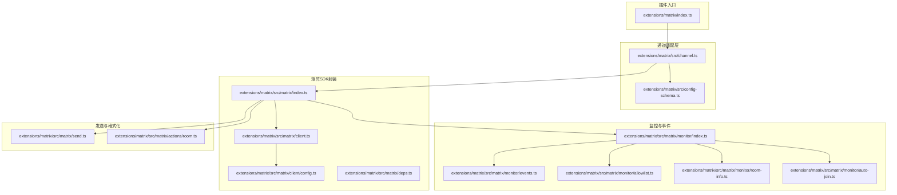
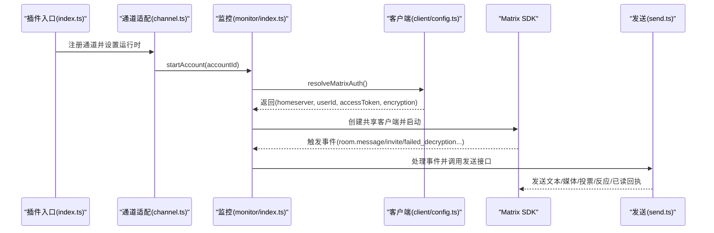
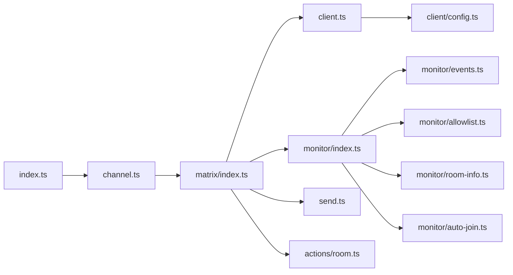
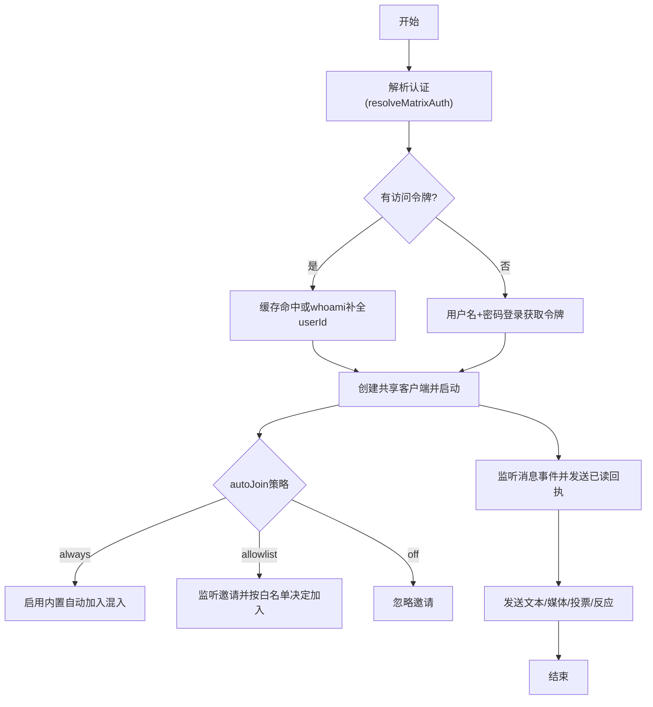

# Matrix集成

## 目录
1. [简介](#简介)
2. [项目结构](#项目结构)
3. [核心组件](#核心组件)
4. [架构总览](#架构总览)
5. [详细组件分析](#详细组件分析)
6. [依赖关系分析](#依赖关系分析)
7. [性能考量](#性能考量)
8. [故障排查指南](#故障排查指南)
9. [结论](#结论)
10. [附录](#附录)

## 简介
本文件为Matrix渠道的API集成文档，面向在OpenClaw中集成Matrix（Element/自建Homeserver）的开发者与运维人员。内容覆盖：
- 使用Matrix Client-Server API进行房间管理、消息同步与身份验证
- Matrix去中心化架构、房间权限与端到端加密机制的落地实践
- 通过代码路径指引展示如何加入房间、发送加密消息与处理房间事件
- 配置项、运行时行为与常见问题定位

## 项目结构
Matrix渠道位于扩展目录extensions/matrix，核心由“插件入口”“通道适配层”“矩阵SDK封装”“监控与事件处理”“发送与格式化”“权限与房间信息”等模块组成。

图表来源
- [index.ts](file://extensions/matrix/index.ts#L1-L23)
- [channel.ts](file://extensions/matrix/src/channel.ts#L1-L475)
- [index.ts](file://extensions/matrix/src/matrix/index.ts#L1-L12)
- [index.ts](file://extensions/matrix/src/matrix/monitor/index.ts#L1-L415)
- [send.ts](file://extensions/matrix/src/matrix/send.ts#L1-L268)
- [client.ts](file://extensions/matrix/src/matrix/client.ts#L1-L15)
- [config.ts](file://extensions/matrix/src/matrix/client/config.ts#L1-L246)
- [config-schema.ts](file://extensions/matrix/src/config-schema.ts#L1-L67)

章节来源
- [index.ts](file://extensions/matrix/index.ts#L1-L23)
- [channel.ts](file://extensions/matrix/src/channel.ts#L1-L475)
- [index.ts](file://extensions/matrix/src/matrix/index.ts#L1-L12)

## 核心组件
- 插件注册与运行时：插件入口负责注册Matrix通道、设置运行时并确保加密运行时可用。
- 通道适配层：定义Matrix能力、目标解析、目录查询、安全策略、线程回复模式、状态探测与启动流程。
- 客户端与认证：解析账户配置、支持访问令牌或密码登录、缓存凭证、按需登录获取访问令牌。
- 监控与事件：监听房间消息、加密事件、解密失败、邀请、成员变更；支持自动加入策略与读回执。
- 发送与格式化：文本分片、媒体上传（可加密）、投票、打字指示、已读回执、反应。
- 权限与房间信息：用户ID标准化、允许列表匹配、房间名/别名/成员数解析、自动加入白名单。

章节来源
- [index.ts](file://extensions/matrix/index.ts#L7-L20)
- [channel.ts](file://extensions/matrix/src/channel.ts#L109-L475)
- [config.ts](file://extensions/matrix/src/matrix/client/config.ts#L103-L246)
- [index.ts](file://extensions/matrix/src/matrix/monitor/index.ts#L233-L415)
- [send.ts](file://extensions/matrix/src/matrix/send.ts#L37-L268)
- [allowlist.ts](file://extensions/matrix/src/matrix/monitor/allowlist.ts#L1-L97)
- [room-info.ts](file://extensions/matrix/src/matrix/monitor/room-info.ts#L1-L56)
- [auto-join.ts](file://extensions/matrix/src/matrix/monitor/auto-join.ts#L1-L73)

## 架构总览
下图展示了从插件注册到消息处理与发送的关键交互：

图表来源
- [index.ts](file://extensions/matrix/index.ts#L12-L20)
- [channel.ts](file://extensions/matrix/src/channel.ts#L430-L475)
- [index.ts](file://extensions/matrix/src/matrix/monitor/index.ts#L233-L415)
- [config.ts](file://extensions/matrix/src/matrix/client/config.ts#L103-L246)
- [send.ts](file://extensions/matrix/src/matrix/send.ts#L37-L158)

## 详细组件分析

### 插件注册与通道元数据
- 插件ID、名称、描述、配置模式与注册流程
- 设置运行时、确保加密运行时、注册Matrix通道

章节来源
- [index.ts](file://extensions/matrix/index.ts#L7-L20)

### 通道适配层（Channel Plugin）
- 能力声明：支持直接消息、群组、线程、投票、反应、媒体
- 目标解析：支持房间ID/别名/用户ID，兼容多种前缀
- 安全策略：DM策略（配对、允许列表、开放、禁用），群组策略警告
- 线程回复：根据上下文构建线程回复工具上下文
- 目录查询：列出用户与房间，支持实时查询
- 解析器：将输入解析为目标
- 启动：序列化启动，避免动态导入竞态；懒加载监控器

章节来源
- [channel.ts](file://extensions/matrix/src/channel.ts#L109-L475)

### 客户端与认证（Client & Auth）
- 配置解析：支持多账户合并、环境变量回退、嵌套对象深合并
- 认证流程：优先使用访问令牌；若无则尝试缓存；否则以用户名+密码登录获取令牌并缓存
- 登录HTTP API：/_matrix/client/v3/login，保存设备ID与令牌
- 加密开关：encryption字段控制是否启用端到端加密

章节来源
- [config.ts](file://extensions/matrix/src/matrix/client/config.ts#L36-L101)
- [config.ts](file://extensions/matrix/src/matrix/client/config.ts#L103-L246)

### 监控与事件处理
- 事件监听：room.message、room.encrypted_event、room.decrypted_event、room.failed_decryption、room.invite、room.join、room.event
- 自动加入：always（内置混入）、allowlist（白名单匹配别名/ID/备选别名）、off
- 读回执：收到消息后尽快发送已读回执
- 加密提示：未启用加密但收到加密事件、启用加密但缺少crypto运行时的告警

章节来源
- [index.ts](file://extensions/matrix/src/matrix/monitor/index.ts#L233-L415)
- [events.ts](file://extensions/matrix/src/matrix/monitor/events.ts#L49-L169)
- [auto-join.ts](file://extensions/matrix/src/matrix/monitor/auto-join.ts#L7-L73)

### 发送与格式化
- 文本发送：Markdown表格转换、文本分片、回复/线程关系构建、返回最后一条消息ID
- 媒体发送：上传（可加密）、音视频/图片/文件类型判断、语音消息决策、图片信息准备
- 投票发送：构建轮询起始事件载荷并发送
- 工具类：打字指示、已读回执、反应（表情）

章节来源
- [send.ts](file://extensions/matrix/src/matrix/send.ts#L37-L268)

### 房间与成员信息
- 成员信息：获取用户资料（显示名/头像）
- 房间信息：名称、主题、规范别名、成员数（缓存）
- 房间权限：用户ID标准化、允许列表匹配（支持通配符与多种前缀）

章节来源
- [room.ts](file://extensions/matrix/src/matrix/actions/room.ts#L5-L86)
- [room-info.ts](file://extensions/matrix/src/matrix/monitor/room-info.ts#L9-L56)
- [allowlist.ts](file://extensions/matrix/src/matrix/monitor/allowlist.ts#L32-L97)

### 加密运行时与依赖
- SDK可用性检测、缺失时下载平台库、安装依赖
- 运行时错误识别与友好提示

章节来源
- [deps.ts](file://extensions/matrix/src/matrix/deps.ts#L30-L127)

## 依赖关系分析
- 插件入口依赖通道适配层；通道适配层依赖矩阵SDK封装与监控模块
- 客户端封装依赖配置解析与运行时；监控模块依赖事件监听与权限/房间信息
- 发送模块依赖客户端封装与格式化工具；动作模块依赖客户端封装

图表来源
- [index.ts](file://extensions/matrix/index.ts#L1-L23)
- [channel.ts](file://extensions/matrix/src/channel.ts#L1-L40)
- [index.ts](file://extensions/matrix/src/matrix/index.ts#L1-L12)
- [client.ts](file://extensions/matrix/src/matrix/client.ts#L1-L15)
- [config.ts](file://extensions/matrix/src/matrix/client/config.ts#L1-L11)
- [index.ts](file://extensions/matrix/src/matrix/monitor/index.ts#L1-L28)
- [events.ts](file://extensions/matrix/src/matrix/monitor/events.ts#L1-L7)
- [allowlist.ts](file://extensions/matrix/src/matrix/monitor/allowlist.ts#L1-L6)
- [room-info.ts](file://extensions/matrix/src/matrix/monitor/room-info.ts#L1-L7)
- [auto-join.ts](file://extensions/matrix/src/matrix/monitor/auto-join.ts#L1-L6)
- [send.ts](file://extensions/matrix/src/matrix/send.ts#L1-L6)
- [room.ts](file://extensions/matrix/src/matrix/actions/room.ts#L1-L4)

章节来源
- [index.ts](file://extensions/matrix/index.ts#L1-L23)
- [channel.ts](file://extensions/matrix/src/channel.ts#L1-L40)

## 性能考量
- 文本分片与长度限制：根据Markdown表格模式与文本块限制进行分片，避免单条消息超限
- 媒体上传与并发：发送队列串行化，避免并发导致的速率与一致性问题
- 缓存策略：房间信息与成员显示名缓存，减少重复查询
- 启动序列化：多账户启动时串行化动态导入，避免竞态与初始化循环
- 初始同步限制：支持按账户或全局设置初始同步条目上限，平衡首次启动时间与历史消息量

章节来源
- [send.ts](file://extensions/matrix/src/matrix/send.ts#L65-L72)
- [index.ts](file://extensions/matrix/src/matrix/monitor/index.ts#L446-L462)
- [room-info.ts](file://extensions/matrix/src/matrix/monitor/room-info.ts#L9-L38)

## 故障排查指南
- 无法找到模块或缺少加密运行时
  - 现象：启动时报错提示找不到@matrix-org/matrix-sdk-crypto-nodejs相关模块
  - 处理：执行加密运行时下载脚本或安装依赖；确认包管理器与锁文件存在
- 登录失败或无访问令牌
  - 现象：配置了用户名/密码但登录返回异常或无令牌
  - 处理：检查homeserver地址、用户名格式（@user:server）、密码正确性；确认/_matrix/client/v3/login可达
- 收到加密事件但无法解密
  - 现象：failed_decryption事件频繁出现
  - 处理：开启encryption并确保crypto运行时可用；在其他会话发起设备验证
- 自动加入未生效
  - 现象：收到邀请但未加入
  - 处理：检查autoJoin模式与autoJoinAllowlist；always模式使用内置混入；allowlist模式需匹配房间ID/别名/备选别名
- 目标解析失败
  - 现象：输入房间/用户ID无效
  - 处理：确保使用标准ID（!room:server 或 @user:server）或可解析的别名；必要时先解析再发送

章节来源
- [deps.ts](file://extensions/matrix/src/matrix/deps.ts#L22-L88)
- [config.ts](file://extensions/matrix/src/matrix/client/config.ts#L188-L245)
- [events.ts](file://extensions/matrix/src/matrix/monitor/events.ts#L108-L160)
- [auto-join.ts](file://extensions/matrix/src/matrix/monitor/auto-join.ts#L35-L73)
- [allowlist.ts](file://extensions/matrix/src/matrix/monitor/allowlist.ts#L47-L67)

## 结论
本集成文档基于OpenClaw的Matrix渠道实现，提供了从认证、监控、权限到发送与格式化的完整链路说明。通过标准化的配置模式、严格的权限控制与完善的事件处理，可在去中心化的Matrix生态中稳定地进行消息同步与自动化操作。建议在生产环境中：
- 明确房间与用户的允许列表策略
- 启用端到端加密并完成设备验证
- 合理设置初始同步限制与媒体大小上限
- 使用自动加入白名单模式以降低误入风险

## 附录

### 配置项速查（节选）
- 渠道级别
  - homeserver：Homeserver基础URL
  - userId/accessToken/password/deviceName：认证与设备信息
  - initialSyncLimit：初始同步条目上限
  - encryption：是否启用E2EE
  - allowlistOnly：仅允许白名单
  - groupPolicy/replyToMode/threadReplies：群组策略与回复模式
  - textChunkLimit/chunkMode/responsePrefix：文本分片与前缀
  - mediaMaxMb：媒体大小上限（MB）
  - autoJoin/autoJoinAllowlist：自动加入策略与白名单
  - groupAllowFrom/dm：群组与私聊来源
  - groups/rooms：房间级配置（允许、提及要求、工具策略、技能、系统提示等）
  - actions：动作开关（反应、消息、置顶、成员信息、频道信息）
- 账户级
  - 支持channels.matrix.accounts.&lt;accountId&gt;覆盖渠道级配置，嵌套对象深合并

章节来源
- [config-schema.ts](file://extensions/matrix/src/config-schema.ts#L38-L66)

### 关键流程图：加入房间与发送加密消息

图表来源
- [config.ts](file://extensions/matrix/src/matrix/client/config.ts#L103-L246)
- [index.ts](file://extensions/matrix/src/matrix/monitor/index.ts#L233-L415)
- [auto-join.ts](file://extensions/matrix/src/matrix/monitor/auto-join.ts#L27-L73)
- [events.ts](file://extensions/matrix/src/matrix/monitor/events.ts#L76-L94)
- [send.ts](file://extensions/matrix/src/matrix/send.ts#L37-L158)