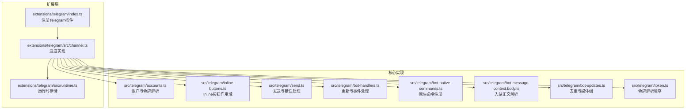
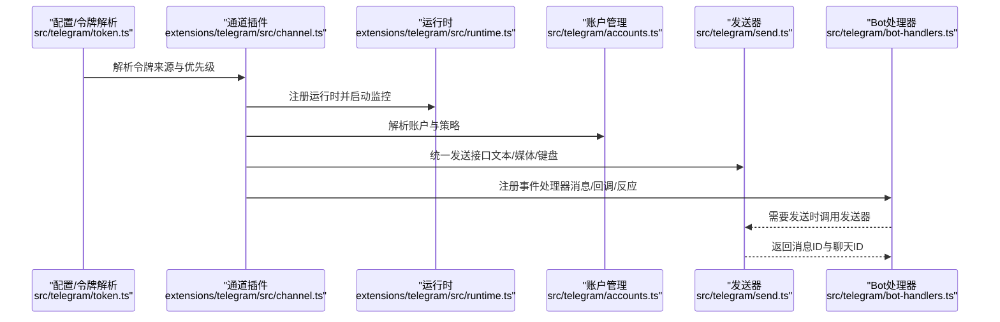
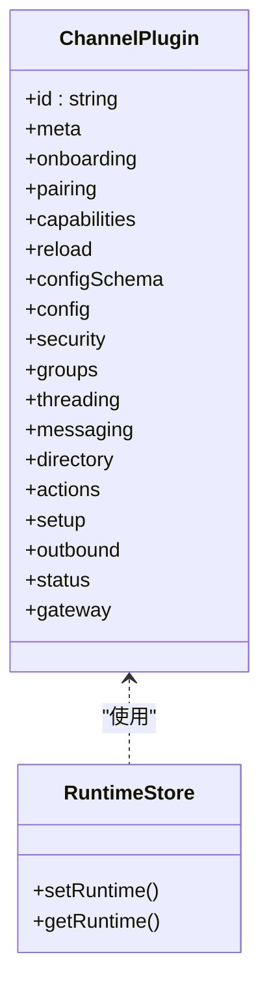
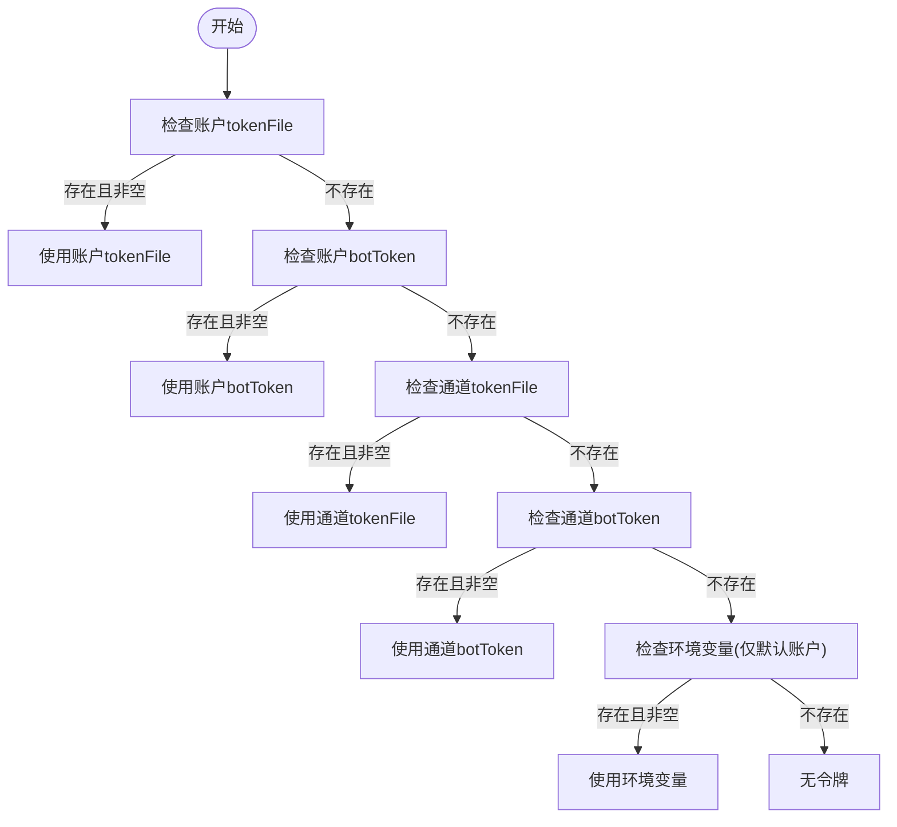
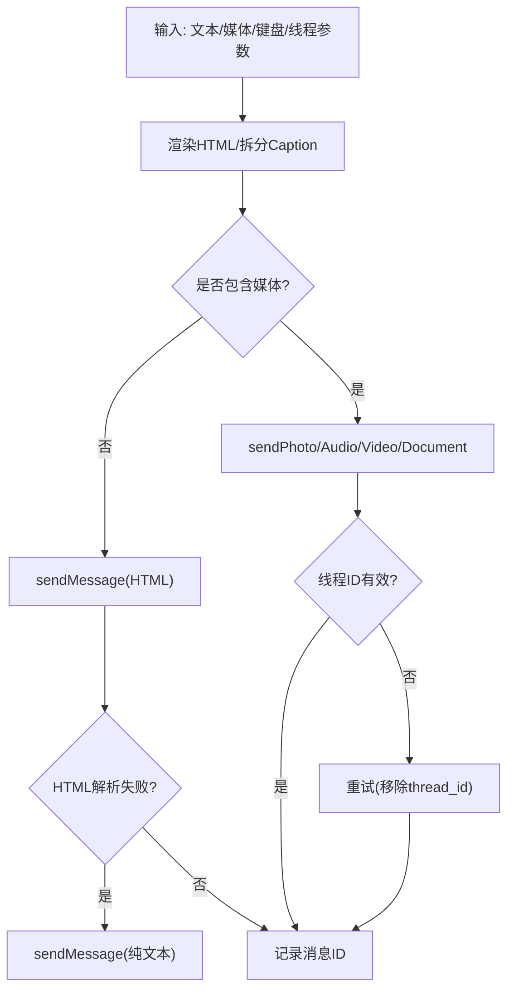
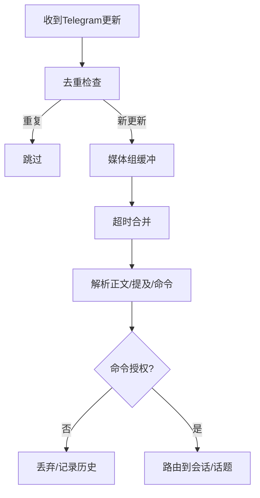
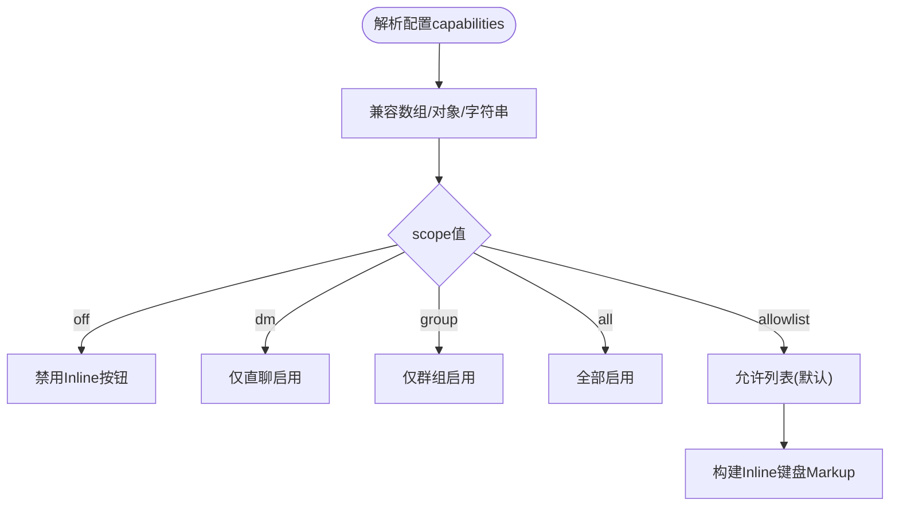
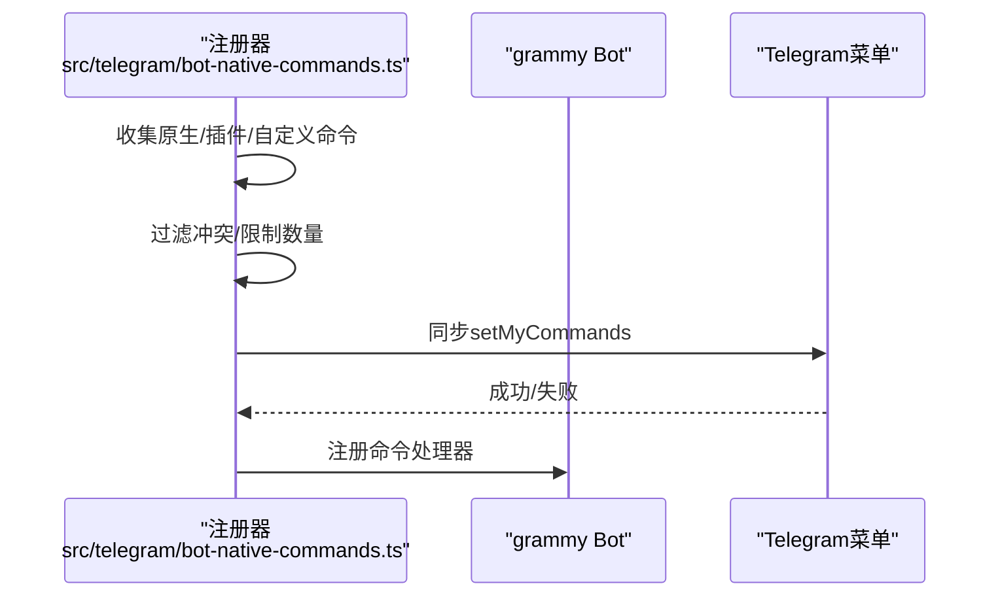
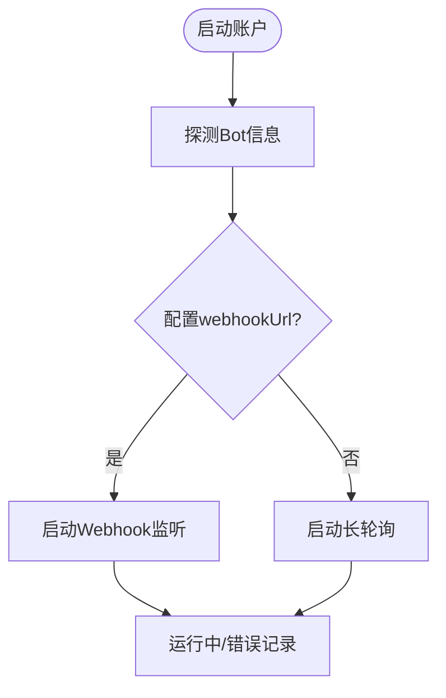
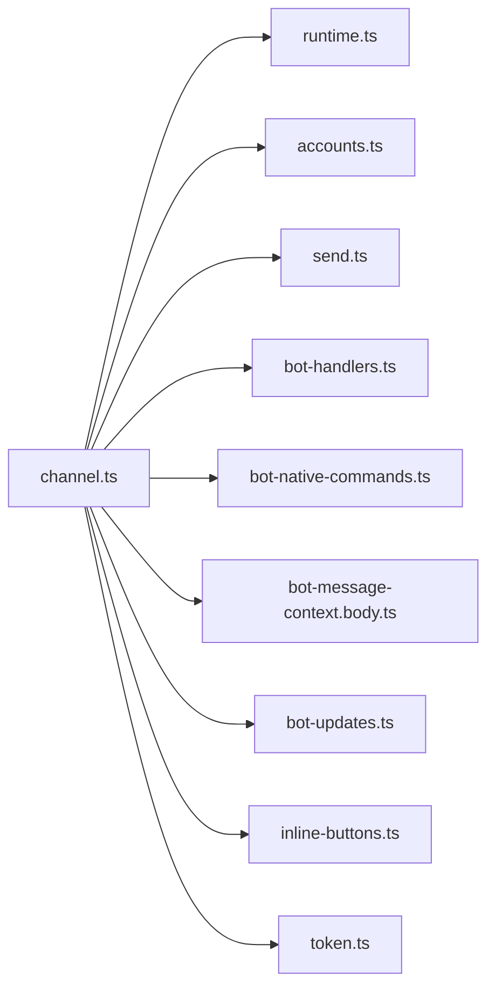

# Telegram集成

## 目录
1. [简介](#简介)
2. [项目结构](#项目结构)
3. [核心组件](#核心组件)
4. [架构总览](#架构总览)
5. [详细组件分析](#详细组件分析)
6. [依赖关系分析](#依赖关系分析)
7. [性能考虑](#性能考虑)
8. [故障排除指南](#故障排除指南)
9. [结论](#结论)
10. [附录](#附录)

## 简介
本文件面向在OpenClaw生态中集成Telegram渠道的开发者与运维人员，系统性说明Bot API的使用方式与最佳实践，涵盖Webhook配置、Inline模式、消息类型处理、键盘交互、内联查询、支付集成、游戏支持、文件上传限制等特性，并提供可直接定位到源码路径的示例片段，帮助快速落地。

## 项目结构
OpenClaw通过插件化架构将Telegram渠道作为独立扩展接入，核心由三部分组成：
- 扩展入口：负责注册通道与运行时
- 渠道实现：封装配置解析、安全策略、消息发送与接收处理
- 运行时桥接：在插件SDK与具体实现之间建立运行时接口

**图表来源**
- [extensions/telegram/index.ts](file://extensions/telegram/index.ts#L1-L18)
- [extensions/telegram/src/channel.ts](file://extensions/telegram/src/channel.ts#L1-L619)
- [extensions/telegram/src/runtime.ts](file://extensions/telegram/src/runtime.ts#L1-L7)
- [src/telegram/accounts.ts](file://src/telegram/accounts.ts#L1-L209)
- [src/telegram/inline-buttons.ts](file://src/telegram/inline-buttons.ts#L1-L68)
- [src/telegram/send.ts](file://src/telegram/send.ts#L1-L1423)
- [src/telegram/bot-handlers.ts](file://src/telegram/bot-handlers.ts#L1-L1633)
- [src/telegram/bot-native-commands.ts](file://src/telegram/bot-native-commands.ts#L1-L900)
- [src/telegram/bot-message-context.body.ts](file://src/telegram/bot-message-context.body.ts#L1-L285)
- [src/telegram/bot-updates.ts](file://src/telegram/bot-updates.ts#L1-L68)
- [src/telegram/token.ts](file://src/telegram/token.ts#L1-L110)

**章节来源**
- [extensions/telegram/index.ts](file://extensions/telegram/index.ts#L1-L18)
- [extensions/telegram/src/channel.ts](file://extensions/telegram/src/channel.ts#L1-L619)
- [extensions/telegram/src/runtime.ts](file://extensions/telegram/src/runtime.ts#L1-L7)

## 核心组件
- 通道插件：提供配置Schema、安全策略、消息发送、状态采集、网关启动等能力
- 账户与令牌：统一解析环境变量、配置文件与配置项中的令牌来源
- 发送器：封装grammy客户端、重试策略、HTML回退、线程参数、媒体分发
- 处理器：统一处理消息、编辑、回调、反应、媒体组等更新
- 原生命令：自动注册Telegram菜单命令，支持插件与自定义命令
- Inline按钮：按作用域控制Inline键盘启用范围
- 去重与媒体组：对重复更新与媒体组进行缓冲与合并

**章节来源**
- [src/telegram/accounts.ts](file://src/telegram/accounts.ts#L1-L209)
- [src/telegram/token.ts](file://src/telegram/token.ts#L1-L110)
- [src/telegram/send.ts](file://src/telegram/send.ts#L1-L1423)
- [src/telegram/bot-handlers.ts](file://src/telegram/bot-handlers.ts#L1-L1633)
- [src/telegram/bot-native-commands.ts](file://src/telegram/bot-native-commands.ts#L1-L900)
- [src/telegram/inline-buttons.ts](file://src/telegram/inline-buttons.ts#L1-L68)
- [src/telegram/bot-updates.ts](file://src/telegram/bot-updates.ts#L1-L68)

## 架构总览
下图展示了从配置到运行时、再到Bot API调用的完整链路，以及关键模块间的依赖关系。

**图表来源**
- [src/telegram/token.ts](file://src/telegram/token.ts#L1-L110)
- [extensions/telegram/src/channel.ts](file://extensions/telegram/src/channel.ts#L1-L619)
- [extensions/telegram/src/runtime.ts](file://extensions/telegram/src/runtime.ts#L1-L7)
- [src/telegram/accounts.ts](file://src/telegram/accounts.ts#L1-L209)
- [src/telegram/send.ts](file://src/telegram/send.ts#L1-L1423)
- [src/telegram/bot-handlers.ts](file://src/telegram/bot-handlers.ts#L1-L1633)

## 详细组件分析

### 通道插件与运行时
- 插件注册：通过扩展入口设置运行时并注册Telegram通道
- 运行时存储：提供全局运行时存取，供通道实现使用
- 通道能力：支持直聊/群聊/频道/话题、反应、线程、媒体、投票、原生命令、阻塞流式输出
- 安全策略：构建账户级DM策略、收集路由白名单警告
- 消息动作：适配工具动作（发送/反应/删除/编辑/主题创建）

**图表来源**
- [extensions/telegram/src/channel.ts](file://extensions/telegram/src/channel.ts#L115-L619)
- [extensions/telegram/src/runtime.ts](file://extensions/telegram/src/runtime.ts#L1-L7)

**章节来源**
- [extensions/telegram/index.ts](file://extensions/telegram/index.ts#L1-L18)
- [extensions/telegram/src/channel.ts](file://extensions/telegram/src/channel.ts#L115-L619)
- [extensions/telegram/src/runtime.ts](file://extensions/telegram/src/runtime.ts#L1-L7)

### 令牌解析与账户管理
- 令牌来源优先级：账户tokenFile > 账户botToken > 通道tokenFile > 通道botToken > 环境变量（默认账户）
- 账户合并：多账户场景下避免通道级配置继承导致的跨账户影响
- 动作门控：基于账户与通道actions配置决定可用操作

**图表来源**
- [src/telegram/token.ts](file://src/telegram/token.ts#L20-L110)
- [src/telegram/accounts.ts](file://src/telegram/accounts.ts#L108-L146)

**章节来源**
- [src/telegram/token.ts](file://src/telegram/token.ts#L1-L110)
- [src/telegram/accounts.ts](file://src/telegram/accounts.ts#L1-L209)

### 发送器与错误处理
- 客户端选项缓存：根据代理/网络配置生成缓存键，减少重复初始化
- 线程参数：自动区分DM话题与论坛话题，必要时移除thread_id进行回退
- HTML回退：当Telegram拒绝HTML解析时自动降级为纯文本
- 错误分类：线程未找到、消息未修改、聊天未找到等进行差异化处理
- 响应记录：记录已发送消息用于反应通知等场景

**图表来源**
- [src/telegram/send.ts](file://src/telegram/send.ts#L547-L800)

**章节来源**
- [src/telegram/send.ts](file://src/telegram/send.ts#L1-L1423)

### 入站消息处理与上下文
- 去重与媒体组：维护最近更新去重缓存，媒体组按超时合并
- 正文解析：提取文本、链接展开、位置信息、占位符（媒体/贴纸）、音频预转写
- 提及检测：支持显式@提及、正则匹配与服务消息隐式提及
- 命令授权：结合访问组与允许列表判断命令是否可执行

**图表来源**
- [src/telegram/bot-updates.ts](file://src/telegram/bot-updates.ts#L1-L68)
- [src/telegram/bot-message-context.body.ts](file://src/telegram/bot-message-context.body.ts#L76-L285)
- [src/telegram/bot-handlers.ts](file://src/telegram/bot-handlers.ts#L121-L800)

**章节来源**
- [src/telegram/bot-updates.ts](file://src/telegram/bot-updates.ts#L1-L68)
- [src/telegram/bot-message-context.body.ts](file://src/telegram/bot-message-context.body.ts#L1-L285)
- [src/telegram/bot-handlers.ts](file://src/telegram/bot-handlers.ts#L1-L1633)

### Inline按钮与键盘交互
- 作用域解析：支持off/dm/group/all/allowlist，默认allowlist
- 目标类型判定：根据ID正负数或前缀识别直聊/群组
- 键盘构建：过滤无效按钮，保留文本与callback_data，支持样式字段

**图表来源**
- [src/telegram/inline-buttons.ts](file://src/telegram/inline-buttons.ts#L24-L68)
- [src/telegram/inline-buttons.test.ts](file://src/telegram/inline-buttons.test.ts#L1-L38)

**章节来源**
- [src/telegram/inline-buttons.ts](file://src/telegram/inline-buttons.ts#L1-L68)
- [src/telegram/inline-buttons.test.ts](file://src/telegram/inline-buttons.test.ts#L1-L38)

### 原生命令与菜单同步
- 自动注册：列出原生命令、插件命令与自定义命令，限制最多数量
- 冲突处理：保留保留名与插件命令，自定义命令去重
- 运行时上下文：解析会话键、表格式、分块模式、回复前缀等

**图表来源**
- [src/telegram/bot-native-commands.ts](file://src/telegram/bot-native-commands.ts#L346-L900)

**章节来源**
- [src/telegram/bot-native-commands.ts](file://src/telegram/bot-native-commands.ts#L1-L900)

### Webhook配置与长轮询
- 默认模式：长轮询；可选Webhook模式
- Webhook参数：URL、密钥、路径、主机、端口、证书路径
- 监控启动：探测令牌有效性，记录运行状态与模式

**图表来源**
- [extensions/telegram/src/channel.ts](file://extensions/telegram/src/channel.ts#L517-L564)

**章节来源**
- [extensions/telegram/src/channel.ts](file://extensions/telegram/src/channel.ts#L517-L564)

## 依赖关系分析
- 通道插件依赖运行时存储与账户解析
- 发送器依赖grammy客户端、重试策略与媒体加载
- 处理器依赖去重缓存、媒体组缓冲、会话路由与命令注册
- Inline按钮依赖作用域解析与目标类型判定

**图表来源**
- [extensions/telegram/src/channel.ts](file://extensions/telegram/src/channel.ts#L1-L619)
- [extensions/telegram/src/runtime.ts](file://extensions/telegram/src/runtime.ts#L1-L7)
- [src/telegram/accounts.ts](file://src/telegram/accounts.ts#L1-L209)
- [src/telegram/send.ts](file://src/telegram/send.ts#L1-L1423)
- [src/telegram/bot-handlers.ts](file://src/telegram/bot-handlers.ts#L1-L1633)
- [src/telegram/bot-native-commands.ts](file://src/telegram/bot-native-commands.ts#L1-L900)
- [src/telegram/bot-message-context.body.ts](file://src/telegram/bot-message-context.body.ts#L1-L285)
- [src/telegram/bot-updates.ts](file://src/telegram/bot-updates.ts#L1-L68)
- [src/telegram/inline-buttons.ts](file://src/telegram/inline-buttons.ts#L1-L68)
- [src/telegram/token.ts](file://src/telegram/token.ts#L1-L110)

**章节来源**
- [extensions/telegram/src/channel.ts](file://extensions/telegram/src/channel.ts#L1-L619)
- [src/telegram/*](file://src/telegram/send.ts#L1-L1423)

## 性能考虑
- 客户端选项缓存：避免频繁重建grammy客户端
- 文本分块与表格模式：提升长文本传输效率
- 媒体组合并：降低网络请求次数
- 去重缓存：防止重复处理相同更新
- 线程回退：在话题不存在时自动移除thread_id重试

[本节为通用指导，无需特定文件引用]

## 故障排除指南
- setMyCommands失败：通常为出站DNS/HTTPS被阻断，检查网络与代理
- 聊天未找到：机器人未在私聊中启动、被移出群组/频道、群组迁移或令牌错误
- HTML解析失败：自动降级为纯文本
- 线程未找到：自动移除thread_id重试
- 反应通知：需满足反应级别与访问控制

**章节来源**
- [docs/channels/telegram.md](file://docs/channels/telegram.md#L312-L315)
- [src/telegram/send.ts](file://src/telegram/send.ts#L450-L502)
- [src/telegram/send.ts](file://src/telegram/send.ts#L323-L325)
- [src/telegram/send.ts](file://src/telegram/send.ts#L290-L292)
- [src/telegram/bot-handlers.ts](file://src/telegram/bot-handlers.ts#L745-L800)

## 结论
OpenClaw对Telegram渠道提供了生产就绪的集成方案：以插件化架构实现高内聚低耦合，借助统一的令牌解析、账户管理、发送器与处理器，覆盖消息收发、Inline交互、命令菜单、线程话题、媒体与错误处理等关键能力。通过Webhook与长轮询双模式支持，满足不同部署场景需求。

[本节为总结，无需特定文件引用]

## 附录

### 实战示例（路径定位）
- 配置令牌与DM策略
  - 示例路径：[docs/channels/telegram.md](file://docs/channels/telegram.md#L36-L47)
- Webhook模式配置
  - 示例路径：[docs/channels/telegram.md](file://docs/channels/telegram.md#L707-L718)
- Inline键盘配置
  - 示例路径：[docs/channels/telegram.md](file://docs/channels/telegram.md#L371-L387)
- 发送文本/媒体/投票
  - 示例路径：[extensions/telegram/src/channel.ts](file://extensions/telegram/src/channel.ts#L324-L429)
- 原生命令菜单同步
  - 示例路径：[src/telegram/bot-native-commands.ts](file://src/telegram/bot-native-commands.ts#L446-L452)
- Inline按钮作用域
  - 示例路径：[src/telegram/inline-buttons.ts](file://src/telegram/inline-buttons.ts#L43-L49)
- 令牌解析顺序
  - 示例路径：[src/telegram/token.ts](file://src/telegram/token.ts#L20-L110)

### Telegram特性清单与限制
- Webhook与长轮询：默认长轮询，可选Webhook
- Inline模式：支持Inline键盘，按作用域控制
- 消息类型：文本、媒体（图片/视频/音频/文档）、语音/视频消息、贴纸、反应
- 键盘交互：Inline键盘、回调查询、反应通知
- 访问控制：DM策略（配对/允许列表/开放/禁用）、群组策略与允许列表
- 文件上传限制：默认最大100MB，可通过配置调整
- 投票：支持匿名/公开投票，支持论坛话题
- 游戏与内联查询：未在当前实现中发现专用支持
- 支付集成：未在当前实现中发现专用支持

**章节来源**
- [docs/channels/telegram.md](file://docs/channels/telegram.md#L704-L762)
- [src/telegram/send.ts](file://src/telegram/send.ts#L650-L800)
- [src/telegram/bot-handlers.ts](file://src/telegram/bot-handlers.ts#L745-L800)
- [src/telegram/bot-native-commands.ts](file://src/telegram/bot-native-commands.ts#L346-L452)