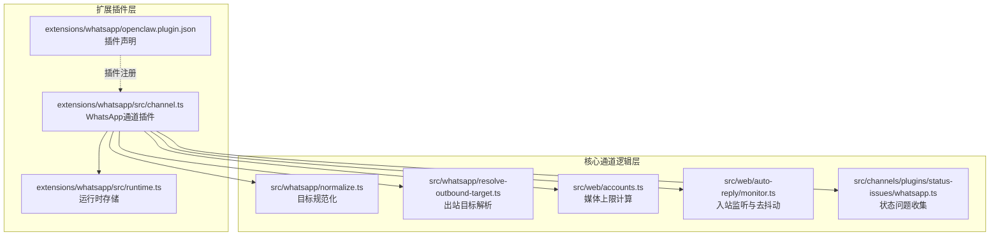
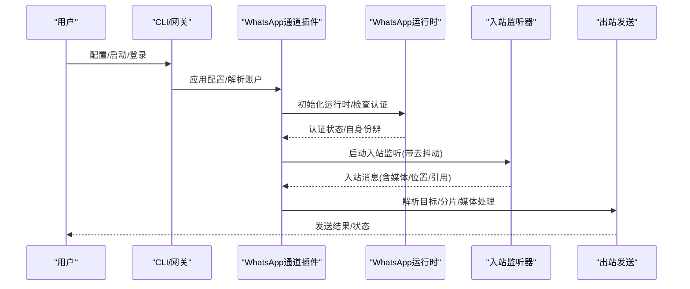
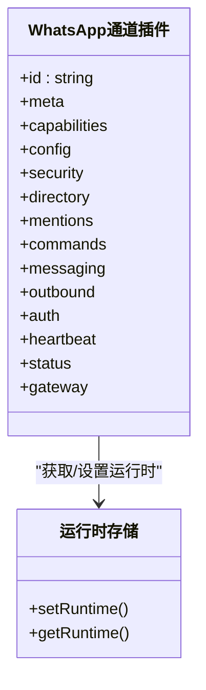
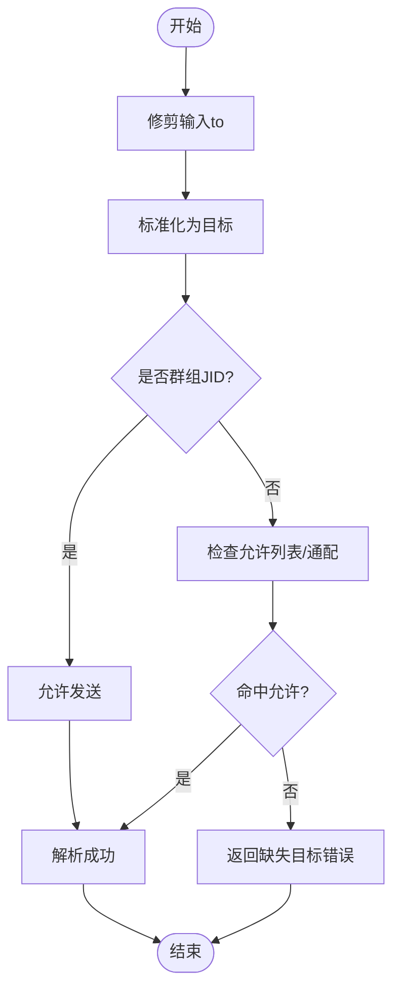
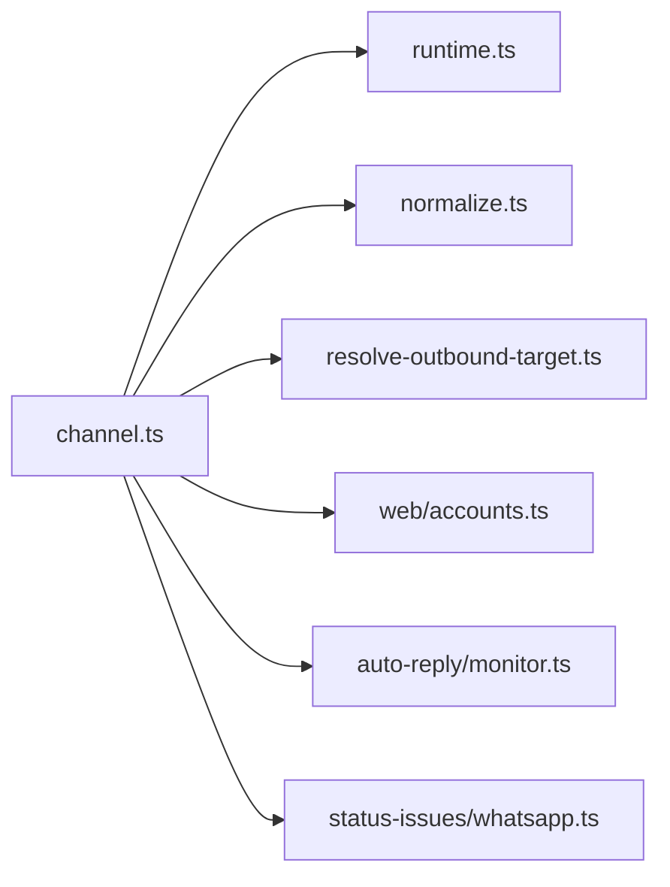

# WhatsApp集成

## 目录
1. [简介](#简介)
2. [项目结构](#项目结构)
3. [核心组件](#核心组件)
4. [架构总览](#架构总览)
5. [详细组件分析](#详细组件分析)
6. [依赖关系分析](#依赖关系分析)
7. [性能考量](#性能考量)
8. [故障排查指南](#故障排查指南)
9. [结论](#结论)
10. [附录：实现示例与最佳实践](#附录实现示例与最佳实践)

## 简介
本文件面向希望在OpenClaw中集成并使用WhatsApp业务能力的工程团队，系统性说明通道配置、消息模板、媒体处理、客户支持与状态回调等关键环节，并给出可落地的实现步骤与排错建议。文档严格基于仓库现有实现与文档进行归纳总结，避免臆测。

## 项目结构
WhatsApp通道由“扩展插件”和“核心通道逻辑”两部分组成：
- 扩展插件层：负责将WhatsApp作为聊天通道接入OpenClaw的配置、认证、心跳、状态收集、动作执行与出站发送等能力。
- 核心通道逻辑层：提供目标规范化、出站目标解析、媒体大小限制计算、入站去抖动策略等通用能力。

图表来源
- [extensions/whatsapp/src/channel.ts](file://extensions/whatsapp/src/channel.ts#L1-L474)
- [extensions/whatsapp/src/runtime.ts](file://extensions/whatsapp/src/runtime.ts#L1-L7)
- [extensions/whatsapp/openclaw.plugin.json](file://extensions/whatsapp/openclaw.plugin.json#L1-L10)
- [src/whatsapp/normalize.ts](file://src/whatsapp/normalize.ts#L1-L81)
- [src/whatsapp/resolve-outbound-target.ts](file://src/whatsapp/resolve-outbound-target.ts#L1-L53)
- [src/web/accounts.ts](file://src/web/accounts.ts#L152-L166)
- [src/web/auto-reply/monitor.ts](file://src/web/auto-reply/monitor.ts#L181-L216)
- [src/channels/plugins/status-issues/whatsapp.ts](file://src/channels/plugins/status-issues/whatsapp.ts#L1-L42)

章节来源
- [extensions/whatsapp/src/channel.ts](file://extensions/whatsapp/src/channel.ts#L1-L474)
- [extensions/whatsapp/src/runtime.ts](file://extensions/whatsapp/src/runtime.ts#L1-L7)
- [extensions/whatsapp/openclaw.plugin.json](file://extensions/whatsapp/openclaw.plugin.json#L1-L10)
- [src/whatsapp/normalize.ts](file://src/whatsapp/normalize.ts#L1-L81)
- [src/whatsapp/resolve-outbound-target.ts](file://src/whatsapp/resolve-outbound-target.ts#L1-L53)
- [src/web/accounts.ts](file://src/web/accounts.ts#L152-L166)
- [src/web/auto-reply/monitor.ts](file://src/web/auto-reply/monitor.ts#L181-L216)
- [src/channels/plugins/status-issues/whatsapp.ts](file://src/channels/plugins/status-issues/whatsapp.ts#L1-L42)

## 核心组件
- 通道插件：定义WhatsApp通道的元信息、能力、配置模式、安全策略、目录、动作、出站发送、认证登录、心跳与状态汇总等。
- 运行时存储：通过统一的运行时存储器挂载WhatsApp运行时，供插件方法调用。
- 目标规范化与出站解析：对用户输入的目标进行标准化（含群组JID与E.164），并结合允许列表进行校验。
- 媒体上限与入站去抖动：根据账户配置计算媒体大小上限；对纯文本、非回复类消息设置入站去抖动阈值。
- 状态问题收集：对“未链接/断连/重连次数过多”等异常进行归类与上报。

章节来源
- [extensions/whatsapp/src/channel.ts](file://extensions/whatsapp/src/channel.ts#L43-L474)
- [extensions/whatsapp/src/runtime.ts](file://extensions/whatsapp/src/runtime.ts#L1-L7)
- [src/whatsapp/normalize.ts](file://src/whatsapp/normalize.ts#L1-L81)
- [src/whatsapp/resolve-outbound-target.ts](file://src/whatsapp/resolve-outbound-target.ts#L1-L53)
- [src/web/accounts.ts](file://src/web/accounts.ts#L152-L166)
- [src/web/auto-reply/monitor.ts](file://src/web/auto-reply/monitor.ts#L181-L216)
- [src/channels/plugins/status-issues/whatsapp.ts](file://src/channels/plugins/status-issues/whatsapp.ts#L30-L42)

## 架构总览
下图展示了从配置到运行时、从入站到出站的关键交互：

图表来源
- [extensions/whatsapp/src/channel.ts](file://extensions/whatsapp/src/channel.ts#L332-L474)
- [src/web/auto-reply/monitor.ts](file://src/web/auto-reply/monitor.ts#L181-L216)
- [src/whatsapp/resolve-outbound-target.ts](file://src/whatsapp/resolve-outbound-target.ts#L8-L53)

章节来源
- [extensions/whatsapp/src/channel.ts](file://extensions/whatsapp/src/channel.ts#L332-L474)
- [src/web/auto-reply/monitor.ts](file://src/web/auto-reply/monitor.ts#L181-L216)

## 详细组件分析

### 通道插件（channel.ts）
- 能力与特性
  - 支持直聊与群聊、投票、反应、媒体。
  - 出站采用“网关投递”模式，文本分片长度默认4000字符。
  - 动作支持“反应”，可通过动作门控开启/关闭。
- 配置与Schema
  - 使用构建好的通道配置Schema，支持多账户、账户级覆盖。
  - 插件声明文件声明该插件支持的通道键。
- 安全与访问控制
  - 基于账户作用域的DM策略与允许列表，支持“配对/白名单/开放/禁用”。
  - 群组层面有“成员白名单”和“发件人策略（开放/白名单/禁用）”。
- 目录与会话
  - 自身身份读取、联系人与群组目录查询。
  - 群聊提及规则、工具策略与介绍提示可解析。
- 出站发送
  - 文本/媒体/投票三类发送接口，均透传账户ID与配置。
  - 目标解析严格校验，群组与个人号分别处理。
- 认证与心跳
  - 支持Web QR登录流程与心跳检查。
  - 心跳检查包含“是否启用Web、是否已链接、是否有活动监听”。

图表来源
- [extensions/whatsapp/src/channel.ts](file://extensions/whatsapp/src/channel.ts#L43-L474)
- [extensions/whatsapp/src/runtime.ts](file://extensions/whatsapp/src/runtime.ts#L1-L7)

章节来源
- [extensions/whatsapp/src/channel.ts](file://extensions/whatsapp/src/channel.ts#L43-L474)
- [extensions/whatsapp/openclaw.plugin.json](file://extensions/whatsapp/openclaw.plugin.json#L1-L10)

### 目标规范化与出站解析
- 规范化
  - 支持去除前缀的“whatsapp:”、识别群组JID（以@g.us结尾）、识别用户JID（s.whatsapp.net或@lid）。
  - 用户JID提取手机号并进行E.164标准化。
- 出站目标解析
  - 对to进行修剪与标准化；群组直接放行；个人号需命中允许列表或通配。
  - 不合规目标返回缺失目标错误。

图表来源
- [src/whatsapp/normalize.ts](file://src/whatsapp/normalize.ts#L55-L80)
- [src/whatsapp/resolve-outbound-target.ts](file://src/whatsapp/resolve-outbound-target.ts#L8-L53)

章节来源
- [src/whatsapp/normalize.ts](file://src/whatsapp/normalize.ts#L1-L81)
- [src/whatsapp/resolve-outbound-target.ts](file://src/whatsapp/resolve-outbound-target.ts#L1-L53)

### 媒体处理与大小限制
- 媒体上限
  - 通过账户配置计算字节上限，默认单位为MB，内部转换为字节。
- 发送行为
  - 支持图片、视频、音频（含PTT语音）、文档；音频ogg自动修正编解码以兼容PTT。
  - 多媒体回复时，标题应用于首个媒体项。
  - 媒体来源支持HTTP(S)/file:///本地路径。
- 失败回退
  - 发送失败时优先首项回退为文本警告，避免静默丢弃。

章节来源
- [src/web/accounts.ts](file://src/web/accounts.ts#L152-L166)
- [docs/channels/whatsapp.md](file://docs/channels/whatsapp.md#L292-L316)
- [src/infra/outbound/deliver.test.ts](file://src/infra/outbound/deliver.test.ts#L153-L187)

### 入站监听与去抖动
- 去抖动策略
  - 对非媒体、非位置、非回复消息且不含控制命令时启用去抖动。
  - 入站消息到达后更新状态时间戳并触发处理。
- 读回执
  - 默认开启读回执；支持全局与账户级关闭；自聊回合跳过读回执。

章节来源
- [src/web/auto-reply/monitor.ts](file://src/web/auto-reply/monitor.ts#L181-L216)
- [docs/channels/whatsapp.md](file://docs/channels/whatsapp.md#L256-L289)

### 状态回调与问题收集
- 心跳检查
  - 检查Web开关、认证存在性、活动监听是否存在。
- 状态汇总
  - 包含链接状态、运行状态、连接状态、重连次数、最近事件时间、最近错误等。
- 问题收集
  - 将“未链接”“断连且重连次数>0”等状态归类为问题并给出提示。

章节来源
- [extensions/whatsapp/src/channel.ts](file://extensions/whatsapp/src/channel.ts#L343-L364)
- [src/channels/plugins/status-issues/whatsapp.ts](file://src/channels/plugins/status-issues/whatsapp.ts#L30-L42)

## 依赖关系分析
- 插件与运行时
  - 通道插件通过运行时存储获取实际运行时能力（登录、监听、发送、动作等）。
- 插件与核心逻辑
  - 依赖目标规范化与出站解析模块，确保发送前目标合法。
  - 依赖账户配置解析与媒体上限计算，保障发送合规。
- 插件与监控
  - 依赖入站监听器提供的去抖动与状态更新能力。

图表来源
- [extensions/whatsapp/src/channel.ts](file://extensions/whatsapp/src/channel.ts#L1-L474)
- [extensions/whatsapp/src/runtime.ts](file://extensions/whatsapp/src/runtime.ts#L1-L7)
- [src/whatsapp/normalize.ts](file://src/whatsapp/normalize.ts#L1-L81)
- [src/whatsapp/resolve-outbound-target.ts](file://src/whatsapp/resolve-outbound-target.ts#L1-L53)
- [src/web/accounts.ts](file://src/web/accounts.ts#L152-L166)
- [src/web/auto-reply/monitor.ts](file://src/web/auto-reply/monitor.ts#L181-L216)
- [src/channels/plugins/status-issues/whatsapp.ts](file://src/channels/plugins/status-issues/whatsapp.ts#L1-L42)

章节来源
- [extensions/whatsapp/src/channel.ts](file://extensions/whatsapp/src/channel.ts#L1-L474)
- [extensions/whatsapp/src/runtime.ts](file://extensions/whatsapp/src/runtime.ts#L1-L7)
- [src/whatsapp/normalize.ts](file://src/whatsapp/normalize.ts#L1-L81)
- [src/whatsapp/resolve-outbound-target.ts](file://src/whatsapp/resolve-outbound-target.ts#L1-L53)
- [src/web/accounts.ts](file://src/web/accounts.ts#L152-L166)
- [src/web/auto-reply/monitor.ts](file://src/web/auto-reply/monitor.ts#L181-L216)
- [src/channels/plugins/status-issues/whatsapp.ts](file://src/channels/plugins/status-issues/whatsapp.ts#L1-L42)

## 性能考量
- 文本分片
  - 默认4000字符，支持按长度或换行分段，优先段落边界减少截断。
- 媒体优化
  - 图片自动优化以满足上限；发送失败时首项回退为文本，避免大消息丢失。
- 去抖动
  - 对纯文本消息去抖动，降低重复触发与资源消耗。
- 读回执
  - 默认开启，有助于确认送达；可按需关闭以减少往返。

章节来源
- [docs/channels/whatsapp.md](file://docs/channels/whatsapp.md#L292-L316)
- [src/web/auto-reply/monitor.ts](file://src/web/auto-reply/monitor.ts#L181-L216)

## 故障排查指南
- 未链接（需扫码）
  - 症状：通道状态报告未链接。
  - 处理：执行登录命令并再次检查状态。
- 已链接但断连/重连循环
  - 症状：反复断开/重连。
  - 处理：运行诊断命令与日志跟踪；必要时重新登录。
- 发送时无活动监听
  - 症状：出站发送失败。
  - 处理：确保网关运行且账户已链接。
- 群消息被忽略
  - 排查顺序：群策略、发件人允许列表、群白名单、提及要求、配置重复键覆盖。
- Bun运行时警告
  - WhatsApp网关运行应使用Node；Bun不兼容稳定运行。

章节来源
- [docs/channels/whatsapp.md](file://docs/channels/whatsapp.md#L374-L424)

## 结论
OpenClaw对WhatsApp提供了完整的通道集成能力：从配置、认证、心跳、状态收集到出站发送与媒体处理均有明确实现与文档支撑。通过目标规范化、出站解析与去抖动策略，系统在保证合规的同时提升了稳定性与用户体验。建议在生产环境中结合账户级配置与动作门控，配合状态监控与排障流程，确保长期稳定运行。

## 附录：实现示例与最佳实践
以下示例仅给出“步骤与要点”的路径指引，避免直接粘贴代码内容。请在对应文件中查看具体实现细节。

- 配置与登录
  - 参考通道文档中的快速设置与部署模式，完成访问策略与QR登录。
  - 参考：[docs/channels/whatsapp.md](file://docs/channels/whatsapp.md#L24-L76)

- 多账户与凭据
  - 参考多账户与凭据路径、迁移与登出行为。
  - 参考：[docs/channels/whatsapp.md](file://docs/channels/whatsapp.md#L343-L364)

- 出站发送（文本/媒体/投票）
  - 参考通道插件的sendText/sendMedia/sendPoll实现与目标解析。
  - 参考：[extensions/whatsapp/src/channel.ts](file://extensions/whatsapp/src/channel.ts#L286-L331)，[src/whatsapp/resolve-outbound-target.ts](file://src/whatsapp/resolve-outbound-target.ts#L8-L53)

- 媒体处理与回退
  - 参考媒体上限计算、类型兼容与失败回退策略。
  - 参考：[src/web/accounts.ts](file://src/web/accounts.ts#L152-L166)，[docs/channels/whatsapp.md](file://docs/channels/whatsapp.md#L292-L316)，[src/infra/outbound/deliver.test.ts](file://src/infra/outbound/deliver.test.ts#L153-L187)

- 入站去抖动与读回执
  - 参考入站监听器的去抖动策略与读回执开关。
  - 参考：[src/web/auto-reply/monitor.ts](file://src/web/auto-reply/monitor.ts#L181-L216)，[docs/channels/whatsapp.md](file://docs/channels/whatsapp.md#L256-L289)

- 状态回调与问题收集
  - 参考心跳检查与状态汇总，以及问题收集逻辑。
  - 参考：[extensions/whatsapp/src/channel.ts](file://extensions/whatsapp/src/channel.ts#L343-L406)，[src/channels/plugins/status-issues/whatsapp.ts](file://src/channels/plugins/status-issues/whatsapp.ts#L30-L42)

- 模板变量与媒体理解
  - 参考媒体模型模板变量，用于媒体理解与提示词扩展。
  - 参考：[docs/gateway/configuration-reference.md](file://docs/gateway/configuration-reference.md#L2926-L2952)